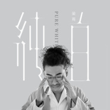

纯白
============================

|  |  |
| :--: | :-- |
| [ 纯白](https://emumo.xiami.com/album/2104764099) | **艺人**: [梁雨](../index.md) **语种**: 国语 **唱片公司**: 淳music **发行时间**: 2019年04月14日 **专辑类别**: EP, 单曲 **专辑风格**: 国语流行 Mandarin Pop **播放数**: 86812 **收藏数**: 1 **评论数**: 2  |

## 简介

人一旦变了，一切都回不去了  
我们不怕受伤和付出，只怕你的“认真”是游戏一场  
一首《纯白》，梁雨用慵懒、悲伤的嗓音讲述着一个人柔软、脆弱的内心，在迷失的道路上指引了一段方向，要记住受了伤，也别急着彷徨，还有曾想去的最美的地方  
 

## 曲目

## 评论

|  |  |  |  |
| :-- | :-- | :-- | :-- |
|  [虾米用户](https://emumo.xiami.com/u/194864941) 人懒，目前没想写什么。 2019-04-15 06:40 赞(0) 踩(0) | 
支持
 |
|  [虾米用户](https://emumo.xiami.com/u/329132255) 事在人为 2019-04-14 11:30 赞(0) 踩(0) | 
支持你
 |
