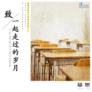

梁雨
============================

|  |  |
| :--: | :-- |
| [ 梁雨](https://i.xiami.com/liangyu) | **播放数**: 1085107 **粉丝数**: 156 **评论数**: 22 **地区**: China 中国大陆 **风格**: 独立流行 Indie Pop, 独立民谣 Indie Folk, 华语唱作人 Chinese Singer-Songwriter  |

## 档案

内地新生代音乐人 他拥有清新的嗓音、迷人的声线以及惊人的创作天赋。 他不是著名歌手，不是偶像 他是集词曲为一身的音乐人 他是一个用生命来创作的“音乐疯子” 他多年曲折的幕后创作自己开辟了一条神秘的音乐之路 他的音乐风格没听过的人难以想象 他的曲风上具有内在的气质令人意犹未尽的回味 他的声音赋有民族的味道和空灵的声线  他用真情诠释每一首作品

## 专辑

| 名称 | 语种 | 唱片公司 | 发行时间 | 专辑类别 | 专辑风格 |
| :--: | :-- | :-- | :-- | :-- | :-- |
| [ 梦想的勋章（央视大型少儿活动宣传曲）](./albums/5022492930.md) | 国语 | 淳music | 2021年01月18日 | EP, 单曲 | 国语流行 Mandarin Pop |
| [ 梁雨LIVE](./albums/2105753516.md) | 国语 | 淳music | 2020年01月22日 | EP, 单曲 | 国语流行 Mandarin Pop |
| [ 割舍](./albums/2104982829.md) | 国语 | 淳music | 2019年07月13日 | EP, 单曲 |  |
| [ 致一起走过的岁月](./albums/2104970881.md) | 国语 | 淳music | 2019年07月05日 | EP, 单曲 |  |
| [ 有你的城市](./albums/2104823562.md) | 国语 | 淳music | 2019年04月29日 | EP, 单曲 |  |
| [ 纯白](./albums/2104764099.md) | 国语 | 淳music | 2019年04月14日 | EP, 单曲 | 国语流行 Mandarin Pop |
| [ 翅膀](./albums/2104426977.md) | 国语 | 淳music | 2018年12月31日 | EP, 单曲 | 国语流行 Mandarin Pop |
| [ 陈朵](./albums/2104330445.md) | 国语 | 淳music | 2018年12月07日 | EP, 单曲 | 国语流行 Mandarin Pop |
| [ 爱也会哭](./albums/2103896363.md) | 国语 | 淳music | 2018年08月07日 | EP, 单曲 |  |
| [ 还有我](./albums/2103745622.md) | 国语 | 淳music | 2018年06月12日 | EP, 单曲 |  |
| [ 单程](./albums/535567.md) | 国语 | 淳music | 2014年02月28日 | 精选集 | 国语流行 Mandarin Pop, 华语唱作人 Chinese Singer-Songwriter |

## 评论

|  |  |  |  |
| :-- | :-- | :-- | :-- |
|  [虾米用户](https://emumo.xiami.com/u/425206898)  2020-01-12 23:45 赞(0) 踩(0) | 
昨晚见到本人，声音真的好听
 |
|  [虾米用户](https://emumo.xiami.com/u/337819228)  2019-08-08 18:30 赞(1) 踩(0) | 
我好像发现了宝藏！
 |
|  [虾米用户](https://emumo.xiami.com/u/261594922) 一杯酒，一首歌，一个人.... 2019-08-02 11:16 赞(0) 踩(0) | 
加油↖(^ω^)↗
 |
|  [虾米用户](https://emumo.xiami.com/u/335249234) 每个人生来就是君王，但大... 2019-03-06 18:55 赞(1) 踩(0) | 
加油啊！英雄。 
 |
|  [虾米用户](https://emumo.xiami.com/u/378268735)  2018-07-26 13:55 赞(1) 踩(0) | 
听声音以为是个小鲜肉，看图片才发现是个有故事的人，很好听，有特色，有辨识度，有故事，喜欢这首还有雨，深情
 |
|  [虾米用户](https://emumo.xiami.com/u/122688364) 生在愤坑，长在赤圈；挣脱 2016-10-10 23:23 赞(0) 踩(0) | 
4520
 |
|  [虾米用户](https://emumo.xiami.com/u/72666568)  2016-06-21 21:29 赞(0) 踩(0) | 
期待梦想实现。
 |
|  [虾米用户](https://emumo.xiami.com/u/34353908) 穷写小说的。 2016-02-06 13:07 赞(0) 踩(0) | 
开口跪 惊艳的声线让我觉得挖到宝了
 |
|  [虾米用户](https://emumo.xiami.com/u/74210502)  2015-10-16 18:21 赞(1) 踩(0) | 
爱你的催眠！ 
 |
|  [虾米用户](https://emumo.xiami.com/u/35313495)  2015-10-06 20:13 赞(1) 踩(0) | 
喜欢你翻唱王菲的那首 催眠
 |
|  [虾米用户](https://emumo.xiami.com/u/39758944) begin again~ 2015-10-05 06:10 赞(0) 踩(0) | 
喜欢你的声音！
 |
|  [虾米用户](https://emumo.xiami.com/u/47824247)  2015-03-09 15:10 赞(0) 踩(0) | 
第一次听《三声界》感觉很平静，用全新的音乐方式来诠释人声and人生！支持！！
 |
|  [虾米用户](https://emumo.xiami.com/u/47824247)  2015-03-09 15:07 赞(0) 踩(0) | 
第一次听《三声界》，第一感就是诠释挺多意义，又听了几次之后完全觉的内心很平静很放松，一点不次有梵音。。
 |
|  [虾米用户](https://emumo.xiami.com/u/38791900)  2015-03-09 14:59 赞(0) 踩(0) | 
独特曲风
 |
|  [虾米用户](https://emumo.xiami.com/u/38791900)  2015-03-09 12:56 赞(0) 踩(0) | 
三生界，超喜欢！！非常独特的曲风。好听
 |
|  [虾米用户](https://emumo.xiami.com/u/49222)  2014-12-01 19:16 赞(1) 踩(0) | 
看Hi歌，发现梁雨的几首都不错呀！请问：谁知道他在《纯白》时自我介绍时放的背景歌曲是哪首？
 |
|  [虾米用户](https://emumo.xiami.com/u/3343777)  2014-12-01 06:23 赞(0) 踩(0) | 
《景色》那首歌好好听，收录到虾米吧
 |
|  [虾米用户](https://emumo.xiami.com/u/18598872) 始终不聪明 2014-03-05 17:30 赞(1) 踩(0) | 
喜欢纪念爱
 |
| ⇒ |  [虾米用户](https://emumo.xiami.com/u/343357324)  2018-10-21 22:41 赞(0) 踩(0) | 
同感。
 |
|  [虾米用户](https://emumo.xiami.com/u/30326995)  2014-02-28 02:23 赞(2) 踩(0) | 
我刚入驻了虾米音乐人，欢迎大家来我的个人主页，收听我的最新音乐
 |
| ⇒ |  [虾米用户](https://emumo.xiami.com/u/21583291)  2015-10-03 22:32 赞(0) 踩(0) | 
刚刚通过《歌手是谁》听到你的声音，太牛了！我喜欢！有故事的声线和调调
 |
| ⇒ |  [虾米用户](https://emumo.xiami.com/u/329132255) 事在人为 2019-04-07 13:58 赞(0) 踩(0) | 
火起来吧
 |
