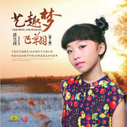

《艺趣梦飞翔》第二季艺趣音乐
============================

|  |  |
| :--: | :-- |
| [ 《艺趣梦飞翔》第二季艺趣音乐](https://emumo.xiami.com/album/2100266696) | **艺人**: [厉智敏](../index.md) **语种**: 国语 **唱片公司**: 中国唱片深圳公司 **发行时间**: 2016年01月11日 **专辑类别**: 录音室专辑 **专辑风格**: 青少年流行 Teen Pop, 国语流行 Mandarin Pop, 电音流行 Electropop **播放数**: 165511 **收藏数**: 4 **评论数**: 2  |

## 简介

 
 

歌手：潘昱瑾&nbsp;
 

《艺趣梦飞翔》第二季
 

序
 

可爱的艺趣精灵
 

而今徜徉于天籁之间
 

用最纯真的歌声吟唱
 

诠释着最美丽的童年
 

爱校园，爱家人，爱老师，爱同学，爱书籍，
 

爱生活，热爱生命的每一个瞬间。
 

《红蜻蜓》是童年美好的记忆；
 

《幼幼PARTY》是青春活力的追逐；
 

……
 

花种紧握在你们手里
 

待到秋收
 

你们必在童年开出一片美丽！
 

每一朵花都不会无故绽放
 

浸润了准备和等待
 

才会华丽绽放
 

所以，你们纯真质朴的嗓音
 

在这个原本就不完美的世界
 

显得愈发弥足珍贵
 

即便不是最优秀
 

坚持你所梦想的
 

你所引吭高歌的就会是泉水叮咚的天籁之声！
 

 

## 曲目

## 评论

|  |  |  |
| :-- | :-- | :-- |
|  [虾米用户](https://emumo.xiami.com/u/227776414)  2020-04-27 16:17 赞(0) 踩(0) | 
好好听啊
 |
|  [虾米用户](https://emumo.xiami.com/u/101813370) 音乐无界 2016-01-30 08:01 赞(0) 踩(0) | 
不错
 |
