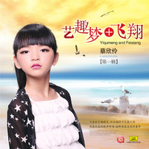

厉智敏
============================

|  |  |
| :--: | :-- |
| [ 厉智敏](https://i.xiami.com/eachtv) | **播放数**: 3810393 **粉丝数**: 177 **评论数**: 6 **地区**: China 中国大陆 **风格**: 国语流行 Mandarin Pop  |

## 档案

厉智敏,流行音乐制作人,温州市音乐家协会流行音乐学会会长,歌曲《朋友的心》原唱 
1993年厉智敏以一首《小小鸟》荣获“93’华东六省一市青年歌手大赛”金奖从此走上了职业歌手的生涯.那年他才19岁. 
1994年身为酒吧歌手的厉智敏，因为一次偶然,参加了“94’上海国际艺术节”，并一举夺魁，获得通俗组的冠军,从而签约上海歌星俱乐部. 
1995年著名音乐人高枫为他量身定做歌曲《朋友的心》,使他有了第一首原创歌曲,凭借《朋友的心》他获得了“95’中国音乐电视大赛”银奖. 
2000年他创作并演唱的军旅歌曲《盼》，获得了全军战士文艺奖的金奖. 
2000同年还担任世纪之交曙光节主题歌《东方》的创作和演唱

## 专辑

| 名称 | 语种 | 唱片公司 | 发行时间 | 专辑类别 | 专辑风格 |
| :--: | :-- | :-- | :-- | :-- | :-- |
| [ 为你花开华派装饰企业歌](./albums/2104145428.md) | 国语 | 独立发行 | 2018年10月01日 | EP, 单曲 | 流行 Pop, 国语流行 Mandarin Pop |
| [ 温州童谣又唱叮叮当](./albums/2103560850.md) | 国语 | 回声文化 | 2018年02月05日 | EP, 单曲 | 电音流行 Electropop, 电子 Electronic |
| [ 不忘初心](./albums/2102872178.md) | 国语 | 独立发行 | 2017年10月12日 | EP, 单曲 | 国语流行 Mandarin Pop |
| [ 梦幻地带-致温州市五水共治建设大美温州](./albums/2102797301.md) | 国语 | 独立发行 | 2017年07月10日 | EP, 单曲 | 流行 Pop |
| [ 爱上林妹妹艺趣音乐](./albums/2102779194.md) | 国语 | 独立发行 | 2017年07月07日 | EP, 单曲 | 电子 Electronic |
| [ 爱上林妹妹爱上林妹妹-情景版](./albums/2102779196.md) | 国语 | 回声文化 | 2017年07月07日 | EP, 单曲 | 电子 Electronic |
| [ 奇迹会出现华人兄弟](./albums/2102744880.md) | 国语 | 独立发行 | 2017年05月01日 | EP, 单曲 | 流行 Pop |
| [ 圣拉维之恋艺趣音乐](./albums/2102745381.md) | 国语 | 独立发行 | 2017年05月01日 | EP, 单曲 | 流行 Pop |
| [ 厉智敏《迷途2015》艺趣音乐](./albums/2102704254.md) | 国语 | 独立发行 | 2017年03月01日 | 录音室专辑 | 流行 Pop |
| [ 今夜你在哪里厉智敏](./albums/2102403116.md) | 国语 | 温州音协流行音乐学会 | 2016年09月26日 | EP, 单曲 |  |
| [ 老船-凯琳温州音协流行音乐学会](./albums/2100378608.md) | 国语 | 温州音协流行音乐学会 | 2016年08月06日 | EP, 单曲 |  |
| [ 成长吧！宝贝温州音协儿童音乐协会](./albums/2100371617.md) | 国语 |  | 2016年07月23日 | EP, 单曲 |  |
| [ 凯琳凯琳](./albums/2100310070.md) | 国语 | 温州音协流行音乐学会 | 2016年04月10日 | 录音室专辑 | 国语流行 Mandarin Pop |
| [ 迷途2015艺趣音乐](./albums/558231.md) | 国语 | 义乌美羊文化 | 2016年01月22日 | 录音室专辑 | 国语流行 Mandarin Pop |
| [ 《艺趣梦飞翔》第二季艺趣音乐](./albums/2100266696.md) | 国语 | 中国唱片深圳公司 | 2016年01月11日 | 录音室专辑 | 青少年流行 Teen Pop, 国语流行 Mandarin Pop, 电音流行 Electropop |
| [ 《艺趣梦飞翔》第一季艺趣音乐](./albums/2100268380.md) | 国语 | 中国唱片深圳公司 | 2016年01月11日 | 录音室专辑 | 氛围音乐 Ambient, 国语流行 Mandarin Pop |

## 评论

|  |  |  |  |
| :-- | :-- | :-- | :-- |
|  [虾米用户](https://emumo.xiami.com/u/298749302) 每天听歌是我最没好的时光 2018-12-28 15:58 赞(2) 踩(0) | 
我们真的老了，别不服
 |
|  [虾米用户](https://emumo.xiami.com/u/101813370) 音乐无界 2017-07-10 13:18 赞(0) 踩(0) | 
分享  厉智敏 的歌曲《爱上林妹妹(情景版)》<a href="https://www.xiami.com/song/1796062016?_uxid=834E3269F0FE618C1631C5B60A5CF932" target="_blank" rel="nofollow noreferrer noopener">https://www.xiami.com/song/1796062016?_uxid=834E3269F0FE618C1631C5B60A5CF932</a> (分享自@虾米音乐)
 |
|  [虾米用户](https://emumo.xiami.com/u/9003931) 千淘万漉虽辛苦 2017-02-28 22:26 赞(2) 踩(0) | 
原来《朋友的心》原唱在这里。
 |
| ⇒ |  [虾米用户](https://emumo.xiami.com/u/101813370) 音乐无界 2017-07-10 13:18 赞(0) 踩(0) | 
分享  厉智敏 的歌曲《爱上林妹妹(情景版)》<a href="https://www.xiami.com/song/1796062016?_uxid=834E3269F0FE618C1631C5B60A5CF932" target="_blank" rel="nofollow noreferrer noopener">https://www.xiami.com/song/1796062016?_uxid=834E3269F0FE618C1631C5B60A5CF932</a> (分享自@虾米音乐)
 |
|  [虾米用户](https://emumo.xiami.com/u/16135450)  2016-09-25 14:27 赞(2) 踩(0) | 
4049
 |
|  [虾米用户](https://emumo.xiami.com/u/44700250)  2015-04-18 00:05 赞(1) 踩(0) | 
喜欢你
 |
