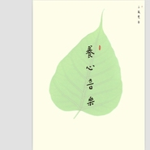

养心音乐 (高清版)
============================

|  |  |
| :--: | :-- |
| [ 养心音乐 (高清版)](https://emumo.xiami.com/album/1978816675) | **艺人**: [三藏梵音](../index.md) **语种**: 国语 **唱片公司**: 三藏梵音工作坊 **发行时间**: 2012年09月09日 **专辑类别**: 录音室专辑 **专辑风格**: 新古典新世纪 Neoclassical New Age **播放数**: 797439 **收藏数**: 1016 **评论数**: 34  |

## 简介

想要了解更多三藏梵音的内容，请关注“三藏梵音”微信公众号  
  
真诚的邀请你来体验这一奇妙的音乐静心之旅，也许只需要5分钟就可以让你在忙碌的现代生活中透一口气。你会发现，心平静，心清安，其实很简单。  
首先请让自己舒服的坐着，深深的十次呼吸。桌前一杯茶，抛开所有的繁杂，打开音响，闭上眼睛，安安静静的，安安静静的聆听。在听每一首歌之前，请跟随提示，调整自己，换一种全新的心态去聆听。不仅是被动的欣赏，更希望你主动的想象，让你的人生经历与音乐结合，创造出美好的体验。  
相信我，一同参与，你一定会有崭新的美好体验。  
请记住：  
1、 调慢你的呼吸。  
2、 发挥你的想象。  
3、 和音乐一起静心、安详。  
《三藏梵音：养心音乐》收录1个引导词和5首歌曲：《见或不见》、《山花》、《东山上》、《今夜好好睡》。  
  
三藏梵音工作坊

## 曲目

## 评论

|  |  |  |  |
| :-- | :-- | :-- | :-- |
|  [虾米用户](https://emumo.xiami.com/u/174521280)  2020-03-17 13:24 赞(0) 踩(0) | 
好听，治疗失眠。听了一晚上 
 |
|  [虾米用户](https://emumo.xiami.com/u/423395158) 每天与音乐约会的人不会孤... 2019-05-13 19:37 赞(0) 踩(0) | 
养心，静心
 |
|  [虾米用户](https://emumo.xiami.com/u/424152108) 爱是太阳 2019-05-05 10:56 赞(0) 踩(0) | 
感受一首音乐需要时间，见与不见一样相同，再来听一遍心灵会更加宁静。
 |
|  [虾米用户](https://emumo.xiami.com/u/32031632)  2018-05-14 06:37 赞(0) 踩(0) | 
南无阿弥佗佛
 |
|  [虾米用户](https://emumo.xiami.com/u/346908011)  2018-01-30 12:54 赞(0) 踩(0) | 
太棒了！想一直待在这意境中不在出来.......
 |
|  [虾米用户](https://emumo.xiami.com/u/270948685)  2017-12-10 14:12 赞(0) 踩(0) | 
真好听
 |
|  [虾米用户](https://emumo.xiami.com/u/316254308) 观照 2017-09-26 04:07 赞(0) 踩(0) | 
很放松
 |
|  [虾米用户](https://emumo.xiami.com/u/3769677)  2017-05-03 20:48 赞(0) 踩(0) | 
梵音通心幽！
 |
|  [虾米用户](https://emumo.xiami.com/u/3769677)  2017-05-03 20:48 赞(0) 踩(0) | 
梵音通心幽！
 |
|  [虾米用户](https://emumo.xiami.com/u/218901249) (｡•ˇ‸ˇ•｡)伐开心... 2017-01-20 15:37 赞(0) 踩(0) | 
还可以
 |
|  [虾米用户](https://emumo.xiami.com/u/10270975) 好好学习天天向上 2016-05-07 10:03 赞(0) 踩(0) | 
喜欢
 |
|  [虾米用户](https://emumo.xiami.com/u/3534009)  2016-04-12 09:47 赞(0) 踩(0) | 
好
 |
|  [虾米用户](https://emumo.xiami.com/u/32031632)  2015-10-04 22:33 赞(0) 踩(0) | 
让聆听者心平静，心清安，赞！
 |
|  [虾米用户](https://emumo.xiami.com/u/36843267)  2015-07-23 21:22 赞(0) 踩(0) | 
心随乐安，心随乐静，悠远，宁静。
 |
| ⇒ |  [虾米用户](https://emumo.xiami.com/u/32031632)  2015-08-04 07:51 赞(0) 踩(0) | 
没错的
 |
|  [虾米用户](https://emumo.xiami.com/u/36843267)  2015-07-23 21:20 赞(0) 踩(0) | 
心随乐安，心随乐静，悠远，宁静。
 |
|  [虾米用户](https://emumo.xiami.com/u/32031632)  2015-04-25 16:50 赞(0) 踩(0) | 
好曲目，赞！
 |
| ⇒ |  [虾米用户](https://emumo.xiami.com/u/50419555) 悟以往之不谏，知来者之可... 2017-03-29 20:54 赞(0) 踩(0) | 
经常在评论见到你。
 |
|  [虾米用户](https://emumo.xiami.com/u/46938489) 暂无签名~ 2015-02-06 21:37 赞(0) 踩(0) | 
好
 |
|  [虾米用户](https://emumo.xiami.com/u/10702944)  2014-10-28 20:08 赞(0) 踩(0) | 
安静 就够了
 |
|  [虾米用户](https://emumo.xiami.com/u/3007578)  2014-05-03 10:01 赞(0) 踩(0) | 
三藏梵音
 |
|  [虾米用户](https://emumo.xiami.com/u/32104625)  2014-01-29 08:51 赞(0) 踩(0) | 
这是一首很好的心灵音乐，分享给微友。
 |
|  [虾米用户](https://emumo.xiami.com/u/32104625)  2014-01-25 17:45 赞(0) 踩(0) | 
戴上耳机，今夜不失眠。
 |
|  [虾米用户](https://emumo.xiami.com/u/32104625)  2014-01-25 17:38 赞(0) 踩(0) | 
戴上耳机，今夜不失眠。
 |
|  [虾米用户](https://emumo.xiami.com/u/27845134) 樊荣 2013-11-30 22:01 赞(0) 踩(0) | 
好听
 |
|  [虾米用户](https://emumo.xiami.com/u/14377820) 我还没想好要写什么... 2013-11-29 23:35 赞(0) 踩(0) | 
还是不错的，最近很喜欢静，特别是在车里时，路上满是车流，满是烦躁的世界时候！
 |
|  [虾米用户](https://emumo.xiami.com/u/10891984)  2013-11-16 20:17 赞(0) 踩(0) | 
刘三藏 静心音乐
 |
|  [虾米用户](https://emumo.xiami.com/u/3057007) 因为行走，所以快乐! 2013-10-31 10:51 赞(0) 踩(0) | 
里面的人声非常舒服
 |
|  [虾米用户](https://emumo.xiami.com/u/7834510)  2013-10-25 17:38 赞(0) 踩(0) | 
清心
 |
|  [虾米用户](https://emumo.xiami.com/u/4120609)  2013-10-21 12:36 赞(0) 踩(0) | 
清心，静心，舒畅，喜欢极了，想知道歌词。
 |
|  [虾米用户](https://emumo.xiami.com/u/13305943)  2013-10-20 18:36 赞(0) 踩(0) | 
天籁
 |
|  [虾米用户](https://emumo.xiami.com/u/3668838)  2013-10-18 23:34 赞(0) 踩(0) | 
清心养气
 |
|  [虾米用户](https://emumo.xiami.com/u/13125393)  2013-09-25 17:45 赞(0) 踩(0) | 
伴奏的声音有雨声\铃声\钟声,好听极了.
 |
|  [虾米用户](https://emumo.xiami.com/u/9069060)  2013-09-14 19:22 赞(0) 踩(0) | 
未知
 |
