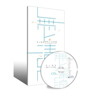

无上清凉弘一法师歌曲新编
============================

|  |  |
| :--: | :-- |
| [ 无上清凉弘一法师歌曲新编](https://emumo.xiami.com/album/2102717115) | **艺人**: [三藏梵音](../index.md) **语种**: 国语 **唱片公司**: 独立发行 **发行时间**: 2015年12月01日 **专辑类别**: 录音室专辑 **专辑风格**: 中国风 China-Wave, 古风 GuFeng Music, 中国传统民歌 Chinese Traditional Folk **播放数**: 130238 **收藏数**: 256 **评论数**: 0  |

## 简介

 想要了解更多三藏梵音的内容，请关注“三藏梵音”微信公众号
 

<strong style="max-width: 100% !important; box-sizing: border-box !important; word-wrap: break-word !important;">▎弘一大师简介</strong>
 

 俗名，李叔同(1880 年10 月 23 日 -1942 年 10 月 13 日)，谱名文涛，幼名成蹊，学名广侯，字息霜, 别号漱筒 ；出家后法名演音，号弘一，晚号晚晴老人。生于天津，祖籍山西洪洞，民初迁到天津，因其生母本为浙江平湖农家女，故后来李叔同奉母南迁上海，每每自言浙江平湖人，以纪念其先母。精通绘画、音乐、戏剧、书法、篆刻和诗词，为现代中国著名艺术家、教育家, 培养出了名画家丰子恺、音乐家刘质平等一些文化名人。他苦心向佛，过午不食，精研律学, 弘扬佛法，普渡众生出苦海，中兴佛教南山律宗，为著名的佛教僧侣，被佛门弟子奉为中兴南山律宗第十一代世祖。他为世人留下了咀嚼不尽的精神财富，他的一生充满了传奇色彩，他是中国绚丽至极归于平淡的典型人物。太虚大师曾为赠偈:“以教印心，以律严身，内外清净, 菩提之因。”赵朴初先生评价大师的一生为:“无尽奇珍供世眼，一轮圆月耀天心。”
 

  

 

 
 

<strong style="max-width: 100% !important; box-sizing: border-box !important; word-wrap: break-word !important;">▎制作人的话（刘三藏）</strong>
 

  受莆田广化寺的委托，新编制作李叔同（弘一大师）的音乐，是我们难得的荣幸；作为一个热衷于创作佛教音乐的团队，对此，我们满心欢喜的同时又诚惶诚恐。凭着淳朴发心与真诚情感，通过这个过程亲近了李叔同（弘一大师）的风采，用一些现代的制作手法让更多人熟知并喜欢大师精彩的音乐，这就是我们整个工作最大的意义。无论怎样，大师之才德令人高山仰止，我们水平所限，不完美之处在所难免，还请诸位仁者谅解。
 

 
 

<strong style="max-width: 100% !important; box-sizing: border-box !important; word-wrap: break-word !important;">▎制作方简介</strong>
 

 三藏梵音工作坊是全部由佛学志愿者组成的心灵音乐团队。在创立的五年间,陆续推出了 《索达吉堪布祈祷文》、《丹增上师祈祷文》、《普陀山佛学院院歌》、《南无观世音菩 萨》 等多个佛教音乐作品及心灵音乐专辑。近年推出的心灵音乐会《三藏梵音养心会》 ，广受社会好评。独特的感恩父母、老师的环节,动人心弦,使很多观众潸然泪下。美与乐的欣赏使中华传统美德深入人心。 
 

 
 

<strong style="max-width: 100% !important; box-sizing: border-box !important; word-wrap: break-word !important;">▎内容介绍</strong>
 

  本专辑在忠于原曲的基础上较多考虑可听性,希望更多的现代人能接触并 喜欢大师的作品。根据原曲风格,专辑中的歌曲风格设定了三种明显的区分, 也正恰似弘一法师的三种状态,既有在乱世中的飘零以及对人情冷暖的感 悟,也有对超然世外之向往,还有终于清凉之境誓愿传灯的了悟。 
 

 《三宝歌》作为汉传佛教的重要歌曲,是本专辑重点之作。我们制作前期 也参考了很多版本,最后设定了一个众生悲苦、菩萨解脱的一呼一答的场景; 也考虑佛教中有僧有尼、众生平等,故采取男女对唱的形式。而三皈依的 唱段,设定三遍的演唱人数逐渐增多,最后以大合唱的形式演唱僧宝的唱段, 都是寄望越来越多的众生走向清净,走向解脱。 
 

 为表现自然而气势磅礴的合唱,专辑录音团队打破在录音棚中分轨录制的 常规,特邀请二十位发心居士,在具有真实混响的大厅房间,设置房间话筒, 以 AB 制式主录音话筒进行录音。专辑中部分混响为真实采录,而非后期虚 拟,意为体现居士们皈依佛、法、僧三宝的真实发心。 
 

 《观心》、《柳叶儿》、《长逝》等古琴曲目,是将弘一法师当时具有中 国传统意韵的词曲用古琴演绎,使其回归于中国格调。为表现古琴的悠远 和不失其走手音细节进绰吟揉的特点,特使用了 ORTF 立体声话筒制式配合 电话筒,采取对龙池共鸣部分点拾音结合的方式,使弹唱同期一气呵成。 后期加以类似书房效果的中小房间的虚拟混响,以表现古典文人在书房中 吟唱的效果。 
 

 《送别》、《梦》等,因是改编自西方名曲,故而在本专辑中应用了古 典交响乐的配器,以体现李叔同先生西学为用之精神。在专辑的录音过 程中为体现女声温婉而细腻的情感细节,特配备了经典 M7 话筒头和有着 NEUMANN 先生血统的 MG 公司的电子管话筒 M92.1S。此话筒收录的人声温 润而不失动态细节,更似陈酿,在数字工作站中经过仔细雕琢,实现了在 婉转悠扬的音声之中,托起弦乐和钢琴的韵律,于宁静之中,将歌者对亲 人之思念娓娓道来的效果。 
 

 《忆儿时》为表现对儿时美好时光的追忆,特采用男声低音炮的独唱来表现, 缩混工艺中更使用独到的动态处理手段,突出了男声低音炮低沉而亲切的 喃喃之音,声景再现中年男子回忆童年时光的画面。 
 

 专辑后期为摆脱数字录音唱片冰冷的结果,专门采用了电子管和与 A 类固 态电路不同的 Summing 模拟设备,以突出不同的声音色彩。 
 

 本套乐曲，将带您走入澄潭碧水的幽境，明月清风的闲适。于繁杂尘世之中，让您领略无上清凉的妙趣，可谓“素心自此得，真趣非外求”。
 

 
 

<strong style="max-width: 100% !important; box-sizing: border-box !important; word-wrap: break-word !important;">▎歌曲目录</strong>
 

（一）演唱曲目 
 

⑴送别 ⑵忆儿时 ⑶化身 ⑷三宝歌 
 

⑸采莲 ⑹观心 ⑺柳叶 ⑻花香 ⑼梦 
 

⑽清平调 ⑾留别 ⑿早秋 ⒀长逝 ⒁送别（录音版）
 

 
 

（二）伴奏曲目 
 

⑴化身 ⑵三宝歌 ⑶采莲 ⑷忆儿时
 

⑸送别 ⑹花香 ⑺梦 ⑻留别 ⑼早秋 
 

 
 

（三）笛子曲目
 

⑴三宝歌 ⑵采莲 ⑶送别
 

⑷花香 ⑸梦 ⑹留别 ⑺早秋
 

 

## 曲目

## 评论

