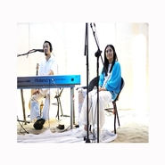
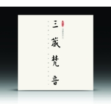

三藏梵音
============================

|  |  |
| :--: | :-- |
| [ 三藏梵音](https://i.xiami.com/sanzangfanyin) | **地区**: China 中国大陆 **风格**: 新世纪音乐 New Age **播放数**: 2445045 **粉丝数**: 4828 **评论数**: 57  |

## 档案

作者刘三藏 歌者蒋凡 希望我们的音乐能给你带来平静祥和还有幸福 
想要了解更多三藏梵音的内容和活动，请关注“三藏梵音”微信公众号 
作者刘三藏(原名刘凌虹) 
音乐制作人。出生于青海西宁，毕业于上海音乐学院。 
01年开始担任中央电视台《同一首歌》栏目音乐总监，在多个中央级晚会中承担音乐创作及总监工作。 
04年创作爱国音乐作品《向前进》《台湾、我的兄弟》在网络上具有巨大的影响力,据不完全统计,至少有超过1000万人次欣赏过这两个作品。同期组织的“向前进捐款支持对日索赔""台湾我的兄弟反台独大签名"有近50万的网友参与。 
06年开始陆续应邀创作《功夫大师》、《幻彩梦影》、《神龙部落》、《大鹏非遗》等大型舞台剧及其多个舞蹈音乐 
08年开始正式皈依佛教,随着修行水平有所提高,开始佛教音乐的创作。 
08-10年陆续出版《龙鼓》《黄河鼓》《大敦煌》发烧音乐专辑。 
08年为《门措上师住世祈祷文》编曲 
09年为《索达吉堪布住世祈祷文》作曲 
11年开展“原生态音乐民间老艺人慈善扶助计划”项目前期调研。 
06年开始正式皈依，系统的学习了藏传经典《入行论》， 
近两年有缘南传佛法，学习接触了经典《阿比达摩》 
与缅甸帕奥禅师的《止观修习》，虽然没有任何成绩， 
但是已经逐步开始能安静其心，对治一般的烦恼。 
逐步确立了轻松快乐的人生方向与信心。 
歌者蒋凡 （原名李蓉） 
国内著名电子乐队“与非门乐队”女主唱 
华语乐坛最成功的独立流行乐队之一，2001年开始音乐旅程，到2009年底共出版五张专辑《01》、《10乐园》、《11》、《A逻辑》(精选辑)，与非门《是与非》双专辑。作为最具国际性的华人乐队，与非门积极参加国内外各种音乐活动，亦曾出访法国、日本、香港、新加坡、马来西亚等国家和地区表演，获得各方高度赞誉。 
蒋凡2006年皈依佛教，慢慢开始学习五明佛学院的传承佛法。 
09年在一次殊胜的因缘中与刘三藏相识，两人开始合作心灵音乐专辑。 
其后三年中,她通过静坐,修心,歌唱，将修行与音乐结合，在生活中检验修行。她发现心真正安静下来的滋味,真正懂得了心灵的需要是什么.随之而来是更容易去理解别人的喜怒哀乐,去明白令这个世界不快乐的原因到底是什么. 而随着心更加宁静,培养更深的专注力,让心持续的专注在善念上,唱出来的作品感染力就越来越大。 
心的潜能无限,越挖掘,越能感受到其中的快乐.

## 专辑

| 名称 | 语种 | 唱片公司 | 发行时间 | 专辑类别 | 专辑风格 |
| :--: | :-- | :-- | :-- | :-- | :-- |
| [ 观音心咒 (新版)](./albums/2103745601.md) | 国语 | 源丰泰坤 | 2018年06月12日 | EP, 单曲 | 佛教音乐 Buddhist Music |
| [ 仓央嘉措情歌-东山上](./albums/2102969085.md) | 国语 | 源丰泰坤 | 2017年12月07日 | EP, 单曲 | 世界音乐 World Music, 新世纪音乐 New Age, 华语唱作人 Chinese Singer-Songwriter |
| [ 养心引导今夜好好睡](./albums/2102950880.md) | 国语 | 独立发行 | 2017年11月20日 | 有声书 | 有声书 Audio Book |
| [ 山景](./albums/2102854825.md) | 国语 | 百慕文化 | 2017年09月11日 | EP, 单曲 | 国语流行 Mandarin Pop, 新世纪音乐 New Age, 世界音乐 World Music |
| [ 无上清凉弘一法师歌曲新编](./albums/2102717115.md) | 国语 | 独立发行 | 2015年12月01日 | 录音室专辑 | 中国风 China-Wave, 古风 GuFeng Music, 中国传统民歌 Chinese Traditional Folk |
| [ 养心音乐 (高清版)](./albums/1978816675.md) | 国语 | 三藏梵音工作坊 | 2012年09月09日 | 录音室专辑 | 新古典新世纪 Neoclassical New Age |
| [ 献给上师的哈达上师长久住世祈祷文](./albums/1986173354.md) | 国语 | 独立发行 | 2012年08月08日 | EP, 单曲 | 新世纪音乐 New Age, 宗教新世纪 Religionary New Age, 佛教音乐 Buddhist Music |

## 评论

|  |  |  |
| :-- | :-- | :-- |
|  [虾米用户](https://emumo.xiami.com/u/44903838) joy 2021-01-07 21:39 赞(0) 踩(0) | 
今夜好好睡最后的留白...多余
 |
|  [虾米用户](https://emumo.xiami.com/u/446470009)  2020-12-31 17:31 赞(0) 踩(0) | 
怪不得以前在别的播放器里收藏的三藏梵音都听不了，原来搬家到虾米了。今天终于经过百度找到了，很开心！正好今天是2020年最后一天，祝福虾米的家人们元旦快乐！幸福安康！
 |
|  [虾米用户](https://emumo.xiami.com/u/444316764) 大千世界 2020-07-29 15:13 赞(0) 踩(0) | 
声音好听可以学吗？
 |
|  [虾米用户](https://emumo.xiami.com/u/444316764) 大千世界 2020-07-29 15:13 赞(0) 踩(0) | 
你们的声音太好听了，你们的音乐太舒服了。
 |
|  [虾米用户](https://emumo.xiami.com/u/276944698) 不要自我设限..... 2020-06-30 19:49 赞(0) 踩(0) | 
♈️♈️♈️
 |
|  [虾米用户](https://emumo.xiami.com/u/425300909) 一起舞动吧 2020-05-16 16:34 赞(0) 踩(0) | 

 |
|  [虾米用户](https://emumo.xiami.com/u/37137375) 我还没想好要写什么... 2020-04-02 07:55 赞(0) 踩(0) | 
加油！支持你们！
 |
|  [虾米用户](https://emumo.xiami.com/u/326826579) 不愁明月尽  自有暗香来 2020-01-05 12:49 赞(1) 踩(0) | 
为什么做音乐的人容易皈依佛门呢？
 |
|  [虾米用户](https://emumo.xiami.com/u/305711830) 路静人寂寞 2019-10-23 16:35 赞(0) 踩(0) | 
音乐很美，谢谢
 |
|  [虾米用户](https://emumo.xiami.com/u/414851430)  2019-01-30 23:22 赞(0) 踩(0) | 
最喜欢的声音。
 |
|  [虾米用户](https://emumo.xiami.com/u/346524716) 你帮我尽情 你就是舞厅 2018-12-03 06:02 赞(0) 踩(0) | 
蒋凡
 |
|  [虾米用户](https://emumo.xiami.com/u/378333823)  2018-11-20 10:35 赞(0) 踩(0) | 
仙镜。阿弥陀佛
 |
|  [虾米用户](https://emumo.xiami.com/u/178176102) 找一首歌… 2018-10-08 21:32 赞(0) 踩(0) | 
蒋凡到这了啊，与非门呀。。。
 |
|  [虾米用户](https://emumo.xiami.com/u/264650212) 微笑的抑郁症患者…… 2018-07-18 13:14 赞(0) 踩(0) | 

 |
|  [虾米用户](https://emumo.xiami.com/u/361698836) OM Ar HOOM… 2018-07-08 20:01 赞(0) 踩(0) | 
感恩三藏梵音   分享这么棒棒的音乐
 |
|  [虾米用户](https://emumo.xiami.com/u/355518844) 我还没想好要写什么... 2018-03-24 21:39 赞(0) 踩(0) | 
此曲犹如神来之笔仙气十足，大爱
 |
|  [虾米用户](https://emumo.xiami.com/u/247110043)  2017-09-17 07:53 赞(0) 踩(0) | 
很好听。。。
 |
|  [虾米用户](https://emumo.xiami.com/u/253329840)  2017-09-11 17:24 赞(0) 踩(0) | 
有意境，心会一下子马上就静下来了，真好！
 |
|  [虾米用户](https://emumo.xiami.com/u/3583995) 一個人的戰爭 2017-09-11 16:11 赞(0) 踩(0) | 
.
 |
|  [虾米用户](https://emumo.xiami.com/u/119765674) 我还没想好要写什么... 2017-08-29 10:41 赞(0) 踩(0) | 
令人惊艳的音乐   
 |
|  [虾米用户](https://emumo.xiami.com/u/16109350)  2016-09-15 16:48 赞(0) 踩(0) | 
女声吟唱很美！
 |
|  [虾米用户](https://emumo.xiami.com/u/1446973)  2016-03-15 01:52 赞(0) 踩(0) | 
一听惊美，赞！
 |
|  [虾米用户](https://emumo.xiami.com/u/43411373) 海之梦的梦之海 2016-03-08 15:02 赞(0) 踩(0) | 
脱凡，寻找自我！
 |
|  [虾米用户](https://emumo.xiami.com/u/89046204) 民谣， 2016-01-16 18:19 赞(0) 踩(0) | 
仓央嘉措
 |
|  [虾米用户](https://emumo.xiami.com/u/999755) 一念消除，万般放下 2015-11-10 14:59 赞(1) 踩(0) | 
焚香、净手、抄经的时候听刚刚好
 |
|  [虾米用户](https://emumo.xiami.com/u/16229370)  2015-10-13 09:05 赞(0) 踩(0) | 
收藏
 |
|  [虾米用户](https://emumo.xiami.com/u/11434965) 我还没想好要写什么... 2015-07-18 13:24 赞(1) 踩(0) | 
刘三藏的音乐，赞！
 |
|  [虾米用户](https://emumo.xiami.com/u/1600506)  2015-06-26 17:58 赞(0) 踩(0) | 
回归自然，回归心灵的好音乐！
 |
|  [虾米用户](https://emumo.xiami.com/u/7173023) oh ma douce ... 2015-05-31 22:01 赞(0) 踩(0) | 
陪我走过失恋的夜晚
 |
|  [虾米用户](https://emumo.xiami.com/u/32031632)  2015-05-07 10:59 赞(0) 踩(0) | 
好曲目，赞！
 |
|  [虾米用户](https://emumo.xiami.com/u/32031632)  2015-05-07 10:59 赞(0) 踩(0) | 
南无阿弥陀佛
 |
|  [虾米用户](https://emumo.xiami.com/u/11986243) 我回来了 2015-04-28 11:17 赞(0) 踩(0) | 
喜欢天地的辽阔~~~
 |
|  [虾米用户](https://emumo.xiami.com/u/35342058)  2015-03-27 22:42 赞(1) 踩(0) | 
感恩他们，真心的入心音乐。愿他们皈依三宝。 
 |
|  [虾米用户](https://emumo.xiami.com/u/991858)  2015-03-21 21:03 赞(0) 踩(0) | 
为何不能付费下载仓央嘉措情歌＋引导？ 音乐不是分享的嘛？
 |
|  [虾米用户](https://emumo.xiami.com/u/48339481)  2015-03-21 02:38 赞(0) 踩(0) | 
很好
 |
|  [虾米用户](https://emumo.xiami.com/u/29678147) 靠近我 或者阔別我 2015-02-07 22:55 赞(0) 踩(0) | 
发好多啊一下子  - -
 |
|  [虾米用户](https://emumo.xiami.com/u/11364026)  2015-02-07 22:44 赞(0) 踩(0) | 
喜欢！
 |
|  [虾米用户](https://emumo.xiami.com/u/25012825)  2014-12-16 09:47 赞(0) 踩(0) | 
心灵音乐
 |
|  [虾米用户](https://emumo.xiami.com/u/36385088)  2014-11-05 17:32 赞(0) 踩(0) | 
喜欢
 |
|  [虾米用户](https://emumo.xiami.com/u/42798897) 楽动的灵魂！ 2014-10-23 18:16 赞(0) 踩(0) | 
好
 |
|  [虾米用户](https://emumo.xiami.com/u/33893314)  2014-07-24 09:54 赞(0) 踩(0) | 
瑜伽，午休
 |
|  [虾米用户](https://emumo.xiami.com/u/6565760)  2014-03-14 18:42 赞(0) 踩(0) | 
听。
 |
|  [虾米用户](https://emumo.xiami.com/u/32882355)  2014-02-18 17:05 赞(0) 踩(0) | 
佛
 |
|  [虾米用户](https://emumo.xiami.com/u/11489663) 只有歌，才能不胫而飞 2014-01-20 16:06 赞(0) 踩(0) | 
安抚灵魂
 |
|  [虾米用户](https://emumo.xiami.com/u/7562991)  2013-11-15 13:27 赞(7) 踩(0) | 
蒋凡在此！！
 |
|  [虾米用户](https://emumo.xiami.com/u/4421922)  2013-10-25 16:50 赞(0) 踩(0) | 
静心
 |
|  [虾米用户](https://emumo.xiami.com/u/3789186)  2013-10-22 07:19 赞(0) 踩(0) | 
好好听
 |
|  [虾米用户](https://emumo.xiami.com/u/1381909)  2013-10-21 21:35 赞(1) 踩(0) | 
蒋凡~~
 |
|  [虾米用户](https://emumo.xiami.com/u/10917089)   2013-10-13 17:52 赞(0) 踩(0) | 
支持，有改进的地方，望成长。
 |
|  [虾米用户](https://emumo.xiami.com/u/7422502)  2013-10-05 18:31 赞(3) 踩(0) | 
实话实说，整体感觉有点做作，无论男声的引导还是女声的呤唱，不自然，很刻意地在做，让人初听有点放松，细听会腻，不是修行人的声音。琼英卓玛唱经时那种干净质朴的声音才能让人真正放松。
 |
| ⇒ |  [虾米用户](https://emumo.xiami.com/u/9633662) ज्ञापारिमता 2013-11-15 21:00 赞(0) 踩(0) | 
而且名字叫”三藏梵音“，结果一首梵音也没有 。 声音里的确没有类似琼英卓玛、央金拉姆那样实修的澄澈底蕴
 |
| ⇒ |  [虾米用户](https://emumo.xiami.com/u/6735016) toomuch 2014-03-26 21:51 赞(0) 踩(0) | 
实话实说，整体感觉有点做作，无论男声的引导还是女声的呤唱，不自然，很刻意地在做，____听了2首也这么觉得。。。音乐还可以，人声太普通了。可以说有点差劲。
 |
|  [虾米用户](https://emumo.xiami.com/u/5582780)  2013-09-22 20:27 赞(0) 踩(0) | 
一种心灵的享受与放松
 |
|  [虾米用户](https://emumo.xiami.com/u/280791) @愚細胞 2013-09-15 13:28 赞(0) 踩(0) | 
见或不见
 |
|  [虾米用户](https://emumo.xiami.com/u/2125576) 用音乐增长慈爱与平静 2013-09-09 17:18 赞(37) 踩(0) | 
我刚入驻了虾米音乐人，欢迎大家来我的个人主页，收听我的最新音乐
 |
| ⇒ |  [虾米用户](https://emumo.xiami.com/u/40786115)  2014-11-05 15:14 赞(0) 踩(0) | 
太好听了！
 |
|  [虾米用户](https://emumo.xiami.com/u/12314006)  2013-01-08 15:12 赞(0) 踩(0) | 
治愈心灵的力量
 |
