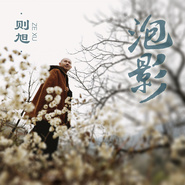

泡影
============================

|  |  |
| :--: | :-- |
| [ 泡影](https://emumo.xiami.com/album/2102978129) | **艺人**: [释则旭](../index.md) **语种**: 国语 **唱片公司**: 源丰泰坤 **发行时间**: 2017年12月21日 **专辑类别**: EP, 单曲 **专辑风格**: 国语流行 Mandarin Pop, 中国风 China-Wave, 佛教音乐 Buddhist Music **播放数**: 55002 **收藏数**: 49 **评论数**: 11  |

## 简介

  
佛乐歌手释则旭《泡影》EP岁末发布  
  
毗邻新年，著名禅乐歌者、中国佛乐歌手释则旭发布全新EP《泡影》，专辑包含两首作品：同名主打歌《泡影》及歌曲《法华偈》。作品由慕音乐全网发行，诚意推荐！  
  
  
一切有为法，如梦幻泡影  
  
世间万种，如晨露闪电般转瞬即逝；世间万物，结系一念之间，如镜花水月般虚无缥缈……对于《泡影》，词作者海峰同样煞费心血。则旭坦言，借《泡影》想告诉身处喧哗浮躁世界中迷失自我的人们：灯红酒绿、歌舞升平终会如泡影消失，正如彩虹下缤纷美丽的气泡，唯美却易碎；或又是像做了一场华丽的梦，梦醒而无踪。  
  
除了这首流行中国风作品《泡影》，全新单曲《法华偈》也将同步发出。相比《泡影》绵延悠长的演绎，《法华偈》则更加庄严肃穆。《法华偈》是古大德修习《法华经》的感悟，正因为此偈的精湛解析，恰到好处的将《法华经》的殊胜诠释出来，所以一直被后人放在此经的开端。《法华经》全称《妙法莲华经》，被誉为大乘佛教的“经中之王”，是佛陀慈悲平等讲述成佛的法门，是直达佛乘的甚深妙法，令众生同沐佛恩、同沾法喜、同入佛道！唱诵者则旭愿更多的人都能受持《法华经》，也愿聆听的人在新的一年来临之际，吉祥安泰！  
  
“黑与白的日夜，生与死的枯荣；出尘与入世，前世与今生；爱与恨，名与利……哪一个是生命的本真？是梦是幻、是泡是影？似乎哪一个都是，又哪一个都不是……不惊，不怖，不畏，予生命以敬畏、专注、珍视，不贪恋，不执着。生命是自然而然，是皆大欢喜……”这篇词，是泡影MV导演有感而发。《泡影》MV构思新颖，人物特写鲜明，舞蹈部分亦是惊艳润色之笔。则旭说这是一种全新的拍摄手法与表演形式，希望大家可以用心观看这部音乐录影带，品悟到其中真意。据悉，《泡影》及《法华偈》MV将同步上线。 

## 曲目

## 评论

|  |  |  |  |
| :-- | :-- | :-- | :-- |
|  [虾米用户](https://emumo.xiami.com/u/346463911)  2019-06-25 11:53 赞(1) 踩(0) | 
感恩师父
 |
|  [虾米用户](https://emumo.xiami.com/u/344262301)  2019-06-05 00:24 赞(0) 踩(0) | 
非常喜欢
 |
|  [虾米用户](https://emumo.xiami.com/u/332498265) 平常心，日常事，一样的生... 2019-05-15 22:19 赞(0) 踩(0) | 
很好听
 |
|  [虾米用户](https://emumo.xiami.com/u/411419631)  2019-04-09 16:43 赞(1) 踩(0) | 
好听
 |
|  [虾米用户](https://emumo.xiami.com/u/328113007)  2019-03-24 19:17 赞(0) 踩(0) | 
很有意境
 |
|  [虾米用户](https://emumo.xiami.com/u/410308402)  2019-02-18 21:16 赞(1) 踩(0) | 
有此心境才能唱出此曲
 |
|  [虾米用户](https://emumo.xiami.com/u/32031632)  2018-10-02 10:12 赞(1) 踩(0) | 
南无阿弥佗佛
 |
|  [虾米用户](https://emumo.xiami.com/u/256105604)  2017-12-28 08:19 赞(0) 踩(0) | 
一如既往的喜欢
 |
|  [虾米用户](https://emumo.xiami.com/u/300257454)  2017-12-27 08:39 赞(0) 踩(0) | 
好听
 |
|  [虾米用户](https://emumo.xiami.com/u/8320697)  2017-12-21 00:02 赞(0) 踩(0) | 
恭敬法师 
 |
|  [虾米用户](https://emumo.xiami.com/u/307817757)  2017-12-20 20:59 赞(0) 踩(0) | 
好听
 |
