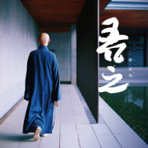

吾之
============================

|  |  |
| :--: | :-- |
| [ 吾之](https://emumo.xiami.com/album/5021389875) | **艺人**: [释则旭](../index.md) **语种**: 国语 **唱片公司**: 天赋传媒 **发行时间**: 2020年09月03日 **专辑类别**: EP, 单曲 **专辑风格**: 国语流行 Mandarin Pop, 佛教音乐 Buddhist Music **播放数**: 19776 **收藏数**: 6 **评论数**: 5  |

## 简介

2020年9月，著名禅乐歌者、中国佛教歌手释则旭发布全新国风禅乐单曲《吾之》。

这首歌是则旭法师的师父——达照法师一生的真实写照。从出生到出家，从修行到悟道，都融入在这简短的八句歌词里，却意味深长。

歌曲由天赋传媒全网发行，诚意推荐。

## 曲目

## 评论

|  |  |  |  |
| :-- | :-- | :-- | :-- |
|  [虾米用户](https://emumo.xiami.com/u/359820832) 南无阿弥陀佛 2020-11-14 15:07 赞(0) 踩(0) | 
感恩❤️阿弥陀佛
 |
|  [虾米用户](https://emumo.xiami.com/u/357249191) 我还没想好要写什么... 2020-09-09 22:55 赞(0) 踩(0) | 
感恩❤️！有你在！☀️阿彌陀佛☀️
 |
|  [虾米用户](https://emumo.xiami.com/u/324742183)  2020-09-03 05:47 赞(0) 踩(0) | 
洁净心灵了。
 |
|  [虾米用户](https://emumo.xiami.com/u/434369199) 我还没想好要写什么... 2020-09-03 00:32 赞(2) 踩(0) | 
从前奏到歌曲开始，一种由古至今，一种田野山间归来的感觉，八句歌词却是一生
 |
|  [虾米用户](https://emumo.xiami.com/u/444132043)  2020-09-03 00:13 赞(3) 踩(0) | 
由凡入圣，皆凡皆圣，皆空凡，圣，空……
 |
