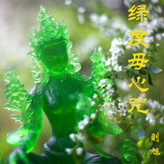
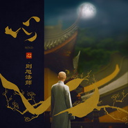

释则旭
============================

|  |  |
| :--: | :-- |
| [ 释则旭](https://i.xiami.com/zexufashi) | **地区**: China 中国大陆 **风格**: 轻音乐 Easy Listening, 新世纪音乐 New Age, 中国风 China-Wave, 华语唱作人 Chinese Singer-Songwriter, 宗教新世纪 Religionary New Age, 佛教音乐 Buddhist Music **播放数**: 5183486 **粉丝数**: 2656 **评论数**: 129  |

## 档案

“音乐仍是无言的最好述说”——则旭法师 
释则旭（则旭法师），俗姓董，上海人氏。中国新晋佛乐歌手，禅曲演唱者。至今已发表十几首演唱作品，颇受大众好评。2012年9月，则旭法师筹建 “普陀山海潮音梵呗艺术团”，曾任副团长、执行总监，身体力行积极推广着中国佛乐与禅乐的发展。除了在音乐上有所建树，课业上则旭法师也是一名名副其实的“学霸”。2010年就读于斯里兰卡凯莱尼亚大学，并顺利取得文学硕士学位。目前就读于美国加州西来大学，正在攻读宗教系博士学位。 
则旭法师的禅乐作品似一杯恬静甘冽的好茶，醇雅、质朴。人如其声，“清、雅、简、淡”是他留给人们的印象。自然不失灵秀、形神俱清，这位佛门弟子带着谦谦君子之风与书生温恭儒雅之气，正如兰居幽谷，不争不抢，寂静亦芬芳。

## 专辑

| 名称 | 语种 | 唱片公司 | 发行时间 | 专辑类别 | 专辑风格 |
| :--: | :-- | :-- | :-- | :-- | :-- |
| [ 山隐](./albums/5022156174.md) | 国语 | 天赋传媒 | 2020年12月13日 | EP, 单曲 | 国语流行 Mandarin Pop |
| [ 重阳颂](./albums/5021698404.md) | 国语 | 天赋传媒 | 2020年10月20日 | EP, 单曲 | 国语流行 Mandarin Pop, 佛教音乐 Buddhist Music |
| [ 吾之](./albums/5021389875.md) | 国语 | 天赋传媒 | 2020年09月03日 | EP, 单曲 | 国语流行 Mandarin Pop, 佛教音乐 Buddhist Music |
| [ 如如茶](./albums/5021084871.md) | 国语 | 天赋传媒 | 2020年07月15日 | EP, 单曲 | 国语流行 Mandarin Pop, 佛教音乐 Buddhist Music |
| [ 为利众生愿成佛](./albums/2105625329.md) | 国语 | 慕音乐 | 2019年12月25日 | EP, 单曲 | 国语流行 Mandarin Pop, 佛教音乐 Buddhist Music |
| [ 手护菩提心](./albums/2105375623.md) | 国语 | 慕音乐 | 2019年10月25日 | EP, 单曲 | 佛教音乐 Buddhist Music |
| [ 黄财神心咒](./albums/2105284604.md) | 国语 | 慕音乐 | 2019年09月26日 | EP, 单曲 | 佛教音乐 Buddhist Music |
| [ 醒世歌](./albums/2104970892.md) | 国语 | 慕音乐 | 2019年07月05日 | EP, 单曲 | 佛教音乐 Buddhist Music |
| [ 文殊菩萨心咒](./albums/2104764104.md) | 国语 | 慕音乐 | 2019年04月10日 | EP, 单曲 | 佛教音乐 Buddhist Music |
| [ 大悲咒](./albums/2104554811.md) | 国语 | 慕音乐 | 2019年01月28日 | EP, 单曲 | 佛教音乐 Buddhist Music |
| [ 心经](./albums/2103938679.md) | 国语 | 慕音乐 | 2018年08月22日 | EP, 单曲 | 佛教音乐 Buddhist Music |
| [ 放生歌](./albums/2103624545.md) | 国语 | 源丰泰坤 | 2018年03月20日 | EP, 单曲 | 国语流行 Mandarin Pop, 华语唱作人 Chinese Singer-Songwriter, 中国风 China-Wave, 佛教音乐 Buddhist Music |
| [ 绿度母心咒](./albums/2100266764.md) | 国语 | 源丰泰坤 | 2018年02月06日 | EP, 单曲 | 佛教音乐 Buddhist Music |
| [ 泡影](./albums/2102978129.md) | 国语 | 源丰泰坤 | 2017年12月21日 | EP, 单曲 | 国语流行 Mandarin Pop, 中国风 China-Wave, 佛教音乐 Buddhist Music |
| [ 常念南无阿弥陀佛《常念南无阿弥陀佛》EP](./albums/2102852278.md) | 国语 | 百慕文化 | 2017年09月07日 | EP, 单曲 | 国语流行 Mandarin Pop, 华语唱作人 Chinese Singer-Songwriter, 佛教音乐 Buddhist Music |
| [ 悠居](./albums/2102733825.md) | 国语 | 百慕文化 | 2017年04月18日 | EP, 单曲 | 国语流行 Mandarin Pop, 古风 GuFeng Music, 中国风 China-Wave, 佛教音乐 Buddhist Music |
| [ 慈心永驻《慈心永驻》EP](./albums/2102672331.md) | 英语 |  | 2016年12月26日 | EP, 单曲 | 国语流行 Mandarin Pop, 佛教音乐 Buddhist Music |
| [ 心心EP](./albums/2102652520.md) | 国语 |  | 2016年11月14日 | EP, 单曲 | 佛教音乐 Buddhist Music |
| [ 禅](./albums/2102405873.md) | 国语 | 百慕文化 | 2016年10月10日 | EP, 单曲 | 佛教音乐 Buddhist Music |
| [ 随缘随缘EP](./albums/2100382458.md) | 国语 | 百慕文化 | 2016年08月24日 | EP, 单曲 | 佛教音乐 Buddhist Music |
| [ 一刹那](./albums/2100182552.md) | 国语 | 安福利生 | 2015年08月21日 | EP, 单曲 | 佛教音乐 Buddhist Music |
| [ 点灯祈愿文](./albums/1336253544.md) | 国语 | 安福利生 | 2015年07月03日 | EP, 单曲 | 佛教音乐 Buddhist Music |
| [ 大愿如愿](./albums/1635657715.md) | 国语 | 安福利生 | 2015年06月28日 | EP, 单曲 | 佛教音乐 Buddhist Music |
| [ 我佛慈悲](./albums/1628543183.md) | 国语 | 安福利生 | 2015年04月03日 | EP, 单曲 | 佛教音乐 Buddhist Music |
| [ 安福利生](./albums/1613430300.md) | 国语 | 独立发行 | 2014年10月15日 | EP, 单曲 | 佛教音乐 Buddhist Music |
| [ 天青未来雪](./albums/8685737.md) | 国语 | 安福利生 | 2014年08月20日 | 录音室专辑 | 佛教音乐 Buddhist Music |
| [ 别离](./albums/707378523.md) | 国语 | 安福利生 | 2014年08月06日 | EP, 单曲 | 佛教音乐 Buddhist Music |
| [ 普陀之光](./albums/1477569084.md) | 国语 | 安福利生艺术中心 | 2013年08月25日 | EP, 单曲 | 佛教音乐 Buddhist Music |
| [ 问佛](./albums/465993513.md) | 国语 | 安福利生 | 2013年04月11日 | EP, 单曲 | 佛教音乐 Buddhist Music |
| [ 普陀山佛学院院歌](./albums/261943416.md) | 国语 | 普陀山佛学院 | 2013年02月21日 | EP, 单曲 | 佛教音乐 Buddhist Music |
| [ 安心是福](./albums/537758.md) | 国语 | 安福利生 | 2012年08月03日 | 录音室专辑 | 佛教音乐 Buddhist Music |

## 评论

|  |  |  |
| :-- | :-- | :-- |
|  [虾米用户](https://emumo.xiami.com/u/433579588) 我欲乘风归去，又恐琼楼玉... 2021-01-17 19:16 赞(0) 踩(0) | 
我第六个女儿有白血病，你在旁边丢的小学生奶酪糖
 |
|  [虾米用户](https://emumo.xiami.com/u/433579588) 我欲乘风归去，又恐琼楼玉... 2020-12-28 16:58 赞(0) 踩(0) | 
还有一个陷害我的人，和张杰有关系，是北川中学理科重点班，现在在四川农业大学的土木工程，喜读书生日是4月20号，这个男生现在18岁
 |
|  [虾米用户](https://emumo.xiami.com/u/433579588) 我欲乘风归去，又恐琼楼玉... 2020-12-26 12:58 赞(0) 踩(0) | 
陷害我的证据我都收集到了，黄阳认错了，他向我坦白了，是陈瑶叫他这样做的，圈子是马化腾侄子让带的
 |
|  [虾米用户](https://emumo.xiami.com/u/433579588) 我欲乘风归去，又恐琼楼玉... 2020-11-10 16:15 赞(0) 踩(0) | 
她哪里和你是兄弟？他是为了他的儿子能坐上那个王位
 |
|  [虾米用户](https://emumo.xiami.com/u/433579588) 我欲乘风归去，又恐琼楼玉... 2020-11-10 16:14 赞(0) 踩(0) | 
我用我的死换取你的一生，平安健康和幸福
 |
|  [虾米用户](https://emumo.xiami.com/u/433579588) 我欲乘风归去，又恐琼楼玉... 2020-11-10 16:14 赞(0) 踩(0) | 
稍微有点道行的法师都知道这个道理，像这种诅咒，如果我们地球文明的话，可以在银河系自由穿梭，那就不叫玄学了，那叫占星术
 |
|  [虾米用户](https://emumo.xiami.com/u/433579588) 我欲乘风归去，又恐琼楼玉... 2020-11-10 16:13 赞(0) 踩(0) | 
那你要等我的孩子出生，和你两败俱伤吗？
 |
|  [虾米用户](https://emumo.xiami.com/u/433579588) 我欲乘风归去，又恐琼楼玉... 2020-11-10 16:13 赞(0) 踩(0) | 
你傻不傻？等我死之前给你念一段咒语，和你关系那么好，还在银子上给刻咒语，带了两年多了，还有一副是带了几个月连到一起的咒语，我给你念了之后，我就走了，你就没事了
 |
|  [虾米用户](https://emumo.xiami.com/u/445453027)  2020-10-30 22:19 赞(0) 踩(0) | 
无意中刷到旭师父的抖音，一下子被师父的声音吸引住了。
 |
|  [虾米用户](https://emumo.xiami.com/u/2796166) 最爱莫文蔚..... 2020-10-04 03:49 赞(1) 踩(0) | 
不错哦~~~加油~
 |
|  [虾米用户](https://emumo.xiami.com/u/433579588) 我欲乘风归去，又恐琼楼玉... 2020-09-16 19:14 赞(1) 踩(0) | 
他们使用的是苗族的一种巫术
 |
|  [虾米用户](https://emumo.xiami.com/u/433579588) 我欲乘风归去，又恐琼楼玉... 2020-09-16 19:14 赞(1) 踩(0) | 
然后让他们鹬蚌相争渔翁得利
 |
|  [虾米用户](https://emumo.xiami.com/u/433579588) 我欲乘风归去，又恐琼楼玉... 2020-09-16 19:14 赞(1) 踩(0) | 
甲方的竞争者和乙方的竞争者达成了一个协议，本来甲乙两方都要成为朋友的，可是他们在甲方的衣服和随身物品上刻的有东西，在乙方的衣服和随身物品上，也刻有东西，哥哥，你也被陷害了，你看一下你们的同门师兄
 |
|  [虾米用户](https://emumo.xiami.com/u/433579588) 我欲乘风归去，又恐琼楼玉... 2020-09-16 18:54 赞(0) 踩(0) | 
他们要陷害你
 |
|  [虾米用户](https://emumo.xiami.com/u/433579588) 我欲乘风归去，又恐琼楼玉... 2020-09-16 18:54 赞(0) 踩(0) | 
和你一起出家的人员里面，有故意针对你的，在你，衣服物品里面刻了有东西，你的一些同行竞争
 |
|  [虾米用户](https://emumo.xiami.com/u/433579588) 我欲乘风归去，又恐琼楼玉... 2020-09-16 18:54 赞(0) 踩(0) | 
哥哥和你一起出家的人，里面有间谍，他们也要针对你，在你的物品上刻了，有东西，你们内部的佛教人员
 |
|  [虾米用户](https://emumo.xiami.com/u/433579588) 我欲乘风归去，又恐琼楼玉... 2020-09-16 16:54 赞(0) 踩(0) | 
愿我在天堂你看不到的地方安息，我只希望你找到猿辅导的刘轩老师，帮我洗清冤屈就好了
 |
|  [虾米用户](https://emumo.xiami.com/u/433579588) 我欲乘风归去，又恐琼楼玉... 2020-09-16 16:43 赞(0) 踩(0) | 
我就是不惹人喜欢，惹人讨厌，我知道我穷，我是草根，我也不知道为什么有那么多人要陷害我
 |
|  [虾米用户](https://emumo.xiami.com/u/433579588) 我欲乘风归去，又恐琼楼玉... 2020-09-16 16:41 赞(0) 踩(0) | 
哥哥，其实我以前挺崇拜你的，我想见你一面
 |
|  [虾米用户](https://emumo.xiami.com/u/433579588) 我欲乘风归去，又恐琼楼玉... 2020-09-16 16:36 赞(0) 踩(0) | 
你们好好的过你们的吧，我要是真的不是被别人陷害，我自然会入地狱的
 |
|  [虾米用户](https://emumo.xiami.com/u/433579588) 我欲乘风归去，又恐琼楼玉... 2020-09-16 16:34 赞(0) 踩(0) | 
我觉得我的一生挺可悲的，先是被同伴王吉谄害，不仅我的镯子，耳环上面，就连我妈妈的镯子上面，都有诅咒
 |
|  [虾米用户](https://emumo.xiami.com/u/433579588) 我欲乘风归去，又恐琼楼玉... 2020-09-16 16:33 赞(0) 踩(0) | 
我走了，以后再也没有人碍你眼了
 |
|  [虾米用户](https://emumo.xiami.com/u/433579588) 我欲乘风归去，又恐琼楼玉... 2020-09-16 16:31 赞(0) 踩(0) | 
猿辅导的刘轩老师知道
 |
|  [虾米用户](https://emumo.xiami.com/u/433579588) 我欲乘风归去，又恐琼楼玉... 2020-09-16 16:29 赞(1) 踩(0) | 
哥哥，我的耳环上写了诅咒
 |
|  [虾米用户](https://emumo.xiami.com/u/433579588) 我欲乘风归去，又恐琼楼玉... 2020-09-12 16:09 赞(0) 踩(0) | 
哥哥，赶紧从头到脚，还有你用过的所有物品，一些佛教用品，你的生活用品看一下上面的字，那些会不会有诅咒？
 |
|  [虾米用户](https://emumo.xiami.com/u/433579588) 我欲乘风归去，又恐琼楼玉... 2020-09-12 16:04 赞(0) 踩(0) | 
我的四个孩子都没了
 |
|  [虾米用户](https://emumo.xiami.com/u/433579588) 我欲乘风归去，又恐琼楼玉... 2020-09-12 16:04 赞(0) 踩(0) | 
难道你想和我自相残杀吗？
 |
|  [虾米用户](https://emumo.xiami.com/u/433579588) 我欲乘风归去，又恐琼楼玉... 2020-09-12 16:02 赞(0) 踩(0) | 
我们联合起来，把那些贪官污吏给处罚了吧？
 |
|  [虾米用户](https://emumo.xiami.com/u/433579588) 我欲乘风归去，又恐琼楼玉... 2020-09-12 15:59 赞(0) 踩(0) | 
哥哥，赶紧看下你的衣服和鞋子，从头到脚检查一下是不是被下了诅咒？
 |
|  [虾米用户](https://emumo.xiami.com/u/433579588) 我欲乘风归去，又恐琼楼玉... 2020-09-12 15:57 赞(0) 踩(0) | 
黄香梅，哥哥，你赶紧检查一下自己的衣服和鞋子，从头到脚看一下，也是不是被下了诅咒？
 |
|  [虾米用户](https://emumo.xiami.com/u/433579588) 我欲乘风归去，又恐琼楼玉... 2020-09-11 16:51 赞(0) 踩(0) | 
黄香梅我孩子掉了，以后要是堕胎多了怀不上我不找你算账
 |
|  [虾米用户](https://emumo.xiami.com/u/444271364) 与人为善福虽未至祸已远离... 2020-08-03 22:31 赞(0) 踩(0) | 
为什么我的眼里包含着泪水
 |
|  [虾米用户](https://emumo.xiami.com/u/63020) 东东喜欢腕表 2020-07-15 07:55 赞(0) 踩(0) | 
<a href="https://mp.weixin.qq.com/s/_XLXxlE8inyq1IeEwrBjeQ" target="_blank" rel="nofollow noreferrer noopener">https://mp.weixin.qq.com/s/_XLXxlE8inyq1IeEwrBjeQ</a>
 |
|  [虾米用户](https://emumo.xiami.com/u/63020) 东东喜欢腕表 2020-07-15 07:55 赞(0) 踩(0) | 
则旭法师，皈依在禅门大德达照法师门下，致力于中国佛教音乐的推广和发展，积极投入到创作、演唱佛曲的音声弘法工作中。并曾多次受邀于国内各大佛教名山、寺庙等佛教圣地演出，以及作为特邀嘉宾出访美国、加拿大等地进行表演，深受海内外人士的热烈欢迎。
 |
|  [虾米用户](https://emumo.xiami.com/u/63020) 东东喜欢腕表 2020-07-15 07:53 赞(0) 踩(0) | 
释则旭，俗姓董，上海人氏。中国新晋佛乐歌手，禅曲演唱者。至今已发表十几首演唱作品，颇受大众好评。2012年9月，则旭法师筹建 &amp;ldquo;普陀山海潮音梵呗艺术团&amp;rdquo;，曾任副团长、执行总监，身体力行积极推广着中国佛乐与禅乐的发展。除了在音乐上有所建树，课业上则旭法师也是一名名副其实的&amp;ldquo;学霸&amp;rdquo;。2010年就读于斯里兰卡凯莱尼亚大学，并顺利取得文学硕士学位。作品《问佛》《绿度母心咒》《楞严一笑》等。  以上转自搜狗网页。
 |
|  [虾米用户](https://emumo.xiami.com/u/2796166) 最爱莫文蔚..... 2019-12-30 07:42 赞(1) 踩(0) | 
加油~~~~
 |
|  [虾米用户](https://emumo.xiami.com/u/427295142)  2019-12-24 12:57 赞(1) 踩(0) | 
南无阿弥陀佛南无阿弥陀佛
 |
|  [虾米用户](https://emumo.xiami.com/u/434342173)  2019-12-20 14:03 赞(1) 踩(0) | 
阿弥陀佛   顶礼师父   
 |
|  [虾米用户](https://emumo.xiami.com/u/411419631)  2019-11-15 09:05 赞(1) 踩(0) | 
顶礼师父
 |
|  [虾米用户](https://emumo.xiami.com/u/430632084) 心海无边 2019-10-15 15:59 赞(2) 踩(0) | 
第一次听大悲咒就被惊颜到了，从此就把师傅所有的歌都听了一遍，最爱“别离”这首歌，唱得柔肠百转，肝肠寸断，荡气回肠，让人心疼，让人心碎的歌。清雅脱俗，余音缭绕。<a href="http://emumo.xiami.com/u/217037009" target="_blank" rel="nofollow" name_card="217037009">@释则旭 </a>我的一个师姐也在加洲的西来大学读硕士，不知道可不可以在西莱大学见到法师？
 |
| ⇒ |  [虾米用户](https://emumo.xiami.com/u/87346556)  2019-10-18 12:38 赞(0) 踩(0) | 
啊，同道中人！我也最爱《别离》！情感饱满，真的是不忍卒听。
 |
|  [虾米用户](https://emumo.xiami.com/u/34023566)  2019-07-24 07:23 赞(2) 踩(0) | 
真的太喜欢啦。百听不厌
 |
|  [虾米用户](https://emumo.xiami.com/u/325374787)  2019-07-05 01:37 赞(1) 踩(0) | 
好
 |
|  [虾米用户](https://emumo.xiami.com/u/325205625)  2019-05-15 08:56 赞(0) 踩(0) | 
好
 |
|  [虾米用户](https://emumo.xiami.com/u/319025675) 我还没想好要写什么...... 2019-05-03 00:20 赞(0) 踩(0) | 
师父吉祥❤️
 |
|  [虾米用户](https://emumo.xiami.com/u/87346556)  2019-01-07 13:39 赞(1) 踩(0) | 
则旭法师，多出新歌吧！ 
 |
|  [虾米用户](https://emumo.xiami.com/u/407216340)  2019-01-01 07:11 赞(0) 踩(0) | 
主要好听，就是得会员才可以下载，没办法才收藏
 |
|  [虾米用户](https://emumo.xiami.com/u/408383743) 走遍江南清丽地人生只合住... 2018-11-15 16:40 赞(2) 踩(0) | 
很喜欢师父的禅乐，尤其是《悠居》，感恩遇见！
 |
|  [虾米用户](https://emumo.xiami.com/u/14702761)  2018-10-01 15:27 赞(1) 踩(0) | 
阿弥陀佛
 |
|  [虾米用户](https://emumo.xiami.com/u/334722426)  2018-08-16 11:00 赞(1) 踩(0) | 
又有多少人能夠真的放下所有呢   
 |
|  [虾米用户](https://emumo.xiami.com/u/237514325) 音乐，触及灵魂深处的声音... 2018-06-29 18:56 赞(3) 踩(0) | 
大师的声音清亮高亢，听着能让人忘记一切烦恼。
 |
|  [虾米用户](https://emumo.xiami.com/u/52415194) ♬♩♫♪♡ 2018-05-12 22:46 赞(1) 踩(0) | 
╭╮
 |
|  [虾米用户](https://emumo.xiami.com/u/362028050)  2018-04-30 13:52 赞(1) 踩(0) | 
赞赞哒
 |
|  [虾米用户](https://emumo.xiami.com/u/11426993) good bye 虾米 2018-04-29 11:57 赞(1) 踩(0) | 
阿弥陀佛
 |
|  [虾米用户](https://emumo.xiami.com/u/165193104)  2018-04-14 07:03 赞(4) 踩(0) | 
我很喜欢佛歌，我听佛歌，心里很静，
 |
|  [虾米用户](https://emumo.xiami.com/u/230803304) 三观正又爱国的成都宝藏男... 2018-03-12 20:24 赞(3) 踩(0) | 
和法师一起苦读大悲咒和多心经一百零八遍
 |
|  [虾米用户](https://emumo.xiami.com/u/352355570)  2018-02-26 09:33 赞(2) 踩(0) | 
感恩师父，师父六时吉祥，法体安康，顶礼师父
 |
|  [虾米用户](https://emumo.xiami.com/u/336752656) 生命不息，念佛不止! 2017-11-25 11:18 赞(2) 踩(0) | 
好听!洗涤心灵之音!让人入静!
 |
|  [虾米用户](https://emumo.xiami.com/u/326928095)  2017-10-22 22:09 赞(3) 踩(0) | 
阿弥陀佛!师父慈悲，感恩顶礼师父   
 |
|  [虾米用户](https://emumo.xiami.com/u/6811570) 做幸福快乐的我们，反哺爱... 2017-10-12 07:08 赞(1) 踩(0) | 
[cp]有意组建则旭法师的粉丝微信群，请有意加入的朋友，加好友微信15305872297，谢谢，随缘。
 |
|  [虾米用户](https://emumo.xiami.com/u/56101019)  2017-10-04 12:59 赞(1) 踩(0) | 
    
 |
|  [虾米用户](https://emumo.xiami.com/u/279114709) 南无阿弥陀佛 2017-09-07 09:03 赞(1) 踩(0) | 
南无阿弥陀佛
 |
|  [虾米用户](https://emumo.xiami.com/u/227242593)  2017-08-25 08:32 赞(2) 踩(0) | 
去看了印象普陀，背景音乐就是法师的&amp;ldquo;问佛&amp;rdquo;
 |
|  [虾米用户](https://emumo.xiami.com/u/252160372)  2017-08-14 12:12 赞(1) 踩(0) | 
感恩法喜！
 |
|  [虾米用户](https://emumo.xiami.com/u/252160372)  2017-08-14 12:06 赞(2) 踩(0) | 
从第一次听到师父的歌声，就深深的印入心中，很喜欢那纯净清澈的梵音。希望能聆听到师父有更多的新作品！
 |
|  [虾米用户](https://emumo.xiami.com/u/301503377)  2017-07-03 21:23 赞(2) 踩(0) | 
胎教
 |
|  [虾米用户](https://emumo.xiami.com/u/288392017)  2017-06-17 12:58 赞(4) 踩(0) | 
愿你能带给我们更多的佛教歌曲阿弥陀佛  
 |
|  [虾米用户](https://emumo.xiami.com/u/287446596)  2017-06-04 10:08 赞(2) 踩(0) | 

 |
|  [虾米用户](https://emumo.xiami.com/u/140849172)  2017-06-03 20:53 赞(4) 踩(0) | 
听了法师的悠居心中安静了许多，阿弥陀佛   
 |
|  [虾米用户](https://emumo.xiami.com/u/279114709) 南无阿弥陀佛 2017-05-01 09:52 赞(1) 踩(0) | 
听了法师的歌，心中很安宁，感恩法师
 |
|  [虾米用户](https://emumo.xiami.com/u/289448145)  2017-04-17 18:23 赞(1) 踩(0) | 
  
 |
|  [虾米用户](https://emumo.xiami.com/u/288518874)  2017-04-14 05:30 赞(1) 踩(0) | 
特别很好听，人如其声。真的很敬佩你，你的竟界，凡人是达不到的。
 |
|  [虾米用户](https://emumo.xiami.com/u/273759917)  2017-02-22 11:25 赞(0) 踩(0) | 
 
 |
|  [虾米用户](https://emumo.xiami.com/u/12413996)  2017-02-20 10:19 赞(0) 踩(0) | 
顶礼法师。
 |
|  [虾米用户](https://emumo.xiami.com/u/273500208)  2017-02-14 22:05 赞(2) 踩(0) | 
好有心境。好听！阿弥陀佛
 |
|  [虾米用户](https://emumo.xiami.com/u/269762247)  2017-02-01 23:51 赞(2) 踩(0) | 
很好的意境，很美的旋律 
 |
|  [虾米用户](https://emumo.xiami.com/u/269850813)  2017-02-01 16:41 赞(2) 踩(0) | 
喜欢在宁静中慢慢听着佛教音乐让自己也能融入进去   
 |
|  [虾米用户](https://emumo.xiami.com/u/256105604)  2017-01-27 23:03 赞(1) 踩(0) | 
法师的歌很特别，很好听每天都听，能让人心平静却又那么感动！
 |
|  [虾米用户](https://emumo.xiami.com/u/256610227)  2017-01-08 22:20 赞(1) 踩(0) | 
好歌曲，难忘，百听不厌，般若波罗蜜，   
 |
|  [虾米用户](https://emumo.xiami.com/u/10648903)   2017-01-03 17:31 赞(1) 踩(0) | 
禅音
 |
|  [虾米用户](https://emumo.xiami.com/u/9327494) http://www.x... 2016-12-27 20:01 赞(0) 踩(0) | 
love
 |
|  [虾米用户](https://emumo.xiami.com/u/256105604)  2016-12-22 11:07 赞(3) 踩(0) | 
歌好听，声空灵，法师的歌声引导我对佛法有兴趣，感恩引路之恩！
 |
|  [虾米用户](https://emumo.xiami.com/u/99895104) 走自己的路让别人去说吧！... 2016-12-05 00:22 赞(0) 踩(0) | 
好的歌词也是法布施
 |
|  [虾米用户](https://emumo.xiami.com/u/222829789)  2016-11-25 23:26 赞(1) 踩(0) | 
想听你唱：南无阿弥陀佛   
 |
|  [虾米用户](https://emumo.xiami.com/u/239227740) 净室拈香心持潔玉 慧门洗... 2016-10-22 18:24 赞(0) 踩(0) | 
     
 |
|  [虾米用户](https://emumo.xiami.com/u/16757460)  2016-09-29 21:58 赞(0) 踩(0) | 
阿弥陀佛！~~~~~~~~~~~
 |
|  [虾米用户](https://emumo.xiami.com/u/2089122)  2016-09-24 23:31 赞(1) 踩(0) | 
风格清新自然，希望法师能演唱这两首：梵音大悲咒， 观世音菩萨发愿偈。 南无阿弥佗佛。
 |
|  [虾米用户](https://emumo.xiami.com/u/182922074)  2016-08-30 00:28 赞(0) 踩(0) | 
好听静心
 |
|  [虾米用户](https://emumo.xiami.com/u/182922074)  2016-08-30 00:27 赞(0) 踩(0) | 
好听
 |
|  [虾米用户](https://emumo.xiami.com/u/216937952)  2016-08-25 02:54 赞(0) 踩(0) | 
好听，空灵又充满情感。
 |
|  [虾米用户](https://emumo.xiami.com/u/217037009)  2016-08-24 11:22 赞(99) 踩(0) | 
我刚入驻了虾米音乐人，欢迎大家来我的个人主页，收听我的最新音乐
 |
| ⇒ |  [虾米用户](https://emumo.xiami.com/u/2089122)  2016-09-23 22:34 赞(0) 踩(0) | 
演唱风格清新自然，希望法师能演唱这两首：梵音大悲咒， 观世音菩萨发愿偈。
 |
| ⇒ |  [虾米用户](https://emumo.xiami.com/u/197434099)  2016-12-19 08:43 赞(0) 踩(0) | 
很好听
 |
| ⇒ |  [虾米用户](https://emumo.xiami.com/u/283047127)   2017-03-24 22:34 赞(0) 踩(0) | 
一次不经意中听到《彼岸》，今天搜到，是法师你唱的，我没有听说过你，也不懂音乐，甚至没有接触过佛法（对不起），我单曲循环听了十几遍，心异常的安静，安静到泪水浸湿了枕头也没有发现.....
 |
| ⇒ |  [虾米用户](https://emumo.xiami.com/u/287427140)  2017-04-09 20:46 赞(0) 踩(0) | 
终于找到师父的歌了
 |
| ⇒ |  [虾米用户](https://emumo.xiami.com/u/245825392)  2017-09-15 06:29 赞(0) 踩(0) | 
听着师傅的歌声，听着听着烦躁的心变的异常平静，再听有流泪的冲动。想起十几年前，一游方僧侣来到我店里，要我和他去出家，可那时的我放不下尘世中的一切而拒绝了，游方僧再三劝我，说我与佛有缘，说也奇怪，我自小就很少吃荤菜，一直都是吃素，或许是受外婆的影响吧。
 |
| ⇒ |  [虾米用户](https://emumo.xiami.com/u/288628280) 千万别想太多，人生就一次... 2017-12-02 21:57 赞(0) 踩(0) | 
师傅，不贪不嗔，不痴不怒，算不算一种执念，断舍离，不染一尘，对干净向往，绝不让肮脏入心。
 |
| ⇒ |  [虾米用户](https://emumo.xiami.com/u/237514325) 音乐，触及灵魂深处的声音... 2018-06-29 18:58 赞(0) 踩(0) | 
大师有微信吗？我想时时关注大师的动态。
 |
| ⇒ |  [虾米用户](https://emumo.xiami.com/u/87346556)  2019-01-09 17:41 赞(0) 踩(0) | 
<q><b>蓝莲花说：</b></q>
 |
| ⇒ |  [虾米用户](https://emumo.xiami.com/u/237514325) 音乐，触及灵魂深处的声音... 2019-01-09 18:11 赞(0) 踩(0) | 
<q><b>夕渔说：</b></q>
 |
| ⇒ |  [虾米用户](https://emumo.xiami.com/u/87346556)  2019-01-10 18:10 赞(0) 踩(0) | 
<q><b>蓝莲花说：</b></q>
 |
| ⇒ |  [虾米用户](https://emumo.xiami.com/u/44469505) 爱在苍茫大地 2019-03-15 09:02 赞(0) 踩(0) | 
<q><b>雪吻说：</b></q>
 |
| ⇒ |  [虾米用户](https://emumo.xiami.com/u/418598195)  2020-02-09 03:03 赞(0) 踩(0) | 
<q><b>彼岸花说：</b></q>
 |
| ⇒ |  [虾米用户](https://emumo.xiami.com/u/429813776)  2020-04-11 07:09 赞(0) 踩(0) | 
师傅，你好厉害哟！你干哈年紀轻轻，可以发那么多张專輯呢？不知道师傅你现在在哪个城市呢？余生有机会的话跟你碰碰面，说说我在佛道上領悟到的和遇到菩萨们的故事，跟您分享阿弥陀佛
 |
|  [虾米用户](https://emumo.xiami.com/u/83898556)  2016-07-23 22:09 赞(0) 踩(0) | 
法师现场唱过一首“随缘”，却怎么也百度不到。谁有链接
 |
| ⇒ |  [虾米用户](https://emumo.xiami.com/u/217037009)  2016-08-24 11:48 赞(0) 踩(0) | 
已经上线了，请看《随缘》EP专辑。
 |
|  [虾米用户](https://emumo.xiami.com/u/4304956) 二傻 2016-06-25 21:16 赞(0) 踩(0) | 
假如感觉到有些孤独，那么倾听这首歌微笑吧。
 |
|  [虾米用户](https://emumo.xiami.com/u/40627369)  2016-05-24 18:29 赞(0) 踩(0) | 
路途中
 |
|  [虾米用户](https://emumo.xiami.com/u/32031632)  2016-01-29 13:31 赞(0) 踩(0) | 
南无阿弥佗佛
 |
|  [虾米用户](https://emumo.xiami.com/u/53553991)  2015-12-12 14:32 赞(2) 踩(0) | 
非常好，搜索“刹那乐小组”的作品也不错，真的值得欣赏，和聆听
 |
|  [虾米用户](https://emumo.xiami.com/u/82166336) 今世袈裟红色装，佛地寻缘... 2015-11-11 23:00 赞(0) 踩(0) | 
有缘普陀见
 |
|  [虾米用户](https://emumo.xiami.com/u/44671553)   2015-10-27 19:26 赞(0) 踩(0) | 
无言 大音
 |
|  [虾米用户](https://emumo.xiami.com/u/32031632)  2015-07-03 15:43 赞(0) 踩(0) | 
南无阿弥陀佛
 |
|  [虾米用户](https://emumo.xiami.com/u/50692898)  2015-06-09 21:46 赞(0) 踩(0) | 
狮子吼警醒无明，求在师父的音乐法门中开悟!
 |
|  [虾米用户](https://emumo.xiami.com/u/32031632)  2015-04-22 15:01 赞(0) 踩(0) | 
南无阿弥陀佛
 |
|  [虾米用户](https://emumo.xiami.com/u/49119668)  2015-04-11 21:49 赞(1) 踩(0) | 
师傅的声音特别好听
 |
|  [虾米用户](https://emumo.xiami.com/u/1937372) 趾：染缘易就 2015-01-04 14:31 赞(0) 踩(0) | 
晨钟偈 + 证道歌， 非常好的版本， 顶礼法师。
 |
|  [虾米用户](https://emumo.xiami.com/u/43084009) 女儿说：佛乐能使我看到人... 2014-10-28 22:59 赞(0) 踩(0) | 
真心好听，晚间听着入眠，特别心宁！感恩师傅！
 |
|  [虾米用户](https://emumo.xiami.com/u/42880738)  2014-10-22 14:30 赞(0) 踩(0) | 
佛乐 好听
 |
|  [虾米用户](https://emumo.xiami.com/u/4039663)  2014-10-10 22:03 赞(1) 踩(0) | 
今夜点燃烛火相对而坐，，，，，，
 |
|  [虾米用户](https://emumo.xiami.com/u/41046050)  2014-09-28 22:13 赞(0) 踩(0) | 
佛教歌曲
 |
|  [虾米用户](https://emumo.xiami.com/u/37167169)  2014-06-12 15:16 赞(1) 踩(0) | 
能让我心安的声音：）
 |
|  [虾米用户](https://emumo.xiami.com/u/37167169)  2014-06-02 11:36 赞(0) 踩(0) | 
安静
 |
|  [虾米用户](https://emumo.xiami.com/u/560056) 动静惟一 隐显无分 2014-01-17 08:32 赞(1) 踩(0) | 
美妙的声音，美妙洗涤内心佛音。
 |
|  [虾米用户](https://emumo.xiami.com/u/9073101)   2013-12-03 10:48 赞(1) 踩(0) | 
静心
 |
|  [虾米用户](https://emumo.xiami.com/u/6565760)  2013-08-30 17:18 赞(1) 踩(0) | 
听。
 |
|  [虾米用户](https://emumo.xiami.com/u/4120431)  2013-07-14 10:47 赞(1) 踩(0) | 
楞严一笑，一念缘起无生！
 |
|  [虾米用户](https://emumo.xiami.com/u/10068729)  2013-07-12 10:04 赞(1) 踩(0) | 
安心 静 福气
 |
|  [虾米用户](https://emumo.xiami.com/u/11298515)  2012-11-01 10:48 赞(1) 踩(0) | 
佛教
 |
