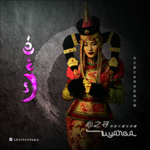

乌英嘎
============================

|  |  |
| :--: | :-- |
| [ 乌英嘎](https://i.xiami.com/wuyingga) | **播放数**: 1069457 **粉丝数**: 413 **评论数**: 18 **地区**: China 中国大陆 **风格**: 世界音乐 World Music  |

## 档案

乌英嘎，蒙语意为旋律。为旋律而生，生为旋律。古老的蒙古民族对旋律美的向往奔腾在她年轻的血脉中，她用无与伦比的歌声征服了草原，成为蒙古族长调这一世界非物质文化遗产的传承者，同时也是著名蒙古族歌唱家拉苏荣、阿拉坦其其格的得意门生！   乌英嘎，2016年登上央视春晚，2017年荣获央视中国民歌大会全国总擂主。著名音乐评论家田青说：“我听乌英嘎演唱立刻想起'原声天籁、律动中国'这句词。真是天籁之音！也让我想起汉语有一个名词叫声遏行云，就是形容美好的声音把天上飞驰的流云都停止了，太好听了，云彩都不愿意飞走了！真是日听长调三十首，切盼能做草原人。”   乌英嘎既是中国首位长调民歌硕士研究生，也是一位深受部队官兵喜爱的文艺战士。她曾经历了9年高等学府的专业磨砺，又投身到部队这个火热的军营淬火10年，先后在内蒙古军区文工团和陆军文工团服役，足迹遍及八千里边防和大江南北的军营哨所，多次全国全军大赛中揽金夺银，她已经成为深受部队官兵喜爱的军旅歌唱家。   乌英嘎的歌声中有草原的辽阔，有蓝天白云的高远，有古老牧人的向往和苍凉，还有时代精神和时尚生活的元素。她的演唱被赞为有灵性的歌者，她的演唱风格兼容并蓄自成一体，融民族、通俗、原声态于一身，形成了大气、唯美的特质，在当今歌坛独树一帜。她音质清澈纯美，富于变化，涵浑大气，灵秀韵致，极具张力与穿透力，极富艺术表现力与感染力，被誉为“草原天籁之音”。   个人简历： 姓名：乌英嘎 出生日期: 1985年6月 籍贯：内蒙古锡林郭勒盟正蓝旗 民族：蒙古族 学历：硕士研究生 主修：长调专业   艺术简历： 2003年9月至2007年7月 内蒙古大学艺术学院本科，师从其其格教授学习长调。 2007年9月至2010年7月内蒙古大学艺术学院硕士研究生，师从硕士生导师格日勒图博士，学习与研究蒙古族长调专业。   演出情况： 2005年至2013年连续八年参加“伊利情”中国呼和浩特昭君文化节开幕式大型文艺晚会《天堂草原》的演出和录制。 2005年1月随内蒙古代表团赴台湾参加国际艺术交流会大型演出。 2006年1月随内蒙古消防文工团赴香港参加世界国际消防况技大赛的演出活动。 2007年至2015年连续8年参加内蒙古电视台蒙汉语春节晚会的录制。 2007年2月赴奥地利维也纳金色大厅参加2007年维也纳中国新春音乐会的演出和录制。 2008年5月随内蒙古军区文工团赴俄罗斯演出。 2008年7月参加中央电视台国际频道举办的鄂温克“中华情，相约草原”大型演出。 2008年9月参加中央电视台举办的“中华情,相约水上荣成”大型中秋晚会。 2008年10月蒙古国邀请，参加蒙古国著名作曲家巴拉哈扎布先生的个人作品音乐会。 2008年11月随上海东方卫视赴法国巴黎参加上海世界博览会演出。 2009年7月参加中国摇滚音乐节。 2009年10月参加内蒙古草原母亲节大型晚会 。 2010年1月参加军民迎新春文艺晚会。 2010年至2017年连续7年参加全军“军营大拜年”大型演出。 2010年1月参加中国文学艺术界2010年春节大联欢 2010年6月在内蒙古呼和浩特举办《这个夏天最美 丽的声音》个人汇报演唱会。 2010年8月代表中国军方赴哈萨克斯坦参加《上合组织联合军演》演出。 2011年5月发行首张个人专辑《美丽的声音》。 2011年7月参加中共中央宣传部，中华人民共和国文化部，国家广播电视总局，中国人民解放军总政治部等单位主办的庆祝中国共产党成立90周年文艺晚会《我们的旗帜》。 2011年8月参加内蒙古自治区文化厅内蒙古自治区团委内蒙古电视台承办的中蒙青年友好联欢晚会。 2011年10月参加内蒙古党委宣传部举办的北京工人体育馆举办的“聆听草原内蒙古名家名曲演唱会”。 2011年10月参加《黄河情韵》人民大会堂大型演唱会。 2012年6月随团到北京参加第四届全国少数民族文艺汇演，做为解放军代表团代表接受胡锦涛主席的接见。 2012年6月第二张全新蒙语通俗歌曲专辑出版，得到社会各界的好评并专辑里的歌曲“晚秋清风”广为流传。 2012年9月参加自治区“歌声飘过草原—内蒙古青年歌手演唱会”。 2012年9月参加第二届中国 •呼和浩特少数民族文化旅游艺术节开幕式专场文艺晚会。 2013年6月担任内蒙古电视台《红红青春》大型校园歌唱比赛评委。 2013年至2017年参加战友文工团创作的《人间正道是沧桑》大型声乐套曲西柏坡组歌，担任歌曲《亲爱的青春》领唱。 2014年6月参加全军文艺汇演，获得金奖 2014年10月参加中华人民共和国成立65周年人民大会堂音乐会《美丽中国 光荣梦想》。 2015年12月参加中央电视台栏目《我要上春晚》。 2016年1月参加中央电视台春节联欢晚会。 2016年6月参加山东省庆祝中国共产党成立95周年文艺晚会《向着伟大梦想》。 2016年7月参加央视《民歌中国》蒙古族专场节目录制。 2016年8月参加鄂尔多斯国际那达慕开幕式。 2016年8月参加央视7套军事频道纪念长征《雄关漫道•长征路上的歌》系列节目录制。 2016年12月参加大型原创音乐剧《草原恋》，担任女主角，饰演方岚。 2016年12月30日参加全国政协2017年新年茶话会文艺演出。 2017年1月参加央视《东西南北贺新春》春节特别节目。 2017年1月参加内蒙古卫视《蔚蓝的故乡》春节天天乐节目，演唱节目主题歌曲。 2017年2月参加央视元宵特别节目星光璀璨演唱会。 2017年3月参加2017年两会“少数民族代表委员茶话会”演出。 2017年3月参加《纳文江边的思念》诺敏作词声乐作品音乐会。 2017年4月录制央视综艺频道《天天把歌唱》。 2017年6月包头大剧院两场大型原创音乐剧《草原恋》担任女主角，饰演方岚。 2017年7月参加建军90周年中国人民解放军陆军政治工作部文工团专场《新型陆军向前进》文艺晚会。 2017年7月参加央视7套《从这里走向战场》慰问朱日和训练基地受阅部队官兵文艺演出。 2017年7月歌曲《凌晨一点半》网络点击率突破百万。 2017年8月参加《我们的队伍向太阳》山东省纪念中国人民解放军建军90周年文艺演出。 2017年8月参加央视第二季《中国民歌大会》，获得全国总擂主。 2017年8月赴西藏中印对峙边境慰问演出。 2017年9月录制央视巅峰音乐会云飞专场。 2017年10月参加智慧之光感悟《易经》咏诵会。 2017年11月参加中央电视台“心连心”艺术团赴福建莆田慰问演出。 2017年11月作为青年代表录制央视《开讲啦》中国音乐学院院长王黎光专场。 2017年11月录制央视《我要上春晚》。 2017月11月赴云南中缅边境部队慰问演出。 2017年12月连续七天录制内蒙古卫视蔚蓝的故乡2018春节特别节目《春节天天乐》，并演唱主题歌曲。 2018年1月参加央视我们的中国梦2018《东西南北》贺新春特别节目录制。 2018年1月录制央视军事频道军营大舞台《放歌新时代》节目。 2018年1月录制央视军事频道春节特别节目《军营大拜年》。 2018年2月参加中央电视台春节联欢晚会海南三亚分会场。 2018年2月参加央视春节特别节目《合唱春晚》。 2018年2月参加2018内蒙古网络春晚的录制。 2018年2月录制内蒙古锡林郭勒盟春节联欢晚会。 2018年2月录制内蒙古达茂联合旗春节晚会。   获奖情况： 2005年荣获《内蒙古自治区第二届长调歌曲大赛》职业组优秀选手奖。 2005年参《八省区首届蒙古族歌曲电视大奖赛》荣获职业组二等奖。 2006年荣获《第十二届CCTV全国青年歌手大奖赛》内蒙古区选拔赛，民族唱法三等，最具人气奖。 2006年代表自治区参加《第十二届CCTV全国青年歌手大奖赛总决赛》获团体赛优胜奖(担任独唱)。 2007年4月—8月参加由内蒙古电视,中视传媒,内蒙古移动公司主办的《“天籁草原移动中传情”首届歌曲草原星全民选举》系列活动，并在中央电视台《星光大道》承办的总决赛中荣获第一名和最佳上镜奖。 2007年12月参加由中国文化部举办的中国原生态民歌大赛优秀演唱奖。 2008年代表内蒙古自治区参加第十三届CCTV青年歌手大奖赛团体决赛获得优秀奖。 2009年荣获全国第九届全军文艺汇演二等奖。 2013年荣获全国少数民族文艺汇演金奖。 2014年荣获全国第十届全军文艺汇演金奖。 2017年荣获央视第二季《中国民歌大会》全国总擂主。 2017年荣立陆军政治工作部三等功奖章。

## 专辑

| 名称 | 语种 | 唱片公司 | 发行时间 | 专辑类别 | 专辑风格 |
| :--: | :-- | :-- | :-- | :-- | :-- |
| [ 锡林郭勒草原](./albums/2105187758.md) | 国语 |  | 2019年08月24日 | EP, 单曲 | 流行 Pop |
| [ 深秋清风（单曲专辑）](./albums/2104143462.md) | 国语 | 独立发行 | 2018年10月23日 | 合集, 杂锦 | 蒙古 | 呼麦 Throat Singing |
| [ 心之寻草原天籁乌英嘎](./albums/2104099921.md) | 国语 | HIFIVE | 2018年10月15日 | 录音室专辑 | 民谣 Folk |
| [ 阿爸](./albums/2103751480.md) | 国语 | 独立发行 | 2018年06月16日 | EP, 单曲 | 世界音乐 World Music |
| [ 军旅歌曲](./albums/2103579958.md) | 国语 | 独立发行 | 2017年11月15日 | 精选集 | 军旅歌曲 Military Songs |
| [ 精选集](./albums/2103579953.md) | 国语 | 独立发行 | 2017年06月16日 | 精选集 | 蒙古 | 呼麦 Throat Singing, 中国传统民歌 Chinese Traditional Folk, 世界音乐 World Music |
| [ 深秋清风](./albums/994001354.md) | 蒙古语 | 深圳印象 | 2012年08月15日 | 录音室专辑 | 民谣 Folk |
| [ 美丽声音](./albums/1394593336.md) | 国语 | 内蒙古音像出版社 | 2011年06月16日 | 录音室专辑 | 传统民谣 Traditional Folk |
| [ 冰雪之约](./albums/2105446426.md) | 国语 |  | 不详 | EP, 单曲 |  |

## 评论

|  |  |  |  |
| :-- | :-- | :-- | :-- |
|  [虾米用户](https://emumo.xiami.com/u/404768205)  2020-10-27 00:36 赞(0) 踩(0) | 
今晚听歌难眠！
 |
|  [虾米用户](https://emumo.xiami.com/u/352220781)  2020-09-23 10:24 赞(0) 踩(0) | 
  
 |
|  [虾米用户](https://emumo.xiami.com/u/9080939) 不为无益之事，何遣有涯之... 2020-07-22 01:00 赞(2) 踩(0) | 
好嗓音
 |
|  [虾米用户](https://emumo.xiami.com/u/8337431) 以乐会友 2020-04-26 13:45 赞(1) 踩(0) | 
蒙音20200426。9
 |
|  [虾米用户](https://emumo.xiami.com/u/429143951) 音乐，不仅慰藉暖心，而且... 2020-03-25 06:20 赞(1) 踩(0) | 
你的蒙古长调太美了！让我不由自主地想起了&amp;ldquo;天苍苍，野茫茫，风吹草低见牛羊&amp;rdquo;的蒙古大草原&amp;hellip;&amp;hellip;
 |
|  [虾米用户](https://emumo.xiami.com/u/1153116)  2019-06-12 22:59 赞(1) 踩(0) | 
******
 |
|  [虾米用户](https://emumo.xiami.com/u/230557354) 点击编辑 2019-05-04 19:06 赞(1) 踩(0) | 
厉害
 |
|  [虾米用户](https://emumo.xiami.com/u/305374230)  2018-12-26 20:19 赞(2) 踩(0) | 
唱的太好听了   
 |
|  [虾米用户](https://emumo.xiami.com/u/260286636)   2018-12-11 01:15 赞(1) 踩(0) | 
请你们帮我找｛雪山之子｝这首歌我十几年没有听到了
 |
|  [虾米用户](https://emumo.xiami.com/u/406377509)  2018-10-21 09:25 赞(2) 踩(0) | 
我喜欢她唱的所有歌曲！
 |
|  [虾米用户](https://emumo.xiami.com/u/347120294)  2018-06-07 14:02 赞(2) 踩(0) | 
乌英嘎唱的每一首歌都好听到让你醉！
 |
|  [虾米用户](https://emumo.xiami.com/u/290146694)  2018-01-13 20:37 赞(2) 踩(0) | 
我喜欢她的站在在珠穆朗玛风口
 |
|  [虾米用户](https://emumo.xiami.com/u/24213) 我还没想好要写什么... 2017-10-09 21:54 赞(1) 踩(0) | 
乌英嘎参加了中国民歌大会，会唱四岁的海骝马么？
 |
|  [虾米用户](https://emumo.xiami.com/u/279194708)  2017-05-10 22:53 赞(2) 踩(0) | 
乌英嘎，哈琳，德德玛，降央都是女神。
 |
| ⇒ |  [虾米用户](https://emumo.xiami.com/u/8192902)   2020-04-26 23:40 赞(0) 踩(0) | 
基本同意，女神、德德玛就算了！
 |
|  [虾米用户](https://emumo.xiami.com/u/279194708)  2017-05-10 22:52 赞(2) 踩(0) | 
难得的好歌。祈盼（相遇）及（思念母亲的心）尽快出来。
 |
|  [虾米用户](https://emumo.xiami.com/u/5094063) Soulmates ne... 2015-06-11 22:29 赞(0) 踩(0) | 
同楼上，怎么没有我女神的歌
 |
|  [虾米用户](https://emumo.xiami.com/u/15290847) ............ 2013-05-16 14:45 赞(0) 踩(0) | 
怎么没有我的偶像的歌
 |
