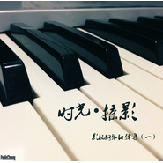

张哲健
============================

|  |  |
| :--: | :-- |
| [ 张哲健](https://i.xiami.com/pauliecheung) | **播放数**: 2617270 **粉丝数**: 375 **评论数**: 27 **地区**: China 中国大陆 **风格**: 电影原声 Film Score, 独立电子乐 Indietronica  |

## 档案

我要带你离开这个残破的宇宙。

## 专辑

| 名称 | 语种 | 唱片公司 | 发行时间 | 专辑类别 | 专辑风格 |
| :--: | :-- | :-- | :-- | :-- | :-- |
| [ 时光·掠影影视钢琴翻弹集（一）](./albums/122114878.md) | 其他 | 独立发行 | 2015年01月25日 | 原声带, 影视音乐 | 电影原声 Film Score, 卡通配乐 Cartoon Music, 键盘音乐 Keyboard |
| [ Decision](./albums/1288467091.md) | 其他 | 独立发行 | 2012年12月31日 | 录音室专辑 | 氛围浩室舞曲 Ambient House, 独立电子乐 Indietronica |

## 评论

|  |  |  |  |
| :-- | :-- | :-- | :-- |
|  [虾米用户](https://emumo.xiami.com/u/358104299) 悲观的唯心存在现实解构虚... 2021-01-20 11:09 赞(0) 踩(0) | 
46976
 |
|  [虾米用户](https://emumo.xiami.com/u/14738431) 我还没想好要写什么... 2021-01-08 20:21 赞(0) 踩(0) | 
加油奥利给
 |
|  [虾米用户](https://emumo.xiami.com/u/18131306) You are ther... 2020-08-06 19:41 赞(0) 踩(0) | 
好棒的演奏！
 |
|  [虾米用户](https://emumo.xiami.com/u/15144244) 人生如逆旅，我亦是行人。... 2020-03-24 15:51 赞(0) 踩(0) | 
好听～
 |
|  [虾米用户](https://emumo.xiami.com/u/314603340) 时光不老我们不分 2020-01-13 19:52 赞(0) 踩(0) | 
纯净
 |
|  [虾米用户](https://emumo.xiami.com/u/284650957) 我还没想好要写什么... 2018-10-05 16:48 赞(1) 踩(0) | 
真的好动听
 |
|  [虾米用户](https://emumo.xiami.com/u/342787056)  2018-09-04 20:27 赞(1) 踩(0) | 
听得到感情的钢琴声  
 |
|  [虾米用户](https://emumo.xiami.com/u/342600808)  2018-01-05 12:42 赞(1) 踩(0) | 
很欣赏你的作品，很好听，继续保持啊 
 |
|  [虾米用户](https://emumo.xiami.com/u/322292562)  2017-10-13 17:20 赞(1) 踩(0) | 
666
 |
|  [虾米用户](https://emumo.xiami.com/u/262023241)  2017-09-05 20:26 赞(1) 踩(0) | 
哥哥如果你把曲填上词就赞了
 |
|  [虾米用户](https://emumo.xiami.com/u/280644638)  2017-08-18 20:20 赞(2) 踩(0) | 
        
 |
|  [虾米用户](https://emumo.xiami.com/u/280644638)  2017-08-18 20:19 赞(2) 踩(0) | 
  
 |
|  [虾米用户](https://emumo.xiami.com/u/7111852)  2017-08-05 14:23 赞(1) 踩(0) | 
从Magic waltz来，好棒！支持~
 |
|  [虾米用户](https://emumo.xiami.com/u/120574044) 全宇宙最傻逼…… 2017-07-30 21:59 赞(1) 踩(0) | 
能录always with me吗？最近在练这首
 |
|  [虾米用户](https://emumo.xiami.com/u/295124414)  2017-05-09 21:31 赞(1) 踩(0) | 
弹得真好！！！太好听了！！！！！！
 |
|  [虾米用户](https://emumo.xiami.com/u/18640914) 白茶清欢无别事，碧海金阳... 2017-04-30 22:31 赞(0) 踩(0) | 
你好，弹的不错。加油！
 |
|  [虾米用户](https://emumo.xiami.com/u/44843106) 小时候梦见自己打死小怪兽 2017-03-22 20:57 赞(1) 踩(0) | 
哇！我发现了什么？
 |
|  [虾米用户](https://emumo.xiami.com/u/50184226)  2016-07-07 15:50 赞(2) 踩(0) | 
你好 一起做首歌 有兴趣吗
 |
|  [虾米用户](https://emumo.xiami.com/u/9613569) 我还没想好要写什么... 2015-12-13 21:01 赞(1) 踩(0) | 
超赞
 |
|  [虾米用户](https://emumo.xiami.com/u/50149793)  2015-08-20 18:39 赞(1) 踩(0) | 
雨天和钢琴声更配哦 
 |
|  [虾米用户](https://emumo.xiami.com/u/49801362) 96后歌手 2015-08-01 09:01 赞(2) 踩(0) | 
可以交个朋友吗      音乐不错的
 |
|  [虾米用户](https://emumo.xiami.com/u/49801362) 96后歌手 2015-07-30 14:20 赞(2) 踩(0) | 
不错    辰星来访
 |
|  [虾米用户](https://emumo.xiami.com/u/34758338) 暂无签名~ 2015-07-18 23:20 赞(2) 踩(0) | 
hi
 |
|  [虾米用户](https://emumo.xiami.com/u/13557071) 那些日子你会不会舍不得 2015-05-30 15:53 赞(1) 踩(0) | 
大师你好！！！！！！hiahiahia～～
 |
|  [虾米用户](https://emumo.xiami.com/u/24038685)  2015-02-20 00:14 赞(1) 踩(0) | 
hello,大师
 |
|  [虾米用户](https://emumo.xiami.com/u/1266836)  2015-01-27 09:51 赞(1) 踩(0) | 
纪念大师的第一步！~
 |
|  [虾米用户](https://emumo.xiami.com/u/16961759) 永远长不大的少年 2015-01-25 08:40 赞(1) 踩(0) | 
~
 |
