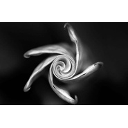
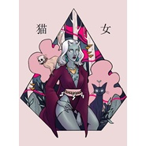
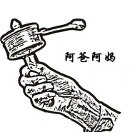
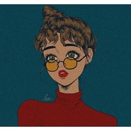
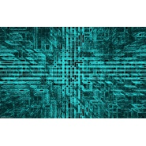
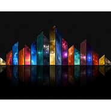
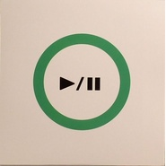

Tebby
============================

|  |  |
| :--: | :-- |
| [ Tebby](https://i.xiami.com/tebbymusic) | **地区**: China 中国大陆 **风格**: 流行 Pop, 原声 Soundtrack **播放数**: 7990279 **粉丝数**: 769 **评论数**: 59  |

## 档案

爱玩车的音乐制作人！！！B站搜：音乐制作人Tebby  希望大家多多支持~~~

## 专辑

| 名称 | 语种 | 唱片公司 | 发行时间 | 专辑类别 | 专辑风格 |
| :--: | :-- | :-- | :-- | :-- | :-- |
| [ 未来程式/Future.exe编程猫主题歌曲](./albums/2104655426.md) | 国语 | 郝斌音乐工作室 | 2019年03月09日 | EP, 单曲 | 流行摇滚 Pop Rock, 回响贝斯 Dubstep |
| [ 中国经典古诗词歌曲原创古诗词歌曲精选](./albums/2104386533.md) | 国语 | 郝斌音乐工作室 | 2018年12月18日 | 精选集 | 国语流行 Mandarin Pop, 中国风 China-Wave, 儿歌 Nursery Rhyme |
| [ 爱♥姥姥献给天堂的姥姥](./albums/2104038469.md) | 其他 | 郝斌音乐工作室 | 2018年09月18日 | EP, 单曲 | 新世纪音乐 New Age, 现代古典 Modern Classical, 原声 Soundtrack |
| [ 命运Symphony No.5 in C minor.Op.67](./albums/2103938684.md) | 国语 | 郝斌音乐工作室 | 2018年08月20日 | EP, 单曲 | 嘻哈 Hip-Hop, 古典跨界 Classical Crossover, 电影原声 Film Score |
| [ 篮球少年Dear Boys](./albums/2103810387.md) | 国语 | 郝斌音乐工作室 | 2018年07月16日 | EP, 单曲 | 国语流行 Mandarin Pop, 流行说唱 Pop Rap, 电子 Electronic |
| [ 甜蜜感觉京都念慈菴产品宣传曲](./albums/2103794227.md) | 国语 | 郝斌音乐工作室 | 2018年07月10日 | EP, 单曲 | 电音流行 Electropop, 雷鬼流行 Reggae Pop, 电子舞曲 EDM / Electronic Dance Music |
| [ 爱我想爱的人(电音版)电视剧《谈判官》主题曲](./albums/2103722087.md) | 国语 | 郝斌音乐工作室 | 2018年05月28日 | EP, 单曲 | 国语流行 Mandarin Pop, 电音流行 Electropop, 电视原声 Television Music |
| [ 世界为你转身(女声版)电视剧《谈判官》主题曲](./albums/2103718869.md) | 国语 | 郝斌音乐工作室 | 2018年05月25日 | EP, 单曲 | 国语流行 Mandarin Pop, 爵士流行 Jazz Pop, 电视原声 Television Music |
| [ 盲目自信(男声版)电视剧《谈判官》主题曲](./albums/2103714810.md) | 国语 | 郝斌音乐工作室 | 2018年05月20日 | EP, 单曲 | 国语流行 Mandarin Pop, 电视原声 Television Music |
| [ 猫女Cat Woman](./albums/2103679583.md) | 国语 | 郝斌音乐工作室 | 2018年04月12日 | EP, 单曲 | 国语流行 Mandarin Pop, 流行舞曲 Dance-Pop, 电子 Electronic |
| [ 蓝灰色的记忆Memory](./albums/2103673092.md) | 国语 | 郝斌音乐工作室 | 2018年04月09日 | EP, 单曲 | 国语流行 Mandarin Pop |
| [ 阿爸阿妈](./albums/2103658328.md) | 国语 | 郝斌音乐工作室 | 2018年03月31日 | EP, 单曲 | 国语流行 Mandarin Pop, 现代古典 Modern Classical, 轻音乐 Easy Listening |
| [ 夜空中最亮的星全新编曲制作](./albums/2103520448.md) | 国语 | 郝斌音乐工作室 | 2018年02月08日 | EP, 单曲 | 国语流行 Mandarin Pop, 流行摇滚 Pop Rock, 电子 Electronic |
| [ 月亮代表我的心For Celine](./albums/2102869243.md) | 国语 | 郝斌音乐工作室 | 2017年10月08日 | EP, 单曲 | 国语流行 Mandarin Pop, 轻音乐流行 Light Pop |
| [ Kiss Me爱迪尔珠宝宣传曲](./albums/2102867493.md) | 国语 | 郝斌音乐工作室 | 2017年10月02日 | EP, 单曲 | 流行说唱 Pop Rap, 古典跨界 Classical Crossover, 电子 Electronic |
| [ Dream Light梦想之光](./albums/2102863509.md) | 国语 | 郝斌音乐工作室 | 2017年09月26日 | EP, 单曲 | 嘻哈 Hip-Hop, 古典跨界 Classical Crossover |
| [ 渣男Asshole Man](./albums/2102817573.md) | 国语 | 郝斌音乐工作室 | 2017年08月21日 | EP, 单曲 | 老派说唱 Old-school Hip Hop, 电子 Electronic |
| [ Boom Ha电子嘻哈风格](./albums/2102776749.md) | 国语 | 郝斌音乐工作室 | 2017年07月01日 | EP, 单曲 | 嘻哈 Hip-Hop, 电子 Electronic |
| [ Layeo电子嘻哈风格](./albums/2102765186.md) | 国语 | 郝斌音乐工作室 | 2017年06月15日 | EP, 单曲 | 嘻哈 Hip-Hop, 电子 Electronic |
| [ Yes I can do电子嘻哈风格](./albums/2102748057.md) | 其他 | 郝斌音乐工作室 | 2017年05月16日 | EP, 单曲 | 嘻哈 Hip-Hop, 电子 Electronic |
| [ Electronic technology电子科技配乐](./albums/2102743469.md) | 其他 | 郝斌音乐工作室 | 2017年05月06日 | EP, 单曲 | 太空新世纪 Space New Age, 原声 Soundtrack, 独立电子乐 Indietronica |
| [ The shape of the love youFor Celine](./albums/2102725283.md) | 纯音乐 | 郝斌音乐工作室 | 2017年03月31日 | EP, 单曲 | 器乐独奏 Solo Instrumental, 爵士 Jazz, 轻音乐 Easy Listening |
| [ 夜静香For Celine](./albums/2102722528.md) | 国语 | 郝斌音乐工作室 | 2017年03月28日 | EP, 单曲 | 国语流行 Mandarin Pop, 中国风 China-Wave, 电子 Electronic |
| [ Warm LightFor Celine](./albums/2102691073.md) | 其他 | 郝斌音乐工作室 | 2017年02月08日 | EP, 单曲 | 嘻哈 Hip-Hop, 器乐流行 Instrumental Pop, 古典跨界 Classical Crossover |
| [ 器乐组曲纯音乐](./albums/2102664121.md) | 其他 | 郝斌音乐工作室 | 2016年12月12日 | EP, 单曲 | 现代古典 Modern Classical, 器乐独奏 Solo Instrumental, 轻音乐 Easy Listening |
| [ 是什么让我遇见这样的你钢琴弹唱版](./albums/2102644362.md) | 国语 | 郝斌音乐工作室 | 2016年11月06日 | EP, 单曲 | 国语流行 Mandarin Pop, 轻音乐 Easy Listening |
| [ 纯钢琴曲精选纯音乐](./albums/2102644060.md) | 其他 | 郝斌音乐工作室 | 2016年11月01日 | 精选集 | 器乐独奏 Solo Instrumental, 原声 Soundtrack, 轻音乐 Easy Listening |
| [ We Love流行摇滚](./albums/2100389140.md) | 国语 | 郝斌音乐工作室 | 2016年09月12日 | EP, 单曲 | 国语流行 Mandarin Pop, 流行摇滚 Pop Rock, 电子 Electronic |
| [ 深圳国际山地电影节宣传片配乐原创影视配乐](./albums/2100346488.md) | 其他 | 郝斌音乐工作室 | 2016年05月28日 | 原声带, 影视音乐 | 新世纪音乐 New Age, 实验音乐 Experimental, 原声 Soundtrack |
| [ 古装情景喜剧电影配乐原创影视配乐](./albums/2100345348.md) | 其他 | 郝斌音乐工作室 | 2016年05月26日 | 原声带, 影视音乐 | 实验音乐 Experimental, 电影原声 Film Score |
| [ Sober全新风格编曲](./albums/2100306802.md) | 韩语 | 郝斌音乐工作室 | 2016年03月31日 | EP, 单曲 | 韩国流行 K-Pop, 器乐流行 Instrumental Pop, 流行摇滚 Pop Rock |
| [ If You (中文版)Tebby(cover)](./albums/2100305226.md) | 国语 | 郝斌音乐工作室 | 2016年03月30日 | EP, 单曲 | 国语流行 Mandarin Pop |
| [ 原创影视配乐精选纯音乐](./albums/736624984.md) | 其他 | 郝斌音乐工作室 | 2015年07月06日 | 精选集 | 原声 Soundtrack, 实验音乐 Experimental, 器乐独奏 Solo Instrumental |
| [ 30 SexyMusic Effect](./albums/1035512333.md) | 英语 | 郝斌音乐工作室 | 2015年07月01日 | EP, 单曲 | 韩国流行 K-Pop, 实验音乐 Experimental, 独立摇滚 Indie Rock |
| [ La Song电子摇滚(Fighting Music)](./albums/434126988.md) | 英语 | 郝斌音乐工作室 | 2015年06月12日 | EP, 单曲 | 韩国流行 K-Pop, 实验音乐 Experimental, 独立摇滚 Indie Rock |
| [ 你的谁电子摇滚风格](./albums/233350421.md) | 国语 | 郝斌音乐工作室 | 2015年06月06日 | EP, 单曲 | 实验音乐 Experimental, 流行摇滚 Pop Rock, 电子 Electronic |
| [ 心动全新编曲](./albums/418118555.md) | 国语 | 郝斌音乐工作室 | 2015年05月12日 | EP, 单曲 | 国语流行 Mandarin Pop, 现代古典 Modern Classical, 电影原声 Film Score |
| [ 原创MINI配乐精选DEMO试听版](./albums/926774846.md) | 其他 | 郝斌音乐工作室 | 2015年03月01日 | 精选集 | 原声 Soundtrack, 游戏配乐 Video Game Music, 卡通配乐 Cartoon Music |
| [ 青春修炼手册(独唱版)独唱版](./albums/12749330.md) | 国语 | 郝斌音乐工作室 | 2015年01月01日 | EP, 单曲 | 嘻哈 Hip-Hop, 国语流行 Mandarin Pop, 电子 Electronic |
| [ 作品案例试听(客户)DEMO试听版](./albums/1112098345.md) | 其他 | 郝斌音乐工作室 | 2014年10月01日 | 合集, 杂锦 | 流行 Pop |
| [ 原创儿童歌曲精选(二)DEMO试听版](./albums/2102641421.md) | 国语 | 郝斌音乐工作室 | 2014年08月31日 | 精选集 | 国语流行 Mandarin Pop, 儿歌 Nursery Rhyme |
| [ 原创儿童歌曲精选(一)DEMO试听版](./albums/112068252.md) | 国语 | 郝斌音乐工作室 | 2014年08月01日 | 精选集 | 国语流行 Mandarin Pop, 儿歌 Nursery Rhyme |
| [ 爱(Love)纯音乐(送给我的爸爸和妈妈)](./albums/1436450624.md) | 其他 | 郝斌音乐工作室 | 2014年07月01日 | EP, 单曲 | 器乐流行 Instrumental Pop, 原声 Soundtrack |
| [ 天空之城全新编曲](./albums/1034170028.md) | 国语 | 郝斌音乐工作室 | 2014年06月12日 | EP, 单曲 | 国语流行 Mandarin Pop, 实验音乐 Experimental, 电影原声 Film Score |
| [ WWE(世界摔角娱乐)World Wrestling Entertainment](./albums/1136547172.md) | 其他 | 郝斌音乐工作室 | 2013年10月01日 | EP, 单曲 | 重金属 Heavy Metal, 原声 Soundtrack |
| [ 翻唱歌曲精选(二)业余水平 多多指教](./albums/278273616.md) | 国语 | 郝斌音乐工作室 | 2013年08月01日 | 精选集 | 国语流行 Mandarin Pop |
| [ 翻唱歌曲精选(一)业余水平 多多指教](./albums/1776717618.md) | 国语 | 郝斌音乐工作室 | 2013年07月01日 | 精选集 | 国语流行 Mandarin Pop |

## 评论

|  |  |  |
| :-- | :-- | :-- |
|  [虾米用户](https://emumo.xiami.com/u/404748839) 噓。。靜靜聽音樂就好 2019-06-01 23:48 赞(0) 踩(0) | 
謝謝你的演繹。淚水止不住流，那是因為感動，因為我好想他
 |
|  [虾米用户](https://emumo.xiami.com/u/358104299) 悲观的唯心存在现实解构虚... 2019-05-03 02:56 赞(0) 踩(0) | 
10873
 |
|  [虾米用户](https://emumo.xiami.com/u/303976160) 狠一点 2019-01-01 21:54 赞(1) 踩(0) | 
挺好听的，就是下载不起啊  
 |
| ⇒ |  [虾米用户](https://emumo.xiami.com/u/180169796) 责任心，事业心！ 2019-01-15 19:26 赞(0) 踩(0) | 
你好，我想问下这是谁翻唱的，类似的也有一个  ---慢慢喜欢你，就是不知道人名
 |
| ⇒ |  [虾米用户](https://emumo.xiami.com/u/423562597) 不说了，千言万语说不出口... 2020-01-18 15:59 赞(0) 踩(0) | 
同感
 |
| ⇒ |  [虾米用户](https://emumo.xiami.com/u/423562597) 不说了，千言万语说不出口... 2020-01-18 16:00 赞(0) 踩(0) | 
<q><b>用户941758说：</b></q>
 |
|  [虾米用户](https://emumo.xiami.com/u/308148615)  2018-12-18 20:51 赞(0) 踩(0) | 
不错
 |
|  [虾米用户](https://emumo.xiami.com/u/294154953)  2018-11-18 00:45 赞(0) 踩(0) | 
卡农好听，加油
 |
|  [虾米用户](https://emumo.xiami.com/u/133896746) 我还没想好要写什么... 2018-10-28 02:26 赞(0) 踩(0) | 
加油
 |
|  [虾米用户](https://emumo.xiami.com/u/375519735) 只要相信，期待就会成真 2018-07-11 01:30 赞(1) 踩(0) | 
美好的卡农，谢谢，好听好听    
 |
|  [虾米用户](https://emumo.xiami.com/u/291180925)  2018-05-16 15:03 赞(0) 踩(0) | 
挺好的
 |
|  [虾米用户](https://emumo.xiami.com/u/361482527)  2018-05-05 12:39 赞(0) 踩(0) | 
不用谢
 |
|  [虾米用户](https://emumo.xiami.com/u/344502432)  2018-03-10 18:31 赞(1) 踩(0) | 
你真的不适合搞音乐... 天赋这种东西不是每个人都有的 
 |
| ⇒ |  [虾米用户](https://emumo.xiami.com/u/17316452) 爱玩车的音乐制作人！B站... 2018-03-10 21:07 赞(0) 踩(0) | 
滚蛋
 |
| ⇒ |  [虾米用户](https://emumo.xiami.com/u/344502432)  2018-04-11 05:03 赞(0) 踩(0) | 
弹的烂，唱的更烂。做人素质还这么差...
 |
| ⇒ |  [虾米用户](https://emumo.xiami.com/u/344502432)  2018-04-11 13:24 赞(0) 踩(0) | 
<q><b>说：</b></q>
 |
| ⇒ |  [虾米用户](https://emumo.xiami.com/u/17316452) 爱玩车的音乐制作人！B站... 2018-04-11 14:12 赞(0) 踩(0) | 
<q><b>北极熊说：</b></q>
 |
| ⇒ |  [虾米用户](https://emumo.xiami.com/u/344502432)  2018-04-11 16:02 赞(0) 踩(0) | 
<q><b>Tebby说：</b></q>
 |
| ⇒ |  [虾米用户](https://emumo.xiami.com/u/344502432)  2018-04-11 16:22 赞(0) 踩(0) | 
<q><b>说：</b></q>
 |
| ⇒ |  [虾米用户](https://emumo.xiami.com/u/344502432)  2018-04-11 16:34 赞(0) 踩(0) | 
<q><b>说：</b></q>
 |
| ⇒ |  [虾米用户](https://emumo.xiami.com/u/226833808) 梦里见 2018-04-21 09:31 赞(0) 踩(0) | 
我觉得挺好的，不喜欢就不喜欢嘛，非要喷人家
 |
| ⇒ |  [虾米用户](https://emumo.xiami.com/u/1628323)   2018-04-22 17:56 赞(0) 踩(0) | 
<q><b>Tebby说：</b></q>
 |
| ⇒ |  [虾米用户](https://emumo.xiami.com/u/17316452) 爱玩车的音乐制作人！B站... 2018-04-22 21:55 赞(0) 踩(0) | 
<q><b>失踪的梦说：</b></q>
 |
| ⇒ |  [虾米用户](https://emumo.xiami.com/u/364476726)  2018-05-07 20:32 赞(0) 踩(0) | 
<q><b>北极熊说：</b></q>
 |
| ⇒ |  [虾米用户](https://emumo.xiami.com/u/17316452) 爱玩车的音乐制作人！B站... 2018-05-08 17:16 赞(0) 踩(0) | 
<q><b>同一列说：</b></q>
 |
| ⇒ |  [虾米用户](https://emumo.xiami.com/u/344502432)  2018-05-22 12:42 赞(0) 踩(0) | 
<q><b>Tebby说：</b></q>
 |
| ⇒ |  [虾米用户](https://emumo.xiami.com/u/344502432)  2018-05-22 12:50 赞(0) 踩(0) | 
<q><b>北极熊说：</b></q>
 |
|  [虾米用户](https://emumo.xiami.com/u/24325936) 无忧无虑，向前游。。。 2018-01-29 10:59 赞(1) 踩(0) | 
这头像，吓死人！
 |
|  [虾米用户](https://emumo.xiami.com/u/213683167)  2017-11-03 19:24 赞(1) 踩(0) | 
最爱的卡农！弹得太好啦！
 |
|  [虾米用户](https://emumo.xiami.com/u/35840776)  2017-10-27 23:26 赞(1) 踩(0) | 
您好，请问，终于等到你 这首歌的曲谱能给我吗、?真切希望！我的腾讯号278797264  想用来求婚。一直找不到。
 |
|  [虾米用户](https://emumo.xiami.com/u/295632843) 除了工作就是音乐 2017-09-06 21:28 赞(0) 踩(0) | 
很喜欢，不错
 |
|  [虾米用户](https://emumo.xiami.com/u/314786584)  2017-08-22 01:22 赞(0) 踩(0) | 
加油，很喜欢的一首曲子。
 |
|  [虾米用户](https://emumo.xiami.com/u/109862366)  2017-08-20 03:09 赞(0) 踩(0) | 
我怎么找不到情人这首歌了啊
 |
|  [虾米用户](https://emumo.xiami.com/u/314732584)  2017-08-06 20:59 赞(0) 踩(0) | 
加油 
 |
|  [虾米用户](https://emumo.xiami.com/u/267129156)  不负相识一场 自助者天... 2017-06-03 12:51 赞(0) 踩(0) | 
这是原唱吗？不错啊
 |
|  [虾米用户](https://emumo.xiami.com/u/267129156)  不负相识一场 自助者天... 2017-06-03 12:31 赞(0) 踩(0) | 
加油 
 |
|  [虾米用户](https://emumo.xiami.com/u/289462714)  2017-04-20 15:42 赞(0) 踩(0) | 
才华横溢琴声众人听。
 |
|  [虾米用户](https://emumo.xiami.com/u/283688334)  2017-03-27 06:53 赞(0) 踩(0) | 
不错哦
 |
|  [虾米用户](https://emumo.xiami.com/u/272815444)  2017-02-13 15:33 赞(1) 踩(0) | 

 |
|  [虾米用户](https://emumo.xiami.com/u/266061622) 今天虽然不高兴........ 2017-02-10 18:59 赞(0) 踩(0) | 
好听，喜欢！  
 |
|  [虾米用户](https://emumo.xiami.com/u/126346610) 美食美食，我怎么忍得住口... 2017-02-10 10:44 赞(0) 踩(0) | 
我好喜欢
 |
|  [虾米用户](https://emumo.xiami.com/u/84872680)  2017-01-23 18:21 赞(0) 踩(0) | 

 |
|  [虾米用户](https://emumo.xiami.com/u/255773470)  2016-12-20 20:10 赞(0) 踩(0) | 
真的好好听！
 |
|  [虾米用户](https://emumo.xiami.com/u/83995100)  2016-12-06 07:52 赞(3) 踩(0) | 
卡农太好听啦(｡･ω･｡)ﾉ♡
 |
|  [虾米用户](https://emumo.xiami.com/u/30073064)  2016-10-26 14:46 赞(0) 踩(0) | 
1111
 |
|  [虾米用户](https://emumo.xiami.com/u/867739) Instagram：MO... 2016-06-29 01:44 赞(2) 踩(0) | 
虽然不是生于音乐世家 同样从小学习音乐 三岁开始拉小提琴 来日本后学习了钢琴和架子鼓，其实很爱低音提琴和吉他，当代古典和氛围音乐一直是我的最爱，流行曲虽然好听但说过就过。音乐是我们生活的一部分但却在真实的生活之外，能让音乐成为真实的生活是一件很棒的事情，加油
 |
| ⇒ |  [虾米用户](https://emumo.xiami.com/u/17316452) 爱玩车的音乐制作人！B站... 2016-06-29 09:49 赞(0) 踩(0) | 
一起加油！~~~
 |
|  [虾米用户](https://emumo.xiami.com/u/8194276)  2016-06-19 13:14 赞(2) 踩(0) | 
挺厉害，真的好羡慕你的才华。从第一次看你摇滚卡农的视频到现在已经7年了。
 |
| ⇒ |  [虾米用户](https://emumo.xiami.com/u/17316452) 爱玩车的音乐制作人！B站... 2016-06-23 11:08 赞(0) 踩(0) | 
感谢你一路的支持！非常感谢~~~
 |
|  [虾米用户](https://emumo.xiami.com/u/81925010)  2015-11-16 22:07 赞(0) 踩(0) | 
加油吧，我们也一样。
 |
|  [虾米用户](https://emumo.xiami.com/u/49623914)  2015-04-27 16:19 赞(0) 踩(0) | 
赞
 |
|  [虾米用户](https://emumo.xiami.com/u/32104365) 顾问 全能音乐人 主播 2015-02-10 09:12 赞(0) 踩(0) | 
加油
 |
|  [虾米用户](https://emumo.xiami.com/u/14713252) 夏立 2015-01-23 02:50 赞(0) 踩(0) | 
我师父
 |
|  [虾米用户](https://emumo.xiami.com/u/37980879)  2014-12-26 05:37 赞(0) 踩(0) | 
1
 |
|  [虾米用户](https://emumo.xiami.com/u/41949759)  2014-10-02 05:29 赞(0) 踩(0) | 
郝歌夜深人静听的歌曲、那感觉那味道都到位了、加油我为你喝彩
 |
|  [虾米用户](https://emumo.xiami.com/u/39855252)  2014-08-09 19:37 赞(1) 踩(0) | 
那个，多不好意思啊。请问您那个【C大调流行摇滚风格】，有谱子吗？我知道您原创，但是特别希望您能把谱子写下来，个人认为真的很棒。3Q
 |
|  [虾米用户](https://emumo.xiami.com/u/10811244) 蒋酱 2014-06-10 21:07 赞(0) 踩(0) | 
加油！支持你！
 |
|  [虾米用户](https://emumo.xiami.com/u/2812223) 我爱你，虽然我只是一枚六 2014-03-11 02:00 赞(0) 踩(0) | 
好听，加油
 |
| ⇒ |  [虾米用户](https://emumo.xiami.com/u/17316452) 爱玩车的音乐制作人！B站... 2014-03-11 10:29 赞(0) 踩(0) | 
谢谢支持~~~
 |
