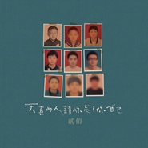
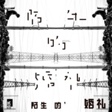

贰佰
============================

|  |  |
| :--: | :-- |
| [ 贰佰](https://i.xiami.com/erbai) | **地区**: China 中国大陆 **风格**: 传统民谣 Traditional Folk, 独立民谣 Indie Folk, 新民谣 Neofolk **播放数**: 18133868 **粉丝数**: 17594 **评论数**: 464  |

## 档案

流派：民谣 Folk   风格： 民谣 / 独立   　　2016岁末，摩登天空正式签下民谣唱作人贰佰，重新召唤起独立音乐最质朴动人的一面。贰佰在签约之际推出全新单曲《嘿，抬头！》。 　　贰佰2011年于网络发表首支单曲《我在太原和谁一起假装悲伤》。来自内蒙阿拉善的贰佰，嗓音也似乎染上了大漠的粗砺和苍凉，加之诚恳且无矫饰的词作，令他所唱出的爱情、青春与乡愁都多添几分朴实厚重，更具质感和穿透力。2011年11月，贰佰加入彼时成立不久的麻油叶民间民谣组织，亲历并推动了麻油叶的成长与壮大，伴随其从Livehouse一路走向工体馆，贰佰自身也成为各大音乐节常客。 　　近几年来，麻油叶众兄弟都已纷纷交出专辑，于是贰佰成了让乐迷等得最苦的那个人，所幸苦尽甘来之日已为时不远，目前贰佰的首张个人专辑已录制完毕，预计明年春天即可发布，而这首随签约推出的新单曲《嘿，抬头！》，则像一声亲切的问候。 　　贰佰总能以貌似轻松的口吻和嗓音切入，逐渐展开不算轻松的主题，就像这次歌中的人物速写，以钢琴和大提琴的细腻笔触，在清浅随意的勾勒中道尽沧桑况味。而歌曲的主人公不仅实有其人，更坦荡现身单曲封面，为这首歌赋予了无可辩驳的说服力与感染力。贰佰向大家介绍了这位大自己十几岁的“老”朋友，一位热爱文艺也办过乐队演出的咖啡馆老板，“有的时候他像一个坚强的自由的灵魂引导我前进，有的时候又像一个孤独的无家可归的酒鬼，时刻提醒，我的人生不该像他那样放任自流。” 　　《嘿，抬头！》可谓贰佰送给这位朋友的一份礼物，而他以自己的经历所给予贰佰的，又何尝不是生活的礼赠？如贰佰所言，“人生不会如你所愿，总会有迷失的时候，但即使坠入黑暗一无所有，我们也可以站在星空下，和自己的灵魂互相取暖。所以，迷失的时候，请抬头！” 　　作为摩登天空近期签下的唯一一位民谣音乐人，贰佰以其特有的音乐气质，适时唤回人们对摩登天空的独立音乐印象。

## 专辑

| 名称 | 语种 | 唱片公司 | 发行时间 | 专辑类别 | 专辑风格 |
| :--: | :-- | :-- | :-- | :-- | :-- |
| [ 天真的人请你忘了你自己](./albums/5021339469.md) | 国语 | 摩登天空 | 2020年08月21日 | 录音室专辑 |  |
| [ 别打扰他](./albums/5021339471.md) | 国语 | 摩登天空 | 2020年08月06日 | EP, 单曲 |  |
| [ 如果](./albums/5021349021.md) | 国语 | 摩登天空 | 2020年07月08日 | EP, 单曲 |  |
| [ 不再年轻](./albums/5021345871.md) | 国语 | 摩登天空 | 2020年06月10日 | EP, 单曲 |  |
| [ 莎琳娜](./albums/5021338985.md) | 国语 | 摩登天空 | 2018年10月12日 | EP, 单曲 |  |
| [ 陌生的婚礼](./albums/2104037376.md) | 国语 | 摩登天空 | 2018年09月19日 | EP, 单曲 | 独立民谣 Indie Folk |
| [ 嘿，抬头！](./albums/2102724254.md) | 国语 | 摩登天空 | 2017年03月30日 | 录音室专辑 |  |
| [ 玫瑰](./albums/2102692665.md) | 国语 | 摩登天空 | 2017年02月13日 | EP, 单曲 |  |
| [ 嘿，抬头！](./albums/2102674226.md) | 国语 | 摩登天空 | 2016年12月22日 | EP, 单曲 |  |

## 评论

|  |  |  |
| :-- | :-- | :-- |
|  [虾米用户](https://emumo.xiami.com/u/43875708)  遣词造句 穿山过水 他... 2020-07-08 13:00 赞(1) 踩(0) | 
虾米是完全没有新歌推了吗
 |
|  [虾米用户](https://emumo.xiami.com/u/8411207) 我没还好想写要什么… 2020-06-02 00:18 赞(0) 踩(0) | 
哥加油
 |
|  [虾米用户](https://emumo.xiami.com/u/429873825)  2019-12-20 09:35 赞(0) 踩(0) | 
好听，回味在其中，希望你有更多的作品，为你点赞
 |
|  [虾米用户](https://emumo.xiami.com/u/408559188)  2019-11-04 15:07 赞(0) 踩(0) | 
发现了宝，太好听了
 |
|  [虾米用户](https://emumo.xiami.com/u/419081922)  2019-02-14 00:07 赞(0) 踩(0) | 
喜欢你的歌声你的歌.喜欢你的低沉你的个性.
 |
|  [虾米用户](https://emumo.xiami.com/u/1530886)  2019-01-02 21:36 赞(1) 踩(0) | 
专门为了玫瑰来的，结果居然没得听！
 |
|  [虾米用户](https://emumo.xiami.com/u/217121072)  2018-10-01 11:19 赞(1) 踩(0) | 
喜欢你的歌，更喜欢你
 |
| ⇒ |  [虾米用户](https://emumo.xiami.com/u/406374087) 命运咬了我一口，我把它当... 2020-12-21 08:55 赞(0) 踩(0) | 
哈哈哈！
 |
|  [虾米用户](https://emumo.xiami.com/u/34634596) 本质逼裂波(1108，啪... 2018-09-02 22:12 赞(3) 踩(0) | 
跟伍佰什么关系&amp;hellip;？
 |
| ⇒ |  [虾米用户](https://emumo.xiami.com/u/311053681) 输入签名... 2020-12-21 23:08 赞(0) 踩(0) | 
贰百。。。五
 |
|  [虾米用户](https://emumo.xiami.com/u/4126784) 从前的旋律 2018-08-04 06:56 赞(0) 踩(0) | 
很期待你用这把声音唱出来的：玫瑰
 |
|  [虾米用户](https://emumo.xiami.com/u/44195290)  2018-06-15 13:19 赞(0) 踩(0) | 
错过了去年的巡演。 今年的夏季巡演都在北方， 明年来南方一定去听， 还要带上男朋友 
 |
|  [虾米用户](https://emumo.xiami.com/u/111127378) 我还没想好要写什么... 2018-05-17 22:52 赞(0) 踩(0) | 
光是这个声音就感觉爱上了你。 
 |
|  [虾米用户](https://emumo.xiami.com/u/260925831)  2018-05-17 16:56 赞(1) 踩(0) | 
听到落泪！
 |
|  [虾米用户](https://emumo.xiami.com/u/11264971) 灵魂不知何去何从... 2018-05-07 20:48 赞(0) 踩(0) | 
马上要开启一轮巡演了
 |
|  [虾米用户](https://emumo.xiami.com/u/43562045)  2018-04-18 15:29 赞(4) 踩(0) | 
有首诗写太原的 《我在下雪的太原想你》   我在下雪的太原想你  白皙的肌肤和晶莹的眸子，凝视  天空下缓慢飞舞的雪花  落在我的脸庞融化着对你的想念  容颜，纤细的手臂，坚毅的眼神  以及甜蜜的酒窝   我在下雪的太原想你  欢快的脚步踏着覆满雪的草坪，响动  犹如迎泽湖微漪的倒映  明亮起来雪的光芒牵动我的思绪  血脉，奔跑的双腿，愉悦的笑容  以及思念的皱纹   我在下雪的太原想你  雪落进眼中  被浓烈的思念融化了
 |
|  [虾米用户](https://emumo.xiami.com/u/43562045)  2018-04-18 15:28 赞(0) 踩(0) | 
我也是太原人
 |
|  [虾米用户](https://emumo.xiami.com/u/354933009)  2018-03-22 15:35 赞(0) 踩(0) | 
如果有机会希望和你能交个朋友吧
 |
|  [虾米用户](https://emumo.xiami.com/u/286053183)  2018-03-22 11:17 赞(1) 踩(0) | 
喜欢200的应该也会喜欢郑智化吧？
 |
|  [虾米用户](https://emumo.xiami.com/u/269492494)  2018-03-01 15:45 赞(0) 踩(0) | 
喜欢你的声音，有点小沧桑，每首都要单曲循环很久 
 |
|  [虾米用户](https://emumo.xiami.com/u/33717830) 天生神经质 & 2018-02-28 21:55 赞(0) 踩(0) | 
2018有上海巡演吗
 |
|  [虾米用户](https://emumo.xiami.com/u/47555314)   2018-02-25 22:09 赞(0) 踩(0) | 
新年快乐
 |
|  [虾米用户](https://emumo.xiami.com/u/335787824) 愿你我都有爱着爱着就永远... 2017-12-07 14:14 赞(2) 踩(0) | 
2017年长沙草莓音乐节，听到了现场版的《玫瑰》，我也不知道为什么眼泪会止不住地流，或许是因为你苍凉粗犷的嗓音，也或许是如歌词所唱生活越来越压抑，而我变得越来越不像自己，一个人站在悲催的风里吧。
 |
| ⇒ |  [虾米用户](https://emumo.xiami.com/u/406374087) 命运咬了我一口，我把它当... 2020-12-21 08:58 赞(0) 踩(0) | 
在身边喜欢摇滚喜欢民谣的人很少很少！女孩子更加少！但是在草莓音乐节上！女孩子真的非常多！草莓音乐节也让我认识到了女生对摇滚也是可以那么疯狂的
 |
|  [虾米用户](https://emumo.xiami.com/u/246044115)  2017-11-05 23:52 赞(0) 踩(0) | 
加油！！！贰佰～支持你
 |
|  [虾米用户](https://emumo.xiami.com/u/262982009) 卸载虾米是不可能的啦，这... 2017-10-28 00:09 赞(3) 踩(0) | 
贰佰你比伍佰少叁佰
 |
|  [虾米用户](https://emumo.xiami.com/u/6192678) 和而不同 2017-10-28 00:02 赞(0) 踩(0) | 
唱得不错，平淡但真实，仿佛过把去的景象全部拖出来摆到了面前。
 |
|  [虾米用户](https://emumo.xiami.com/u/38634495)  2017-10-27 23:34 赞(23) 踩(0) | 
路子是和逼哥很像,不过和伍佰是什么鬼关系？打了四折吗？
 |
| ⇒ |  [虾米用户](https://emumo.xiami.com/u/45121837) 暂无签名~ 2017-11-12 22:10 赞(0) 踩(0) | 
贰佰没有伍
 |
| ⇒ |  [虾米用户](https://emumo.xiami.com/u/311053681) 输入签名... 2020-12-21 23:07 赞(0) 踩(0) | 
二百五
 |
|  [虾米用户](https://emumo.xiami.com/u/34230490) 听好听的歌，做一个快乐有... 2017-10-12 13:00 赞(3) 踩(0) | 
偶然在一个关于民谣的的精品集里看到一首带太原字眼的歌曲，一句并州路，顿时飞跃了，赞一个哟，多出歌曲哟，希望越来越好，唱出大太原的旗帜与神韵！
 |
|  [虾米用户](https://emumo.xiami.com/u/67297)  2017-09-16 21:53 赞(0) 踩(0) | 
已购票，无锡等你
 |
|  [虾米用户](https://emumo.xiami.com/u/313891585)  2017-07-22 18:37 赞(0) 踩(0) | 
《玫瑰》，《狗日的青春》...词很棒！
 |
|  [虾米用户](https://emumo.xiami.com/u/313891585)  2017-07-22 12:27 赞(0) 踩(0) | 
颓丧的力量，直击生活要害
 |
|  [虾米用户](https://emumo.xiami.com/u/277779737) 内心有团火 2017-07-17 12:03 赞(0) 踩(0) | 
个性，辨识度高，词漂亮
 |
|  [虾米用户](https://emumo.xiami.com/u/4869044) 朋友们再见啦：），祝你们... 2017-07-02 16:16 赞(0) 踩(0) | 
我还是最喜欢听他的突然的自我
 |
| ⇒ |  [虾米用户](https://emumo.xiami.com/u/59508602) 宁缺毋滥 2017-07-25 20:28 赞(0) 踩(0) | 
那个是伍佰，请出门左转谢谢
 |
| ⇒ |  [虾米用户](https://emumo.xiami.com/u/4869044) 朋友们再见啦：），祝你们... 2017-07-25 20:34 赞(0) 踩(0) | 
<q><b>Fannie说：</b></q>
 |
| ⇒ |  [虾米用户](https://emumo.xiami.com/u/333837418)  2017-12-04 20:50 赞(0) 踩(0) | 
尴尬了
 |
|  [虾米用户](https://emumo.xiami.com/u/302882181)  2017-06-20 14:01 赞(1) 踩(0) | 
是不是该来首太原，，？ 
 |
|  [虾米用户](https://emumo.xiami.com/u/15666584) 暂无签名~ 2017-06-06 22:08 赞(0) 踩(0) | 
牛逼，喜欢这感觉
 |
|  [虾米用户](https://emumo.xiami.com/u/349535) ，因 知 音 难 觅  ... 2017-05-27 19:59 赞(1) 踩(0) | 
我靠，这声音跟李B绝了&amp;hellip;
 |
|  [虾米用户](https://emumo.xiami.com/u/43002084) 永恒的不再的0828 2017-05-26 11:33 赞(1) 踩(0) | 
你最近在做什么
 |
|  [虾米用户](https://emumo.xiami.com/u/16049831) Nothing to l... 2017-04-30 23:35 赞(1) 踩(0) | 
4.30晚长沙，谢谢你们
 |
|  [虾米用户](https://emumo.xiami.com/u/24711605) 于是转身向大海走去！ 2017-04-30 20:28 赞(1) 踩(0) | 
歌曲很悲伤，很喜欢
 |
|  [虾米用户](https://emumo.xiami.com/u/1582050)  2017-04-23 15:43 赞(0) 踩(0) | 
你跟宋冬野是 兄弟吗?哈哈
 |
|  [虾米用户](https://emumo.xiami.com/u/9667153) 天年 2017-04-18 23:40 赞(0) 踩(0) | 
狗日的青春、玫瑰，夜里无意听到，深深被打动.....贰佰，
 |
|  [虾米用户](https://emumo.xiami.com/u/252503875) 磨耳 费耳 2017-04-09 22:17 赞(0) 踩(0) | 
厉害
 |
|  [虾米用户](https://emumo.xiami.com/u/45741047)   2017-04-05 21:20 赞(0) 踩(0) | 
又要红
 |
|  [虾米用户](https://emumo.xiami.com/u/270879132)  2017-03-05 11:56 赞(0) 踩(0) | 
加油，做有故事的走心的歌曲，我们有共鸣
 |
|  [虾米用户](https://emumo.xiami.com/u/27857090) 有朝一日 2016-11-07 16:03 赞(4) 踩(0) | 
草莓看到你了 听哭了
 |
|  [虾米用户](https://emumo.xiami.com/u/45489006)   2016-10-30 22:28 赞(1) 踩(0) | 
不唱了多可惜
 |
|  [虾米用户](https://emumo.xiami.com/u/219273230) CREEP 2016-10-30 12:15 赞(2) 踩(0) | 
2016.10.29南京草莓   现场的玫瑰好听到爆
 |
|  [虾米用户](https://emumo.xiami.com/u/226747441) 我善多变 2016-10-25 00:26 赞(2) 踩(0) | 
祝愿你安全飞行
 |
|  [虾米用户](https://emumo.xiami.com/u/23383360)  2016-10-03 21:29 赞(2) 踩(0) | 
为什么没有我不能说
 |
|  [虾米用户](https://emumo.xiami.com/u/125323850)  2016-09-20 20:36 赞(0) 踩(0) | 
听
 |
|  [虾米用户](https://emumo.xiami.com/u/36615283) 自食其果 2016-09-08 22:52 赞(1) 踩(0) | 
绿野等你
 |
|  [虾米用户](https://emumo.xiami.com/u/78410298)  2016-09-04 12:41 赞(0) 踩(0) | 
出新歌呀
 |
|  [虾米用户](https://emumo.xiami.com/u/204042751)  2016-07-23 01:45 赞(1) 踩(0) | 
好听！支持！
 |
|  [虾米用户](https://emumo.xiami.com/u/341073) dream on 2016-06-07 12:46 赞(1) 踩(0) | 
喜欢他的那首《我在太原和谁一起假装悲伤》；这才是生活磨砺出来的好歌曲
 |
|  [虾米用户](https://emumo.xiami.com/u/341073) dream on 2016-06-07 12:44 赞(0) 踩(0) | 
真喜欢《我在太原和谁一起假装悲伤》中的这几句歌词 唱一首悲伤的歌给你 ， 请你不要再哭泣 ； 点一支便宜的烟给你， 你就不要再怀疑 。
 |
|  [虾米用户](https://emumo.xiami.com/u/112476992)   2016-05-28 22:40 赞(0) 踩(0) | 
t大太原
 |
|  [虾米用户](https://emumo.xiami.com/u/123089860)  2016-05-28 02:31 赞(0) 踩(0) | 
草莓音乐节，你一定要去！
 |
|  [虾米用户](https://emumo.xiami.com/u/95740090)  2016-05-20 16:46 赞(0) 踩(0) | 
好听好听
 |
|  [虾米用户](https://emumo.xiami.com/u/45912193) 暂无签名~ 2016-05-18 01:57 赞(0) 踩(0) | 
非常好听 听到玫瑰的时候 我脑海里浮现出来那些人那些事那些青春
 |
|  [虾米用户](https://emumo.xiami.com/u/37175986)   2016-05-15 13:42 赞(0) 踩(0) | 
虽然每次听都找到一丁点李志的影子,但你的音乐真是很棒 ！期待现场
 |
|  [虾米用户](https://emumo.xiami.com/u/109019164) 徒然求索，不如思止。 2016-05-13 18:17 赞(1) 踩(0) | 
难过的时候就来听，顺畅感好比放一炮
 |
|  [虾米用户](https://emumo.xiami.com/u/11351292)  2016-04-23 12:35 赞(1) 踩(0) | 
我太原
 |
|  [虾米用户](https://emumo.xiami.com/u/113935058)  2016-04-08 14:15 赞(0) 踩(0) | 
喜欢贰佰
 |
|  [虾米用户](https://emumo.xiami.com/u/20152186)   2016-03-30 17:25 赞(0) 踩(0) | 
很棒
 |
|  [虾米用户](https://emumo.xiami.com/u/9127105)   2016-03-18 22:26 赞(0) 踩(0) | 
这个家伙专辑还没录！！
 |
|  [虾米用户](https://emumo.xiami.com/u/6830053) 修生 齐家 治国 平天下 2016-03-18 21:48 赞(0) 踩(0) | 
玫瑰已经中毒国
 |
|  [虾米用户](https://emumo.xiami.com/u/35501540)  2016-03-07 00:47 赞(2) 踩(0) | 
四位民谣、摇滚歌手：贰佰、崔跃文， 王喂马、王天一（王喂马乐队）——承德市 路上酒吧 2016年3月19日周六20:00小型民谣演唱会：
 |
| ⇒ |  [虾米用户](https://emumo.xiami.com/u/45741047)   2017-04-05 21:23 赞(0) 踩(0) | 

 |
|  [虾米用户](https://emumo.xiami.com/u/38643601)  2016-02-28 22:04 赞(0) 踩(0) | 
太喜欢你的歌了！希望能出新歌～
 |
|  [虾米用户](https://emumo.xiami.com/u/101552348)  2016-02-24 03:24 赞(3) 踩(0) | 
我真的好喜欢听玫瑰这首歌。    
 |
| ⇒ |  [虾米用户](https://emumo.xiami.com/u/48894966) 爱民谣爱摄影爱旅行，一个... 2016-03-02 00:43 赞(0) 踩(0) | 
我也非常喜欢
 |
|  [虾米用户](https://emumo.xiami.com/u/4296387)  2016-02-19 10:52 赞(0) 踩(0) | 
喜欢了好多年，你怎么还没红啊
 |
|  [虾米用户](https://emumo.xiami.com/u/101252858) 做自己最重要～ 2016-01-22 01:33 赞(0) 踩(0) | 
  棒棒哒
 |
|  [虾米用户](https://emumo.xiami.com/u/94565186) 音乐解药 2016-01-14 20:49 赞(1) 踩(0) | 
就差你没巡演了
 |
|  [虾米用户](https://emumo.xiami.com/u/37121967)  2016-01-14 18:53 赞(0) 踩(0) | 
一点点心情，一点点无力的歌声。
 |
|  [虾米用户](https://emumo.xiami.com/u/96136014)  2016-01-04 14:34 赞(0) 踩(0) | 
因为他的贰佰
 |
|  [虾米用户](https://emumo.xiami.com/u/40110682) 没他妈个性！ 2016-01-02 22:39 赞(0) 踩(0) | 
贰佰你在干嘛？？？？ 
 |
|  [虾米用户](https://emumo.xiami.com/u/758252) 就是暂无签名~咋地 2015-12-30 08:49 赞(2) 踩(0) | 
我如果说麻油叶里最期待贰佰的集子 会不会挨打。。。。
 |
|  [虾米用户](https://emumo.xiami.com/u/46001218)  2015-12-25 02:42 赞(1) 踩(0) | 
好听，真的好听，加油！
 |
|  [虾米用户](https://emumo.xiami.com/u/11234011) 溺水。 2015-12-20 10:57 赞(2) 踩(0) | 
听贰佰的第一首歌是玫瑰，这会才知道原来也是麻油叶，不得不说声音真的像逼哥啊！！
 |
| ⇒ |  [虾米用户](https://emumo.xiami.com/u/12284703) 志不同不相为谋 2015-12-28 15:48 赞(0) 踩(0) | 
也不是很像啦
 |
|  [虾米用户](https://emumo.xiami.com/u/40110682) 没他妈个性！ 2015-12-19 21:41 赞(0) 踩(0) | 
十三也出了
 |
|  [虾米用户](https://emumo.xiami.com/u/40110682) 没他妈个性！ 2015-12-19 21:40 赞(0) 踩(0) | 
还能不能出专辑了？麻油叶能不能行了？！宋冬野出了马由页出了，咋就不给你出呢？
 |
|  [虾米用户](https://emumo.xiami.com/u/3532659) 灵魂放飞 2015-12-02 23:18 赞(0) 踩(0) | 
草 唱的正合我意 嗓音风格都喜欢
 |
|  [虾米用户](https://emumo.xiami.com/u/4440090)  2015-12-02 03:03 赞(0) 踩(0) | 
唱一首悲伤的歌给你     不错
 |
|  [虾米用户](https://emumo.xiami.com/u/87825350)  2015-12-01 08:27 赞(0) 踩(0) | 
不错
 |
|  [虾米用户](https://emumo.xiami.com/u/7991534) 得不偿失 失不再来 来去... 2015-11-15 23:02 赞(1) 踩(0) | 
看错了 我还以为是伍佰。。。
 |
|  [虾米用户](https://emumo.xiami.com/u/1730251)  2015-11-15 00:00 赞(1) 踩(0) | 
是签约了摩登？
 |
|  [虾米用户](https://emumo.xiami.com/u/40992906)  2015-11-14 19:33 赞(0) 踩(0) | 
好听
 |
|  [虾米用户](https://emumo.xiami.com/u/10251396)  2015-11-10 11:43 赞(4) 踩(0) | 
这名字刚以为是内地伍佰，结果居然是太原李志...
 |
|  [虾米用户](https://emumo.xiami.com/u/46423426)   2015-11-09 00:09 赞(0) 踩(0) | 
哈哈
 |
|  [虾米用户](https://emumo.xiami.com/u/50573484) Hard rock！ 2015-11-03 13:11 赞(0) 踩(0) | 
棒！
 |
|  [虾米用户](https://emumo.xiami.com/u/77468576)  2015-11-01 08:28 赞(1) 踩(0) | 
第一次听玫瑰。哭了 一直单曲循环
 |
|  [虾米用户](https://emumo.xiami.com/u/54013981) 美在身边。 2015-10-27 13:27 赞(0) 踩(0) | 
 棒棒哒
 |
|  [虾米用户](https://emumo.xiami.com/u/1577426)  2015-10-26 13:53 赞(0) 踩(0) | 
ok
 |
|  [虾米用户](https://emumo.xiami.com/u/50274044) 等着我，找到你。 2015-10-22 00:17 赞(0) 踩(0) | 
玫瑰
 |
|  [虾米用户](https://emumo.xiami.com/u/40110682) 没他妈个性！ 2015-10-20 20:26 赞(0) 踩(0) | 
咋还不出专辑？？？！！！ 
 |
|  [虾米用户](https://emumo.xiami.com/u/21235305) 原创音乐达人 2015-10-20 15:05 赞(5) 踩(0) | 
内容已删除
 |
| ⇒ |  [虾米用户](https://emumo.xiami.com/u/44431453)  2015-12-05 00:19 赞(0) 踩(0) | 
估计得去微博或者豆瓣，估计他们也不拿虾米听歌
 |
|  [虾米用户](https://emumo.xiami.com/u/49162748)  2015-10-12 11:13 赞(0) 踩(0) | 
青春，都喂了狗！
 |
|  [虾米用户](https://emumo.xiami.com/u/3454691) 平静,泰山,牛顿,前行 2015-10-05 17:55 赞(2) 踩(0) | 
什么时候出新歌呀，期待。
 |
|  [虾米用户](https://emumo.xiami.com/u/33083930) 暂无签名~ 2015-10-05 15:52 赞(1) 踩(0) | 
我再借你五十
 |
|  [虾米用户](https://emumo.xiami.com/u/26675934)  2015-10-04 13:24 赞(0) 踩(0) | 
王佳 挺你 
 |
|  [虾米用户](https://emumo.xiami.com/u/1706643) 音乐才是我的解药！ 2015-10-04 11:35 赞(0) 踩(0) | 
请不要拿他跟逼哥比，他是贰逼
 |
|  [虾米用户](https://emumo.xiami.com/u/56162211) 98射手女。一直热爱民谣... 2015-10-04 09:22 赞(0) 踩(0) | 
恩
 |
|  [虾米用户](https://emumo.xiami.com/u/7677572) 在天山找我 2015-10-01 14:04 赞(1) 踩(0) | 
10.4 乌鲁木齐见
 |
|  [虾米用户](https://emumo.xiami.com/u/70658852)  2015-09-30 21:41 赞(2) 踩(0) | 
第一次听  玫瑰  就爱上了
 |
|  [虾米用户](https://emumo.xiami.com/u/11232764) 好想快乐的玩耍╯_╰ 2015-09-30 11:01 赞(0) 踩(0) | 
早前第一次听到玫瑰这首歌就喜欢上了，前奏就很喜欢
 |
|  [虾米用户](https://emumo.xiami.com/u/1242465)  2015-09-24 21:49 赞(0) 踩(0) | 
期待出新歌！楼下几个脖子都等长了！
 |
|  [虾米用户](https://emumo.xiami.com/u/29119620) 夜幕海岸線/藍色大門後/... 2015-09-22 23:38 赞(0) 踩(0) | 
贰哥别窝着了。来首歌听听吧。
 |
|  [虾米用户](https://emumo.xiami.com/u/49847473) 是我经过这生活，还是生活... 2015-09-18 08:27 赞(0) 踩(0) | 
(⁎⁍̴̛ᴗ⁍̴̛⁎)
 |
|  [虾米用户](https://emumo.xiami.com/u/3811479)  2015-09-17 22:57 赞(0) 踩(0) | 
复古风格
 |
|  [虾米用户](https://emumo.xiami.com/u/55330513)   2015-09-17 00:05 赞(1) 踩(0) | 
我在太原。
 |
|  [虾米用户](https://emumo.xiami.com/u/40764547)  2015-09-14 17:57 赞(0) 踩(0) | 
好听
 |
|  [虾米用户](https://emumo.xiami.com/u/33972483) a killa and ... 2015-09-13 23:45 赞(0) 踩(0) | 
最爱的民谣歌手
 |
|  [虾米用户](https://emumo.xiami.com/u/51605091) 三十未立 常梦常醒 2015-09-08 18:20 赞(1) 踩(0) | 
好民谣，不浮躁
 |
|  [虾米用户](https://emumo.xiami.com/u/55206441)  2015-09-01 18:47 赞(3) 踩(0) | 
二百没有五
 |
|  [虾米用户](https://emumo.xiami.com/u/58573388)   2015-09-01 07:52 赞(0) 踩(0) | 
玫瑰
 |
|  [虾米用户](https://emumo.xiami.com/u/54291527)  2015-08-24 16:36 赞(0) 踩(0) | 
jia,,,,you
 |
|  [虾米用户](https://emumo.xiami.com/u/54291527)  2015-08-24 16:36 赞(0) 踩(0) | 
jia,,,,you
 |
|  [虾米用户](https://emumo.xiami.com/u/54291527)  2015-08-24 16:36 赞(0) 踩(0) | 
jia,,,,you
 |
|  [虾米用户](https://emumo.xiami.com/u/11142489) 我记得 2015-08-20 12:02 赞(1) 踩(0) | 
贰佰喜欢听Lube和李志的歌么~~~啦啦啦哈哈哈 
 |
|  [虾米用户](https://emumo.xiami.com/u/5667441) 在虾米认识的朋友们呢。 2015-08-14 08:33 赞(0) 踩(0) | 
希望多点歌 喜欢
 |
|  [虾米用户](https://emumo.xiami.com/u/46496747)  2015-08-14 00:59 赞(0) 踩(0) | 
喜欢
 |
|  [虾米用户](https://emumo.xiami.com/u/47948754) 爱音乐，爱生活！ 2015-08-12 22:23 赞(0) 踩(0) | 
你的歌唱出了我们的青春，希望一直加油下去
 |
|  [虾米用户](https://emumo.xiami.com/u/38972973) 长路漫漫 意在何处 2015-08-08 18:09 赞(1) 踩(0) | 
加油 贰佰 力挺
 |
|  [虾米用户](https://emumo.xiami.com/u/6373063) 为爱而  2015-08-07 20:41 赞(5) 踩(0) | 
千万不要火！求你了！
 |
|  [虾米用户](https://emumo.xiami.com/u/35497448)   2015-08-04 18:22 赞(4) 踩(0) | 
贰佰惹你们了？李志是李志，他是他，干嘛呢一天天儿吵吵着13、13。各有各爱，各有各投。让民谣原本自由就自由下去吧。
 |
| ⇒ |  [虾米用户](https://emumo.xiami.com/u/50709533)  2015-08-18 16:57 赞(0) 踩(0) | 
大爱 原创
 |
| ⇒ |  [虾米用户](https://emumo.xiami.com/u/35497448)   2015-08-20 12:50 赞(0) 踩(0) | 
<q><b>骨子＆里的  ☆小倾心★说：</b></q>
 |
| ⇒ |  [虾米用户](https://emumo.xiami.com/u/51854611)  2015-09-20 12:31 赞(0) 踩(0) | 
对啊
 |
|  [虾米用户](https://emumo.xiami.com/u/43962235)  2015-08-02 19:43 赞(1) 踩(0) | 
不要再说这是逼哥了，虽然现在逼哥混的好了！
 |
|  [虾米用户](https://emumo.xiami.com/u/52561864) 没有什么过不去，只是再也... 2015-07-14 01:27 赞(3) 踩(0) | 
周末在万象城吃饭，偶然听到贰百现场版的这首玫瑰
 |
|  [虾米用户](https://emumo.xiami.com/u/8290983)  2015-07-10 08:36 赞(1) 踩(0) | 
赶紧出张专辑，我第一个买
 |
|  [虾米用户](https://emumo.xiami.com/u/16071194) 岁月浓淡总相宜   人生... 2015-07-09 06:28 赞(4) 踩(0) | 
我对马頔粉转路人了。不是觉得歌不行。而是觉得人不行。现在大爱逼哥。
 |
|  [虾米用户](https://emumo.xiami.com/u/21885036) 唯有爱和美食不可辜负。 2015-07-08 16:37 赞(1) 踩(0) | 
喜欢玫瑰，喜欢，加油！
 |
|  [虾米用户](https://emumo.xiami.com/u/43547183) 音乐，记录了心底最深的畅... 2015-07-08 00:18 赞(1) 踩(0) | 
加油！其实很多人都在支持你！唱着属于我们的消逝的青春！
 |
|  [虾米用户](https://emumo.xiami.com/u/32343442) 暂无签名~ 2015-07-06 00:13 赞(0) 踩(0) | 
给咱太原后生点赞！就是NING了！
 |
| ⇒ |  [虾米用户](https://emumo.xiami.com/u/38335992) 地主家也没有余粮 2015-08-06 07:14 赞(0) 踩(0) | 
大哥，内蒙人
 |
|  [虾米用户](https://emumo.xiami.com/u/33485289) 别晃我，我是可乐 2015-07-01 11:36 赞(2) 踩(0) | 
我也超级讨厌马頔，反正他唱的歌都不知所云
 |
|  [虾米用户](https://emumo.xiami.com/u/35967747)  2015-06-25 00:48 赞(0) 踩(0) | 
…
 |
|  [虾米用户](https://emumo.xiami.com/u/21536159) 斑斓。 2015-06-24 02:26 赞(14) 踩(0) | 
贰佰和十三为什么要和麻油叶那帮人在一个组织，极讨厌马頔
 |
| ⇒ |  [虾米用户](https://emumo.xiami.com/u/17042561) 花前走神婆，月下青青洛，... 2015-08-03 18:10 赞(0) 踩(0) | 
麻油叶里仅存的两个会唱歌的
 |
| ⇒ |  [虾米用户](https://emumo.xiami.com/u/122661654) 我还没想好要写什么... 2018-01-06 02:11 赞(0) 踩(0) | 
这帮人做的是音乐，不容易，选秀歌手用这些人的歌，终于能把这些人的瓶子盖打开，他们也不易。十三今年估计出新专辑。宋冬野你也要加油。
 |
| ⇒ |  [虾米用户](https://emumo.xiami.com/u/122661654) 我还没想好要写什么... 2018-05-06 04:07 赞(0) 踩(0) | 
马頔，把名字分开看，马，由，页。他是创始人。
 |
|  [虾米用户](https://emumo.xiami.com/u/10495358) 秋凉天气 2015-06-16 11:02 赞(0) 踩(0) | 
声线真的不错，旋律也喜欢
 |
|  [虾米用户](https://emumo.xiami.com/u/50148063) 别从别人嘴里认识我lz是... 2015-06-11 23:31 赞(1) 踩(0) | 
该分班了听贰佰歌感觉特别贴切
 |
|  [虾米用户](https://emumo.xiami.com/u/40256175) 她。 2015-06-07 12:51 赞(1) 踩(0) | 
第一次听玫瑰是2013年，在豆瓣上贰佰的小站，那时候在别的地方听不到，每次听都能循环一天。最后的校园时光，就在歌声中悄然流走，只留下用青春编织成的回忆。 “贰佰没有五 我该多快乐”希望我们都快乐。
 |
|  [虾米用户](https://emumo.xiami.com/u/4291341)  2015-06-06 10:14 赞(0) 踩(0) | 
想去听现场，为你欢呼，为你鼓掌。
 |
|  [虾米用户](https://emumo.xiami.com/u/50522127)  2015-06-02 21:41 赞(0) 踩(0) | 
好听，喜欢，如此就足够了！
 |
|  [虾米用户](https://emumo.xiami.com/u/1146910)  2015-06-01 22:27 赞(1) 踩(0) | 
&amp;quot;狗日的青春&amp;quot; 歌词道出了我的心声.
 |
|  [虾米用户](https://emumo.xiami.com/u/3149904) 暂无签名~ 2015-06-01 11:53 赞(0) 踩(0) | 
擦 第一次听玫瑰差点把我都听哭了 功力真深厚
 |
|  [虾米用户](https://emumo.xiami.com/u/3874315)  2015-05-30 17:21 赞(0) 踩(0) | 
可以的！加油
 |
|  [虾米用户](https://emumo.xiami.com/u/50423758)  2015-05-29 21:50 赞(0) 踩(0) | 
唱的真好啊
 |
|  [虾米用户](https://emumo.xiami.com/u/43849802)  2015-05-26 16:39 赞(0) 踩(0) | 
着魔一样
 |
|  [虾米用户](https://emumo.xiami.com/u/237932) 身如过客，心似荒草。 2015-05-20 09:54 赞(0) 踩(0) | 
玫瑰
 |
|  [虾米用户](https://emumo.xiami.com/u/7252584) 新的梦想 2015-05-17 18:52 赞(2) 踩(0) | 
有自己的风格，第一次听小鱼在街头弹唱就觉得好听，怎么都不红呢？说不定哪天跟宋胖子一样突然红了 
 |
|  [虾米用户](https://emumo.xiami.com/u/34977065) 中国梦，我的梦 2015-05-17 12:36 赞(0) 踩(0) | 
就我觉得像汪教父吗
 |
|  [虾米用户](https://emumo.xiami.com/u/45322431) 不必左右，你只需要像风一... 2015-05-17 07:47 赞(0) 踩(0) | 
我的最爱，唱出了内心
 |
|  [虾米用户](https://emumo.xiami.com/u/7017196) 我还没想好要写什么... 2015-05-15 02:32 赞(0) 踩(0) | 
我只能觉得有生之年能够有这样的音乐作陪，即便是认不认识，或者素未谋面也没有关系了。
 |
|  [虾米用户](https://emumo.xiami.com/u/42512064)  2015-05-14 21:46 赞(0) 踩(0) | 
有点李志的味道
 |
|  [虾米用户](https://emumo.xiami.com/u/30194412) 我还没想好要写什么... 2015-05-13 15:57 赞(0) 踩(0) | 
fuck
 |
|  [虾米用户](https://emumo.xiami.com/u/49814080) 醉丶人 2015-05-12 19:12 赞(0) 踩(0) | 
一转眼。。。青春都喂了狗
 |
|  [虾米用户](https://emumo.xiami.com/u/7206504) 一天两包中南海 2015-05-12 00:34 赞(3) 踩(0) | 
论   贰佰兄不红的原因？
 |
|  [虾米用户](https://emumo.xiami.com/u/15813028) 寡居。 2015-05-11 23:30 赞(1) 踩(0) | 
为何如此李志！
 |
|  [虾米用户](https://emumo.xiami.com/u/49255060) 肖剑灵 2015-05-04 00:24 赞(0) 踩(0) | 
只有五首歌么？
 |
|  [虾米用户](https://emumo.xiami.com/u/37202495) 因为什么都可以喜欢，所以... 2015-05-01 15:04 赞(2) 踩(0) | 
这声音好听到不行
 |
|  [虾米用户](https://emumo.xiami.com/u/1197493) 我想我还听的太少 2015-04-29 02:35 赞(0) 踩(0) | 
试听量居然这么爆炸
 |
|  [虾米用户](https://emumo.xiami.com/u/47141471)   2015-04-27 21:33 赞(1) 踩(0) | 
此刻，我却不知想说什么
 |
|  [虾米用户](https://emumo.xiami.com/u/456167) 志同道合 2015-04-26 15:29 赞(1) 踩(0) | 
非常好听，特别一个人的时候感觉非常好。歌词也非常不错，支持！！
 |
|  [虾米用户](https://emumo.xiami.com/u/3573472)  2015-04-26 00:14 赞(0) 踩(0) | 
终于找到了可以安静听的民谣。继续吧继续吧。
 |
|  [虾米用户](https://emumo.xiami.com/u/6135513)   2015-04-24 22:24 赞(0) 踩(0) | 
玫瑰和妈说听的最多的两首，淡淡的忧伤。
 |
|  [虾米用户](https://emumo.xiami.com/u/45943472) 林间空地 2015-04-22 00:02 赞(3) 踩(0) | 
推荐歌曲里面的，听着听着就放下了手边的工作，这便是好音乐吧。
 |
|  [虾米用户](https://emumo.xiami.com/u/49338107)  2015-04-18 17:12 赞(0) 踩(0) | 
骆子博推荐
 |
| ⇒ |  [虾米用户](https://emumo.xiami.com/u/49658529)   2015-07-05 16:09 赞(0) 踩(0) | 
吓死...我名字第一和第三个字和这推荐人一样...
 |
|  [虾米用户](https://emumo.xiami.com/u/49317804)   2015-04-18 09:50 赞(0) 踩(0) | 
我在太原 原来太原也有这样的民谣歌手啊 好像听live
 |
|  [虾米用户](https://emumo.xiami.com/u/44129304)  2015-04-17 23:14 赞(1) 踩(0) | 
比李志声音好听
 |
|  [虾米用户](https://emumo.xiami.com/u/747635)   2015-04-14 11:40 赞(0) 踩(0) | 
喜欢没理由
 |
|  [虾米用户](https://emumo.xiami.com/u/48603331) 微信公众账号：Ears-... 2015-04-09 22:30 赞(0) 踩(0) | 
贰。
 |
|  [虾米用户](https://emumo.xiami.com/u/42082290) …… 2015-04-06 20:44 赞(0) 踩(0) | 
加油。持续关注！
 |
|  [虾米用户](https://emumo.xiami.com/u/43122566)  2015-04-02 17:50 赞(0) 踩(0) | 
喜欢
 |
|  [虾米用户](https://emumo.xiami.com/u/43453995)   2015-03-24 13:43 赞(0) 踩(0) | 
喜欢的声音
 |
|  [虾米用户](https://emumo.xiami.com/u/34871390)  2015-03-23 17:25 赞(0) 踩(0) | 
百听不厌
 |
| ⇒ |  [虾米用户](https://emumo.xiami.com/u/11595563) 我还没想好要写什么... 2015-04-14 19:33 赞(0) 踩(0) | 
<a href="http://i.xiami.com/erbai?spm=a1z1s.7246145.226669510.18.Wmqpet&amp;amp;from=search_popup_artist" target="_blank" rel="nofollow noreferrer noopener">http://i.xiami.com/erbai?spm=a1z1s.7246145.226669510.18.Wmqpet&amp;amp;from=search_popup_artist</a>
 |
|  [虾米用户](https://emumo.xiami.com/u/1164866) 我已经迷失在这片星空里 2015-03-22 20:35 赞(1) 踩(0) | 
可惜只有demo，有才的歌手不要被埋没
 |
|  [虾米用户](https://emumo.xiami.com/u/841969)  2015-03-09 23:12 赞(0) 踩(0) | 
风格和声音都很像李志
 |
|  [虾米用户](https://emumo.xiami.com/u/40332766)   2015-03-09 00:38 赞(0) 踩(0) | 
这名字笑死我了！二百（五百）
 |
|  [虾米用户](https://emumo.xiami.com/u/36585349) 一根香烟・一瞬间 2015-03-01 01:15 赞(0) 踩(0) | 
狗日的青春
 |
|  [虾米用户](https://emumo.xiami.com/u/17669901) 伪摇 2015-02-27 11:05 赞(1) 踩(0) | 
太原的路过。
 |
|  [虾米用户](https://emumo.xiami.com/u/2021703)  2015-02-26 13:38 赞(0) 踩(0) | 
多听听
 |
|  [虾米用户](https://emumo.xiami.com/u/45243704)  2015-02-26 01:04 赞(1) 踩(0) | 
民谣才是对生活最真的表达,我想每个人都有着自已表达的感情和民谣
 |
|  [虾米用户](https://emumo.xiami.com/u/47497654) 暂无签名~ 2015-02-23 01:58 赞(0) 踩(0) | 
贰佰没有伍
 |
|  [虾米用户](https://emumo.xiami.com/u/38832115) 我还是我 2015-02-22 18:17 赞(1) 踩(0) | 
貳佰，沒有五。  現在在去太原的火車上。可飲一杯無？
 |
|  [虾米用户](https://emumo.xiami.com/u/43216589)  2015-02-12 21:35 赞(1) 踩(0) | 
太喜欢了，富有磁性的声音！
 |
|  [虾米用户](https://emumo.xiami.com/u/43328179)  2015-02-11 16:09 赞(1) 踩(0) | 
听他的歌，深深的触动了我的心
 |
|  [虾米用户](https://emumo.xiami.com/u/34236541) 只有音乐才是我的解药 2015-02-08 08:31 赞(1) 踩(0) | 
玫瑰
 |
|  [虾米用户](https://emumo.xiami.com/u/2468803) UNIQUE 2015-02-06 18:48 赞(1) 踩(0) | 
唉 忍不住来留个言 m一下T T
 |
|  [虾米用户](https://emumo.xiami.com/u/46959358)   2015-02-05 13:03 赞(1) 踩(0) | 
就是喜欢
 |
|  [虾米用户](https://emumo.xiami.com/u/11226371)  2015-02-02 23:38 赞(2) 踩(0) | 
怎么 无病呻吟的这么多呢？？
 |
|  [虾米用户](https://emumo.xiami.com/u/29596918) 音乐，是最最有效的止疼片... 2015-02-01 11:54 赞(3) 踩(0) | 
日子一天一天就这样过去  那些荒诞的时光都已经忘记  想起那些慢慢变的陌生的朋友  一回头 青春都喂了狗
 |
|  [虾米用户](https://emumo.xiami.com/u/5831379) 过去永远是痛苦和快乐的根... 2015-01-31 19:54 赞(1) 踩(0) | 
对味！
 |
|  [虾米用户](https://emumo.xiami.com/u/8229163)   2015-01-28 10:44 赞(1) 踩(0) | 
好歌慢慢品味感触！
 |
|  [虾米用户](https://emumo.xiami.com/u/2992883) 暂无签名~ 2015-01-26 02:26 赞(0) 踩(0) | 
为什么哪个播放器都没有他的「我不能说」说？
 |
|  [虾米用户](https://emumo.xiami.com/u/44658233) 暂无签名~ 2015-01-25 08:59 赞(0) 踩(0) | 
很不错的几首歌！！这哥们为什么不出新歌了！！
 |
|  [虾米用户](https://emumo.xiami.com/u/46056543) Liebe Musik 2015-01-18 15:24 赞(0) 踩(0) | 
淡淡怀念，淡淡忧伤。
 |
|  [虾米用户](https://emumo.xiami.com/u/2280317) 地中有山，永远 2015-01-15 11:20 赞(0) 踩(0) | 
玫瑰很好。
 |
|  [虾米用户](https://emumo.xiami.com/u/39839804) 完/ 2015-01-15 06:42 赞(0) 踩(0) | 
每首都能听很久
 |
|  [虾米用户](https://emumo.xiami.com/u/16578847)  2015-01-13 11:19 赞(0) 踩(0) | 
去弥勒发布去买他的歌吧
 |
|  [虾米用户](https://emumo.xiami.com/u/463136) tree 2015-01-11 19:40 赞(0) 踩(0) | 
今天听“我在太原假装悲伤”那首，特别带感。14年国庆长江MIDI的时候因为要守着唐舞台而错失了他的表演。生活就是这样：有所得也会有所失。这样也挺好。
 |
|  [虾米用户](https://emumo.xiami.com/u/45677758)  2015-01-11 17:11 赞(0) 踩(0) | 
荒诞的时光都已经忘记，一回头青春都喂了狗。看似娓娓道来却着实撕心裂肺。青春不在，留下残酷又刻骨的记忆。你去过那里，荒草丛生的过去
 |
|  [虾米用户](https://emumo.xiami.com/u/2063893) 向死而生，向生而歌 2015-01-08 00:14 赞(0) 踩(0) | 
牛逼哭了……
 |
|  [虾米用户](https://emumo.xiami.com/u/11968494) . 2015-01-04 22:54 赞(0) 踩(0) | 
·
 |
|  [虾米用户](https://emumo.xiami.com/u/8098186) 音乐边界的拓展 2015-01-03 23:42 赞(0) 踩(0) | 
坐等新砖
 |
| ⇒ |  [虾米用户](https://emumo.xiami.com/u/44262838)   2015-03-16 21:51 赞(0) 踩(0) | 
。。。
 |
| ⇒ |  [虾米用户](https://emumo.xiami.com/u/8098186) 音乐边界的拓展 2015-03-18 01:19 赞(0) 踩(0) | 
<q><b>  vvv说：</b></q>
 |
|  [虾米用户](https://emumo.xiami.com/u/37590526) I know. 2015-01-03 20:57 赞(0) 踩(0) | 
nice.
 |
|  [虾米用户](https://emumo.xiami.com/u/31961945) 爱是一把温暖的枪 2015-01-03 13:18 赞(1) 踩(0) | 
玫瑰 或者茉莉 或者含羞草 是你是我是他 都向往自由 却无法轻易得到
 |
| ⇒ |  [虾米用户](https://emumo.xiami.com/u/31961945) 爱是一把温暖的枪 2015-07-12 00:30 赞(0) 踩(0) | 
hi
 |
|  [虾米用户](https://emumo.xiami.com/u/21216195) 我还没想好要写什么... 2015-01-02 14:37 赞(0) 踩(0) | 
太喜欢《玫瑰》了！
 |
|  [虾米用户](https://emumo.xiami.com/u/1689537) 念念不忘，必有回响 2014-12-28 20:29 赞(0) 踩(0) | 
我一听，还以为李志呢，不错
 |
| ⇒ |  [虾米用户](https://emumo.xiami.com/u/38110608)  2015-01-13 15:11 赞(0) 踩(0) | 
和李志确实很像！
 |
|  [虾米用户](https://emumo.xiami.com/u/8833102) 伟❤️375882267 2014-12-25 01:20 赞(0) 踩(0) | 
这里的歌真好听                       圣诞快乐  ！！！
 |
|  [虾米用户](https://emumo.xiami.com/u/42895029) 暂无签名~ 2014-12-23 23:11 赞(0) 踩(0) | 
喜欢他
 |
| ⇒ |  [虾米用户](https://emumo.xiami.com/u/47874093)  2015-03-06 09:56 赞(0) 踩(0) | 
虾米肚子里面是鲸鱼
 |
|  [虾米用户](https://emumo.xiami.com/u/44676731)  2014-12-23 18:44 赞(0) 踩(0) | 
好听
 |
|  [虾米用户](https://emumo.xiami.com/u/44972463) 十年饮冰 难凉热血 2014-12-17 23:53 赞(0) 踩(0) | 
为什么听不了
 |
|  [虾米用户](https://emumo.xiami.com/u/18806298) 宋东野，海子，西藏。 2014-12-12 19:49 赞(1) 踩(0) | 
我正沿着并州路一直往南走，在抽几块钱一包的烟。 一路走一路丢，早就忘了那时的欢乐。
 |
| ⇒ |  [虾米用户](https://emumo.xiami.com/u/37944073) 你好吗 62488626... 2014-12-31 11:31 赞(0) 踩(0) | 
..........
 |
|  [虾米用户](https://emumo.xiami.com/u/14366466) Goodluck 2014-12-06 19:35 赞(0) 踩(0) | 
每一首都爱   歌里都是匆匆的青春
 |
|  [虾米用户](https://emumo.xiami.com/u/15275321) 也没什么好听的。 2014-12-06 13:21 赞(1) 踩(0) | 
这哥们还打算出新歌么？
 |
|  [虾米用户](https://emumo.xiami.com/u/2628338) 人生是场旅行 2014-12-05 01:52 赞(0) 踩(0) | 
有戏
 |
|  [虾米用户](https://emumo.xiami.com/u/44349544)  2014-12-03 00:37 赞(0) 踩(0) | 
加油，太原的路过。
 |
|  [虾米用户](https://emumo.xiami.com/u/43340979) 与其苟延残喘，不如纵情燃... 2014-12-01 22:25 赞(0) 踩(0) | 
民谣歌手里面很喜欢你，希望你能越来越好，期待新歌
 |
|  [虾米用户](https://emumo.xiami.com/u/43854702)  2014-11-28 00:58 赞(0) 踩(0) | 
每次听玫瑰都会哭一次
 |
|  [虾米用户](https://emumo.xiami.com/u/41826764) 你是一首打动我的歌… 2014-11-27 00:12 赞(0) 踩(0) | 
贰佰多多出歌，喜欢你的歌词，喜欢你的吉他，更喜欢你的声音…
 |
|  [虾米用户](https://emumo.xiami.com/u/13804716) 签名就十二个字不够啊！ 2014-11-23 15:58 赞(0) 踩(0) | 
伤感系
 |
|  [虾米用户](https://emumo.xiami.com/u/18184660) 暂无签名~ 2014-11-21 14:08 赞(0) 踩(0) | 
出专辑，出专辑，出专辑
 |
|  [虾米用户](https://emumo.xiami.com/u/18184660) 暂无签名~ 2014-11-21 14:07 赞(0) 踩(0) | 
出专辑，出专辑，出专辑
 |
|  [虾米用户](https://emumo.xiami.com/u/18184660) 暂无签名~ 2014-11-21 10:07 赞(0) 踩(0) | 
什么时候出新专辑？？？？期待。。。贰佰的歌，必是精品。。。
 |
|  [虾米用户](https://emumo.xiami.com/u/199757)  2014-11-20 15:21 赞(0) 踩(0) | 
取名的时候应该不认识伍佰吧，名字让我笑场，咳咳，严肃点！认真听，音乐还是不错的
 |
|  [虾米用户](https://emumo.xiami.com/u/926931)  2014-11-18 18:10 赞(0) 踩(0) | 
玫瑰你在哪里。。
 |
|  [虾米用户](https://emumo.xiami.com/u/42936129)  2014-11-17 20:10 赞(0) 踩(0) | 
好听，有味道
 |
|  [虾米用户](https://emumo.xiami.com/u/9172528) 西去而旋转的飞鸟，我们生... 2014-11-14 16:33 赞(0) 踩(0) | 
贰佰简直就是我的精神导师啊，很多我深藏在内心深处自己都没发现的感觉，看到贰佰的歌词，突然想哭...
 |
|  [虾米用户](https://emumo.xiami.com/u/43652153)  2014-11-13 21:52 赞(0) 踩(0) | 
贰爷威武！
 |
|  [虾米用户](https://emumo.xiami.com/u/1426854) scientist 2014-11-11 18:42 赞(0) 踩(0) | 
老乡加油啦 等你出专辑。
 |
| ⇒ |  [虾米用户](https://emumo.xiami.com/u/32462327)  2014-11-12 12:35 赞(0) 踩(0) | 
哪里的？
 |
| ⇒ |  [虾米用户](https://emumo.xiami.com/u/1426854) scientist 2014-12-12 21:27 赞(0) 踩(0) | 
<q><b>Wating1988说：</b></q>
 |
|  [虾米用户](https://emumo.xiami.com/u/42509952)  2014-11-08 11:31 赞(0) 踩(0) | 
帅哥，上新歌！
 |
|  [虾米用户](https://emumo.xiami.com/u/4858945)  2014-11-06 05:58 赞(0) 踩(0) | 
为了玫瑰。。
 |
|  [虾米用户](https://emumo.xiami.com/u/8823253) 暂无签名~ 2014-11-03 22:15 赞(0) 踩(0) | 
就是喜欢能说啥？
 |
|  [虾米用户](https://emumo.xiami.com/u/40511711)  2014-11-02 23:16 赞(0) 踩(0) | 
好听 最爱 哈哈
 |
|  [虾米用户](https://emumo.xiami.com/u/10724891)  2014-10-31 11:42 赞(0) 踩(0) | 
玫瑰你在哪里~
 |
|  [虾米用户](https://emumo.xiami.com/u/13096672)  2014-10-27 16:30 赞(0) 踩(0) | 
绝望的人不轻易悲伤，快乐的人只能故作坚强。这句歌词打动了我。
 |
|  [虾米用户](https://emumo.xiami.com/u/42769567) 暂无签名~ 2014-10-24 14:57 赞(0) 踩(0) | 
玫瑰    你在那里，，，，
 |
|  [虾米用户](https://emumo.xiami.com/u/42200985)  2014-10-21 14:52 赞(116) 踩(0) | 
昨天晚上寝室刚熄灯，我坐在下铺抱着吉他唱了玫瑰，唱着唱着同学也不说话了了把电脑声音关掉，唱完之后我问同学什么感觉，同学说快哭了……
 |
| ⇒ |  [虾米用户](https://emumo.xiami.com/u/18806298) 宋东野，海子，西藏。 2014-11-12 19:59 赞(0) 踩(0) | 
有机会想听你唱歌
 |
| ⇒ |  [虾米用户](https://emumo.xiami.com/u/18806298) 宋东野，海子，西藏。 2014-11-12 20:14 赞(0) 踩(0) | 
想听你唱歌。
 |
| ⇒ |  [虾米用户](https://emumo.xiami.com/u/42200985)  2014-12-26 10:59 赞(0) 踩(0) | 
<q><b>阿May说：</b></q>
 |
| ⇒ |  [虾米用户](https://emumo.xiami.com/u/11142489) 我记得 2015-08-20 11:55 赞(0) 踩(0) | 
你应该吃的挺好
 |
| ⇒ |  [虾米用户](https://emumo.xiami.com/u/11142489) 我记得 2015-08-20 11:55 赞(0) 踩(0) | 
你应该唱的挺好
 |
| ⇒ |  [虾米用户](https://emumo.xiami.com/u/752597)  2015-09-08 19:03 赞(0) 踩(0) | 
想起了大学
 |
| ⇒ |  [虾米用户](https://emumo.xiami.com/u/55109400)  2017-04-25 23:40 赞(0) 踩(0) | 
我在宿舍再怎么唱这样的歌 他们还是一直在打游戏 头都不回 哎。。。
 |
| ⇒ |  [虾米用户](https://emumo.xiami.com/u/2016) 哈哈哈 2017-11-07 18:04 赞(0) 踩(0) | 
你应该给他唱：青春青春青NMLB,才活了几天就开始回忆。。。。
 |
| ⇒ |  [虾米用户](https://emumo.xiami.com/u/39117369) 山东省五莲县极端音乐推广... 2019-04-20 10:24 赞(0) 踩(0) | 
<q><b>oooooooooooo说：</b></q>
 |
|  [虾米用户](https://emumo.xiami.com/u/5996822) 一回头，青春都喂了狗 2014-10-21 04:08 赞(0) 踩(0) | 
一回头，青春都喂了狗。
 |
|  [虾米用户](https://emumo.xiami.com/u/18184660) 暂无签名~ 2014-10-19 17:23 赞(0) 踩(0) | 
我是金
 |
|  [虾米用户](https://emumo.xiami.com/u/678232) 我们都诗化了眼前的世界。 2014-10-19 14:07 赞(0) 踩(0) | 
太好了 ，像诗！
 |
|  [虾米用户](https://emumo.xiami.com/u/24985055) 花一整天来听歌 2014-10-16 21:48 赞(77) 踩(0) | 
太原李志。我是笑抽了。。。
 |
| ⇒ |  [虾米用户](https://emumo.xiami.com/u/44262838)   2015-03-16 21:50 赞(0) 踩(0) | 
。。
 |
| ⇒ |  [虾米用户](https://emumo.xiami.com/u/11595563) 我还没想好要写什么... 2015-04-14 19:33 赞(0) 踩(0) | 
<a href="http://www.lizhi.fm/#/977530/19338215403089798" target="_blank" rel="nofollow noreferrer noopener">http://www.lizhi.fm/#/977530/19338215403089798</a>
 |
| ⇒ |  [虾米用户](https://emumo.xiami.com/u/31477347) 意犹未静 2015-05-29 10:41 赞(0) 踩(0) | 
你有什么资格嘲笑他
 |
| ⇒ |  [虾米用户](https://emumo.xiami.com/u/34269060)  2015-07-27 23:56 赞(0) 踩(0) | 
开始真以为是逼哥
 |
| ⇒ |  [虾米用户](https://emumo.xiami.com/u/6297098) 百货公司 2016-08-31 23:25 赞(0) 踩(0) | 
我在太原和谁一起假装悲伤 说抄袭可能不好听 可模仿的也太像了
 |
| ⇒ |  [虾米用户](https://emumo.xiami.com/u/27593691)   2016-10-08 03:30 赞(0) 踩(0) | 
贴切
 |
| ⇒ |  [虾米用户](https://emumo.xiami.com/u/316221007)  2018-02-14 12:54 赞(0) 踩(0) | 
抽了去医院看看病
 |
|  [虾米用户](https://emumo.xiami.com/u/1019559)  2014-10-16 14:53 赞(0) 踩(0) | 
很像李逼
 |
| ⇒ |  [虾米用户](https://emumo.xiami.com/u/128127) 暂无签名~ 2014-10-19 00:12 赞(0) 踩(0) | 
你的名字和我的一样
 |
| ⇒ |  [虾米用户](https://emumo.xiami.com/u/19874) 暂无签名~ 2014-10-21 21:32 赞(0) 踩(0) | 
很像。。。
 |
| ⇒ |  [虾米用户](https://emumo.xiami.com/u/1019559)  2014-10-22 10:57 赞(0) 踩(0) | 
<q><b>骨头说：</b></q>
 |
|  [虾米用户](https://emumo.xiami.com/u/2552920)  2014-10-11 15:34 赞(0) 踩(0) | 
就喜欢这个声
 |
|  [虾米用户](https://emumo.xiami.com/u/23960673)  2014-10-10 10:37 赞(0) 踩(0) | 
安静
 |
|  [虾米用户](https://emumo.xiami.com/u/32693684)  2014-10-05 23:55 赞(0) 踩(0) | 
继续加油
 |
|  [虾米用户](https://emumo.xiami.com/u/35077206) 安静的听歌吧 2014-10-02 18:35 赞(0) 踩(0) | 
玫瑰
 |
|  [虾米用户](https://emumo.xiami.com/u/9124430)  2014-10-02 00:58 赞(0) 踩(0) | 
我的菜！！！快快上新歌！！
 |
|  [虾米用户](https://emumo.xiami.com/u/41813965) J♡U 2014-09-29 00:22 赞(0) 踩(0) | 
贰佰没有伍~
 |
|  [虾米用户](https://emumo.xiami.com/u/14574079) 这是在哪儿~ 2014-09-26 00:10 赞(0) 踩(0) | 
闹展他！！
 |
|  [虾米用户](https://emumo.xiami.com/u/5853453)  2014-09-24 16:44 赞(0) 踩(0) | 
加油！！！支持！！！
 |
|  [虾米用户](https://emumo.xiami.com/u/13552)  2014-09-15 17:19 赞(0) 踩(0) | 
狗日的青春、玫瑰、阿拉善、我在太原和谁一起假装悲伤
 |
|  [虾米用户](https://emumo.xiami.com/u/4782863)  2014-09-14 19:09 赞(0) 踩(0) | 
有故事的人！~~~
 |
|  [虾米用户](https://emumo.xiami.com/u/5067908)  2014-09-12 12:00 赞(0) 踩(0) | 
好
 |
|  [虾米用户](https://emumo.xiami.com/u/35980664)  2014-09-09 13:45 赞(0) 踩(0) | 
最喜欢你的狗日的青春
 |
|  [虾米用户](https://emumo.xiami.com/u/61745) yy 2014-09-08 00:54 赞(0) 踩(0) | 
伍佰的弟弟，嘿嘿
 |
|  [虾米用户](https://emumo.xiami.com/u/8753512) 精神自流体。 2014-09-05 17:03 赞(0) 踩(0) | 
好听！！！！专辑呢！？
 |
|  [虾米用户](https://emumo.xiami.com/u/3898200) 千江有水千江月  万里无... 2014-09-02 21:20 赞(0) 踩(0) | 
赞一个
 |
|  [虾米用户](https://emumo.xiami.com/u/8970766) Stay young 2014-09-01 00:15 赞(0) 踩(0) | 
贰佰没有五
 |
|  [虾米用户](https://emumo.xiami.com/u/9301514) 独立唱作人 2014-08-29 20:25 赞(0) 踩(0) | 
蹉跎民谣...喜欢！
 |
|  [虾米用户](https://emumo.xiami.com/u/40473425)  2014-08-27 22:55 赞(1) 踩(0) | 
之前偶然听到过玫瑰，循环了一天，可惜就是找不到作者，今天终于听到了，首首都有感触
 |
|  [虾米用户](https://emumo.xiami.com/u/6529292) 身在云中不知云。 2014-08-26 10:10 赞(0) 踩(0) | 
这都是我们迷惘而又无所适从的青春啊。首首都赞，期待更多好作品
 |
|  [虾米用户](https://emumo.xiami.com/u/40409723)  2014-08-25 19:06 赞(0) 踩(0) | 
民谣
 |
|  [虾米用户](https://emumo.xiami.com/u/2732298)  2014-08-25 18:07 赞(0) 踩(0) | 
在未来的契合点一定会大红大紫。
 |
|  [虾米用户](https://emumo.xiami.com/u/2732298)  2014-08-25 17:59 赞(0) 踩(0) | 
哈哈， 又是一片新大陆。
 |
|  [虾米用户](https://emumo.xiami.com/u/29163013) 无脑选手 戳心就好 2014-08-24 22:37 赞(0) 踩(0) | 
继续牛
 |
|  [虾米用户](https://emumo.xiami.com/u/7882047) ↗这家伙试听了很多曲子！ 2014-08-24 02:18 赞(0) 踩(0) | 
绝对可以
 |
|  [虾米用户](https://emumo.xiami.com/u/40301021) 手机里三个音乐爱屁屁 【... 2014-08-23 16:46 赞(0) 踩(0) | 
好听！！
 |
|  [虾米用户](https://emumo.xiami.com/u/40301021) 手机里三个音乐爱屁屁 【... 2014-08-23 16:45 赞(0) 踩(0) | 
我喜欢的民谣
 |
|  [虾米用户](https://emumo.xiami.com/u/16852506)  2014-08-19 09:24 赞(1) 踩(0) | 
感觉贰佰被强奸了
 |
|  [虾米用户](https://emumo.xiami.com/u/1323753) 宅在家里什么都会。 2014-08-13 15:46 赞(0) 踩(0) | 
像李志，好听。
 |
|  [虾米用户](https://emumo.xiami.com/u/16057809) =) 2014-08-11 11:05 赞(0) 踩(0) | 
大爱玫瑰
 |
|  [虾米用户](https://emumo.xiami.com/u/353) 强迫症确诊 2014-08-05 23:48 赞(0) 踩(0) | 
玫瑰好听 被好声音学员唱了 可惜导师没转
 |
| ⇒ |  [虾米用户](https://emumo.xiami.com/u/16852506)  2014-08-19 09:25 赞(0) 踩(0) | 
幸好没转唱的一点也不怎么样，不想烂大街。
 |
| ⇒ |  [虾米用户](https://emumo.xiami.com/u/353) 强迫症确诊 2014-08-19 09:26 赞(0) 踩(0) | 
<q><b>被捆绑的灵魂说：</b></q>
 |
| ⇒ |  [虾米用户](https://emumo.xiami.com/u/16852506)  2014-08-19 10:12 赞(0) 踩(0) | 
<q><b>彪哥说：</b></q>
 |
| ⇒ |  [虾米用户](https://emumo.xiami.com/u/10950437) louver 2014-08-21 18:45 赞(0) 踩(0) | 
<q><b>被捆绑的灵魂说：</b></q>
 |
|  [虾米用户](https://emumo.xiami.com/u/12502034) 友人 岁月如歌。 2014-08-05 10:19 赞(1) 踩(0) | 
他的玫瑰。直逼泪点。
 |
|  [虾米用户](https://emumo.xiami.com/u/30194672) 所有来这墓地的人里边 你... 2014-07-31 04:14 赞(0) 踩(0) | 
民谣
 |
|  [虾米用户](https://emumo.xiami.com/u/37931585) 凛东将至，生生不息。 2014-07-25 19:30 赞(0) 踩(0) | 
玫瑰超爱
 |
|  [虾米用户](https://emumo.xiami.com/u/36761080)  2014-07-16 18:48 赞(0) 踩(0) | 
--
 |
|  [虾米用户](https://emumo.xiami.com/u/11232764) 好想快乐的玩耍╯_╰ 2014-07-15 17:39 赞(0) 踩(0) | 
喜欢的民谣
 |
|  [虾米用户](https://emumo.xiami.com/u/37149364) 我不是不爱你 看不到自己... 2014-07-14 00:02 赞(0) 踩(0) | 
好赞。点一支便宜的烟给你 你就不要再怀疑。
 |
|  [虾米用户](https://emumo.xiami.com/u/12690979)  2014-07-08 12:41 赞(0) 踩(0) | 
青春都被狗日了
 |
|  [虾米用户](https://emumo.xiami.com/u/38705558) 亮 2014-07-05 03:58 赞(0) 踩(0) | 
好听！真的很舒服
 |
|  [虾米用户](https://emumo.xiami.com/u/5119952) 听歌旅行 2014-06-19 13:22 赞(0) 踩(0) | 
跟李志的音乐有点像，声音也像
 |
|  [虾米用户](https://emumo.xiami.com/u/7467520)  2014-06-18 14:45 赞(0) 踩(0) | 
支持
 |
|  [虾米用户](https://emumo.xiami.com/u/12221607) 心灵 2014-06-15 11:41 赞(0) 踩(0) | 
200
 |
|  [虾米用户](https://emumo.xiami.com/u/6476437) 一梦如是 2014-06-10 22:31 赞(0) 踩(0) | 
干净，好听。
 |
|  [虾米用户](https://emumo.xiami.com/u/13164867) lucky 2014-06-08 23:23 赞(0) 踩(0) | 
great
 |
|  [虾米用户](https://emumo.xiami.com/u/16332380) 我还没想好要写什么... 2014-06-06 21:29 赞(0) 踩(0) | 
贰佰
 |
|  [虾米用户](https://emumo.xiami.com/u/34248082) 好开心 2014-06-04 23:58 赞(0) 踩(0) | 
支持 耳朵一亮
 |
|  [虾米用户](https://emumo.xiami.com/u/36265780)  2014-06-04 15:39 赞(0) 踩(0) | 
very nice
 |
|  [虾米用户](https://emumo.xiami.com/u/806521) 我有我自我。。 2014-06-04 00:23 赞(0) 踩(0) | 
《我不能说》怎么木有放上来呢。。。
 |
|  [虾米用户](https://emumo.xiami.com/u/14194619) GL 2014-06-01 15:03 赞(0) 踩(0) | 
推荐个有点像李志的民谣@腹弑刎
 |
|  [虾米用户](https://emumo.xiami.com/u/2462382) 有时候刮着风有时候下着雨 2014-05-30 19:31 赞(0) 踩(0) | 
歌很赞。
 |
|  [虾米用户](https://emumo.xiami.com/u/3487489) 多想想 2014-05-30 13:09 赞(0) 踩(0) | 
nice！
 |
|  [虾米用户](https://emumo.xiami.com/u/37120930)  2014-05-30 10:35 赞(0) 踩(0) | 
有感觉
 |
|  [虾米用户](https://emumo.xiami.com/u/37082567)   2014-05-27 21:16 赞(0) 踩(0) | 
你说呢？
 |
|  [虾米用户](https://emumo.xiami.com/u/36201121) 肉啃肉。 2014-05-27 11:56 赞(0) 踩(0) | 
未来很长    一切难讲     na la li la en na lei....... 一遍又一遍新鲜的感觉   ::&amp;gt;_
 |
|  [虾米用户](https://emumo.xiami.com/u/33735270) 从一而终 2014-05-25 23:52 赞(0) 踩(0) | 
很有味道很有故事的声音
 |
|  [虾米用户](https://emumo.xiami.com/u/12504412)             ... 2014-05-25 19:37 赞(0) 踩(0) | 
这歌跟阿拉善有啥关系
 |
|  [虾米用户](https://emumo.xiami.com/u/37026319)  2014-05-25 18:11 赞(0) 踩(0) | 
要哭了「！」
 |
|  [虾米用户](https://emumo.xiami.com/u/32319782)   2014-05-22 15:47 赞(1) 踩(0) | 
为毛玫瑰的尾音都那么装逼听起来
 |
| ⇒ |  [虾米用户](https://emumo.xiami.com/u/6529292) 身在云中不知云。 2014-08-27 01:57 赞(0) 踩(0) | 
我也这么觉得 - -
 |
|  [虾米用户](https://emumo.xiami.com/u/36766379)  2014-05-19 12:32 赞(0) 踩(0) | 
很棒的歌！
 |
|  [虾米用户](https://emumo.xiami.com/u/32863932)  2014-05-17 17:46 赞(0) 踩(0) | 
阿拉善 单曲无限循环
 |
|  [虾米用户](https://emumo.xiami.com/u/30194672) 所有来这墓地的人里边 你... 2014-05-17 03:24 赞(0) 踩(0) | 
对于这个世界我不想再多说,其实我也和你一样痛苦的活着.
 |
|  [虾米用户](https://emumo.xiami.com/u/36595105) 我还没想好要写什么... 2014-05-15 05:04 赞(0) 踩(0) | 
1
 |
|  [虾米用户](https://emumo.xiami.com/u/11326871) 山里人 2014-05-14 14:28 赞(0) 踩(0) | 
为什么不能下载啊
 |
|  [虾米用户](https://emumo.xiami.com/u/385679)  2014-05-13 14:18 赞(1) 踩(0) | 
一朵玫瑰惊艳了岁月
 |
|  [虾米用户](https://emumo.xiami.com/u/9160648)  2014-05-10 01:20 赞(0) 踩(0) | 
青春都喂了狗
 |
|  [虾米用户](https://emumo.xiami.com/u/36265780)  2014-05-08 21:27 赞(0) 踩(0) | 
加油！！！
 |
|  [虾米用户](https://emumo.xiami.com/u/11484762) 你开心我随意 2014-05-05 13:53 赞(0) 踩(0) | 
突然想起你笑了笑自己，绝望的人不轻易悲伤，这份无奈只有经历过的人才知道吧。
 |
|  [虾米用户](https://emumo.xiami.com/u/6535991)  2014-05-02 21:37 赞(0) 踩(0) | 
声音有磁性
 |
|  [虾米用户](https://emumo.xiami.com/u/8556678) 蓝天永远在白云之上 2014-04-24 11:52 赞(0) 踩(0) | 
每次听到玫瑰，总是忍着不哭。
 |
|  [虾米用户](https://emumo.xiami.com/u/4240907)  2014-04-23 01:04 赞(0) 踩(0) | 
T.T 我沿着并州路 一直往南走
 |
| ⇒ |  [虾米用户](https://emumo.xiami.com/u/9724016) 励志成为音乐人 2014-04-24 18:41 赞(0) 踩(0) | 
那时候第一次在豆瓣上听到狗日的青春，单曲循环，但现在每次都这样的风格也就觉得其实也不是很有意思
 |
| ⇒ |  [虾米用户](https://emumo.xiami.com/u/4240907)  2014-04-25 10:10 赞(0) 踩(0) | 
<q><b>twenty1说：</b></q>
 |
| ⇒ |  [虾米用户](https://emumo.xiami.com/u/9724016) 励志成为音乐人 2014-04-25 14:35 赞(0) 踩(0) | 
<q><b>无知味。说：</b></q>
 |
|  [虾米用户](https://emumo.xiami.com/u/7846617)  2014-04-23 01:00 赞(0) 踩(0) | 
不能再听了，听了要睡不着了。唱一首悲伤的歌给你，请你不要再哭泣
 |
| ⇒ |  [虾米用户](https://emumo.xiami.com/u/4240907)  2014-04-23 01:04 赞(0) 踩(0) | 
哈哈哈！你还没睡！
 |
| ⇒ |  [虾米用户](https://emumo.xiami.com/u/4240907)  2014-04-23 01:05 赞(0) 踩(0) | 
我沿着并州路 一直往南走 哈哈哈！不要跟着我唱
 |
|  [虾米用户](https://emumo.xiami.com/u/23094618)  2014-04-21 19:37 赞(0) 踩(0) | 
贰佰王老师，听过一次就爱上了
 |
|  [虾米用户](https://emumo.xiami.com/u/9628593)  2014-04-21 18:40 赞(0) 踩(0) | 
不错，草莓那天最好听的那首原来叫狗日的青春，还和你们合影了
 |
|  [虾米用户](https://emumo.xiami.com/u/9767135) 旧歌欣赏 词曲同音 回绕 2014-04-19 11:50 赞(0) 踩(0) | 
不错，很沧桑感的，很优雅，令人回想的歌词
 |
|  [虾米用户](https://emumo.xiami.com/u/15275321) 也没什么好听的。 2014-04-19 07:12 赞(0) 踩(0) | 
贰佰的歌总是会击中你心中某一个隐藏的悲伤。
 |
|  [虾米用户](https://emumo.xiami.com/u/8748422) 情出自愿，事过无悔。 2014-04-16 15:57 赞(0) 踩(0) | 
终于能听麻油叶的人的歌儿了！！！
 |
|  [虾米用户](https://emumo.xiami.com/u/7095647) 我还没想好要写什么... 2014-04-12 16:14 赞(1) 踩(0) | 
最近民谣中毒比较深啊啊啊啊啊啊啊.....
 |
|  [虾米用户](https://emumo.xiami.com/u/12525579)  2014-04-12 10:04 赞(0) 踩(0) | 
最喜欢的民谣歌手除了李志和赵雷就是你了，支持你，望能有更多新歌！
 |
|  [虾米用户](https://emumo.xiami.com/u/3182252)  2014-04-09 19:50 赞(0) 踩(0) | 
牛逼。。。。
 |
|  [虾米用户](https://emumo.xiami.com/u/18167087) 这家伙很聪明什么也没留下... 2014-04-07 21:28 赞(0) 踩(0) | 
最爱
 |
|  [虾米用户](https://emumo.xiami.com/u/34968019)  2014-04-06 10:41 赞(0) 踩(0) | 
超有感染力的声音
 |
|  [虾米用户](https://emumo.xiami.com/u/3878819)  2014-04-01 22:16 赞(0) 踩(0) | 
好听！很喜欢！希望保持住你的创作状态！
 |
|  [虾米用户](https://emumo.xiami.com/u/29383679) ✘✘ 2014-04-01 21:40 赞(0) 踩(0) | 
加油
 |
|  [虾米用户](https://emumo.xiami.com/u/5776787) 背水称雄，不胜则亡！ 2014-03-31 22:46 赞(0) 踩(0) | 
2百赛5佰
 |
|  [虾米用户](https://emumo.xiami.com/u/3505105)  2014-03-28 01:02 赞(0) 踩(0) | 
demo没法下载怎么办 我想下载啊
 |
|  [虾米用户](https://emumo.xiami.com/u/34511514)  2014-03-27 21:38 赞(0) 踩(0) | 
因为阿拉善
 |
|  [虾米用户](https://emumo.xiami.com/u/6088217)  2014-03-27 15:34 赞(0) 踩(0) | 
不错！音色 怎么想到了许巍 。。。
 |
|  [虾米用户](https://emumo.xiami.com/u/9688382)  2014-03-26 21:09 赞(0) 踩(0) | 
喜欢，希望有更多的歌分享。
 |
|  [虾米用户](https://emumo.xiami.com/u/6680294) 我还没想好要写什么... 2014-03-26 20:27 赞(0) 踩(0) | 
太喜欢这调调
 |
|  [虾米用户](https://emumo.xiami.com/u/11338616) ilBlake 2014-03-19 19:03 赞(0) 踩(0) | 
太好了。
 |
|  [虾米用户](https://emumo.xiami.com/u/1220045) 眉中有只要说脏话的眼！ 2014-03-19 09:16 赞(0) 踩(0) | 
贰佰虾米主页！@贰佰没有五
 |
|  [虾米用户](https://emumo.xiami.com/u/7311599) 音乐才是灵魂 2014-03-18 16:07 赞(0) 踩(0) | 
我在太原和谁一起假装悲伤 这歌让我循环了几晚啊
 |
|  [虾米用户](https://emumo.xiami.com/u/3449337) 我是阳光 你是空气 2014-03-15 22:03 赞(0) 踩(0) | 
支持！！！！！！
 |
|  [虾米用户](https://emumo.xiami.com/u/9665052) 我不认识你，你不认识我。 2014-03-15 13:05 赞(0) 踩(0) | 
真棒，你来了！
 |
|  [虾米用户](https://emumo.xiami.com/u/17672196)  2014-03-14 19:51 赞(0) 踩(0) | 
大脸欧巴棒棒哒
 |
|  [虾米用户](https://emumo.xiami.com/u/12690979)  2014-03-13 22:39 赞(0) 踩(0) | 
终于有了
 |
|  [虾米用户](https://emumo.xiami.com/u/17191143)  2014-03-13 16:07 赞(0) 踩(0) | 
赶紧跟进。
 |
|  [虾米用户](https://emumo.xiami.com/u/806521) 我有我自我。。 2014-03-12 23:34 赞(0) 踩(0) | 
终于终于！贰佰你终于来虾米放歌了！！！！！！！！！
 |
|  [虾米用户](https://emumo.xiami.com/u/1009616)  2014-03-12 21:56 赞(0) 踩(0) | 
终于有了
 |
|  [虾米用户](https://emumo.xiami.com/u/16739877) 渡 2014-03-12 21:27 赞(0) 踩(0) | 
上课一天回来有歌听得感觉=W=
 |
|  [虾米用户](https://emumo.xiami.com/u/758252) 就是暂无签名~咋地 2014-03-12 20:07 赞(0) 踩(0) | 
阿拉善 再一次惊艳了
 |
|  [虾米用户](https://emumo.xiami.com/u/9298895) 吉他手 2014-03-12 19:43 赞(0) 踩(0) | 
支持贰佰 希望能在太原不期而遇
 |
|  [虾米用户](https://emumo.xiami.com/u/3584698) 当你低头的瞬间，才发觉脚... 2014-03-12 17:29 赞(0) 踩(0) | 
终于上歌了啊~~~~！！！！！
 |
|  [虾米用户](https://emumo.xiami.com/u/968004) . 2014-03-12 16:47 赞(2) 踩(0) | 
麻油叶的你们都来吧！
 |
| ⇒ |  [虾米用户](https://emumo.xiami.com/u/6586753) 冷起来是个迷 2014-03-12 17:01 赞(0) 踩(0) | 
为啥要听贰佰
 |
| ⇒ |  [虾米用户](https://emumo.xiami.com/u/968004) . 2014-03-12 17:10 赞(0) 踩(0) | 
<q><b>Sour说：</b></q>
 |
|  [虾米用户](https://emumo.xiami.com/u/12314485) 贰佰没有五，我该多快乐！ 2014-03-12 16:27 赞(559) 踩(0) | 
我刚入驻了虾米音乐人，欢迎大家来我的个人主页，收听我的最新音乐
 |
| ⇒ |  [虾米用户](https://emumo.xiami.com/u/6446544) 听歌都是听自己。 2014-03-30 03:04 赞(0) 踩(0) | 
你根本不懂，阿拉善，帮我听哭了。我试图听到腻，听到反感，今天以后在酒精的下什么都可以挥发，可悲的是，好像只有眼泪。
 |
| ⇒ |  [虾米用户](https://emumo.xiami.com/u/9767135) 旧歌欣赏 词曲同音 回绕 2014-04-19 11:48 赞(0) 踩(0) | 
唱的不错，很有范，配乐也有自己的个性，我喜欢，不错加油，我们都是青年，努力吧！！！
 |
| ⇒ |  [虾米用户](https://emumo.xiami.com/u/4240907)  2014-04-23 01:03 赞(0) 踩(0) | 
我沿着并州路 一直往南走 T.T
 |
| ⇒ |  [虾米用户](https://emumo.xiami.com/u/97167)  2014-10-03 03:54 赞(0) 踩(0) | 
民谣才是真实的生活音乐
 |
| ⇒ |  [虾米用户](https://emumo.xiami.com/u/4158357)  2014-11-03 13:58 赞(0) 踩(0) | 
什么时候能下载呢？
 |
| ⇒ |  [虾米用户](https://emumo.xiami.com/u/164540) 听得越多越觉得听得不够 2015-01-18 18:40 赞(0) 踩(0) | 
不错不错
 |
| ⇒ |  [虾米用户](https://emumo.xiami.com/u/21754582) 在放荡的孤独中闪光。  2015-04-28 21:31 赞(0) 踩(0) | 
玫瑰永远听不腻
 |
| ⇒ |  [虾米用户](https://emumo.xiami.com/u/5112049)  2015-07-12 00:21 赞(0) 踩(0) | 
今天在万象城现场听到你的声音才认识，好听的歌，继续加油
 |
| ⇒ |  [虾米用户](https://emumo.xiami.com/u/50134051)  2015-07-12 16:18 赞(0) 踩(0) | 
照片多上几张吧，嗯哼！
 |
| ⇒ |  [虾米用户](https://emumo.xiami.com/u/39285899) 一个人沉浸在音乐的宇宙漂... 2015-07-31 00:56 赞(0) 踩(0) | 
我也是太原的
 |
| ⇒ |  [虾米用户](https://emumo.xiami.com/u/40521274)   2015-08-28 10:50 赞(0) 踩(0) | 
赶快出新歌啊！已经期待很久了啊！
 |
| ⇒ |  [虾米用户](https://emumo.xiami.com/u/6260706) 健身 2015-10-02 11:58 赞(0) 踩(0) | 
今晚我们九月见
 |
| ⇒ |  [虾米用户](https://emumo.xiami.com/u/72544600)  2015-10-08 18:14 赞(0) 踩(0) | 
正不、
 |
| ⇒ |  [虾米用户](https://emumo.xiami.com/u/16821109)  2016-03-15 15:09 赞(0) 踩(0) | 
棒
 |
| ⇒ |  [虾米用户](https://emumo.xiami.com/u/40768903) 让我喜欢的歌陪着我老去直... 2016-07-11 07:19 赞(0) 踩(0) | 
什么时候出新
 |
| ⇒ |  [虾米用户](https://emumo.xiami.com/u/25996721)  2016-10-01 21:44 赞(0) 踩(0) | 
你就5首歌吗？
 |
| ⇒ |  [虾米用户](https://emumo.xiami.com/u/45741047)   2017-04-05 21:23 赞(0) 踩(0) | 
好
 |
| ⇒ |  [虾米用户](https://emumo.xiami.com/u/265203916)  2017-05-05 14:11 赞(0) 踩(0) | 
喜欢贰大爷的歌曲！！！
 |
| ⇒ |  [虾米用户](https://emumo.xiami.com/u/290677556)  2017-05-18 07:23 赞(0) 踩(0) | 
终于能在长沙看到贰佰老师了，长沙草莓见咯
 |
| ⇒ |  [虾米用户](https://emumo.xiami.com/u/5890198) 人间正道是土卫二 2017-08-01 23:49 赞(0) 踩(0) | 
继承发扬了伍佰不敢说，比伍佰强。现在就是现在，现在就是....
 |
| ⇒ |  [虾米用户](https://emumo.xiami.com/u/265700952) 兇 手 不 止 一 個 2017-11-25 12:21 赞(0) 踩(0) | 
第一次听是两年前，16岁的前一天还特地把玫瑰设置成来电铃声
 |
| ⇒ |  [虾米用户](https://emumo.xiami.com/u/14004084) 你好 2018-03-09 23:20 赞(0) 踩(0) | 
好棒 
 |
| ⇒ |  [虾米用户](https://emumo.xiami.com/u/331062294)  2018-04-27 22:18 赞(0) 踩(0) | 
您认识张冠军吗？二蛋
 |
| ⇒ |  [虾米用户](https://emumo.xiami.com/u/4126784) 从前的旋律 2018-08-04 06:54 赞(0) 踩(0) | 
喜欢你的歌，希望以后的歌不要太重的和音，听起来像大合唱似的，其实你的声腔很好的
 |
|  [虾米用户](https://emumo.xiami.com/u/11512633) 职业逗比一枚 2014-03-12 09:06 赞(0) 踩(0) | 
yoho~贰佰！
 |
|  [虾米用户](https://emumo.xiami.com/u/9380249) 不要来摸我 2014-03-12 09:03 赞(0) 踩(0) | 
贰佰，我呢
 |
|  [虾米用户](https://emumo.xiami.com/u/4926807) 你会变成这样都是我害的 2014-03-11 19:17 赞(0) 踩(0) | 
哟，欢迎入驻
 |
| ⇒ |  [虾米用户](https://emumo.xiami.com/u/1009616)  2014-03-11 19:26 赞(0) 踩(0) | 
入住了也没有歌放出来...
 |
|  [虾米用户](https://emumo.xiami.com/u/11338616) ilBlake 2014-03-05 17:54 赞(0) 踩(0) | 
玫瑰你在哪里
 |
|  [虾米用户](https://emumo.xiami.com/u/9741887)  2014-02-25 21:24 赞(0) 踩(0) | 
<a href="http://www.xiami.com/song/1772360377?spm=a1z1s.6659513.0.0.elS0iC" target="_blank" rel="nofollow noreferrer noopener">http://www.xiami.com/song/1772360377?spm=a1z1s.6659513.0.0.elS0iC</a>
 |
|  [虾米用户](https://emumo.xiami.com/u/10369199) 从此渔樵山水间？ 2014-02-16 01:31 赞(0) 踩(0) | 
喜欢民谣的不适合来虾米听歌啊，好多都没有。
 |
|  [虾米用户](https://emumo.xiami.com/u/32765099) 穷尽一生，做不完一场梦。 2014-02-14 19:22 赞(0) 踩(0) | 
歌呢，你在哪里？
 |
|  [虾米用户](https://emumo.xiami.com/u/16965883)  2014-01-12 14:08 赞(0) 踩(0) | 
我变的越来越不像自己，那个阳光洒脱，无所畏惧，敢闯的我不见了
 |
|  [虾米用户](https://emumo.xiami.com/u/19368116) 既往不恋。。 2013-12-09 16:35 赞(0) 踩(0) | 
玫瑰，你在哪里？
 |
|  [虾米用户](https://emumo.xiami.com/u/4117146)  2013-11-11 20:23 赞(0) 踩(0) | 
支持麻油叶
 |
|  [虾米用户](https://emumo.xiami.com/u/12221607) 心灵 2013-10-14 16:37 赞(0) 踩(0) | 
玫瑰呢？怎么不能听呢？
 |
| ⇒ |  [虾米用户](https://emumo.xiami.com/u/4117146)  2013-11-11 20:23 赞(0) 踩(0) | 
去豆瓣听吧。。。<a href="http://site.douban.com/erbai/" target="_blank" rel="nofollow noreferrer noopener">http://site.douban.com/erbai/</a>
 |
| ⇒ |  [虾米用户](https://emumo.xiami.com/u/12221607) 心灵 2013-11-13 15:24 赞(0) 踩(0) | 
<q><b>Mr.怂说：</b></q>
 |
| ⇒ |  [虾米用户](https://emumo.xiami.com/u/12221607) 心灵 2013-11-13 15:41 赞(0) 踩(0) | 
<q><b>Mr.怂说：</b></q>
 |
| ⇒ |  [虾米用户](https://emumo.xiami.com/u/3901761) 懵懂顽童，游手好闲 2013-11-17 22:03 赞(0) 踩(0) | 
<q><b>以斯帖之爱说：</b></q>
 |
| ⇒ |  [虾米用户](https://emumo.xiami.com/u/4117146)  2013-11-20 03:27 赞(0) 踩(0) | 
<q><b>以斯帖之爱说：</b></q>
 |
| ⇒ |  [虾米用户](https://emumo.xiami.com/u/4117146)  2013-11-20 03:28 赞(0) 踩(0) | 
<q><b>以斯帖之爱说：</b></q>
 |
|  [虾米用户](https://emumo.xiami.com/u/8528128)  2013-10-06 21:12 赞(0) 踩(0) | 
现在虾米蛋痛，很多歌都不在了！
 |
|  [虾米用户](https://emumo.xiami.com/u/14624818) 來日方長。 2013-09-25 23:35 赞(0) 踩(0) | 
怎么没有歌呢
 |
|  [虾米用户](https://emumo.xiami.com/u/1559482) 科学。民主。自由。 2013-08-26 16:36 赞(0) 踩(0) | 
贰佰没有伍。
 |
|  [虾米用户](https://emumo.xiami.com/u/9714098) 只喜欢好听的 2013-08-21 13:53 赞(0) 踩(0) | 
玫瑰呢
 |
|  [虾米用户](https://emumo.xiami.com/u/13825758)   2013-07-28 16:15 赞(0) 踩(0) | 
你已经不像你自己。逃避现实和过去。
 |
|  [虾米用户](https://emumo.xiami.com/u/10797618)  2013-07-27 13:05 赞(0) 踩(0) | 
贰佰，真喜欢你唱的歌。点一支便宜的烟给你
 |
|  [虾米用户](https://emumo.xiami.com/u/2095699) 你总是喜欢这样吗？ 2013-07-20 14:13 赞(0) 踩(0) | 
我沿着并州路一直向南走
 |
|  [虾米用户](https://emumo.xiami.com/u/568658)  2013-07-19 22:23 赞(0) 踩(0) | 
点一支便宜的烟给你
 |
|  [虾米用户](https://emumo.xiami.com/u/151016)  2013-07-11 19:15 赞(0) 踩(0) | 
我喜欢这种风格的歌唱
 |
|  [虾米用户](https://emumo.xiami.com/u/1799677) entertain me... 2013-04-18 04:36 赞(0) 踩(0) | 
去豆瓣听
 |
|  [虾米用户](https://emumo.xiami.com/u/7731341)  2013-04-15 22:40 赞(0) 踩(0) | 
妈的，又没有。。。
 |
|  [虾米用户](https://emumo.xiami.com/u/3218979) Look. 2013-04-13 18:20 赞(0) 踩(0) | 
玫瑰-贰佰
 |
|  [虾米用户](https://emumo.xiami.com/u/13034195)  2013-04-11 11:02 赞(0) 踩(0) | 
为毛没歌。
 |
|  [虾米用户](https://emumo.xiami.com/u/12328979) 你只能叫我姑娘了吗 2013-03-27 20:08 赞(0) 踩(0) | 
妈的 闹哪样什么都没有
 |
|  [虾米用户](https://emumo.xiami.com/u/2482024) 向前跑，迎着冷眼和嘲笑。 2013-01-27 19:05 赞(1) 踩(0) | 
我们只剩下一堆用青春编制成的回忆。 我喜欢那首玫瑰，沙哑但是动听。
 |
|  [虾米用户](https://emumo.xiami.com/u/9105357)  2013-01-16 00:08 赞(0) 踩(0) | 
怎么没有歌曲？
 |
|  [虾米用户](https://emumo.xiami.com/u/12143980) 12345 2013-01-04 11:46 赞(0) 踩(0) | 
我想我听懂了玫瑰
 |
|  [虾米用户](https://emumo.xiami.com/u/6984695)  2012-12-27 19:07 赞(0) 踩(0) | 
对于这个世界我不想再多说 其实我也和你一样痛苦的活着
 |
|  [虾米用户](https://emumo.xiami.com/u/11990288)  2012-12-24 22:58 赞(0) 踩(0) | 
喜欢他的民谣
 |
|  [虾米用户](https://emumo.xiami.com/u/3937917) 一个卑微的理想主义者 2012-12-14 00:07 赞(0) 踩(0) | 
我在太原和谁一起假装悲伤
 |
|  [虾米用户](https://emumo.xiami.com/u/11534088)  2012-12-08 21:37 赞(0) 踩(0) | 
玫瑰好听。
 |
|  [虾米用户](https://emumo.xiami.com/u/8638537)  2012-10-18 21:53 赞(0) 踩(0) | 
沙哑、我行我素的风格
 |
