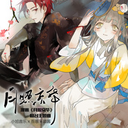

月照京华
============================

|  |  |
| :--: | :-- |
| [ 月照京华](https://emumo.xiami.com/album/2102871858) | **艺人**: [小旭音乐](../index.md) **语种**: 国语 **唱片公司**: 小旭音乐 **发行时间**: 2017年10月13日 **专辑类别**: EP, 单曲 **专辑风格**: 古风 GuFeng Music, 中国风 China-Wave **播放数**: 11465 **收藏数**: 15 **评论数**: 0  |

## 简介

 

 
 

漫画《月照京华》同名主题曲，《长安幻夜》作者面堂兄填词，小旭音乐携手漫漫漫画联合打造。孤独长生的月宫，暗影浮动的京华。千年前的神话，不可能的爱恋。要穿越多少时光，蔑视多少艰难，才能与你携手共醉明月？
 

 
 

## 曲目

## 评论

|  |  |  |  |
| :-- | :-- | :-- | :-- |
