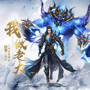

蜀门·我做老大
============================

|  |  |
| :--: | :-- |
| [ 蜀门·我做老大](https://emumo.xiami.com/album/2102963506) | **艺人**: [小旭音乐](../index.md) **语种**: 国语 **唱片公司**: 小旭音乐 **发行时间**: 2017年11月29日 **专辑类别**: EP, 单曲 **专辑风格**: 流行说唱 Pop Rap **播放数**: 2268 **收藏数**: 8 **评论数**: 0  |

## 简介

 

 
 

一生江湖，不二蜀门。八年的时光记录了无数情义故事，热血的青春留下了不朽的激情！蜀门，需要一首充满激情和回忆的歌曲，来纪念我们的青春，于是，《我做老大》就这样诞生了！
 

   在与袁和平、徐克的《奇门遁甲》合作过程中，蜀门在细节上完美呼应了奇门遁甲主题曲《谁是老大》，两大武侠势力在音乐层面达成了默契的对话共识。在创作团队方面，蜀门力邀著名的小旭音乐团队倾情加盟，以古风+Rap的模式，唱响了全新江湖的篇章。自此，天净降世，奇乐无穷！
 

## 曲目

## 评论

|  |  |  |  |
| :-- | :-- | :-- | :-- |
