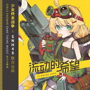

流动的希望
============================

|  |  |
| :--: | :-- |
| [ 流动的希望](https://emumo.xiami.com/album/2103722354) | **艺人**: [小旭音乐](../index.md) **语种**: 国语 **唱片公司**: 小旭音乐 **发行时间**: 2018年05月29日 **专辑类别**: EP, 单曲 **专辑风格**: 国语流行 Mandarin Pop **播放数**: 6928 **收藏数**: 9 **评论数**: 0  |

## 简介

《少女终末战争》手游主题曲《流动的希望》由SNH48监制，中国大型女子偶像团体SNH48-Color Girls倾情演唱，音乐风格高燃激荡、热血澎湃，由青春少女治愈力满满的声线独特呈现，传达出积极向上、坚韧乐观的正能量！

## 曲目

## 评论

|  |  |  |  |
| :-- | :-- | :-- | :-- |
