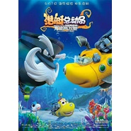

潜艇总动员：海底两万里 动画原声带
============================

|  |  |
| :--: | :-- |
| [ 潜艇总动员：海底两万里 动画原声带](https://emumo.xiami.com/album/2103729272) | **艺人**: [小旭音乐](../index.md) **语种**: 国语 **唱片公司**: 小旭音乐 **发行时间**: 2018年06月04日 **专辑类别**: 原声带, 影视音乐 **专辑风格**: 国语流行 Mandarin Pop, 原声 Soundtrack **播放数**: 26580 **收藏数**: 24 **评论数**: 0  |

## 简介

《逆流之光》是动画电影《潜艇总动员：海底两万里》的主题曲，同时发行的成人版和儿童版主题曲分别由黄汐源、李紫玉演唱。歌曲用舒缓悠扬的旋律和充满感染力的歌词，暖心诠释了影片陪伴与成长的主题。该片讲述了小潜艇阿力和小伙伴们齐心协力克服困难的故事，同时体验了险象环生的冒险旅程，以此表达了他们在此过程中收获的友情与成长。

## 曲目

## 评论

|  |  |  |  |
| :-- | :-- | :-- | :-- |
