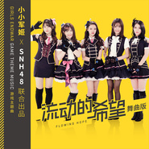

流动的希望 (Remix版)
============================

|  |  |
| :--: | :-- |
| [ 流动的希望 (Remix版)](https://emumo.xiami.com/album/2103928859) | **艺人**: [小旭音乐](../index.md) **语种**: 国语 **唱片公司**: 小旭音乐 **发行时间**: 2018年08月17日 **专辑类别**: EP, 单曲 **专辑风格**: 流行 Pop **播放数**: 469 **收藏数**: 3 **评论数**: 0  |

## 简介

《流动的希望-Remix版》（flowinghope）根据《小小军姬》中文主题曲改编，由中国大型女子偶像团体SNH48-ColorGirls演唱，成员以其青春少女特有的萌愈声线，跟随热力劲燃的动感节奏，为听众贡献了一出舞曲盛宴。

## 曲目

## 评论

