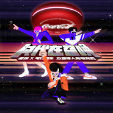

时代在召唤（若琪remix）
============================

|  |  |
| :--: | :-- |
| [ 时代在召唤（若琪remix）](https://emumo.xiami.com/album/2104120965) | **艺人**: [小旭音乐](../index.md) **语种**: 国语 **唱片公司**: 小旭音乐 **发行时间**: 2018年10月18日 **专辑类别**: EP, 单曲 **专辑风格**: 流行 Pop **播放数**: 4614 **收藏数**: 6 **评论数**: 0  |

## 简介

 

若琪携手可口可乐，创新跨界联合，用人工智能演绎新编单曲。动感活力的音乐风格、年轻化文案号令，给消极生活现状注入积极正能量。朝气十足，力求逆转丧文化，为广大青年充能打气。
 

## 曲目

## 评论

|  |  |  |  |
| :-- | :-- | :-- | :-- |
