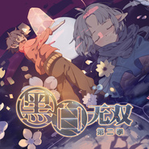
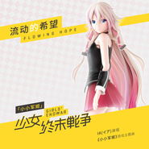
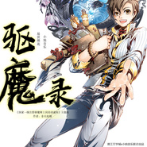
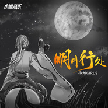
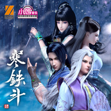

小旭音乐
============================

|  |  |
| :--: | :-- |
| [ 小旭音乐](https://i.xiami.com/xiaoxuband) | **播放数**: 24498510 **粉丝数**: 7480 **评论数**: 87 **地区**: China 中国大陆 **风格**: 游戏配乐 Video Game Music, 中国风 China-Wave  |

## 档案

小旭音乐，中国游戏音乐第一品牌。总部北京，广州、成都、上海均设分部，成员100人，提供音乐、音效、配音、主题歌、宣传视频等服务。2016小旭音乐延伸ToC领域，《小旭游戏演唱会》千人规模剧场版全国巡演中。中国规模最大的集游戏音乐、视频、演出为一体的泛娱乐品牌。

## 专辑

| 名称 | 语种 | 唱片公司 | 发行时间 | 专辑类别 | 专辑风格 |
| :--: | :-- | :-- | :-- | :-- | :-- |
| [ 戏七夕](./albums/2105129722.md) | 国语 | 小旭音乐 | 2019年08月07日 | EP, 单曲 |  |
| [ 父王](./albums/2105058613.md) | 国语 | 小旭音乐 | 2019年08月06日 | EP, 单曲 |  |
| [ 垃圾分类歌](./albums/2105052667.md) | 国语 | 小旭音乐 | 2019年07月25日 | EP, 单曲 |  |
| [ 少年志·踏歌行](./albums/2104816834.md) | 国语 | 小旭音乐 | 2019年04月18日 | EP, 单曲 | 古风 GuFeng Music |
| [ 战场之王](./albums/2104771806.md) | 国语 | 小旭音乐 | 2019年04月12日 | 录音室专辑 | 流行 Pop |
| [ 权御天下](./albums/2104769792.md) | 国语 | 小旭音乐 | 2019年03月11日 | 录音室专辑 | 流行 Pop |
| [ 宠物情人](./albums/2104658681.md) | 国语 | 小旭音乐 | 2019年03月08日 | EP, 单曲 | 流行 Pop |
| [ 木奇灵](./albums/2104610729.md) | 国语 | 小旭音乐 | 2019年02月21日 | EP, 单曲 | 流行 Pop |
| [ 邪王追妻](./albums/2104548468.md) | 国语 | 小旭音乐 | 2019年01月28日 | EP, 单曲 | 流行 Pop |
| [ 《给我来个小和尚》（《给我来个小和尚》漫画同名主题曲）](./albums/2104520724.md) | 国语 | 小旭音乐 | 2019年01月21日 | EP, 单曲 | 流行 Pop |
| [ 《与你隽永》（僵小鱼主题曲）](./albums/2104497673.md) | 国语 | 小旭音乐 | 2019年01月17日 | EP, 单曲 | 流行 Pop |
| [ 青云传](./albums/2104480808.md) | 国语 | 小旭音乐 | 2019年01月14日 | EP, 单曲 | 流行 Pop |
| [ 发光体](./albums/2104366294.md) | 国语 | 小旭音乐 | 2018年12月12日 | EP, 单曲 | 流行 Pop |
| [ 贺淑婧-你快回来（电影《忠犬大营救》推广曲）-](./albums/2104303711.md) | 国语 | 小旭音乐 | 2018年11月21日 | EP, 单曲 | 流行 Pop |
| [ 新七侠五义之屠龙案](./albums/2104240200.md) | 国语 | 小旭音乐 | 2018年11月19日 | EP, 单曲 | 流行 Pop |
| [ MT永不独行](./albums/2104157894.md) | 国语 | 小旭音乐 | 2018年10月29日 | EP, 单曲 | 流行 Pop |
| [ 时代在召唤（若琪remix）](./albums/2104120965.md) | 国语 | 小旭音乐 | 2018年10月18日 | EP, 单曲 | 流行 Pop |
| [ 狐狸之声](./albums/2104109204.md) | 国语 | 小旭音乐 | 2018年10月15日 | EP, 单曲 | 流行 Pop |
| [ 热血战魂](./albums/2104086996.md) | 国语 | 小旭音乐 | 2018年10月09日 | EP, 单曲 | 流行 Pop |
| [ 灵邪记](./albums/2104061105.md) | 国语 | 小旭音乐 | 2018年09月28日 | EP, 单曲 | 流行 Pop |
| [ 黑白无双2动漫原声带](./albums/2103945922.md) | 国语 | 小旭音乐 | 2018年08月24日 | 原声带, 影视音乐 | 国语流行 Mandarin Pop |
| [ flowing hope Remix手游《小小军姬》日文主题曲](./albums/2103940290.md) | 日语 | 小旭音乐 | 2018年08月22日 | EP, 单曲 | 流行 Pop |
| [ 《flowing hope-Remix》  （手游《小小军姬》日文主题曲）]](./albums/2103940201.md) | 日语 | 小旭音乐 | 2018年08月22日 | EP, 单曲 | 流行 Pop |
| [ 流动的希望 (Remix版)](./albums/2103928859.md) | 国语 | 小旭音乐 | 2018年08月17日 | EP, 单曲 | 流行 Pop |
| [ 盛世妆娘](./albums/2103905688.md) | 国语 | 小旭音乐 | 2018年08月10日 | EP, 单曲 | 流行 Pop |
| [ Flowing Hope](./albums/2103902399.md) | 日语 | 小旭音乐 | 2018年08月10日 | EP, 单曲 | 流行 Pop |
| [ 驱魔录](./albums/2103844830.md) | 国语 | 小旭音乐 | 2018年07月28日 | EP, 单曲 | 流行 Pop |
| [ 少年梦·葬花吟](./albums/2103827370.md) | 国语 | 小旭音乐 | 2018年07月20日 | EP, 单曲 | 流行 Pop |
| [ 整容游戏](./albums/2103826562.md) | 国语 | 小旭音乐 | 2018年07月19日 | EP, 单曲 | 流行 Pop |
| [ 任我逍遥](./albums/2103769736.md) | 国语 | 小旭音乐 | 2018年07月02日 | EP, 单曲 | 国语流行 Mandarin Pop, 古风 GuFeng Music |
| [ 奇遇](./albums/2103751230.md) | 国语 | 小旭音乐 | 2018年06月20日 | EP, 单曲 | 流行 Pop |
| [ 创二代之歌](./albums/2103751129.md) | 国语 | 小旭音乐 | 2018年06月19日 | EP, 单曲 | 流行 Pop |
| [ 桃花源记](./albums/2103745450.md) | 国语 | 小旭音乐 | 2018年06月11日 | EP, 单曲 | 古风 GuFeng Music |
| [ 潜艇总动员：海底两万里 动画原声带](./albums/2103729272.md) | 国语 | 小旭音乐 | 2018年06月04日 | 原声带, 影视音乐 | 国语流行 Mandarin Pop, 原声 Soundtrack |
| [ 流动的希望](./albums/2103722354.md) | 国语 | 小旭音乐 | 2018年05月29日 | EP, 单曲 | 国语流行 Mandarin Pop |
| [ 无上天命](./albums/2103723551.md) | 国语 | 小旭音乐 | 2018年05月28日 | EP, 单曲 | 流行 Pop |
| [ 末世觉醒之入侵](./albums/2103717840.md) | 纯音乐 | 小旭音乐 | 2018年05月24日 | EP, 单曲 | 国语流行 Mandarin Pop |
| [ 身不由己](./albums/2103717655.md) | 国语 | 小旭音乐 | 2018年05月21日 | EP, 单曲 | 国语流行 Mandarin Pop |
| [ 少年志·风清扬](./albums/2103710620.md) | 国语 | 小旭音乐 | 2018年05月09日 | EP, 单曲 | 中国风 China-Wave, 电子 Electronic |
| [ 奉陪到底](./albums/2103704788.md) | 国语 | 小旭音乐 | 2018年05月02日 | EP, 单曲 | 国语流行 Mandarin Pop |
| [ 铁甲荣光](./albums/2103688916.md) | 国语 | 小旭音乐 | 2018年04月18日 | EP, 单曲 | 流行摇滚 Pop Rock |
| [ 旱獭之歌](./albums/2103691406.md) | 国语 | 小旭音乐 | 2018年04月17日 | EP, 单曲 | 国语流行 Mandarin Pop |
| [ 热血之城](./albums/2103688909.md) | 国语 | 小旭音乐 | 2018年04月17日 | EP, 单曲 | 国语流行 Mandarin Pop |
| [ 虎皮萌企鹅](./albums/2103609777.md) | 国语 | 小旭音乐 | 2018年03月12日 | EP, 单曲 | 国语流行 Mandarin Pop |
| [ 岁神祭](./albums/2103524389.md) | 国语 | 小旭音乐 | 2018年02月10日 | EP, 单曲 | 古风 GuFeng Music |
| [ 当我远行](./albums/2103523264.md) | 国语 | 小旭音乐 | 2018年02月09日 | EP, 单曲 | 国语流行 Mandarin Pop |
| [ 如丝](./albums/2103519652.md) | 国语 | 小旭音乐 | 2018年02月07日 | EP, 单曲 | 国语流行 Mandarin Pop |
| [ 小小的幸福](./albums/2103515021.md) | 国语 | 小旭音乐 | 2018年02月05日 | EP, 单曲 | 国语流行 Mandarin Pop |
| [ 我叫奶瓶](./albums/2103512852.md) | 国语 | 小旭音乐 | 2018年02月02日 | EP, 单曲 | 国语流行 Mandarin Pop |
| [ 不沉默的羔羊](./albums/2103515011.md) | 国语 | 小旭音乐 | 2018年02月01日 | EP, 单曲 | 国语流行 Mandarin Pop |
| [ 希求](./albums/2103501506.md) | 国语 | 小旭音乐 | 2018年01月26日 | 原声带, 影视音乐 | 国语流行 Mandarin Pop |
| [ 71Y2](./albums/2103505738.md) | 国语 | 小旭音乐 | 2018年01月25日 | EP, 单曲 | 嘻哈 Hip-Hop |
| [ 找朋友](./albums/2103493890.md) | 国语 | 星同映画 | 2018年01月18日 | EP, 单曲 |  |
| [ 十里桃花](./albums/2103493711.md) | 国语 | 小旭音乐 | 2018年01月15日 | EP, 单曲 | 中国风 China-Wave |
| [ 欢喜逗地主](./albums/2103466381.md) | 国语 | 小旭音乐 | 2018年01月02日 | EP, 单曲 | 流行 Pop, 国语流行 Mandarin Pop |
| [ 圣诞叮叮当](./albums/2102978005.md) | 国语 | 小旭音乐 | 2017年12月20日 | EP, 单曲 | 流行说唱 Pop Rap |
| [ 一行](./albums/2102977183.md) | 国语 | 小旭音乐 | 2017年12月19日 | EP, 单曲 | 流行摇滚 Pop Rock |
| [ 此间情长](./albums/2102972587.md) | 国语 | 独立发行 | 2017年12月07日 | EP, 单曲 |  |
| [ 尘星](./albums/2102968531.md) | 国语 | 小旭音乐 | 2017年12月06日 | EP, 单曲 | 日本动漫游戏 Japanese ACG |
| [ 蜀门·我做老大](./albums/2102963506.md) | 国语 | 小旭音乐 | 2017年11月29日 | EP, 单曲 | 流行说唱 Pop Rap |
| [ KO](./albums/2102961718.md) | 国语 | 小旭音乐 | 2017年11月27日 | EP, 单曲 | 流行摇滚 Pop Rock |
| [ 明月行处](./albums/2102960163.md) | 国语 | 小旭音乐 | 2017年11月24日 | EP, 单曲 | 国语流行 Mandarin Pop |
| [ 大吉大利 今晚吃鸡](./albums/2102956018.md) | 国语 | 小旭音乐 | 2017年11月22日 | EP, 单曲 |  |
| [ 双十一快乐](./albums/2102916069.md) | 国语 | 小旭音乐 | 2017年11月09日 | EP, 单曲 | 嘻哈 Hip-Hop |
| [ 自分の「戦場」へ](./albums/2102905232.md) | 日语 | 小旭音乐 | 2017年11月03日 | EP, 单曲 | 流行摇滚 Pop Rock |
| [ 奇妙万圣夜](./albums/2102902739.md) | 国语 | 小旭音乐 | 2017年11月02日 | EP, 单曲 | 流行 Pop, 国语流行 Mandarin Pop |
| [ 月照京华](./albums/2102871858.md) | 国语 | 小旭音乐 | 2017年10月13日 | EP, 单曲 | 古风 GuFeng Music, 中国风 China-Wave |
| [ 神叨姨婆说](./albums/2102861637.md) | 国语 | 小旭音乐 | 2017年09月22日 | EP, 单曲 | 国语流行 Mandarin Pop |
| [ 长生诀](./albums/2102860408.md) | 国语 | 小旭音乐 | 2017年09月20日 | EP, 单曲 | 古风 GuFeng Music |
| [ 醉沙场](./albums/2102859993.md) | 国语 | 小旭音乐 | 2017年09月19日 | EP, 单曲 | 同人音乐 DouJin, 中国风 China-Wave |
| [ 百鬼传说](./albums/2102859211.md) | 国语 | 小旭音乐 | 2017年09月14日 | EP, 单曲 | 流行摇滚 Pop Rock |
| [ 血色苍穹 动漫原声带](./albums/2102853299.md) | 国语 | 小旭音乐 | 2017年09月08日 | EP, 单曲 |  |
| [ 也许再见](./albums/2102851857.md) | 国语 | 小旭音乐 | 2017年09月05日 | EP, 单曲 | 国语流行 Mandarin Pop, 电视原声 Television Music |
| [ 小旭游戏配乐合集（十八）](./albums/2103677886.md) | 国语 | 小旭音乐 | 2017年08月23日 | 录音室专辑 | 中国风 China-Wave |
| [ 开封奇谈-这个包公不太行动画原声音乐集](./albums/2102798626.md) | 纯音乐 | 小旭音乐 | 2017年07月18日 | 原声带, 影视音乐 | 古风 GuFeng Music, 原声 Soundtrack, 卡通配乐 Cartoon Music |
| [ 小旭游戏配乐合集（十五）](./albums/2103677857.md) | 国语 |  | 2017年07月10日 | 录音室专辑 |  |
| [ 小旭游戏配乐合集（十）](./albums/2103677866.md) | 国语 |  | 2017年05月10日 | 录音室专辑 |  |
| [ 墓王之王 动画原声带](./albums/2102745022.md) | 国语 | 小旭音乐 | 2017年05月09日 | 原声带, 影视音乐 | 卡通配乐 Cartoon Music, 电视原声 Television Music, 原声 Soundtrack, 中国风 China-Wave |
| [ 小旭游戏配乐合集（八）](./albums/2103677840.md) | 国语 | 小旭音乐 | 2017年03月06日 | 录音室专辑 | 游戏配乐 Video Game Music |
| [ 结昏](./albums/2102693530.md) | 国语 | 小旭音乐 | 2017年02月14日 | EP, 单曲 | 独立民谣 Indie Folk |
| [ AUV](./albums/2102682953.md) | 国语 | 小旭音乐 | 2017年01月19日 | 录音室专辑 | 流行说唱 Pop Rap |
| [ 次元模拟人声合集](./albums/2102680827.md) | 国语 | 小旭音乐 | 2017年01月13日 | 合集, 杂锦 | 日本动漫游戏 Japanese ACG, 同人音乐 DouJin, 古风 GuFeng Music |
| [ 小旭游戏配乐合集（七）](./albums/2102679243.md) | 国语 | 小旭音乐 | 2017年01月12日 | 合集, 杂锦 | 中国风 China-Wave |
| [ 小旭游戏配乐合集（六）](./albums/2102679114.md) | 国语 | 小旭音乐 | 2017年01月11日 | 合集, 杂锦 | 游戏配乐 Video Game Music |
| [ 小旭游戏配乐合集（五）](./albums/2102676244.md) | 国语 | 小旭音乐 | 2017年01月05日 | 原声带, 影视音乐 | 游戏配乐 Video Game Music |
| [ 小旭音乐合集 (九)](./albums/2103689246.md) | 国语 | 小旭音乐 | 2017年01月01日 | 合集, 杂锦 | 中国风 China-Wave |
| [ 小旭音乐合集 (十)](./albums/2103689525.md) | 国语 | 小旭音乐 | 2017年01月01日 | EP, 单曲 |  |
| [ 小旭音乐合集 (八)](./albums/2103689155.md) | 国语 | 小旭音乐 | 2017年01月01日 | 合集, 杂锦 |  |
| [ 小旭音乐合集 (二)](./albums/2103688367.md) | 国语 | 小旭音乐 | 2017年01月01日 | 合集, 杂锦 |  |
| [ 小旭音乐合集 (六)](./albums/2103688922.md) | 国语 | 小旭音乐 | 2017年01月01日 | 合集, 杂锦 |  |
| [ 小旭音乐合集 (五)](./albums/2103688614.md) | 国语 | 小旭音乐 | 2017年01月01日 | 合集, 杂锦 |  |
| [ 小旭音乐合集 (四)](./albums/2103688399.md) | 国语 | 小旭音乐 | 2017年01月01日 | 合集, 杂锦 |  |
| [ 小旭音乐合集 (七)](./albums/2103689031.md) | 国语 | 小旭音乐 | 2017年01月01日 | 合集, 杂锦 |  |
| [ 小旭音乐合集 (三)](./albums/2103688393.md) | 国语 | 小旭音乐 | 2017年01月01日 | 合集, 杂锦 |  |
| [ 小旭音乐合集 (一)](./albums/2103688307.md) | 国语 | 小旭音乐 | 2017年01月01日 | 合集, 杂锦 |  |
| [ 小旭游戏配乐合集（三）](./albums/2102674272.md) | 国语 | 小旭音乐 | 2016年12月30日 | 合集, 杂锦 | 游戏配乐 Video Game Music |
| [ 小旭游戏配乐合集（二）](./albums/2102673091.md) | 其他 | 小旭音乐 | 2016年12月27日 | 合集, 杂锦 | 游戏配乐 Video Game Music |
| [ 儒道至圣](./albums/2102670281.md) | 国语 | 小旭音乐 | 2016年12月20日 | EP, 单曲 | 古风 GuFeng Music |
| [ 小旭游戏配乐合集（一）](./albums/2102664496.md) | 国语 | 小旭音乐 | 2016年12月14日 | 精选集 | 游戏配乐 Video Game Music |
| [ 次元模拟](./albums/2102705813.md) | 国语 | 小旭音乐 | 2016年12月03日 | 合集, 杂锦 | 日本动漫游戏 Japanese ACG |
| [ 小旭音乐精选集（二）](./albums/2100349175.md) | 国语 | 小旭音乐 | 2016年12月02日 | 精选集 | 中国风 China-Wave |
| [ 小旭音乐精选集（三）](./albums/2102659088.md) | 国语 | 小旭音乐 | 2016年12月02日 | 精选集 | 流行 Pop |
| [ 小旭音乐主题曲伴奏合集（一）](./albums/2102658852.md) | 国语 | 小旭音乐 | 2016年12月02日 | 精选集 |  |
| [ 小旭音乐主题曲伴奏合集（二）](./albums/2102659084.md) | 国语 | 小旭音乐 | 2016年12月02日 | 合集, 杂锦 | 古风 GuFeng Music |
| [ 小旭音乐精选集（一）](./albums/2102658378.md) | 国语 | 小旭音乐 | 2016年12月01日 | 精选集 | 中国风 China-Wave |

## 评论

|  |  |  |  |
| :-- | :-- | :-- | :-- |
|  [虾米用户](https://emumo.xiami.com/u/400127142)  2020-11-20 16:04 赞(0) 踩(0) | 
有没有《胡莱三国》的背景音乐
 |
|  [虾米用户](https://emumo.xiami.com/u/358538496)  2020-07-24 22:17 赞(0) 踩(0) | 
诛仙流波有段很长音乐叫什么名求帮助 
 |
|  [虾米用户](https://emumo.xiami.com/u/283919655) 水一般的男子 2020-05-19 07:51 赞(0) 踩(0) | 
算是国内最流弊的游戏音乐开发团队了吧
 |
|  [虾米用户](https://emumo.xiami.com/u/430137287)  2020-04-04 10:49 赞(0) 踩(0) | 
能不能找个(天龙八部)黄龙府，你这儿只有长白山
 |
|  [虾米用户](https://emumo.xiami.com/u/358104299) 悲观的唯心存在现实解构虚... 2019-12-26 12:11 赞(0) 踩(0) | 
14576
 |
|  [虾米用户](https://emumo.xiami.com/u/285637806)  2019-12-25 19:14 赞(1) 踩(0) | 
你一直是个努力的男孩子！
 |
|  [虾米用户](https://emumo.xiami.com/u/248978410)  2019-12-04 20:18 赞(2) 踩(0) | 
高产似母猪啊就服小旭团队！
 |
|  [虾米用户](https://emumo.xiami.com/u/325205625)  2019-08-30 22:11 赞(1) 踩(0) | 
好
 |
|  [虾米用户](https://emumo.xiami.com/u/411606387)  2019-07-07 09:59 赞(6) 踩(0) | 
诛仙的背景乐，很美好的回忆，
 |
|  [虾米用户](https://emumo.xiami.com/u/53898864)   2019-06-09 21:57 赞(2) 踩(0) | 
小旭音乐老诛仙背景音乐，我以前都到客户端文件夹找到音乐文件，拷贝到内存卡放手机里听 音乐很美很怀念
 |
|  [虾米用户](https://emumo.xiami.com/u/403706026)  2019-05-18 21:37 赞(1) 踩(0) | 
您好，能把完美世界所有的音乐都发一下么
 |
|  [虾米用户](https://emumo.xiami.com/u/45004640)  2019-03-01 23:14 赞(3) 踩(0) | 
07年，诛仙，回不去了
 |
| ⇒ |  [虾米用户](https://emumo.xiami.com/u/411606387)  2019-07-07 09:58 赞(0) 踩(0) | 
网一射日
 |
|  [虾米用户](https://emumo.xiami.com/u/7519372) 九重烟雪微茫外 2019-02-06 22:03 赞(2) 踩(0) | 
我最爱的幻想三国志就是这个小旭音乐的嘛？
 |
|  [虾米用户](https://emumo.xiami.com/u/7519372) 九重烟雪微茫外 2019-02-06 22:02 赞(2) 踩(0) | 
我最爱的幻想三国志就是这个小旭音乐的嘛？
 |
|  [虾米用户](https://emumo.xiami.com/u/375951109) 天翼双飞 2019-01-14 20:14 赞(3) 踩(0) | 
太好听了。
 |
|  [虾米用户](https://emumo.xiami.com/u/369171640)  2018-12-30 09:47 赞(2) 踩(0) | 
加油
 |
|  [虾米用户](https://emumo.xiami.com/u/300874938) 奋斗永不落幕，就算失败也... 2018-12-19 00:15 赞(2) 踩(0) | 
十年问道，准备再次回归，王者归来
 |
|  [虾米用户](https://emumo.xiami.com/u/347894153)  2018-12-10 22:19 赞(1) 踩(0) | 
天龙听的，目前还是可以最喜欢的歌
 |
|  [虾米用户](https://emumo.xiami.com/u/47131202)  2018-09-08 00:41 赞(2) 踩(0) | 
真棒，必须点赞！
 |
|  [虾米用户](https://emumo.xiami.com/u/5120818) 你是智智智全面发展的三好... 2018-08-14 11:43 赞(6) 踩(0) | 
当年诛仙开服就玩的，音乐太惊艳，导致我玩别的游戏总觉得不对味儿 
 |
|  [虾米用户](https://emumo.xiami.com/u/331622354)  2018-07-24 00:01 赞(3) 踩(0) | 
喜欢丫蛋蛋的声音  
 |
|  [虾米用户](https://emumo.xiami.com/u/321172674)   2018-07-05 16:06 赞(1) 踩(0) | 
因为诛仙，忘不了 
 |
|  [虾米用户](https://emumo.xiami.com/u/128219656)  2018-06-09 23:33 赞(1) 踩(0) | 
第一次听的是仙逆主题曲
 |
|  [虾米用户](https://emumo.xiami.com/u/127902218)   2018-03-21 16:00 赞(3) 踩(0) | 
求网游问道音乐啊！！！   
 |
|  [虾米用户](https://emumo.xiami.com/u/298022288)  2018-01-25 16:36 赞(5) 踩(0) | 
听说&amp;hellip;奥拉星的bgm是这个团队做的？但我为什么找不到呢 
 |
|  [虾米用户](https://emumo.xiami.com/u/57978180)  2018-01-24 07:52 赞(22) 踩(0) | 
这应该是国内数一数二的音乐制作团队了   我记得当年2010年的时候吧  一个网页游戏叫盘龙神墓记的背景音乐真是令人惊艳  就是小旭工作室的  反正国内听的舒服的游戏背景音乐都是小晓工作室的
 |
| ⇒ |  [虾米用户](https://emumo.xiami.com/u/271017410) 我一直都想做一个冷酷的人 2019-12-13 15:01 赞(0) 踩(0) | 
第一的
 |
|  [虾米用户](https://emumo.xiami.com/u/39842035)  2017-12-31 12:34 赞(3) 踩(0) | 
牛逼团队。喜欢北京欢迎你
 |
|  [虾米用户](https://emumo.xiami.com/u/82650640) 没有人能替代我对你的爱～... 2017-12-13 02:51 赞(4) 踩(0) | 
超级喜欢！！！！
 |
|  [虾米用户](https://emumo.xiami.com/u/334958992) 有情不必终老 暗香浮动正... 2017-12-02 00:48 赞(3) 踩(0) | 
最爱斗地主的音乐作为闹钟铃声
 |
|  [虾米用户](https://emumo.xiami.com/u/323417022)  2017-11-05 06:02 赞(3) 踩(0) | 
沉迷小旭音乐，就很合口味
 |
|  [虾米用户](https://emumo.xiami.com/u/17820737)  2017-08-18 19:20 赞(2) 踩(0) | 
可以把音乐放游戏里吗？
 |
|  [虾米用户](https://emumo.xiami.com/u/312000016)  2017-08-08 23:02 赞(2) 踩(0) | 
                       
 |
|  [虾米用户](https://emumo.xiami.com/u/312000016)  2017-08-08 23:02 赞(2) 踩(0) | 
去死吧这个歌好听还有神话     
 |
|  [虾米用户](https://emumo.xiami.com/u/283666060)  2017-07-15 21:21 赞(3) 踩(0) | 
歌词还是音调都是我喜欢的类型
 |
|  [虾米用户](https://emumo.xiami.com/u/306328136)  2017-06-23 08:28 赞(4) 踩(0) | 
我爱穿越火线
 |
|  [虾米用户](https://emumo.xiami.com/u/105369616) 凛冬将至 2017-05-19 01:25 赞(13) 踩(0) | 
一直很想知道笑傲江湖OL的开场音乐是不是小旭搞的，网上都没有，还是以前在游戏客户端里拉出来存手机里的，是我继老版诛仙后听到最好的游戏音乐
 |
| ⇒ |  [虾米用户](https://emumo.xiami.com/u/343549777)  2020-01-09 16:42 赞(0) 踩(0) | 
有的，以前小旭有过整理合集
 |
|  [虾米用户](https://emumo.xiami.com/u/52331648)  2017-05-07 12:20 赞(3) 踩(0) | 
喜欢没道理
 |
|  [虾米用户](https://emumo.xiami.com/u/6974946)  2017-04-13 13:01 赞(1) 踩(0) | 
有几首是卢小旭写的？
 |
|  [虾米用户](https://emumo.xiami.com/u/262613) 忘 2017-04-03 00:44 赞(3) 踩(0) | 
超喜欢！！！
 |
|  [虾米用户](https://emumo.xiami.com/u/35326789) ⁢ 2017-03-27 20:25 赞(2) 踩(0) | 
天！之前听的热血三国梦居然也是他的！给大神膜拜
 |
|  [虾米用户](https://emumo.xiami.com/u/35326789) ⁢ 2017-03-27 20:23 赞(1) 踩(0) | 
为什么没有卞夫人。超好听的啊
 |
|  [虾米用户](https://emumo.xiami.com/u/85345270) 不笑，不哭。 2017-03-24 13:04 赞(2) 踩(0) | 
喜欢临安初雨！
 |
|  [虾米用户](https://emumo.xiami.com/u/282580542)  2017-03-23 00:40 赞(2) 踩(0) | 
不错哦
 |
|  [虾米用户](https://emumo.xiami.com/u/178468218)  2017-01-08 19:59 赞(3) 踩(0) | 
穿越火线爽又好玩           
 |
|  [虾米用户](https://emumo.xiami.com/u/44960071)   2016-12-12 00:34 赞(1) 踩(0) | 
我喜欢幻想三国志系列和绝代双骄系列各种主题曲～
 |
|  [虾米用户](https://emumo.xiami.com/u/54495663) 最爱浅仓大介没有之一。 2016-12-11 21:32 赞(10) 踩(0) | 
诛仙来的。最原始的河阳城的音乐，满满的回忆。现在还经常在手游的河阳城站岗，听音乐。河阳，青云的音乐简直是最爱。凌霄城的也是，还有的地图我想不起来了 
 |
| ⇒ |  [虾米用户](https://emumo.xiami.com/u/411606387)  2019-07-07 10:00 赞(0) 踩(0) | 
同感。。。
 |
| ⇒ |  [虾米用户](https://emumo.xiami.com/u/248978410)  2019-12-04 20:20 赞(0) 踩(0) | 
小旭音乐为诛仙打造的游戏背景音乐真的是经典！
 |
|  [虾米用户](https://emumo.xiami.com/u/163772552) 相逢何必曾相识 2016-11-29 12:57 赞(1) 踩(0) | 
啊哈
 |
|  [虾米用户](https://emumo.xiami.com/u/229578585)  2016-09-24 18:25 赞(1) 踩(0) | 
为何没有《真封神》游戏交响乐主题曲——《人间魔狱》
 |
|  [虾米用户](https://emumo.xiami.com/u/1499382)   2016-09-23 22:38 赞(1) 踩(0) | 
笑傲江湖路
 |
|  [虾米用户](https://emumo.xiami.com/u/97747450) 我还没想好要写什么... 2016-09-08 23:43 赞(1) 踩(0) | 
3392
 |
|  [虾米用户](https://emumo.xiami.com/u/6562951) 佛系发歌 2016-04-06 16:13 赞(2) 踩(0) | 
小旭音乐啊，我最最向往的！
 |
|  [虾米用户](https://emumo.xiami.com/u/49640493) 网易云SAINTDONT... 2016-04-05 22:48 赞(1) 踩(0) | 
好想把你藏起来
 |
|  [虾米用户](https://emumo.xiami.com/u/25794889) 停用！↓↓↓遗言 2015-11-10 00:53 赞(3) 踩(0) | 
诛仙
 |
|  [虾米用户](https://emumo.xiami.com/u/3138428)   2015-10-20 19:25 赞(3) 踩(0) | 
小旭的音乐太好听了
 |
| ⇒ |  [虾米用户](https://emumo.xiami.com/u/274525837)  2017-03-19 00:46 赞(0) 踩(0) | 
请快点儿把刘德华的戏曲给我册了吧好嘛啊求求您了
 |
|  [虾米用户](https://emumo.xiami.com/u/48121237) 弃坑虾米了，转战网易。 2015-07-31 22:45 赞(2) 踩(0) | 
口袋西游最爱咯
 |
|  [虾米用户](https://emumo.xiami.com/u/48121237) 弃坑虾米了，转战网易。 2015-07-31 22:45 赞(3) 踩(0) | 
口袋西游最爱咯
 |
|  [虾米用户](https://emumo.xiami.com/u/325426)  2015-04-09 22:38 赞(2) 踩(0) | 
没有风卷残云？
 |
|  [虾米用户](https://emumo.xiami.com/u/37815383)  2015-04-06 12:17 赞(2) 踩(0) | 
仙侠
 |
|  [虾米用户](https://emumo.xiami.com/u/32818006) 月下紫林枫叶满 2014-10-14 16:23 赞(6) 踩(0) | 
游戏原声最喜欢的团队了
 |
|  [虾米用户](https://emumo.xiami.com/u/10641444) 10分鐘後 2014-09-03 10:53 赞(2) 踩(0) | 
为嘛没有龙ol的OST呢   还要让我去游戏提取么
 |
|  [虾米用户](https://emumo.xiami.com/u/13272350)  2014-08-21 10:58 赞(3) 踩(0) | 
好听的古风
 |
|  [虾米用户](https://emumo.xiami.com/u/39933816)  2014-08-12 22:55 赞(3) 踩(0) | 
都是精英啊～ 真厉害，好好听。拿来配音，或者翻唱都很好。
 |
|  [虾米用户](https://emumo.xiami.com/u/10562543) DJNZ HEART,E... 2014-06-27 11:53 赞(1) 踩(0) | 
口袋西游和诛仙･ﾟ(ﾉд`ﾟ)
 |
|  [虾米用户](https://emumo.xiami.com/u/13347787)  2014-06-12 20:11 赞(1) 踩(0) | 
喜欢碧海潮生曲！！
 |
|  [虾米用户](https://emumo.xiami.com/u/12284905)  2014-06-09 15:46 赞(1) 踩(0) | 
《武神》的主题曲木有啊
 |
|  [虾米用户](https://emumo.xiami.com/u/475475)  2014-06-06 09:26 赞(1) 踩(0) | 
被坑里了。
 |
|  [虾米用户](https://emumo.xiami.com/u/15078501)  2014-04-29 12:53 赞(1) 踩(0) | 
求《亂武天下》里完整版的《百面埋伏》
 |
|  [虾米用户](https://emumo.xiami.com/u/13167345) 兵长1米6~ 2014-04-28 21:29 赞(1) 踩(0) | 
那时候神雕侠侣才出来的时候就喜欢那个西狂的MV
 |
|  [虾米用户](https://emumo.xiami.com/u/6646527) 退坑亦不忘帕秋馆长 2014-03-29 18:23 赞(1) 踩(0) | 
喜欢古风的朋友不应错过，我是入坑晚了
 |
|  [虾米用户](https://emumo.xiami.com/u/6760432) 这家伙有点懒，什么也没写 2014-03-26 15:42 赞(1) 踩(0) | 
古剑的歌怎么都不在这
 |
|  [虾米用户](https://emumo.xiami.com/u/1633282) 十年 2014-03-25 20:31 赞(1) 踩(0) | 
特别喜欢古二配乐苍梧谣
 |
|  [虾米用户](https://emumo.xiami.com/u/33214435)  2014-03-07 23:59 赞(1) 踩(0) | 
古剑的曲子做得不错
 |
|  [虾米用户](https://emumo.xiami.com/u/2253831) 我还没想好要写什么... 2014-01-24 00:56 赞(1) 踩(0) | 
求王笑文微博推特照片等等
 |
|  [虾米用户](https://emumo.xiami.com/u/3992862)  2014-01-21 08:22 赞(1) 踩(0) | 
应该算是国内最好的游戏音乐配乐之一！
 |
|  [虾米用户](https://emumo.xiami.com/u/29369766)  2013-12-10 13:41 赞(2) 踩(0) | 
古风
 |
|  [虾米用户](https://emumo.xiami.com/u/8089839)  2013-11-25 22:05 赞(2) 踩(0) | 
《梦幻修仙》的曲子都很好听
 |
|  [虾米用户](https://emumo.xiami.com/u/8089839)  2013-11-25 22:02 赞(2) 踩(0) | 
我喜欢你们做的《梦幻修仙》的曲子爱死了
 |
|  [虾米用户](https://emumo.xiami.com/u/4319855) when the sto... 2013-10-21 09:40 赞(1) 踩(0) | 
秒古风圈130条街
 |
|  [虾米用户](https://emumo.xiami.com/u/6647668) 愿Sion永恒 2013-09-07 17:35 赞(1) 踩(0) | 
喜欢
 |
|  [虾米用户](https://emumo.xiami.com/u/6562951) 佛系发歌 2013-08-15 18:28 赞(1) 踩(0) | 
旭神们的作品不解释，高质量
 |
|  [虾米用户](https://emumo.xiami.com/u/29) 耍中偶得 2013-08-09 16:04 赞(1) 踩(0) | 
嗨  欢迎来虾米
 |
