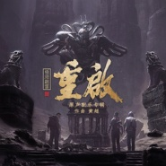

黄超
============================

|  |  |
| :--: | :-- |
| [ 黄超](https://i.xiami.com/huangchao) | **地区**: China 中国大陆 **风格**: 电影原声 Film Score, 另类摇滚 Alternative Rock **播放数**: 570773 **粉丝数**: 153 **评论数**: 13  |

## 档案

代表作品：《我不是药神》《只要平凡》《我爸比我小四岁》《安魂曲》《电商时代》《完美超越》《石头》《金兰桂琴》《battle》

## 专辑

| 名称 | 语种 | 唱片公司 | 发行时间 | 专辑类别 | 专辑风格 |
| :--: | :-- | :-- | :-- | :-- | :-- |
| [ 重启之极海听雷 原声配乐专辑](./albums/5021145658.md) | 纯音乐 | 奔跑怪物 | 2020年07月23日 | 原声带, 影视音乐 |  |
| [ 只要平凡中国“疫”线疾控人系列专题纪录片主题片尾曲](./albums/2108368153.md) | 国语 | 奔跑怪物 | 2020年04月28日 | EP, 单曲 | 国语流行 Mandarin Pop |
| [ 被光抓走的人 电影原声带Gone With The Light Original Sound Track](./albums/2105584707.md) | 纯音乐 | 奔跑怪物 | 2019年12月13日 | 录音室专辑 | 电影原声 Film Score |
| [ 燃](./albums/2103937429.md) | 国语 | 独立发行 | 2018年08月20日 | EP, 单曲 | 另类摇滚 Alternative Rock |
| [ 药神之歌](./albums/2103741155.md) | 国语 | 独立发行 | 2018年06月08日 | EP, 单曲 |  |
| [ 有一天之疯狂的面包](./albums/2103726828.md) | 国语 | 独立发行 | 2014年09月10日 | 原声带, 影视音乐 | 原声 Soundtrack |
| [ 安魂曲](./albums/2103726827.md) | 国语 | 独立发行 | 2014年06月22日 | 原声带, 影视音乐 | 原声 Soundtrack |
| [ 金兰桂琴 电影原声音乐](./albums/2103726825.md) | 国语 | 独立发行 | 2011年05月19日 | 原声带, 影视音乐 | 原声 Soundtrack |
| [ BATTEL 电影原声音乐](./albums/2103726821.md) | 国语 | 独立发行 | 2010年06月24日 | 原声带, 影视音乐 | 原声 Soundtrack |

## 评论

|  |  |  |
| :-- | :-- | :-- |
|  [虾米用户](https://emumo.xiami.com/u/2796166) 最爱莫文蔚..... 2020-06-21 00:05 赞(1) 踩(0) | 
加油~~~~yeah~~~
 |
|  [虾米用户](https://emumo.xiami.com/u/428889020) 乐呵滴... 2019-12-19 19:52 赞(1) 踩(0) | 
电影《我和我的祖国》里《护航》那段的背景音乐是什么？找了好久，非常喜欢 ，在哪能下载？
 |
|  [虾米用户](https://emumo.xiami.com/u/428889020) 乐呵滴... 2019-12-19 19:51 赞(1) 踩(0) | 
电影《我和我的祖国》里《护航》那段的背景音乐是什么？
 |
|  [虾米用户](https://emumo.xiami.com/u/3341146) 爱我请留言。 2018-11-23 21:01 赞(2) 踩(0) | 
《只要平凡》旋律很好听。张碧晨的忧伤感，很好。
 |
|  [虾米用户](https://emumo.xiami.com/u/402279639)   2018-09-23 09:37 赞(2) 踩(0) | 
期待你的新作，加油
 |
|  [虾米用户](https://emumo.xiami.com/u/338644927) 我还没想好要写什么... 2018-09-17 22:14 赞(0) 踩(0) | 
不谢，你们做的音乐的确可以！我在等你们的付费专辑
 |
|  [虾米用户](https://emumo.xiami.com/u/54280165) 如果我们不曾相识 不存在... 2018-07-14 19:35 赞(3) 踩(0) | 
抄袭之王，垃圾、
 |
|  [虾米用户](https://emumo.xiami.com/u/6236391) 我的性别是野性 2018-07-11 19:01 赞(2) 踩(0) | 
求《我不是药神》OST
 |
|  [虾米用户](https://emumo.xiami.com/u/904660)  2018-07-07 09:47 赞(1) 踩(0) | 
想问听过韩国的《一个传闻》没有
 |
|  [虾米用户](https://emumo.xiami.com/u/340085378)  2017-12-15 20:54 赞(0) 踩(0) | 
我想知道古朗月行，你是用的什么音乐，名字
 |
|  [虾米用户](https://emumo.xiami.com/u/231975807) 千纸鹤 2017-01-01 12:46 赞(0) 踩(0) | 
加油
 |
|  [虾米用户](https://emumo.xiami.com/u/49465436)  2015-04-23 06:51 赞(0) 踩(0) | 
超，不错，一听就是你的风格，清新柔美！你的心是蓝色的
 |
|  [虾米用户](https://emumo.xiami.com/u/7562991)  2013-05-22 16:28 赞(1) 踩(0) | 
感谢收藏，祝你好心情~~
 |
