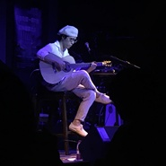

GIN
============================

|  |  |
| :--: | :-- |
| [ GIN](https://i.xiami.com/ginnakasion) | **地区**: Japan 日本 **风格**: 器乐独奏 Solo Instrumental, 轻音乐 Easy Listening **播放数**: 5889322 **粉丝数**: 6819 **评论数**: 231  |

## 档案

艺    名 GIN 
出生日期 1983年2月 
籍    贯 大阪府池田市 
毕业学院 甲阳音楽学院 
代 表 作 《願い桜》、《七夕》、《North Line》 
艺人简介 
GIN在日本新一代演奏家里演奏手法最为独特，滑弦、揉弦等技巧运用得出神入化。悲哀、寂寞的旋律和曲风使很多人喜欢上他的音乐。 亚洲指弹教父中川砂仁对他的评价非常高，也认为GIN是自己的接班人。 
演艺经历 
2005年8月，GIN与女歌手シオン组建组合nakashion。 
2006年4月15日，GIN参加日本指弹大赛并获得第二名的优秀成绩。 
2007年11月，发售nakashion第一张专辑。 
2009年6月，参加由中川砂仁组织的合辑《daybreak2》收到广泛好评，并进行巡回演出活动 。 
2011年10月，发行了组合nakashion的第二张专辑 其中はらり·ひらり一曲里，邀请中川砂仁协助伴奏。 
2011年12月，发售第一张专辑《mahalo》。 
2012年随中川砂仁来中国进行巡演，一鸣惊人。 
2014年，发售第二张专辑《Pastoral》。 
2017年6月，发售第三张专辑《A Song For You》。

## 专辑

| 名称 | 语种 | 唱片公司 | 发行时间 | 专辑类别 | 专辑风格 |
| :--: | :-- | :-- | :-- | :-- | :-- |
| [ PASTORAL牧歌](./albums/1601262778.md) | 其他 | Ripple Records | 2014年05月15日 | 录音室专辑 | 新世纪音乐 New Age, 器乐独奏 Solo Instrumental, 轻音乐 Easy Listening |
| [ MaHaLo](./albums/541793.md) | 其他 | Ripple Records | 2011年12月01日 | 录音室专辑 | 轻音乐 Easy Listening, 器乐独奏 Solo Instrumental |
| [ はらり・ひらり](./albums/986137266.md) | 日语 | Ripple Records | 2011年10月01日 | 录音室专辑 | 民谣 Folk |
| [ Nakasion](./albums/2104364444.md) | 日语 | Ripple Records | 2006年11月11日 | 录音室专辑 | 民谣 Folk |

## 评论

|  |  |  |
| :-- | :-- | :-- |
|  [虾米用户](https://emumo.xiami.com/u/96930300)  2021-01-05 14:35 赞(4) 踩(0) | 
虾米要关闭了，gin桑的歌只有刻进心里了
 |
|  [虾米用户](https://emumo.xiami.com/u/6640452) vx: nirvanai... 2020-11-28 23:15 赞(0) 踩(0) | 

 |
|  [虾米用户](https://emumo.xiami.com/u/445989676) 如果音乐足够动人 2020-11-27 15:00 赞(0) 踩(0) | 
可以的
 |
|  [虾米用户](https://emumo.xiami.com/u/1062244)   2020-05-04 10:38 赞(1) 踩(0) | 
看到上面写8月15来深圳，是2020年的吗
 |
|  [虾米用户](https://emumo.xiami.com/u/440920934)   2020-04-17 14:17 赞(0) 踩(0) | 
GIN+GORM
 |
|  [虾米用户](https://emumo.xiami.com/u/343958443)  2019-12-21 11:10 赞(0) 踩(0) | 
5g松井你们都是牛人啊
 |
|  [虾米用户](https://emumo.xiami.com/u/203939497)  2019-11-22 22:58 赞(0) 踩(0) | 
照片 为啥 是桶头a：|
 |
|  [虾米用户](https://emumo.xiami.com/u/45686435) 一壺飛鳧 尋山夢鶴   ... 2019-08-30 08:55 赞(0) 踩(0) | 
今年看了现场
 |
|  [虾米用户](https://emumo.xiami.com/u/276944698) 不要自我设限..... 2019-07-22 13:14 赞(1) 踩(0) | 

 |
|  [虾米用户](https://emumo.xiami.com/u/7872701) 多一份远见，就少一分刺激 2019-07-17 22:37 赞(0) 踩(0) | 
这次没成都了。。。
 |
|  [虾米用户](https://emumo.xiami.com/u/17527) 爱被我们打了死结 2019-07-15 15:53 赞(0) 踩(0) | 
曲风太温柔了~大爱
 |
|  [虾米用户](https://emumo.xiami.com/u/42855010) 暂无签名~ 2019-07-14 23:41 赞(1) 踩(0) | 
哇 我想去看北京那场
 |
|  [虾米用户](https://emumo.xiami.com/u/17527) 爱被我们打了死结 2019-07-14 18:16 赞(0) 踩(0) | 
期待八月广州相见
 |
|  [虾米用户](https://emumo.xiami.com/u/8337431) 以乐会友 2019-06-19 00:18 赞(0) 踩(0) | 
218
 |
|  [虾米用户](https://emumo.xiami.com/u/272645512) Part2, eadgb... 2019-04-29 15:24 赞(0) 踩(0) | 
：）
 |
|  [虾米用户](https://emumo.xiami.com/u/346165752)  2019-04-29 08:31 赞(0) 踩(0) | 

 |
|  [虾米用户](https://emumo.xiami.com/u/102622350)  2019-04-26 13:58 赞(0) 踩(0) | 
好听！
 |
|  [虾米用户](https://emumo.xiami.com/u/325763180) 我还没想好要写什么... 2019-03-20 00:17 赞(0) 踩(0) | 

 |
|  [虾米用户](https://emumo.xiami.com/u/186178048) 超爱Latin/电音/雷... 2019-03-18 19:06 赞(0) 踩(0) | 
弹吉他的样子好帅
 |
|  [虾米用户](https://emumo.xiami.com/u/22444238) 邱比官方虾米 2019-02-13 21:57 赞(1) 踩(0) | 
Get
 |
|  [虾米用户](https://emumo.xiami.com/u/22444238) 邱比官方虾米 2019-02-13 21:57 赞(1) 踩(0) | 
Get
 |
|  [虾米用户](https://emumo.xiami.com/u/22444238) 邱比官方虾米 2019-02-13 21:56 赞(2) 踩(0) | 
Get
 |
|  [虾米用户](https://emumo.xiami.com/u/191482885)  2019-01-25 08:51 赞(0) 踩(0) | 
好
 |
|  [虾米用户](https://emumo.xiami.com/u/228843687) 懒惰统治人间 2019-01-06 14:30 赞(0) 踩(0) | 

 |
|  [虾米用户](https://emumo.xiami.com/u/4131849) 网易云：非人類兔子Agy... 2018-12-04 13:59 赞(0) 踩(0) | 
他的柔弦尾音让我想起桶叔
 |
|  [虾米用户](https://emumo.xiami.com/u/98848396)  2018-11-02 17:23 赞(0) 踩(0) | 
金恩？琴酒？
 |
|  [虾米用户](https://emumo.xiami.com/u/324879742)   2018-10-27 11:28 赞(1) 踩(0) | 
.
 |
|  [虾米用户](https://emumo.xiami.com/u/391568)   2018-07-27 23:52 赞(2) 踩(0) | 
前女友梗，绿色灯光神马的&amp;hellip;&amp;hellip;丝毫阻挡不了小哥的魅力
 |
|  [虾米用户](https://emumo.xiami.com/u/2472729) 嘘 2018-07-27 21:52 赞(0) 踩(0) | 
真棒啊小哥哥 关于前女友的都好棒 
 |
|  [虾米用户](https://emumo.xiami.com/u/33071402) I do not car... 2018-07-24 19:16 赞(14) 踩(0) | 
现场听感太细腻了 几度有泪奔的感觉 原本只想买张CD送朋友 看完决定也买张送自己
 |
|  [虾米用户](https://emumo.xiami.com/u/12501921) 众生轮回 因果循环 2018-06-18 19:59 赞(0) 踩(0) | 
好听
 |
|  [虾米用户](https://emumo.xiami.com/u/34522244)  2018-06-07 06:22 赞(0) 踩(0) | 
大清早的听到还想继续睡
 |
|  [虾米用户](https://emumo.xiami.com/u/651086) 一些…还有一些 2018-05-30 08:39 赞(0) 踩(0) | 
要来上海啦
 |
|  [虾米用户](https://emumo.xiami.com/u/7872701) 多一份远见，就少一分刺激 2018-05-26 15:54 赞(0) 踩(0) | 
没成都。。。还好上次看了
 |
| ⇒ |  [虾米用户](https://emumo.xiami.com/u/49778097) SINA：嗎啡緩釋片 2018-09-26 02:27 赞(0) 踩(0) | 
有了！秀动
 |
|  [虾米用户](https://emumo.xiami.com/u/391568)   2018-05-25 23:35 赞(0) 踩(0) | 
不见不散
 |
|  [虾米用户](https://emumo.xiami.com/u/276944698) 不要自我设限..... 2018-05-25 23:26 赞(1) 踩(0) | 
～～～～～～～～～～～
 |
|  [虾米用户](https://emumo.xiami.com/u/9486114) 倾东海以为酒 2018-04-26 20:25 赞(1) 踩(0) | 
要来巡演啦
 |
|  [虾米用户](https://emumo.xiami.com/u/6097785)  2017-10-30 10:20 赞(0) 踩(0) | 
上次来中国巡演真是近距离接触了，现场版的願桜果然更是大赞。。
 |
|  [虾米用户](https://emumo.xiami.com/u/20571854) 这家伙很聪明什么也没留下... 2017-09-19 02:09 赞(0) 踩(0) | 
啊！是国内的么，很难得的清浅流年似水
 |
| ⇒ |  [虾米用户](https://emumo.xiami.com/u/126887208) radwimps/戳爷/... 2018-04-30 18:02 赞(0) 踩(0) | 
不是，这是一位日本的木吉他演奏家
 |
|  [虾米用户](https://emumo.xiami.com/u/4219122) Mortal Soul. 2017-08-27 13:38 赞(1) 踩(0) | 
愿樱好听到爆炸啊2333
 |
|  [虾米用户](https://emumo.xiami.com/u/52555139) 来日某天再相见 2017-08-20 14:32 赞(0) 踩(0) | 
重庆站留名 gin允许我录像哈哈 理直气壮地把手举酸了
 |
|  [虾米用户](https://emumo.xiami.com/u/2282739)  2017-08-14 18:21 赞(0) 踩(0) | 
越听越上瘾的指弹
 |
|  [虾米用户](https://emumo.xiami.com/u/16266581)  2017-07-24 22:16 赞(1) 踩(0) | 
希望有生能听到现场的紫阳花，那样一定会泪流满面
 |
| ⇒ |  [虾米用户](https://emumo.xiami.com/u/17856053)  2017-08-19 10:44 赞(0) 踩(0) | 
我也是 昨晚沒有聽到
 |
|  [虾米用户](https://emumo.xiami.com/u/7163198) 搬家到网易云音乐了：ht... 2017-07-23 18:59 赞(0) 踩(0) | 
好年轻，中川砂仁老爷居然评价这么高，先粉了再说
 |
|  [虾米用户](https://emumo.xiami.com/u/7872701) 多一份远见，就少一分刺激 2017-07-14 09:02 赞(0) 踩(0) | 
下个月见！
 |
|  [虾米用户](https://emumo.xiami.com/u/11830439)  2017-07-13 19:57 赞(0) 踩(0) | 
又要见面啦
 |
|  [虾米用户](https://emumo.xiami.com/u/47570704) 暂无签名~ 2017-06-25 22:44 赞(0) 踩(0) | 
本人とてもやさし
 |
| ⇒ |  [虾米用户](https://emumo.xiami.com/u/223589)  2017-12-13 14:25 赞(0) 踩(0) | 
少個い
 |
|  [虾米用户](https://emumo.xiami.com/u/50344976) a place for ... 2017-06-13 15:56 赞(18) 踩(0) | 
艺人照片除了第一张都是我拍的哈哈哈哈哈（。那阶段喜欢斜拍 真是对不住
 |
| ⇒ |  [虾米用户](https://emumo.xiami.com/u/7163198) 搬家到网易云音乐了：ht... 2017-07-23 19:03 赞(0) 踩(0) | 
再传几张吧亲！
 |
|  [虾米用户](https://emumo.xiami.com/u/233094332)   2017-06-11 21:08 赞(0) 踩(0) | 
新专什么时候上线 
 |
|  [虾米用户](https://emumo.xiami.com/u/1260174) keep healthy 2017-06-02 17:16 赞(0) 踩(0) | 
之前在大爷的巡演视频里见到这小哥今晚终于要围观真人啦好激动
 |
|  [虾米用户](https://emumo.xiami.com/u/224870273) 下雨的时候 2017-05-31 10:23 赞(0) 踩(0) | 
安静
 |
|  [虾米用户](https://emumo.xiami.com/u/48904070) I love CHINA 2017-04-25 20:46 赞(1) 踩(0) | 
www.showstart.com/event/25537 06月02日 【MAO Live呈现】指弹不止弹VOL.1：GIN&amp;amp;amp;曹思义&amp;ldquo;Walking in the music&amp;rdquo;在音乐中徜徉音乐会 杭州 MAO Livehouse
 |
|  [虾米用户](https://emumo.xiami.com/u/48904070) I love CHINA 2017-04-25 20:45 赞(0) 踩(0) | 
<a href="http://www.showstart.com/event/25537" target="_blank" rel="nofollow noreferrer noopener">http://www.showstart.com/event/25537</a> 06月02日 【MAO Live呈现】指弹不止弹VOL.1：GIN&amp;amp;amp;曹思义&amp;ldquo;Walking in the music&amp;rdquo;在音乐中徜徉音乐会 杭州 MAO Livehouse
 |
|  [虾米用户](https://emumo.xiami.com/u/4400366) 再也不见 2017-01-05 20:28 赞(0) 踩(0) | 
囍
 |
|  [虾米用户](https://emumo.xiami.com/u/11830439)  2016-10-06 10:28 赞(1) 踩(0) | 
刚听了他的指弹演奏会
 |
|  [虾米用户](https://emumo.xiami.com/u/9327494) http://www.x... 2016-10-03 09:08 赞(0) 踩(0) | 
LOVE
 |
|  [虾米用户](https://emumo.xiami.com/u/1271812) WX:Likejazzm... 2016-09-30 19:55 赞(0) 踩(0) | 
既然GIN已经加入了虾米，我想他也并不介意把自己未发布的音频补上吧 哈哈
 |
|  [虾米用户](https://emumo.xiami.com/u/15477519) 爱  是生命的和弦，而不... 2016-09-30 08:13 赞(2) 踩(0) | 
喜欢的曲风，喜欢的音乐…
 |
|  [虾米用户](https://emumo.xiami.com/u/229683482) 日本指弹艺术家 GIN ... 2016-09-27 21:39 赞(134) 踩(0) | 
我刚入驻了虾米音乐人，欢迎大家来我的个人主页，收听我的最新音乐
 |
| ⇒ |  [虾米用户](https://emumo.xiami.com/u/33075711)   2016-09-28 20:27 赞(0) 踩(0) | 
Welcome~
 |
| ⇒ |  [虾米用户](https://emumo.xiami.com/u/1271812) WX:Likejazzm... 2016-09-30 19:55 赞(0) 踩(0) | 
Welcome~
 |
| ⇒ |  [虾米用户](https://emumo.xiami.com/u/49508155)  2017-09-27 21:07 赞(0) 踩(0) | 
Thanks for your coming,GIN  
 |
| ⇒ |  [虾米用户](https://emumo.xiami.com/u/318718845)  2017-12-08 22:00 赞(0) 踩(0) | 
你好，你的音乐让我感觉世界还有一点美好
 |
| ⇒ |  [虾米用户](https://emumo.xiami.com/u/391568)   2018-04-09 21:39 赞(0) 踩(0) | 
来北京吧
 |
| ⇒ |  [虾米用户](https://emumo.xiami.com/u/93368794)  2018-04-16 00:32 赞(0) 踩(0) | 
再来一次成都吧 
 |
| ⇒ |  [虾米用户](https://emumo.xiami.com/u/356080307) 音符啊～你是風你是雲，你... 2019-02-18 06:32 赞(0) 踩(0) | 
已关注
 |
| ⇒ |  [虾米用户](https://emumo.xiami.com/u/27774607)   2019-06-20 17:54 赞(0) 踩(0) | 
有味道
 |
|  [虾米用户](https://emumo.xiami.com/u/2673328)  2016-08-11 01:29 赞(0) 踩(0) | 
终于在微博搜到了真面目！很斯文温柔的样子*^O^*
 |
|  [虾米用户](https://emumo.xiami.com/u/2673328)  2016-08-11 01:23 赞(0) 踩(0) | 
艺人照片怎么了......男神到底长什么样子啊
 |
|  [虾米用户](https://emumo.xiami.com/u/52784482)  2016-07-16 16:41 赞(0) 踩(0) | 
艺人照片什么鬼！
 |
|  [虾米用户](https://emumo.xiami.com/u/44015836)  2016-07-13 16:32 赞(0) 踩(0) | 
评论区抓出一堆大神
 |
|  [虾米用户](https://emumo.xiami.com/u/3868762)  2016-05-06 21:27 赞(1) 踩(0) | 
这歌像你。
 |
|  [虾米用户](https://emumo.xiami.com/u/87675062) wind sky mus... 2016-02-24 20:47 赞(2) 踩(0) | 
誰能拯救一下藝人照片.. 我快受不了了
 |
|  [虾米用户](https://emumo.xiami.com/u/3257484) あなたの気持ちがしりたい 2015-10-23 10:22 赞(0) 踩(0) | 
之前在杭州酒球会看过他为他老师中川砂人做暖场嘉宾 就被northline的画面感吸引了 练了他的曲子 自己完全弹不出那种美感
 |
|  [虾米用户](https://emumo.xiami.com/u/40848589)  2015-10-23 08:56 赞(0) 踩(0) | 
然而确实是这样
 |
|  [虾米用户](https://emumo.xiami.com/u/32953981)  2015-10-11 20:11 赞(77) 踩(0) | 
贴吧看到的调侃：柔弦狂魔——gin，爬阶强迫症——岸部真明，拍板狂魔——押尾桑。   大爱这三人让你们埋汰完了……
 |
| ⇒ |  [虾米用户](https://emumo.xiami.com/u/15991072) 暂无签名~ 2018-02-19 20:52 赞(0) 踩(0) | 
还有depapepe呢
 |
|  [虾米用户](https://emumo.xiami.com/u/7322777) ∮ 2015-09-30 00:13 赞(0) 踩(0) | 
...A...
 |
|  [虾米用户](https://emumo.xiami.com/u/69880974)  2015-09-27 17:22 赞(3) 踩(0) | 
被我们社团邀请来学校…就和他两个人对面坐在vip 好激动啊…
 |
| ⇒ |  [虾米用户](https://emumo.xiami.com/u/44131600) 爱与音乐才是全部 2015-09-28 22:26 赞(0) 踩(0) | 
幸福～
 |
| ⇒ |  [虾米用户](https://emumo.xiami.com/u/69880974)  2015-09-28 22:29 赞(0) 踩(0) | 
<q><b>维维安娜说：</b></q>
 |
|  [虾米用户](https://emumo.xiami.com/u/4219122) Mortal Soul. 2015-09-13 19:57 赞(0) 踩(0) | 
照片莫名有sid的mao即视感。。哪里不对。
 |
|  [虾米用户](https://emumo.xiami.com/u/43230224) 爱指弹，爱生活。 2015-09-10 23:17 赞(0) 踩(0) | 
超喜欢愿樱～
 |
|  [虾米用户](https://emumo.xiami.com/u/50344976) a place for ... 2015-09-04 22:46 赞(2) 踩(0) | 
被我们社团邀请来过学校演出 还拍到许多高清皂片[带墨镜笑]
 |
| ⇒ |  [虾米用户](https://emumo.xiami.com/u/8952806)  2015-09-22 19:47 赞(0) 踩(0) | 
哪个学校的，好幸福
 |
| ⇒ |  [虾米用户](https://emumo.xiami.com/u/50344976) a place for ... 2015-09-22 20:39 赞(0) 踩(0) | 
<q><b>7弦木说：</b></q>
 |
| ⇒ |  [虾米用户](https://emumo.xiami.com/u/1260174) keep healthy 2016-04-17 14:25 赞(0) 踩(0) | 
<q><b>一碗色拉说：</b></q>
 |
|  [虾米用户](https://emumo.xiami.com/u/5869033)   2015-08-17 10:06 赞(3) 踩(0) | 
演出带一箩筐效果器
 |
|  [虾米用户](https://emumo.xiami.com/u/49192869) 且听吉他在唱歌 2015-07-23 20:28 赞(2) 踩(0) | 
揉弦狂魔
 |
|  [虾米用户](https://emumo.xiami.com/u/38781494)  2015-07-23 13:26 赞(0) 踩(0) | 
今日最佳
 |
|  [虾米用户](https://emumo.xiami.com/u/5662640) 失落 2015-07-21 14:25 赞(0) 踩(0) | 
GIN
 |
|  [虾米用户](https://emumo.xiami.com/u/6540279) 严肃活泼 2015-07-01 11:20 赞(0) 踩(0) | 
后面几张艺人照片什么鬼
 |
| ⇒ |  [虾米用户](https://emumo.xiami.com/u/22832124) 唯有爱与音乐不可辜负～ 2015-07-13 00:48 赞(0) 踩(0) | 
那是电吉他大师桶哥，保罗吉尔伯特的徒弟。虾米应该搞错了
 |
| ⇒ |  [虾米用户](https://emumo.xiami.com/u/6540279) 严肃活泼 2015-07-14 09:24 赞(0) 踩(0) | 
<q><b>不吃骨头只吃素说：</b></q>
 |
|  [虾米用户](https://emumo.xiami.com/u/49888707) 她的一颦一笑 2015-06-23 23:11 赞(0) 踩(0) | 
图啊，改改吧
 |
|  [虾米用户](https://emumo.xiami.com/u/9212786)  2015-06-21 15:29 赞(0) 踩(0) | 
空灵
 |
|  [虾米用户](https://emumo.xiami.com/u/9799609)   2015-06-20 16:03 赞(0) 踩(0) | 
照片怎么这么多桶哥啊哈哈哈哈哈哈哈哈
 |
|  [虾米用户](https://emumo.xiami.com/u/537493)  2015-06-13 15:07 赞(1) 踩(0) | 
沉浸自然的感觉
 |
|  [虾米用户](https://emumo.xiami.com/u/1373939) 反面的反面的反面还是反面 2015-06-05 19:30 赞(0) 踩(0) | 
混响小王子
 |
|  [虾米用户](https://emumo.xiami.com/u/2526606)  2015-06-04 17:54 赞(0) 踩(0) | 
~~
 |
|  [虾米用户](https://emumo.xiami.com/u/50448418) 爱二次元，爱音乐，爱摄影... 2015-05-30 21:04 赞(0) 踩(0) | 
原谅我现在才听到这张里专辑里的曲子QAQ
 |
|  [虾米用户](https://emumo.xiami.com/u/50406877)  2015-05-29 08:49 赞(0) 踩(0) | 
中川老师的爱徒 指弹界的未来新星
 |
|  [虾米用户](https://emumo.xiami.com/u/9154037) 到水星散心去了。 2015-05-22 10:24 赞(0) 踩(0) | 
一股清流啊。
 |
|  [虾米用户](https://emumo.xiami.com/u/4335954)   2015-05-09 18:18 赞(31) 踩(0) | 
难道大家都不看艺人照片吗＝。＝快去看看啊（：
 |
| ⇒ |  [虾米用户](https://emumo.xiami.com/u/42011907) 暂无签名~ 2015-06-26 14:48 赞(0) 踩(0) | 
喔操照片是不是贴错了
 |
| ⇒ |  [虾米用户](https://emumo.xiami.com/u/4219122) Mortal Soul. 2015-11-06 15:59 赞(0) 踩(0) | 
233竟然出现了金属乐手的照片不太对劲233
 |
| ⇒ |  [虾米用户](https://emumo.xiami.com/u/39904335)   2015-11-07 08:11 赞(0) 踩(0) | 
哈哈哈
 |
|  [虾米用户](https://emumo.xiami.com/u/3088334) 爱音乐，爱生活。 2015-05-09 06:38 赞(1) 踩(0) | 
第一次听亚特兰蒂斯，感觉太美妙了，连续听了不知道多少遍。
 |
|  [虾米用户](https://emumo.xiami.com/u/4241945) 今天不签名 2015-05-06 16:37 赞(0) 踩(0) | 
G,G,G,G,G,oh ye ye ye 弹弹扫扫扫，oh拍拍拍
 |
|  [虾米用户](https://emumo.xiami.com/u/5657731) 在音乐面前语言很苍白 2015-05-05 19:21 赞(0) 踩(0) | 
现在才知道觉得好对不起一直听音乐的耳朵喔
 |
|  [虾米用户](https://emumo.xiami.com/u/11157355) 榕树长青 2015-04-10 18:34 赞(0) 踩(0) | 
好资源！
 |
|  [虾米用户](https://emumo.xiami.com/u/8526437)   2015-04-07 23:30 赞(0) 踩(0) | 
謝謝蝦米讓我找到GIN的曲子。  很喜歡他的吉他曲
 |
|  [虾米用户](https://emumo.xiami.com/u/9327494) http://www.x... 2015-03-26 14:08 赞(0) 踩(0) | 
竹取物語
 |
|  [虾米用户](https://emumo.xiami.com/u/752707) Hola 2015-03-16 02:10 赞(0) 踩(0) | 
劲
 |
|  [虾米用户](https://emumo.xiami.com/u/12876004) ` 2015-02-17 13:47 赞(0) 踩(0) | 
~~
 |
|  [虾米用户](https://emumo.xiami.com/u/2443865) 流过记忆的河 2015-02-03 22:00 赞(0) 踩(0) | 
美妙、感动。
 |
|  [虾米用户](https://emumo.xiami.com/u/33814712)  2015-01-30 14:24 赞(0) 踩(0) | 
内容已删除
 |
| ⇒ |  [虾米用户](https://emumo.xiami.com/u/43511811) 跟着感觉走 2015-02-08 12:02 赞(0) 踩(0) | 
呵呵呵，gin，岸部真明，中川，押尾桑都有你哈
 |
|  [虾米用户](https://emumo.xiami.com/u/4826842) 恩~不说了~ 2015-01-05 19:11 赞(0) 踩(0) | 
擦，图片里那个拿着dean吉他和桶哥的照片是几个意思？
 |
|  [虾米用户](https://emumo.xiami.com/u/3442087) Dust To Dust 2015-01-02 13:20 赞(0) 踩(0) | 
m
 |
|  [虾米用户](https://emumo.xiami.com/u/44564879) そして、君も、そのままi 2015-01-02 12:59 赞(0) 踩(0) | 
願い终于出来了！
 |
|  [虾米用户](https://emumo.xiami.com/u/8826151)  2014-12-23 17:40 赞(0) 踩(0) | 
..............桶哥 = =。
 |
|  [虾米用户](https://emumo.xiami.com/u/11090928)  2014-12-16 19:50 赞(0) 踩(0) | 
*
 |
|  [虾米用户](https://emumo.xiami.com/u/44105000) 暂无签名~ 2014-12-08 18:56 赞(1) 踩(0) | 
看曹老师的演出了解了GIN～
 |
| ⇒ |  [虾米用户](https://emumo.xiami.com/u/44105000) 暂无签名~ 2014-12-08 19:03 赞(0) 踩(0) | 
还有Rusi老师
 |
|  [虾米用户](https://emumo.xiami.com/u/13062893)   2014-11-23 19:51 赞(0) 踩(0) | 
还是
 |
|  [虾米用户](https://emumo.xiami.com/u/36565122) 生无可恋，埋头苦读 2014-11-01 23:10 赞(0) 踩(0) | 
师兄弟，怪不得我都喜欢
 |
|  [虾米用户](https://emumo.xiami.com/u/10305617)  2014-10-15 14:10 赞(1) 踩(0) | 
为什么图片都是桶哥，难道这就是桶哥的真面目？
 |
|  [虾米用户](https://emumo.xiami.com/u/23769263)   2014-07-25 14:12 赞(0) 踩(0) | 
新专辑好慢啊，难道不出了吗
 |
|  [虾米用户](https://emumo.xiami.com/u/15477519) 爱  是生命的和弦，而不... 2014-07-20 12:19 赞(0) 踩(0) | 
♫ 淡淡的情怀...
 |
|  [虾米用户](https://emumo.xiami.com/u/9185802)  2014-07-16 21:20 赞(0) 踩(0) | 
新专辑还没有啊！很想听啊！
 |
|  [虾米用户](https://emumo.xiami.com/u/1271812) WX:Likejazzm... 2014-07-10 22:09 赞(0) 踩(0) | 
36
 |
|  [虾米用户](https://emumo.xiami.com/u/1572064) tk from 凛として 2014-06-05 10:55 赞(0) 踩(0) | 
非常好听的纯吉他 带你心飞往何方
 |
|  [虾米用户](https://emumo.xiami.com/u/31961671)  2014-06-02 20:03 赞(0) 踩(0) | 
你好，我是GIN本人的朋友。跟他一起演出过，也经常跟他联系。 他看到了你帮助他在传播他的音乐，觉得非常感激。想跟你联系下，委托我牵个线。能给个联系方式吗？
 |
| ⇒ |  [虾米用户](https://emumo.xiami.com/u/10981160) hehe 2014-09-14 18:27 赞(0) 踩(0) | 
然后告侵权吗？
 |
| ⇒ |  [虾米用户](https://emumo.xiami.com/u/25491861) 但行好事，莫问前程 2014-11-11 00:34 赞(0) 踩(0) | 
hello曾经在长沙见过你，大连长大的日本友人
 |
|  [虾米用户](https://emumo.xiami.com/u/36044861)  2014-06-02 19:53 赞(41) 踩(0) | 
GIN也来虾米了？
 |
| ⇒ |  [虾米用户](https://emumo.xiami.com/u/23769263)   2014-06-02 23:37 赞(0) 踩(0) | 
曹老师的音乐很精彩的，上海一夜
 |
| ⇒ |  [虾米用户](https://emumo.xiami.com/u/36044861)  2014-06-05 17:39 赞(0) 踩(0) | 
<q><b>不是瓶说：</b></q>
 |
| ⇒ |  [虾米用户](https://emumo.xiami.com/u/69425720)  2016-07-13 10:20 赞(0) 踩(0) | 
卧槽，大师
 |
|  [虾米用户](https://emumo.xiami.com/u/23769263)   2014-06-01 07:20 赞(0) 踩(0) | 
新专还没上？
 |
|  [虾米用户](https://emumo.xiami.com/u/20856879)  2014-04-30 17:30 赞(1) 踩(0) | 
能不能有点自己的特点。。。。。。小清新的日系太多太多了，忍不住吐槽
 |
|  [虾米用户](https://emumo.xiami.com/u/1271812) WX:Likejazzm... 2014-04-22 15:48 赞(0) 踩(0) | 
音痴到此一游
 |
| ⇒ |  [虾米用户](https://emumo.xiami.com/u/1393420) 似是遥远往事，白云在天上... 2014-06-04 10:49 赞(0) 踩(0) | 
做音乐，要低调点。
 |
|  [虾米用户](https://emumo.xiami.com/u/1572064) tk from 凛として 2014-04-11 09:48 赞(0) 踩(0) | 
淡淡的……
 |
|  [虾米用户](https://emumo.xiami.com/u/32350659)  2014-03-29 17:47 赞(0) 踩(0) | 
吉他
 |
|  [虾米用户](https://emumo.xiami.com/u/8921598)  2014-03-13 00:19 赞(0) 踩(0) | 
又到了窗外飘满樱花的季节
 |
|  [虾米用户](https://emumo.xiami.com/u/13441493) 勇者无敌 2014-03-10 23:51 赞(0) 踩(0) | 
ok
 |
|  [虾米用户](https://emumo.xiami.com/u/9281390)  2014-03-03 10:42 赞(0) 踩(0) | 
jjh77676
 |
|  [虾米用户](https://emumo.xiami.com/u/588121) 我还没想好要写什么... 2014-02-28 13:06 赞(0) 踩(0) | 
GIN
 |
|  [虾米用户](https://emumo.xiami.com/u/2448932)  2014-02-21 19:02 赞(4) 踩(0) | 
《願桜》好功夫好录音设备
 |
| ⇒ |  [虾米用户](https://emumo.xiami.com/u/2576933) 各种技术宅 2014-03-31 13:53 赞(0) 踩(0) | 
屌丝吉他出不来那种效果，此曲屌在那风骚的揉弦
 |
|  [虾米用户](https://emumo.xiami.com/u/339565)  2014-02-20 11:30 赞(0) 踩(0) | 
en
 |
|  [虾米用户](https://emumo.xiami.com/u/4716101)  2014-02-15 15:49 赞(0) 踩(0) | 
这样的指弹，无理由拒绝，收！
 |
|  [虾米用户](https://emumo.xiami.com/u/9236597) 灵魂抽风 2014-01-25 18:52 赞(0) 踩(0) | 
超爱
 |
|  [虾米用户](https://emumo.xiami.com/u/2298517) 我爱小清新~ 2014-01-01 02:55 赞(0) 踩(0) | 
为啥你长得这么像2009？
 |
| ⇒ |  [虾米用户](https://emumo.xiami.com/u/123082)  2014-01-23 22:54 赞(0) 踩(0) | 
头像真是。。。
 |
|  [虾米用户](https://emumo.xiami.com/u/1626082) 保持好奇，保持敏锐！ 2013-12-01 23:45 赞(0) 踩(0) | 
GIN的CD实在是太难添加了，既没写出版公司也没注明准确日期，Amazon、itunes也搜不到... 这是他官网的CD列表：<a href="http://gin.mistysky.net/disc.html" target="_blank" rel="nofollow noreferrer noopener">http://gin.mistysky.net/disc.html</a>
 |
|  [虾米用户](https://emumo.xiami.com/u/374450) GAME MAKER！！ 2013-11-22 12:32 赞(0) 踩(0) | 
Loading
 |
|  [虾米用户](https://emumo.xiami.com/u/10306194)  2013-10-24 21:34 赞(0) 踩(0) | 
超级棒的吉他指弹
 |
|  [虾米用户](https://emumo.xiami.com/u/3939040) Radical Drea... 2013-10-20 11:35 赞(0) 踩(0) | 
木吉他
 |
|  [虾米用户](https://emumo.xiami.com/u/340970) ◕‿◕✿ 2013-10-18 16:36 赞(0) 踩(0) | 
不错
 |
|  [虾米用户](https://emumo.xiami.com/u/145445) 无心亦心，自在观真。薄情... 2013-09-26 12:12 赞(0) 踩(0) | 
他是岸部的学生，有岸部的风格，但是他的作品更NEW AGE。岸部的偏古典一点
 |
| ⇒ |  [虾米用户](https://emumo.xiami.com/u/10300763) 一天一天 2013-10-30 20:55 赞(0) 踩(0) | 
他是中川的学生。
 |
| ⇒ |  [虾米用户](https://emumo.xiami.com/u/13468278)  2014-05-28 17:27 赞(0) 踩(0) | 
和岸部真明是师兄弟，中川的学生
 |
| ⇒ |  [虾米用户](https://emumo.xiami.com/u/6320476) 再见 2014-06-13 15:20 赞(0) 踩(0) | 
gin和押尾，岸部都是中川的学生，可以说都是师兄弟。。。
 |
|  [虾米用户](https://emumo.xiami.com/u/19010593)  2013-08-12 13:59 赞(0) 踩(0) | 
喜欢清新宁静的感觉
 |
|  [虾米用户](https://emumo.xiami.com/u/19010593)  2013-08-12 13:59 赞(0) 踩(0) | 
喜欢清新宁静的感觉
 |
|  [虾米用户](https://emumo.xiami.com/u/11913121)  2013-07-31 17:51 赞(0) 踩(0) | 
《願桜》的揉弦太流弊了。
 |
|  [虾米用户](https://emumo.xiami.com/u/3749795) 随风缠绕，天之原野 2013-07-27 05:17 赞(0) 踩(0) | 
好听哇
 |
|  [虾米用户](https://emumo.xiami.com/u/2576933) 各种技术宅 2013-07-06 20:28 赞(0) 踩(0) | 
日本的各种大师太多了~~~~
 |
|  [虾米用户](https://emumo.xiami.com/u/4210889) 发现音乐发现爱 2013-06-17 22:27 赞(0) 踩(0) | 
很美好的共鸣~情感跟着音符在流动~如空气般流转的感觉~给我的感觉~是这样
 |
|  [虾米用户](https://emumo.xiami.com/u/4210889) 发现音乐发现爱 2013-06-17 22:26 赞(0) 踩(0) | 
很美好的共鸣
 |
| ⇒ |  [虾米用户](https://emumo.xiami.com/u/8195566) rainy veil 2014-09-23 00:56 赞(0) 踩(0) | 
morris是和你说的玩的？
 |
|  [虾米用户](https://emumo.xiami.com/u/903061) 钢琴、吉他独奏控 2013-06-14 15:22 赞(0) 踩(0) | 
有岸部真明的感觉，不过更抒情一些
 |
|  [虾米用户](https://emumo.xiami.com/u/15447316)  2013-05-26 21:24 赞(0) 踩(0) | 
音乐具有感染力
 |
|  [虾米用户](https://emumo.xiami.com/u/10989202) 如戈滴行板 2013-05-24 16:07 赞(1) 踩(0) | 
节奏舒缓……旋律优美…
 |
|  [虾米用户](https://emumo.xiami.com/u/1952167)  2013-05-22 18:46 赞(0) 踩(0) | 
有点意思
 |
|  [虾米用户](https://emumo.xiami.com/u/7074555)  2013-05-15 18:46 赞(0) 踩(0) | 
治愈清新，美！
 |
|  [虾米用户](https://emumo.xiami.com/u/14047057)  2013-04-23 19:23 赞(0) 踩(0) | 
願桜
 |
|  [虾米用户](https://emumo.xiami.com/u/5769163)  2013-04-16 18:39 赞(0) 踩(0) | 
太美
 |
|  [虾米用户](https://emumo.xiami.com/u/8282386)  2013-04-03 21:53 赞(1) 踩(0) | 
一首《願桜》真的弹到心坎里去了。。。。
 |
|  [虾米用户](https://emumo.xiami.com/u/4459862) 我还没想好要写什么... 2013-03-30 23:52 赞(0) 踩(0) | 
一首值得回忆的曲子总要有些羁绊，愿樱就是我的羁绊。
 |
|  [虾米用户](https://emumo.xiami.com/u/4459862) 我还没想好要写什么... 2013-03-30 23:49 赞(1) 踩(0) | 
一首曲子总得有些羁绊，愿樱就是我的羁绊。
 |
|  [虾米用户](https://emumo.xiami.com/u/7542090) 我还没想好要写什么... 2013-03-30 17:14 赞(0) 踩(0) | 
中川砂仁的又一得意门生
 |
|  [虾米用户](https://emumo.xiami.com/u/4019462)  2013-03-25 10:27 赞(2) 踩(0) | 
细节处理的真的没话说。。相比押尾，这种柔美的风格很适合一个人安静的听
 |
|  [虾米用户](https://emumo.xiami.com/u/13606568)  2013-03-21 09:34 赞(0) 踩(0) | 
刚认识的
 |
|  [虾米用户](https://emumo.xiami.com/u/13029984) 我还没想好要写什么... 2013-03-15 02:19 赞(0) 踩(0) | 
居然听到哭
 |
|  [虾米用户](https://emumo.xiami.com/u/13501459)  2013-03-13 11:25 赞(0) 踩(0) | 
真的很好听~~好遗憾的没去长沙现场。无奈国库空虚。希望下次有机会能再见到现场。
 |
| ⇒ |  [虾米用户](https://emumo.xiami.com/u/341091) 偶爱我们呢~ 2013-03-14 23:49 赞(0) 踩(0) | 
可以去优酷看看视频哦~
 |
| ⇒ |  [虾米用户](https://emumo.xiami.com/u/4851896) 念念不忘，必有回响。 2013-09-29 22:32 赞(0) 踩(0) | 
<q><b>当前我记得说：</b></q>
 |
| ⇒ |  [虾米用户](https://emumo.xiami.com/u/341091) 偶爱我们呢~ 2013-10-13 11:49 赞(0) 踩(0) | 
<q><b>风与虞美人说：</b></q>
 |
|  [虾米用户](https://emumo.xiami.com/u/2689579)  2013-03-12 11:16 赞(0) 踩(0) | 
《七夕》是哪一张专辑啊！！！求啊！！！
 |
|  [虾米用户](https://emumo.xiami.com/u/1145680)  2013-03-10 16:09 赞(0) 踩(0) | 
冲着吉他上的签名。。
 |
|  [虾米用户](https://emumo.xiami.com/u/7530742)  2013-03-10 09:16 赞(0) 踩(0) | 
请问谁有他Atlantis MP3格式，对这首中毒了，要放到P3里，非常感谢……
 |
|  [虾米用户](https://emumo.xiami.com/u/8319098)  2013-03-07 15:57 赞(0) 踩(0) | 
老爷子后继有人
 |
|  [虾米用户](https://emumo.xiami.com/u/13271787)   2013-02-27 19:13 赞(0) 踩(0) | 
吉他大师
 |
|  [虾米用户](https://emumo.xiami.com/u/11192921)  2013-02-25 14:19 赞(0) 踩(0) | 
喜欢
 |
|  [虾米用户](https://emumo.xiami.com/u/13232124)  2013-02-25 12:17 赞(0) 踩(0) | 
纯音乐
 |
|  [虾米用户](https://emumo.xiami.com/u/2835739) バニーです〜〜 2013-02-23 19:00 赞(0) 踩(0) | 
え……願い桜〜
 |
|  [虾米用户](https://emumo.xiami.com/u/3235848)  2013-02-22 23:27 赞(0) 踩(0) | 
＝。＝
 |
|  [虾米用户](https://emumo.xiami.com/u/7719921)  2013-02-20 01:00 赞(0) 踩(0) | 
非常好听啊
 |
|  [虾米用户](https://emumo.xiami.com/u/588121) 我还没想好要写什么... 2013-02-13 13:39 赞(0) 踩(0) | 
GIN
 |
|  [虾米用户](https://emumo.xiami.com/u/7060230)  2013-01-23 21:00 赞(0) 踩(0) | 
为什么我一直都忘了收藏他！GIN这家伙原创的曲子太赞了好吗！
 |
|  [虾米用户](https://emumo.xiami.com/u/12569251)  2013-01-22 14:47 赞(0) 踩(0) | 
...
 |
|  [虾米用户](https://emumo.xiami.com/u/5699772)  2012-12-19 18:25 赞(0) 踩(0) | 
longing和northline好赞，northline好听爆了
 |
|  [虾米用户](https://emumo.xiami.com/u/11871171) 爱生活，爱指弹。 2012-12-10 14:51 赞(0) 踩(0) | 
gin指弹
 |
|  [虾米用户](https://emumo.xiami.com/u/11628888)  2012-11-24 01:09 赞(0) 踩(0) | 
静静听`
 |
|  [虾米用户](https://emumo.xiami.com/u/11457798)  2012-11-12 11:33 赞(0) 踩(0) | 
我是刚刚发现这个专辑的好好听本身就喜欢弹吉他想下载在手机里听可虾币不足请问哪位大仙有下载的地址可以免费下我qq******麻烦告诉一下在此感谢了
 |
|  [虾米用户](https://emumo.xiami.com/u/11441906)  2012-11-11 09:32 赞(0) 踩(0) | 
纯粹的东方情结。喜欢淡淡的忧伤。
 |
|  [虾米用户](https://emumo.xiami.com/u/5108797) 平衡 2012-10-30 21:28 赞(0) 踩(0) | 
挺美
 |
|  [虾米用户](https://emumo.xiami.com/u/11228755)  2012-10-27 18:09 赞(0) 踩(0) | 
xihuan
 |
|  [虾米用户](https://emumo.xiami.com/u/5411416)  2012-10-26 17:54 赞(0) 踩(0) | 
美妙~
 |
|  [虾米用户](https://emumo.xiami.com/u/11198049) 指弹中国上的那个 2012-10-25 20:55 赞(0) 踩(0) | 
指弹好听
 |
|  [虾米用户](https://emumo.xiami.com/u/224381)  2012-10-21 17:22 赞(0) 踩(0) | 
GIN!!!
 |
|  [虾米用户](https://emumo.xiami.com/u/3845536) hello 2012-10-17 23:22 赞(0) 踩(0) | 
終於能在蝦米上找到GIN了！LOOP現場音頻的日子總算熬到頭……
 |
|  [虾米用户](https://emumo.xiami.com/u/10923109) I love the w... 2012-10-04 15:41 赞(0) 踩(0) | 
很感人
 |
|  [虾米用户](https://emumo.xiami.com/u/7961040)  2012-10-04 15:32 赞(0) 踩(0) | 
喜欢
 |
|  [虾米用户](https://emumo.xiami.com/u/7961040)  2012-10-04 15:31 赞(0) 踩(0) | 
gin
 |
|  [虾米用户](https://emumo.xiami.com/u/9574694) 醉后不知天在水 满船清梦... 2012-09-29 16:24 赞(0) 踩(0) | 
中川的接班人~
 |
| ⇒ |  [虾米用户](https://emumo.xiami.com/u/11457798)  2012-11-12 11:45 赞(0) 踩(0) | 
你好麻烦问下你有他的专辑下载版本吗如果有的话可以传给我吗本人也弹吉他八年了特别喜欢他的作品谢谢了我qq******
 |
|  [虾米用户](https://emumo.xiami.com/u/3396785)  2012-09-27 12:13 赞(0) 踩(0) | 
哈哈，终于有啦！！看了现场，很喜欢。
 |
|  [虾米用户](https://emumo.xiami.com/u/9363558)  2012-09-24 12:56 赞(0) 踩(0) | 
相当美的音乐
 |
|  [虾米用户](https://emumo.xiami.com/u/10652810) 音乐是精神的牧场 2012-09-17 21:57 赞(0) 踩(0) | 
他的气质吧，要是有机会去日本想见见他
 |
|  [虾米用户](https://emumo.xiami.com/u/106738)  2012-09-17 21:22 赞(0) 踩(0) | 
- -大爱！！！
 |
|  [虾米用户](https://emumo.xiami.com/u/5691162)   2012-09-16 13:09 赞(0) 踩(0) | 
哎呀呀。有人添加了啊！
 |
|  [虾米用户](https://emumo.xiami.com/u/10603251)  2012-09-13 18:17 赞(0) 踩(0) | 
听的心中荡漾~~~~
 |
