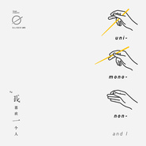

我喜欢一个人
============================

|  |  |
| :--: | :-- |
| [ 我喜欢一个人](https://emumo.xiami.com/album/2100235702) | **艺人**: [RAiNBOW计划](../index.md) **语种**: 国语 **唱片公司**: RAiNBOW计划 **发行时间**: 2015年11月11日 **专辑类别**: EP, 单曲 **专辑风格**: 巴萨诺瓦 Bossa Nova, 国语流行 Mandarin Pop, 华语唱作人 Chinese Singer-Songwriter **播放数**: 107492 **收藏数**: 72 **评论数**: 14  |

## 简介

《我喜欢一个人》是RAiNBOW计划（新浪微博@RAiNBOW计划）第三张专辑的第一首曝光单曲，词曲演唱皆由团队里的新晋歌手钟声（新浪微博@Iam钟声）一手包办。  
  
2015年11月11日，这个光棍节，RAiNBOW计划为你献上「最甜单身情歌」，与你一起“享受一个人”。  
  
“以前喜欢一个人，现在喜欢一个人。”  
你单身多久了，还敢说你真的喜欢一个人吗？  
我们每个人都曾是一个人，而每个人的青春里，或许都有一段孤立无援，找不到依靠的日子。  
可是，一个人，为何只能被加上“孤独”作为注脚？  
那些独属于你的一个人时光，更值得被宝贝和纪念。  
“那些多出来的时间和自由，是要我们学会洒脱呀。”

## 曲目

- [我喜欢一个人](./2100235702/mQTPLW58897.md)

## 评论

|  |  |  |
| :-- | :-- | :-- |
|  [虾米用户](https://emumo.xiami.com/u/250262370) 我还没想好要写什么... 2019-08-24 20:39 赞(0) 踩(0) | 
歌曲很棒 喜欢专辑封面
 |
|  [虾米用户](https://emumo.xiami.com/u/2236868) 躁抑的夏天来了 2016-09-18 14:58 赞(0) 踩(0) | 
- 我喜欢一个人 - 那个人就是我  哈哈，最后冷不防的被萌到~
 |
| ⇒ |  [虾米用户](https://emumo.xiami.com/u/19910356) 给你可以听的彩虹 2016-09-18 23:48 赞(0) 踩(0) | 
嘿嘿
 |
|  [虾米用户](https://emumo.xiami.com/u/90900516)  2015-12-12 17:58 赞(0) 踩(0) | 
我是高三学生，从纪念开始喜欢你们的歌， 加油追梦吧！
 |
| ⇒ |  [虾米用户](https://emumo.xiami.com/u/19910356) 给你可以听的彩虹 2015-12-26 11:08 赞(0) 踩(0) | 
谢谢你！高三加油！
 |
| ⇒ |  [虾米用户](https://emumo.xiami.com/u/90900516)  2016-01-18 22:03 赞(0) 踩(0) | 
<q><b>RAiNBOW计划说：</b></q>
 |
|  [虾米用户](https://emumo.xiami.com/u/2656756)  2015-11-15 21:48 赞(0) 踩(0) | 
棒棒的！支持你们！
 |
| ⇒ |  [虾米用户](https://emumo.xiami.com/u/19910356) 给你可以听的彩虹 2015-11-17 17:36 赞(0) 踩(0) | 
谢谢你的支持！一定会更努力的！
 |
|  [虾米用户](https://emumo.xiami.com/u/74346878)   2015-11-15 16:17 赞(0) 踩(0) | 
一直支持你们！么么哒 
 |
|  [虾米用户](https://emumo.xiami.com/u/47802556)  2015-11-14 22:51 赞(0) 踩(0) | 
慵懒 嗯 很喜欢
 |
|  [虾米用户](https://emumo.xiami.com/u/6934536) no genre 2015-11-11 12:12 赞(0) 踩(0) | 
声音好甜
 |
| ⇒ |  [虾米用户](https://emumo.xiami.com/u/19910356) 给你可以听的彩虹 2015-11-12 17:13 赞(0) 踩(0) | 
还愿喜欢噢~
 |
|  [虾米用户](https://emumo.xiami.com/u/46754482)   2015-11-11 09:06 赞(0) 踩(0) | 
一個人的1111，一個人的小確幸☺️
 |
| ⇒ |  [虾米用户](https://emumo.xiami.com/u/19910356) 给你可以听的彩虹 2015-11-12 17:13 赞(0) 踩(0) | 
希望喜欢这首歌~
 |
