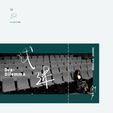

戏迷
============================

|  |  |
| :--: | :-- |
| [ 戏迷](https://emumo.xiami.com/album/2100292534) | **艺人**: [RAiNBOW计划](../index.md) **语种**: 国语 **唱片公司**: RAiNBOW计划 **发行时间**: 2016年03月14日 **专辑类别**: EP, 单曲 **专辑风格**: 青少年流行 Teen Pop, 国语流行 Mandarin Pop, 华语唱作人 Chinese Singer-Songwriter **播放数**: 716593 **收藏数**: 130 **评论数**: 23  |

## 简介

《戏迷》是RAiNBOW计划将于2016年推出的第三张专辑《黄》中的第三首曝光单曲，词曲演唱全部来自团队新歌手——钟声（新浪微博@Iam钟声）。  
  
「爱是什么迷 甜也不觉腻」——在感情这场戏里，越认真投入的人，似乎往往越难走出其中。无论那是怎样的独角戏，每一个不愿草草离去的你我，都是「戏迷」，都值得怜惜。  
  
然而，当剧终灯亮起，我们也终将会明白，你是空转的放映，你是散场的座椅，你曾是失效的票根在我手里握紧。对自己负责，也对TA更好的，是选择放手。因为此时，再多的爱和付出，都是在为难TA，也是在为难自己。  
  
钟声，用她曾经切身的一段感情经历，将这样的为难和勉强唱给你听。我们也相信，在钢琴缓缓的铺陈下，在又一个夜静或天将明，这首歌能陪你放完你心中的那场戏。  
  
「赠你以欢愉，放你随他去」——《戏迷》，送给每一个那么认真（过）的你。白色情人节快乐。  
  
  
更多作品，欢迎关注  
新浪微博@RAiNBOW计划  
微信公众号：rainbowmusic2012

## 曲目

## 评论

|  |  |  |
| :-- | :-- | :-- |
|  [虾米用户](https://emumo.xiami.com/u/39442136) Stay with me... 2020-11-08 00:46 赞(0) 踩(0) | 
真为难你
 |
|  [虾米用户](https://emumo.xiami.com/u/104398754) take me to t... 2020-01-20 04:20 赞(0) 踩(0) | 
有理不算赢
 |
|  [虾米用户](https://emumo.xiami.com/u/51976493) 喜欢的都偷偷藏起来了 嘘 2017-01-16 23:29 赞(1) 踩(0) | 
一听就想哭
 |
|  [虾米用户](https://emumo.xiami.com/u/160810190)  2016-05-04 14:19 赞(0) 踩(0) | 
好难唱的歌。有理不算赢，一语中的。
 |
|  [虾米用户](https://emumo.xiami.com/u/47862914) 我是你要的可乐里面加的冰 2016-04-13 00:30 赞(0) 踩(0) | 
。
 |
|  [虾米用户](https://emumo.xiami.com/u/128362406)  2016-03-29 14:40 赞(2) 踩(0) | 
声音好好听 支持 
 |
| ⇒ |  [虾米用户](https://emumo.xiami.com/u/19910356) 给你可以听的彩虹 2016-03-29 22:29 赞(0) 踩(0) | 
谢谢你！
 |
|  [虾米用户](https://emumo.xiami.com/u/2236868) 躁抑的夏天来了 2016-03-24 13:13 赞(0) 踩(0) | 
舒服
 |
| ⇒ |  [虾米用户](https://emumo.xiami.com/u/19910356) 给你可以听的彩虹 2016-03-24 16:06 赞(0) 踩(0) | 
谢谢你喜欢这首歌
 |
| ⇒ |  [虾米用户](https://emumo.xiami.com/u/2236868) 躁抑的夏天来了 2016-03-24 17:11 赞(0) 踩(0) | 
<q><b>RAiNBOW计划说：</b></q>
 |
|  [虾米用户](https://emumo.xiami.com/u/6329354) Don't stop B... 2016-03-18 02:32 赞(1) 踩(0) | 
钟声有着少见的纯净
 |
| ⇒ |  [虾米用户](https://emumo.xiami.com/u/19910356) 给你可以听的彩虹 2016-03-18 21:34 赞(0) 踩(0) | 
谢谢你喜欢钟声的歌
 |
|  [虾米用户](https://emumo.xiami.com/u/83769606)  2016-03-14 22:16 赞(0) 踩(0) | 
超级喜欢
 |
| ⇒ |  [虾米用户](https://emumo.xiami.com/u/19910356) 给你可以听的彩虹 2016-03-16 20:36 赞(0) 踩(0) | 
谢谢你喜欢这首歌~！
 |
| ⇒ |  [虾米用户](https://emumo.xiami.com/u/83769606)  2016-03-16 20:39 赞(0) 踩(0) | 
<q><b>RAiNBOW计划说：</b></q>
 |
|  [虾米用户](https://emumo.xiami.com/u/44249851) 不断的重复决绝，又重复幸... 2016-03-14 18:47 赞(0) 踩(0) | 
前
 |
|  [虾米用户](https://emumo.xiami.com/u/52126831)  2016-03-14 18:25 赞(0) 踩(0) | 
歌词写的太真实(つД`)
 |
| ⇒ |  [虾米用户](https://emumo.xiami.com/u/19910356) 给你可以听的彩虹 2016-03-16 20:36 赞(0) 踩(0) | 
是你们喜欢的就好呀~
 |
|  [虾米用户](https://emumo.xiami.com/u/18807278) 我还贪恋红尘和烟火气 2016-03-14 14:59 赞(1) 踩(0) | 
哟吼
 |
|  [虾米用户](https://emumo.xiami.com/u/84479438)   2016-03-14 14:30 赞(1) 踩(0) | 

 |
|  [虾米用户](https://emumo.xiami.com/u/45298985) Wechat:dqx19... 2016-03-14 13:52 赞(0) 踩(0) | 
+
 |
|  [虾米用户](https://emumo.xiami.com/u/45298985) Wechat:dqx19... 2016-03-14 13:52 赞(0) 踩(0) | 
+
 |
|  [虾米用户](https://emumo.xiami.com/u/77735830)   2016-03-14 13:03 赞(0) 踩(0) | 
沙发
 |
