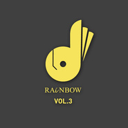

《黄》全专辑试听 Album Sampler
============================

|  |  |
| :--: | :-- |
| [ 《黄》全专辑试听 Album Sampler](https://emumo.xiami.com/album/2102726495) | **艺人**: [RAiNBOW计划](../index.md) **语种**: 国语 **唱片公司**: RAiNBOW计划 **发行时间**: 2017年03月20日 **专辑类别**: EP, 单曲 **专辑风格**: 华语唱作人 Chinese Singer-Songwriter, 国语流行 Mandarin Pop, 流行 Pop **播放数**: 15986 **收藏数**: 29 **评论数**: 7  |

## 简介

 

RAiNBOW计划 第3张作品《黄》全专辑试听音频。
 

 

「如果长大成人，注定是一段越来越没有人可以倾诉的旅程，
 

但愿这张专辑在一些时刻，唱出了你的心声。」
 

 
 

The Last Gift to the Adult World.《黄》，给成人世界的最后一份礼物。
 

 

实体专辑+数字专辑现正热售中，详情欢迎关注@RAiNBOW计划 （新浪微博）  

## 曲目

## 评论

|  |  |  |
| :-- | :-- | :-- |
|  [虾米用户](https://emumo.xiami.com/u/17806314) 以梦为马 以己为光 2017-04-02 19:56 赞(2) 踩(0) | 
已购入实体&amp;ang;( ᐛ 」&amp;ang;)_去什么网易~
 |
| ⇒ |  [虾米用户](https://emumo.xiami.com/u/19910356) 给你可以听的彩虹 2017-04-03 00:08 赞(0) 踩(0) | 
爱你这么强势 hhhh
 |
|  [虾米用户](https://emumo.xiami.com/u/38825516)   2017-04-02 18:03 赞(0) 踩(0) | 
全专辑什么时候上架。好听！！！
 |
| ⇒ |  [虾米用户](https://emumo.xiami.com/u/19910356) 给你可以听的彩虹 2017-04-02 18:14 赞(0) 踩(0) | 
全专辑已经在网易云音乐独家上架了。
 |
| ⇒ |  [虾米用户](https://emumo.xiami.com/u/38825516)   2017-04-02 18:14 赞(0) 踩(0) | 
<q><b>RAiNBOW计划说：</b></q>
 |
|  [虾米用户](https://emumo.xiami.com/u/78559696) 一切安好 不缺烦恼 2017-04-02 17:41 赞(0) 踩(0) | 
好听
 |
| ⇒ |  [虾米用户](https://emumo.xiami.com/u/19910356) 给你可以听的彩虹 2017-04-02 17:42 赞(0) 踩(0) | 
谢谢
 |
