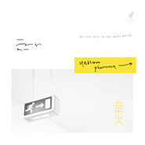

黄
============================

|  |  |
| :--: | :-- |
| [ 黄](https://emumo.xiami.com/album/2102759158) | **艺人**: [RAiNBOW计划](../index.md) **语种**: 国语 **唱片公司**: 独立发行 **发行时间**: 2017年03月20日 **专辑类别**: 录音室专辑 **专辑风格**: 国语流行 Mandarin Pop, 独立流行 Indie Pop, 华语唱作人 Chinese Singer-Songwriter **播放数**: 601180 **收藏数**: 615 **评论数**: 41  |

## 简介

「如果长大成人，注定是一段越来越没有人可以倾诉的旅程，  但愿这张专辑在一些时刻，唱出了你的心声。」    The Last Gift to the Adult World.《黄》，给成人世界的最后一份礼物。    走过《红》的赤诚与纯粹，走过《橙》的温暖与治愈，我们和你一起迎来了RAiNBOW的第三张专辑、第三道“彩虹”——荒诞、却也明亮的《黄》。    从稚气未脱的少年，步入肩负责任的大人世界。还有什么，能比这个过程更明亮也更荒诞的呢？  更明媚美好的未来，真的如你所愿的到来了吗？还是在应接不暇里，你已来不及质疑。  更成熟理性的自己，真的是眼前镜子中的人吗？还是面对所谓的规则与逻辑，你选择了默许。    无法回头的长大，为何总有那么几下恍然，在夜未眠或天亮，让我对自己置身的当下有种不真实感？    和年少的伙伴曾经约定去的远方，到达了吗？  和挚爱的那个人真心投入的情感，现在怎样？  向往的生活、理想蹉跎成等待，你还在追吗？  身边的家人、内心的困顿，你是否回望？    ——你说这世界吵闹、太快变化，我知道有时你是真的来不及消化。    戴上耳机，调大音量——《黄》，13+首歌曲联结而成的「长大之旅」。  RAiNBOW迄今题材最丰富、曲风最多元、投入最大力、创作资源最融合的一张作品。  历时945天，我们和你一同呼吸与经历；  凝结65分45秒，现在请你一起暂时逃离。    「万一我们以后出专辑不是那么容易了，希望《黄》能陪你度过长大过程中那些艰难时刻。」      /////////////////////////    ⊙RAiNBOW《黄》专辑制作    ——青春不止三分钟的热度。人生不止十五分钟的闪光。真的热爱与追求，是一年又一年每一个寒暑的投入。    ◇「我们很庆幸RAiNBOW终究不是一个一夜成名的故事。」    2015年1月9日晚，其时17岁的团队成员雷雨心登陆《中国好歌曲》第二季舞台的节目播出，一夜之间引起广泛讨论与喜欢。原创曲目《记·念》、《深海游戏》更是在节目播出后，占据社交网络热门搜索。随之而来的，是RAiNBOW被更广大范围的荧屏观众与年轻乐迷所认识和关注。《橙》更是在实际销售期三个半月的情况下销售出超过4000张实体专辑，且至今仍不断有消费者表示购买意愿，令音乐产业内不少前辈称奇。    或许，按照一些人的想象，接下来理应是签约、快速地推出新单曲、新作品，甚至加紧宣传、大力推广。然而，无论是雨心，还是RAiNBOW，都没有选择这样的路径，而是回到学生身份，继续学业和生活。同时，在《橙》专辑期间跑遍了生产上下游环节以及经历了《中国好歌曲》第二季节目更高平台的音乐洗礼之后，RAiNBOW决定，在第三张专辑上依然努力做出更加全面超越自己、超越《橙》的新作品。    随着团队成员学业阶段的变化以及作品要求的进一步提高，《黄》的制作时间不再如高中时代的《红》和《橙》一样方便协调。时差和距离导致沟通和讨论难免受到影响，寒暑假的集中录音与制作时间则变得更加弥足珍贵。    此外，RAiNBOW在保留已有歌手、词曲作者班底的情况下，依然坚持发现、寻找新的创作力量。依然决定冒险推出新歌手、新作品，只因我们相信这样的作品能产生共鸣，值得被听到。    与此同时，虽然依旧毫无商业资金、资源上的支持能进行线上线下的推广，但《红》和《橙》中的歌曲在各家流媒体音乐平台上以静水流深的态势继续吸引着新认识RAiNBOW的听众，并令人感动地持续产生共鸣。至今为止，在RAiNBOW内部能统计到的范围内，前两张专辑累计播放量已超5000万次。    一双双同龄人的耳朵倾听，一次次遥远的陌生人心灵共振，让我们更加相信和坚持，要做出让大家有陪伴感的音乐，只有这样才够RAiNBOW。    ◇硬件大升级，从福州唱到北京    2012年，刚起步的RAiNBOW，和录音老师周龙一起蜗居在福州市省立医院旁一座小区大楼的民房里。初生牛犊的大家，在录音室里常常是连续五六个小时的录音。中午出门，到傍晚一转头才发现窗外的天色已经暗了下来。那时，录音室的设备总价只有15万。    2014年，搬家到台江区上海新苑的录音室更名为起点音乐。更宽敞的空间和更自由的录音时间，RAiNBOW在那里用一个冬天和一个夏天，无忧无虑地敲定了《橙》的每一个音符，录下了每一声满意的歌唱。更合理的声学空间与更完备的录音设备，让《橙》的作品质量得到升级。那时，录音室造价50万。    第三张专辑《黄》，为了追求更好的声音质感与录音质量，RAiNBOW的歌手们于2016年的夏天，分批飞赴北京，来到2496 Top Music录音室集中录音。其中，甚至包括重录部分已经录好过了的新专辑新歌。承接过乐坛许多顶尖制作人（如涂惠源）及大热歌手（如黄致列）的录音工作的2496录音室，让RAiNBOW有机会完成一次硬件大升级。300万的录音棚与更好的麦克风让歌手不禁表示“唱起来太爽了”。由于借地录音，录音室本就紧张满档的Booking时间给团队提出了新要求与新挑战。为保证录音的效率与质量兼顾，团队在那段时间甚至不得不熬夜加班来争取更多的录音时间，以至于展秋直言“那段时间过得简直像夜行动物，经常傍晚出门，半夜收工，白天睡觉。”    ◇编曲大力度投入，词曲唱创作史无前例大碰撞    「《红》和《橙》当时编曲资源有限，《黄》这次要一次性补上！」    ——豪言壮语之外，是RAiNBOW这一次不计账目户头上仅有的预算做出的「任性之举」。为此付出的代价就是在不少歌曲完成团队内部的MIDI初编之后，苦苦寻找合适的编曲合作的「四处碰壁」。    好在，坚持寻找，总会寻见。    雨心邀请来好友Luna与Towse，共同讨论碰撞出《流光》与《异类少年》的全新编制。    经友人恺灵介绍，RAiNBOW有幸接触到了来自福建泉州的摇滚乐队Redor锐豆的吉他手兼编曲R2蔡凯东！与来自大陆、台湾、日本的不少音乐人合作过的R2，在初次听到《背包客》demo的当晚就决定为这首歌「保驾护航」，称“这首歌牛X炸了！”Redor锐豆乐队本身擅长的Indie Rock、Pop Rock、Funk曲风也让RAiNBOW团队感到歌曲“终有所托”。随后，《背包客》的词曲作者刘瑜欣与R2反复跟进沟通4个多月，对编曲细节的要求与学习态度也让R2赞叹“你们真的不是玩玩而已。”    宣传期率先曝光推出的《戏迷》在大获好评之后，决定继续「加码」——邀请到来自总政歌舞团的大提琴手——付超老师来编写和演奏大提琴乐轨。作为李霄云、程璧等歌手录制专辑、全国巡演都指定合作的大提琴手，付超在流行音乐与独立音乐的编写与演奏经验都相当丰富。实录大提琴当天，付超老师的专业程度与强迫症般的自我要求，让展秋一边惊叹“太可怕了！拉错一个音你不说他自己就直接重来。”一边庆幸“请付超老师来很值！”最后的效果也让实录现场的诸位感叹“头皮发麻”。    与此同时，《我喜欢一个人》、《作词人》、《21》分别请来职业音乐人周琦、刘德隆、周运来等人负责编曲。在每首歌或长或短的编曲期内，团队也保证每首歌的作者本人对接确认每一版的编曲修改，保证在与各个编曲老师互相碰撞出火花的情况下，最大程度上凸显歌曲表达原意，而非「外包了事」。    此外，RAiNBOW依然继续寻找和发现同龄人中的同好力量。除了《橙》专辑中大获好评的《梵高画夹》编曲、现在就读于厦门大学的朱沁怡继续在《二手旧货市场》、《秘方》两首歌担纲之外，团队还吸纳了现就读于中央音乐学院作曲系的林少聪、中国传媒大学电子音乐制作专业的王子卫作为新生的编曲力量。    在苦寻半年《等待戈多》的编曲屡屡无果之后，经同学介绍，展秋与子卫连上线。值得一提的是，在编《等待戈多》期间，子卫正在网易游戏的游戏配乐部门实习，每天工作到昏天黑地没时间洗澡也要挤出编曲时间的子卫，让展秋说“我很怕她那段时间撑不住，虽然进度摆在这里，但说实话很心疼，她可以不用那么拼的啦其实。”一天只能编一个小片段输出的王子卫，也在那段时间用一种神奇的“日常定点投食”状态喂养团队迫不及待的好奇心。最终拿到完整编曲听完后，展秋说“我想给王子卫生猴子！因为这首编曲要求我们提得很任性，要求很多，很多人都不愿意搭理和接手，但子卫完成得超过想象的漂亮。不愧是她同班同学都说是全专业最厉害的人。”    不断求人找关系、花超出预算负荷的钱、细心跟进对接、反复调整修改——编曲的一次性升级之下，也是RAiNBOW在歌曲制作上，词曲演唱各班人马史无前例大碰撞的一次融合。    新歌手刘雨含和钟声的加入，除了为团队的声音开拓出更多可能性和受众面向之外，也刺激到团队原有的几位歌手及创作班底——  在“受够了展秋”之后，林姝涵邀请雨含为自己度身创作，而两人合作的这首《直到这里》竟迟迟才让展秋听到——“你们俩太过分了，藏了这么久！”  钟声丰富而多面性的声音也吸引到了刘瑜欣，瑜欣把自己2015年在美国游学期间写下的《背包客》交由钟声演唱，只因“钟声的声音唱这首歌能让我觉得这首歌带着风。感觉很对。”而钟声原本吉他版的《戏迷》也经瑜欣之手，换成更加包容催泪的钢琴演奏版。  同时，歌手们对词曲编曲的参与程度更深。姝涵就首次在自己负责演唱的多首歌曲中，一路从作曲盯改到编曲。词曲作者们的组合搭配也更加开放——“这一张大家有互相刺激到对方，都写出了很多自己之前不一定能想到会写的东西。”  ——在2015年的夏天，在福州，众人聚集的录音室，发酵出令人抓狂又过瘾的一段时光。    这样的创作周期，也导致《黄》成为RAiNBOW目前三张专辑制作中前期写歌数量最多、后期淘汰歌曲数量最多的一张专辑。    “这次有一些歌曲写好、编好、甚至都录好了，但因为不满意和一些其他原因——比如大家在一些事情上没有达成歌曲的共识，就被毙掉了。”  “还有一些歌，其实非常想放进《黄》里面的，但因为歌手对歌曲的理解和嗓音状态还没对味，所以就不着急放，但挺可惜的。”    但当谈及是否因此心累沮丧，团队则认为，「这个过程本身还蛮有快感的。写了好多，听了好多，删了好多，觉得有一种别样的超满足。下一张还想这么玩！」    ◇「有些人你必须得等」的包装设计    「软体」的歌曲创作大投入，作为「硬体」的实体专辑也要够硬才行。    《黄》专辑的设计主理依然请来了郭旭峥。上一张专辑《橙》的概念设计大获好评，全展开长度达80cm的「剥橙子过程」让不少消费者惊讶久违的实体产品拆包乐趣，更是引发网络上纷纷的晒单。    这一次，带着对产品设计、市场行销更多也更深理解的郭旭峥，却用了比《橙》更久的筹备时间来思考《黄》这张专辑的主题与表达。从拿到歌曲录音完成版到设计解决方案出台，就整整历时5个月。被大家又盼又叹、又着急又不敢催的「郭师哥」，当之无愧的成为了「掌握了RAiNBOW发片日期的男人」。    然而，有些人你就是必须得等，因为你知道等待是值得的。不负众望，郭旭峥交出了「药」及「药房」这一概念解决方案来诠释他心目中给成人世界的最后一份礼物。    挂号单、病历、处方笺、铝箔袋、药品使用说明书——从你触摸到《黄》的实体专辑开始，你就走入了他设计的场景。每一个物件都是为了完整你的体验，每一处设计都包含着带有温度的思考。    热敏打印的挂号单更是作为专辑里极巧妙的存在，让每一张实体专辑都变得独一无二；并且，由于热敏打印的缘故，每一张挂号单都会随着时间而慢慢消逝淡去字迹，堪称一张「会陪你长大的专辑。」    在整套包装设计上，RAiNBOW也前所未有地邀请来其他好伙伴一起协力。手写字体、内页摄影、还有歌名字体的设计，让最终的视觉呈现无论在数位网络还是在现实生活中都有一致的体验。    好的设计就要有好的落实，这次RAiNBOW也是决心把实体印刷抬升到短时间内难以再自我超越的地步。团队在北京拜访了多家国内印刷实力顶尖的印刷企业，最终选定曾承接过CCTV5+、锤子科技、2016北京设计周、单向历、李宇春专辑等不同类型印刷品的奇良海德（QL-ART）作为此次《黄》专辑的承印商，一次性把印刷工艺做到极致。      //////////////////////////////////////    ⊙RAiNBOW《黄》歌曲导览「许是少年最荒唐，奋不顾身向光亮。」    ★流光  词：曾海涵 曲：雷雨心 演唱：雷雨心    不管身处何方，身边何种境况，也不管周遭是喧嚣还是孤单，你的生命里，想必也一定有一段时光或者一个人，成为了你永远的底气吧？那个最美好的夏天，那个最要好的朋友，是最无忧无虑的年少奔跑，是回想起来的会心一笑。那年我们哼着夏日的歌谣，笑靥灿烂，向着想象的明天浅唱悠扬。    ★背包客  曲：刘瑜欣 词：刘瑜欣+林展秋+钟声 演唱：钟声    背包是沉重的，但诺言比背包更沉重。  道别是刺痛的，但亏欠比道别更刺痛。  如果我对你说「生命就是一场不得已挥手的哲学」，你能否对我微笑地再见？  谁不是自己生命里的背包客？  比起「说走就走的旅行」，有多少真正欠给自己的自由，来自那些你抛下不了的羁绊？  别说这一切太晚，末班车又如何？    ★等待戈多  曲：林展秋 词：林展秋 演唱：林力尧    「在等待的时候，什么都没有发生。」  等待，是生命的常态。你是否也在等待什么？一个人、一件事，还是一个机会、一场人生的转折点？如果生命是无意义的，那么等待是否是徒劳的、荒诞的？  1953年，荒诞派戏剧的奠基之作《等待戈多》首演。六十多年后，塞缪尔·贝克特的这部剧作所指向的人生终极意义与目的依然敲打着人类的内心焦虑。  在经历了雨果的文学、梵高的绘画之后，RAiNBOW「致敬经典」系列将关注点转向戏剧领域。以原著为基础，拟真小剧场声场音效，力图带你回到巴比伦剧院。  God，Where are you?    ★直到这里  曲：刘雨含 词：刘雨含+林展秋 演唱：林姝涵    一场争执、一次失望都不足以影响一段感情的结局。但累积而成的变化，却悄无声息地改变了走向。当你和我走到这里，当话说到这里，最后一点默契是拿来摊牌前的安静。谁用力维持好心态，成全了谁的姿态？谁又用大方的姿态，保留最后尊严的表态？年轻时，我们都希望一段感情长长久久；直到后来，发现或许一些人「适合只到这里」。    ★异类少年  曲：雷雨心 词：雷雨心 演唱：雷雨心    世界和社会约定俗成的习惯，是否还容得下边缘人的真实模样？异类的标签由谁来定义，又该怎么评断？或许，少年他只是不知如何讨别人喜欢；或许，你也曾被误解过虚伪与假装。当「活在当下」成为辩护的借口与说辞，是否为了生存，每个人就能肆无忌惮地背叛心底曾经干净的自己？那就珍惜吧，少年那些不被理解的锋芒。    ★21  曲：刘雨含 词：刘雨含 演唱：刘雨含    21岁，离成年已有些许时日，可是离成熟还有多遥远呢？并不是矫情与逃避，是有时真的难免彷徨。想想事到如今，是否还存有年少时的心气？看身边人来人往，多少次你独自消化了那些冷冷清清？只好恨自己还「不够聪明」，只能硬着头皮「安慰自己」。愿这首歌像一个角落，保管与安放你心深处的小小怯懦。    ★分礼进行曲  曲：林姝涵+林展秋 词：林展秋 演唱：林姝涵    有结婚典礼、订婚典礼，为什么没有分手典礼？  似乎，感情的圆满才配拥有仪式；而感情的失散，多数只能潦草收场。  如果有一场分手典礼，你会用什么样的方式出席？  哭得动情的嘉宾，像你我社交网络里无关的友人，只是象征性出席。  「再联系」、「还是朋友」，像令人尴尬的离场词，只是礼貌性用语。  分礼进行曲，是闹剧、是正剧、是亦悲亦喜的讽喻。  什么时候我们才可以不让「好聚好散只是过过嘴瘾」？    ★我喜欢一个人  曲：钟声 词：钟声 演唱：钟声    Single is Simple,Double is trouble.  「单身一个人」，何罪之有？当社会、父母都对年轻人的感情状况着急紧张，请你不要为了恋爱而恋爱。  以前喜欢一个人，现在喜欢一个人。珍惜一个人的时光，为了更好地了解自己，也为了做好准备遇见将来那个对的人。写好一个人的故事，做会儿第一人称吧。    ★改天再忙    曲：林展秋 词：林展秋 演唱：林力尧    「改天再聊！」——因为工作、因为学业、因为社交，你可曾仓促挂断了那通想念的电话？  「改天再忙。」——谁能真的在焦虑的当下有勇气真的喊出这句话？  当父母的唠叨不在耳边，当他们的老去不在眼前，对家庭的眷恋此时却面临自己成家立业的冲击。聚少离多从某个时间点开始变得特别明显。  你要组建自己的家庭了，要忙事业了——可难道要忙到那些背影都模糊、夕阳落山之后的夜静人眠，才后悔那些未尽的陪伴吗？  Better Late than Never.    ★二手旧货市场  曲：林展秋+林姝涵 词：林展秋 演唱：林姝涵    欢迎光临二手旧货市场。  失去光泽的发卡、摔出缺口的花架、不堪负累的耳环……这些无人欣赏的难言过往，想来你是最有眼光的买家。无从典当的旧时光、无从追查的说法，每一段失散的故事流浪至此，等你来收藏。又或者，你也被抛弃至此，舔着伤疤。但在二手旧货市场，我们都该学会原谅。    ★戏迷  曲：钟声 词：钟声 演唱：钟声    「真为难你。」——当感情双方的两个人中，有一个人提前离席了，对于剩下那个人来说，再多的爱、再多的付出其实都是在为难对方。再多的爱，其实都是被感情这部戏给迷惑了，又或许只是不想让自己承受痛苦。但是最好的爱，对于对方来说，就是放他到他真正爱的人身边，到他真正想做的事情上。我能赠你的最后的欢愉，就是「放你随他去」。    ★秘方  词：林展秋 曲：林展秋 演唱：林力尧    有没有一剂秘方，能治忘不了的人和放不下的心？  外表健康的你，是否曾为谁偶尔「慢性病发」？  踏破铁鞋痴痴寻医问药，爱欲性情久病终于成医。  可眼为情媒，心是欲种，如何做到不看不想？  医者不自医，你我皆庸医。秘方亦不秘，早在你手里。    ★作词人（告诉我你的名字）  曲：刘雨含 词：刘雨含+林展秋 演唱：刘雨含    谁曾念念有词，谁都会是作词人。  而我的念念有词，全是你的名字。  最光荣的心事、最感人的句子，最寂寞的姿态、最无望的等待，都来自于你。  相遇、相识、相知、相爱、再到告别和离开——相比之下，押韵真是一件没有负担的事。  怪不得那些作词人能来教人释怀。    ★理想不大  曲：林展秋 词：林展秋 演唱：朱冠学    对着天花板半宿辗转难眠，刷牙洗脸时突然看见面庞浮肿的自己。  声色犬马的排场里突然怅然的你，十字街头脚步匆匆着急赶路的他和她。  这个时代太嘈杂，我知道你会抱怨责怪，没人听见你内心的不安。    我知道你理想不大，那就不要被它所绑架，把自己过成不堪重负的模样。  我知道理想不大，但你还愿意坚持对自己的期望。    如果你已紧闭心门，留一扇心窗。  生命不止前进倒退和上下，如果你能「向左向右看」。  

## 曲目

## 评论

|  |  |  |
| :-- | :-- | :-- |
|  [虾米用户](https://emumo.xiami.com/u/322174171)  2020-10-12 21:07 赞(0) 踩(0) | 
什么时侯发下一张专辑？
 |
| ⇒ |  [虾米用户](https://emumo.xiami.com/u/19910356) 给你可以听的彩虹 2021-01-05 21:29 赞(0) 踩(0) | 
2021年的春天，再过几个月相见！
 |
|  [虾米用户](https://emumo.xiami.com/u/425657867) 再见一万遍，我的朋友。 2020-04-12 17:17 赞(0) 踩(0) | 

 |
|  [虾米用户](https://emumo.xiami.com/u/112091932)  2019-12-21 09:41 赞(0) 踩(0) | 
真心喜欢这种感觉，计划着，每一张专辑都用心在做，不求速度。很静。
 |
| ⇒ |  [虾米用户](https://emumo.xiami.com/u/19910356) 给你可以听的彩虹 2021-01-05 21:28 赞(0) 踩(0) | 
谢谢你
 |
|  [虾米用户](https://emumo.xiami.com/u/424423157) 奶盐薄荷 2019-12-03 19:45 赞(1) 踩(0) | 
从21岁到现在24岁;-)
 |
|  [虾米用户](https://emumo.xiami.com/u/424013165)  2019-08-19 16:14 赞(0) 踩(0) | 
很喜欢这个组合昂  优秀的你们  优秀的作品（很自私的不希望被抖音发现啊）  但你们的努力值得所有人赞赏  希望你们用真诚的心做出动人的作品
 |
| ⇒ |  [虾米用户](https://emumo.xiami.com/u/19910356) 给你可以听的彩虹 2021-01-05 21:29 赞(0) 踩(0) | 
谢谢你，2021年的春天，和你约好我们的第四张专辑《绿》
 |
|  [虾米用户](https://emumo.xiami.com/u/13650518) ？ 2019-04-13 13:04 赞(1) 踩(0) | 
还会有新的专辑吗
 |
| ⇒ |  [虾米用户](https://emumo.xiami.com/u/19910356) 给你可以听的彩虹 2019-08-14 21:53 赞(0) 踩(0) | 
会有的
 |
|  [虾米用户](https://emumo.xiami.com/u/333052017) 退出虾米～ 2018-12-25 03:32 赞(0) 踩(0) | 
我之前聽了流光就買了 戲迷和我喜歡一個人也超級溫油 很奇怪 哈哈哈一聽試聽的前奏秒入了 然後現在Eason的專輯還要猶豫買不買 那個時候還在用百度雲 還和他在一起 怎麼感覺那麼久遠……
 |
|  [虾米用户](https://emumo.xiami.com/u/7287415)  2018-09-06 23:51 赞(1) 踩(0) | 
这张专辑没有陈樱梓的歌。 伤心。
 |
|  [虾米用户](https://emumo.xiami.com/u/321929872) 拍拍灰尘 嘲笑自己 2018-07-01 20:06 赞(1) 踩(0) | 
那年初三，听着雨心姐姐的&amp;ldquo;记念&amp;rdquo;毕的业，考到了理想的高中。（今年高中毕业也是听着&amp;ldquo;记念&amp;rdquo;毕业的，哈哈）当年，去微博关注雨心姐姐，知道了有这么一个年轻勇敢的梦想计划，叫做rainbow计划。当时就被吸引了。真的很喜欢这样一个计划，年轻美好。很羡慕你们这群人的友谊，很喜欢你们的音乐，很佩服你们这些年来的坚持。从雨心姐姐的高中到大学，从她的短发到长发，从我的初中到高中，从红到黄的专辑，时间不断拉伸延长，可是起点依旧未变，是对你们的喜欢！谢谢你们的音乐陪伴我成长，谢谢你们的坚持给予我朝梦想进发的力量，谢谢你们给予我的感动，独属于青春的那份感动！我会一直支持你们的！
 |
|  [虾米用户](https://emumo.xiami.com/u/321929872) 拍拍灰尘 嘲笑自己 2018-07-01 20:01 赞(0) 踩(0) | 
那年初三，听着雨心姐姐的&amp;ldquo;记念&amp;rdquo;毕的业，考到了理想的高中。（今年高中毕业也是听着&amp;ldquo;记念&amp;rdquo;毕业的，哈哈）当年，去微博关注雨心姐姐，知道了有这么一个年轻勇敢的梦想计划，叫做rainbow计划。当时就被吸引了。真的很喜欢这样一个计划，年轻美好。很羡慕你们这群人的友谊，很喜欢你们的音乐，很佩服你们这些年来的坚持。从雨心姐姐的高中到大学，从她的短发到长发，从我的初中到高中，从红到黄的专辑，时间不断拉伸延长，可是起点依旧未变，是对你们的喜欢！谢谢你们的音乐陪伴我成长，谢谢你们的坚持给予我朝梦想进发的力量，谢谢你们给予我的感动，独属于青春的那份感动！我会一直支持你们的！期待你们的绿青蓝紫！哈哈～
 |
|  [虾米用户](https://emumo.xiami.com/u/321929872) 拍拍灰尘 嘲笑自己 2018-07-01 19:38 赞(0) 踩(0) | 
那年我初三，是听着&amp;ldquo;记念&amp;rdquo;这首歌毕的业，考到了理想的高中。（今年我高中毕业也还是听着&amp;ldquo;记念&amp;rdquo;毕业的，哈哈。）当年去微博关注雨心姐姐，知道了有这么一个年轻勇敢追求梦想的计划，叫rainbow计划。我也一直很憧憬和佩服这么一群人，喜欢他们的友谊，喜欢他们对梦想的坚持，喜欢他们的才华，喜欢他们的音乐。从雨心姐姐的高中到大学，从她的短发到长发，从我初中到高中毕业，从红到黄的专辑，不知不觉我也已经跟随这个计划长大了。时间在变，不变的是我依然很喜欢很喜欢这个计划，喜欢这么一群人，喜欢这一份年轻勇敢的梦想！谢谢你们用音乐陪伴我成长，谢谢你们用你们的坚持给予我力量，谢谢你们给予我的感动！
 |
|  [虾米用户](https://emumo.xiami.com/u/248225594)  2018-05-21 16:05 赞(1) 踩(0) | 
每首都很有感觉，淘宝搜了一圈cd，突然想起现在都是数字专辑了 果断买。
 |
| ⇒ |  [虾米用户](https://emumo.xiami.com/u/19910356) 给你可以听的彩虹 2018-06-04 23:36 赞(0) 踩(0) | 
谢谢你
 |
|  [虾米用户](https://emumo.xiami.com/u/293738632)  2017-12-04 12:57 赞(3) 踩(0) | 
move on 
 |
|  [虾米用户](https://emumo.xiami.com/u/102826418) 你总是将我丢下 2017-10-09 00:31 赞(4) 踩(0) | 
都是有才华的年轻人 真棒 支持
 |
| ⇒ |  [虾米用户](https://emumo.xiami.com/u/48839446) 是一个会为了喝一杯牛奶而... 2017-11-14 10:40 赞(0) 踩(0) | 
谢谢你！
 |
|  [虾米用户](https://emumo.xiami.com/u/242272728)  2017-09-30 00:30 赞(2) 踩(0) | 
兜兜转转，还是回来这里听了，一种回家的感觉❤❤
 |
|  [虾米用户](https://emumo.xiami.com/u/248358752)  2017-08-13 12:23 赞(0) 踩(0) | 
买了一张是全都可以下载还是&amp;hellip;
 |
| ⇒ |  [虾米用户](https://emumo.xiami.com/u/19910356) 给你可以听的彩虹 2017-08-14 19:52 赞(0) 踩(0) | 
全都可以下载
 |
|  [虾米用户](https://emumo.xiami.com/u/226878057)  2017-07-28 14:42 赞(3) 踩(0) | 
因为不看电视，所以并没有在好声音上听过，网易云音乐推送后发现不能买单张专辑的，来虾米看看没想到上架的，果断出手。好的音乐是需要支持的，希望能出完彩虹色和黑白，加油
 |
| ⇒ |  [虾米用户](https://emumo.xiami.com/u/19910356) 给你可以听的彩虹 2017-08-09 22:57 赞(0) 踩(0) | 
谢谢你
 |
|  [虾米用户](https://emumo.xiami.com/u/274791376)  2017-07-18 19:25 赞(1) 踩(0) | 
有思想的专辑，支持！
 |
|  [虾米用户](https://emumo.xiami.com/u/194690331)  2017-07-17 22:50 赞(1) 踩(0) | 
都很好听，支持
 |
|  [虾米用户](https://emumo.xiami.com/u/12228019)  2017-07-17 00:22 赞(1) 踩(0) | 
支持！！！
 |
|  [虾米用户](https://emumo.xiami.com/u/52740004) 想你到六点 2017-06-18 23:25 赞(1) 踩(0) | 
终于等到上架！！超棒！！！！   
 |
|  [虾米用户](https://emumo.xiami.com/u/3544311) 向来缘浅.奈何情深… 2017-06-13 21:07 赞(0) 踩(0) | 
等到花都.....
 |
|  [虾米用户](https://emumo.xiami.com/u/17806314) 以梦为马 以己为光 2017-06-11 16:51 赞(0) 踩(0) | 
:-)
 |
|  [虾米用户](https://emumo.xiami.com/u/206748478) Lighter 2017-06-10 15:28 赞(2) 踩(0) | 
加油w看到上架就随手买了
 |
| ⇒ |  [虾米用户](https://emumo.xiami.com/u/19910356) 给你可以听的彩虹 2017-06-15 09:15 赞(0) 踩(0) | 
谢谢你的支持！
 |
|  [虾米用户](https://emumo.xiami.com/u/48030912)  2017-06-09 01:48 赞(0) 踩(0) | 
已入，望更好
 |
|  [虾米用户](https://emumo.xiami.com/u/15379188)  2017-06-08 23:39 赞(0) 踩(0) | 
终于等到虾米
 |
|  [虾米用户](https://emumo.xiami.com/u/47440713)  2017-06-08 19:46 赞(0) 踩(0) | 
加油
 |
|  [虾米用户](https://emumo.xiami.com/u/69617480) 去你的坚强。 2017-06-08 18:50 赞(0) 踩(0) | 
已经早就在网易云买了再虾米听 没想到居然给我上架了。。。。。
 |
| ⇒ |  [虾米用户](https://emumo.xiami.com/u/19910356) 给你可以听的彩虹 2017-06-10 09:00 赞(0) 踩(0) | 
虾米的下载也是需要付费的。价格和网易云音乐同样。
 |
|  [虾米用户](https://emumo.xiami.com/u/43227145)  2017-06-08 18:20 赞(0) 踩(0) | 
终于上架了，好开心！ 
 |
|  [虾米用户](https://emumo.xiami.com/u/11106142) HXY 2017-06-08 09:32 赞(0) 踩(0) | 
支持你们，加油哦！
 |
| ⇒ |  [虾米用户](https://emumo.xiami.com/u/19910356) 给你可以听的彩虹 2017-06-08 17:49 赞(0) 踩(0) | 
谢谢你！一定！
 |
