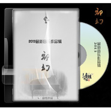

初幻
============================

|  |  |
| :--: | :-- |
| [ 初幻](https://emumo.xiami.com/album/2100238854) | **艺人**: [林音炫](../index.md) **语种**: 国语 **唱片公司**: 独立发行 **发行时间**: 2013年04月06日 **专辑类别**: 录音室专辑 **专辑风格**: 器乐独奏 Solo Instrumental, 轻音乐 Easy Listening **播放数**: 268539 **收藏数**: 57 **评论数**: 6  |

## 简介

 <strong> </strong> 

<strong>音乐制作：林音炫  
</strong>
 
<strong> </strong> 

<strong>美工设计：苏歆渘</strong>
 
<strong> </strong> 

 
 

林音炫2013新专辑-   

 

 
 
  

最初的幻想再完美，
 
  

也逃不开时光橡皮擦的判决，
 
  

我拼命在这一刻记录着关于你，
 
  

可是Angel，你还好吗？你还好吧。
 

我装作不聪明，也没太痛，
 

这座城市，这个街道，这条巷弄，
 

这场我一个人模拟出来的爱情，
 

是时候选择离开了吧——
 

 
 

2013 全新作品《初幻》- 
 
 

## 曲目

## 评论

|  |  |  |
| :-- | :-- | :-- |
|  [虾米用户](https://emumo.xiami.com/u/113396666)  2016-02-13 03:56 赞(0) 踩(0) | 
喜欢这种钢琴音乐！加油！
 |
|  [虾米用户](https://emumo.xiami.com/u/90551926) 开心的你不用自导自演心痛 2015-12-11 14:06 赞(0) 踩(0) | 
谢谢你
 |
|  [虾米用户](https://emumo.xiami.com/u/32461398) 曾在云上浮想联翩如今也终... 2015-11-18 19:14 赞(0) 踩(0) | 
初幻。记录你的时间。时光橡皮擦。我不聪明。艾小可•安琪。都还好吗。
 |
| ⇒ |  [虾米用户](https://emumo.xiami.com/u/6179778) 弹琴打鼓，耍帅装酷 2015-11-18 19:43 赞(0) 踩(0) | 
新更《模拟一场爱情》~
 |
|  [虾米用户](https://emumo.xiami.com/u/50878282)  2015-11-18 07:20 赞(0) 踩(0) | 
 
 |
