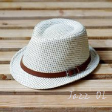
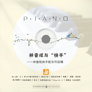
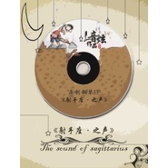

林音炫
============================

|  |  |
| :--: | :-- |
| [ 林音炫](https://i.xiami.com/l-ove) | **播放数**: 4426011 **粉丝数**: 1297 **评论数**: 138 **地区**: China 中国大陆 **风格**: 器乐独奏 Solo Instrumental, 轻音乐 Easy Listening, 轻音乐流行 Light Pop  |

## 档案

林音炫，原创音乐人。 
作品：《冬の秘密》、《阳光正好》、《幻想的流星雨》、《我一直在你的左边》等 
中文名： 林音炫 
生    日： 1996-11-26 
祖    籍： 中国·重庆

## 专辑

| 名称 | 语种 | 唱片公司 | 发行时间 | 专辑类别 | 专辑风格 |
| :--: | :-- | :-- | :-- | :-- | :-- |
| [ 2019年新专辑（更新中）专辑名字待公布](./albums/2105192792.md) | 纯音乐 |  | 2019年08月29日 | 录音室专辑 | 爵士嘻哈 Jazz Hip Hop, 器乐独奏 Solo Instrumental, 轻音乐流行 Light Pop |
| [ Jazz OL](./albums/2100304424.md) | 国语 | 独立发行 | 2016年04月01日 | EP, 单曲 | 爵士流行 Jazz Pop, 器乐独奏 Solo Instrumental, 爵士 Jazz |
| [ 謎の森の大冒険谜之森林的大冒险](./albums/2100271602.md) | 国语 | 独立发行 | 2016年02月03日 | EP, 单曲 | 器乐独奏 Solo Instrumental, 轻音乐 Easy Listening, 新世纪音乐 New Age |
| [ 林音炫与“快手”林音炫快手配乐作品辑](./albums/2100248518.md) | 国语 | 独立发行 | 2015年12月22日 | 录音室专辑 | 器乐独奏 Solo Instrumental, 轻音乐 Easy Listening, 新世纪音乐 New Age |
| [ 初幻](./albums/2100238854.md) | 国语 | 独立发行 | 2013年04月06日 | 录音室专辑 | 器乐独奏 Solo Instrumental, 轻音乐 Easy Listening |
| [ 这个夏天](./albums/1979048888.md) | 国语 | 独立发行 | 2012年08月01日 | 录音室专辑 | 器乐独奏 Solo Instrumental, 轻音乐 Easy Listening |
| [ 射手座·之声EP](./albums/1822188775.md) | 国语 | 独立发行 | 2012年05月06日 | EP, 单曲 | 器乐独奏 Solo Instrumental, 轻音乐 Easy Listening |
| [ 林音炫的专辑](./albums/5022625294.md) | 其他 |  | 不详 |  |  |

## 评论

|  |  |  |  |
| :-- | :-- | :-- | :-- |
|  [虾米用户](https://emumo.xiami.com/u/32461398) 曾在云上浮想联翩如今也终... 2021-01-09 19:25 赞(0) 踩(0) | 
炫炫，我刚听你歌的时候我还在读高中，现在都上班了，最后一个月，常回家看看
 |
|  [虾米用户](https://emumo.xiami.com/u/411358160) 好好工作，快乐生活 2020-12-14 09:16 赞(0) 踩(0) | 
你的音乐好棒！这样小的年纪，却有这么舒缓平静的心境，好难得！是你自己谱的曲子吗？想要楚安懿的乐谱，也想给自己弹奏一曲 
 |
|  [虾米用户](https://emumo.xiami.com/u/364546789) 嘛！这个还差点意思 2020-10-12 09:28 赞(0) 踩(0) | 
虾米日推，，惊喜不断
 |
|  [虾米用户](https://emumo.xiami.com/u/351530853) 不辜负最好的自己 2020-09-25 23:03 赞(0) 踩(0) | 
感谢你给我们带来这么好听的音乐(❁&amp;acute;&amp;omega;`❁)
 |
|  [虾米用户](https://emumo.xiami.com/u/9003931) 千淘万漉虽辛苦 2019-07-27 22:42 赞(1) 踩(0) | 
老弟加油！
 |
|  [虾米用户](https://emumo.xiami.com/u/407843904)  2019-04-16 23:47 赞(2) 踩(0) | 
音符奏出的是暖暖的久久不能忘怀的那份情怀！
 |
|  [虾米用户](https://emumo.xiami.com/u/361037631)  2019-03-21 03:45 赞(1) 踩(0) | 
******
 |
|  [虾米用户](https://emumo.xiami.com/u/377534787) 最喜欢纯音乐 2019-03-01 13:34 赞(3) 踩(0) | 
一边听音乐，一边看书。停留在文字上的注意力，突然被你的“微微凉”吸引了，好美的一首曲子。
 |
|  [虾米用户](https://emumo.xiami.com/u/322622576) 只有神能批判我 2019-01-14 22:51 赞(3) 踩(0) | 
重庆崽儿顶起！
 |
| ⇒ |  [虾米用户](https://emumo.xiami.com/u/322854856) 大爱穹妹 2020-08-15 22:39 赞(0) 踩(0) | 
顶
 |
|  [虾米用户](https://emumo.xiami.com/u/308009730) 唉╯﹏╰ 2018-09-09 07:39 赞(4) 踩(0) | 
哎呦，不错哟
 |
|  [虾米用户](https://emumo.xiami.com/u/285049473) 剛拿起酒杯想和你碰杯 才... 2018-05-09 22:39 赞(1) 踩(0) | 
只有我对你的52kg感兴趣嘛！这么瘦！
 |
| ⇒ |  [虾米用户](https://emumo.xiami.com/u/50241269) 爱菲――幽 2018-06-19 16:50 赞(0) 踩(0) | 
据说现在已经52.5kg了
 |
|  [虾米用户](https://emumo.xiami.com/u/330906438) 珍惜当下身边的每一个人～... 2018-05-02 22:32 赞(1) 踩(0) | 
有些旋律挺好听的，超爱 
 |
|  [虾米用户](https://emumo.xiami.com/u/256683730) wanna be a S... 2018-04-28 19:43 赞(1) 踩(0) | 
emmmm...看起来你要大火了噢...
 |
|  [虾米用户](https://emumo.xiami.com/u/15855288) 我还没想好要写什么... 2018-04-15 11:51 赞(0) 踩(0) | 
五年过去了，还好吗？
 |
| ⇒ |  [虾米用户](https://emumo.xiami.com/u/6179778) 弹琴打鼓，耍帅装酷 2018-04-19 13:13 赞(0) 踩(0) | 
生活处处不尽人意，好与不好，又有何顾呢？
 |
|  [虾米用户](https://emumo.xiami.com/u/20177386) 感谢一切美好的遇见❤️ 2018-02-23 10:45 赞(0) 踩(0) | 

 |
|  [虾米用户](https://emumo.xiami.com/u/311033864) 全宇宙最酷 2018-02-06 19:16 赞(1) 踩(0) | 
2013年的时候我上大二加过你的微信后来不再联系了我想你一定过得很好 
 |
| ⇒ |  [虾米用户](https://emumo.xiami.com/u/6179778) 弹琴打鼓，耍帅装酷 2018-02-12 20:36 赞(0) 踩(0) | 
大概～
 |
|  [虾米用户](https://emumo.xiami.com/u/345795983) 勇往直前 2018-01-21 19:44 赞(0) 踩(0) | 
我来报道一下
 |
|  [虾米用户](https://emumo.xiami.com/u/318068962) 呵呵。 2017-09-30 19:16 赞(0) 踩(0) | 
弟弟好！
 |
|  [虾米用户](https://emumo.xiami.com/u/318068962) 呵呵。 2017-09-24 10:51 赞(2) 踩(0) | 
二次元无敌～好萌～嘻嘻嘻，找到了纯音乐了！终于，可以改变小虾米的属性啦！谢谢，谢谢，谢谢！（3遍。）
 |
| ⇒ |  [虾米用户](https://emumo.xiami.com/u/6179778) 弹琴打鼓，耍帅装酷 2017-09-30 13:44 赞(0) 踩(0) | 
~
 |
|  [虾米用户](https://emumo.xiami.com/u/45675180)  2017-06-23 07:02 赞(0) 踩(0) | 
很好听
 |
|  [虾米用户](https://emumo.xiami.com/u/224616644) 孤独的我也有善良的心。 2017-06-19 14:29 赞(2) 踩(0) | 
我从石进评论看到你的，我和你一样喜欢安静舒适的感觉，通过音乐我们能够找到最真实的自己，同时纯音乐也是心宁的港湾，兄弟要加油！多出一点安静的曲子，我在这里永远支持你
 |
|  [虾米用户](https://emumo.xiami.com/u/295094828)  2017-05-09 19:55 赞(0) 踩(0) | 
林老师您好！快手回忆里面有三首歌，一首是回忆的触觉，一首是模拟一场爱情，请您告知第三首是什么啊？
 |
|  [虾米用户](https://emumo.xiami.com/u/102824962)  2017-03-03 00:08 赞(0) 踩(0) | 
晚安 男神
 |
|  [虾米用户](https://emumo.xiami.com/u/50241269) 爱菲――幽 2017-02-08 12:22 赞(2) 踩(0) | 
挺好的。。挺好。。我就听听。。不亵渎
 |
|  [虾米用户](https://emumo.xiami.com/u/265426833)  2017-01-21 00:08 赞(1) 踩(0) | 
加油加油加油
 |
|  [虾米用户](https://emumo.xiami.com/u/16135450)  2016-10-14 16:00 赞(0) 踩(0) | 
4673
 |
|  [虾米用户](https://emumo.xiami.com/u/98933750)  2016-08-30 08:25 赞(0) 踩(0) | 
林音炫
 |
|  [虾米用户](https://emumo.xiami.com/u/178302232)  2016-05-24 14:53 赞(0) 踩(0) | 
因为林大炫
 |
|  [虾米用户](https://emumo.xiami.com/u/11368117) 哈哈 2016-05-11 16:42 赞(0) 踩(0) | 
好听
 |
|  [虾米用户](https://emumo.xiami.com/u/97049410)  2016-05-07 08:55 赞(0) 踩(0) | 
炫炫，那些花儿这里怎么没有？ ～（鱼姐）
 |
|  [虾米用户](https://emumo.xiami.com/u/78590792)  2016-04-15 20:14 赞(0) 踩(0) | 
求幻想的流星雨吉他谱啊，，我QQ1911541599
 |
|  [虾米用户](https://emumo.xiami.com/u/16696912) kiss rain 2016-04-09 17:59 赞(0) 踩(0) | 
谢谢
 |
|  [虾米用户](https://emumo.xiami.com/u/37730643)  2016-02-29 15:18 赞(0) 踩(0) | 
跪求克罗地亚狂想曲的demo啊！！！！TAT
 |
|  [虾米用户](https://emumo.xiami.com/u/113396666)  2016-02-13 04:01 赞(0) 踩(0) | 
林音炫 
 |
|  [虾米用户](https://emumo.xiami.com/u/113167584) 新年快乐。 2016-02-12 13:18 赞(0) 踩(0) | 
像最近的两首日文风格不错喔，加油。快手而来(´,,•ω•,,‘)
 |
|  [虾米用户](https://emumo.xiami.com/u/46799002)  2016-02-04 17:22 赞(0) 踩(0) | 
那个改编的克罗地亚狂想曲去哪了？我很想听，谢谢
 |
| ⇒ |  [虾米用户](https://emumo.xiami.com/u/6179778) 弹琴打鼓，耍帅装酷 2016-02-05 13:35 赞(0) 踩(0) | 
下架了哦~
 |
| ⇒ |  [虾米用户](https://emumo.xiami.com/u/37730643)  2016-02-29 14:56 赞(0) 踩(0) | 
<q><b>林音炫说：</b></q>
 |
|  [虾米用户](https://emumo.xiami.com/u/28576013) 一只爱吃歌的蚊子~0.0 2016-01-25 08:33 赞(3) 踩(0) | 
这个人是天才吧.........真的是超级超级好听啊
 |
| ⇒ |  [虾米用户](https://emumo.xiami.com/u/50241269) 爱菲――幽 2017-02-08 12:20 赞(0) 踩(0) | 
就是天才。。嘿嘿嘿
 |
|  [虾米用户](https://emumo.xiami.com/u/95570516)  2015-12-29 14:42 赞(0) 踩(0) | 
音炫大叔加油！然而你的曲真的很棒，一直支持哦~
 |
| ⇒ |  [虾米用户](https://emumo.xiami.com/u/6179778) 弹琴打鼓，耍帅装酷 2015-12-29 14:44 赞(0) 踩(0) | 
哭！都叫我大叔了吗！！！
 |
| ⇒ |  [虾米用户](https://emumo.xiami.com/u/87475024)   2016-01-09 20:05 赞(0) 踩(0) | 
<q><b>林音炫说：</b></q>
 |
|  [虾米用户](https://emumo.xiami.com/u/21275123) 很长路要走 2015-12-19 12:17 赞(0) 踩(0) | 
  
 |
|  [虾米用户](https://emumo.xiami.com/u/90551926) 开心的你不用自导自演心痛 2015-12-11 14:20 赞(1) 踩(0) | 
这是我家钢琴小王子～   
 |
|  [虾米用户](https://emumo.xiami.com/u/90551926) 开心的你不用自导自演心痛 2015-12-11 14:04 赞(1) 踩(0) | 
殿下！
 |
|  [虾米用户](https://emumo.xiami.com/u/45747396)  2015-12-08 10:56 赞(0) 踩(0) | 
加油
 |
|  [虾米用户](https://emumo.xiami.com/u/50878263)  2015-11-18 12:41 赞(0) 踩(0) | 
林音炫
 |
|  [虾米用户](https://emumo.xiami.com/u/49242031)  2015-11-18 08:36 赞(0) 踩(0) | 
请问为什么没有模拟一场爱情这首曲子？很喜欢这首曲子，期待回复。谢谢。
 |
| ⇒ |  [虾米用户](https://emumo.xiami.com/u/6179778) 弹琴打鼓，耍帅装酷 2015-11-18 11:36 赞(0) 踩(0) | 
《初幻》的专辑音乐正在音乐重制，这几天会陆续更新上线哦～记得关注我的小动态～谢谢您的喜欢与支持～
 |
| ⇒ |  [虾米用户](https://emumo.xiami.com/u/6179778) 弹琴打鼓，耍帅装酷 2015-11-18 19:42 赞(0) 踩(0) | 
已更新上线~请查看专辑《初幻》~
 |
| ⇒ |  [虾米用户](https://emumo.xiami.com/u/49242031)  2015-11-23 17:14 赞(0) 踩(0) | 
<q><b>林音炫说：</b></q>
 |
|  [虾米用户](https://emumo.xiami.com/u/50241269) 爱菲――幽 2015-10-17 10:10 赞(1) 踩(0) | 

 |
|  [虾米用户](https://emumo.xiami.com/u/18721758) 很久以前 2015-10-11 05:32 赞(0) 踩(0) | 
通过快手而来
 |
|  [虾米用户](https://emumo.xiami.com/u/50891886)  2015-10-03 21:10 赞(0) 踩(0) | 
音炫来看你啦，，，猜猜我是谁0.0
 |
| ⇒ |  [虾米用户](https://emumo.xiami.com/u/6179778) 弹琴打鼓，耍帅装酷 2015-10-05 13:24 赞(0) 踩(0) | 
大风(๑´ڡ`๑)
 |
|  [虾米用户](https://emumo.xiami.com/u/32015175) 一杯茶，一首歌，一轮月 2015-09-27 12:34 赞(0) 踩(0) | 
生活处处都充满惊喜…
 |
|  [虾米用户](https://emumo.xiami.com/u/10364555)   2015-09-04 09:00 赞(0) 踩(0) | 
ヾ(*´∀｀*)ﾉ
 |
|  [虾米用户](https://emumo.xiami.com/u/52560688)  2015-07-14 00:13 赞(0) 踩(0) | 
多来点吉他
 |
|  [虾米用户](https://emumo.xiami.com/u/36991653)  2015-06-26 02:22 赞(0) 踩(0) | 
好喜欢mr.L的一天这首曲子 找了好久 都没有  
 |
| ⇒ |  [虾米用户](https://emumo.xiami.com/u/6179778) 弹琴打鼓，耍帅装酷 2015-07-11 20:48 赞(0) 踩(0) | 
后续会发布完整版的哦~
 |
|  [虾米用户](https://emumo.xiami.com/u/50241269) 爱菲――幽 2015-05-22 01:30 赞(0) 踩(0) | 
这种曲子。。其实就是我喜欢的类型哒。。   其实很少听纯音乐的。。这种节奏。。棒棒哒！感觉自己可以随时编词了都   虽然如果不经过思考的词一定不怎么样   
 |
|  [虾米用户](https://emumo.xiami.com/u/50086830)  2015-05-15 19:45 赞(1) 踩(0) | 
听着有种很安心的感觉
 |
| ⇒ |  [虾米用户](https://emumo.xiami.com/u/6179778) 弹琴打鼓，耍帅装酷 2015-05-15 21:25 赞(0) 踩(0) | 
这么大的花！怎么来的！！！
 |
| ⇒ |  [虾米用户](https://emumo.xiami.com/u/31825593) Miss.D&M 2015-05-19 18:55 赞(0) 踩(0) | 
<q><b>林音炫说：</b></q>
 |
|  [虾米用户](https://emumo.xiami.com/u/9730064) 纯音党 2015-05-12 15:38 赞(1) 踩(0) | 
这旋律 有点和日韩  danbi   july  鲜远  张一益风格一样呢  钢琴solo  不错的旋律！ 不过这样风格曲子很火星了，并且难以让人记住!也很难出众！建议楼主多听听德国的new age 以及俄罗斯的 新世纪电子！
 |
|  [虾米用户](https://emumo.xiami.com/u/9730064) 纯音党 2015-05-12 01:25 赞(1) 踩(0) | 
先收着 明天听听你的曲子
 |
|  [虾米用户](https://emumo.xiami.com/u/31825593) Miss.D&M 2015-04-28 23:20 赞(1) 踩(0) | 
o(*///▽///*)q    ♡ ♡ ♡
 |
| ⇒ |  [虾米用户](https://emumo.xiami.com/u/6179778) 弹琴打鼓，耍帅装酷 2015-04-28 23:22 赞(0) 踩(0) | 
小太阳~晚安
 |
| ⇒ |  [虾米用户](https://emumo.xiami.com/u/31825593) Miss.D&M 2015-04-28 23:37 赞(0) 踩(0) | 
<q><b>林音炫说：</b></q>
 |
|  [虾米用户](https://emumo.xiami.com/u/29236529) 厨房家族 2015-04-22 09:20 赞(1) 踩(0) | 
音乐小才子，很棒！
 |
|  [虾米用户](https://emumo.xiami.com/u/43091018)  2015-04-20 23:19 赞(1) 踩(0) | 
好吧年轻有为
 |
|  [虾米用户](https://emumo.xiami.com/u/43091018)  2015-04-20 23:15 赞(1) 踩(0) | 
怎么有种功力不够的感觉
 |
|  [虾米用户](https://emumo.xiami.com/u/17961808) Do the next ... 2015-04-07 13:31 赞(1) 踩(0) | 
粉丝+1。正是我喜欢的风格，安静而美好。
 |
| ⇒ |  [虾米用户](https://emumo.xiami.com/u/6179778) 弹琴打鼓，耍帅装酷 2015-04-07 22:54 赞(0) 踩(0) | 
感谢关注～能让您在我的音乐里寻到自己的一丝记忆，是我莫大的荣幸～
 |
|  [虾米用户](https://emumo.xiami.com/u/233478)  2015-03-30 17:31 赞(1) 踩(0) | 
为什么那个克罗地亚狂想曲不能下载 我想听那个
 |
| ⇒ |  [虾米用户](https://emumo.xiami.com/u/6179778) 弹琴打鼓，耍帅装酷 2015-04-01 02:30 赞(0) 踩(0) | 
手机端可以下载的哦，如果不行可以留下邮箱，我发给您的哦
 |
|  [虾米用户](https://emumo.xiami.com/u/45756595)  2015-01-29 20:11 赞(2) 踩(0) | 
在你的世界出现过的女孩一定很幸福。。
 |
|  [虾米用户](https://emumo.xiami.com/u/5905347)  2015-01-04 08:58 赞(2) 踩(0) | 
超可爱的小男神~快来围观~
 |
|  [虾米用户](https://emumo.xiami.com/u/32383818) 我确信自己将和他们一样伟... 2015-01-04 02:11 赞(1) 踩(0) | 
很喜欢
 |
|  [虾米用户](https://emumo.xiami.com/u/40309203)  2015-01-03 13:04 赞(2) 踩(0) | 
很不错嘛！96年的（？）人居然这么厉害........
 |
|  [虾米用户](https://emumo.xiami.com/u/5905347)  2014-12-26 17:28 赞(1) 踩(0) | 
好喜欢~目测是只小男神~~
 |
| ⇒ |  [虾米用户](https://emumo.xiami.com/u/6179778) 弹琴打鼓，耍帅装酷 2015-01-02 02:22 赞(0) 踩(0) | 
噗···谢谢支持哟~新专辑音乐更新中，记得听喔
 |
| ⇒ |  [虾米用户](https://emumo.xiami.com/u/5905347)  2015-01-02 11:53 赞(0) 踩(0) | 
<q><b>林音炫说：</b></q>
 |
|  [虾米用户](https://emumo.xiami.com/u/6625948)  2014-09-30 13:41 赞(1) 踩(0) | 
独立音乐人
 |
|  [虾米用户](https://emumo.xiami.com/u/39034156) 暂无签名~ 2014-08-15 01:44 赞(1) 踩(0) | 
小音量也没什么关系啦，很温柔的感觉，支持～
 |
|  [虾米用户](https://emumo.xiami.com/u/28048339)  2014-07-29 12:40 赞(1) 踩(0) | 
加油吧朋友
 |
|  [虾米用户](https://emumo.xiami.com/u/4478394) 爱吃土豆丝 2014-06-26 19:12 赞(1) 踩(0) | 
好听。分享给我家的小朋友。
 |
|  [虾米用户](https://emumo.xiami.com/u/2494430) Summer 2014-04-02 10:10 赞(1) 踩(0) | 
小老乡好~~！
 |
|  [虾米用户](https://emumo.xiami.com/u/9261161) 音乐里流动 2014-03-26 14:16 赞(1) 踩(0) | 
年轻有为啊，虽然我更偏管弦鼓点电子，不过依然会被这么打动人心的钢琴吸引。继续加油，多感悟生活，出佳作咯~
 |
|  [虾米用户](https://emumo.xiami.com/u/4444582)  2014-01-05 06:51 赞(1) 踩(0) | 
96年~~~~这是天才的节奏么~
 |
| ⇒ |  [虾米用户](https://emumo.xiami.com/u/6179778) 弹琴打鼓，耍帅装酷 2014-01-05 20:19 赞(0) 踩(0) | 
呵呵呵，谢谢您的喜欢与支持
 |
|  [虾米用户](https://emumo.xiami.com/u/22533521)  2013-12-31 00:21 赞(1) 踩(0) | 
piano, my favorite.Support Him
 |
| ⇒ |  [虾米用户](https://emumo.xiami.com/u/6179778) 弹琴打鼓，耍帅装酷 2014-01-05 20:19 赞(0) 踩(0) | 
thanks！
 |
|  [虾米用户](https://emumo.xiami.com/u/16696912) kiss rain 2013-12-25 21:41 赞(1) 踩(0) | 
好听~
 |
|  [虾米用户](https://emumo.xiami.com/u/8294723) 音樂寶貝 2013-12-14 19:13 赞(2) 踩(0) | 
好聽
 |
|  [虾米用户](https://emumo.xiami.com/u/21788936) 喜欢这个世界、讨厌？ 2013-10-26 16:14 赞(2) 踩(0) | 
如果声音能大点就好了...=     =
 |
| ⇒ |  [虾米用户](https://emumo.xiami.com/u/6179778) 弹琴打鼓，耍帅装酷 2014-01-05 20:20 赞(0) 踩(0) | 
好的 以后的音乐录制混缩我会注意的 谢谢您的支持与建议！
 |
| ⇒ |  [虾米用户](https://emumo.xiami.com/u/21788936) 喜欢这个世界、讨厌？ 2014-01-19 17:24 赞(0) 踩(0) | 
<q><b>林音炫说：</b></q>
 |
|  [虾米用户](https://emumo.xiami.com/u/15855288) 我还没想好要写什么... 2013-10-25 21:27 赞(2) 踩(0) | 
加油
 |
|  [虾米用户](https://emumo.xiami.com/u/23338782) 暂无签名~ 2013-10-23 19:19 赞(3) 踩(0) | 
他的音乐每一首都带给我不一样的感觉，能使我的心平静下来，感觉很舒服。
 |
|  [虾米用户](https://emumo.xiami.com/u/21788936) 喜欢这个世界、讨厌？ 2013-10-17 02:28 赞(2) 踩(0) | 
钢琴少年么、加油w...
 |
|  [虾米用户](https://emumo.xiami.com/u/8986542)  2013-09-22 11:38 赞(9) 踩(0) | 
听着这样的旋律，很放松很放松……
 |
|  [虾米用户](https://emumo.xiami.com/u/12235628) 虾米，你要早点回家 2013-09-19 10:52 赞(2) 踩(0) | 
中秋快乐哈
 |
|  [虾米用户](https://emumo.xiami.com/u/8564790) 宁愿疼痛也不要遗憾 2013-09-18 09:47 赞(14) 踩(0) | 
静了喧嚣 净了忧愁一切来得自然 原始谢谢你的钢琴声^-^
 |
| ⇒ |  [虾米用户](https://emumo.xiami.com/u/6179778) 弹琴打鼓，耍帅装酷 2013-09-18 17:48 赞(0) 踩(0) | 
同样谢谢您肯在我的音乐里寻自己的记忆！
 |
|  [虾米用户](https://emumo.xiami.com/u/12235628) 虾米，你要早点回家 2013-09-17 08:55 赞(3) 踩(0) | 
一天不见，我一直在你的左边 试听量多了好多。。。。早安哈
 |
| ⇒ |  [虾米用户](https://emumo.xiami.com/u/6179778) 弹琴打鼓，耍帅装酷 2013-09-17 19:34 赞(0) 踩(0) | 
0.0是呀，都归功于您的精选集，谢谢您⊙▽⊙
 |
| ⇒ |  [虾米用户](https://emumo.xiami.com/u/12235628) 虾米，你要早点回家 2013-09-17 19:36 赞(0) 踩(0) | 
<q><b>林音炫说：</b></q>
 |
| ⇒ |  [虾米用户](https://emumo.xiami.com/u/6179778) 弹琴打鼓，耍帅装酷 2013-09-17 23:49 赞(0) 踩(0) | 
<q><b>桑桑吖说：</b></q>
 |
|  [虾米用户](https://emumo.xiami.com/u/12706878) 当森林陷入寂静，森林便开... 2013-09-16 19:21 赞(2) 踩(0) | 
看到 桑儿的分享  过来了   <a href="http://emumo.xiami.com/u/12235628" target="_blank" rel="nofollow" name_card="12235628">@淡看那些沧桑°F</a>
 |
| ⇒ |  [虾米用户](https://emumo.xiami.com/u/12235628) 虾米，你要早点回家 2013-09-16 20:09 赞(0) 踩(0) | 
嘻嘻，我也很喜欢哦。。。抱抱
 |
|  [虾米用户](https://emumo.xiami.com/u/12706878) 当森林陷入寂静，森林便开... 2013-09-16 19:20 赞(3) 踩(0) | 
我挺喜欢这样的音乐  支持
 |
| ⇒ |  [虾米用户](https://emumo.xiami.com/u/6179778) 弹琴打鼓，耍帅装酷 2013-09-16 23:03 赞(0) 踩(0) | 
谢谢您，/微笑
 |
|  [虾米用户](https://emumo.xiami.com/u/12235628) 虾米，你要早点回家 2013-09-16 14:35 赞(22) 踩(0) | 
虾米新驻音乐人，林音炫。他的音乐给人以平静。可以安安静静的窝在沙发里，可以安安静静的工作，学习。虽然年龄很小，但是音乐真的很美妙。
 |
| ⇒ |  [虾米用户](https://emumo.xiami.com/u/15855288) 我还没想好要写什么... 2013-09-16 17:56 赞(0) 踩(0) | 
他和我是同年哦 ~
 |
| ⇒ |  [虾米用户](https://emumo.xiami.com/u/12235628) 虾米，你要早点回家 2013-09-16 20:08 赞(0) 踩(0) | 
<q><b>泛听欧美说：</b></q>
 |
| ⇒ |  [虾米用户](https://emumo.xiami.com/u/6179778) 弹琴打鼓，耍帅装酷 2013-09-16 23:00 赞(0) 踩(0) | 
谢谢您的支持！
 |
| ⇒ |  [虾米用户](https://emumo.xiami.com/u/12235628) 虾米，你要早点回家 2013-09-16 23:11 赞(0) 踩(0) | 
<q><b>林音炫说：</b></q>
 |
| ⇒ |  [虾米用户](https://emumo.xiami.com/u/6179778) 弹琴打鼓，耍帅装酷 2013-09-16 23:13 赞(0) 踩(0) | 
<q><b>桑桑吖说：</b></q>
 |
| ⇒ |  [虾米用户](https://emumo.xiami.com/u/12235628) 虾米，你要早点回家 2013-09-16 23:28 赞(0) 踩(0) | 
<q><b>林音炫说：</b></q>
 |
| ⇒ |  [虾米用户](https://emumo.xiami.com/u/6179778) 弹琴打鼓，耍帅装酷 2013-09-16 23:47 赞(0) 踩(0) | 
<q><b>桑桑吖说：</b></q>
 |
| ⇒ |  [虾米用户](https://emumo.xiami.com/u/12235628) 虾米，你要早点回家 2013-09-17 00:17 赞(0) 踩(0) | 
<q><b>林音炫说：</b></q>
 |
|  [虾米用户](https://emumo.xiami.com/u/12235628) 虾米，你要早点回家 2013-09-16 14:24 赞(2) 踩(0) | 
支持下。。。加油
 |
|  [虾米用户](https://emumo.xiami.com/u/15855288) 我还没想好要写什么... 2013-09-15 11:28 赞(2) 踩(0) | 
你终于来了啊 ~ 太欢迎了~
 |
| ⇒ |  [虾米用户](https://emumo.xiami.com/u/12235628) 虾米，你要早点回家 2013-09-16 14:22 赞(0) 踩(0) | 
你找的？
 |
| ⇒ |  [虾米用户](https://emumo.xiami.com/u/15855288) 我还没想好要写什么... 2013-09-16 17:43 赞(0) 踩(0) | 
<q><b>桑桑吖说：</b></q>
 |
| ⇒ |  [虾米用户](https://emumo.xiami.com/u/12235628) 虾米，你要早点回家 2013-09-16 20:08 赞(0) 踩(0) | 
<q><b>泛听欧美说：</b></q>
 |
| ⇒ |  [虾米用户](https://emumo.xiami.com/u/6179778) 弹琴打鼓，耍帅装酷 2013-09-16 23:02 赞(0) 踩(0) | 
0.0感谢您
 |
|  [虾米用户](https://emumo.xiami.com/u/21854708)  2013-09-13 14:01 赞(2) 踩(0) | 
就是喜欢
 |
|  [虾米用户](https://emumo.xiami.com/u/17761974)  2013-09-12 12:44 赞(2) 踩(0) | 
干巴爹~
 |
|  [虾米用户](https://emumo.xiami.com/u/6179778) 弹琴打鼓，耍帅装酷 2013-09-12 00:41 赞(4) 踩(0) | 
我刚入驻了虾米音乐人，欢迎大家来我的个人主页，收听我的最新音乐
 |
| ⇒ |  [虾米用户](https://emumo.xiami.com/u/50241269) 爱菲――幽 2017-12-05 18:13 赞(0) 踩(0) | 
菲菲，要加油哦
 |
