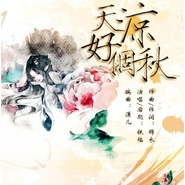

天凉好个秋
============================

|  |  |
| :--: | :-- |
| [ 天凉好个秋](https://emumo.xiami.com/album/1482697973) | **艺人**: [锦衣小盆友](../index.md) **语种**: 国语 **唱片公司**: 独立发行 **发行时间**: 2012年11月15日 **专辑类别**: EP, 单曲 **专辑风格**: 古风 GuFeng Music **播放数**: 47182 **收藏数**: 13 **评论数**: 1  |

## 简介

写给阿姐的歌。

## 曲目

## 评论

|  |  |  |  |
| :-- | :-- | :-- | :-- |
|  [虾米用户](https://emumo.xiami.com/u/53553991)  2015-12-20 10:59 赞(0) 踩(0) | 
好听，推荐搜索“刹那乐小组”的音乐，一首“妈妈包的饺子”真的很好听，主唱的声音真是难得，还有禅乐，和佛教音乐加民谣，真的很好。
 |
