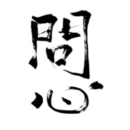

问心剑网3原创同人音乐专辑
============================

|  |  |
| :--: | :-- |
| [ 问心剑网3原创同人音乐专辑](https://emumo.xiami.com/album/2100203690) | **艺人**: [锦衣小盆友](../index.md) **语种**: 国语 **唱片公司**: 中国科学文化音像出版社 **发行时间**: 2015年07月11日 **专辑类别**: 录音室专辑 **专辑风格**: 新世纪音乐 New Age, 同人音乐 DouJin **播放数**: 379259 **收藏数**: 134 **评论数**: 7  |

## 简介

乱世江湖，何为道义？有人身负重伤，力救寡母幼儿，只称无名大侠。有人为破敌军，自刎献上头颅，一家忠烈都走的那么从容。有人为救苍生，遍尝奇花异草，毒发时一心念着给病人的药方。有人斩断吊桥，以身死挡叛军，仅留一句：吾恨不能以浩气之身战死……以上种种，皆为侠者。侠者必有一颗爱人之心、助人之心、为人之心，《问心》带每位侠士重温美好的剧情，回到最初的感动。 

## 曲目

## 评论

|  |  |  |
| :-- | :-- | :-- |
|  [虾米用户](https://emumo.xiami.com/u/427032408)  2019-07-09 11:02 赞(0) 踩(0) | 
声得我心
 |
|  [虾米用户](https://emumo.xiami.com/u/231239154) ❤ 2018-03-19 22:36 赞(0) 踩(0) | 
我是来收集文素的。
 |
|  [虾米用户](https://emumo.xiami.com/u/250948092)  2016-11-30 04:54 赞(0) 踩(0) | 
作曲磅礴大气，尤其是山间筑海一曲
 |
|  [虾米用户](https://emumo.xiami.com/u/105580736)  2016-03-13 19:26 赞(0) 踩(0) | 
超爱锦衣大大！
 |
|  [虾米用户](https://emumo.xiami.com/u/53536100)  2015-12-06 14:51 赞(0) 踩(0) | 
声音好温油 很好 你苏到我了
 |
|  [虾米用户](https://emumo.xiami.com/u/45880953)  2015-09-21 19:35 赞(0) 踩(0) | 
超级棒的砖（x 词真是会心一击 本来之前好遗憾没买上不过二售啦好开心
 |
| ⇒ |  [虾米用户](https://emumo.xiami.com/u/7081785) 生而为人，百年孤独。 2015-09-23 21:26 赞(0) 踩(0) | 
谢谢~~
 |
