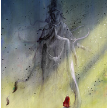

菩提即歇
============================

|  |  |
| :--: | :-- |
| [ 菩提即歇](https://emumo.xiami.com/album/2100292800) | **艺人**: [锦衣小盆友](../index.md) **语种**: 国语 **唱片公司**: 独立发行 **发行时间**: 2016年03月13日 **专辑类别**: EP, 单曲 **专辑风格**: 新世纪音乐 New Age **播放数**: 320498 **收藏数**: 32 **评论数**: 3  |

## 简介

个人歌曲

## 曲目

## 评论

|  |  |  |  |
| :-- | :-- | :-- | :-- |
|  [虾米用户](https://emumo.xiami.com/u/91164980) Mayday  2018-05-08 13:21 赞(0) 踩(0) | 
世间安得双全法，不负如来不负卿
 |
|  [虾米用户](https://emumo.xiami.com/u/122424402)  2016-03-22 12:39 赞(1) 踩(0) | 
赞
 |
|  [虾米用户](https://emumo.xiami.com/u/10438167) 虾米猜越来越不准了，江湖... 2016-03-15 13:05 赞(1) 踩(0) | 
沙发！！！藏语棒呆0.0
 |
