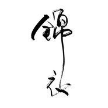
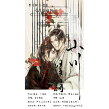
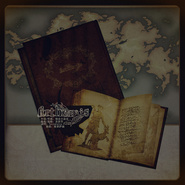
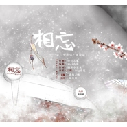
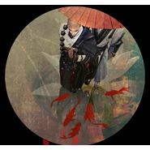
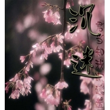

锦衣小盆友
============================

|  |  |
| :--: | :-- |
| [ 锦衣小盆友](https://i.xiami.com/flyfay52) | **地区**: China 中国大陆 **风格**: 新世纪音乐 New Age, 国语流行 Mandarin Pop, 古风 GuFeng Music **播放数**: 3380719 **粉丝数**: 1204 **评论数**: 45  |

## 档案

锦衣小盆友，音乐人，代表作《菩提即歇》、《新云种月》，2015年7月发行个人创作音乐专辑《问心》。 
曾获奖项： 
《剑网三·非鱼》获2013年“剑网3”同人歌曲大赛一等奖。 
《圣焰暝影》获2014年“剑网3”同人音乐大赛仙声奖第一名。 
《山间筑海》获2015年“剑网3”同人音乐大赛最佳剧情歌奖。 
《新云种月》获网易云音乐“第一届古风音乐年度赏”最佳歌曲。 
《千秋无让》获2016年“剑网3”7周年同人音乐大赛最佳门派原创歌。 
《不死城》获2016年“剑网3”7周年同人音乐大赛优秀奖。

## 专辑

| 名称 | 语种 | 唱片公司 | 发行时间 | 专辑类别 | 专辑风格 |
| :--: | :-- | :-- | :-- | :-- | :-- |
| [ 浮岛拼图](./albums/2102683739.md) | 国语 | 独立发行 | 2017年01月20日 | EP, 单曲 | 民谣 Folk |
| [ 倾国之战](./albums/2100373070.md) | 国语 | 独立发行 | 2016年07月27日 | EP, 单曲 | 中国风 China-Wave |
| [ 山川情诗](./albums/2100355285.md) | 国语 | 独立发行 | 2016年06月16日 | EP, 单曲 | 国语流行 Mandarin Pop |
| [ 菩提即歇](./albums/2100292800.md) | 国语 | 独立发行 | 2016年03月13日 | EP, 单曲 | 新世纪音乐 New Age |
| [ 问心剑网3原创同人音乐专辑](./albums/2100203690.md) | 国语 | 中国科学文化音像出版社 | 2015年07月11日 | 录音室专辑 | 新世纪音乐 New Age, 同人音乐 DouJin |
| [ 卿云花信](./albums/528067313.md) | 国语 | 独立发行 | 2015年04月03日 | EP, 单曲 | 古风 GuFeng Music |
| [ 山嵌月](./albums/1212223415.md) | 国语 | 独立发行 | 2014年10月02日 | EP, 单曲 | 中国风 China-Wave |
| [ 圣焰瞑影](./albums/705297047.md) | 国语 | 独立发行 | 2014年07月03日 | EP, 单曲 | 古风 GuFeng Music |
| [ 天敌](./albums/690839157.md) | 国语 | 独立发行 | 2014年01月27日 | EP, 单曲 | 国语流行 Mandarin Pop |
| [ Arthemis](./albums/1388544403.md) | 英语 | 独立发行 | 2013年12月31日 | EP, 单曲 | 歌剧 Opera |
| [ 相忘记《华胥引·宋凝篇》](./albums/182700133.md) | 国语 | 独立发行 | 2013年09月01日 | EP, 单曲 |  |
| [ 枯荣记大小乔](./albums/982455535.md) | 国语 | 独立发行 | 2013年07月17日 | EP, 单曲 |  |
| [ 剑网三·非鱼](./albums/1982455863.md) | 国语 | 独立发行 | 2013年07月13日 | EP, 单曲 | 中国风 China-Wave |
| [ 将进酒题子建](./albums/782699541.md) | 国语 | 独立发行 | 2013年04月24日 | EP, 单曲 |  |
| [ 天凉好个秋](./albums/1482697973.md) | 国语 | 独立发行 | 2012年11月15日 | EP, 单曲 | 古风 GuFeng Music |
| [ 残翼之蝶](./albums/582456282.md) | 国语 | 独立发行 | 2012年05月10日 | EP, 单曲 | 摇滚 Rock & Roll |
| [ 沉迷](./albums/282457234.md) | 国语 | 独立发行 | 2011年11月18日 | EP, 单曲 | 中国风 China-Wave |

## 评论

|  |  |  |
| :-- | :-- | :-- |
|  [虾米用户](https://emumo.xiami.com/u/415521330) 你一开口我就想笑 我一笑... 2019-08-21 08:39 赞(3) 踩(0) | 
锦衣真的好有才啊 卿衣云信听很久都不会腻。更令人震惊的是作词作曲都是锦衣一个人完成的 韵脚都全是a。爱了爱了❤️
 |
|  [虾米用户](https://emumo.xiami.com/u/299760025) 静默着 2019-02-23 09:51 赞(1) 踩(0) | 
喜欢你的词
 |
|  [虾米用户](https://emumo.xiami.com/u/336538499)  2018-06-15 20:13 赞(1) 踩(0) | 
一直都很喜欢你，特别是你的非鱼～循环循环
 |
|  [虾米用户](https://emumo.xiami.com/u/316502674) 在最后陪着你吧，我的虾米 2017-11-30 10:03 赞(4) 踩(0) | 
啊啊啊，居然找到了锦衣小姐姐，小姐姐写的词都很好啊 
 |
|  [虾米用户](https://emumo.xiami.com/u/69936842)  2017-08-17 22:11 赞(1) 踩(0) | 
小盆友，卿云花信是个小孩唱的吗 
 |
| ⇒ |  [虾米用户](https://emumo.xiami.com/u/7081785) 生而为人，百年孤独。 2017-08-19 20:54 赞(0) 踩(0) | 
并不是啊。。。
 |
|  [虾米用户](https://emumo.xiami.com/u/260176390)  2017-03-04 06:41 赞(2) 踩(0) | 
锦衣小盆友，音乐人，代表作《菩提即歇》、《新云种月》，2015年7月发行个人创作音乐专辑《问心》。
 |
|  [虾米用户](https://emumo.xiami.com/u/12802925) 君问归期，两年重逢 2017-02-16 11:34 赞(2) 踩(0) | 
送你一颗哈特❤️
 |
|  [虾米用户](https://emumo.xiami.com/u/1478999) 三行情书 2016-02-16 01:43 赞(1) 踩(0) | 
勾起了我的基三情怀    
 |
|  [虾米用户](https://emumo.xiami.com/u/13607554) 爱莫能助 2015-11-09 22:42 赞(1) 踩(0) | 
你好，请问非鱼的封面图一系列的还有吗 因为很喜欢，谢谢
 |
| ⇒ |  [虾米用户](https://emumo.xiami.com/u/7081785) 生而为人，百年孤独。 2015-12-13 17:33 赞(0) 踩(0) | 
只有MV咯~~
 |
|  [虾米用户](https://emumo.xiami.com/u/48289897) 独卧风云懒，笑看沧海变。 2015-05-09 20:32 赞(4) 踩(0) | 
有才啊啊，大大太有才啦！
 |
|  [虾米用户](https://emumo.xiami.com/u/17520744) 落英不忍拭素手 2014-12-27 12:57 赞(1) 踩(0) | 
为何头像是个秀姐。。
 |
| ⇒ |  [虾米用户](https://emumo.xiami.com/u/7081785) 生而为人，百年孤独。 2015-12-13 17:34 赞(0) 踩(0) | 
因为玩秀秀~~~
 |
| ⇒ |  [虾米用户](https://emumo.xiami.com/u/336538499)  2018-06-15 20:13 赞(0) 踩(0) | 
<q><b>锦衣小盆友说：</b></q>
 |
|  [虾米用户](https://emumo.xiami.com/u/32364428) 三月烟花千里梦，十年旧事... 2014-10-08 02:44 赞(0) 踩(0) | 
这样一看太对我胃口了都是循环过的◡ ヽ(`Д´)ﾉ ┻━┻ 身为一只才开始接触古风的小透明我表示能找到大大很高兴。
 |
|  [虾米用户](https://emumo.xiami.com/u/39376674)  2014-07-26 15:05 赞(0) 踩(0) | 
剑三的好听
 |
|  [虾米用户](https://emumo.xiami.com/u/9620713) 从来作春酒，未省不经年。 2014-07-01 21:21 赞(0) 踩(0) | 
能多传些TetraCalyx的歌吗..QAQ
 |
| ⇒ |  [虾米用户](https://emumo.xiami.com/u/7081785) 生而为人，百年孤独。 2014-10-02 12:33 赞(0) 踩(0) | 
去她主页听哇……我只和她合作了一首歌……
 |
|  [虾米用户](https://emumo.xiami.com/u/10438167) 虾米猜越来越不准了，江湖... 2014-07-01 20:07 赞(0) 踩(0) | 
新头像点赞！
 |
|  [虾米用户](https://emumo.xiami.com/u/2543482)  2014-04-14 21:28 赞(0) 踩(0) | 
赞一个
 |
|  [虾米用户](https://emumo.xiami.com/u/10438167) 虾米猜越来越不准了，江湖... 2014-03-23 06:51 赞(0) 踩(0) | 
话说上面的歌曲都是锦衣小盆友作词曲但是没有露过声音的吗？
 |
| ⇒ |  [虾米用户](https://emumo.xiami.com/u/7081785) 生而为人，百年孤独。 2014-03-23 22:37 赞(0) 踩(0) | 
嘿嘿 是的哟
 |
| ⇒ |  [虾米用户](https://emumo.xiami.com/u/10438167) 虾米猜越来越不准了，江湖... 2014-04-24 11:36 赞(0) 踩(0) | 
<q><b>锦衣小盆友说：</b></q>
 |
| ⇒ |  [虾米用户](https://emumo.xiami.com/u/7081785) 生而为人，百年孤独。 2014-04-24 12:52 赞(0) 踩(0) | 
<q><b>bubush说：</b></q>
 |
| ⇒ |  [虾米用户](https://emumo.xiami.com/u/10438167) 虾米猜越来越不准了，江湖... 2014-04-24 13:10 赞(0) 踩(0) | 
<q><b>锦衣小盆友说：</b></q>
 |
|  [虾米用户](https://emumo.xiami.com/u/13429052) 古 2014-03-07 16:56 赞(0) 踩(0) | 
话说，我一直都有声音好听的男人，都长得很帅的思维，爆照吧亲！！！
 |
| ⇒ |  [虾米用户](https://emumo.xiami.com/u/1477158) http://weibo... 2014-03-19 11:51 赞(0) 踩(0) | 
真相基本相反，你看看日本那些男CV，长得帅的很少
 |
| ⇒ |  [虾米用户](https://emumo.xiami.com/u/17520744) 落英不忍拭素手 2014-12-27 13:00 赞(0) 踩(0) | 
<q><b>musair说：</b></q>
 |
|  [虾米用户](https://emumo.xiami.com/u/9620713) 从来作春酒，未省不经年。 2014-02-07 15:41 赞(0) 踩(0) | 
TetraCalyx？？？
 |
| ⇒ |  [虾米用户](https://emumo.xiami.com/u/7081785) 生而为人，百年孤独。 2014-02-13 13:12 赞(0) 踩(0) | 
有一首歌是她唱的，Arthemis
 |
|  [虾米用户](https://emumo.xiami.com/u/3904996) 看着办吧... 2014-01-07 20:12 赞(0) 踩(0) | 
sorry  ， 他们没有这么一首歌！
 |
|  [虾米用户](https://emumo.xiami.com/u/3904996) 看着办吧... 2014-01-07 10:57 赞(0) 踩(0) | 
非主流洗剪吹网络游戏歌曲........
 |
| ⇒ |  [虾米用户](https://emumo.xiami.com/u/7081785) 生而为人，百年孤独。 2014-01-07 19:48 赞(0) 踩(0) | 
洗剪吹不是我的歌啊。。谢谢
 |
| ⇒ |  [虾米用户](https://emumo.xiami.com/u/3904996) 看着办吧... 2014-01-07 20:11 赞(0) 踩(0) | 
<q><b>锦衣小盆友说：</b></q>
 |
|  [虾米用户](https://emumo.xiami.com/u/1477158) http://weibo... 2014-01-06 20:34 赞(0) 踩(0) | 
不错m(￢0￢)m
 |
|  [虾米用户](https://emumo.xiami.com/u/572626) 不能让好的被埋没，也不能... 2013-11-20 18:13 赞(1) 踩(0) | 
不容易
 |
|  [虾米用户](https://emumo.xiami.com/u/240421) 静美而真。 2013-11-20 15:51 赞(0) 踩(0) | 
非鱼的歌词写得很好！
 |
|  [虾米用户](https://emumo.xiami.com/u/7081785) 生而为人，百年孤独。 2013-10-23 18:52 赞(23) 踩(0) | 
我刚入驻了虾米音乐人，欢迎大家来我的个人主页，收听我的最新音乐
 |
| ⇒ |  [虾米用户](https://emumo.xiami.com/u/2862717)   2013-11-19 18:24 赞(0) 踩(0) | 
加油~
 |
| ⇒ |  [虾米用户](https://emumo.xiami.com/u/10578282) 爱音乐，爱生活 2013-12-13 16:01 赞(0) 踩(0) | 
加油~有点厉害
 |
| ⇒ |  [虾米用户](https://emumo.xiami.com/u/368577) 我还没想好要写什么... 2014-11-10 20:08 赞(0) 踩(0) | 
哦好的
 |
| ⇒ |  [虾米用户](https://emumo.xiami.com/u/1293134) 人生如梦幻 2016-09-24 22:27 赞(0) 踩(0) | 
然而你就是君横颜？声音真好听。
 |
| ⇒ |  [虾米用户](https://emumo.xiami.com/u/276455875)  2017-04-17 16:05 赞(0) 踩(0) | 
我喜欢这个，比较喜欢古风有韵味，比较雅致的歌，词很不错
 |
