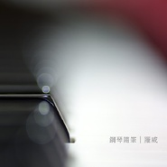

钢琴随笔·第一年更新于Podcast上的随笔作品集
============================

|  |  |
| :--: | :-- |
| [ 钢琴随笔·第一年更新于Podcast上的随笔作品集](https://emumo.xiami.com/album/1898070096) | **艺人**: [罗威](../index.md) **语种**: 其他 **唱片公司**: 独立发行 **发行时间**: 2014年11月30日 **专辑类别**: 录音室专辑 **专辑风格**: 器乐独奏 Solo Instrumental, 轻音乐 Easy Listening **播放数**: 1585888 **收藏数**: 736 **评论数**: 64  |

## 简介

这是一张我更新于PODCAST的钢琴随笔的精选，就这么不靠谱的从2013年的11月20日更新到现在。每一个音符都真实的记录了我的心情、看过的风景、脑海里的想象。
 

 
 

 
 

 
 

 
 

 

## 曲目

## 评论

|  |  |  |
| :-- | :-- | :-- |
|  [虾米用户](https://emumo.xiami.com/u/3583995) 一個人的戰爭 2020-09-05 16:48 赞(0) 踩(0) | 
.
 |
|  [虾米用户](https://emumo.xiami.com/u/261201107) 这位少女很轴。 2020-02-19 21:52 赞(1) 踩(0) | 
我喜欢的  安静系列
 |
|  [虾米用户](https://emumo.xiami.com/u/406081228)  2019-10-29 13:12 赞(0) 踩(0) | 
我也想买！
 |
|  [虾米用户](https://emumo.xiami.com/u/1171016) 人们活着.静如止水 2018-07-05 23:41 赞(0) 踩(0) | 
实体cd有吗？
 |
|  [虾米用户](https://emumo.xiami.com/u/330865402) 我荒废的心 会一直爱你 2018-02-16 13:54 赞(1) 踩(0) | 
让人心安 稍有治愈 喜欢
 |
|  [虾米用户](https://emumo.xiami.com/u/48566177)  2017-09-09 00:56 赞(1) 踩(0) | 
专辑不能按年购买，只能按月购买，有点麻烦，希望优化一下
 |
|  [虾米用户](https://emumo.xiami.com/u/220805608)   2016-10-15 22:41 赞(0) 踩(0) | 
听哭
 |
|  [虾米用户](https://emumo.xiami.com/u/12563919)  2016-10-10 17:54 赞(1) 踩(0) | 
如果以后能开一家咖啡店，一定要放你的音乐，因为每一首都很适合安静的沉思
 |
|  [虾米用户](https://emumo.xiami.com/u/68739014) melbourne，i ... 2016-04-12 16:57 赞(2) 踩(0) | 
每一首都会让心瞬间安静下来~特别是某一首听哭了~我也不知道为什么~
 |
|  [虾米用户](https://emumo.xiami.com/u/9283052)   2015-12-25 06:37 赞(0) 踩(0) | 
从播客上跑来搜你..居然真的有在.... 
 |
|  [虾米用户](https://emumo.xiami.com/u/40188083) 暂无签名~ 2015-11-21 12:35 赞(1) 踩(0) | 
有才华真好，可以随心所欲用自己的方式写成随笔。
 |
|  [虾米用户](https://emumo.xiami.com/u/355865) Let it go, l... 2015-10-13 21:52 赞(0) 踩(0) | 
看起来，这张的CD2与<a href="http://www.xiami.com/album/1204869505" target="_blank" rel="nofollow noreferrer noopener">http://www.xiami.com/album/1204869505</a> 这张是同样的内容。是吧？ 那请<a href="http://emumo.xiami.com/u/2871" target="_blank" rel="nofollow" name_card="2871">@虾小编</a> 合并一下吧，试听量不高的版本就删掉吧。<a href="http://emumo.xiami.com/u/5737411" target="_blank" rel="nofollow" name_card="5737411">@大莱</a> <a href="http://emumo.xiami.com/u/41190273" target="_blank" rel="nofollow" name_card="41190273">@爆棚的傲娇气</a>
 |
| ⇒ |  [虾米用户](https://emumo.xiami.com/u/41190273) 你！到底，怎么肥四啊？！ 2015-10-13 21:54 赞(0) 踩(0) | 
好的，已经删了哈
 |
| ⇒ |  [虾米用户](https://emumo.xiami.com/u/355865) Let it go, l... 2015-10-13 22:05 赞(0) 踩(0) | 
<q><b>爆棚的傲娇气说：</b></q>
 |
|  [虾米用户](https://emumo.xiami.com/u/3254944) 我还没想好要写什么... 2015-09-24 07:46 赞(0) 踩(0) | 
今天生日，去年生日也来听你的生日快乐了。喜欢你的作品❤️我会支持你
 |
|  [虾米用户](https://emumo.xiami.com/u/40464323) Seizeyourday 2015-09-22 12:59 赞(1) 踩(0) | 
以钢琴短曲记录生活点滴，是心情的日记，是诗一样的断章。
 |
| ⇒ |  [虾米用户](https://emumo.xiami.com/u/1125664)  2015-09-23 09:47 赞(0) 踩(0) | 
欢迎光临罗威回忆店
 |
|  [虾米用户](https://emumo.xiami.com/u/472261) 别跟我讲道理 2015-09-08 13:07 赞(0) 踩(0) | 
有故事，了不起的音乐人！
 |
|  [虾米用户](https://emumo.xiami.com/u/51612174)  2015-06-21 17:52 赞(0) 踩(0) | 
随意、轻松、自由、像心情日记，最喜欢“1月21日 很短的素描”
 |
|  [虾米用户](https://emumo.xiami.com/u/13079283)  2015-06-11 20:28 赞(0) 踩(0) | 
我是真的很喜欢。
 |
|  [虾米用户](https://emumo.xiami.com/u/13079283)  2015-06-11 20:13 赞(1) 踩(0) | 
这张专辑可以买到吗？
 |
| ⇒ |  [虾米用户](https://emumo.xiami.com/u/1125664)  2015-06-11 20:31 赞(0) 踩(0) | 
就快啦 今年以内。
 |
| ⇒ |  [虾米用户](https://emumo.xiami.com/u/13079283)  2015-07-08 17:08 赞(0) 踩(0) | 
<q><b>罗威说：</b></q>
 |
|  [虾米用户](https://emumo.xiami.com/u/35448128) 自由音乐人 2015-03-24 18:41 赞(0) 踩(0) | 
专辑介绍里写错字了哦，“没一个”，每一个
 |
| ⇒ |  [虾米用户](https://emumo.xiami.com/u/1125664)  2015-03-27 15:33 赞(0) 踩(0) | 
谢谢，我看看怎么订正哦
 |
|  [虾米用户](https://emumo.xiami.com/u/44688855) 这个家伙很聪明，什么都 2015-03-14 09:35 赞(0) 踩(0) | 
太棒辣~我应该把罗威叔推广到贴吧，让更多人听到如此琴声
 |
|  [虾米用户](https://emumo.xiami.com/u/11953523)  2015-03-08 09:53 赞(0) 踩(0) | 
谢谢你的钢琴随笔，它正陪伴我度过一段艰难的时光。你的音乐孤独而又温暖，对我有一种心灵上的治愈和洗礼。谢谢你的才能。
 |
| ⇒ |  [虾米用户](https://emumo.xiami.com/u/45627216)   2015-03-31 15:53 赞(0) 踩(0) | 
在纯吧听到，自己很喜欢这种风格。
 |
|  [虾米用户](https://emumo.xiami.com/u/6052083)  2015-02-28 14:28 赞(0) 踩(0) | 
ipod上收藏了他的电台，每天晚上听一集，很舒服。。。
 |
| ⇒ |  [虾米用户](https://emumo.xiami.com/u/1125664)  2015-02-28 15:23 赞(0) 踩(0) | 
谢谢你
 |
|  [虾米用户](https://emumo.xiami.com/u/44639681) 我爱音乐，我喜欢音乐，要... 2015-02-05 01:09 赞(1) 踩(0) | 
琴中的笔音
 |
| ⇒ |  [虾米用户](https://emumo.xiami.com/u/1125664)  2015-02-06 08:28 赞(0) 踩(0) | 
^_^
 |
|  [虾米用户](https://emumo.xiami.com/u/2492787)  2015-01-20 12:09 赞(0) 踩(0) | 
还不错，我花钱下载了，算是支持了，感觉很好！
 |
| ⇒ |  [虾米用户](https://emumo.xiami.com/u/1125664)  2015-02-06 08:28 赞(0) 踩(0) | 
谢谢哟～
 |
|  [虾米用户](https://emumo.xiami.com/u/17966098)  2015-01-14 14:41 赞(1) 踩(0) | 
据说是北京第一场雪，但是没看到一颗雪花，除了阴霾的天。放假了，办公楼里特别安静，正是我可以埋头加班的时候。找了几张背景音乐专辑，直到发现了这一组音乐，旋律正符合此刻的心情，一半孤单，一半喜悦。沏一杯茶，继续工作。。。。
 |
| ⇒ |  [虾米用户](https://emumo.xiami.com/u/1125664)  2015-01-17 12:14 赞(0) 踩(0) | 
谢谢你
 |
|  [虾米用户](https://emumo.xiami.com/u/9097623)  2015-01-09 11:33 赞(1) 踩(0) | 
下雨天，坐在窗边，捧一杯咖啡，安静听着~
 |
| ⇒ |  [虾米用户](https://emumo.xiami.com/u/1125664)  2015-02-06 08:28 赞(0) 踩(0) | 
下雨天，坐在窗边，捧一杯咖啡，安静弹着~
 |
|  [虾米用户](https://emumo.xiami.com/u/1034584)   2015-01-07 18:01 赞(1) 踩(0) | 
一種心情 一種音樂 盡在不言中
 |
| ⇒ |  [虾米用户](https://emumo.xiami.com/u/1125664)  2015-02-06 08:28 赞(0) 踩(0) | 
^_^
 |
|  [虾米用户](https://emumo.xiami.com/u/2308118)  2014-12-24 09:59 赞(0) 踩(0) | 
喜欢这种即兴，随笔！
 |
|  [虾米用户](https://emumo.xiami.com/u/2308118)  2014-12-24 09:58 赞(1) 踩(0) | 
曲作者的诗心，那种印象美的情绪有感染力！
 |
| ⇒ |  [虾米用户](https://emumo.xiami.com/u/1125664)  2015-02-06 08:29 赞(0) 踩(0) | 
谢谢
 |
|  [虾米用户](https://emumo.xiami.com/u/6248229)  2014-12-22 19:03 赞(0) 踩(0) | 
喜欢钢琴随笔
 |
| ⇒ |  [虾米用户](https://emumo.xiami.com/u/1125664)  2015-02-06 08:29 赞(0) 踩(0) | 
谢谢
 |
|  [虾米用户](https://emumo.xiami.com/u/22780831) 喜欢 2014-12-20 23:09 赞(0) 踩(0) | 
会想起好多事…回忆的美好…回不去的苦涩…自己的一点感觉…挺好…不敢…又忍不住去听…谢谢…有这样的旋律…
 |
|  [虾米用户](https://emumo.xiami.com/u/37071544)  2014-12-14 10:33 赞(0) 踩(0) | 
你这些曲子的谱子会出版吗？或者你的博客里会公开吗？
 |
| ⇒ |  [虾米用户](https://emumo.xiami.com/u/1125664)  2014-12-15 10:06 赞(0) 踩(0) | 
你好 这些创作都是即兴的 可能短期内不会有谱子了
 |
|  [虾米用户](https://emumo.xiami.com/u/40834896)   2014-12-11 23:31 赞(0) 踩(0) | 
把你推荐给小伙伴了呢！在旋律里听着花开花落一年四季，美妙难言。请继续坚持自己的梦想！
 |
| ⇒ |  [虾米用户](https://emumo.xiami.com/u/1125664)  2014-12-12 11:09 赞(0) 踩(0) | 
谢谢 会的
 |
|  [虾米用户](https://emumo.xiami.com/u/44657031)  2014-12-10 16:46 赞(0) 踩(0) | 
怒赞！
 |
| ⇒ |  [虾米用户](https://emumo.xiami.com/u/1125664)  2014-12-10 21:08 赞(0) 踩(0) | 
谢谢
 |
|  [虾米用户](https://emumo.xiami.com/u/3702212)  2014-12-05 19:51 赞(1) 踩(0) | 
冬天听到你整整一年的随笔，像又在四季溜达了一圈儿
 |
| ⇒ |  [虾米用户](https://emumo.xiami.com/u/1125664)  2014-12-06 10:13 赞(0) 踩(0) | 
记录了时光^_^
 |
|  [虾米用户](https://emumo.xiami.com/u/44381933)  2014-12-03 20:33 赞(0) 踩(0) | 
很好听，加油吧，继续创作
 |
| ⇒ |  [虾米用户](https://emumo.xiami.com/u/1125664)  2014-12-03 20:40 赞(0) 踩(0) | 
谢谢
 |
|  [虾米用户](https://emumo.xiami.com/u/9356769) running  2014-12-03 16:26 赞(0) 踩(0) | 
多想自己也可以能发一张啊
 |
| ⇒ |  [虾米用户](https://emumo.xiami.com/u/1125664)  2014-12-03 19:08 赞(0) 踩(0) | 
Try it!
 |
|  [虾米用户](https://emumo.xiami.com/u/9356769) running  2014-12-03 16:25 赞(0) 踩(0) | 
超级棒，很有意境，知道自己该干嘛
 |
|  [虾米用户](https://emumo.xiami.com/u/37766590) 把耳朵抛向远方 2014-11-03 17:24 赞(2) 踩(0) | 
说说这张吧，初聆听起来感觉像是一条舒卷的长河，可总觉得还是少了点什么？艺术家啊，不要太过于理性，冲动，对，这种原始的创造力是必须的。看好你了。
 |
| ⇒ |  [虾米用户](https://emumo.xiami.com/u/1125664)  2014-11-30 18:05 赞(0) 踩(0) | 
谢谢^_^
 |
|  [虾米用户](https://emumo.xiami.com/u/3394194)   2014-05-28 03:26 赞(0) 踩(0) | 
喜欢
 |
| ⇒ |  [虾米用户](https://emumo.xiami.com/u/1125664)  2014-05-28 13:20 赞(0) 踩(0) | 
谢谢^_^
 |
|  [虾米用户](https://emumo.xiami.com/u/8659226)  2014-04-21 17:04 赞(0) 踩(0) | 
坐个SF
 |
