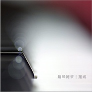

钢琴随笔·九月这是一本音乐日记
============================

|  |  |
| :--: | :-- |
| [ 钢琴随笔·九月这是一本音乐日记](https://emumo.xiami.com/album/2102403884) | **艺人**: [罗威](../index.md) **语种**: 其他 **唱片公司**:  **发行时间**: 2016年10月01日 **专辑类别**: 录音室专辑 **专辑风格**: 器乐独奏 Solo Instrumental, 轻音乐 Easy Listening **播放数**: 15254 **收藏数**: 14 **评论数**: 0  |

## 简介

从2013到2016，起初只是抱着治愈自己想法的我，却再也戒不掉在每一个重要的瞬间弹一个即兴随笔的习惯了。一直有人问我，为什么不在钢琴随笔里多尝试一些风格。我想，这个世界太容易给人惊喜，我就安静地做一个港湾吧。
 

 
 

 
 

 
 

 
 

 
 

 
 

 
 

 
 

 
 

 

## 曲目

## 评论

|  |  |  |  |
| :-- | :-- | :-- | :-- |
