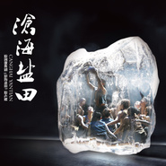

沧海盐田 歌舞剧原声大碟
============================

|  |  |
| :--: | :-- |
| [ 沧海盐田 歌舞剧原声大碟](https://emumo.xiami.com/album/2102741503) | **艺人**: [罗威](../index.md) **语种**: 国语 **唱片公司**: 星外星音乐 **发行时间**: 2017年07月04日 **专辑类别**: 原声带, 影视音乐 **专辑风格**: 歌舞剧 Cabaret **播放数**: 149215 **收藏数**: 36 **评论数**: 2  |

## 简介

上海金山漕泾镇曾经有那么一片海滩，盐田片片，一望无际......劳动的号子和大海的涛声，镜子般的盐田和白如雪花的盐堆，使这里成为“盐文化”在上海的代表地域。光阴荏苒，物转星移，为展示盐文化独有的韵味，向先民致敬，向传统敬礼，大型歌舞剧《沧海盐田》通过艺术表现手段，让今天的人们穿越时空了解制盐独特的工艺流程，感受当地的民风民俗，共享丰收的喜悦；同时，也一起去体会当年盐民生活的悲欢离合、生离死别，对大海、对大自然的敬畏，对美好生活的向往和不懈追求！ 

## 曲目

## 评论

|  |  |  |
| :-- | :-- | :-- |
|  [虾米用户](https://emumo.xiami.com/u/49954951) 你想去哪 2018-02-09 21:14 赞(0) 踩(0) | 
音乐也不错！
 |
|  [虾米用户](https://emumo.xiami.com/u/9717619)  2017-05-07 11:44 赞(0) 踩(0) | 
名字起的好
 |
