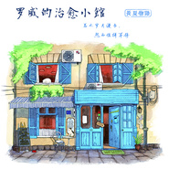

罗威的治愈小馆
============================

|  |  |
| :--: | :-- |
| [ 罗威的治愈小馆](https://emumo.xiami.com/album/2102813136) | **艺人**: [罗威](../index.md) **语种**: 纯音乐 **唱片公司**: 独立发行 **发行时间**: 2017年08月12日 **专辑类别**: 录音室专辑 **专辑风格**: 原声 Soundtrack, 新古典新世纪 Neoclassical New Age **播放数**: 2148 **收藏数**: 21 **评论数**: 7  |

## 简介

欢迎光临我的治愈小馆。开一间咖啡店或者私房菜，一直都是我的一个愿望。就像用音乐治愈心灵一样，我也想用美味的食物和好喝的咖啡，治愈你们的胃。现在，属于我们的小馆建好了，就先在这个虚构的小馆里写音乐让你们品尝吧。这是一个属于我们的乌托邦，在这里，菜单上的每一个选择，都是我的“亲手制作”。

## 曲目

## 评论

|  |  |  |  |
| :-- | :-- | :-- | :-- |
|  [虾米用户](https://emumo.xiami.com/u/5545367) Elite 2019-10-09 20:14 赞(0) 踩(0) | 
welcome to cafe
 |
|  [虾米用户](https://emumo.xiami.com/u/8990845)  Love is Bli... 2019-03-29 10:15 赞(0) 踩(0) | 
希望有一天你会开这样一家咖啡馆
 |
|  [虾米用户](https://emumo.xiami.com/u/3073842) 音乐最忠诚 2017-11-21 14:07 赞(0) 踩(0) | 
如果开了一家咖啡馆或者私菜馆，我想带着我的宾果来，可以吗？
 |
|  [虾米用户](https://emumo.xiami.com/u/115088062)  2017-08-30 15:41 赞(0) 踩(0) | 
邂逅的结尾似乎缺少什么
 |
|  [虾米用户](https://emumo.xiami.com/u/72693418) 我还没想好要写什么... 2017-08-15 15:27 赞(0) 踩(0) | 
加油
 |
|  [虾米用户](https://emumo.xiami.com/u/45912497) 嘻嘻嘻 2017-08-13 18:09 赞(0) 踩(0) | 
最喜欢你了
 |
|  [虾米用户](https://emumo.xiami.com/u/2827389) 求知若渴，虚心若愚 2017-08-13 08:57 赞(0) 踩(0) | 
你的粉丝来啦 
 |
