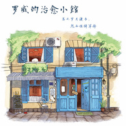

梅子茶泡饭
============================

|  |  |
| :--: | :-- |
| [ 梅子茶泡饭](https://emumo.xiami.com/album/2103499549) | **艺人**: [罗威](../index.md) **语种**: 其他 **唱片公司**: 独立发行 **发行时间**: 2018年01月24日 **专辑类别**: 录音室专辑 **专辑风格**: 原声 Soundtrack **播放数**: 1712 **收藏数**: 23 **评论数**: 4  |

## 简介

无论在任何时间段，要选出一样我最爱的主食，那一定是这碗梅子茶泡饭。  
只需热茶、米饭，撒上一些海苔丝、芝麻，当然不能忘记那颗梅子，如果觉得不够酸，建议再加一颗。  
深夜的治愈小馆里，梅子茶泡饭一定是绝对的主打。若不是为了暖心、暖胃，谁会在寒风中邂逅本小馆呢？  
请听听和这碗梅子茶泡饭的奇遇。

## 曲目

## 评论

|  |  |  |
| :-- | :-- | :-- |
|  [虾米用户](https://emumo.xiami.com/u/36229899) 违章动物 2018-01-29 19:06 赞(0) 踩(0) | 
-
 |
|  [虾米用户](https://emumo.xiami.com/u/47011209)   2018-01-24 21:22 赞(0) 踩(0) | 
祝我生日快乐！
 |
|  [虾米用户](https://emumo.xiami.com/u/8896125)   2018-01-24 16:52 赞(0) 踩(0) | 
妈妈最爱的食物
 |
|  [虾米用户](https://emumo.xiami.com/u/189701064) 用一个月来告别，用一生去... 2018-01-24 16:35 赞(0) 踩(0) | 
哇
 |
