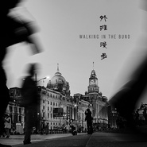

外滩漫步 (Walking In The Bund)
============================

|  |  |
| :--: | :-- |
| [ 外滩漫步 (Walking In The Bund)](https://emumo.xiami.com/album/2104173287) | **艺人**: [罗威](../index.md) **语种**: 纯音乐 **唱片公司**: 星外星音乐 **发行时间**: 2018年11月02日 **专辑类别**: 录音室专辑 **专辑风格**: 轻音乐 Easy Listening **播放数**: 42337 **收藏数**: 58 **评论数**: 4  |

## 简介

为外滩的光影而作，  
特别献给参与2018年上海黄浦江景观灯光建设的工作者。  
让我们一起在外滩漫步，感受时光的凝固，光影的流淌。  
  
  
作曲：罗威  
Composer: Wei Luo  
钢琴演奏：罗威  
Piano: Wei Luo  
大提琴演奏：刘千慈  
Cello: Qian-Ci Liu  
混音：许扬  
Mixing Engineer: Yang Xu  
交响乐团演奏：国际首席爱乐乐团  
Orchestra: International Concertmasters Phiharmonic Orchestra  
交响乐团监制：李朋  
Orchestra Manager: Peng Li  
录音：刘韧  
Recording Engineer: Ren Liu  
发行：上海星外星文化传播有限公司  
Distribution:Shanghai Starsing Culture Transmitted Ltd.,Co.  
 

## 曲目

## 评论

|  |  |  |
| :-- | :-- | :-- |
|  [虾米用户](https://emumo.xiami.com/u/356812146)  2020-10-02 23:19 赞(0) 踩(0) | 
聆听
 |
|  [虾米用户](https://emumo.xiami.com/u/213642973) 努力努力再努力 2019-02-08 08:03 赞(0) 踩(0) | 
！上海外滩！！总能在罗威的音乐中找到自己的足迹！
 |
|  [虾米用户](https://emumo.xiami.com/u/342154) 我自横刀向天笑 2018-11-02 17:46 赞(0) 踩(0) | 
罗威有一颗十分温柔的心
 |
|  [虾米用户](https://emumo.xiami.com/u/404613865)  2018-11-02 11:54 赞(0) 踩(0) | 
Very nice!  Amazing tune that represents the bund
 |
