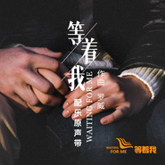

拨开人海·2018
============================

|  |  |
| :--: | :-- |
| [ 拨开人海·2018](https://emumo.xiami.com/album/2104436175) | **艺人**: [罗威](../index.md) **语种**: 纯音乐 **唱片公司**:  **发行时间**: 2018年12月31日 **专辑类别**: EP, 单曲 **专辑风格**: 电视原声 Television Music **播放数**: 2472 **收藏数**: 9 **评论数**: 6  |

## 简介

关于相遇的全部遐想，2018年重新录制了交响乐，并且加入了老搭档千慈的大提琴独奏。我想，这是100%的重逢了。在9012年要到来时，分享给你。

## 曲目

## 评论

|  |  |  |  |
| :-- | :-- | :-- | :-- |
|  [虾米用户](https://emumo.xiami.com/u/48566177)  2019-01-07 17:01 赞(0) 踩(0) | 
优秀，继续关注
 |
|  [虾米用户](https://emumo.xiami.com/u/10004536) 虾米！再见了！ 2019-01-01 15:19 赞(0) 踩(0) | 
nice
 |
|  [虾米用户](https://emumo.xiami.com/u/352167620)  2019-01-01 15:06 赞(0) 踩(0) | 
2019加油
 |
|  [虾米用户](https://emumo.xiami.com/u/11923597) 减、俭、简。 2019-01-01 06:37 赞(0) 踩(0) | 
总有一种力量和信念引领我们走向前方许是那你爱的人许是那你向往已久的地方许是那你孜孜以求的奋斗目标只要你坚守你坚持
 |
|  [虾米用户](https://emumo.xiami.com/u/1753416) 我还没想好要写什么... 2018-12-31 23:41 赞(0) 踩(0) | 
喜欢
 |
|  [虾米用户](https://emumo.xiami.com/u/25822738) 天空若岚~彩虹如雨 2018-12-31 17:45 赞(0) 踩(0) | 
这是一个音乐家与粉丝共同成长的故事，希望成熟的作品能被更广泛地认同。
 |
