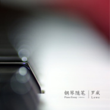

钢琴随笔·十一月（2019）
============================

|  |  |
| :--: | :-- |
| [ 钢琴随笔·十一月（2019）](https://emumo.xiami.com/album/2105536630) | **艺人**: [罗威](../index.md) **语种**: 纯音乐 **唱片公司**: 独立发行 **发行时间**: 2019年11月30日 **专辑类别**: 录音室专辑 **专辑风格**: 现代古典 Modern Classical, 古典音乐 Classical **播放数**: 5163 **收藏数**: 21 **评论数**: 7  |

## 简介

从2013年到2019年，起初只是抱着治愈自己想法的我，却再也戒不掉在每一个重要的瞬间都弹一首即兴随笔的习惯。我想，这个世界太容易给人惊喜，我就做一个安静的港湾吧。来自罗威的原创钢琴曲集。

## 曲目

## 评论

|  |  |  |
| :-- | :-- | :-- |
|  [虾米用户](https://emumo.xiami.com/u/5545367) Elite 2020-01-01 18:54 赞(0) 踩(0) | 
我对十一月的心情，仅此唯一的2019年的十一月。
 |
|  [虾米用户](https://emumo.xiami.com/u/193367067) 我还没想好要写什么... 2019-12-16 17:07 赞(0) 踩(0) | 
每次去一个地方路上都会反复听他的专辑。这次的也非常棒。
 |
|  [虾米用户](https://emumo.xiami.com/u/327830912) love jesus 2019-12-10 09:32 赞(0) 踩(0) | 
想想去年的这个时候就已经每个月在等着罗威的钢琴随笔了呢 
 |
|  [虾米用户](https://emumo.xiami.com/u/199988588) 情深不寿，慧极必伤。 2019-12-02 01:29 赞(0) 踩(0) | 
谢谢你，不止治愈了你自己，也治愈了我。
 |
|  [虾米用户](https://emumo.xiami.com/u/1510320) Be reborn 2019-12-01 00:51 赞(1) 踩(0) | 
明媚起来了，过去的就过去了，过去的也是美好的。
 |
| ⇒ |  [虾米用户](https://emumo.xiami.com/u/5133732) 萨度 萨度 萨度 2019-12-01 16:37 赞(0) 踩(0) | 
时间便如列车
 |
|  [虾米用户](https://emumo.xiami.com/u/31531934) 恋の道に近道はない 2019-11-30 21:05 赞(0) 踩(0) | 
get
 |
