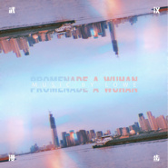

武汉漫步（剧场版）
============================

|  |  |
| :--: | :-- |
| [ 武汉漫步（剧场版）](https://emumo.xiami.com/album/5021337144) | **艺人**: [罗威](../index.md) **语种**: 纯音乐 **唱片公司**: 独立发行 **发行时间**: 2020年08月23日 **专辑类别**: 录音室专辑 **专辑风格**: 现代古典 Modern Classical, 新古典主义音乐 Neoclassicism Music **播放数**: 548 **收藏数**: 2 **评论数**: 2  |

## 简介

日落，一天里最温柔的时刻。  
在晚风里，一切都柔软了。  
汽笛变得悠远、城市在远离、人群也似突然静音。  
只剩下潮湿的风，如录音机走带般，忠实记录此刻的美好。  
而这些回忆，只有在夏季，才足够悠长去抓住。  
  
作曲：罗威／  
钢琴：罗威／  
大提琴：刘千慈／  
录音：刘韧@TTL／  
旁白：罗威／  
封面设计：金牧野／ 

## 曲目

## 评论

|  |  |  |
| :-- | :-- | :-- |
|  [虾米用户](https://emumo.xiami.com/u/423659688) 没有音乐，慢慢人生俨然无... 2020-08-28 14:24 赞(0) 踩(0) | 
跳荡的音符，恰好的弦乐参与，享受其中。。
 |
|  [虾米用户](https://emumo.xiami.com/u/300322261) 我还没想好要写什么... 2020-08-26 22:52 赞(0) 踩(0) | 
几个夜晚在这清脆声中度过，谢谢未曾谋面的你
 |
