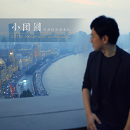

小团圆（外滩特别演奏版）Little Reunion on the bund
============================

|  |  |
| :--: | :-- |
| [ 小团圆（外滩特别演奏版）Little Reunion on the bund](https://emumo.xiami.com/album/5021540094) | **艺人**: [罗威](../index.md) **语种**: 纯音乐 **唱片公司**: 独立发行 **发行时间**: 2020年09月27日 **专辑类别**: EP, 单曲 **专辑风格**: 新古典主义音乐 Neoclassicism Music, 古风 GuFeng Music **播放数**: 832 **收藏数**: 2 **评论数**: 2  |

## 简介

选自《钢琴随笔》  
  
灵感诞生于2017年初，上海回广州的高铁上。路途中读完张爱玲的《小团圆》，想写一曲读后感。谁知，到家后，被温暖融化，关于上海的许多记忆也被唤醒。只是刚刚离别，却已思念。百般情愫，于是完整录下这曲，我的“上海-广州“双城记。  
  
作曲／演奏：罗威  
录音／混音：许扬  
声音设计：沈希辰  
封面：来自短片《小团圆》剧照，导演史天  
封面设计：金牧野 

## 曲目

## 评论

|  |  |  |
| :-- | :-- | :-- |
|  [虾米用户](https://emumo.xiami.com/u/300322261) 我还没想好要写什么... 2020-09-28 00:08 赞(0) 踩(0) | 
快中秋了，谢谢作者
 |
|  [虾米用户](https://emumo.xiami.com/u/25822738) 天空若岚~彩虹如雨 2020-09-27 18:22 赞(0) 踩(0) | 
熟悉的旋律……
 |
