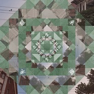
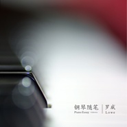
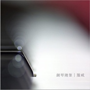
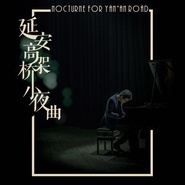
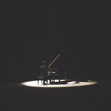
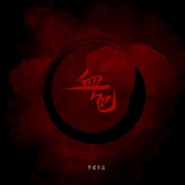
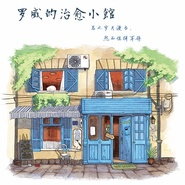

罗威
============================

|  |  |
| :--: | :-- |
| [ 罗威](https://i.xiami.com/lowe) | **播放数**: 5366118 **粉丝数**: 3094 **评论数**: 248 **地区**: China 中国大陆 **风格**: 电影原声 Film Score, 音乐剧 Musical theatre, 轻音乐 Easy Listening  |

## 档案

毕业于上海音乐学院 
青年作曲家、钢琴演奏家、音乐制作人 
2013年开始连载治愈系音乐日记“钢琴随笔”系列，在网络上的总收听超过2.5亿次，超过100万粉丝 
2017年起担任中央电视台CCTV1“等着我”栏目作曲、音乐总监 
2015-2017年为《英雄联盟》创作了MSI世界赛主题曲《Hero》、《且随疾风》、《破晓》

## 专辑

| 名称 | 语种 | 唱片公司 | 发行时间 | 专辑类别 | 专辑风格 |
| :--: | :-- | :-- | :-- | :-- | :-- |
| [ 钢琴随笔·十二月（2020）](./albums/5022308940.md) | 纯音乐 | 独立发行 | 2020年12月31日 | 录音室专辑 | 古典音乐 Classical, 新古典主义音乐 Neoclassicism Music |
| [ 钢琴随笔·十月（2020）](./albums/5021825193.md) | 纯音乐 | 独立发行 | 2020年11月01日 | 录音室专辑 | 现代古典 Modern Classical, 新古典主义音乐 Neoclassicism Music, 古典音乐 Classical |
| [ 钢琴随笔·九月（2020）](./albums/5021604489.md) | 纯音乐 | 独立发行 | 2020年10月03日 | 录音室专辑 | 古典音乐 Classical, 新古典主义音乐 Neoclassicism Music |
| [ 光耀东方](./albums/5021603934.md) | 纯音乐 | 独立发行 | 2020年10月03日 | EP, 单曲 | 电音流行 Electropop, 新世纪音乐 New Age |
| [ 小团圆（外滩特别演奏版）Little Reunion on the bund](./albums/5021540094.md) | 纯音乐 | 独立发行 | 2020年09月27日 | EP, 单曲 | 新古典主义音乐 Neoclassicism Music, 古风 GuFeng Music |
| [ 南昌路入睡，在科学会堂醒来](./albums/5021473715.md) | 纯音乐 | 独立发行 | 2020年09月19日 | EP, 单曲 | 自然新世纪 Nature New Age, 新古典主义音乐 Neoclassicism Music |
| [ 钢琴随笔·八月（2020）](./albums/5021386918.md) | 纯音乐 | 独立发行 | 2020年09月01日 | 录音室专辑 | 古典音乐 Classical, 新古典主义音乐 Neoclassicism Music |
| [ 武汉漫步（剧场版）](./albums/5021337144.md) | 纯音乐 | 独立发行 | 2020年08月23日 | 录音室专辑 | 现代古典 Modern Classical, 新古典主义音乐 Neoclassicism Music |
| [ 钢琴随笔·七月（2020）](./albums/5021203343.md) | 纯音乐 | 独立发行 | 2020年08月01日 | 录音室专辑 | 现代古典 Modern Classical, 古典音乐 Classical |
| [ 钢琴随笔·六月（2020）](./albums/5021010273.md) | 纯音乐 | 独立发行 | 2020年07月01日 | 录音室专辑 | 古典音乐 Classical, 现代古典 Modern Classical |
| [ 钢琴随笔·五月（2020）](./albums/5020796021.md) | 纯音乐 | 独立发行 | 2020年05月31日 | 录音室专辑 | 古典音乐 Classical, 现代古典 Modern Classical |
| [ Pray 用音乐对世界告白](./albums/5020662096.md) | 纯音乐 | 独立发行 | 2020年05月20日 | EP, 单曲 | 古典音乐 Classical, 现代古典 Modern Classical |
| [ 钢琴随笔·四月（2020）](./albums/2108398016.md) | 纯音乐 | 独立发行 | 2020年04月30日 | 录音室专辑 | 古典音乐 Classical, 现代古典 Modern Classical |
| [ 钢琴随笔·三月（2020）](./albums/2108287377.md) | 纯音乐 | 独立发行 | 2020年03月31日 | 录音室专辑 | 古典音乐 Classical, 现代古典 Modern Classical |
| [ 钢琴随笔·二月（2020）](./albums/2420319864.md) | 纯音乐 | 独立发行 | 2020年02月29日 | 录音室专辑 | 现代古典 Modern Classical, 古典音乐 Classical |
| [ 钢琴随笔·一月（2020）](./albums/2105805451.md) | 纯音乐 | 独立发行 | 2020年02月01日 | 录音室专辑 | 古典音乐 Classical, 现代古典 Modern Classical |
| [ 钢琴随笔·十二月（2019）](./albums/2105679512.md) | 纯音乐 | 独立发行 | 2019年12月31日 | 录音室专辑 | 古典音乐 Classical, 新世纪音乐 New Age |
| [ 钢琴随笔·十一月（2019）](./albums/2105536630.md) | 纯音乐 | 独立发行 | 2019年11月30日 | 录音室专辑 | 现代古典 Modern Classical, 古典音乐 Classical |
| [ 钢琴随笔·十月（2019）](./albums/2105395963.md) | 纯音乐 |  | 2019年11月01日 | 录音室专辑 |  |
| [ 钢琴随笔·九月（2019）这是一本音乐日记](./albums/2105300556.md) | 纯音乐 |  | 2019年09月28日 | 录音室专辑 | 古典音乐 Classical, 现代古典 Modern Classical |
| [ 钢琴随笔·八月（2019）](./albums/2105202470.md) | 纯音乐 |  | 2019年08月31日 | 录音室专辑 | 古典音乐 Classical |
| [ 钢琴随笔·七月（2019）](./albums/2105047647.md) | 纯音乐 |  | 2019年08月02日 | 录音室专辑 | 古典音乐 Classical |
| [ 梦想之约](./albums/2104998078.md) | 纯音乐 |  | 2019年07月15日 | EP, 单曲 | 原声 Soundtrack, 电子 Electronic |
| [ 钢琴随笔·六月（2019）](./albums/2104967833.md) | 纯音乐 |  | 2019年07月01日 | 录音室专辑 | 古典音乐 Classical |
| [ 钢琴随笔·五月（2019）](./albums/2104917815.md) | 纯音乐 |  | 2019年06月01日 | 录音室专辑 | 现代古典 Modern Classical |
| [ 延安高架桥小夜曲（演唱版）Nocturne for Yan'an Road](./albums/2104901489.md) | 国语 |  | 2019年05月26日 | EP, 单曲 | 现代古典 Modern Classical |
| [ 等着我·故乡随想](./albums/2104861927.md) | 纯音乐 | 星外星音乐 | 2019年05月16日 | EP, 单曲 | 轻音乐 Easy Listening |
| [ 等着我·寻找](./albums/2104837680.md) | 纯音乐 |  | 2019年05月03日 | 录音室专辑 | 原声 Soundtrack |
| [ 日落熔岩蛋糕](./albums/2104833524.md) | 纯音乐 |  | 2019年05月01日 | EP, 单曲 | 新迷幻 Neo-Psychedelia, 轻音乐 Easy Listening |
| [ 钢琴随笔·四月（2019）](./albums/2104831457.md) | 纯音乐 |  | 2019年04月30日 | 录音室专辑 | 轻音乐 Easy Listening |
| [ 等着我·开场·2019](./albums/2104814553.md) | 纯音乐 |  | 2019年04月26日 | 录音室专辑 | 原声 Soundtrack |
| [ 钢琴随笔·三月（2019）](./albums/2104730791.md) | 纯音乐 |  | 2019年04月01日 | 录音室专辑 | 现代古典 Modern Classical |
| [ 钢琴随笔·二月（2019）](./albums/2104640512.md) | 纯音乐 |  | 2019年02月28日 | 录音室专辑 | 轻音乐 Easy Listening |
| [ 钢琴随笔·一月（2019）](./albums/2104560339.md) | 纯音乐 |  | 2019年01月31日 | 录音室专辑 | 古典音乐 Classical |
| [ 钢琴随笔·十二月（2018）](./albums/2104433563.md) | 纯音乐 |  | 2018年12月31日 | 录音室专辑 | 放松新世纪 Relaxation New Age, 现代古典 Modern Classical |
| [ 拨开人海·2018](./albums/2104436175.md) | 纯音乐 |  | 2018年12月31日 | EP, 单曲 | 电视原声 Television Music |
| [ 即兴咖啡2号](./albums/2104406208.md) | 纯音乐 |  | 2018年12月23日 | EP, 单曲 | 爵士流行 Jazz Pop |
| [ 小镇奇遇](./albums/2104400454.md) | 纯音乐 |  | 2018年12月22日 | EP, 单曲 | 古风 GuFeng Music, 世界音乐 World Music |
| [ 延安高架桥小夜曲](./albums/2104321487.md) | 纯音乐 |  | 2018年12月04日 | EP, 单曲 | 原声 Soundtrack, 新世纪音乐 New Age |
| [ 钢琴随笔·十一月（2018）](./albums/2104303935.md) | 纯音乐 |  | 2018年11月30日 | 录音室专辑 | 新世纪音乐 New Age |
| [ 外滩漫步 (Walking In The Bund)](./albums/2104173287.md) | 纯音乐 | 星外星音乐 | 2018年11月02日 | 录音室专辑 | 轻音乐 Easy Listening |
| [ 钢琴随笔·十月（2018）](./albums/2104164792.md) | 其他 |  | 2018年10月31日 | 录音室专辑 | 现代古典 Modern Classical |
| [ 钢琴随笔·九月（2018）](./albums/2104068528.md) | 其他 | 独立发行 | 2018年09月30日 | 录音室专辑 | 古典音乐 Classical |
| [ 血色 芭蕾舞剧](./albums/2104035741.md) | 其他 | 独立发行 | 2018年09月17日 | 原声带, 影视音乐 | 原声 Soundtrack |
| [ 钢琴随笔·八月（2018）](./albums/2103952897.md) | 其他 | 独立发行 | 2018年08月31日 | 录音室专辑 | 新古典新世纪 Neoclassical New Age |
| [ 钢琴随笔·七月（2018）这是一本音乐日记](./albums/2103880840.md) | 其他 | 独立发行 | 2018年07月31日 | 录音室专辑 | 新古典新世纪 Neoclassical New Age |
| [ 等着我 配乐原声带](./albums/2103798324.md) | 国语 | 星外星音乐 | 2018年07月15日 | 原声带, 影视音乐 | 原声 Soundtrack |
| [ 《等着我》宣传曲央视综合频道公益寻人栏目《等着我》配乐原声](./albums/2103797409.md) | 其他 | 独立发行 | 2018年07月12日 | EP, 单曲 | 原声 Soundtrack |
| [ 杨枝甘露小馆的第三道菜](./albums/2103773610.md) | 其他 | 独立发行 | 2018年07月02日 | 录音室专辑 | 新世纪音乐 New Age, 氛围音乐 Ambient |
| [ 钢琴随笔·六月（2018）这是一本音乐日记](./albums/2103771291.md) | 其他 | 独立发行 | 2018年06月30日 | 录音室专辑 | 新古典新世纪 Neoclassical New Age |
| [ 钢琴随笔·五月（2018）这是一本音乐日记](./albums/2103726459.md) | 其他 | 独立发行 | 2018年06月01日 | 录音室专辑 | 新古典新世纪 Neoclassical New Age |
| [ 钢琴随笔·四月（2018）这是一本音乐日记](./albums/2103726409.md) | 其他 | 独立发行 | 2018年05月01日 | 录音室专辑 | 新古典新世纪 Neoclassical New Age |
| [ 钢琴随笔·三月（2018）这是一本音乐日记](./albums/2103657301.md) | 其他 | 独立发行 | 2018年03月31日 | 录音室专辑 | 新古典新世纪 Neoclassical New Age |
| [ 钢琴随笔·二月（2018）这是一本音乐日记](./albums/2103571371.md) | 其他 | 独立发行 | 2018年02月28日 | 录音室专辑 | 器乐独奏 Solo Instrumental |
| [ 外滩老码头的漫步](./albums/2103527414.md) | 其他 | 独立发行 | 2018年02月12日 | 录音室专辑 | 原声 Soundtrack |
| [ 钢琴随笔·一月（2018）这是一本音乐日记](./albums/2103511259.md) | 其他 | 独立发行 | 2018年01月31日 | 录音室专辑 | 器乐独奏 Solo Instrumental, 轻音乐 Easy Listening |
| [ 梅子茶泡饭](./albums/2103499549.md) | 其他 | 独立发行 | 2018年01月24日 | 录音室专辑 | 原声 Soundtrack |
| [ 钢琴随笔·十二月（2017）这是一本音乐日记](./albums/2103465644.md) | 其他 | 独立发行 | 2017年12月31日 | 录音室专辑 | 器乐独奏 Solo Instrumental, 轻音乐 Easy Listening |
| [ 钢琴随笔·十一月（2017）这是一本音乐日记](./albums/2102964272.md) | 其他 | 独立发行 | 2017年11月30日 | 录音室专辑 | 器乐独奏 Solo Instrumental, 轻音乐 Easy Listening |
| [ 重庆家书 配乐原声](./albums/2102944147.md) | 其他 | 独立发行 | 2017年11月19日 | 原声带, 影视音乐 | 原声 Soundtrack |
| [ 钢琴随笔·十月（2017）这是一本音乐日记](./albums/2102900380.md) | 其他 | 独立发行 | 2017年10月31日 | 录音室专辑 | 器乐独奏 Solo Instrumental, 轻音乐 Easy Listening |
| [ 钢琴随笔·九月（2017）这是一本音乐日记](./albums/2102866803.md) | 其他 | 独立发行 | 2017年09月30日 | 录音室专辑 | 器乐独奏 Solo Instrumental, 轻音乐 Easy Listening |
| [ HERO 2017英雄联盟“LPL出征季中邀请赛”单曲，2017纪念版。](./albums/2102858494.md) | 国语 | 独立发行 | 2017年09月17日 | EP, 单曲 | 摇滚 Rock & Roll, 国语流行 Mandarin Pop |
| [ 钢琴随笔·八月（2017）这是一本音乐日记](./albums/2102849252.md) | 其他 | 独立发行 | 2017年08月31日 | 录音室专辑 | 器乐独奏 Solo Instrumental, 轻音乐 Easy Listening |
| [ 罗威的治愈小馆](./albums/2102813136.md) | 纯音乐 | 独立发行 | 2017年08月12日 | 录音室专辑 | 原声 Soundtrack, 新古典新世纪 Neoclassical New Age |
| [ 钢琴随笔·七月（2017）这是一本音乐日记](./albums/2102806175.md) | 其他 | 独立发行 | 2017年07月31日 | 录音室专辑 | 器乐独奏 Solo Instrumental, 轻音乐 Easy Listening |
| [ 绍兴路上的提琴家](./albums/2102741491.md) | 纯音乐 | 星外星音乐 | 2017年07月04日 | 录音室专辑 | 轻音乐 Easy Listening |
| [ 沧海盐田 歌舞剧原声大碟](./albums/2102741503.md) | 国语 | 星外星音乐 | 2017年07月04日 | 原声带, 影视音乐 | 歌舞剧 Cabaret |
| [ 阮玲玉 多媒体舞台剧原声带](./albums/2102741486.md) | 国语 | 星外星音乐 | 2017年07月04日 | 原声带, 影视音乐 | 原声 Soundtrack |
| [ 钢琴随笔·六月（2017）这是一本音乐日记](./albums/2102775233.md) | 其他 | 独立发行 | 2017年06月30日 | 录音室专辑 | 器乐独奏 Solo Instrumental, 轻音乐 Easy Listening |
| [ 钢琴随笔·五月（2017）这是一本音乐日记](./albums/2102756399.md) | 其他 | 独立发行 | 2017年05月30日 | 录音室专辑 | 器乐独奏 Solo Instrumental, 轻音乐 Easy Listening |
| [ 破晓英雄联盟2017MSI季中邀请赛主题曲](./albums/2102743182.md) | 国语 | 独立发行 | 2017年05月05日 | EP, 单曲 | 流行 Pop |
| [ 钢琴随笔·四月（2017）这是一本音乐日记](./albums/2102740089.md) | 其他 | 独立发行 | 2017年04月28日 | 录音室专辑 | 器乐独奏 Solo Instrumental, 轻音乐 Easy Listening |
| [ 钢琴随笔·三月（2017）这是一本音乐日记](./albums/2102725465.md) | 其他 | 独立发行 | 2017年03月31日 | 录音室专辑 | 器乐独奏 Solo Instrumental, 轻音乐 Easy Listening |
| [ 钢琴随笔·二月（2017）这是一本音乐日记](./albums/2102701484.md) | 其他 | 独立发行 | 2017年03月01日 | 录音室专辑 | 器乐独奏 Solo Instrumental, 轻音乐 Easy Listening |
| [ 钢琴随笔·一月（2017）这是一本音乐日记](./albums/2102686162.md) | 其他 | 独立发行 | 2017年01月27日 | 录音室专辑 |  |
| [ 钢琴随笔·十二月（2016）这是一本音乐日记](./albums/2102674570.md) | 其他 | 独立发行 | 2016年12月31日 | 录音室专辑 |  |
| [ 钢琴随笔·十一月这是一本音乐日记](./albums/2102658253.md) | 其他 | 独立发行 | 2016年11月30日 | 录音室专辑 | 器乐独奏 Solo Instrumental, 轻音乐 Easy Listening |
| [ 贝加尔的湖心](./albums/2102656929.md) | 其他 | 独立发行 | 2016年11月28日 | 原声带, 影视音乐 |  |
| [ Material Orchestral](./albums/2102653090.md) | 其他 | 独立发行 | 2016年11月15日 | 录音室专辑 |  |
| [ 钢琴随笔·十月这是一本音乐日记](./albums/2102641778.md) | 其他 |  | 2016年10月31日 | 录音室专辑 | 器乐独奏 Solo Instrumental, 轻音乐 Easy Listening |
| [ 钢琴随笔·九月这是一本音乐日记](./albums/2102403884.md) | 其他 |  | 2016年10月01日 | 录音室专辑 | 器乐独奏 Solo Instrumental, 轻音乐 Easy Listening |
| [ 钢琴随笔·八月这是一本音乐日记](./albums/2100385547.md) | 其他 | 独立发行 | 2016年08月31日 | 录音室专辑 | 器乐独奏 Solo Instrumental, 轻音乐 Easy Listening |
| [ 钢琴随笔·七月这是一本音乐日记](./albums/2100374587.md) | 其他 | 独立发行 | 2016年07月31日 | 录音室专辑 | 器乐独奏 Solo Instrumental, 轻音乐 Easy Listening |
| [ 钢琴随笔·六月这是一本音乐日记](./albums/2100361469.md) | 其他 | 独立发行 | 2016年07月01日 | 录音室专辑 | 器乐独奏 Solo Instrumental, 轻音乐 Easy Listening |
| [ 钢琴随笔·五月这是一本音乐日记](./albums/2100348989.md) | 其他 |  | 2016年06月01日 | 录音室专辑 |  |
| [ 钢琴随笔·四月这是一本音乐日记](./albums/2100326458.md) | 其他 | 独立发行 | 2016年05月01日 | 录音室专辑 |  |
| [ 且随疾风](./albums/2100325062.md) | 国语 | 独立发行 | 2016年04月29日 | EP, 单曲 | 流行摇滚 Pop Rock |
| [ 钢琴随笔·三月这是一本音乐日记](./albums/2100305408.md) | 其他 | 独立发行 | 2016年03月31日 | 录音室专辑 |  |
| [ 钢琴随笔·二月这是一本音乐日记](./albums/2100284326.md) | 其他 | 独立发行 | 2016年02月29日 | 录音室专辑 |  |
| [ 钢琴随笔·一月这是一本音乐日记](./albums/2100271394.md) | 其他 | 独立发行 | 2016年01月31日 | 录音室专辑 |  |
| [ 钢琴随笔·十二月这是一本音乐日记](./albums/2100253796.md) | 其他 | 独立发行 | 2015年12月31日 | 录音室专辑 | 器乐独奏 Solo Instrumental, 轻音乐 Easy Listening |
| [ 钢琴随笔·十一月这是一本音乐日记](./albums/2100243304.md) | 其他 | 独立发行 | 2015年12月02日 | 录音室专辑 | 器乐独奏 Solo Instrumental, 轻音乐 Easy Listening |
| [ 候鸟](./albums/2100240290.md) | 国语 | 独立发行 | 2015年11月22日 | EP, 单曲 | 国语流行 Mandarin Pop |
| [ 一一《爱情旅馆》原声](./albums/2100235662.md) | 国语 | Lowe Music | 2015年11月11日 | 原声带, 影视音乐 | 原声 Soundtrack, 电影原声 Film Score, 国语流行 Mandarin Pop |
| [ 钢琴随笔·第二年这是一本音乐日记](./albums/2100217224.md) | 其他 | 独立发行 | 2015年10月12日 | 录音室专辑 |  |
| [ 深宅雪电视剧《深宅雪》原声](./albums/2100216754.md) | 国语 | 独立发行 | 2015年10月11日 | 录音室专辑 | 国语流行 Mandarin Pop |
| [ HERO英雄联盟“LPL出征季中邀请赛MV”单曲](./albums/1830823479.md) | 国语 | 独立发行 | 2015年05月05日 | EP, 单曲 | 摇滚 Rock & Roll, 国语流行 Mandarin Pop |
| [ 钢琴随笔·第一年更新于Podcast上的随笔作品集](./albums/1898070096.md) | 其他 | 独立发行 | 2014年11月30日 | 录音室专辑 | 器乐独奏 Solo Instrumental, 轻音乐 Easy Listening |
| [ 吸血鬼德古拉音乐剧《吸血鬼德古拉》中文版](./albums/15869281.md) | 国语 | 独立发行 | 2014年11月13日 | 录音室专辑 | 音乐剧 Musical theatre, 哥特摇滚 Gothic Rock |
| [ 琴谣Ⅱ](./albums/545991.md) | 其他 | 风林文化 | 2012年09月01日 | 录音室专辑 |  |
| [ 琴谣](./albums/545990.md) | 其他 | 风林文化 | 2012年05月12日 | 录音室专辑 |  |
| [ 钢琴随笔·十一月（2020）](./albums/5022056462.md) | 纯音乐 | 独立发行 | 不详 | 录音室专辑 | 古典音乐 Classical, 新古典主义音乐 Neoclassicism Music |

## 评论

|  |  |  |  |
| :-- | :-- | :-- | :-- |
|  [虾米用户](https://emumo.xiami.com/u/423088205)  2020-12-15 03:30 赞(0) 踩(0) | 
随笔停更了吗&amp;hellip; 
 |
|  [虾米用户](https://emumo.xiami.com/u/2050162) 彼岸 2020-12-12 21:55 赞(0) 踩(0) | 
每隔一段时间就会想起点进页面看看钢琴日记有没有新增一页
 |
|  [虾米用户](https://emumo.xiami.com/u/434770048) 虾小米，虾小米再见… 2020-08-07 22:41 赞(0) 踩(0) | 
罗老师，演奏会安排一下
 |
|  [虾米用户](https://emumo.xiami.com/u/8098168) 天上寂静 2020-07-29 13:27 赞(0) 踩(0) | 
难得
 |
|  [虾米用户](https://emumo.xiami.com/u/408067818) 这次不是我 2020-06-18 23:12 赞(0) 踩(0) | 

 |
|  [虾米用户](https://emumo.xiami.com/u/14674276) 一只两只三四只，听一听二... 2020-04-17 01:48 赞(0) 踩(0) | 
最近都是听的钢琴曲入眠，太好听了 
 |
|  [虾米用户](https://emumo.xiami.com/u/437258928) 我与蓝山咖啡结婚，禁止加... 2020-02-06 19:15 赞(0) 踩(0) | 
，  
 |
|  [虾米用户](https://emumo.xiami.com/u/433648768) 最慷慨善意的结果。 2020-02-03 19:25 赞(0) 踩(0) | 
我爱你
 |
|  [虾米用户](https://emumo.xiami.com/u/273735417)  2019-11-30 06:46 赞(0) 踩(0) | 
一直在感觉，如诗如画，为了重逢那不可重复的一瞬。
 |
|  [虾米用户](https://emumo.xiami.com/u/75560364) 谦和，自省，成为更好的自... 2019-11-09 10:43 赞(0) 踩(0) | 
很动听
 |
|  [虾米用户](https://emumo.xiami.com/u/325205625)  2019-10-31 21:30 赞(0) 踩(0) | 
很喜欢
 |
|  [虾米用户](https://emumo.xiami.com/u/2195529)  2019-08-26 12:03 赞(1) 踩(0) | 
艺术家就能用艺术的手段来记录生活我就只能用文字来记录
 |
|  [虾米用户](https://emumo.xiami.com/u/273735417)  2019-08-24 12:03 赞(1) 踩(0) | 
即兴的音乐如诗，打开了自己的感觉和记忆往事。
 |
|  [虾米用户](https://emumo.xiami.com/u/199988588) 情深不寿，慧极必伤。 2019-08-20 00:28 赞(1) 踩(0) | 
谢谢你，让我的心能有静下来的时刻。
 |
|  [虾米用户](https://emumo.xiami.com/u/13029796) 一心二用 2019-07-11 07:14 赞(2) 踩(0) | 
谢谢你
 |
|  [虾米用户](https://emumo.xiami.com/u/327432688)   2019-06-04 14:36 赞(1) 踩(0) | 
我怎么这么喜欢你
 |
|  [虾米用户](https://emumo.xiami.com/u/299874502) 你们来尝尝主恩，就知道耶... 2019-05-03 21:14 赞(2) 踩(0) | 
认识罗威的音乐就是从无意间打开的“钢琴随笔”开始的~~
 |
|  [虾米用户](https://emumo.xiami.com/u/407712889)  2019-03-30 13:10 赞(1) 踩(0) | 
好听好听，送你耳机可以不  
 |
|  [虾米用户](https://emumo.xiami.com/u/8541382) 我还没想好要写什么... 2019-03-25 21:55 赞(2) 踩(0) | 
如果可以举办20来人的小现场该多幸福
 |
|  [虾米用户](https://emumo.xiami.com/u/276944698) 不要自我设限..... 2019-03-11 01:11 赞(2) 踩(0) | 
。
 |
|  [虾米用户](https://emumo.xiami.com/u/201391232) 最快的方法是先抱抱 2019-03-03 19:47 赞(0) 踩(0) | 
彡
 |
|  [虾米用户](https://emumo.xiami.com/u/22829137) 再见 我的七年 所有内容... 2019-02-23 10:54 赞(0) 踩(0) | 
从14年在喜马拉雅听到你的钢琴随笔 就一直关注着你 特别有才华的演奏者
 |
|  [虾米用户](https://emumo.xiami.com/u/39353) 一个人一座岛 2018-12-31 18:47 赞(0) 踩(0) | 
今年才开始听钢琴日记，陪着我度过了很多美妙，也可能孤独的时刻，感谢
 |
|  [虾米用户](https://emumo.xiami.com/u/1753416) 我还没想好要写什么... 2018-12-25 23:29 赞(1) 踩(0) | 
好像看到了阳光在斑驳的墙面流淌
 |
|  [虾米用户](https://emumo.xiami.com/u/5133732) 萨度 萨度 萨度 2018-09-01 00:12 赞(1) 踩(0) | 
真是勤奋，钢琴散文家哈哈。
 |
|  [虾米用户](https://emumo.xiami.com/u/335082285)  2018-07-19 00:22 赞(0) 踩(0) | 
一直在关注你。喜欢你的音乐
 |
|  [虾米用户](https://emumo.xiami.com/u/25822738) 天空若岚~彩虹如雨 2018-06-30 21:46 赞(0) 踩(0) | 
我在网易可以免费下载你的作品～      知道你与我一样，喜欢喝咖啡～来杭州一定要@@我，请你喝咖啡。
 |
|  [虾米用户](https://emumo.xiami.com/u/12899728) Good Luck 2018-05-11 23:55 赞(12) 踩(0) | 
当钢琴键化作笔尖，将乐曲变成日记簿。点开名字只有日期和地点的曲子，像是无意间拾起别人散落一地的随笔和日记，窥见了别人的内心，他看过的风景，他每天经历的琐事。我在偷听一个人的日记，听到了别人的故事和情绪，也听到了自己的内心。也许，乐符间的留白更多。
 |
|  [虾米用户](https://emumo.xiami.com/u/8792031)  2018-05-09 20:13 赞(4) 踩(0) | 
很是期待四月的钢琴随笔，习惯了每个月月底总是如期而至，还没看到四月的更新，有点失落之余还有点担忧，希望能继续履行不成文的约定，你继续创作，我们继续欣赏  
 |
|  [虾米用户](https://emumo.xiami.com/u/8896125)   2018-05-08 17:28 赞(1) 踩(0) | 
5月8日了还没见到《四月》，还以为我把日子过糊涂了。
 |
|  [虾米用户](https://emumo.xiami.com/u/2174863) 无想 2018-04-25 15:46 赞(0) 踩(0) | 
好听的太多了！！回家一个专辑一个专辑的听！！！
 |
|  [虾米用户](https://emumo.xiami.com/u/2174863) 无想 2018-04-25 15:43 赞(0) 踩(0) | 
好听！！！！！
 |
|  [虾米用户](https://emumo.xiami.com/u/189701064) 用一个月来告别，用一生去... 2018-03-28 13:19 赞(2) 踩(0) | 
生日快乐，祝你，祝我♡
 |
| ⇒ |  [虾米用户](https://emumo.xiami.com/u/189701064) 用一个月来告别，用一生去... 2019-03-28 11:32 赞(0) 踩(0) | 
今年也要快乐呀( ´͈ ⌵ `͈ )σண♡
 |
|  [虾米用户](https://emumo.xiami.com/u/246098495) 我还没想好要写什么... 2018-03-13 01:24 赞(0) 踩(0) | 
很想听你的钢琴演奏音乐会❤️
 |
|  [虾米用户](https://emumo.xiami.com/u/3279255) 暂无签名~ 2018-03-13 00:31 赞(0) 踩(0) | 
为何一直没有313
 |
|  [虾米用户](https://emumo.xiami.com/u/1804639) 搞得了艺术 当得了流氓 2018-03-10 16:42 赞(1) 踩(0) | 
成为你的第1296颗❤
 |
|  [虾米用户](https://emumo.xiami.com/u/188351171) 我还没想好要写什么... 2018-03-04 15:19 赞(0) 踩(0) | 
感觉很高级，能体会到有灵魂在钢琴里游动。
 |
|  [虾米用户](https://emumo.xiami.com/u/1673856) survive for ... 2018-03-01 10:16 赞(11) 踩(0) | 
认知心理学上有一种现象，是说有些人可以通过非常规的感官感知世界。比如，也许大多数人听到音律的时候只能产生听觉，有一小部分人却能在听到音律的时候产生视觉，嗅觉，甚至触觉。很可惜我不属于这神奇人群中的一员，但是我却能感受到你想在随笔里诉说的情绪。听罗威每个月的随笔已经从习惯变成了期盼，真的谢谢你愿意每个月讲故事给我们听，我连每周坚持用文字写随笔都觉得吃力，所以你的坚持记录很不容易。我或许不是个合格的听众，但你是个很棒的音乐作家。：)
 |
| ⇒ |  [虾米用户](https://emumo.xiami.com/u/95269814) 植物在生长，小鸟在飞翔，... 2020-03-18 18:56 赞(0) 踩(0) | 
你说的是心理学里面的心理过程里面的认知过程里面的感觉里面的联觉吧！每个人或多或少都有联觉的能力吧！我是杠精，日常一杠！给钢琴随笔点赞 
 |
|  [虾米用户](https://emumo.xiami.com/u/8140895) 口罩帽衫怪人，Gay 2018-01-15 21:41 赞(0) 踩(0) | 
哈哈哈，网易云最佳听众 虾米也来威哥这里躺躺
 |
|  [虾米用户](https://emumo.xiami.com/u/252355678) Neil Stalnak... 2018-01-06 20:36 赞(0) 踩(0) | 
会有音乐会吗
 |
| ⇒ |  [虾米用户](https://emumo.xiami.com/u/1125664)  2018-01-15 20:38 赞(0) 踩(0) | 
会^_^
 |
| ⇒ |  [虾米用户](https://emumo.xiami.com/u/4196941) I'm going my... 2018-02-04 18:14 赞(0) 踩(0) | 
<q><b>罗威说：</b></q>
 |
|  [虾米用户](https://emumo.xiami.com/u/20217955) . 2017-12-23 16:54 赞(0) 踩(0) | 
二零一八年也会一直在噢
 |
|  [虾米用户](https://emumo.xiami.com/u/9597157) ， 2017-12-01 00:21 赞(2) 踩(0) | 
&amp;alpha;的，鲸鱼马戏团的，  李闰珉的，还有您的曲 感谢您们的作品
 |
|  [虾米用户](https://emumo.xiami.com/u/12706878) 当森林陷入寂静，森林便开... 2017-11-18 07:41 赞(0) 踩(0) | 
何时有音乐会 想去
 |
|  [虾米用户](https://emumo.xiami.com/u/38998935)   2017-11-02 21:22 赞(16) 踩(0) | 
可以用音乐学随笔真的很浪漫了
 |
|  [虾米用户](https://emumo.xiami.com/u/215723) 我还没想好要写什么... 2017-10-30 22:15 赞(3) 踩(0) | 
多么温柔的男生才能创作出这样的曲子啊
 |
|  [虾米用户](https://emumo.xiami.com/u/189701064) 用一个月来告别，用一生去... 2017-10-17 21:50 赞(1) 踩(0) | 
真的真的特别喜欢   
 |
|  [虾米用户](https://emumo.xiami.com/u/12876004) ` 2017-10-14 15:07 赞(0) 踩(0) | 
。
 |
|  [虾米用户](https://emumo.xiami.com/u/586206)  2017-10-08 23:12 赞(1) 踩(0) | 
韩国有李闰珉  上海有罗威
 |
|  [虾米用户](https://emumo.xiami.com/u/328250233)  2017-10-08 20:36 赞(1) 踩(0) | 
适合独处时听，也适合哄娃入睡。有沉淀感的音乐。
 |
|  [虾米用户](https://emumo.xiami.com/u/142169512) 点击编辑 2017-10-01 20:54 赞(1) 踩(0) | 
真好
 |
|  [虾米用户](https://emumo.xiami.com/u/6521562) 个人旅行公众号：小欣纪行 2017-09-24 13:55 赞(1) 踩(0) | 
钢琴诗人
 |
|  [虾米用户](https://emumo.xiami.com/u/132916480)  2017-09-18 09:58 赞(0) 踩(0) | 
Hero的作曲，突然发现他的钢琴曲真的超级好听
 |
|  [虾米用户](https://emumo.xiami.com/u/48566177)  2017-09-09 01:01 赞(0) 踩(0) | 
第一年和第二年专辑为什么没有购买选项呢？想批量买，按月买麻烦呀
 |
|  [虾米用户](https://emumo.xiami.com/u/48566177)  2017-09-09 00:48 赞(0) 踩(0) | 
非常优秀
 |
|  [虾米用户](https://emumo.xiami.com/u/586206)  2017-09-02 19:25 赞(0) 踩(0) | 
不错哟！ 
 |
|  [虾米用户](https://emumo.xiami.com/u/277700007)  2017-08-18 18:59 赞(0) 踩(0) | 
手机里只有你的钢琴随笔
 |
|  [虾米用户](https://emumo.xiami.com/u/45912497) 嘻嘻嘻 2017-08-17 21:54 赞(0) 踩(0) | 
无意间点进来  从此就把你收藏在这里
 |
|  [虾米用户](https://emumo.xiami.com/u/314303434)  2017-07-23 09:59 赞(0) 踩(0) | 
每次听都觉得满溢烂漫，希望，静谧。
 |
|  [虾米用户](https://emumo.xiami.com/u/42983675)  2017-07-11 00:05 赞(1) 踩(0) | 
随笔超赞
 |
|  [虾米用户](https://emumo.xiami.com/u/25798597) My own... mu... 2017-05-31 14:20 赞(1) 踩(0) | 
从喜马拉雅追到虾米，就对罗威的钢琴曲专一 
 |
|  [虾米用户](https://emumo.xiami.com/u/12375897)  2017-05-25 01:45 赞(0) 踩(0) | 
如果说诗人的气质是忧郁，那么罗威就具备了诗人气质。
 |
|  [虾米用户](https://emumo.xiami.com/u/97125558)   2017-05-07 21:28 赞(0) 踩(0) | 
喜欢hero 超级喜欢，你真是太棒了 
 |
|  [虾米用户](https://emumo.xiami.com/u/16024728) 我还没想好要写什么... 2017-04-29 09:18 赞(0) 踩(0) | 
高产如
 |
|  [虾米用户](https://emumo.xiami.com/u/2838459)   2017-04-24 16:21 赞(0) 踩(0) | 
钢琴随笔真的好，陪伴感超强
 |
| ⇒ |  [虾米用户](https://emumo.xiami.com/u/636462)  2017-04-25 17:04 赞(0) 踩(0) | 
虾米遇到熟人不易 
 |
| ⇒ |  [虾米用户](https://emumo.xiami.com/u/2838459)   2017-05-27 02:58 赞(0) 踩(0) | 
<q><b>杜振麟说：</b></q>
 |
|  [虾米用户](https://emumo.xiami.com/u/178854116)  来去-轧车- 2017-04-15 17:34 赞(0) 踩(0) | 
让我想起，河口湖了。
 |
|  [虾米用户](https://emumo.xiami.com/u/2198253)   2017-04-05 16:14 赞(0) 踩(0) | 
好听
 |
|  [虾米用户](https://emumo.xiami.com/u/4829579) 纯音皆为万世解. 2017-01-29 23:14 赞(0) 踩(0) | 
很美，有故事的旋律，温暖如你。
 |
|  [虾米用户](https://emumo.xiami.com/u/9003931) 千淘万漉虽辛苦 2017-01-27 11:08 赞(1) 踩(0) | 
我觉得音乐人的风格那里应该加上古典。
 |
|  [虾米用户](https://emumo.xiami.com/u/262270925)  2017-01-16 08:03 赞(0) 踩(0) | 
最初是你的重复三度音程触动了我，后来听了许多，有个人风格，大量的创造还能走心，实属不易，为你的才华和勤奋点赞！正单曲循环贝加尔的湖心……
 |
|  [虾米用户](https://emumo.xiami.com/u/262270925)  2017-01-16 07:49 赞(0) 踩(0) | 
有才且多产 是每天就做这一件事吗  
 |
|  [虾米用户](https://emumo.xiami.com/u/9003931) 千淘万漉虽辛苦 2017-01-15 22:07 赞(0) 踩(0) | 
值得关注的独立音乐人，期待更多器乐演奏。
 |
|  [虾米用户](https://emumo.xiami.com/u/70786838) 你还有一些年轻人的不快乐 2017-01-08 19:52 赞(0) 踩(0) | 
有生之年，能夠聽一次你的音樂會就好了。
 |
|  [虾米用户](https://emumo.xiami.com/u/220779787) 无事发生 2016-12-14 00:09 赞(0) 踩(0) | 
很清晰，安静的曲风，秒变小迷妹
 |
|  [虾米用户](https://emumo.xiami.com/u/61333226)  2016-11-23 10:28 赞(0) 踩(0) | 
沧海爱人，好美  
 |
| ⇒ |  [虾米用户](https://emumo.xiami.com/u/1125664)  2016-11-27 11:59 赞(0) 踩(0) | 
谢谢
 |
|  [虾米用户](https://emumo.xiami.com/u/43156519)  2016-11-17 23:37 赞(0) 踩(0) | 
纯音乐
 |
|  [虾米用户](https://emumo.xiami.com/u/11456045) harihari 2016-11-05 15:38 赞(0) 踩(0) | 
請問哪裡買的到鋼琴譜~~~?
 |
| ⇒ |  [虾米用户](https://emumo.xiami.com/u/1125664)  2016-11-07 17:33 赞(0) 踩(0) | 
明年会出版哟
 |
|  [虾米用户](https://emumo.xiami.com/u/58707700) 我还没想好要写什么... 2016-11-02 22:45 赞(0) 踩(0) | 
同样是在podcast听到的 有南京的记忆 很暖
 |
| ⇒ |  [虾米用户](https://emumo.xiami.com/u/1125664)  2016-11-07 17:33 赞(0) 踩(0) | 
可惜那首 《窗外是海》成为绝版了。
 |
|  [虾米用户](https://emumo.xiami.com/u/73615546)   2016-10-22 03:09 赞(0) 踩(0) | 
白天弹一天的琴  夜晚  听你的歌曲睡觉也算和谐
 |
|  [虾米用户](https://emumo.xiami.com/u/88142952)   2016-10-12 13:08 赞(0) 踩(0) | 
在podcast上听到就觉得 写着写曲子的人一定是个 很有趣的人
 |
|  [虾米用户](https://emumo.xiami.com/u/206161736)  2016-09-29 11:35 赞(0) 踩(0) | 
加油
 |
|  [虾米用户](https://emumo.xiami.com/u/12563919)  2016-08-23 19:46 赞(0) 踩(0) | 
用音乐记录点滴，真的是太棒了，听的时候我加了一张纯雨声的专辑两者好搭啊
 |
|  [虾米用户](https://emumo.xiami.com/u/205759416)  2016-07-27 15:33 赞(0) 踩(0) | 
好老师。。
 |
|  [虾米用户](https://emumo.xiami.com/u/49228483)  2016-06-20 10:42 赞(0) 踩(0) | 
内容已删除
 |
| ⇒ |  [虾米用户](https://emumo.xiami.com/u/1125664)  2016-07-31 15:48 赞(0) 踩(0) | 
谢谢 ^_^
 |
|  [虾米用户](https://emumo.xiami.com/u/11440461)  2016-06-19 21:24 赞(1) 踩(0) | 
很喜欢你的音乐，每晚都要听着入睡，难过的时候也会听，很安静，很治愈，很温暖。每次听的时候都在想那个弹琴的男孩是不是也像曲子一样温暖，一样有魅力呢？很喜欢你。。。。
 |
| ⇒ |  [虾米用户](https://emumo.xiami.com/u/1125664)  2016-07-31 15:50 赞(0) 踩(0) | 
谢谢^_^ 音乐只是记录我的生活 放大心中的美好 ，现实中应该没那么特别吧
 |
|  [虾米用户](https://emumo.xiami.com/u/11634428) 你呀你是南方北上的云，我... 2016-04-28 17:43 赞(0) 踩(0) | 
随笔一词好
 |
|  [虾米用户](https://emumo.xiami.com/u/144619680)  2016-04-18 18:56 赞(0) 踩(0) | 
原创纯音乐，难得的好品质
 |
| ⇒ |  [虾米用户](https://emumo.xiami.com/u/1125664)  2016-04-20 08:30 赞(0) 踩(0) | 
谢谢
 |
|  [虾米用户](https://emumo.xiami.com/u/68739014) melbourne，i ... 2016-04-12 16:27 赞(0) 踩(0) | 
每次听都会觉得心安静下来~
 |
| ⇒ |  [虾米用户](https://emumo.xiami.com/u/1125664)  2016-04-20 08:30 赞(0) 踩(0) | 
^_^
 |
|  [虾米用户](https://emumo.xiami.com/u/9368619) 无所思，无所绪。 2016-04-06 11:26 赞(0) 踩(0) | 
我会说完全是奔着随笔的感觉来的？ 。突然想到作为一个普通本科的音乐学专业，完全不知道以后有哪些路可以走，教师可能是没选择的选择。想做自由音乐人，可是音乐人又是什么呢？
 |
| ⇒ |  [虾米用户](https://emumo.xiami.com/u/1125664)  2016-04-20 08:30 赞(0) 踩(0) | 
哪有什么绝对的自由，其实无论以什么方式和音乐发生联系都不会影响你创作的，加油
 |
|  [虾米用户](https://emumo.xiami.com/u/87959790)  2016-04-05 09:11 赞(0) 踩(0) | 
初三四的同學 
 |
| ⇒ |  [虾米用户](https://emumo.xiami.com/u/1125664)  2016-04-20 08:29 赞(0) 踩(0) | 
哈哈哈哈哈
 |
|  [虾米用户](https://emumo.xiami.com/u/124727448)  2016-03-21 13:15 赞(0) 踩(0) | 
从哪里可以下载到 《3月9日，十五》那首曲子啊？
 |
| ⇒ |  [虾米用户](https://emumo.xiami.com/u/1125664)  2016-03-24 21:04 赞(0) 踩(0) | 
等4月就会在这里更新啦
 |
|  [虾米用户](https://emumo.xiami.com/u/114154420)  2016-02-25 04:01 赞(0) 踩(0) | 
好巧，我也叫罗威
 |
| ⇒ |  [虾米用户](https://emumo.xiami.com/u/1125664)  2016-04-05 08:43 赞(0) 踩(0) | 
hello
 |
|  [虾米用户](https://emumo.xiami.com/u/15286877)  2016-02-17 13:08 赞(0) 踩(0) | 
播客转虾米，乐思很有趣，还有特别偏好的织体。似乎听了许多就渐渐找到了规律，一听就知道是你。支持你，同龄人。
 |
| ⇒ |  [虾米用户](https://emumo.xiami.com/u/1125664)  2016-04-05 08:43 赞(0) 踩(0) | 
虾米的音质会比较好一点，这里以后也会更新我的商业配乐作品^_^
 |
|  [虾米用户](https://emumo.xiami.com/u/87959790)  2016-02-01 09:56 赞(0) 踩(0) | 
没想到..有惊喜..
 |
| ⇒ |  [虾米用户](https://emumo.xiami.com/u/1125664)  2016-04-05 08:44 赞(0) 踩(0) | 
什么惊喜？？
 |
| ⇒ |  [虾米用户](https://emumo.xiami.com/u/87959790)  2016-04-05 09:09 赞(0) 踩(0) | 
<q><b>罗威说：</b></q>
 |
|  [虾米用户](https://emumo.xiami.com/u/9335746)   2016-01-29 10:31 赞(0) 踩(0) | 
治愈
 |
|  [虾米用户](https://emumo.xiami.com/u/36098412)  2016-01-29 00:27 赞(0) 踩(0) | 
冬夜的雨天在听你的钢琴随笔，外头是淅淅沥沥的雨声，屋内是优美，温柔的钢琴声，这时候配上一杯红酒该是多么浪漫的事情，闭上眼睛跟你的音乐漫游能想起好多事情。
 |
| ⇒ |  [虾米用户](https://emumo.xiami.com/u/1125664)  2016-04-20 08:31 赞(0) 踩(0) | 
恰巧上海这个季节才开始下雨
 |
|  [虾米用户](https://emumo.xiami.com/u/98394530)  2016-01-08 12:53 赞(0) 踩(0) | 
lol hero
 |
|  [虾米用户](https://emumo.xiami.com/u/2085554)   2016-01-01 03:05 赞(1) 踩(0) | 
元旦前一天分享了你的12.31 应景儿
 |
|  [虾米用户](https://emumo.xiami.com/u/95206618)  2015-12-28 01:55 赞(1) 踩(0) | 
无意中在另一个app中听到你的钢琴随笔，寻到这儿。听着让人很放松，睡前必备。
 |
|  [虾米用户](https://emumo.xiami.com/u/8265984)  2015-12-12 00:04 赞(1) 踩(0) | 
从每当盛夏时开始关注你 知道你是即兴创作后更欣赏 我从你的音乐里能感受到你的平和，善良，以及敏感。谢谢你的音乐，伴随我好多个失眠夜和回忆泛滥的时刻，中国的莫扎特！
 |
|  [虾米用户](https://emumo.xiami.com/u/89621492)  2015-12-08 01:21 赞(0) 踩(0) | 
哪里能买到你的专辑呢？？？好想要无损格式的啊
 |
|  [虾米用户](https://emumo.xiami.com/u/102945)  2015-12-04 23:52 赞(0) 踩(0) | 
偷偷问一句哦，你是广东人吗？
 |
| ⇒ |  [虾米用户](https://emumo.xiami.com/u/1125664)  2015-12-06 09:13 赞(0) 踩(0) | 
gz
 |
|  [虾米用户](https://emumo.xiami.com/u/102945)  2015-12-04 23:50 赞(0) 踩(0) | 
哇，听了一年多你的播客，竟然才在虾米上找到你，感觉这一年里你的曲子越来越好了，继续加油。也谢谢你带给我们这些好作品！
 |
|  [虾米用户](https://emumo.xiami.com/u/8048705)   2015-12-01 13:45 赞(0) 踩(0) | 
有你的琴声好入眠，关注罗威的第一天
 |
|  [虾米用户](https://emumo.xiami.com/u/11536480) 谁慷慨小声的为我祝福 2015-12-01 12:59 赞(0) 踩(0) | 
已经成了每晚睡前必备，安静的温暖
 |
|  [虾米用户](https://emumo.xiami.com/u/13567674)  2015-11-23 12:11 赞(0) 踩(0) | 
每个周末听你的podcast已经成为日常
 |
| ⇒ |  [虾米用户](https://emumo.xiami.com/u/1125664)  2015-11-28 11:26 赞(0) 踩(0) | 
谢谢  
 |
|  [虾米用户](https://emumo.xiami.com/u/8025693)  2015-11-18 13:35 赞(0) 踩(0) | 
不错 非常棒的音乐 有内涵 有思想
 |
| ⇒ |  [虾米用户](https://emumo.xiami.com/u/1125664)  2015-11-18 13:51 赞(0) 踩(0) | 
谢谢你
 |
| ⇒ |  [虾米用户](https://emumo.xiami.com/u/94335810)  2015-12-25 08:29 赞(0) 踩(0) | 
<q><b>罗威说：</b></q>
 |
| ⇒ |  [虾米用户](https://emumo.xiami.com/u/1125664)  2015-12-25 12:24 赞(0) 踩(0) | 
<q><b>三页窗说：</b></q>
 |
|  [虾米用户](https://emumo.xiami.com/u/73566544)  2015-11-16 17:39 赞(1) 踩(0) | 
一位哲人在音符中翩舞、沉思，宁静如水，皎洁如月，当我们企图拨开喧嚣的云雾去窥视他的世界，他只是轻敲琴键便消于梦中。
 |
| ⇒ |  [虾米用户](https://emumo.xiami.com/u/1125664)  2015-11-17 10:06 赞(0) 踩(0) | 
无需窥探...我的音乐也许只是镜子
 |
|  [虾米用户](https://emumo.xiami.com/u/204775)  2015-11-15 16:15 赞(0) 踩(0) | 
很是好听，喜欢
 |
| ⇒ |  [虾米用户](https://emumo.xiami.com/u/1125664)  2015-11-17 10:06 赞(0) 踩(0) | 
谢谢你
 |
|  [虾米用户](https://emumo.xiami.com/u/49931694)   2015-11-05 17:51 赞(0) 踩(0) | 
很美～意外的收获～
 |
| ⇒ |  [虾米用户](https://emumo.xiami.com/u/1125664)  2015-11-14 08:57 赞(0) 踩(0) | 
谢谢
 |
|  [虾米用户](https://emumo.xiami.com/u/47970323)  2015-11-02 21:49 赞(1) 踩(0) | 
唱歌很好听为什么你却这么少唱歌？
 |
| ⇒ |  [虾米用户](https://emumo.xiami.com/u/1125664)  2015-11-03 15:47 赞(0) 踩(0) | 
喜欢写歌 不喜欢唱^_^
 |
|  [虾米用户](https://emumo.xiami.com/u/32015175) 一杯茶，一首歌，一轮月 2015-10-14 18:47 赞(0) 踩(0) | 
虾米中发现宝藏~谢谢你的歌～
 |
| ⇒ |  [虾米用户](https://emumo.xiami.com/u/1125664)  2015-10-14 22:03 赞(0) 踩(0) | 
谢谢 
 |
|  [虾米用户](https://emumo.xiami.com/u/10613713) 路过时光 2015-10-07 04:05 赞(1) 踩(0) | 
轻浅如流雾，可以一边听一边发呆，漫无边际的想东西，很有带入感的音乐，喜欢！有专辑吗？
 |
| ⇒ |  [虾米用户](https://emumo.xiami.com/u/1125664)  2015-10-10 08:56 赞(0) 踩(0) | 
很快哟
 |
|  [虾米用户](https://emumo.xiami.com/u/1249406) 。 2015-09-18 10:18 赞(0) 踩(0) | 
最新作品只能在播客上听到嘛?
 |
| ⇒ |  [虾米用户](https://emumo.xiami.com/u/1125664)  2015-10-10 08:56 赞(0) 踩(0) | 
这几天更新第二年啦
 |
|  [虾米用户](https://emumo.xiami.com/u/50394498) 我还没想好要写什么... 2015-09-12 13:06 赞(20) 踩(0) | 
很喜欢你的钢琴随笔 
 |
| ⇒ |  [虾米用户](https://emumo.xiami.com/u/1125664)  2015-09-13 11:29 赞(0) 踩(0) | 
谢谢你
 |
|  [虾米用户](https://emumo.xiami.com/u/45856156) 深呼吸我 2015-09-03 18:27 赞(0) 踩(0) | 
你 在 这 里 啊
 |
| ⇒ |  [虾米用户](https://emumo.xiami.com/u/1125664)  2015-10-11 12:14 赞(0) 踩(0) | 
对呀，一直用这个听歌
 |
|  [虾米用户](https://emumo.xiami.com/u/54375019)  2015-08-03 14:38 赞(0) 踩(0) | 
我来了 
 |
|  [虾米用户](https://emumo.xiami.com/u/45627216)   2015-07-15 23:18 赞(0) 踩(0) | 
希望还有钢琴随笔。
 |
| ⇒ |  [虾米用户](https://emumo.xiami.com/u/1125664)  2015-07-23 16:43 赞(0) 踩(0) | 
从来没有停止啊。只是都在别的平台。去podcast搜索一下
 |
| ⇒ |  [虾米用户](https://emumo.xiami.com/u/45627216)   2015-07-23 22:28 赞(0) 踩(0) | 
<q><b>罗威说：</b></q>
 |
|  [虾米用户](https://emumo.xiami.com/u/45627216)   2015-06-15 22:44 赞(0) 踩(0) | 
你可以去听听鲸鱼马戏团的曲子。
 |
| ⇒ |  [虾米用户](https://emumo.xiami.com/u/1125664)  2015-06-16 06:48 赞(0) 踩(0) | 
嗯 谢谢推荐
 |
|  [虾米用户](https://emumo.xiami.com/u/13079283)  2015-06-11 20:12 赞(0) 踩(0) | 
心灵音乐。
 |
|  [虾米用户](https://emumo.xiami.com/u/1175203) 我还没想好要写什么... 2015-06-10 23:35 赞(0) 踩(0) | 
从播客里面听了很久，很喜欢，很开心在虾米找到你。请加油，期待新作品。
 |
|  [虾米用户](https://emumo.xiami.com/u/41370890)   2015-06-07 22:20 赞(0) 踩(0) | 
喜欢你等你出专辑一定要去买！
 |
|  [虾米用户](https://emumo.xiami.com/u/49978523)   2015-05-12 14:58 赞(0) 踩(0) | 

 |
|  [虾米用户](https://emumo.xiami.com/u/49999340)  2015-05-11 22:59 赞(0) 踩(0) | 
egd万岁，看完后激动得哭了
 |
|  [虾米用户](https://emumo.xiami.com/u/49994466)  2015-05-11 20:17 赞(0) 踩(0) | 
hero伴奏曲
 |
|  [虾米用户](https://emumo.xiami.com/u/49994466)  2015-05-11 20:16 赞(1) 踩(0) | 
hero伴奏曲，哪里下载？
 |
|  [虾米用户](https://emumo.xiami.com/u/49880458)  2015-05-07 12:17 赞(0) 踩(0) | 
超好听，听多少遍也不会腻的。萌态的声音真的萌化了 
 |
|  [虾米用户](https://emumo.xiami.com/u/49852052)  2015-05-06 05:54 赞(0) 踩(0) | 
唱的很好萌态的也好超喜欢 
 |
|  [虾米用户](https://emumo.xiami.com/u/2595021)  2015-04-29 10:04 赞(0) 踩(0) | 
在精选集里听到了 便找了过来 非常喜欢这种安安静静的感觉 ！！
 |
| ⇒ |  [虾米用户](https://emumo.xiami.com/u/1125664)  2015-05-02 12:40 赞(0) 踩(0) | 
谢谢喜爱
 |
|  [虾米用户](https://emumo.xiami.com/u/29236529) 厨房家族 2015-04-09 11:06 赞(0) 踩(0) | 
在我的第一张精选集“孤独的织梦人”中，选了您的两首曲目，谢谢！
 |
| ⇒ |  [虾米用户](https://emumo.xiami.com/u/1125664)  2015-04-09 14:47 赞(0) 踩(0) | 
谢谢你哟
 |
|  [虾米用户](https://emumo.xiami.com/u/7148029) 学吉他中... 2015-03-31 22:57 赞(0) 踩(0) | 
从纯音乐吧的推荐寻来，喜欢楼主平淡，温柔的钢琴的弹奏。
 |
| ⇒ |  [虾米用户](https://emumo.xiami.com/u/1125664)  2015-04-01 11:47 赞(0) 踩(0) | 
谢谢你
 |
|  [虾米用户](https://emumo.xiami.com/u/43791779) 如果生命没有了音乐… 2015-03-29 23:13 赞(0) 踩(0) | 
听着睡觉…舒服的感觉
 |
|  [虾米用户](https://emumo.xiami.com/u/43791779) 如果生命没有了音乐… 2015-03-28 23:44 赞(0) 踩(0) | 
从podcast上寻来的，动听。
 |
|  [虾米用户](https://emumo.xiami.com/u/3682733)   2015-03-15 22:56 赞(0) 踩(0) | 
之前在播客上听 后来寻到虾米这儿 特别喜欢你的钢琴随笔❤️
 |
| ⇒ |  [虾米用户](https://emumo.xiami.com/u/1125664)  2015-03-18 14:01 赞(0) 踩(0) | 
谢谢
 |
|  [虾米用户](https://emumo.xiami.com/u/37308299)   2015-03-14 23:25 赞(0) 踩(0) | 
从播客寻到这儿来～
 |
|  [虾米用户](https://emumo.xiami.com/u/46165013)  2015-01-17 22:32 赞(0) 踩(0) | 
终于又找到你，无意搜伴奏，终于可以下载了。
 |
|  [虾米用户](https://emumo.xiami.com/u/4973336) 宁愿用这一生等你发现 2015-01-09 21:01 赞(0) 踩(0) | 
我也是无意间发现的，能用音乐表达自己的情感，好幸福，加油=￣ω￣=
 |
| ⇒ |  [虾米用户](https://emumo.xiami.com/u/1125664)  2015-01-10 11:00 赞(0) 踩(0) | 
谢谢
 |
| ⇒ |  [虾米用户](https://emumo.xiami.com/u/10190649) 武然 2015-01-12 11:31 赞(0) 踩(0) | 
<q><b>罗威说：</b></q>
 |
|  [虾米用户](https://emumo.xiami.com/u/45695416)  2015-01-08 12:58 赞(0) 踩(0) | 
怎么成为您的粉丝额？找不到关注哎。
 |
| ⇒ |  [虾米用户](https://emumo.xiami.com/u/1125664)  2015-01-10 11:02 赞(0) 踩(0) | 
=。=还真不知道
 |
|  [虾米用户](https://emumo.xiami.com/u/40834896)   2014-12-09 11:16 赞(0) 踩(0) | 
好美的旋律。冬日里的暖阳。静谧时的呓语。睡梦里的童话。
 |
| ⇒ |  [虾米用户](https://emumo.xiami.com/u/1125664)  2014-12-10 00:12 赞(0) 踩(0) | 
谢谢 晚安
 |
|  [虾米用户](https://emumo.xiami.com/u/44518199)  2014-12-07 01:36 赞(0) 踩(0) | 
真特别喜欢你的作品，感觉你会是个温柔孤独拥有极致想像的男人。继续加油！
 |
| ⇒ |  [虾米用户](https://emumo.xiami.com/u/1125664)  2014-12-07 12:24 赞(0) 踩(0) | 
谢谢^_^
 |
|  [虾米用户](https://emumo.xiami.com/u/3702212)  2014-12-05 17:46 赞(0) 踩(0) | 
钢琴随笔，好酷
 |
| ⇒ |  [虾米用户](https://emumo.xiami.com/u/1125664)  2014-12-06 17:04 赞(0) 踩(0) | 
谢谢
 |
|  [虾米用户](https://emumo.xiami.com/u/3279255) 暂无签名~ 2014-12-01 20:49 赞(0) 踩(0) | 
用音乐记录岁月，那是多么美妙的事儿。尽管知道艺术来源于灵感，来源于瞬间的体悟，但多么希望有365天的专属旋律，特别是3月13日：）很爱这些片刻的情绪，很期待出版，尽管都是即兴发挥，也是好记谱的：）期待梦想成真。
 |
| ⇒ |  [虾米用户](https://emumo.xiami.com/u/1125664)  2014-12-01 22:32 赞(0) 踩(0) | 
why 3.13?
 |
|  [虾米用户](https://emumo.xiami.com/u/44165392)  2014-11-28 00:37 赞(0) 踩(0) | 
最喜欢听着你的音乐睡觉
 |
| ⇒ |  [虾米用户](https://emumo.xiami.com/u/1125664)  2014-11-30 20:21 赞(0) 踩(0) | 
谢谢
 |
|  [虾米用户](https://emumo.xiami.com/u/44119054)  2014-11-26 15:58 赞(0) 踩(0) | 
罗先生，我很喜欢中文版德古拉，江南是我的老师，我想知道这个其它几首歌会发行么？
 |
| ⇒ |  [虾米用户](https://emumo.xiami.com/u/1125664)  2014-11-30 20:21 赞(0) 踩(0) | 
要看版权 我会争取
 |
|  [虾米用户](https://emumo.xiami.com/u/12002809) 有梦想的懒人 2014-11-15 12:13 赞(0) 踩(0) | 
喜欢
 |
| ⇒ |  [虾米用户](https://emumo.xiami.com/u/1125664)  2014-11-16 20:54 赞(0) 踩(0) | 
谢谢
 |
|  [虾米用户](https://emumo.xiami.com/u/37766590) 把耳朵抛向远方 2014-11-03 17:08 赞(0) 踩(0) | 
很有韵味，很适合沉淀的心一起融合。支持，我朋友推荐的，坚持你的梦想吧。呵呵。欢迎光临本人的电台哦。
 |
| ⇒ |  [虾米用户](https://emumo.xiami.com/u/1125664)  2014-11-03 19:37 赞(0) 踩(0) | 
谢谢你 也来听听您的^_^
 |
| ⇒ |  [虾米用户](https://emumo.xiami.com/u/37766590) 把耳朵抛向远方 2014-11-03 19:50 赞(0) 踩(0) | 
<q><b>罗威说：</b></q>
 |
|  [虾米用户](https://emumo.xiami.com/u/36741842)  2014-10-14 22:27 赞(0) 踩(0) | 
一直在播客上听您的曲子，几乎每晚伴我入睡，今天有幸在虾米搜到。真好，真好。
 |
| ⇒ |  [虾米用户](https://emumo.xiami.com/u/1125664)  2014-10-15 08:54 赞(0) 踩(0) | 
谢谢，这里的音质稍好^_^
 |
|  [虾米用户](https://emumo.xiami.com/u/40247482)  2014-09-24 14:54 赞(0) 踩(0) | 
当年的 每当盛夏时 第一次听了这些曲子 如今终于又找到了
 |
| ⇒ |  [虾米用户](https://emumo.xiami.com/u/1125664)  2014-09-26 14:12 赞(0) 踩(0) | 
对呀 三年了
 |
|  [虾米用户](https://emumo.xiami.com/u/2967763)  2014-09-23 01:43 赞(0) 踩(0) | 
好听，在朋友圈听到一首叫9月8小夜曲的寻找到你
 |
| ⇒ |  [虾米用户](https://emumo.xiami.com/u/1125664)  2014-09-26 14:12 赞(0) 踩(0) | 
谢谢 那是最新的更新
 |
|  [虾米用户](https://emumo.xiami.com/u/40641215) - 2014-08-30 23:13 赞(0) 踩(0) | 
加油
 |
| ⇒ |  [虾米用户](https://emumo.xiami.com/u/1125664)  2014-09-10 13:14 赞(0) 踩(0) | 
恩，谢谢！
 |
|  [虾米用户](https://emumo.xiami.com/u/13464759)  2014-08-14 09:35 赞(0) 踩(0) | 
很喜欢
 |
| ⇒ |  [虾米用户](https://emumo.xiami.com/u/1125664)  2014-09-10 13:14 赞(0) 踩(0) | 
谢谢
 |
|  [虾米用户](https://emumo.xiami.com/u/14993295)  2014-08-09 10:21 赞(0) 踩(0) | 
罗威先生你好，我非常喜欢你的一首作品---“未完成的素描 夏日的短发女孩”最近一直在循环播放，非常想学。能否把曲谱发给我，谢谢。我的邮箱是<a href="mailto:1761473927@qq.com">1761473927@qq.com</a>非常感谢，再一次。祝好。
 |
| ⇒ |  [虾米用户](https://emumo.xiami.com/u/1125664)  2014-08-11 11:52 赞(0) 踩(0) | 
谢谢您的喜欢，我的音乐都是即兴创作，都没有谱子，十分可惜。
 |
| ⇒ |  [虾米用户](https://emumo.xiami.com/u/14993295)  2014-09-16 20:13 赞(0) 踩(0) | 
<q><b>罗威说：</b></q>
 |
|  [虾米用户](https://emumo.xiami.com/u/37700501)  2014-06-17 19:30 赞(0) 踩(0) | 
你好，请问《多云多雨》微电影片尾最后一分钟的慢速钢琴曲叫什么名字，找了两年了，很喜欢，但只能播着视频听……
 |
| ⇒ |  [虾米用户](https://emumo.xiami.com/u/1125664)  2014-06-18 10:29 赞(0) 踩(0) | 
啊....这么远的记忆了。我也记不得了！
 |
| ⇒ |  [虾米用户](https://emumo.xiami.com/u/37700501)  2014-06-18 14:47 赞(0) 踩(0) | 
<q><b>罗威说：</b></q>
 |
| ⇒ |  [虾米用户](https://emumo.xiami.com/u/1125664)  2014-06-18 15:18 赞(0) 踩(0) | 
<q><b>mikados说：</b></q>
 |
| ⇒ |  [虾米用户](https://emumo.xiami.com/u/1125664)  2014-06-18 15:21 赞(0) 踩(0) | 
<q><b>mikados说：</b></q>
 |
| ⇒ |  [虾米用户](https://emumo.xiami.com/u/37700501)  2014-06-18 20:37 赞(0) 踩(0) | 
<q><b>罗威说：</b></q>
 |
| ⇒ |  [虾米用户](https://emumo.xiami.com/u/1125664)  2014-06-19 22:27 赞(0) 踩(0) | 
<q><b>mikados说：</b></q>
 |
|  [虾米用户](https://emumo.xiami.com/u/37700501)  2014-06-17 19:26 赞(0) 踩(0) | 
喜欢他音乐的情调
 |
|  [虾米用户](https://emumo.xiami.com/u/13567674)  2014-06-09 13:23 赞(0) 踩(0) | 
一直有听你的podcast，好赞！
 |
| ⇒ |  [虾米用户](https://emumo.xiami.com/u/1125664)  2014-06-09 18:26 赞(0) 踩(0) | 
谢谢^_^
 |
|  [虾米用户](https://emumo.xiami.com/u/32478452)  2014-05-19 21:34 赞(0) 踩(0) | 
就是为什么关于其他网站的曲子比这里要多？可以多传一些么
 |
| ⇒ |  [虾米用户](https://emumo.xiami.com/u/1125664)  2014-05-20 06:27 赞(0) 踩(0) | 
嗯.....我主要在其他地方更新我的音乐，虾米其实是我私人喜欢听歌的平台^_^
 |
| ⇒ |  [虾米用户](https://emumo.xiami.com/u/32478452)  2014-05-21 01:41 赞(0) 踩(0) | 
<q><b>罗威说：</b></q>
 |
|  [虾米用户](https://emumo.xiami.com/u/32478452)  2014-05-18 10:47 赞(0) 踩(0) | 
哈哈哈哈哈找到了，很喜欢你的钢琴随笔，中国有你这样的钢琴师真的很棒。
 |
| ⇒ |  [虾米用户](https://emumo.xiami.com/u/1125664)  2014-05-18 12:16 赞(0) 踩(0) | 
谢谢^_^
 |
|  [虾米用户](https://emumo.xiami.com/u/12102548) 宁 2014-05-04 17:04 赞(0) 踩(0) | 
轻吟的琴键总能让人沉迷在回忆的画面中。
 |
|  [虾米用户](https://emumo.xiami.com/u/12102548) 宁 2014-05-04 17:02 赞(0) 踩(0) | 
很强的画面代入感。
 |
| ⇒ |  [虾米用户](https://emumo.xiami.com/u/1125664)  2014-05-05 00:01 赞(0) 踩(0) | 
谢谢你^_^
 |
|  [虾米用户](https://emumo.xiami.com/u/3394194)   2014-04-22 15:53 赞(0) 踩(0) | 
haha、感觉这是不是罗老师最好看的一张照片，恭喜，终于虾米有你了，再也不用在豆瓣上听了
 |
| ⇒ |  [虾米用户](https://emumo.xiami.com/u/1125664)  2014-04-26 08:03 赞(0) 踩(0) | 
谢谢....其实大部分作品因为版权的关系还是没办法让你们听到
 |
|  [虾米用户](https://emumo.xiami.com/u/16696912) kiss rain 2014-03-21 19:02 赞(0) 踩(0) | 
大赞\(^o^)/~
 |
| ⇒ |  [虾米用户](https://emumo.xiami.com/u/1125664)  2014-04-26 08:03 赞(0) 踩(0) | 
谢谢呀
 |
|  [虾米用户](https://emumo.xiami.com/u/1125664)  2014-02-19 11:42 赞(1) 踩(0) | 
<a href="http://www.xiami.com/album/1388718964?spm=a1z1s.6625985.0.0.DFf7dU" target="_blank" rel="nofollow noreferrer noopener">http://www.xiami.com/album/1388718964?spm=a1z1s.6625985.0.0.DFf7dU</a>
 |
|  [虾米用户](https://emumo.xiami.com/u/14859338) 凌晨四点钟，看到海棠花未... 2013-12-14 00:14 赞(1) 踩(0) | 
哇，终于在虾米听到了每当盛夏时的配乐，当时找那个微电影的配乐找了好久，知道音乐家是罗威，但是网上可以下载的好少，最后还是一个热心的网友传给我的MP3版，放手机里当做铃声了，现在罗威终于入驻虾米了，赞~\(≧▽≦)/~！！
 |
| ⇒ |  [虾米用户](https://emumo.xiami.com/u/1125664)  2014-01-06 19:25 赞(0) 踩(0) | 
谢谢一直支持！我的作品主要都是用在影视配乐，所以以专辑形式发表的并不是很多。但是在2014年我可能会创作为一些香港歌手创作歌曲，也请一样支持^_^
 |
| ⇒ |  [虾米用户](https://emumo.xiami.com/u/14859338) 凌晨四点钟，看到海棠花未... 2014-01-07 11:25 赞(0) 踩(0) | 
<q><b>罗威说：</b></q>
 |
|  [虾米用户](https://emumo.xiami.com/u/11712551) 外表南，性格北。 2013-12-02 17:25 赞(0) 踩(0) | 
嗨~
 |
| ⇒ |  [虾米用户](https://emumo.xiami.com/u/1125664)  2013-12-04 09:24 赞(0) 踩(0) | 
HI
 |
|  [虾米用户](https://emumo.xiami.com/u/2749808) 情歌而已 2013-12-01 00:18 赞(0) 踩(0) | 
一次偶然在一部微电影里听到了你的配乐作品，也就是你发的这几首DEMO，便过耳不忘了，印象很深，最喜欢的一首是《通往盛夏的记忆隧道》，很有感觉，现在还是手机铃声，支持你，期待你今后的作品，也衷心希望你能继续带给我们动听的音乐。必须收藏，必须五星，点个赞。
 |
| ⇒ |  [虾米用户](https://emumo.xiami.com/u/1125664)  2013-12-04 09:23 赞(0) 踩(0) | 
谢谢^_^
 |
|  [虾米用户](https://emumo.xiami.com/u/1125664)  2013-11-28 10:26 赞(1) 踩(0) | 
我刚入驻了虾米音乐人，欢迎大家来我的个人主页，收听我的最新音乐
 |
|  [虾米用户](https://emumo.xiami.com/u/6143292)  2013-08-31 09:54 赞(0) 踩(0) | 
你是豆瓣上那个人吗 <a href="http://site.douban.com/lowe/" target="_blank" rel="nofollow noreferrer noopener">http://site.douban.com/lowe/</a>
 |
| ⇒ |  [虾米用户](https://emumo.xiami.com/u/1125664)  2013-08-31 10:18 赞(0) 踩(0) | 
en
 |
|  [虾米用户](https://emumo.xiami.com/u/399944)  2013-01-03 21:40 赞(0) 踩(0) | 
冒昧的问一句，您不会是罗威吧？
 |
| ⇒ |  [虾米用户](https://emumo.xiami.com/u/1125664)  2013-03-19 17:20 赞(0) 踩(0) | 
是的。
 |
| ⇒ |  [虾米用户](https://emumo.xiami.com/u/399944)  2013-03-23 06:33 赞(0) 踩(0) | 
<q><b>罗威说：</b></q>
 |
| ⇒ |  [虾米用户](https://emumo.xiami.com/u/1125664)  2013-03-25 09:24 赞(0) 踩(0) | 
<q><b>monstrume说：</b></q>
 |
