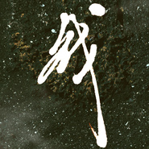

战
============================

|  |  |
| :--: | :-- |
| [ 战](https://emumo.xiami.com/album/2102763915) | **艺人**: [燕池](../index.md) **语种**: 国语 **唱片公司**: 独立发行 **发行时间**: 2017年06月12日 **专辑类别**: EP, 单曲 **专辑风格**: 国语流行 Mandarin Pop **播放数**: 13018 **收藏数**: 155 **评论数**: 22  |

## 简介

  
战 “每个人都有自己的仗要打。” 我们层层武装，步步卸甲。 汗水与眼泪之下的你 曾经 为何而战？ 舍弃了什么，守住了什么？ 此刻 还剩多少志气？ 这一仗， 是陷阱，是诱惑，是时间，是你自己。 水永远冷，玫瑰永远红。 我们且战且勇，现在同以往。 第n次选择爬起来的你，生日快乐。 燕池敬上 2017-06-12

## 曲目

## 评论

|  |  |  |  |
| :-- | :-- | :-- | :-- |
|  [虾米用户](https://emumo.xiami.com/u/91292608) 我还没想好要写什么... 2019-03-17 14:29 赞(0) 踩(0) | 
为何没版权了 
 |
|  [虾米用户](https://emumo.xiami.com/u/91292608) 我还没想好要写什么... 2019-02-27 23:45 赞(0) 踩(0) | 
[文字cool]
 |
|  [虾米用户](https://emumo.xiami.com/u/42799966) 两棵朝圣的树。 2018-03-28 09:15 赞(1) 踩(0) | 
虾米，这点我很不喜欢，我特别喜欢燕池，结果她的歌那么少
 |
|  [虾米用户](https://emumo.xiami.com/u/74639208) Music is per... 2017-10-20 13:58 赞(1) 踩(0) | 
？？
 |
|  [虾米用户](https://emumo.xiami.com/u/117872024)  2017-10-14 17:48 赞(3) 踩(0) | 
内容已删除
 |
| ⇒ |  [虾米用户](https://emumo.xiami.com/u/320701597) 这家伙很酷炫什么也没留下... 2018-02-04 20:36 赞(0) 踩(0) | 
&amp;hellip;&amp;hellip;&amp;hellip;&amp;hellip;那网易云有燕歌行的专辑么
 |
|  [虾米用户](https://emumo.xiami.com/u/32640368) 一道飞泉惊客梦，四山云雾... 2017-10-07 14:37 赞(2) 踩(0) | 
坚持
 |
|  [虾米用户](https://emumo.xiami.com/u/315209890)  2017-07-26 21:49 赞(0) 踩(0) | 
思想就是音乐的灵魂
 |
|  [虾米用户](https://emumo.xiami.com/u/2591642) 空有长河 2017-07-02 01:35 赞(1) 踩(0) | 
时不时会来看一看
 |
|  [虾米用户](https://emumo.xiami.com/u/46445622)   2017-06-20 04:49 赞(11) 踩(0) | 
潮汐周而复始 虾米召唤燕池
 |
|  [虾米用户](https://emumo.xiami.com/u/48383225) 我还没想好要写什么... 2017-06-18 15:55 赞(15) 踩(0) | 
虾米是鸟巢所在，不论走多远都要回来的。
 |
|  [虾米用户](https://emumo.xiami.com/u/71347434) 心安即是归处 2017-06-16 18:14 赞(3) 踩(0) | 
网易都有了虾米速度点
 |
|  [虾米用户](https://emumo.xiami.com/u/71347434) 心安即是归处 2017-06-16 18:14 赞(0) 踩(0) | 
等等等
 |
|  [虾米用户](https://emumo.xiami.com/u/51770914) 这家伙很聪明 2017-06-15 23:03 赞(0) 踩(0) | 
    
 |
|  [虾米用户](https://emumo.xiami.com/u/51586444) ‍再見 2017-06-15 12:10 赞(1) 踩(0) | 
就在等！
 |
|  [虾米用户](https://emumo.xiami.com/u/73061376)   2017-06-15 12:08 赞(1) 踩(0) | 
还在等
 |
|  [虾米用户](https://emumo.xiami.com/u/19297981)             ... 2017-06-14 23:46 赞(3) 踩(0) | 
在这里等着你。一直都。
 |
|  [虾米用户](https://emumo.xiami.com/u/37991965)   2017-06-13 15:13 赞(1) 踩(0) | 
等着你
 |
|  [虾米用户](https://emumo.xiami.com/u/904660)  2017-06-12 22:04 赞(6) 踩(0) | 
  虾米明年能发这张专辑麽，其实我觉得虾米跟燕郎挺配的，都能拖
 |
|  [虾米用户](https://emumo.xiami.com/u/18862956) 用舍由时，行藏在我 2017-06-12 20:15 赞(0) 踩(0) | 
生日快乐～
 |
|  [虾米用户](https://emumo.xiami.com/u/63227822)  2017-06-12 15:25 赞(1) 踩(0) | 
在每一个你可能出现的地方   等你
 |
|  [虾米用户](https://emumo.xiami.com/u/211411988) 夏之日忽以过，冬之夜寻复... 2017-06-12 15:04 赞(11) 踩(0) | 
每个人都有自己的仗要打我们层层武装步步卸甲汗水与眼泪之下的你曾经为何而战舍弃了什么守住了什么此刻还剩多少志气这一仗是陷阱是诱惑是时间是你自己水永远冷玫瑰永远红我们且战且勇现在同以往第N次选择爬起来的你生日快乐
 |
