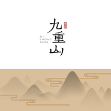

九重山
============================

|  |  |
| :--: | :-- |
| [ 九重山](https://emumo.xiami.com/album/2102807138) | **艺人**: [燕池](../index.md) **语种**: 国语 **唱片公司**: 燕池工作室 **发行时间**: 2017年08月03日 **专辑类别**: EP, 单曲 **专辑风格**: 另类唱作人 Alternative Singer-Songwriter, 中国风 China-Wave **播放数**: 2101930 **收藏数**: 680 **评论数**: 70  |

## 简介

歌曲《九重山》是燕池为纪录电影《二十二》创作的主题曲，歌词来自片中访问慰安妇老人时，老人回忆起的家乡童谣。《二十二》由青年导演郭柯执导，将于8月14日全国公映。 
 

-----------------------------------
 

作词：不可考
 

作曲／编曲：燕池
 

录音：谢嘉宁
 

混音：周天澈
 

专辑封面设计：谭国剑

## 曲目

## 评论

|  |  |  |  |
| :-- | :-- | :-- | :-- |
|  [虾米用户](https://emumo.xiami.com/u/11100988)  人类正处于并将长期处于... 2020-09-12 09:41 赞(0) 踩(0) | 
哪怕我喜欢这个电影，也还是得说，唱这个歌是给你妈编花环，给你爸送果篮呐?管它叫民谣是指那个流行划分里的民谣????就这，跟文工团出来唱歌给人的感觉没啥区别啊，那个团哪怕唱民族都能唱出一种家里几栋楼在手，女儿结婚婚车堵了两条街的味道。这也差不多。
 |
|  [虾米用户](https://emumo.xiami.com/u/290256122) 我还没想好要写什么... 2020-02-16 16:43 赞(0) 踩(0) | 
宁静到眼泪落下也不知道
 |
|  [虾米用户](https://emumo.xiami.com/u/19731665)  2019-08-20 15:24 赞(0) 踩(0) | 
第一次听就收藏了 等了好久再过来看 原来这首歌还有那么多的含义
 |
|  [虾米用户](https://emumo.xiami.com/u/16628263) 随意… 2019-05-08 15:35 赞(0) 踩(0) | 
听着都要落泪
 |
|  [虾米用户](https://emumo.xiami.com/u/9633915) 我还没想好要写什么... 2018-10-09 10:40 赞(5) 踩(0) | 
燕池说这首歌是不适合公开在演唱会上唱的
 |
|  [虾米用户](https://emumo.xiami.com/u/337592878) 一 2018-09-16 12:14 赞(0) 踩(0) | 
忘却的纪念
 |
|  [虾米用户](https://emumo.xiami.com/u/300972129) 内心的祥和宁静是最有力的... 2018-06-24 16:18 赞(0) 踩(0) | 

 |
|  [虾米用户](https://emumo.xiami.com/u/3558226) 音乐是一种态度 2018-04-16 16:17 赞(3) 踩(0) | 
这里不应该有很多人吗？20万中国女性被逼迫沦为日军性奴，如今又剩多少？我只想知道，有多少人是被影片最后22人大名单击碎心头那块最后的坚强，希望能被更多人听到这首曲子，让我们远离战争，中国加油
 |
|  [虾米用户](https://emumo.xiami.com/u/169153196) 恣欲支配 2017-12-30 16:25 赞(0) 踩(0) | 

 |
|  [虾米用户](https://emumo.xiami.com/u/48181516) 我还没想好要写什么... 2017-11-06 21:57 赞(0) 踩(0) | 
泪目
 |
|  [虾米用户](https://emumo.xiami.com/u/19653424) 人生三原则 无相无念无住 2017-10-14 23:34 赞(2) 踩(0) | 
山有九重。也要一步步踏过。途中的收获。悲与欢。笑与哭。唯有自了···
 |
|  [虾米用户](https://emumo.xiami.com/u/32640368) 一道飞泉惊客梦，四山云雾... 2017-10-07 14:37 赞(7) 踩(0) | 
不敢高声语，恐惊天上人。
 |
|  [虾米用户](https://emumo.xiami.com/u/279354016) 找不到态度，就回到真诚。 2017-09-21 09:07 赞(0) 踩(0) | 
当时电影结束的时候，响起了这首歌，我一下子受到了触动，真的很感动！
 |
|  [虾米用户](https://emumo.xiami.com/u/120743232) 让我看到你的夏天 2017-09-01 22:31 赞(0) 踩(0) | 
这首歌确实不错
 |
|  [虾米用户](https://emumo.xiami.com/u/322760081)  2017-09-01 13:53 赞(0) 踩(0) | 
很感人的一首歌
 |
|  [虾米用户](https://emumo.xiami.com/u/252450) 复行数十步，豁然开朗。 2017-08-21 21:57 赞(0) 踩(0) | 
词是有些令我不解的地方，有些道理，但也说不清。
 |
| ⇒ |  [虾米用户](https://emumo.xiami.com/u/39428031)  2017-08-25 00:35 赞(0) 踩(0) | 
山歌
 |
|  [虾米用户](https://emumo.xiami.com/u/205833407) 如果，抬头是在看云娱情;... 2017-08-18 12:48 赞(0) 踩(0) | 
准备去二刷啦~~~
 |
|  [虾米用户](https://emumo.xiami.com/u/11749315) 穿山越海哼你的歌 2017-08-18 02:13 赞(1) 踩(0) | 
这么多年过去，再深刻的伤痕也慢慢被时光磨平，以近乎残忍的方式，而非温柔安慰过的愈合。其实在旁人看来，不过是一段历史，一段故事，一群被战争侵略改变命途的人。而对于她们来说，可能是一辈子的痛苦和挣扎，再也无法面对阳光露出笑容。以前的穷，是单纯而简单的，每天担心的是家里还有多少粮食，衣服上又多了几个补丁现在的穷，是艰难而耻辱的，每天面对的是异样的眼神，或是异国他乡的孤独和隔绝，甚至无法面对自己。 其实，很难取奢求别人的道歉或是补偿，即使得到了，又有什么意义呢。希望自己勿忘国耻，也提醒我们，当我们终有一天当我们终有一天成为世界上的强者，不要给别人带来这样的痛苦征服，不应该以这样的方式
 |
|  [虾米用户](https://emumo.xiami.com/u/2036679) ， 2017-08-16 21:54 赞(4) 踩(0) | 
看了二十二、、又冲刷了三十二，，，面对她们的遭遇，，如今的平淡和「不埋怨」配上这片尾曲足以让人窒息
 |
|  [虾米用户](https://emumo.xiami.com/u/13935367)  2017-08-16 09:44 赞(1) 踩(0) | 
心酸&amp;hellip;&amp;hellip;太沉重了&amp;hellip;&amp;hellip;
 |
|  [虾米用户](https://emumo.xiami.com/u/201391232) 最快的方法是先抱抱 2017-08-15 23:17 赞(0) 踩(0) | 
十分感動。感謝燕郎
 |
|  [虾米用户](https://emumo.xiami.com/u/81982) 一天没音乐，会疯掉！！ 2017-08-15 21:45 赞(3) 踩(0) | 
鼻酸眼眶热，奶奶们的脸又开始一一浮现。
 |
|  [虾米用户](https://emumo.xiami.com/u/8226204) ≡ 2017-08-15 21:39 赞(0) 踩(0) | 
爱
 |
|  [虾米用户](https://emumo.xiami.com/u/314574134)  2017-08-15 21:28 赞(0) 踩(0) | 
支持燕郎
 |
|  [虾米用户](https://emumo.xiami.com/u/232189449) 我还没想好要写什么... 2017-08-15 21:05 赞(0) 踩(0) | 
实在太美了
 |
|  [虾米用户](https://emumo.xiami.com/u/4458764) 我还没想好要写什么... 2017-08-15 16:57 赞(0) 踩(0) | 
头皮发麻的感动
 |
|  [虾米用户](https://emumo.xiami.com/u/188564281) 钟铉❤ 2017-08-15 13:17 赞(3) 踩(0) | 
听到音乐，眼泪就下了了。永远不会原谅日本。必世代与日为敌
 |
| ⇒ |  [虾米用户](https://emumo.xiami.com/u/8445822) 不必记得我 2017-08-27 23:47 赞(0) 踩(0) | 
用不着世代，下一次交战就是倭族的末日！
 |
|  [虾米用户](https://emumo.xiami.com/u/3714491) 混吃等死中 2017-08-13 22:55 赞(2) 踩(0) | 
希望还不晚 支持一下
 |
|  [虾米用户](https://emumo.xiami.com/u/217975821)   2017-08-13 17:19 赞(0) 踩(0) | 
❤️
 |
|  [虾米用户](https://emumo.xiami.com/u/8893899)  2017-08-11 22:51 赞(23) 踩(0) | 
之前参与了众筹，有幸提前参加点映，哭的不能自已。
 |
|  [虾米用户](https://emumo.xiami.com/u/292720254)  2017-08-11 18:06 赞(0) 踩(0) | 
电影要去支持
 |
|  [虾米用户](https://emumo.xiami.com/u/186793639) 我还没想好要写什么... 2017-08-06 21:15 赞(0) 踩(0) | 
好听
 |
|  [虾米用户](https://emumo.xiami.com/u/478527) 好想跟衣服在洗衣机里滚 2017-08-05 20:11 赞(11) 踩(0) | 
长大以后我才明白：记忆里越是爱着的东西，越是不能轻易回头去找去碰，比如故乡，比如一段无疾而终的爱。
 |
|  [虾米用户](https://emumo.xiami.com/u/904660)  2017-08-05 00:39 赞(0) 踩(0) | 
哭
 |
|  [虾米用户](https://emumo.xiami.com/u/13704947) 豆瓣见：无悲渊。 2017-08-04 07:31 赞(10) 踩(0) | 
千呼万唤始出来的《22》，预订了朋友们的时间，将在不同的城市一同观看。燕郎为这部片子制作了音乐，正好也一起安利，只希望不要在影院哭得太难看。
 |
|  [虾米用户](https://emumo.xiami.com/u/22735486) 最好的我遇见最好的你 2017-08-04 06:36 赞(2) 踩(0) | 
看不看随自己，不过我会去的，也会安利别人去看。。
 |
|  [虾米用户](https://emumo.xiami.com/u/47934109)  2017-08-04 01:06 赞(1) 踩(0) | 
电影要去支持！
 |
|  [虾米用户](https://emumo.xiami.com/u/16961401)  我的心房是单间，可以串... 2017-08-03 23:32 赞(4) 踩(0) | 
这个人是有这样气质的人才能唱这样的歌。
 |
|  [虾米用户](https://emumo.xiami.com/u/184710462) 从此江河芝士传说 天地融... 2017-08-03 23:17 赞(1) 踩(0) | 
么么哒＾3＾
 |
|  [虾米用户](https://emumo.xiami.com/u/184710462) 从此江河芝士传说 天地融... 2017-08-03 23:17 赞(0) 踩(0) | 
26 27 28都是我的
 |
|  [虾米用户](https://emumo.xiami.com/u/184710462) 从此江河芝士传说 天地融... 2017-08-03 23:17 赞(0) 踩(0) | 
⊙&amp;forall;⊙哇
 |
|  [虾米用户](https://emumo.xiami.com/u/9464517) 我还没想好要写什么... 2017-08-03 21:46 赞(0) 踩(0) | 
～
 |
|  [虾米用户](https://emumo.xiami.com/u/71096076) 这个人很聪明什么也没留下 2017-08-03 16:56 赞(3) 踩(0) | 
某云音乐的评论区都爆炸了找不到自己38分钟前的评论了orz
 |
|  [虾米用户](https://emumo.xiami.com/u/71096076) 这个人很聪明什么也没留下 2017-08-03 16:17 赞(0) 踩(0) | 
我还算前排吗 
 |
|  [虾米用户](https://emumo.xiami.com/u/259835642) 斟酌字词/痛饮旋律 2017-08-03 16:02 赞(0) 踩(0) | 
仔细数了，封面是十座山啊 
 |
| ⇒ |  [虾米用户](https://emumo.xiami.com/u/2709876)  2017-08-17 11:38 赞(0) 踩(0) | 
银才。。。
 |
| ⇒ |  [虾米用户](https://emumo.xiami.com/u/8445822) 不必记得我 2017-08-27 23:49 赞(0) 踩(0) | 
最矮那座只能算丘，不能算山 
 |
|  [虾米用户](https://emumo.xiami.com/u/6749530) 我变化万千，任何定格的印... 2017-08-03 15:22 赞(0) 踩(0) | 
天外有天，山外有山
 |
|  [虾米用户](https://emumo.xiami.com/u/51586444) ‍再見 2017-08-03 14:28 赞(0) 踩(0) | 
终于记得虾米了
 |
|  [虾米用户](https://emumo.xiami.com/u/10526872) 海未干涸，艺术未尽，她已... 2017-08-03 14:10 赞(3) 踩(0) | 
二十二，勿忘国耻，电影一定会去看的。
 |
|  [虾米用户](https://emumo.xiami.com/u/2774317) 一本书 一碗茶 一首歌 ... 2017-08-03 13:57 赞(1) 踩(0) | 
那个家乡，那个人，山河碎，人枉然。
 |
|  [虾米用户](https://emumo.xiami.com/u/43083099) 我还没想好要写什么... 2017-08-03 12:49 赞(0) 踩(0) | 
喜欢电影没想到音乐再次惊喜
 |
|  [虾米用户](https://emumo.xiami.com/u/221408671)  2017-08-03 12:10 赞(0) 踩(0) | 
画面感很强 音乐一响起 感觉就回到了那时候
 |
|  [虾米用户](https://emumo.xiami.com/u/316661433)  2017-08-03 11:48 赞(0) 踩(0) | 
燕郎，一个三十岁的男人还可以粉你吗？
 |
|  [虾米用户](https://emumo.xiami.com/u/59048934) 你只讲我可爱 2017-08-03 11:38 赞(1) 踩(0) | 
每次听燕浪的歌，一个揉碎的心都得到了安抚，真好
 |
|  [虾米用户](https://emumo.xiami.com/u/232097692)  2017-08-03 11:33 赞(0) 踩(0) | 
悠远
 |
|  [虾米用户](https://emumo.xiami.com/u/32125734) weibo：白菜y少女  2017-08-03 11:16 赞(0) 踩(0) | 
燕郎~
 |
|  [虾米用户](https://emumo.xiami.com/u/49109843) 我还没想好要写什么... 2017-08-03 11:12 赞(0) 踩(0) | 
美妙~
 |
|  [虾米用户](https://emumo.xiami.com/u/92050674) ☀ 2017-08-03 10:43 赞(0) 踩(0) | 
来了
 |
|  [虾米用户](https://emumo.xiami.com/u/19297981)             ... 2017-08-03 10:34 赞(29) 踩(0) | 
如果说能听到什么的话，其实我听到的是沉淀以后的安详，是每一个平淡的人生，是柴米油盐的生活，是向往和平静。这才是本应有的日子吧，这才是坚强活下来的理由啊。
 |
|  [虾米用户](https://emumo.xiami.com/u/303165396) 世间仅此一个你呀～ 2017-08-03 10:25 赞(0) 踩(0) | 
好听
 |
|  [虾米用户](https://emumo.xiami.com/u/19297981)             ... 2017-08-03 10:17 赞(0) 踩(0) | 
啊
 |
|  [虾米用户](https://emumo.xiami.com/u/143444896)  2017-08-03 10:08 赞(0) 踩(0) | 
惊喜！
 |
|  [虾米用户](https://emumo.xiami.com/u/886508) 我还没想好要写什么... 2017-08-03 10:01 赞(0) 踩(0) | 
来来来
 |
|  [虾米用户](https://emumo.xiami.com/u/122664704) Be silence. 2017-08-03 10:01 赞(0) 踩(0) | 
昨天心血来潮，突然半夜看燕池微博，发现今天新歌消息
 |
|  [虾米用户](https://emumo.xiami.com/u/301408349)   2017-08-03 10:01 赞(0) 踩(0) | 
终于等到了
 |
|  [虾米用户](https://emumo.xiami.com/u/17879702)  2017-08-03 10:01 赞(0) 踩(0) | 
抢楼
 |
|  [虾米用户](https://emumo.xiami.com/u/15981691) 和我 2017-08-03 10:00 赞(0) 踩(0) | 
第一第一 
 |
