燕池
============================

|  |  |
| :--: | :-- |
| [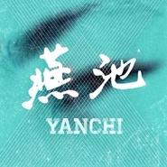 燕池](https://i.xiami.com/yanchi) | **地区**: China 中国大陆 **风格**: 另类唱作人 Alternative Singer-Songwriter, 独立电子乐 Indietronica **播放数**: 59264847 **粉丝数**: 67303 **评论数**: 1831  |

## 档案

## 专辑

| 名称 | 语种 | 唱片公司 | 发行时间 | 专辑类别 | 专辑风格 |
| :--: | :-- | :-- | :-- | :-- | :-- |
| [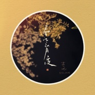 春江花月夜](./albums/5021569810.md) | 国语 | 鸟阁 | 2020年10月01日 | EP, 单曲 | 另类唱作人 Alternative Singer-Songwriter |
| [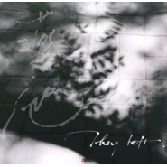 他们都走了They Left.](./albums/2102740560.md) | 纯音乐 | 鸟阁 | 2020年09月26日 | EP, 单曲 | 氛围音乐 Ambient |
| [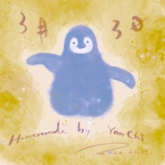 三月三日三月三日版](./albums/2420352269.md) | 国语 | 独立发行 | 2020年03月03日 | EP, 单曲 | 另类唱作人 Alternative Singer-Songwriter |
| [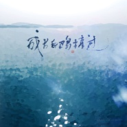 成片白鸥掠过电影《爱猫之城》宣传曲](./albums/2104011330.md) | 国语 | 鸟阁 | 2018年09月11日 | EP, 单曲 | 另类唱作人 Alternative Singer-Songwriter |
| [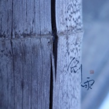 剑雨](./albums/2103938346.md) | 纯音乐 | 鸟阁 | 2018年08月21日 | EP, 单曲 | 独立电子乐 Indietronica, 实验电子 Experimental Electronic |
| [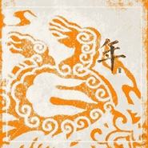 年The Monster Nian](./albums/2103527482.md) | 国语 | 鸟阁 | 2018年02月14日 | EP, 单曲 | 独立电子乐 Indietronica, 实验电子 Experimental Electronic |
| [ 九重山](./albums/2102807138.md) | 国语 | 燕池工作室 | 2017年08月03日 | EP, 单曲 | 另类唱作人 Alternative Singer-Songwriter, 中国风 China-Wave |
| [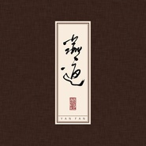 燕返](./albums/2103706707.md) | 国语 | 独立发行 | 2017年07月03日 | 录音室专辑 | 另类唱作人 Alternative Singer-Songwriter, 古风 GuFeng Music |
| [ 战](./albums/2102763915.md) | 国语 | 独立发行 | 2017年06月12日 | EP, 单曲 | 国语流行 Mandarin Pop |
| [ 半身](./albums/2102716856.md) | 国语 | 独立发行 | 2017年03月20日 | EP, 单曲 | 另类唱作人 Alternative Singer-Songwriter |
| [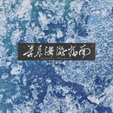 星系漫游指南Lonely Planets](./albums/2100336256.md) | 其他 | 鸟阁 | 2016年05月14日 | EP, 单曲 | 实验电子 Experimental Electronic |
| [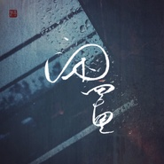 闲置](./albums/2100175375.md) | 国语 | 鸟阁 | 2015年08月05日 | EP, 单曲 | 另类唱作人 Alternative Singer-Songwriter |
| [ 青Parfait Amour](./albums/121327601.md) | 国语 | 鸟阁 | 2015年06月25日 | 录音室专辑 | 氛围音乐 Ambient, 另类唱作人 Alternative Singer-Songwriter, 新古典新世纪 Neoclassical New Age |
| [ 燕歌行](./albums/1229085211.md) | 国语 | 虾米音乐人 | 2015年04月23日 | 录音室专辑 | 另类唱作人 Alternative Singer-Songwriter, 中国风 China-Wave, 华语唱作人 Chinese Singer-Songwriter |
| [ 非](./albums/921063854.md) | 其他 | 鸟阁 | 2015年01月12日 | EP, 单曲 | 独立电子乐 Indietronica |
| [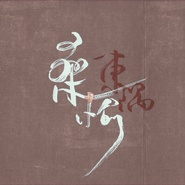 桑榆](./albums/1117083663.md) | 国语 | 鸟阁 | 2014年11月27日 | EP, 单曲 | 另类唱作人 Alternative Singer-Songwriter, 中国风 China-Wave |
| [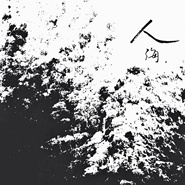 人海Sea of Faces](./albums/1906561193.md) | 国语 | 鸟阁 | 2014年11月08日 | 录音室专辑 | 另类唱作人 Alternative Singer-Songwriter |
| [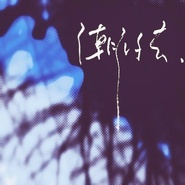 潮汐去No Return](./albums/1802491202.md) | 国语 | 鸟阁 | 2014年06月12日 | 合集, 杂锦 | 自由即兴 Free Improvisation, 氛围音乐 Ambient, 另类唱作人 Alternative Singer-Songwriter |
| [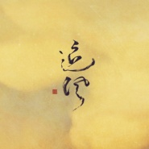 追风](./albums/1697814805.md) | 国语 | 鸟阁 | 2014年04月18日 | EP, 单曲 | 另类唱作人 Alternative Singer-Songwriter |
| [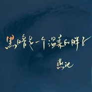 黑暗是一个温柔的胖子](./albums/1094776608.md) | 国语 | 鸟阁 | 2014年03月14日 | EP, 单曲 | 独立民谣 Indie Folk |

## 评论

|  |  |  |
| :-- | :-- | :-- |
|  [虾米用户](https://emumo.xiami.com/u/14842875)  2021-01-18 13:22 赞(1) 踩(0) | 
虾米给我自己的告别海报上说，燕池是我在这里最钟情的人。我早就知道。
 |
|  [虾米用户](https://emumo.xiami.com/u/263855282)  2021-01-11 08:39 赞(0) 踩(0) | 
燕池以后主用哪个平台
 |
|  [虾米用户](https://emumo.xiami.com/u/166302128) 冷冷清清的风风火火. 2021-01-04 23:42 赞(0) 踩(0) | 
没有《烟云过眼》呀
 |
|  [虾米用户](https://emumo.xiami.com/u/324971718) 我还没想好要写什么... 2021-01-03 04:28 赞(0) 踩(0) | 
人海 听了一千遍 哼了一万遍 还是没能好好活
 |
|  [虾米用户](https://emumo.xiami.com/u/358104299) 悲观的唯心存在现实解构虚... 2020-12-30 11:48 赞(0) 踩(0) | 
46680
 |
|  [虾米用户](https://emumo.xiami.com/u/19604443) 这家伙很聪明什么也没留下... 2020-11-16 16:31 赞(0) 踩(0) | 
巡演来广州了，燕郎我要去见你
 |
|  [虾米用户](https://emumo.xiami.com/u/313521095) sorry I didn... 2020-11-14 09:12 赞(1) 踩(0) | 
草 怎么才发现
 |
|  [虾米用户](https://emumo.xiami.com/u/427076004) 迎難而上是勇敢,有時知難... 2020-11-12 22:29 赞(0) 踩(0) | 
喜欢  
 |
|  [虾米用户](https://emumo.xiami.com/u/316502674) 在最后陪着你吧，我的虾米 2020-10-06 15:25 赞(0) 踩(0) | 
啊！燕池是神！爱了爱了！这是什么宝藏姐姐！
 |
|  [虾米用户](https://emumo.xiami.com/u/444449422)  2020-10-03 13:34 赞(1) 踩(0) | 
听燕池的歌好容易想家啊
 |
|  [虾米用户](https://emumo.xiami.com/u/49445549)  2020-09-29 07:19 赞(0) 踩(0) | 
很喜欢你的音乐 望坚持 又怕你迫于生活压力要放弃，毕竟人都要生活的
 |
|  [虾米用户](https://emumo.xiami.com/u/339276398)  2020-09-23 21:11 赞(0) 踩(0) | 
喜欢燕郎，（豪）侠而已~
 |
|  [虾米用户](https://emumo.xiami.com/u/44557521) Ash 2020-09-08 00:25 赞(1) 踩(0) | 
高中开始听你的歌，当时就很喜欢，已经好久没来虾米了，祝你一切都好，每天开心 
 |
|  [虾米用户](https://emumo.xiami.com/u/376524610)  2020-08-22 20:54 赞(0) 踩(0) | 
在&amp;ldquo;每日推荐30首&amp;rdquo;里听到的，第一次听到此曲，并多知道了一位声音这么好听的音乐人，惊艳到了，能让人的心瞬间平静，娓娓道来，在此纪念一下第一次听的感受
 |
|  [虾米用户](https://emumo.xiami.com/u/276944698) 不要自我设限..... 2020-08-12 20:48 赞(0) 踩(0) | 
☘️☘️☘️
 |
|  [虾米用户](https://emumo.xiami.com/u/99211278)  2020-07-25 03:23 赞(0) 踩(0) | 
为了燕郎再把虾米装回来！
 |
|  [虾米用户](https://emumo.xiami.com/u/12128984) 我讨厌一切不押韵的歌，感... 2020-05-27 11:19 赞(4) 踩(0) | 
燕池的歌一直有种混响，耳朵朦胧胧的，可以形成 一种空灵意境，像梦又像迷，但是单曲循环久了，就容易瞌睡哈哈，可能像母胎里的声音。 其实燕池的曲子和增田俊郎的《虫师》系列有点像。曲风都是轻灵、安静的。
 |
| ⇒ |  [虾米用户](https://emumo.xiami.com/u/5139737)  2020-08-08 01:35 赞(0) 踩(0) | 
是的，虫师配乐，我也有这样的感觉。但是我觉得燕池还是有很多面的，应该可以有更多的突破。
 |
| ⇒ |  [虾米用户](https://emumo.xiami.com/u/2054536)  2020-10-28 16:28 赞(0) 踩(0) | 
是的  我也是想到虫师
 |
| ⇒ |  [虾米用户](https://emumo.xiami.com/u/445882944)  2020-11-11 01:29 赞(0) 踩(0) | 
真的挺像
 |
|  [虾米用户](https://emumo.xiami.com/u/336075791) 时间走了      谁还... 2020-04-13 08:08 赞(1) 踩(0) | 
隐士
 |
|  [虾米用户](https://emumo.xiami.com/u/83591380) 哼一首淡淡的歌。 2020-03-15 16:15 赞(0) 踩(0) | 
前期的那些歌是真的惊艳 期待更多好音乐
 |
|  [虾米用户](https://emumo.xiami.com/u/440875145) 再见虾米，哪天相见啊 2020-03-13 17:36 赞(0) 踩(0) | 
我还特意查了下，诶呦喂，原来是92年的啊
 |
|  [虾米用户](https://emumo.xiami.com/u/440875145) 再见虾米，哪天相见啊 2020-03-13 17:33 赞(0) 踩(0) | 
真是一零后吗，感觉声音好沧桑啊。
 |
| ⇒ |  [虾米用户](https://emumo.xiami.com/u/52532347) 我还没想好要写什么... 2020-03-18 17:24 赞(0) 踩(0) | 
怎么会10后啦   
 |
|  [虾米用户](https://emumo.xiami.com/u/52254031)  2019-12-26 20:30 赞(4) 踩(0) | 
毕竟心境相投   于是情愿叫一声燕郎
 |
|  [虾米用户](https://emumo.xiami.com/u/2496614)  2019-12-20 01:33 赞(1) 踩(0) | 
偶尔听过一段时间，还好2020年能在昆明听现场
 |
|  [虾米用户](https://emumo.xiami.com/u/38424656) 暂无签名~ 2019-10-19 00:07 赞(1) 踩(0) | 
啥时候燕郎来江苏演出啊，网上找了半天，好像都没找到。没别的，就像当面听一首将进酒，只是静静的听。
 |
| ⇒ |  [虾米用户](https://emumo.xiami.com/u/346747051)  2019-12-04 23:52 赞(0) 踩(0) | 
巡演开始啦，杭州上海有噢
 |
| ⇒ |  [虾米用户](https://emumo.xiami.com/u/10227125) 努力的好像要写什么… 2019-12-13 22:11 赞(0) 踩(0) | 
去年有苏州
 |
|  [虾米用户](https://emumo.xiami.com/u/347903765) 长日夏凉风动水 水动风凉... 2019-10-11 15:47 赞(0) 踩(0) | 
你好可爱！
 |
|  [虾米用户](https://emumo.xiami.com/u/42966238)   . 2019-09-22 00:01 赞(0) 踩(0) | 
燕郎今年没出新专呀
 |
|  [虾米用户](https://emumo.xiami.com/u/6929161)  2019-09-07 08:26 赞(0) 踩(0) | 
啥时候有新专辑啊，期待期待(๑˙ー˙๑)
 |
|  [虾米用户](https://emumo.xiami.com/u/473335) 你想要的到底是什么？ 2019-08-16 09:53 赞(1) 踩(0) | 
活出了我理想的生活状态，给你点赞。
 |
|  [虾米用户](https://emumo.xiami.com/u/426936600)  2019-07-06 18:12 赞(5) 踩(0) | 
今天发生了好多事…我打了很多字…但还是消除了…最后只想说，燕池…感谢有你的音乐伴我左右……
 |
|  [虾米用户](https://emumo.xiami.com/u/334543801)  2019-06-30 10:53 赞(1) 踩(0) | 
有些人就是有种魔力，能让你找到归属～
 |
|  [虾米用户](https://emumo.xiami.com/u/19203079) 吴斌 2019-05-28 09:47 赞(0) 踩(0) | 
问个问题，虾米改版后，极其难用，&amp;ldquo;猜你喜欢&amp;rdquo;推荐的音乐非常不靠谱，比以前的差的太远，这是为什么？
 |
| ⇒ |  [虾米用户](https://emumo.xiami.com/u/312807992)  2019-11-24 08:48 赞(0) 踩(0) | 
的确，而且每天还推送我不喜欢的歌而且每天都是不一样的人唱的版本，其实我是不喜欢那个风格的歌曲并不是换个人唱的我就喜欢了
 |
|  [虾米用户](https://emumo.xiami.com/u/343424881) 是以君子终日行不离静重，... 2019-04-26 23:15 赞(0) 踩(0) | 
听着郎的歌，就像是两个灵魂，对面而坐、品茗致意，这种安静下来的感觉真的很好
 |
|  [虾米用户](https://emumo.xiami.com/u/278575860)  2019-04-04 22:15 赞(2) 踩(0) | 
燕池，加油哦
 |
|  [虾米用户](https://emumo.xiami.com/u/408566567) 欲壑难填 痛苦之源 2019-03-27 15:14 赞(1) 踩(0) | 
燕子，在哪里能听你的现场？半首人海就爱上你你的歌了
 |
|  [虾米用户](https://emumo.xiami.com/u/311959690) 我还没想好要写什么... 2019-03-25 03:17 赞(0) 踩(0) | 
期待2019跨年能听现场
 |
|  [虾米用户](https://emumo.xiami.com/u/59444454)   ᐕ)ง 2019-03-24 12:27 赞(6) 踩(0) | 
呜呜呜呜爱死我了 我知道的唯一一个每个专辑都有9.0+评分的歌手+(b♡∀♡)b°+
 |
|  [虾米用户](https://emumo.xiami.com/u/246689266)  2019-03-17 17:45 赞(0) 踩(0) | 
;-)
 |
|  [虾米用户](https://emumo.xiami.com/u/30781879) 我还没想好要写什么... 2019-03-12 20:31 赞(0) 踩(0) | 
加油哦
 |
|  [虾米用户](https://emumo.xiami.com/u/419632269) 喜欢一朵花会把它摘下来 2019-03-09 22:38 赞(0) 踩(0) | 
请加油
 |
|  [虾米用户](https://emumo.xiami.com/u/267893550) 涅槃寂静 2019-03-06 09:25 赞(3) 踩(0) | 
在一个充满人间烟火气的餐馆， 戴上耳机就进入了了另外的一个世界，明澈澄净，若夜卧古松下，懒拥泥炉，观行云遮月，嗅山间清风，一口清茶，两肋生风，快哉快哉！
 |
|  [虾米用户](https://emumo.xiami.com/u/412325672) 你来自东或西 2019-03-03 15:09 赞(2) 踩(0) | 
似曾相识燕归来
 |
|  [虾米用户](https://emumo.xiami.com/u/166302128) 冷冷清清的风风火火. 2019-02-04 22:31 赞(2) 踩(0) | 
燕郎，新年快乐
 |
|  [虾米用户](https://emumo.xiami.com/u/241442635)  2019-01-28 10:45 赞(0) 踩(0) | 
啊啊啊
 |
|  [虾米用户](https://emumo.xiami.com/u/241442635)  2019-01-28 10:42 赞(0) 踩(0) | 
哈罗
 |
|  [虾米用户](https://emumo.xiami.com/u/166302128) 冷冷清清的风风火火. 2019-01-02 12:43 赞(4) 踩(0) | 
2016年12月10日那天,我在这里遇见了燕池,这是我最喜欢的艺人,就像个难舍难分的老友。  虾米音乐2018年个人音乐故事展览
 |
|  [虾米用户](https://emumo.xiami.com/u/374373655)  2018-12-26 14:51 赞(0) 踩(0) | 
******
 |
|  [虾米用户](https://emumo.xiami.com/u/9003931) 千淘万漉虽辛苦 2018-12-25 17:46 赞(0) 踩(0) | 
值得关注的吟游&amp;amp;amp;独立流行音乐人。
 |
|  [虾米用户](https://emumo.xiami.com/u/209633322) 哇哈哈 2018-12-23 03:45 赞(2) 踩(0) | 
燕池你太美啦
 |
|  [虾米用户](https://emumo.xiami.com/u/43784) 有冰冷尖牙，也有温暖手心 2018-11-23 19:07 赞(0) 踩(0) | 
爱上了
 |
|  [虾米用户](https://emumo.xiami.com/u/379830295) 不会经常回来了 ，网易云... 2018-11-23 00:21 赞(3) 踩(0) | 
好喜欢这个声音啊❤️
 |
|  [虾米用户](https://emumo.xiami.com/u/102319692) 你是我花草兴盛的无人之境 2018-10-15 01:16 赞(4) 踩(0) | 
听了现场后，确认你不是侠客，而是仙 
 |
|  [虾米用户](https://emumo.xiami.com/u/19621281) 音乐王子 2018-10-11 22:26 赞(0) 踩(0) | 
古风王
 |
|  [虾米用户](https://emumo.xiami.com/u/137206634) 满堂花醉三千客，一剑霜寒... 2018-10-10 00:45 赞(4) 踩(0) | 
怎么只剩下一张照片一个艺名？
 |
|  [虾米用户](https://emumo.xiami.com/u/166302128) 冷冷清清的风风火火. 2018-10-08 19:17 赞(9) 踩(0) | 
郎啊，等我等我  中考后一定要去一场演唱会！！！
 |
|  [虾米用户](https://emumo.xiami.com/u/10526872) 海未干涸，艺术未尽，她已... 2018-10-08 13:44 赞(0) 踩(0) | 
不来广州吗？
 |
|  [虾米用户](https://emumo.xiami.com/u/318491016) 六根清净 2018-10-03 00:35 赞(1) 踩(0) | 
歌颂可爱
 |
|  [虾米用户](https://emumo.xiami.com/u/404683259) .. 2018-09-22 19:00 赞(1) 踩(0) | 
我喜欢你 千万言语 只此一句
 |
|  [虾米用户](https://emumo.xiami.com/u/5389930)   2018-08-19 20:56 赞(0) 踩(0) | 
好听耶
 |
|  [虾米用户](https://emumo.xiami.com/u/379714187)  2018-08-17 18:54 赞(3) 踩(0) | 
我们都有收藏卡奇社哇、
 |
|  [虾米用户](https://emumo.xiami.com/u/289043270) 我还没想好要写什么... 2018-07-29 17:31 赞(0) 踩(0) | 
山洞哈哈哈
 |
|  [虾米用户](https://emumo.xiami.com/u/343424881) 是以君子终日行不离静重，... 2018-07-26 13:59 赞(1) 踩(0) | 
哈哈哈哈哈哈哈开心，生日应该就和郎差了六七天
 |
|  [虾米用户](https://emumo.xiami.com/u/328416533)  2018-07-24 22:50 赞(2) 踩(0) | 
在虾米和网易云之间游来游去习惯了也是很开心的
 |
|  [虾米用户](https://emumo.xiami.com/u/7408939) 活着可真麻烦。 2018-07-24 11:12 赞(1) 踩(0) | 
把《对酒行》传过来吧！
 |
| ⇒ |  [虾米用户](https://emumo.xiami.com/u/343424881) 是以君子终日行不离静重，... 2018-07-25 14:30 赞(0) 踩(0) | 
年初就在准备对酒行专辑了，应该快了吧~
 |
| ⇒ |  [虾米用户](https://emumo.xiami.com/u/7408939) 活着可真麻烦。 2018-07-25 23:17 赞(0) 踩(0) | 
<q><b>猎魔人杰葡萄说：</b></q>
 |
|  [虾米用户](https://emumo.xiami.com/u/264650212) 微笑的抑郁症患者…… 2018-07-15 12:34 赞(2) 踩(0) | 
2018年广深还来吗 
 |
| ⇒ |  [虾米用户](https://emumo.xiami.com/u/165045598) 你是一树一树的花开 2018-08-19 19:17 赞(0) 踩(0) | 
同求啊！！！来广深啊来广深！！！
 |
|  [虾米用户](https://emumo.xiami.com/u/253934588) 纯乐交流分享群：Q群【1... 2018-07-14 23:05 赞(2) 踩(0) | 
8月24日青岛已购票，同城乐迷留言点赞。
 |
|  [虾米用户](https://emumo.xiami.com/u/29872889) 彼一如我 2018-07-14 21:57 赞(1) 踩(0) | 
来昆明来昆明来昆明  
 |
|  [虾米用户](https://emumo.xiami.com/u/362179237) 感谢上苍 2018-07-05 16:32 赞(0) 踩(0) | 
才发现   ，no，很早有听过，只是不认识    哭
 |
|  [虾米用户](https://emumo.xiami.com/u/377206423)  2018-06-30 14:28 赞(0) 踩(0) | 
每个人都有悲惨的命运但要靠自己  
 |
|  [虾米用户](https://emumo.xiami.com/u/43648786) 安静的知了 2018-06-16 22:58 赞(2) 踩(0) | 
演出很棒，燕郎辛苦~多喝气泡水加茶
 |
|  [虾米用户](https://emumo.xiami.com/u/339191478)   2018-06-08 20:20 赞(1) 踩(0) | 
:-)
 |
|  [虾米用户](https://emumo.xiami.com/u/290486351) 寂寞在布达拉宫 快乐在天... 2018-06-01 23:36 赞(9) 踩(0) | 
燕池 我开始认识你了 谢谢你的出现
 |
|  [虾米用户](https://emumo.xiami.com/u/16037926) 艾斯兔一生推 2018-05-20 12:54 赞(1) 踩(0) | 
天哪才发现 超棒的！！
 |
|  [虾米用户](https://emumo.xiami.com/u/100192680) 从未来过，就好了。 2018-05-13 11:37 赞(5) 踩(0) | 
张张专辑都是9分以上！果然吧，不只是听信仰和情怀。当然，别人不喜欢也不能强求和鄙夷。加油。
 |
|  [虾米用户](https://emumo.xiami.com/u/335763493) 不戴墨镜  2018-05-12 21:22 赞(3) 踩(0) | 
聽了九重山后就喜歡你的聲音
 |
|  [虾米用户](https://emumo.xiami.com/u/29872889) 彼一如我 2018-05-12 15:59 赞(1) 踩(0) | 
好想去见燕池小姐姐 喜欢她清冽的声音和气质 想必人也是极美极美的
 |
|  [虾米用户](https://emumo.xiami.com/u/268048000) 花开富贵上善若水 2018-05-11 00:29 赞(1) 踩(0) | 
相遇恨晚！！你的 客从何处来 我听了好多遍了 。真的很喜欢
 |
|  [虾米用户](https://emumo.xiami.com/u/285538216) 癍啊癍划破的伤再也好不了 2018-05-10 17:30 赞(1) 踩(0) | 
喜欢你呐 
 |
|  [虾米用户](https://emumo.xiami.com/u/36181347) 薛定谔的明天 2018-05-06 23:29 赞(0) 踩(0) | 
为何没有燕返的歌曲想听游戏
 |
|  [虾米用户](https://emumo.xiami.com/u/11701580)  2018-04-27 00:18 赞(0) 踩(0) | 
需要燕大侠新曲拯救我衰老的灵魂！
 |
|  [虾米用户](https://emumo.xiami.com/u/339191478)   2018-04-26 23:34 赞(0) 踩(0) | 
:-)
 |
|  [虾米用户](https://emumo.xiami.com/u/321870908)  2018-04-20 22:18 赞(0) 踩(0) | 
默默的收藏了一首又一首，渐渐的已经离不开你了，要是哪天没听到你的歌，心里就空唠唠的，有你真好！
 |
|  [虾米用户](https://emumo.xiami.com/u/7927868) 我还没想好要写什么... 2018-04-20 20:51 赞(0) 踩(0) | 
听你的音乐很感动
 |
|  [虾米用户](https://emumo.xiami.com/u/36754809)  2018-04-18 18:21 赞(0) 踩(0) | 
15元买的居然不是无损版，真的坑
 |
|  [虾米用户](https://emumo.xiami.com/u/357671133)  2018-04-14 23:11 赞(1) 踩(0) | 
您不知道我有多喜欢您。
 |
|  [虾米用户](https://emumo.xiami.com/u/250137358) 云下有亭，亭中有我，我手... 2018-04-13 17:26 赞(0) 踩(0) | 
喜欢啊，超级喜欢，祁克果和燕池，美的滋滋爽
 |
|  [虾米用户](https://emumo.xiami.com/u/357638832) 我还没想好要写什么... 2018-04-11 12:34 赞(4) 踩(0) | 
自一年前偶然听到燕池的将进酒，虽说每个人对将进酒都有自己的释义与对太白心境的理解，但燕池的意境却最能引起我的共鸣，确是圆了自小学接触诗词以来最大的心念。自此之后，燕池的苦昼短，策马，诸多曲作。因此，非常感谢燕池为这个世界带来的创作
 |
|  [虾米用户](https://emumo.xiami.com/u/357638832) 我还没想好要写什么... 2018-04-11 01:05 赞(2) 踩(0) | 
希望燕郎能出将进酒的instrument版，燕歌行专辑里的将进酒的背景曲实在是太棒了！
 |
|  [虾米用户](https://emumo.xiami.com/u/114750764) 后来的我们 2018-04-10 21:35 赞(1) 踩(0) | 
燕池  從名字到性格到歌曲到本人都是極美極美的 
 |
|  [虾米用户](https://emumo.xiami.com/u/256736644)  2018-04-07 01:36 赞(0) 踩(0) | 
燕池我爱你！❤️ 
 |
|  [虾米用户](https://emumo.xiami.com/u/318227684) 在薄情的世界深情的活着 2018-04-03 22:52 赞(1) 踩(0) | 
听你的歌是有画面的，声音让我觉得有个女子在身边，孤独常有，此时声音的陪伴难得，愿你好。
 |
|  [虾米用户](https://emumo.xiami.com/u/356116330) 喔喔喔~ 2018-04-03 06:30 赞(1) 踩(0) | 
18年有演出计划吗？好想听听现场啊。
 |
|  [虾米用户](https://emumo.xiami.com/u/289928807)  2018-04-02 21:24 赞(1) 踩(0) | 
音质清冽，曲调萧索，怎不唱些欢快的歌。
 |
|  [虾米用户](https://emumo.xiami.com/u/356392457)  2018-03-31 22:14 赞(0) 踩(0) | 
我来了，爱你。
 |
|  [虾米用户](https://emumo.xiami.com/u/11309609) 向死而生 2018-03-27 23:07 赞(1) 踩(0) | 
这么多年了，还是听你的歌最是喜欢。
 |
|  [虾米用户](https://emumo.xiami.com/u/294813372) 尽管走下去，遇见所有未知... 2018-03-26 22:52 赞(2) 踩(0) | 
人啊！精神上的孤独会在夜里无线放大，你温柔的声音走进了我心里柔软的部分，这一刻是爱你，我心爱的燕池！
 |
|  [虾米用户](https://emumo.xiami.com/u/244665070)  2018-03-26 11:06 赞(0) 踩(0) | 
很不错的艺人
 |
|  [虾米用户](https://emumo.xiami.com/u/355410010)  2018-03-23 19:02 赞(0) 踩(0) | 
基本上所有平台都找完啦
 |
|  [虾米用户](https://emumo.xiami.com/u/22190134) 什么都没有 2018-03-23 16:08 赞(0) 踩(0) | 
喜欢你
 |
|  [虾米用户](https://emumo.xiami.com/u/18339284) 摊开你的掌心，让我看看你... 2018-03-18 23:36 赞(0) 踩(0) | 
一言难尽呀，燕歌行版权在虾米，燕返版权在网易云，两边跑 : )
 |
|  [虾米用户](https://emumo.xiami.com/u/335747175)  2018-03-17 19:47 赞(1) 踩(0) | 
燕池，希望你唱一首短歌行，我很喜欢这首诗
 |
|  [虾米用户](https://emumo.xiami.com/u/166302128) 冷冷清清的风风火火. 2018-03-17 18:50 赞(3) 踩(0) | 
以前啊 总是说 没有999不合理，现在又道 怎么就999了呢
 |
|  [虾米用户](https://emumo.xiami.com/u/52698125) 重度神游患者 2018-03-17 16:22 赞(2) 踩(0) | 
就是好喜欢你呀
 |
|  [虾米用户](https://emumo.xiami.com/u/17440297)  2018-03-07 23:41 赞(2) 踩(0) | 
想听对酒行！想听对酒行！想听对酒行！！！！！！
 |
|  [虾米用户](https://emumo.xiami.com/u/14652349) 壹贰叁 肆伍陆 柒捌玖 2018-02-25 13:04 赞(1) 踩(0) | 
1707姗姗来迟   
 |
|  [虾米用户](https://emumo.xiami.com/u/333721866) 为燕池而来 2018-02-20 20:37 赞(4) 踩(0) | 
一直默默的喜欢你，没怎么评论过，今天对我来说是一个特殊的日子，飞雪肆虐，路石难越，所爱隔山海，山海不可平 听你的歌我会舒服很多
 |
|  [虾米用户](https://emumo.xiami.com/u/343358839)  2018-02-18 18:02 赞(3) 踩(0) | 
一曲将进酒，燕池之后无燕池。
 |
|  [虾米用户](https://emumo.xiami.com/u/350606675)  2018-02-15 11:28 赞(0) 踩(0) | 
新年最好的礼物。。。
 |
|  [虾米用户](https://emumo.xiami.com/u/342205561) 朴素的回归 2018-02-09 22:49 赞(1) 踩(0) | 
燕池的歌已经成为了我力量的源泉之一 
 |
|  [虾米用户](https://emumo.xiami.com/u/348329339)  2018-02-07 16:49 赞(0) 踩(0) | 
滴...
 |
|  [虾米用户](https://emumo.xiami.com/u/347540231) 绚烂如电 虚幻如雾 哀愁... 2018-02-03 18:57 赞(2) 踩(0) | 
绚烂如电 虚幻如雾 哀愁和仰慕 游乐人间
 |
|  [虾米用户](https://emumo.xiami.com/u/256563127) 这虾米 2018-01-31 15:48 赞(1) 踩(0) | 
燕道那个专辑哪
 |
|  [虾米用户](https://emumo.xiami.com/u/289290031)  2018-01-22 13:04 赞(0) 踩(0) | 
歌声有古意。
 |
|  [虾米用户](https://emumo.xiami.com/u/48224385)  2018-01-15 14:22 赞(1) 踩(0) | 
温柔绵长，不管是悲伤还是快乐都喜欢听你的音乐。已成为自来水，但又如此纠结。这算是心中的一片秘密花园吧！
 |
|  [虾米用户](https://emumo.xiami.com/u/44430719) 矛盾  困局 2018-01-15 01:43 赞(0) 踩(0) | 
喜欢很久了
 |
|  [虾米用户](https://emumo.xiami.com/u/305870701)  2018-01-13 17:38 赞(1) 踩(0) | 
在虾米听了很多音乐人的歌，直到今天遇到她才发现我的寻找只是为了她，只想再说两个字：想听。
 |
|  [虾米用户](https://emumo.xiami.com/u/30974904) 我还没想好要写什么... 2018-01-13 12:00 赞(3) 踩(0) | 
什么时候来云南演出 
 |
|  [虾米用户](https://emumo.xiami.com/u/340766948) 喜欢老歌 2018-01-08 00:12 赞(0) 踩(0) | 
偶然听到你的声音，就被吸引过来了，小姐姐真棒
 |
|  [虾米用户](https://emumo.xiami.com/u/13483095)  2018-01-06 16:44 赞(0) 踩(0) | 
下午学习犯困的时候偶然听到你的声音，浑身一个激灵，像泉水一样的声音有点点慵懒放任，好听啊 
 |
|  [虾米用户](https://emumo.xiami.com/u/302505151) 人有信仰才能活，长升健康... 2018-01-05 19:57 赞(0) 踩(0) | 
我才知道有《燕返》
 |
|  [虾米用户](https://emumo.xiami.com/u/302505151) 人有信仰才能活，长升健康... 2018-01-04 21:51 赞(0) 踩(0) | 
燕郎你的声音能不能别拉么清晰了！ 
 |
|  [虾米用户](https://emumo.xiami.com/u/45707886)  2018-01-03 20:04 赞(1) 踩(0) | 
又见燕公子 
 |
|  [虾米用户](https://emumo.xiami.com/u/122664704) Be silence. 2018-01-03 15:03 赞(1) 踩(0) | 
我跟燕郎相似度45%耶
 |
|  [虾米用户](https://emumo.xiami.com/u/9762448)  2017-12-30 01:26 赞(2) 踩(0) | 
燕池的歌里呀哪怕洞察了世情，仍旧是满满的怜和爱，没有怨怼的温厚，灵气都带了佛性。但偏偏你也知道，她不肯悟不肯遁，有不输人的执拗风骨
 |
| ⇒ |  [虾米用户](https://emumo.xiami.com/u/276295997)  2018-04-13 12:21 赞(0) 踩(0) | 
不肯悟不肯遁
 |
|  [虾米用户](https://emumo.xiami.com/u/71347434) 心安即是归处 2017-12-29 11:33 赞(0) 踩(0) | 
kiwi~
 |
|  [虾米用户](https://emumo.xiami.com/u/328615733) 这家伙什么也没留下 2017-12-29 00:54 赞(0) 踩(0) | 
真的是...万古愁
 |
|  [虾米用户](https://emumo.xiami.com/u/341072687)  2017-12-23 10:43 赞(3) 踩(0) | 
超喜欢啊，为了您的歌下了四个播放器
 |
|  [虾米用户](https://emumo.xiami.com/u/294788141) 初次见面时，要努力记住别... 2017-12-22 17:51 赞(2) 踩(0) | 
我听过很多歌，却从来没有一个歌手的大部分作品让我都喜欢的，除了你，至少，目前为止都很喜欢。
 |
|  [虾米用户](https://emumo.xiami.com/u/297388292) 我很喜欢你 2017-12-17 19:11 赞(0) 踩(0) | 
好喜欢啊！
 |
|  [虾米用户](https://emumo.xiami.com/u/46148916)  2017-12-12 01:09 赞(0) 踩(0) | 
很干净很洒脱，有点羁绊但却很笃定
 |
|  [虾米用户](https://emumo.xiami.com/u/335771122) 寻找音乐与灵魂的共鸣 2017-12-06 20:43 赞(3) 踩(0) | 
听完人海，才难过为什么没有早一点听你的歌。真的好有感觉
 |
|  [虾米用户](https://emumo.xiami.com/u/273057583)  2017-12-06 09:48 赞(0) 踩(0) | 
心静如水、喜欢你，期待新歌    
 |
|  [虾米用户](https://emumo.xiami.com/u/288119081) 皮肤问题 面部问题 手足... 2017-12-02 10:45 赞(0) 踩(0) | 
我只是收藏我喜欢的艺人和歌 和你没关系   
 |
|  [虾米用户](https://emumo.xiami.com/u/310400200)  2017-11-26 22:14 赞(3) 踩(0) | 
支持你，哪里能买你的专辑
 |
|  [虾米用户](https://emumo.xiami.com/u/30631733) 仍怀有被拯救的热切渴望 2017-11-26 12:26 赞(0) 踩(0) | 
真的好喜欢你啊，喜欢你的满身才气，喜欢到为自己的浅薄感到自卑无比，怎么办？
 |
|  [虾米用户](https://emumo.xiami.com/u/304341840) Striking a c... 2017-11-26 08:23 赞(3) 踩(0) | 
愚公移山，还是低估了山的高度，身前无数大山，只留有一丝缝隙得窥舞台中间一束白光，但空谷之音仍于耳边回响。祝小肥宅依旧低调而富足。
 |
|  [虾米用户](https://emumo.xiami.com/u/15910153)  2017-11-25 21:10 赞(1) 踩(0) | 
在北京现场
 |
|  [虾米用户](https://emumo.xiami.com/u/10946368)  2017-11-23 18:56 赞(0) 踩(0) | 
11.25 等我
 |
|  [虾米用户](https://emumo.xiami.com/u/261615323) 但愿长C2H5OH不复醒 2017-11-22 19:35 赞(0) 踩(0) | 
为啥虾米没燕返
 |
|  [虾米用户](https://emumo.xiami.com/u/336547104)  2017-11-22 00:55 赞(60) 踩(0) | 
燕郎啊，我真的好喜欢你啊，初识人海，而后一直默默关注，或许喜欢着喜欢着就藏不住了，欢喜便溢了出来，晚上睡不着听着你的歌便十分想与你 说句晚安，或者是睡不着，或者也因为最近过得不好。我很遗憾没有那么早认识你，在你还能回人私信的时候，我也好庆幸这时候认识你，你还是你，沉默富足的你。我好希望那你来我的古城，看苍山白头，洱海明月，或许没有北方的千里冰封，万里雪飘，我还希望你来我的古镇，看白族民族，品三道茶回味，我还希望你来我的小村落，出门五分钟就到洱海边看老夫妇打渔划船，鹭鸶飞舞。最后承蒙你的出现，给我这颗浮躁的心予以清风。晚安 
 |
| ⇒ |  [虾米用户](https://emumo.xiami.com/u/322027216)  2019-02-28 13:58 赞(0) 踩(0) | 
哇，和我完全一样，和你说的一样这样慢慢开始很喜欢燕池了
 |
|  [虾米用户](https://emumo.xiami.com/u/334073651) 我没有不高兴哦 2017-11-17 12:41 赞(17) 踩(0) | 
燕郎和粒粒一定是很好的朋友吧    午安
 |
|  [虾米用户](https://emumo.xiami.com/u/334775103)  2017-11-14 09:35 赞(2) 踩(0) | 
追寻燕郎来到虾米
 |
|  [虾米用户](https://emumo.xiami.com/u/334797238)  2017-11-13 22:37 赞(92) 踩(0) | 
在宿舍我都不想外放你的歌，忒有感觉都舍不得让别人听见!!!
 |
| ⇒ |  [虾米用户](https://emumo.xiami.com/u/335186289)  2018-01-03 22:42 赞(0) 踩(0) | 
请问高才还是在校生么？
 |
| ⇒ |  [虾米用户](https://emumo.xiami.com/u/123987172)   2018-07-14 21:59 赞(0) 踩(0) | 
我宿舍的人，总以为我魔怔了，听这样&amp;lsquo;不入流&amp;rsquo;的歌 
 |
| ⇒ |  [虾米用户](https://emumo.xiami.com/u/101636444) ❤️一只喜欢闵玧其的疯姑... 2019-05-08 23:42 赞(0) 踩(0) | 
<q><b>73说：</b></q>
 |
| ⇒ |  [虾米用户](https://emumo.xiami.com/u/435256676)  2020-01-07 12:59 赞(0) 踩(0) | 
大家都是一样的啊
 |
|  [虾米用户](https://emumo.xiami.com/u/192310057)  2017-11-13 14:18 赞(1) 踩(0) | 
爱你
 |
|  [虾米用户](https://emumo.xiami.com/u/15874467) 虾米更懂我 ☁ 2017-11-12 17:24 赞(14) 踩(0) | 
可不可以传出《岩流》的纯器乐版呢燕郎，其实你很多歌的纯音乐版我都很爱循环。虾米网易云两头听。也不知道你能否看得见。总之超喜欢听。 
 |
|  [虾米用户](https://emumo.xiami.com/u/327727151)  2017-11-03 20:03 赞(1) 踩(0) | 
因为她的歌
 |
|  [虾米用户](https://emumo.xiami.com/u/50549349) 我还没想好要写什么... 2017-10-31 17:30 赞(1) 踩(0) | 
太喜欢你啦！！！！
 |
|  [虾米用户](https://emumo.xiami.com/u/19653424) 人生三原则 无相无念无住 2017-10-30 10:02 赞(3) 踩(0) | 
冬夜虽短，却有美梦的悠长。一只青鸟在心中来回，游荡在晨风与夕阳日影之间。夜丝舒展，万物已休。天边的忧愁，坠入大地尽头。她徐徐安立枝头，为明天奋斗。【加油燕郎我的神】
 |
|  [虾米用户](https://emumo.xiami.com/u/7084337) drown 2017-10-28 00:43 赞(2) 踩(0) | 
七夕单身狗也可以睡的很好，哈哈～那么多无处安放的夜，好眠
 |
|  [虾米用户](https://emumo.xiami.com/u/7084337) drown 2017-10-28 00:43 赞(1) 踩(0) | 
七夕单身狗也可以睡的很好，哈哈～那么多无处安放的夜，好眠
 |
|  [虾米用户](https://emumo.xiami.com/u/7084337) drown 2017-10-28 00:43 赞(1) 踩(0) | 
七夕单身狗也可以睡的很好，哈哈～那么多无处安放的夜，好眠
 |
|  [虾米用户](https://emumo.xiami.com/u/8716748) 你是我的灯火，点亮我的光... 2017-10-28 00:36 赞(0) 踩(0) | 
最近正好在复习古代文学史，找到你的音乐
 |
|  [虾米用户](https://emumo.xiami.com/u/49262156)  2017-10-28 00:26 赞(0) 踩(0) | 
最近看书画画时不太喜欢闹的声音，然后就听燕公子的纯音乐，特别好！
 |
|  [虾米用户](https://emumo.xiami.com/u/256584601)  2017-10-27 23:44 赞(0) 踩(0) | 
最近一直喜欢这种调调！
 |
|  [虾米用户](https://emumo.xiami.com/u/34506301)   2017-10-27 23:24 赞(0) 踩(0) | 
最近各种忙，快爆表了 很久没来了，又出来这么多曲子 让我烦躁的心一下子雀跃起来了，哈哈
 |
|  [虾米用户](https://emumo.xiami.com/u/49450072) 我还没想好要写什么... 2017-10-27 22:57 赞(0) 踩(0) | 
听着感到空明，听着心平气静
 |
|  [虾米用户](https://emumo.xiami.com/u/106091856)  2017-10-27 00:08 赞(0) 踩(0) | 
啊好喜欢你怎么办
 |
|  [虾米用户](https://emumo.xiami.com/u/262877677)  2017-10-26 20:09 赞(0) 踩(0) | 
原来郎的歌都在虾米呀
 |
|  [虾米用户](https://emumo.xiami.com/u/50030054)  2017-10-22 10:49 赞(0) 踩(0) | 
始于人海，忠于苦昼短，陷于游戏
 |
|  [虾米用户](https://emumo.xiami.com/u/4268650) 我还没想好要写什么... 2017-10-19 01:06 赞(0) 踩(0) | 
请帮阿兰·达瓦卓玛写一首好歌吧！
 |
|  [虾米用户](https://emumo.xiami.com/u/266280166)  2017-10-18 22:38 赞(0) 踩(0) | 
666666
 |
|  [虾米用户](https://emumo.xiami.com/u/214239375)  2017-10-17 09:19 赞(0) 踩(0) | 
看到了三亚饲养员发在群里的视频，郎今天也很棒棒哦
 |
|  [虾米用户](https://emumo.xiami.com/u/201019140) 畫畫寫作到死去，多迷人 2017-10-16 22:55 赞(0) 踩(0) | 
我爱你:)
 |
|  [虾米用户](https://emumo.xiami.com/u/12865563) “万物如诗” 2017-10-15 06:42 赞(2) 踩(0) | 
始于才华忠于人品最后陷于颜值哈哈哈哈哈哈哈
 |
| ⇒ |  [虾米用户](https://emumo.xiami.com/u/609593) 笑话尔…… 2017-10-16 10:39 赞(0) 踩(0) | 
哈哈哈，差不多就是这样
 |
|  [虾米用户](https://emumo.xiami.com/u/12865563) “万物如诗” 2017-10-15 06:41 赞(0) 踩(0) | 
你是我的光
 |
|  [虾米用户](https://emumo.xiami.com/u/13704947) 豆瓣见：无悲渊。 2017-10-14 21:36 赞(1) 踩(0) | 
真痛苦，《燕返》这张专辑虾米没有，全场我都如在梦中。
 |
| ⇒ |  [虾米用户](https://emumo.xiami.com/u/3934907) 追寻诗人的足迹 2017-10-16 18:44 赞(0) 踩(0) | 
厦门 real live ~
 |
|  [虾米用户](https://emumo.xiami.com/u/77629446)  2017-10-12 13:24 赞(2) 踩(0) | 
燕郎，你在哪？好想见你一面
 |
| ⇒ |  [虾米用户](https://emumo.xiami.com/u/41988371) 我还没想好要写什么... 2017-10-14 17:47 赞(0) 踩(0) | 
今天厦门有燕郎的现场！！！ 一会就去
 |
|  [虾米用户](https://emumo.xiami.com/u/12181015) 朝闻佳音，夕可死矣。 2017-10-09 10:39 赞(1) 踩(0) | 
10月14号
 |
|  [虾米用户](https://emumo.xiami.com/u/256426635) 我还没想好要写什么... 2017-10-06 10:45 赞(1) 踩(0) | 
燕郎么么哒
 |
|  [虾米用户](https://emumo.xiami.com/u/327690231)  2017-10-03 09:23 赞(1) 踩(0) | 
人海
 |
|  [虾米用户](https://emumo.xiami.com/u/327721175)  2017-10-01 13:12 赞(0) 踩(0) | 
为燕池来不知为谁走
 |
|  [虾米用户](https://emumo.xiami.com/u/34789804) 简单的人温柔而坚定 2017-10-01 12:04 赞(0) 踩(0) | 
燕池姐姐
 |
|  [虾米用户](https://emumo.xiami.com/u/113756374) 爱不移动，心在联通。 2017-09-30 14:05 赞(3) 踩(0) | 
我在想，这到底是一位什么样的女孩，才气十足，却能安静追随自己挚爱的东西，平静又高远，妙哉！
 |
|  [虾米用户](https://emumo.xiami.com/u/298122811) 我还没想好要写什么... 2017-09-28 14:51 赞(0) 踩(0) | 
我知道喜爱孤独是什么感觉，听过阁主的歌之后，我对独处的理解又上了一个层次。听得出歌声底下是一颗有情有义的心灵。对老师为人处事态度满满的尊敬。&amp;ldquo;相逢何必曾相识&amp;rdquo;。
 |
|  [虾米用户](https://emumo.xiami.com/u/508115) 暂无签名~ 2017-09-27 15:22 赞(0) 踩(0) | 
坐等10月15号来上海
 |
|  [虾米用户](https://emumo.xiami.com/u/45866140)   2017-09-24 16:50 赞(1) 踩(0) | 
人间已无此殊丽 Welcome to Chongking
 |
|  [虾米用户](https://emumo.xiami.com/u/326526753) 想要揭示探索世界，而不是... 2017-09-24 05:50 赞(0) 踩(0) | 
燕读四声，谢谢
 |
|  [虾米用户](https://emumo.xiami.com/u/326526753) 想要揭示探索世界，而不是... 2017-09-24 05:42 赞(4) 踩(0) | 
突然网易听不了人海然后果断下载虾米
 |
|  [虾米用户](https://emumo.xiami.com/u/14265718) wx:osakarock... 2017-09-23 01:54 赞(2) 踩(0) | 
燕郎现场真的！太可爱了 ！大家快去去去现场听！
 |
|  [虾米用户](https://emumo.xiami.com/u/96184916)  2017-09-17 00:15 赞(1) 踩(0) | 
燕池加油↖(^&amp;omega;^)↗
 |
|  [虾米用户](https://emumo.xiami.com/u/51586444) ‍再見 2017-09-13 10:28 赞(2) 踩(0) | 
燕郎是不是忘记虾米了
 |
| ⇒ |  [虾米用户](https://emumo.xiami.com/u/2158630) |..........| 2017-09-14 15:12 赞(0) 踩(0) | 
不会的。
 |
| ⇒ |  [虾米用户](https://emumo.xiami.com/u/51586444) ‍再見 2017-09-14 18:14 赞(0) 踩(0) | 
<q><b>Bonismo说：</b></q>
 |
|  [虾米用户](https://emumo.xiami.com/u/113941394)  2017-09-12 23:05 赞(2) 踩(0) | 
感谢你带给我安恬的回忆。
 |
|  [虾米用户](https://emumo.xiami.com/u/100192680) 从未来过，就好了。 2017-09-11 21:57 赞(11) 踩(0) | 
想起陈粒未火时，把她的很多歌推荐给别人，别人都说好难听或者听不懂，例如易燃易爆炸，结果到现在她已经可以当评委，很多人也知道她了。 我也推荐过燕池，和当初陈粒一样的结局&amp;mdash;&amp;mdash;淡淡的知道了。 现在，燕池也快火了，歌曲下载也要钱了，但听听就好吧，就这样吧。
 |
|  [虾米用户](https://emumo.xiami.com/u/86663426)  2017-09-09 22:16 赞(1) 踩(0) | 
9月24号重庆站，有事去不了了低价出票，有意者来骚扰啊
 |
| ⇒ |  [虾米用户](https://emumo.xiami.com/u/325670287)  2017-09-18 18:18 赞(0) 踩(0) | 
多少出
 |
| ⇒ |  [虾米用户](https://emumo.xiami.com/u/86663426)  2017-09-18 18:41 赞(0) 踩(0) | 
<q><b>喜悦的海枣说：</b></q>
 |
|  [虾米用户](https://emumo.xiami.com/u/320087093)  2017-09-08 15:15 赞(0) 踩(0) | 
爱燕池
 |
|  [虾米用户](https://emumo.xiami.com/u/49959840) 无聊人 2017-09-08 00:46 赞(0) 踩(0) | 
☁️
 |
|  [虾米用户](https://emumo.xiami.com/u/6375179) 这一定是生命的盛年。 2017-09-05 09:57 赞(0) 踩(0) | 
歌词漫射着满满的才华。
 |
|  [虾米用户](https://emumo.xiami.com/u/14265718) wx:osakarock... 2017-09-02 00:07 赞(0) 踩(0) | 
成都见
 |
|  [虾米用户](https://emumo.xiami.com/u/10232844) 再完美的声音也不过是声音... 2017-08-27 18:57 赞(1) 踩(0) | 
为啥虾米还没更新《燕返》？
 |
|  [虾米用户](https://emumo.xiami.com/u/143876104)  2017-08-26 22:33 赞(8) 踩(0) | 
行影无声，吞没星辰，郎艳独绝，世无其二。
 |
|  [虾米用户](https://emumo.xiami.com/u/12865563) “万物如诗” 2017-08-24 18:13 赞(3) 踩(0) | 
本来是歌迷的 关注了微博之后就变成颜粉啦   
 |
|  [虾米用户](https://emumo.xiami.com/u/43612099)  2017-08-23 00:01 赞(0) 踩(0) | 
净、鸣、思、忆
 |
|  [虾米用户](https://emumo.xiami.com/u/166302128) 冷冷清清的风风火火. 2017-08-22 23:00 赞(2) 踩(0) | 
刚刚看了一篇文，赶来写评论，至少在这一刻，你还不会烂大街。
 |
|  [虾米用户](https://emumo.xiami.com/u/320610640)  2017-08-21 10:45 赞(10) 踩(0) | 
为燕池下载了虾米 然后放弃了网易云
 |
| ⇒ |  [虾米用户](https://emumo.xiami.com/u/305444398)  2017-08-24 11:36 赞(0) 踩(0) | 
咋啦，网易云不发她歌了？
 |
|  [虾米用户](https://emumo.xiami.com/u/42799966) 两棵朝圣的树。 2017-08-21 06:16 赞(1) 踩(0) | 
《明月》、《将进酒》、《苦昼短》最喜欢这三首歌，快更快更，很喜欢你这样的妹子
 |
|  [虾米用户](https://emumo.xiami.com/u/27578040) 人生苦短哀 无好歌不欢 2017-08-21 02:50 赞(1) 踩(0) | 
花了一整天时间终于把虾里所有关于燕池的歌曲都认认真真仔仔细细再听了一遍(恭喜自己哈哈哈)！配合创作笔记和专辑介绍的文字说明，听后感不一样啦，变得更深邃和喜悦，能多悟一些些创作者的心血。歌当然很好，特别是词，涉及诗词的基本都背下来啦(妈妈再也不用担心我的语基啦虽然不学语文好多年了哈哈哈)。器乐确实美也更自由，比如我先听的七言，听的时候欢脱得不行，后来听的明月，从此听七言就都是明月的歌词和感觉，出不来自己的画面T^T。很喜欢戴上耳机听器乐的各种音色在耳朵里跑来溜去的感觉，那种捕捉的过程很有趣也很好玩，只是领悟力有限，在没有文字辅助说明的情况下听不到作者真正想表达的意思和境界，只是觉得美啊妙啊大爱啊
 |
|  [虾米用户](https://emumo.xiami.com/u/27578040) 人生苦短哀 无好歌不欢 2017-08-21 02:49 赞(1) 踩(0) | 
这两天一直在想是怎么知道燕池的，实在想不起，也没关系啦，不管是每日30首推荐，相似电台播放，来自某人的分享，又或者是什么奇怪的契机，只记得先是对将进酒和苦昼短喜欢的不得了，虾米上找到器乐哇惊喜啊开心的啊，再看到刻木雕石和书法作品，嗯，正式入坑，后来通过知乎、微博、鸟阁、各种文字辅助才建立起了&amp;ldquo;何为燕池&amp;rdquo;的框架。这不禁让我想起一高中同学，她对朋友筛选极为严格，在她心中早已形成标准和关卡，而一旦成为朋友了便会付诸全部真心。我们了解燕池需要层层信息的叠加和深入，燕池也用不建百科不要形成固版印象(听歌曲来了解我呀)的方式寻得可与之语者。总之遇上了喜欢了沦陷了都是缘分。祝好！厦门站等你&amp;mdash;&amp;mdash;肤浅又话唠的我
 |
|  [虾米用户](https://emumo.xiami.com/u/25017707)  2017-08-18 11:55 赞(0) 踩(0) | 
我心中的女侠~
 |
|  [虾米用户](https://emumo.xiami.com/u/4120395) so long 2017-08-17 01:55 赞(0) 踩(0) | 
[词一般 曲子好好好好好 谱成好的故事了]
 |
|  [虾米用户](https://emumo.xiami.com/u/42799966) 两棵朝圣的树。 2017-08-16 23:08 赞(0) 踩(0) | 
燕美美，快出专辑，饥渴等待中      
 |
|  [虾米用户](https://emumo.xiami.com/u/1761003)   ㊣✢✞✪✠✺✧❂❃✜... 2017-08-16 22:07 赞(0) 踩(0) | 
期待巡演！ 
 |
|  [虾米用户](https://emumo.xiami.com/u/264720767)  2017-08-16 21:59 赞(0) 踩(0) | 
  
 |
|  [虾米用户](https://emumo.xiami.com/u/14425160)  2017-08-16 17:44 赞(0) 踩(0) | 
燕大帅
 |
|  [虾米用户](https://emumo.xiami.com/u/86000162)  2017-08-16 11:12 赞(2) 踩(0) | 
希望那些老奶奶都能好好的，韦绍兰奶奶能过得好一点再好一点 。
 |
|  [虾米用户](https://emumo.xiami.com/u/47545171)  2017-08-16 08:30 赞(19) 踩(0) | 
九重山把我带进你的世界
 |
|  [虾米用户](https://emumo.xiami.com/u/319481677)  2017-08-15 11:50 赞(1) 踩(0) | 
为什么虾米上燕郎的歌不全
 |
|  [虾米用户](https://emumo.xiami.com/u/36139564)   2017-08-14 22:45 赞(9) 踩(0) | 
看了电影二十二，从此对燕池路转粉。
 |
|  [虾米用户](https://emumo.xiami.com/u/33810350)  2017-08-12 11:15 赞(0) 踩(0) | 
00
 |
|  [虾米用户](https://emumo.xiami.com/u/237516295)  2017-08-12 00:55 赞(0) 踩(0) | 
不错不错
 |
|  [虾米用户](https://emumo.xiami.com/u/42799966) 两棵朝圣的树。 2017-08-10 19:02 赞(2) 踩(0) | 
听了燕池的古风歌，再听其它的，再也看不上其它的了，都用华丽的辞藻矫饰屁大点事儿，格局太小。
 |
|  [虾米用户](https://emumo.xiami.com/u/53626987) 我也可以是触手可及的温暖... 2017-08-09 22:54 赞(6) 踩(0) | 
陈粒肯定是好的，不过，燕池才是我女神。
 |
|  [虾米用户](https://emumo.xiami.com/u/246301517) God is watch... 2017-08-09 13:03 赞(0) 踩(0) | 

 |
|  [虾米用户](https://emumo.xiami.com/u/317773290)  2017-08-07 19:41 赞(0) 踩(0) | 
以后你会知道我，因为我叫艳阳天华
 |
|  [虾米用户](https://emumo.xiami.com/u/87778600)  2017-07-31 18:05 赞(0) 踩(0) | 
好喜欢你的歌
 |
|  [虾米用户](https://emumo.xiami.com/u/117089280)  2017-07-31 15:52 赞(0) 踩(0) | 
燕郎太有才了
 |
|  [虾米用户](https://emumo.xiami.com/u/77478102) 编辑自己，编辑生活 2017-07-31 12:41 赞(0) 踩(0) | 
处理的不是特别好，有点口水味
 |
|  [虾米用户](https://emumo.xiami.com/u/40970233)   2017-07-30 20:58 赞(0) 踩(0) | 
别是第二个陈粒
 |
|  [虾米用户](https://emumo.xiami.com/u/2613067) WaitingForU 2017-07-29 18:52 赞(0) 踩(0) | 
音乐间歇听到窗外知了声声  切了一下午的虾米猜   终于等来一首  还有什么比这更幸福
 |
|  [虾米用户](https://emumo.xiami.com/u/242416302)  2017-07-27 10:27 赞(0) 踩(0) | 
苏秦分明听见树林中沉重的喘息与呜咽，却象钉在车上一般不能动弹。良久，苏秦缓过神来跳下轺车，拿起了道中那个包袱，月光下，包袱皮上的四个鲜红大字赫然在目&amp;mdash;&amp;mdash;冷暖炎凉！心中一动，伸手轻抚，湿滑沾手，竟是血书大字！轰的一声，苏秦觉得热血上涌，颓然坐到了地上。半晌，苏秦慢慢站了起来，将包袱放进车厢，对着树林深深一躬，回身跳上轺车去了。白色身影出了树林，站在道口久久的伫立着。辚辚车声渐去渐远，树林边却响起了幽幽的歌声&amp;mdash;&amp;mdash;燕燕于飞 差池其羽远送于野 我心伤悲辚辚远去 悠悠难归瞻望弗及 泣涕如雨
 |
|  [虾米用户](https://emumo.xiami.com/u/315204593)  2017-07-26 19:59 赞(0) 踩(0) | 
喜欢古诗词，第一次遇到将古诗词唱得这么好听的年轻女子，现在最喜欢的是《明月》
 |
|  [虾米用户](https://emumo.xiami.com/u/43648786) 安静的知了 2017-07-24 16:02 赞(0) 踩(0) | 

 |
|  [虾米用户](https://emumo.xiami.com/u/314574134)  2017-07-24 09:26 赞(3) 踩(0) | 
她的歌有一种让人安静的美，很美。
 |
|  [虾米用户](https://emumo.xiami.com/u/121621164)  2017-07-23 15:40 赞(1) 踩(0) | 
客从何处来很有感觉
 |
|  [虾米用户](https://emumo.xiami.com/u/42799966) 两棵朝圣的树。 2017-07-21 22:35 赞(2) 踩(0) | 
声音真是惊艳
 |
|  [虾米用户](https://emumo.xiami.com/u/260096887) 帅 2017-07-21 20:37 赞(1) 踩(0) | 
我喜欢听《将进洒》，特别好听，加油 努力。
 |
|  [虾米用户](https://emumo.xiami.com/u/296010376) 跨過那片柔佛海 下一站榜... 2017-07-18 17:11 赞(2) 踩(0) | 
我的名字粤语拼音和yanchi一样 所以一看到你的名字就很喜欢 当然更喜欢你的音乐了 同为双子女 加油 支持你   
 |
|  [虾米用户](https://emumo.xiami.com/u/312289586)  2017-07-15 09:40 赞(1) 踩(0) | 
听燕郎的歌，总是有一种脱离世尘的感觉。像是品茗，饮酒一样。即可以细细品味，也可以如饮烈酒一般，倾心而饮  燕郎，么么哒
 |
|  [虾米用户](https://emumo.xiami.com/u/292168908) 做不到完完全全的心如止水... 2017-07-14 16:16 赞(0) 踩(0) | 
默默听了一年多啦，很喜欢你的曲，听歌的时候是稍作休整，听罢便再扑向沙场，哈哈。 觉得《燕返》里的曲都很好，想听纯乐版的_(:⁍」&amp;ang;)_
 |
|  [虾米用户](https://emumo.xiami.com/u/243319460)  2017-07-14 14:58 赞(0) 踩(0) | 
听着她的歌，我仿佛看到一个清静无为的道士在做法。
 |
|  [虾米用户](https://emumo.xiami.com/u/49942506) - 如果我真的存在，也是... 2017-07-06 23:37 赞(1) 踩(0) | 
听见你的声音 可以让我变得很放松 谢谢
 |
|  [虾米用户](https://emumo.xiami.com/u/4728208) 追风赶月别留情。 2017-07-04 23:33 赞(0) 踩(0) | 
心痛，不能在虾米买新砖。 
 |
|  [虾米用户](https://emumo.xiami.com/u/12181015) 朝闻佳音，夕可死矣。 2017-07-04 16:08 赞(0) 踩(0) | 
并没有版权   
 |
|  [虾米用户](https://emumo.xiami.com/u/229175780)  2017-07-03 14:59 赞(0) 踩(0) | 
落满雪的空旷原野
 |
|  [虾米用户](https://emumo.xiami.com/u/125352752)   2017-07-03 09:59 赞(0) 踩(0) | 
马上出新专了，好紧张！
 |
|  [虾米用户](https://emumo.xiami.com/u/198843594)  2017-06-30 16:30 赞(0) 踩(0) | 
虾米有燕池的版权 就下了虾米 听燕池
 |
|  [虾米用户](https://emumo.xiami.com/u/87778600)  2017-06-25 23:56 赞(0) 踩(0) | 
听了燕郎的歌后以后深深中毒无法自拔
 |
|  [虾米用户](https://emumo.xiami.com/u/190970134)  2017-06-19 23:34 赞(4) 踩(0) | 
为了燕郎下的虾米
 |
| ⇒ |  [虾米用户](https://emumo.xiami.com/u/12181015) 朝闻佳音，夕可死矣。 2017-07-04 16:08 赞(0) 踩(0) | 
你可能要卸载了
 |
|  [虾米用户](https://emumo.xiami.com/u/239774622) 吹气球，吹个大气球... 2017-06-18 23:19 赞(0) 踩(0) | 
每一首都好听到情绪在心里要爆炸。
 |
|  [虾米用户](https://emumo.xiami.com/u/4234256)  2017-06-17 00:41 赞(0) 踩(0) | 
哇擦 燕郎和刘二混一起了
 |
|  [虾米用户](https://emumo.xiami.com/u/336476)  2017-06-16 09:02 赞(0) 踩(0) | 
歌手是大舌头么？
 |
|  [虾米用户](https://emumo.xiami.com/u/50394498) 我还没想好要写什么... 2017-06-15 23:09 赞(0) 踩(0) | 
喜欢的都是没有词的曲
 |
|  [虾米用户](https://emumo.xiami.com/u/34024457) I live in Mo... 2017-06-15 15:23 赞(0) 踩(0) | 
这样的佳人 会是谁有三世的缘分才能娶到啊 [叹号问好]
 |
|  [虾米用户](https://emumo.xiami.com/u/268340271) 我还没想好要写什么... 2017-06-14 23:37 赞(0) 踩(0) | 
美
 |
|  [虾米用户](https://emumo.xiami.com/u/233757882) 永远有多远呢 2017-06-12 19:52 赞(0) 踩(0) | 
生日快乐哦
 |
|  [虾米用户](https://emumo.xiami.com/u/38581208) I feel dream... 2017-06-12 12:33 赞(0) 踩(0) | 
战呢
 |
| ⇒ |  [虾米用户](https://emumo.xiami.com/u/99065352) 沉默富足，亦平静不急迫。 2017-06-17 16:15 赞(0) 踩(0) | 
版权在网易云。
 |
|  [虾米用户](https://emumo.xiami.com/u/34353459)  2017-06-11 11:14 赞(0) 踩(0) | 
这个燕池是个迷，网上基本找不到什么资料。好想解开迷底啊。
 |
| ⇒ |  [虾米用户](https://emumo.xiami.com/u/214239375)  2017-06-19 02:10 赞(0) 踩(0) | 
你可以微博关注燕池饲养大队
 |
|  [虾米用户](https://emumo.xiami.com/u/166305280)  2017-06-05 17:36 赞(0) 踩(0) | 
有才
 |
|  [虾米用户](https://emumo.xiami.com/u/18862956) 用舍由时，行藏在我 2017-06-03 23:08 赞(0) 踩(0) | 
新专辑本月12号，乐童预购。
 |
|  [虾米用户](https://emumo.xiami.com/u/8930771)  2017-06-01 17:18 赞(0) 踩(0) | 
偶遇&amp;ldquo;静美&amp;rdquo;才女一枚，一首《半身》驻耳，又多了一个站点。
 |
|  [虾米用户](https://emumo.xiami.com/u/88310366)  2017-05-31 23:52 赞(0) 踩(0) | 
这是七堇年吗
 |
| ⇒ |  [虾米用户](https://emumo.xiami.com/u/214239375)  2017-06-03 21:51 赞(0) 踩(0) | 
不是
 |
| ⇒ |  [虾米用户](https://emumo.xiami.com/u/99065352) 沉默富足，亦平静不急迫。 2017-06-17 16:15 赞(0) 踩(0) | 
不是
 |
|  [虾米用户](https://emumo.xiami.com/u/54334705) 别说话~你听！ 2017-05-30 11:20 赞(0) 踩(0) | 
燕池多大了啊？
 |
|  [虾米用户](https://emumo.xiami.com/u/274269926) 帅气，自卑，活力，坠落，... 2017-05-23 22:07 赞(1) 踩(0) | 
燕池小姐姐的照片怎么就一张了？之前49张呐
 |
|  [虾米用户](https://emumo.xiami.com/u/42082361)  2017-05-22 23:03 赞(0) 踩(0) | 
旧词新赋好光景。
 |
|  [虾米用户](https://emumo.xiami.com/u/143444896)  2017-05-21 20:52 赞(0) 踩(0) | 
在年轻的飞奔里，你是迎面而来的风。
 |
|  [虾米用户](https://emumo.xiami.com/u/92996280) 正宗懒人，没有特长。 2017-05-05 21:16 赞(0) 踩(0) | 
什么时候来成都呀？翘课都要去见你～
 |
|  [虾米用户](https://emumo.xiami.com/u/7564791) 燕歌行 2017-05-05 19:09 赞(0) 踩(0) | 
燕郎什么时候发《东流水》啊？
 |
|  [虾米用户](https://emumo.xiami.com/u/134819260)  2017-05-05 15:05 赞(0) 踩(0) | 
666
 |
|  [虾米用户](https://emumo.xiami.com/u/134819260)  2017-05-05 15:05 赞(0) 踩(0) | 
喜欢   -    没有计划，也不会停下
 |
|  [虾米用户](https://emumo.xiami.com/u/134819260)  2017-05-05 15:04 赞(0) 踩(0) | 
66666
 |
|  [虾米用户](https://emumo.xiami.com/u/122664704) Be silence. 2017-05-05 15:02 赞(0) 踩(0) | 
你还好吗
 |
|  [虾米用户](https://emumo.xiami.com/u/30646530) 烟雨任平生 2017-05-02 15:23 赞(3) 踩(0) | 
好神啊，五一回家，数不上线的小城市，大街上竟然放着燕郎的闲置，当时差点没跳起来！
 |
| ⇒ |  [虾米用户](https://emumo.xiami.com/u/7408939) 活着可真麻烦。 2017-08-16 14:05 赞(0) 踩(0) | 
什么情况，同乡？
 |
|  [虾米用户](https://emumo.xiami.com/u/17250421) windancer 2017-05-02 00:04 赞(0) 踩(0) | 
难得啊.
 |
|  [虾米用户](https://emumo.xiami.com/u/18862956) 用舍由时，行藏在我 2017-04-29 14:54 赞(1) 踩(0) | 
这波公告把我笑劈叉了 
 |
|  [虾米用户](https://emumo.xiami.com/u/170211738) 上帝在开始爱着了 2017-04-27 23:04 赞(0) 踩(0) | 
喜欢你
 |
|  [虾米用户](https://emumo.xiami.com/u/21528327) 我还没想好要写什么... 2017-04-26 22:35 赞(0) 踩(0) | 
燕郎，燕郎，
 |
|  [虾米用户](https://emumo.xiami.com/u/285009862) 感谢音乐和酒 2017-04-24 10:24 赞(0) 踩(0) | 
！！！！！！！怎么可以这么棒！！！心给你
 |
|  [虾米用户](https://emumo.xiami.com/u/118608130)   2017-04-18 22:22 赞(1) 踩(0) | 
求从前慢清晰录音版
 |
|  [虾米用户](https://emumo.xiami.com/u/285804578) 愿你走出半生，归来仍是少... 2017-04-14 19:45 赞(143) 踩(0) | 
燕燕于飞，差池其羽。 之子于归，远送于野。
 |
| ⇒ |  [虾米用户](https://emumo.xiami.com/u/19019732)  2018-02-08 10:15 赞(0) 踩(0) | 
点赞
 |
|  [虾米用户](https://emumo.xiami.com/u/287768283)  2017-04-10 20:59 赞(0) 踩(0) | 
我的人生
 |
|  [虾米用户](https://emumo.xiami.com/u/15923786) ♥︎ 2017-04-04 09:37 赞(3) 踩(0) | 
2015年在一家很特别的茶馆听到燕池的专辑而爱上她
 |
|  [虾米用户](https://emumo.xiami.com/u/285535720)  2017-04-03 00:46 赞(2) 踩(0) | 
哎呀呀！真的好喜欢你的声音@燕池 怎么才能买到你的cd啊  能不能收藏到你的签名cd啊
 |
|  [虾米用户](https://emumo.xiami.com/u/266960496) 沉默的人一定是缺少可以倾... 2017-04-02 20:13 赞(2) 踩(0) | 
相见恨晚 
 |
|  [虾米用户](https://emumo.xiami.com/u/283496821)   2017-04-02 10:18 赞(2) 踩(0) | 
一定要继续唱下去，陪伴冷清的人间
 |
|  [虾米用户](https://emumo.xiami.com/u/2017707)  2017-03-29 11:50 赞(0) 踩(0) | 
清新之风
 |
|  [虾米用户](https://emumo.xiami.com/u/6733300) 誩 2017-03-25 11:56 赞(0) 踩(0) | 
被成见遗漏一枚好歌手
 |
|  [虾米用户](https://emumo.xiami.com/u/125352752)   2017-03-24 21:04 赞(0) 踩(0) | 
郎啊，这次我抢到&amp;ldquo;取舍&amp;rdquo;啦！超开心！❤
 |
|  [虾米用户](https://emumo.xiami.com/u/8697637)  2017-03-24 19:18 赞(0) 踩(0) | 
几时出新歌呀
 |
|  [虾米用户](https://emumo.xiami.com/u/215703584) 误上竹叶舟 2017-03-22 17:25 赞(1) 踩(0) | 
燕燕于飞   差池其羽
 |
|  [虾米用户](https://emumo.xiami.com/u/7149071)  2017-03-21 20:28 赞(0) 踩(0) | 
天荒地老无人识
 |
|  [虾米用户](https://emumo.xiami.com/u/63227822)  2017-03-21 13:32 赞(0) 踩(0) | 
在虾米等咕咕  今天咕咕也要开心 
 |
|  [虾米用户](https://emumo.xiami.com/u/38581208) I feel dream... 2017-03-20 23:44 赞(0) 踩(0) | 
半身已在云中 
 |
|  [虾米用户](https://emumo.xiami.com/u/7706110) 暂无签名~ 2017-03-20 13:20 赞(0) 踩(0) | 
燕池是重庆人吗
 |
|  [虾米用户](https://emumo.xiami.com/u/281894113)  2017-03-20 12:26 赞(1) 踩(0) | 
虽然不明白唱什么，但是里面的乐声古色古香。仿佛穿透时间的壁垒，让人回到那没有机器的轰鸣，没有硝烟的纯真时代。
 |
|  [虾米用户](https://emumo.xiami.com/u/38581208) I feel dream... 2017-03-20 12:24 赞(0) 踩(0) | 
等一个燕返
 |
|  [虾米用户](https://emumo.xiami.com/u/125352752)   2017-03-20 09:59 赞(1) 踩(0) | 
现在，带上我的耳机，听见的全是心跳
 |
|  [虾米用户](https://emumo.xiami.com/u/170211738) 上帝在开始爱着了 2017-03-18 23:30 赞(1) 踩(0) | 
[Reply@陈粒]可爱
 |
|  [虾米用户](https://emumo.xiami.com/u/18530488) 我还没想好要写什么... 2017-03-18 11:13 赞(0) 踩(0) | 
大爱
 |
|  [虾米用户](https://emumo.xiami.com/u/29427586)  2017-03-18 00:31 赞(0) 踩(0) | 
好的超过了想象
 |
|  [虾米用户](https://emumo.xiami.com/u/9617076) 我还没想好要写什么... 2017-03-14 23:13 赞(1) 踩(0) | 
欢迎燕池回虾米
 |
|  [虾米用户](https://emumo.xiami.com/u/10819314) 细细打磨耳朵。 2017-03-14 09:45 赞(0) 踩(0) | 
燕郎今年有发曲的计划吗？
 |
| ⇒ |  [虾米用户](https://emumo.xiami.com/u/33060332) 静静生活 2017-03-14 18:19 赞(0) 踩(0) | 
<a href="http://www.xiami.com/song/xNciobc8218?spm=a1z1s.6659513.0.0.JUJCib" target="_blank" rel="nofollow noreferrer noopener">http://www.xiami.com/song/xNciobc8218?spm=a1z1s.6659513.0.0.JUJCib</a> 才发的  没有计划 也不会停下
 |
| ⇒ |  [虾米用户](https://emumo.xiami.com/u/16531714) 我还没想好要写什么... 2017-03-14 20:09 赞(0) 踩(0) | 
<q><b>燕池说：</b></q>
 |
| ⇒ |  [虾米用户](https://emumo.xiami.com/u/266280279) 意难平 2017-03-25 11:48 赞(0) 踩(0) | 
<q><b>燕池说：</b></q>
 |
| ⇒ |  [虾米用户](https://emumo.xiami.com/u/207320433) 那些我不了解的你，不如用... 2017-04-23 00:49 赞(0) 踩(0) | 
<q><b>燕池说：</b></q>
 |
| ⇒ |  [虾米用户](https://emumo.xiami.com/u/42966238)   . 2017-04-30 15:33 赞(0) 踩(0) | 
<q><b>燕池说：</b></q>
 |
|  [虾米用户](https://emumo.xiami.com/u/280255060)  2017-03-14 09:31 赞(0) 踩(0) | 
只是偶尔听到，却是喜欢。
 |
|  [虾米用户](https://emumo.xiami.com/u/201391232) 最快的方法是先抱抱 2017-03-12 08:54 赞(0) 踩(0) | 
☻
 |
|  [虾米用户](https://emumo.xiami.com/u/101548582)   2017-03-11 05:47 赞(0) 踩(0) | 
很有才华的中国风艺人，流行的风向标。
 |
|  [虾米用户](https://emumo.xiami.com/u/18862956) 用舍由时，行藏在我 2017-03-07 00:10 赞(0) 踩(0) | 
你还是个小女孩，从手作包装上我已经觉得是了，晚安。
 |
|  [虾米用户](https://emumo.xiami.com/u/229879534)   2017-03-06 00:13 赞(0) 踩(0) | 
加油 
 |
|  [虾米用户](https://emumo.xiami.com/u/46668984) 我还没想好要写什么... 2017-03-02 07:49 赞(0) 踩(0) | 

 |
|  [虾米用户](https://emumo.xiami.com/u/256573865)  2017-02-26 12:27 赞(0) 踩(0) | 
爱你
 |
|  [虾米用户](https://emumo.xiami.com/u/254864080) 我会记得你。 2017-02-23 22:43 赞(0) 踩(0) | 
把安静当家，永永远远。
 |
|  [虾米用户](https://emumo.xiami.com/u/18862956) 用舍由时，行藏在我 2017-02-22 22:40 赞(0) 踩(0) | 
闻讯新曲要来了 
 |
| ⇒ |  [虾米用户](https://emumo.xiami.com/u/113914364) 你大爷的 2017-02-24 14:58 赞(0) 踩(0) | 
真吗？    等了很久了   
 |
| ⇒ |  [虾米用户](https://emumo.xiami.com/u/18862956) 用舍由时，行藏在我 2017-02-24 21:42 赞(0) 踩(0) | 
<q><b>Dong德说：</b></q>
 |
|  [虾米用户](https://emumo.xiami.com/u/111550226)  2017-02-22 11:35 赞(0) 踩(0) | 
燕儿加油
 |
|  [虾米用户](https://emumo.xiami.com/u/187969420) Lay的理智小迷妹 2017-02-18 21:35 赞(2) 踩(0) | 
哈哈哈哈哈热门第一粒粒啊
 |
|  [虾米用户](https://emumo.xiami.com/u/10730406)  2017-02-14 10:43 赞(0) 踩(0) | 
另类！
 |
|  [虾米用户](https://emumo.xiami.com/u/1365690) ⛴ 2017-02-08 23:32 赞(0) 踩(0) | 
厉害- -
 |
|  [虾米用户](https://emumo.xiami.com/u/99065352) 沉默富足，亦平静不急迫。 2017-02-05 02:29 赞(2) 踩(0) | 
晚安，网易云虾米都用，虾米下载的全是燕郎。
 |
|  [虾米用户](https://emumo.xiami.com/u/40454316) 耳机里的世界，不惹尘埃。 2017-02-04 21:02 赞(4) 踩(0) | 
都说虾米难用，但是虾米只是听歌的地儿，和其它无关。 --来自一个不喜欢交际，不喜欢评论的家伙
 |
|  [虾米用户](https://emumo.xiami.com/u/269807706)  2017-02-01 13:50 赞(0) 踩(0) | 
这辈子放弃网易云是不可能的 但放弃燕郎也是不可能的
 |
| ⇒ |  [虾米用户](https://emumo.xiami.com/u/158413546)  2017-02-02 14:36 赞(0) 踩(0) | 
燕郎要是在网易云就好了
 |
| ⇒ |  [虾米用户](https://emumo.xiami.com/u/36462607)   2017-02-05 02:23 赞(0) 踩(0) | 
不可能放弃网易云 也不可能放弃燕朗 
 |
|  [虾米用户](https://emumo.xiami.com/u/264283064) bye  2017-01-30 21:37 赞(0) 踩(0) | 
△
 |
|  [虾米用户](https://emumo.xiami.com/u/133506042)  2017-01-27 22:39 赞(0) 踩(0) | 
燕郎新春快乐哦
 |
|  [虾米用户](https://emumo.xiami.com/u/18862956) 用舍由时，行藏在我 2017-01-25 00:15 赞(3) 踩(0) | 
其实会发现大量的器乐都会有很多旋律不断重复层次递进，容易被记住。侧面展现出此音乐人固执倔强的性格特征，嗯。
 |
|  [虾米用户](https://emumo.xiami.com/u/80741920) 路转溪桥忽见 2017-01-22 11:34 赞(1) 踩(0) | 
虾米好难用啊  看大家评论也都是这样啊哈哈哈哈就为了燕郎
 |
|  [虾米用户](https://emumo.xiami.com/u/47448978) 今晚月色真美 2017-01-22 00:25 赞(0) 踩(0) | 
姑娘你好漂亮 
 |
|  [虾米用户](https://emumo.xiami.com/u/108790370) 能得到的安慰是失恋者得救... 2017-01-14 20:57 赞(0) 踩(0) | 
喜欢
 |
|  [虾米用户](https://emumo.xiami.com/u/9763965) 生当文与可。 2017-01-11 07:20 赞(0) 踩(0) | 
吻你 偷偷承包咕咕
 |
|  [虾米用户](https://emumo.xiami.com/u/46790777)   2017-01-07 22:44 赞(2) 踩(0) | 
唯一一个手机里最别扭的软件，可是你在啊 怎么能卸。
 |
|  [虾米用户](https://emumo.xiami.com/u/254336225) 心性好古，普度以德 2017-01-07 16:32 赞(0) 踩(0) | 
新年快乐～怎么才能评论你的创作笔记啊   用不好虾米
 |
|  [虾米用户](https://emumo.xiami.com/u/114819666)  2017-01-07 15:48 赞(1) 踩(0) | 
燕池燕池，你把我们语文书上所有要学 的诗词都唱一遍吧，这样我就都记得了  
 |
|  [虾米用户](https://emumo.xiami.com/u/131845226)  2017-01-07 15:06 赞(0) 踩(0) | 
  
 |
|  [虾米用户](https://emumo.xiami.com/u/18862956) 用舍由时，行藏在我 2017-01-06 23:29 赞(0) 踩(0) | 
打卡
 |
|  [虾米用户](https://emumo.xiami.com/u/102319692) 你是我花草兴盛的无人之境 2017-01-06 01:31 赞(0) 踩(0) | 
喜欢两年了，好想去听你的演唱会
 |
|  [虾米用户](https://emumo.xiami.com/u/133506042)  2017-01-02 23:48 赞(0) 踩(0) | 
新年快乐！
 |
|  [虾米用户](https://emumo.xiami.com/u/43648786) 安静的知了 2017-01-02 00:21 赞(0) 踩(0) | 

 |
|  [虾米用户](https://emumo.xiami.com/u/19653424) 人生三原则 无相无念无住 2017-01-01 21:45 赞(0) 踩(0) | 
燕郎 新年快乐 *_*
 |
|  [虾米用户](https://emumo.xiami.com/u/3168047) 来我放歌给你听。 2016-12-29 22:29 赞(1) 踩(0) | 
我最近的 安眠曲 从此我有一个磅礴的梦
 |
|  [虾米用户](https://emumo.xiami.com/u/2902047)  2016-12-29 22:26 赞(0) 踩(0) | 
很喜欢燕歌行, 尤其是人海和苦昼短, 期待燕郎的新作
 |
|  [虾米用户](https://emumo.xiami.com/u/255892656)  2016-12-21 11:33 赞(0) 踩(0) | 
燕池的歌哦
 |
|  [虾米用户](https://emumo.xiami.com/u/11759733)   2016-12-20 13:30 赞(0) 踩(0) | 
长吉的事被你唱得好好听 
 |
|  [虾米用户](https://emumo.xiami.com/u/177264862) 两个孤独的灵魂相遇，才能... 2016-12-18 09:52 赞(1) 踩(0) | 
胜古逍遥
 |
|  [虾米用户](https://emumo.xiami.com/u/18862956) 用舍由时，行藏在我 2016-12-15 21:39 赞(0) 踩(0) | 
香格里拉翻唱的好听。
 |
|  [虾米用户](https://emumo.xiami.com/u/18862956) 用舍由时，行藏在我 2016-12-15 21:24 赞(0) 踩(0) | 
打卡
 |
|  [虾米用户](https://emumo.xiami.com/u/35596198) 能激励你奋发向上的人或事... 2016-12-14 14:37 赞(3) 踩(0) | 
燕燕于飞 差池其羽 遇见你的歌感觉真好
 |
|  [虾米用户](https://emumo.xiami.com/u/72515124)  2016-12-13 19:24 赞(1) 踩(0) | 
空灵 留白 白描得 有一种音乐里的湖心亭看雪的感觉
 |
|  [虾米用户](https://emumo.xiami.com/u/57229348)  2016-12-10 23:17 赞(0) 踩(0) | 
燕郎 
 |
|  [虾米用户](https://emumo.xiami.com/u/227506658)  2016-12-09 19:20 赞(0) 踩(0) | 
kjj
 |
|  [虾米用户](https://emumo.xiami.com/u/133506042)  2016-12-07 19:40 赞(1) 踩(0) | 
期待《燕返》都三个月了_(:з」∠)_
 |
|  [虾米用户](https://emumo.xiami.com/u/133506042)  2016-12-07 19:40 赞(1) 踩(0) | 
期待《燕返》都三个月了_(:з」∠)_
 |
|  [虾米用户](https://emumo.xiami.com/u/3155586) 我不爱韩国音乐 2016-12-04 03:10 赞(0) 踩(0) | 
要是能来厦门演出就好了
 |
|  [虾米用户](https://emumo.xiami.com/u/43182804) 最孤独的人 2016-12-02 22:44 赞(0) 踩(0) | 
第一次听你的时候是三年前，那时候只有一百的留言。
 |
|  [虾米用户](https://emumo.xiami.com/u/10073555) 穿过聒噪的世界听见你。 2016-12-02 21:28 赞(1) 踩(0) | 
这是一个认真做音乐的音乐人
 |
|  [虾米用户](https://emumo.xiami.com/u/234476906)  2016-11-30 20:54 赞(0) 踩(0) | 
想你
 |
|  [虾米用户](https://emumo.xiami.com/u/42438033)  2016-11-29 17:31 赞(0) 踩(0) | 
jiushixihuan
 |
|  [虾米用户](https://emumo.xiami.com/u/7795058) 弦如字画，或空月过鸟 2016-11-29 14:28 赞(0) 踩(0) | 
鸟是天空的语言， 歌唱中充满了寂静（西川） 赞！！！
 |
|  [虾米用户](https://emumo.xiami.com/u/78519234) 我还没想好要写什么... 2016-11-27 21:34 赞(0) 踩(0) | 

 |
|  [虾米用户](https://emumo.xiami.com/u/12832061) 行善沒有條件 2016-11-21 13:45 赞(0) 踩(0) | 
燕郎
 |
|  [虾米用户](https://emumo.xiami.com/u/48383225) 我还没想好要写什么... 2016-11-18 09:35 赞(0) 踩(0) | 
嘻嘻～
 |
|  [虾米用户](https://emumo.xiami.com/u/10307918) 扩阔达~懒得做精选集了。 2016-11-18 09:32 赞(0) 踩(0) | 
好喜欢你啊
 |
|  [虾米用户](https://emumo.xiami.com/u/103639920) 生活有点酷 2016-11-15 23:51 赞(0) 踩(0) | 
我想看演出！23:52
 |
|  [虾米用户](https://emumo.xiami.com/u/245464803)  2016-11-13 12:45 赞(0) 踩(0) | 
从网易云过来的  
 |
|  [虾米用户](https://emumo.xiami.com/u/3410893)  2016-11-09 23:20 赞(0) 踩(0) | 
古风
 |
|  [虾米用户](https://emumo.xiami.com/u/191765298) 这家伙很聪明什么都没留下 2016-11-09 22:11 赞(0) 踩(0) | 
嘘，别说话。
 |
|  [虾米用户](https://emumo.xiami.com/u/80663192)  2016-11-07 22:45 赞(0) 踩(0) | 
我要买专辑，买买买。。。我买还不行么 
 |
|  [虾米用户](https://emumo.xiami.com/u/19696105) 暂无签名~ 2016-11-05 09:24 赞(0) 踩(0) | 
无意间发现你的歌
 |
|  [虾米用户](https://emumo.xiami.com/u/19696105) 暂无签名~ 2016-11-05 09:24 赞(0) 踩(0) | 
爱你哦
 |
|  [虾米用户](https://emumo.xiami.com/u/24006179)  2016-11-05 09:04 赞(1) 踩(0) | 
比陈粒更翩翩公子。更喜欢。
 |
| ⇒ |  [虾米用户](https://emumo.xiami.com/u/132119586)  2016-11-27 21:52 赞(0) 踩(0) | 
陈粒就在上面，这样说好吗？？
 |
|  [虾米用户](https://emumo.xiami.com/u/9222241)  2016-11-01 23:39 赞(0) 踩(0) | 
我燕郎以后都只在虾米更新了吗？？？回网易云吧求你…
 |
| ⇒ |  [虾米用户](https://emumo.xiami.com/u/42966238)   . 2016-11-04 03:34 赞(0) 踩(0) | 
虾米不好吗，这三年一直在用
 |
|  [虾米用户](https://emumo.xiami.com/u/2323009) Walking man 2016-10-29 18:04 赞(1) 踩(0) | 
多做几首诗，歌不够听
 |
|  [虾米用户](https://emumo.xiami.com/u/18862956) 用舍由时，行藏在我 2016-10-29 12:48 赞(0) 踩(0) | 
想听  游戏。
 |
|  [虾米用户](https://emumo.xiami.com/u/26311331) 除了歌，其他的都消散吧。 2016-10-25 18:00 赞(3) 踩(0) | 
她的歌有点佛经的感觉
 |
|  [虾米用户](https://emumo.xiami.com/u/50399600)  2016-10-21 11:04 赞(0) 踩(0) | 
颜值惊喜到我 
 |
|  [虾米用户](https://emumo.xiami.com/u/34353459)  2016-10-20 16:31 赞(1) 踩(0) | 
好漂亮的一个妹子啊
 |
|  [虾米用户](https://emumo.xiami.com/u/214239375)  2016-10-19 22:55 赞(0) 踩(0) | 
拯救了我这个神经衰弱的小垃圾
 |
|  [虾米用户](https://emumo.xiami.com/u/214239375)  2016-10-19 22:55 赞(0) 踩(0) | 
郎的歌用来催眠
 |
|  [虾米用户](https://emumo.xiami.com/u/23618525) 心净无染  自然 2016-10-17 12:25 赞(0) 踩(0) | 
前天去看了现场，人很可爱，歌声也美，唱了两首新歌
 |
|  [虾米用户](https://emumo.xiami.com/u/28478923)  2016-10-16 18:22 赞(0) 踩(0) | 
燕歌，一曲，下酒。
 |
|  [虾米用户](https://emumo.xiami.com/u/11180995) 自生命与内心迸发炙热而浓... 2016-10-15 11:14 赞(0) 踩(0) | 
谁能帮忙解惑 什么是创作笔记 怎么找？
 |
|  [虾米用户](https://emumo.xiami.com/u/52534582)  2016-10-13 10:55 赞(0) 踩(0) | 
苦昼短
 |
|  [虾米用户](https://emumo.xiami.com/u/10471420)  2016-10-12 18:10 赞(0) 踩(0) | 

 |
|  [虾米用户](https://emumo.xiami.com/u/7197621)  2016-10-11 16:24 赞(1) 踩(0) | 
燕郎。静悄悄的做人。
 |
|  [虾米用户](https://emumo.xiami.com/u/93586)  2016-10-10 01:34 赞(0) 踩(0) | 
创作手记页面显示不了了，这个虾米到底啥情况，看来真是找实习生做的攻城狮
 |
|  [虾米用户](https://emumo.xiami.com/u/107616728) T A C I T  C... 2016-10-07 00:58 赞(0) 踩(0) | 
又来了 
 |
|  [虾米用户](https://emumo.xiami.com/u/40036756) 封面是我老公 2016-10-06 14:26 赞(1) 踩(0) | 
明月〉倘若〉将进酒
 |
|  [虾米用户](https://emumo.xiami.com/u/233385805) 刷屏党慎关注不互粉，爱美... 2016-10-04 22:53 赞(0) 踩(0) | 
好喜欢苦昼短啊！
 |
|  [虾米用户](https://emumo.xiami.com/u/125352752)   2016-10-04 21:37 赞(1) 踩(0) | 
燕郎，你的新歌半生好好听啊！什么时候放出来啊？
 |
| ⇒ |  [虾米用户](https://emumo.xiami.com/u/233963484) 我的故乡在远方 你不要问... 2016-10-08 16:54 赞(0) 踩(0) | 
半身
 |
| ⇒ |  [虾米用户](https://emumo.xiami.com/u/18862956) 用舍由时，行藏在我 2016-10-17 21:29 赞(0) 踩(0) | 
半身
 |
|  [虾米用户](https://emumo.xiami.com/u/14008481)  2016-10-04 16:28 赞(0) 踩(0) | 
hao
 |
|  [虾米用户](https://emumo.xiami.com/u/60283400)  2016-10-02 08:32 赞(0) 踩(0) | 
新专辑什么时候发啊
 |
|  [虾米用户](https://emumo.xiami.com/u/215825687)  2016-09-24 17:26 赞(0) 踩(0) | 

 |
|  [虾米用户](https://emumo.xiami.com/u/215825687)  2016-09-24 17:26 赞(0) 踩(0) | 

 |
|  [虾米用户](https://emumo.xiami.com/u/228004005) 我还没想好要写什么... 2016-09-24 10:20 赞(0) 踩(0) | 
这是一个诗人
 |
|  [虾米用户](https://emumo.xiami.com/u/12730895) 不要离开！ 2016-09-23 23:27 赞(0) 踩(0) | 
历川
 |
|  [虾米用户](https://emumo.xiami.com/u/36514939) 她留着超酷的短发 网易云... 2016-09-22 11:44 赞(0) 踩(0) | 
⚙
 |
|  [虾米用户](https://emumo.xiami.com/u/27408091)   2016-09-18 10:44 赞(0) 踩(0) | 
可以看创作笔记真好真好～创作的过程总是会不断的变化变化～待到完成的时候心情是愉悦喜悦的～
 |
|  [虾米用户](https://emumo.xiami.com/u/226455212) 不要哭 让萤火虫带着你逃... 2016-09-15 11:37 赞(0) 踩(0) | 
哈哈哈哈看到了粒粒，其实我也用不太惯虾米
 |
|  [虾米用户](https://emumo.xiami.com/u/781784)   2016-09-15 11:01 赞(0) 踩(0) | 
期待新专辑！好听，空灵、纯净，停不下来 
 |
|  [虾米用户](https://emumo.xiami.com/u/28421756) 我还没想好要写什么... 2016-09-12 01:24 赞(1) 踩(0) | 
我怕是离不开你了。
 |
|  [虾米用户](https://emumo.xiami.com/u/51658792) 哈哈哈哈哈哈哈！ 2016-09-07 07:34 赞(2) 踩(0) | 
不能听多，一首即可。
 |
|  [虾米用户](https://emumo.xiami.com/u/40681746) 老鹰膀子 2016-08-29 22:07 赞(2) 踩(0) | 
有的专辑封面有和平之月的风格
 |
|  [虾米用户](https://emumo.xiami.com/u/35392659) 我还没想好要写什么... 2016-08-28 00:31 赞(0) 踩(0) | 
你怎么那么可爱！
 |
| ⇒ |  [虾米用户](https://emumo.xiami.com/u/41017493)   2016-10-03 14:38 赞(0) 踩(0) | 
，7杀？
 |
|  [虾米用户](https://emumo.xiami.com/u/18862956) 用舍由时，行藏在我 2016-08-27 23:07 赞(0) 踩(0) | 
静候新砖 
 |
|  [虾米用户](https://emumo.xiami.com/u/13211311) 公安喊你坐后排的中间 2016-08-27 19:47 赞(1) 踩(0) | 
我死在了客从何处来这首歌上面。歌词。。。真心的太极限了。不辞而别的朋友。一见如故的路人。
 |
|  [虾米用户](https://emumo.xiami.com/u/13211311) 公安喊你坐后排的中间 2016-08-27 19:46 赞(0) 踩(0) | 
真的是灵魂的美丽。
 |
|  [虾米用户](https://emumo.xiami.com/u/50256113) 我还年轻，我渴望上路 2016-08-26 23:42 赞(0) 踩(0) | 
今天终于买了燕郎的专辑，很激动，会一直爱下去的
 |
|  [虾米用户](https://emumo.xiami.com/u/181727970)   2016-08-22 22:33 赞(0) 踩(0) | 
北京……去不了 
 |
|  [虾米用户](https://emumo.xiami.com/u/12636942)  2016-08-22 09:31 赞(0) 踩(0) | 
来到这里找文青女孩，来哥哥等你很久了。
 |
|  [虾米用户](https://emumo.xiami.com/u/3422450) 最爱看你们絮叨 2016-08-21 22:23 赞(0) 踩(0) | 
8.27的票已经买了，两张~ 支持燕郎
 |
|  [虾米用户](https://emumo.xiami.com/u/201391232) 最快的方法是先抱抱 2016-08-21 10:34 赞(0) 踩(0) | 
北京..太远啦
 |
|  [虾米用户](https://emumo.xiami.com/u/107616728) T A C I T  C... 2016-08-21 10:14 赞(0) 踩(0) | 
1362 
 |
|  [虾米用户](https://emumo.xiami.com/u/10526872) 海未干涸，艺术未尽，她已... 2016-08-20 22:27 赞(0) 踩(0) | 
北京啊，去不成呀
 |
|  [虾米用户](https://emumo.xiami.com/u/25967907) 什么都听的杂食动物一枚 2016-08-19 10:38 赞(1) 踩(0) | 
可不可以出新歌啊…等好久了…
 |
|  [虾米用户](https://emumo.xiami.com/u/13425654) 最后一次说再见 2016-08-16 02:32 赞(0) 踩(0) | 
这简直在毁了这个诗！！恬不知耻最可怕！！听听于魁智的将近酒，这简直是侮辱诗歌！
 |
| ⇒ |  [虾米用户](https://emumo.xiami.com/u/35392659) 我还没想好要写什么... 2016-08-17 00:07 赞(0) 踩(0) | 
哦
 |
| ⇒ |  [虾米用户](https://emumo.xiami.com/u/1137473) 我还没想好要写什么... 2016-08-21 16:40 赞(0) 踩(0) | 
哦
 |
| ⇒ |  [虾米用户](https://emumo.xiami.com/u/50256113) 我还年轻，我渴望上路 2016-08-26 23:44 赞(0) 踩(0) | 
这，不喜欢别听啊，没必要这样说人家吧
 |
|  [虾米用户](https://emumo.xiami.com/u/55423589)  2016-08-12 22:04 赞(2) 踩(0) | 
本人身為文青，燕池完全符合了我對文青的看法，不世俗的曲子，不世俗的唱法，不世俗的愛好，唱的都是自己的世界，在自己的曲子里美美的唱著，流行的終歸會落寞，被更新鮮的替代，爾燕池歌里的這份淡雅，這點文墨，卻比流行更迷醉人心，每天都會聽，安靜的夜晚放上幾曲，焚一炷香，任時間縱慢，時間久了自然就愛上了一個叫燕池的文青寫的歌？
 |
|  [虾米用户](https://emumo.xiami.com/u/116943018) drifter 2016-08-09 09:52 赞(3) 踩(0) | 
燕池啊你要求付费吧 我掏钱 我愿意
 |
| ⇒ |  [虾米用户](https://emumo.xiami.com/u/206903555)  2016-08-15 11:04 赞(0) 踩(0) | 
好的音乐是无价的    你竟然用金钱来衡量它
 |
| ⇒ |  [虾米用户](https://emumo.xiami.com/u/6749530) 我变化万千，任何定格的印... 2016-08-21 00:26 赞(0) 踩(0) | 
可去淘宝买碟不就行了
 |
|  [虾米用户](https://emumo.xiami.com/u/210387940)  2016-08-08 11:11 赞(1) 踩(0) | 
为了下载人海才安装虾米的
 |
|  [虾米用户](https://emumo.xiami.com/u/210387940)  2016-08-08 11:10 赞(1) 踩(0) | 
各个面都很爱。但是将进酒怎么听不来，觉得怪怪的
 |
|  [虾米用户](https://emumo.xiami.com/u/42219987) … 2016-08-07 01:06 赞(0) 踩(0) | 
希望《从前慢》能出instrumental版 
 |
|  [虾米用户](https://emumo.xiami.com/u/68059442) 欲望不止 2016-08-05 11:10 赞(0) 踩(0) | 
独爱你与陈粒
 |
|  [虾米用户](https://emumo.xiami.com/u/87854968)   2016-08-04 23:20 赞(0) 踩(0) | 
全下架了？？？
 |
|  [虾米用户](https://emumo.xiami.com/u/197489164)  2016-08-02 00:18 赞(0) 踩(0) | 
看我头像
 |
|  [虾米用户](https://emumo.xiami.com/u/206594259)  2016-07-29 19:47 赞(0) 踩(0) | 
从网易云跑过来的。
 |
|  [虾米用户](https://emumo.xiami.com/u/31017471) Nothing.. 2016-07-28 18:46 赞(1) 踩(0) | 
希望多出些类似燕歌行风格的专辑，必火！
 |
|  [虾米用户](https://emumo.xiami.com/u/74831562)  2016-07-19 21:24 赞(1) 踩(0) | 
可以粉你吗
 |
|  [虾米用户](https://emumo.xiami.com/u/41996029) love complic... 2016-07-18 02:30 赞(0) 踩(0) | 
从前慢去哪里了诶诶诶
 |
|  [虾米用户](https://emumo.xiami.com/u/98239800)  2016-07-17 22:14 赞(0) 踩(0) | 
人海中
 |
|  [虾米用户](https://emumo.xiami.com/u/42966238)   . 2016-07-14 21:32 赞(0) 踩(0) | 
很少能有如此的歌听到我神魂颠倒，深感佩服
 |
|  [虾米用户](https://emumo.xiami.com/u/2323009) Walking man 2016-07-14 07:14 赞(0) 踩(0) | 
此人非同一般……牛——B！！
 |
|  [虾米用户](https://emumo.xiami.com/u/197800186) ！ 2016-07-13 10:18 赞(0) 踩(0) | 
喜欢所有的器乐♡
 |
|  [虾米用户](https://emumo.xiami.com/u/3422450) 最爱看你们絮叨 2016-07-09 19:44 赞(0) 踩(0) | 
很有中国宫廷风，听得时候会让我想起十面埋伏里的章子怡在跳 北方有佳人 那一段。
 |
|  [虾米用户](https://emumo.xiami.com/u/198871374)  2016-07-08 23:28 赞(1) 踩(0) | 
郎是个仙女 
 |
|  [虾米用户](https://emumo.xiami.com/u/10641710)  2016-07-08 08:14 赞(0) 踩(0) | 
有的歌听不了？
 |
|  [虾米用户](https://emumo.xiami.com/u/49037945)  2016-07-05 09:19 赞(1) 踩(0) | 
觉得燕郎可以适当改变一下唱法 个人认为并不是所有的歌都适合像苦昼短一样的意境 不过燕郎的纯音乐很不错 但是个别还是有点单薄 燕郎 感谢你的精致作品 请继续努力
 |
|  [虾米用户](https://emumo.xiami.com/u/173068258) 随便找一个方向转身 2016-07-03 01:26 赞(0) 踩(0) | 
深夜听郎~
 |
|  [虾米用户](https://emumo.xiami.com/u/103639920) 生活有点酷 2016-07-02 09:12 赞(2) 踩(0) | 
下一场雨，喝一杯茶，听一只燕的呢喃，当是这一瞬间最好的享受吧。
 |
|  [虾米用户](https://emumo.xiami.com/u/173068258) 随便找一个方向转身 2016-07-02 01:12 赞(0) 踩(0) | 
燕郎，谢谢你的歌的陪伴。
 |
|  [虾米用户](https://emumo.xiami.com/u/93081992) so what 2016-06-27 18:40 赞(0) 踩(0) | 
已爱上
 |
|  [虾米用户](https://emumo.xiami.com/u/36345910)  2016-06-26 17:29 赞(0) 踩(0) | 
苦昼短很棒，将进酒气势查的太多
 |
|  [虾米用户](https://emumo.xiami.com/u/94836060)  2016-06-26 10:03 赞(1) 踩(0) | 
你的歌给我的感觉，广阔而平静，深邃而迷人
 |
|  [虾米用户](https://emumo.xiami.com/u/15872384)  2016-06-24 23:25 赞(1) 踩(0) | 
为燕郎从网易云追到虾米
 |
| ⇒ |  [虾米用户](https://emumo.xiami.com/u/189850405)  2016-06-25 20:06 赞(0) 踩(0) | 
我也是。
 |
|  [虾米用户](https://emumo.xiami.com/u/82111252)  2016-06-23 02:15 赞(0) 踩(0) | 
被你唱得心都碎了
 |
|  [虾米用户](https://emumo.xiami.com/u/189981653) 但愿我的少年明媚如昨 @... 2016-06-20 20:56 赞(0) 踩(0) | 
喜欢这个前奏
 |
|  [虾米用户](https://emumo.xiami.com/u/60695048)  2016-06-18 07:35 赞(0) 踩(0) | 
早 
 |
|  [虾米用户](https://emumo.xiami.com/u/1137473) 我还没想好要写什么... 2016-06-13 14:42 赞(0) 踩(0) | 
燕郎~
 |
|  [虾米用户](https://emumo.xiami.com/u/53098) 世界真美，令人心碎。 2016-06-02 19:49 赞(0) 踩(0) | 
漂亮吧，我老婆 
 |
|  [虾米用户](https://emumo.xiami.com/u/8899934)  2016-06-02 19:10 赞(0) 踩(0) | 
已经在心里收藏，喜欢！
 |
|  [虾米用户](https://emumo.xiami.com/u/33744147)   2016-06-02 02:28 赞(0) 踩(0) | 
让人心如止水，思念
 |
|  [虾米用户](https://emumo.xiami.com/u/1477158) http://weibo... 2016-06-02 01:20 赞(0) 踩(0) | 
歌曲很不错的，可惜不是很喜欢这种声音
 |
|  [虾米用户](https://emumo.xiami.com/u/182633586)  2016-05-29 19:11 赞(0) 踩(0) | 

 |
|  [虾米用户](https://emumo.xiami.com/u/99364) 我还没想好要写什么... 2016-05-27 18:04 赞(0) 踩(0) | 
赞赞赞赞赞赞赞赞赞赞（全手打
 |
|  [虾米用户](https://emumo.xiami.com/u/15846008) 闲谈莫论人非，静坐常思己... 2016-05-25 15:26 赞(0) 踩(0) | 
就是喜欢这种性冷淡的声音。怎样？
 |
| ⇒ |  [虾米用户](https://emumo.xiami.com/u/1137473) 我还没想好要写什么... 2016-06-13 11:49 赞(0) 踩(0) | 
性冷淡。。。
 |
|  [虾米用户](https://emumo.xiami.com/u/35465970)  2016-05-25 11:44 赞(1) 踩(0) | 
第一次听到这样纯净的歌声，用惊艳2字描述最合适
 |
|  [虾米用户](https://emumo.xiami.com/u/98381966)   2016-05-21 01:08 赞(0) 踩(0) | 
晚安
 |
|  [虾米用户](https://emumo.xiami.com/u/11609071)  2016-05-20 16:16 赞(0) 踩(0) | 
踏浪飘帆  忘记你更忘记我..
 |
|  [虾米用户](https://emumo.xiami.com/u/98381966)   2016-05-20 09:22 赞(0) 踩(0) | 
早安～( :3 )
 |
|  [虾米用户](https://emumo.xiami.com/u/52540609)   2016-05-17 21:57 赞(0) 踩(0) | 
好浪漫的歌啊
 |
|  [虾米用户](https://emumo.xiami.com/u/45744903) gay(0) 2016-05-17 10:26 赞(0) 踩(0) | 
单曲收费是啥？
 |
|  [虾米用户](https://emumo.xiami.com/u/46294384)  2016-05-17 00:11 赞(0) 踩(0) | 
单曲收费是干嘛
 |
|  [虾米用户](https://emumo.xiami.com/u/93972264) 有趣有识，有血有肉，有病... 2016-05-16 23:36 赞(0) 踩(0) | 
清澈如你
 |
|  [虾米用户](https://emumo.xiami.com/u/98381966)   2016-05-15 02:44 赞(0) 踩(0) | 
我来了～
 |
|  [虾米用户](https://emumo.xiami.com/u/50792813) 爱你 虾米 2016-05-14 22:31 赞(0) 踩(0) | 
有点太棒 完全符合胃口
 |
|  [虾米用户](https://emumo.xiami.com/u/45392100)  2016-05-14 10:20 赞(0) 踩(0) | 
爱你
 |
|  [虾米用户](https://emumo.xiami.com/u/28099653) 暂无签名~ 2016-05-14 09:01 赞(0) 踩(0) | 
期待，燕郎的新專輯，期待新驚喜
 |
|  [虾米用户](https://emumo.xiami.com/u/973400) 我还没想好要写什么... 2016-05-13 17:55 赞(1) 踩(0) | 
郎最近有演出吗  啥时候再来深圳啊
 |
|  [虾米用户](https://emumo.xiami.com/u/8899934)  2016-05-13 14:01 赞(0) 踩(0) | 
非常喜欢
 |
|  [虾米用户](https://emumo.xiami.com/u/12788985) 不是我吹，没人敢直视我的... 2016-05-11 07:55 赞(0) 踩(0) | 
就是喜欢呗
 |
|  [虾米用户](https://emumo.xiami.com/u/1290405)  2016-05-10 20:52 赞(0) 踩(0) | 
超爱
 |
|  [虾米用户](https://emumo.xiami.com/u/59445170) I am a norma... 2016-05-05 22:04 赞(0) 踩(0) | 
喜欢您。
 |
|  [虾米用户](https://emumo.xiami.com/u/13047159)  2016-05-01 17:30 赞(0) 踩(0) | 
有人知道艺人主页背景“燕池”两个字是什么字体吗
 |
|  [虾米用户](https://emumo.xiami.com/u/48606829)  2016-05-01 10:29 赞(0) 踩(0) | 
来表白 恨不能早遇见
 |
|  [虾米用户](https://emumo.xiami.com/u/6749530) 我变化万千，任何定格的印... 2016-05-01 09:58 赞(0) 踩(0) | 
我买了燕歌行，在屋子里把声音调大些，哇哦！ 太美妙了
 |
|  [虾米用户](https://emumo.xiami.com/u/2286781) 暴戾之巅 回眸一笑 2016-04-30 19:02 赞(0) 踩(0) | 
曲中有侠气
 |
|  [虾米用户](https://emumo.xiami.com/u/19653424) 人生三原则 无相无念无住 2016-04-30 00:32 赞(1) 踩(0) | 
从遇见你。一晃而过。已是两年。希望燕郎早日成为电影配乐家。
 |
|  [虾米用户](https://emumo.xiami.com/u/154489772) 寂静无声你的泪 2016-04-28 17:06 赞(0) 踩(0) | 
什么样的人听什么样的歌
 |
|  [虾米用户](https://emumo.xiami.com/u/42077424) 安 2016-04-27 20:45 赞(0) 踩(0) | 
许久没听燕池，觉得像是回到港湾。
 |
|  [虾米用户](https://emumo.xiami.com/u/329268) 暂无签名~ 2016-04-27 00:38 赞(3) 踩(0) | 
诗仙又醉入人间了 还是女儿身
 |
|  [虾米用户](https://emumo.xiami.com/u/5727940)  2016-04-26 08:17 赞(0) 踩(0) | 
好美啊，有些轻清忧幽
 |
|  [虾米用户](https://emumo.xiami.com/u/3232409)  2016-04-25 13:50 赞(1) 踩(0) | 
灵气逼人
 |
|  [虾米用户](https://emumo.xiami.com/u/52623386) 哒哒哒 tap tap ... 2016-04-25 13:08 赞(0) 踩(0) | 
e
 |
|  [虾米用户](https://emumo.xiami.com/u/147412646)  2016-04-22 20:36 赞(0) 踩(0) | 
燕
 |
|  [虾米用户](https://emumo.xiami.com/u/2410440) 独立自主的选择独立自主！ 2016-04-19 18:35 赞(0) 踩(0) | 
嚯嚯，还是书法控哦
 |
|  [虾米用户](https://emumo.xiami.com/u/119896142)   2016-04-17 23:17 赞(0) 踩(0) | 
[带墨镜笑][带墨镜笑]
 |
|  [虾米用户](https://emumo.xiami.com/u/1196231)  2016-04-16 10:21 赞(1) 踩(0) | 
燕郎貌美声甜萌一脸 一边弹琴一边偷偷笑 实力圈粉
 |
|  [虾米用户](https://emumo.xiami.com/u/7206504) 一天两包中南海 2016-04-16 03:38 赞(0) 踩(0) | 
你唱歌写字就算了  颜值还辣么高  最主要是你的冷段子冷到我了。
 |
|  [虾米用户](https://emumo.xiami.com/u/1643164) 阳光淌过手心天空笑了笑！ 2016-04-11 16:39 赞(0) 踩(0) | 
&amp;quot;分享“美”的一种可能性，给千万分之一的同类。&amp;quot;+1,被感动！
 |
|  [虾米用户](https://emumo.xiami.com/u/24819672)  2016-04-10 21:10 赞(0) 踩(0) | 
声音和发声都很喜欢w
 |
|  [虾米用户](https://emumo.xiami.com/u/138044836)  2016-04-09 22:37 赞(0) 踩(0) | 
我也喜欢你的声音。找了很久的这种声音。
 |
|  [虾米用户](https://emumo.xiami.com/u/137939904)  2016-04-09 16:25 赞(0) 踩(0) | 
我喜欢你的声音
 |
|  [虾米用户](https://emumo.xiami.com/u/100090660)  2016-04-08 00:05 赞(0) 踩(0) | 
她的歌，天地融化星辰吞没
 |
|  [虾米用户](https://emumo.xiami.com/u/11044601) #重型搬运工# 2016-04-07 11:26 赞(0) 踩(0) | 
真的很少有人作曲作词连编曲都是自己一个人完成，还是女孩子，曲子开头眼前一亮，开口就跪，这妞我追定了！ 
 |
|  [虾米用户](https://emumo.xiami.com/u/25677247)  2016-04-01 21:28 赞(0) 踩(0) | 
我还是认为你的作曲强于作词，一些歌词听起来就是有点凌乱。
 |
| ⇒ |  [虾米用户](https://emumo.xiami.com/u/44694840)  2016-04-10 01:34 赞(0) 踩(0) | 
。。。这首歌的歌词，本来就是一首诗，是木心写的。
 |
| ⇒ |  [虾米用户](https://emumo.xiami.com/u/5109032) 看情况吧 2016-09-23 22:12 赞(0) 踩(0) | 
木心哭倒
 |
|  [虾米用户](https://emumo.xiami.com/u/25677247)  2016-04-01 21:23 赞(0) 踩(0) | 
有潜力哦，我喜欢你纯粹的声音，如果有个好的作词就更好了。
 |
|  [虾米用户](https://emumo.xiami.com/u/41775675) 独步天下,吾心自洁,无欲 2016-04-01 16:52 赞(0) 踩(0) | 
声音真好
 |
|  [虾米用户](https://emumo.xiami.com/u/40983336)  2016-03-30 15:17 赞(0) 踩(0) | 
只能说，大赞的一张专辑。。。
 |
|  [虾米用户](https://emumo.xiami.com/u/6691078)  2016-03-29 19:42 赞(0) 踩(0) | 
新古典 纯音乐与吟唱
 |
|  [虾米用户](https://emumo.xiami.com/u/100447296)   2016-03-25 23:51 赞(0) 踩(0) | 
用心写歌，用灵魂唱歌，用一生爱着。
 |
|  [虾米用户](https://emumo.xiami.com/u/51699624)  2016-03-23 20:15 赞(1) 踩(0) | 
燕郎的这种曲调才是我心目的古风
 |
|  [虾米用户](https://emumo.xiami.com/u/76151732) 烈风如刀匕。 2016-03-22 23:18 赞(0) 踩(0) | 
加油，燕迟
 |
|  [虾米用户](https://emumo.xiami.com/u/125493144)  2016-03-22 13:31 赞(1) 踩(0) | 
加油，燕池
 |
|  [虾米用户](https://emumo.xiami.com/u/45298985) Wechat:dqx19... 2016-03-21 22:54 赞(0) 踩(0) | 
+
 |
|  [虾米用户](https://emumo.xiami.com/u/11779577)  2016-03-21 10:27 赞(0) 踩(0) | 
如何有意义的休闲？ 你可以练字，背诗，唱歌。
 |
|  [虾米用户](https://emumo.xiami.com/u/124550338)  2016-03-18 19:59 赞(0) 踩(0) | 
愛
 |
|  [虾米用户](https://emumo.xiami.com/u/7412511) Every breath... 2016-03-16 17:59 赞(2) 踩(0) | 
说句实在话 燕池比热评第一做的音乐高明太多
 |
|  [虾米用户](https://emumo.xiami.com/u/12730895) 不要离开！ 2016-03-15 23:17 赞(4) 踩(0) | 
我同桌被我传染了，一天都在哼  天地融化 星辰吞没
 |
|  [虾米用户](https://emumo.xiami.com/u/1300800)  2016-03-15 12:11 赞(0) 踩(0) | 
真好听。有画卷在吟唱中展开。
 |
|  [虾米用户](https://emumo.xiami.com/u/15941073)  2016-03-13 22:02 赞(0) 踩(0) | 
:) 他们说是后摇滚啊，反正我真的挺喜欢的
 |
| ⇒ |  [虾米用户](https://emumo.xiami.com/u/10686071) crazy diamon... 2016-03-17 01:22 赞(0) 踩(0) | 
为什么是后摇……
 |
| ⇒ |  [虾米用户](https://emumo.xiami.com/u/32015175) 一杯茶，一首歌，一轮月 2016-03-19 07:58 赞(0) 踩(0) | 
后摇的话可以听一听她的日影飞去
 |
| ⇒ |  [虾米用户](https://emumo.xiami.com/u/15941073)  2016-03-19 21:37 赞(0) 踩(0) | 
<q><b>毛毛是个好姑娘说：</b></q>
 |
|  [虾米用户](https://emumo.xiami.com/u/5026180) 高高兴兴上班平平安安回家 2016-03-12 11:14 赞(1) 踩(0) | 
确实挺闲的，家境应该不错。
 |
|  [虾米用户](https://emumo.xiami.com/u/121302124)  2016-03-08 21:01 赞(0) 踩(0) | 
燕郎加油！
 |
|  [虾米用户](https://emumo.xiami.com/u/118496874)   2016-03-08 17:42 赞(1) 踩(0) | 
虾米音乐人交流群 245563426 就等你来 
 |
|  [虾米用户](https://emumo.xiami.com/u/38113727)  2016-03-08 12:58 赞(1) 踩(0) | 
归类到后摇   
 |
|  [虾米用户](https://emumo.xiami.com/u/107616728) T A C I T  C... 2016-03-01 13:40 赞(0) 踩(0) | 

 |
|  [虾米用户](https://emumo.xiami.com/u/8833102) 伟❤️375882267 2016-02-29 13:46 赞(1) 踩(0) | 
今晴 22~8℃  空气质量 轻度污染  2016.2.29
 |
|  [虾米用户](https://emumo.xiami.com/u/30753981)  2016-02-28 21:53 赞(0) 踩(0) | 
这个旋律太美啦~不行不行的~ 适合一个人的时候静静独享
 |
|  [虾米用户](https://emumo.xiami.com/u/107479) 别闹。 2016-02-28 14:12 赞(0) 踩(0) | 
好久没有更新辣。望穿春水。
 |
|  [虾米用户](https://emumo.xiami.com/u/7033660)  2016-02-26 18:58 赞(0) 踩(0) | 
我真的喜欢，要流泪
 |
|  [虾米用户](https://emumo.xiami.com/u/50696447)  2016-02-26 13:10 赞(0) 踩(0) | 
人海茫茫
 |
|  [虾米用户](https://emumo.xiami.com/u/45969734) 说实话 放手 挺后悔的 2016-02-21 19:59 赞(0) 踩(0) | 
[带墨镜笑]喜欢
 |
|  [虾米用户](https://emumo.xiami.com/u/38581208) I feel dream... 2016-02-20 12:40 赞(0) 踩(0) | 
期待新作。
 |
|  [虾米用户](https://emumo.xiami.com/u/105495530) 尽我全力，赴我珞珈 2016-02-18 23:15 赞(0) 踩(0) | 
燕郎燕郎(づ￣³￣)づ
 |
|  [虾米用户](https://emumo.xiami.com/u/114066058)   2016-02-15 04:41 赞(11) 踩(0) | 
写字作曲，雕木刻石，静悄悄做人
 |
| ⇒ |  [虾米用户](https://emumo.xiami.com/u/116660696) 承蒙时光不弃，我们终年不... 2016-02-23 01:21 赞(0) 踩(0) | 
像佛一样进化人心
 |
|  [虾米用户](https://emumo.xiami.com/u/114066058)   2016-02-15 04:34 赞(8) 踩(0) | 
网易云音乐没有燕公子的明月 怒换！
 |
|  [虾米用户](https://emumo.xiami.com/u/17682703) 茸茸霧蘇，清清暮影。河畔... 2016-02-13 20:14 赞(1) 踩(0) | 
我爱虾米 
 |
|  [虾米用户](https://emumo.xiami.com/u/105641566)  2016-02-13 15:21 赞(0) 踩(0) | 
越听越有感觉，声音很有故事
 |
|  [虾米用户](https://emumo.xiami.com/u/4234256)  2016-02-11 16:35 赞(0) 踩(0) | 
为嘛归类到电子类里了。。。明明是Indie
 |
|  [虾米用户](https://emumo.xiami.com/u/112841616) 纵使疾风起，人生不言弃。 2016-02-11 14:14 赞(0) 踩(0) | 
难得遇见的喜欢的歌。
 |
|  [虾米用户](https://emumo.xiami.com/u/111612886) when that I ... 2016-02-08 04:35 赞(0) 踩(0) | 
原来的鸵鸟舞没了
 |
|  [虾米用户](https://emumo.xiami.com/u/45298985) Wechat:dqx19... 2016-02-05 22:33 赞(0) 踩(0) | 
.
 |
| ⇒ |  [虾米用户](https://emumo.xiami.com/u/4234256)  2016-02-11 16:37 赞(0) 踩(0) | 
刷泥煤的屏啊，还以为是网速的问题，我还刷新了两次网页。。。
 |
|  [虾米用户](https://emumo.xiami.com/u/110267432)  2016-02-05 12:30 赞(0) 踩(0) | 
陈粒哈哈哈哈哈哈哈哈哈哈哈哈哈哈哈哈哈哈哈哈哈哈哈哈哈哈哈哈哈哈
 |
|  [虾米用户](https://emumo.xiami.com/u/9989080)  2016-02-03 22:35 赞(0) 踩(0) | 
浪漫 诗意
 |
|  [虾米用户](https://emumo.xiami.com/u/52849755)   2016-02-03 13:52 赞(1) 踩(0) | 
声色古典空灵不失大家气派
 |
|  [虾米用户](https://emumo.xiami.com/u/29268120) 浮生若梦，为欢几何？ 2016-01-31 13:21 赞(1) 踩(0) | 
古风诗词
 |
|  [虾米用户](https://emumo.xiami.com/u/52800487) 今晚吃回锅肉 2016-01-28 14:14 赞(0) 踩(0) | 
沧桑中独自前行说要好好活
 |
|  [虾米用户](https://emumo.xiami.com/u/49742490) 婧啊，我这有一份渺小的爱... 2016-01-28 10:34 赞(0) 踩(0) | 
中国音乐的后起之秀呵！  
 |
|  [虾米用户](https://emumo.xiami.com/u/38801078)  2016-01-27 21:38 赞(0) 踩(0) | 
隐隐有古风
 |
|  [虾米用户](https://emumo.xiami.com/u/59547940)  2016-01-25 22:30 赞(0) 踩(0) | 
燕郎，快出新专辑
 |
|  [虾米用户](https://emumo.xiami.com/u/40752385)  2016-01-24 16:20 赞(1) 踩(0) | 
很有古韵啊，妹子的腔调好像古代宫廷女官在唱歌 真心赞一个 曲曲精品
 |
|  [虾米用户](https://emumo.xiami.com/u/23975012) 音乐拯救生活 2016-01-22 20:13 赞(0) 踩(0) | 
其实我觉得长得有点像陈粒诶.. 音色也有点像 只是风格有区别
 |
| ⇒ |  [虾米用户](https://emumo.xiami.com/u/50094987) 嘻嘻 2016-01-25 15:25 赞(0) 踩(0) | 
陈粒曲风也是受了燕池很大影响
 |
| ⇒ |  [虾米用户](https://emumo.xiami.com/u/23975012) 音乐拯救生活 2016-01-26 08:23 赞(0) 踩(0) | 
<q><b>Marceline说：</b></q>
 |
|  [虾米用户](https://emumo.xiami.com/u/37135072) I want my dr... 2016-01-21 21:22 赞(0) 踩(0) | 
喜欢你！
 |
|  [虾米用户](https://emumo.xiami.com/u/12348095) 青空晴雨，霡霂如画。 2016-01-21 00:12 赞(0) 踩(0) | 
已成为粉。静下来你的歌声就会萦绕在脑海里。
 |
|  [虾米用户](https://emumo.xiami.com/u/79651138) 我还没想好要写什么... 2016-01-18 13:04 赞(2) 踩(0) | 
喜欢每首歌
 |
|  [虾米用户](https://emumo.xiami.com/u/1542545)  2016-01-16 21:14 赞(0) 踩(0) | 
最爱《将进酒》，心有猛虎细嗅蔷薇。
 |
|  [虾米用户](https://emumo.xiami.com/u/51962529) 光是活着就已经很辛苦了。 2016-01-16 00:05 赞(0) 踩(0) | 
我好像爱上你了ww
 |
|  [虾米用户](https://emumo.xiami.com/u/82960490) 借我十年，借我生猛与莽撞... 2016-01-15 21:46 赞(1) 踩(0) | 
颜好歌好声音好。不过还没成为粉。姑娘加油哦
 |
|  [虾米用户](https://emumo.xiami.com/u/72269804)  2016-01-15 15:38 赞(0) 踩(0) | 
因为人海 喜欢
 |
|  [虾米用户](https://emumo.xiami.com/u/49463948)  2016-01-13 16:42 赞(0) 踩(0) | 
多说无益
 |
|  [虾米用户](https://emumo.xiami.com/u/50872525)  2016-01-12 23:36 赞(1) 踩(0) | 
爱上了
 |
|  [虾米用户](https://emumo.xiami.com/u/3805278) 我还没想好要写什么... 2016-01-10 23:03 赞(2) 踩(0) | 
我在听，是怎样一个嗓子才能唱出这样的空景。 很早了，你起床了吗？ 你看不到的晨景也许就是月亮与太阳的分离。 在茫茫的虾迷中，留言板是个暴力的瘦子。 我们就应该在一起疯狂，那么，南极的雪请将我的激情消退。 未来的日子还有很多期待.... 在缤纷杂乱的精选集里，如果你听到-----------------陈粒？ 那是有多么美妙——Send
 |
|  [虾米用户](https://emumo.xiami.com/u/82633092)  2016-01-09 18:33 赞(0) 踩(0) | 
很晚了，你到家了吗？
 |
|  [虾米用户](https://emumo.xiami.com/u/8541843) 做设计的。 2016-01-06 19:26 赞(0) 踩(0) | 
后悔没有在11月份看到有活动……
 |
|  [虾米用户](https://emumo.xiami.com/u/96213292) 放下歌词，听见天地 2016-01-05 15:21 赞(60) 踩(0) | 
唯忧燕君白发生，老死人间无此声
 |
|  [虾米用户](https://emumo.xiami.com/u/53626987) 我也可以是触手可及的温暖... 2016-01-03 23:10 赞(2) 踩(0) | 
听了一句，然后默默的点了关注。喜欢，真的喜欢。
 |
|  [虾米用户](https://emumo.xiami.com/u/33985706)  2015-12-30 23:19 赞(3) 踩(0) | 
清新，悠然，超然，宁静
 |
|  [虾米用户](https://emumo.xiami.com/u/52648643) liusimin1997 2015-12-30 22:33 赞(1) 踩(0) | 
这可能是从小到大我喜欢的第一个女歌手，虽然并不是很有名声。什么样的女生才能唱出这样的歌。
 |
|  [虾米用户](https://emumo.xiami.com/u/49665146)   2015-12-29 00:21 赞(0) 踩(0) | 
侠气
 |
|  [虾米用户](https://emumo.xiami.com/u/49665146)   2015-12-29 00:21 赞(13) 踩(0) | 
你是我买的第一张专辑。
 |
|  [虾米用户](https://emumo.xiami.com/u/52648643) liusimin1997 2015-12-28 19:05 赞(0) 踩(0) | 
好
 |
|  [虾米用户](https://emumo.xiami.com/u/48024157) 每一刻都应该是美好的。 2015-12-28 02:31 赞(3) 踩(0) | 
燕池 加油哦 希望以后可以经常听到你的声音 不要以后突然发现你不做音乐了
 |
|  [虾米用户](https://emumo.xiami.com/u/5802726)  2015-12-26 23:57 赞(2) 踩(0) | 
当真是个妙人
 |
|  [虾米用户](https://emumo.xiami.com/u/558689) 冰冷的热烈 2015-12-23 13:22 赞(3) 踩(0) | 
燕公子，初闻清雅温柔，久听洒脱霸气。
 |
| ⇒ |  [虾米用户](https://emumo.xiami.com/u/5802726)  2015-12-26 23:58 赞(0) 踩(0) | 
说得好！
 |
|  [虾米用户](https://emumo.xiami.com/u/50471386) ⚫ 2015-12-21 18:17 赞(1) 踩(0) | 
燕妹子长得好像陈粒…
 |
|  [虾米用户](https://emumo.xiami.com/u/39635055) 下一秒会发生什么 2015-12-19 23:17 赞(1) 踩(0) | 
然后这就成了陈粒投靠网易云的理由么
 |
|  [虾米用户](https://emumo.xiami.com/u/15486396) Take it or l... 2015-12-16 23:08 赞(0) 踩(0) | 
之前以为是开通的虾米会员 忽然发现是网易云的 已经傻傻分不清楚了 然后才又把这边的开通了 ~~你好呀！
 |
|  [虾米用户](https://emumo.xiami.com/u/91017696)  2015-12-15 16:40 赞(1) 踩(0) | 
听她歌的感觉就像她唱的那样天地融化星辰吞没
 |
|  [虾米用户](https://emumo.xiami.com/u/7383939) Don‘t you cr... 2015-12-15 13:21 赞(4) 踩(0) | 
不知道怎么更喜欢你一点 好怕你的歌也变成烂大街
 |
|  [虾米用户](https://emumo.xiami.com/u/11003617) 蒹葭苍苍   白露为霜 2015-12-14 10:40 赞(0) 踩(0) | 
有仙气了
 |
|  [虾米用户](https://emumo.xiami.com/u/50145333)  2015-12-13 00:45 赞(0) 踩(0) | 
每天听
 |
|  [虾米用户](https://emumo.xiami.com/u/12472143)  2015-12-11 13:33 赞(3) 踩(0) | 
抛开人声部分不说，配乐的各种音色、声相、强弱、节奏的调校，堪称严苛。聆听之时，如入玄妙之地，好似目不暇接旖旎彩云，又如细雨随风潜人心底，仰首便是圣光百千色，闭目便见烟月笼沙之曼妙。 -----《燕歌行》
 |
|  [虾米用户](https://emumo.xiami.com/u/9236222)  2015-12-10 21:23 赞(0) 踩(0) | 
如星空如海洋如森林
 |
|  [虾米用户](https://emumo.xiami.com/u/8833102) 伟❤️375882267 2015-12-10 06:57 赞(0) 踩(0) | 
；         ‘
 |
|  [虾米用户](https://emumo.xiami.com/u/11142489) 我记得 2015-12-08 00:08 赞(0) 踩(0) | 
狮心 你好
 |
|  [虾米用户](https://emumo.xiami.com/u/8310562)   2015-12-07 18:29 赞(0) 踩(0) | 
长得好看。
 |
|  [虾米用户](https://emumo.xiami.com/u/88733676) 心安即是归处。 2015-12-05 16:20 赞(1) 踩(0) | 
今天第一次下载虾米，偶遇燕池，于是沉沦，之后就是循环往复……
 |
|  [虾米用户](https://emumo.xiami.com/u/7598396) Dream passio... 2015-12-04 18:24 赞(0) 踩(0) | 
其实古诗新唱的部分感觉更偏向于古风，声音跟5SING上唱古风的双笙妹子有点像，苦昼短特别棒~
 |
|  [虾米用户](https://emumo.xiami.com/u/28765881) 唯有好音乐和美食不可辜负 2015-11-30 23:32 赞(0) 踩(0) | 
燕公子，来武汉吧！武汉人民欢迎你！
 |
| ⇒ |  [虾米用户](https://emumo.xiami.com/u/49141193) loading… 2015-12-05 11:31 赞(0) 踩(0) | 
燕浪就是武汉人
 |
|  [虾米用户](https://emumo.xiami.com/u/11799881) 太多好歌。。。 2015-11-30 19:27 赞(0) 踩(0) | 
钱钟书的下蛋母鸡的言论。。。。不是脏话好吗？
 |
|  [虾米用户](https://emumo.xiami.com/u/24814862) - 2015-11-30 06:07 赞(0) 踩(0) | 
这是狗屁后摇
 |
|  [虾米用户](https://emumo.xiami.com/u/10319260) 看心情不定向听歌♪ 2015-11-29 17:00 赞(1) 踩(0) | 
想听现场！高三云南狗哭着看你闷！
 |
|  [虾米用户](https://emumo.xiami.com/u/57131188)   2015-11-26 22:51 赞(0) 踩(0) | 
很好听，有古代歌姬的感觉
 |
|  [虾米用户](https://emumo.xiami.com/u/2029879) 已转移阵地并回归离线模式... 2015-11-23 21:01 赞(4) 踩(0) | 
这姑娘咬字咬出一股VOCALOID的味道………… P.S.标签不能乱加啊……{后摇 Post-Rock , 氛围音乐 Ambient , 另类唱作人 Alternative Singer/ Songwriter , 中国风 China-Wave , 新古典主义音乐 Neoclassicism Music}这些风格跟你又有什么关系呢
 |
|  [虾米用户](https://emumo.xiami.com/u/7583789) 在沉默中爆发。 2015-11-22 15:28 赞(0) 踩(0) | 
这姑娘的音乐一下子让我有了快感
 |
|  [虾米用户](https://emumo.xiami.com/u/49574663) 你 愛 了 整 個 宇 ... 2015-11-21 12:25 赞(6) 踩(0) | 
捡到宝了一样
 |
|  [虾米用户](https://emumo.xiami.com/u/7762) 困惑让人生有趣。 2015-11-19 20:58 赞(0) 踩(0) | 
惊为天人 很喜欢你的音乐
 |
|  [虾米用户](https://emumo.xiami.com/u/15233)  2015-11-19 00:23 赞(0) 踩(0) | 
喜欢你，因为你好看！！
 |
|  [虾米用户](https://emumo.xiami.com/u/5905824) 我还没想好要写什么... 2015-11-18 12:03 赞(0) 踩(0) | 
这姑娘好美 不好意思说我好色~
 |
|  [虾米用户](https://emumo.xiami.com/u/5964708)   2015-11-17 10:44 赞(0) 踩(0) | 
空灵
 |
|  [虾米用户](https://emumo.xiami.com/u/42285173)  2015-11-17 07:23 赞(1) 踩(0) | 
我是从网易过来的。只为了你
 |
|  [虾米用户](https://emumo.xiami.com/u/17956454) quite 2015-11-15 12:23 赞(0) 踩(0) | 
乱红飞过秋千去
 |
|  [虾米用户](https://emumo.xiami.com/u/77296320) 像来自很多光年之外， 又... 2015-11-14 14:44 赞(0) 踩(0) | 
心神荡漾，心生向往，平心静气
 |
|  [虾米用户](https://emumo.xiami.com/u/1095311) 夜幕让城市模糊而完美 2015-11-07 20:11 赞(0) 踩(0) | 
我想买CD，在哪里能买到啊，大家帮帮忙
 |
| ⇒ |  [虾米用户](https://emumo.xiami.com/u/3670865) 我还没想好要写什么... 2015-11-09 22:18 赞(0) 踩(0) | 
<a href="https://item.taobao.com/item.htm?spm=a230r.1.14.13.bfcFEq&amp;amp;id=44969630649&amp;amp;ns=1&amp;amp;abbucket=17#detail" target="_blank" rel="nofollow noreferrer noopener">https://item.taobao.com/item.htm?spm=a230r.1.14.13.bfcFEq&amp;amp;id=44969630649&amp;amp;ns=1&amp;amp;abbucket=17#detail</a>
 |
|  [虾米用户](https://emumo.xiami.com/u/143231) 我还没想好要写什么... 2015-11-05 15:57 赞(0) 踩(0) | 
什么时候来温岭呢，嘿嘿
 |
|  [虾米用户](https://emumo.xiami.com/u/21548834)  2015-11-04 03:28 赞(1) 踩(0) | 
燕池姑凉，你要不要这样天天改公告╯□╰
 |
|  [虾米用户](https://emumo.xiami.com/u/32015175) 一杯茶，一首歌，一轮月 2015-11-03 22:17 赞(0) 踩(0) | 
11月14日下午8舍咖啡！
 |
|  [虾米用户](https://emumo.xiami.com/u/8541401) 我还没想好要写什么... 2015-11-02 23:37 赞(1) 踩(0) | 
燕燕飞，羽差池，斜风细雨不须归
 |
|  [虾米用户](https://emumo.xiami.com/u/1451505)  2015-11-02 12:45 赞(0) 踩(0) | 
姑娘  请来成都
 |
|  [虾米用户](https://emumo.xiami.com/u/1254874)  2015-11-02 09:53 赞(1) 踩(0) | 
什么时候在北京演出啊？
 |
|  [虾米用户](https://emumo.xiami.com/u/4234256)  2015-11-01 22:27 赞(0) 踩(0) | 
我靠，要巡演了？geilivable!
 |
|  [虾米用户](https://emumo.xiami.com/u/11656199)  2015-11-01 10:55 赞(2) 踩(0) | 
不输杰伦的中国风。
 |
|  [虾米用户](https://emumo.xiami.com/u/383211)  2015-10-28 18:56 赞(38) 踩(0) | 
要是把语文书的古文全编成这么好听的曲子，那我全都能背过来
 |
|  [虾米用户](https://emumo.xiami.com/u/7011425) 网易云同名id，再次相聚... 2015-10-27 12:47 赞(0) 踩(0) | 
很温和宁静的声音。
 |
|  [虾米用户](https://emumo.xiami.com/u/75337904) 永不恶言相向 永不暗自考... 2015-10-23 17:50 赞(0) 踩(0) | 
推荐一位歌手
 |
|  [虾米用户](https://emumo.xiami.com/u/14265718) wx:osakarock... 2015-10-22 10:39 赞(2) 踩(0) | 
感觉更喜欢燕郎一些
 |
|  [虾米用户](https://emumo.xiami.com/u/3204664)  2015-10-21 14:36 赞(1) 踩(0) | 
刚看到专辑链接上淘宝，买到了燕歌行最后一张碟，感觉挺万幸的。现在正在听从前慢，比春晚版本好听。听着就感觉眼前有画面在动。
 |
| ⇒ |  [虾米用户](https://emumo.xiami.com/u/35010098) 看，袜子总会找到的 2015-11-03 08:59 赞(0) 踩(0) | 
其实我一点都不想赞你，因为我没找到 
 |
|  [虾米用户](https://emumo.xiami.com/u/30617820) 窝列大窝列大哟 2015-10-20 14:29 赞(0) 踩(0) | 
=..=
 |
|  [虾米用户](https://emumo.xiami.com/u/39628182)  2015-10-20 12:52 赞(0) 踩(0) | 
好听 专辑也美
 |
|  [虾米用户](https://emumo.xiami.com/u/3805278) 我还没想好要写什么... 2015-10-19 01:52 赞(2) 踩(0) | 
我在听，是怎样一个嗓子才能唱出这样的空景。 很早了，你起床了吗？ 你看不到的晨景也许就是月亮与太阳的分离。 在茫茫的虾迷中，光明是个暴力的瘦子。 我们就应该在一起疯狂，那么，南极的雪请将我的激情消退。 未来的日子还有很多期待.... 在缤纷杂乱的精选集里，如果你听到陈粒？ 那是有多么美妙......
 |
|  [虾米用户](https://emumo.xiami.com/u/43888261)  2015-10-17 15:38 赞(0) 踩(0) | 
好听死了！！！！！！！！！！！！！！！！！！！
 |
|  [虾米用户](https://emumo.xiami.com/u/8457693) 因为懂得，所以慈悲 2015-10-17 14:07 赞(0) 踩(0) | 
艺术的志高境界已不是讲求技艺
 |
|  [虾米用户](https://emumo.xiami.com/u/3623060)   2015-10-17 13:05 赞(0) 踩(0) | 
声音很喜欢 
 |
|  [虾米用户](https://emumo.xiami.com/u/1559841)  2015-10-16 23:08 赞(0) 踩(0) | 
爱。热爱。
 |
|  [虾米用户](https://emumo.xiami.com/u/55036485) 嗯，口味有点独特。 2015-10-16 13:51 赞(0) 踩(0) | 
我说怎么听着会想到粒哥。。。。。。
 |
|  [虾米用户](https://emumo.xiami.com/u/44388622)   2015-10-15 21:42 赞(0) 踩(0) | 
燕郎俊赏，而今重到需听。二十四桥仍在，波心荡，冷月无声。
 |
|  [虾米用户](https://emumo.xiami.com/u/65975356)  2015-10-14 13:45 赞(0) 踩(0) | 
支持你！声音和词曲配合起来很舒服！加油！
 |
|  [虾米用户](https://emumo.xiami.com/u/19653424) 人生三原则 无相无念无住 2015-10-13 23:56 赞(0) 踩(0) | 
《夜谈》没什么人听啊！《昙花》也是！
 |
|  [虾米用户](https://emumo.xiami.com/u/15806969) To see more ... 2015-10-13 22:17 赞(2) 踩(0) | 
很想看燕郎的演出~
 |
|  [虾米用户](https://emumo.xiami.com/u/15474871) 想跟你在同样的土地里做着... 2015-10-13 17:46 赞(0) 踩(0) | 
好听，触动灵魂的那种，很有感触，地铁到站了还没稳住，唯一不足的就是口水音太重。不过还是很喜欢！
 |
|  [虾米用户](https://emumo.xiami.com/u/47721377)  2015-10-11 22:11 赞(0) 踩(0) | 
好喜欢燕池，仙气十足！
 |
|  [虾米用户](https://emumo.xiami.com/u/72083656)  2015-10-11 09:11 赞(0) 踩(0) | 
陈粒伴唱……
 |
|  [虾米用户](https://emumo.xiami.com/u/11799881) 太多好歌。。。 2015-10-10 16:42 赞(1) 踩(0) | 
同在武汉，好想认识这只下蛋的母鸡
 |
|  [虾米用户](https://emumo.xiami.com/u/72849032) 生命而已。 2015-10-09 22:40 赞(0) 踩(0) | 
喜爱非常。
 |
|  [虾米用户](https://emumo.xiami.com/u/1169598) 围脖：ARI阿蕉桑 2015-10-08 10:34 赞(0) 踩(0) | 
可以的 ~  声音好空灵~
 |
|  [虾米用户](https://emumo.xiami.com/u/7062746) 额…好吧 2015-10-07 23:33 赞(0) 踩(0) | 
OMG..我发现了什么！！
 |
|  [虾米用户](https://emumo.xiami.com/u/12182249) 其嗜欲深者，其天機淺 2015-10-07 20:59 赞(3) 踩(0) | 
唱将进酒的那种颓废感是一种很贴切的诠释。因为及时行乐本来就隐藏了一种无奈和颓丧。急切的鼓点烘托出一种类似于行酒的气氛。非常好
 |
|  [虾米用户](https://emumo.xiami.com/u/71977282) 休，静。失眠狂人傻逼 2015-10-06 08:25 赞(0) 踩(0) | 
郎早，郎好
 |
|  [虾米用户](https://emumo.xiami.com/u/41309501) 虾米音乐 要一直努力呀 2015-10-05 01:47 赞(0) 踩(0) | 
你好
 |
|  [虾米用户](https://emumo.xiami.com/u/1231445)  2015-10-03 22:29 赞(1) 踩(0) | 
&amp;lt;将进酒&amp;gt; 李白转世了
 |
|  [虾米用户](https://emumo.xiami.com/u/36405040)   2015-10-01 22:14 赞(0) 踩(0) | 
阁主泥嚎~
 |
|  [虾米用户](https://emumo.xiami.com/u/32248399)  2015-09-29 13:38 赞(0) 踩(0) | 
我错了，总觉得燕池是成熟进化版的finale
 |
| ⇒ |  [虾米用户](https://emumo.xiami.com/u/72849032) 生命而已。 2015-10-09 22:37 赞(0) 踩(0) | 
啊啊啊同感啊！
 |
| ⇒ |  [虾米用户](https://emumo.xiami.com/u/32248399)  2015-10-09 23:47 赞(0) 踩(0) | 
<q><b>霜和说：</b></q>
 |
|  [虾米用户](https://emumo.xiami.com/u/27023207)  2015-09-28 16:36 赞(0) 踩(0) | 
就是喜欢
 |
|  [虾米用户](https://emumo.xiami.com/u/44436400)  2015-09-28 00:03 赞(0) 踩(0) | 
谢谢你和你的歌声。
 |
|  [虾米用户](https://emumo.xiami.com/u/64272990)  2015-09-26 23:26 赞(1) 踩(0) | 
这一年就喜欢听燕池和陈粒的歌 尤其是燕池 半年多天天必听 5个音乐播放器 每个播放器都下载的有 备着 点开哪个都有燕池  就想说一句 保持风格不需要变
 |
|  [虾米用户](https://emumo.xiami.com/u/48663090) 黄➕蓝 2015-09-24 20:31 赞(0) 踩(0) | 
安利
 |
|  [虾米用户](https://emumo.xiami.com/u/24592107) 独角兽 2015-09-21 13:18 赞(0) 踩(0) | 
喜欢你真是挺纯粹的
 |
|  [虾米用户](https://emumo.xiami.com/u/10122409) 我还没想好要写什么... 2015-09-21 12:56 赞(0) 踩(0) | 
hi
 |
|  [虾米用户](https://emumo.xiami.com/u/55797896) 站立时有着充满奔理欲望的... 2015-09-19 21:35 赞(0) 踩(0) | 
已成粉
 |
|  [虾米用户](https://emumo.xiami.com/u/5962092) 我默不作声地将自己葬在水... 2015-09-18 22:45 赞(4) 踩(0) | 
找林海合作《琵琶行》有可能吗？
 |
|  [虾米用户](https://emumo.xiami.com/u/32309365)   2015-09-13 15:41 赞(2) 踩(0) | 
觉得会火
 |
|  [虾米用户](https://emumo.xiami.com/u/42917881)   2015-09-13 00:57 赞(4) 踩(0) | 
不希望你火
 |
|  [虾米用户](https://emumo.xiami.com/u/42917881)   2015-09-13 00:57 赞(2) 踩(0) | 
不希望你火
 |
|  [虾米用户](https://emumo.xiami.com/u/10294601) 无意发现的惊喜 2015-09-12 11:09 赞(0) 踩(0) | 
从此路转粉
 |
|  [虾米用户](https://emumo.xiami.com/u/10294601) 无意发现的惊喜 2015-09-12 11:09 赞(0) 踩(0) | 
从此路转粉
 |
|  [虾米用户](https://emumo.xiami.com/u/1447767)  2015-09-11 11:54 赞(2) 踩(0) | 
对燕池的声音上瘾了，一天不听我就浑身难受 
 |
|  [虾米用户](https://emumo.xiami.com/u/63005874)  2015-09-10 21:21 赞(0) 踩(0) | 
太喜欢了
 |
|  [虾米用户](https://emumo.xiami.com/u/63005874)  2015-09-10 21:20 赞(1) 踩(0) | 
动听的歌声，美好的意境。 多些《苦昼短》《将进酒》就好了。心都跟着……
 |
|  [虾米用户](https://emumo.xiami.com/u/63005874)  2015-09-10 21:20 赞(2) 踩(0) | 
动听的歌声，美好的意境。 多些《苦昼短》《将进酒》就好了。心都跟着……
 |
|  [虾米用户](https://emumo.xiami.com/u/27662911)  2015-09-10 14:50 赞(0) 踩(0) | 
燕池不多说，听就好
 |
|  [虾米用户](https://emumo.xiami.com/u/62877548) 今夕何夕 2015-09-10 14:27 赞(1) 踩(0) | 
调还不错，只有我一个人觉得她吐字不清，卷舌太严重了么 
 |
|  [虾米用户](https://emumo.xiami.com/u/2282124) 西风吹雨长路遥，葬花落魄... 2015-09-09 22:56 赞(0) 踩(0) | 
快吐了......
 |
|  [虾米用户](https://emumo.xiami.com/u/1687087)  2015-09-09 17:35 赞(1) 踩(0) | 
好听
 |
|  [虾米用户](https://emumo.xiami.com/u/1687087)  2015-09-09 17:35 赞(0) 踩(0) | 
安静
 |
|  [虾米用户](https://emumo.xiami.com/u/47616835) 121岁了。 2015-09-07 13:23 赞(2) 踩(0) | 
苦昼短太好听了
 |
|  [虾米用户](https://emumo.xiami.com/u/47616835) 121岁了。 2015-09-07 13:23 赞(1) 踩(0) | 
苦昼短太好听了
 |
|  [虾米用户](https://emumo.xiami.com/u/6646487)   2015-09-06 20:46 赞(0) 踩(0) | 
淘宝搜 鸟阁 可以多关注她微博：燕池lionheart
 |
|  [虾米用户](https://emumo.xiami.com/u/10235363) 有空一起睡觉 2015-09-06 18:19 赞(0) 踩(0) | 
嗯好听
 |
|  [虾米用户](https://emumo.xiami.com/u/3076596) 老子从来不上班~ 2015-09-06 15:25 赞(0) 踩(0) | 
初音转世，空怀无度~
 |
|  [虾米用户](https://emumo.xiami.com/u/11850175)  2015-09-06 10:06 赞(0) 踩(0) | 
这样的音乐，慵懒又生动，懒懒的，车、马、邮件都懒懒的，虽小众，我喜欢。
 |
|  [虾米用户](https://emumo.xiami.com/u/11222780) ▏ 夜黑流光 ▏ 夜依舊... 2015-09-05 23:48 赞(3) 踩(0) | 
有一种感动的情愫萦绕，唤我华夏，醒我大汉，醉我大唐，雪花里四合院里的回声，黑夜中血脉牵动的轻鸣，厚重五千年只我中华。
 |
|  [虾米用户](https://emumo.xiami.com/u/46572494)  2015-09-05 20:37 赞(1) 踩(0) | 
古乐清冷悠扬
 |
|  [虾米用户](https://emumo.xiami.com/u/3410857)  2015-09-05 20:08 赞(0) 踩(0) | 
喜欢 有性格
 |
|  [虾米用户](https://emumo.xiami.com/u/61154738)  2015-09-05 17:11 赞(0) 踩(0) | 
空灵纯净
 |
|  [虾米用户](https://emumo.xiami.com/u/664326)  2015-09-05 13:13 赞(1) 踩(0) | 
我要给婆娘听将进酒...他估计会对生活重新燃起希望....这样都能出碟子...还有啥不可能了么
 |
|  [虾米用户](https://emumo.xiami.com/u/45844609)  2015-09-05 12:44 赞(0) 踩(0) | 
好好听啊啊啊啊啊
 |
|  [虾米用户](https://emumo.xiami.com/u/40481899)  2015-09-05 01:24 赞(0) 踩(0) | 
反复反复的听，很喜欢。
 |
|  [虾米用户](https://emumo.xiami.com/u/38801096)  2015-09-04 23:32 赞(0) 踩(0) | 
很舒服
 |
|  [虾米用户](https://emumo.xiami.com/u/794501)  2015-09-04 23:08 赞(0) 踩(0) | 
..
 |
|  [虾米用户](https://emumo.xiami.com/u/143231) 我还没想好要写什么... 2015-09-04 16:47 赞(0) 踩(0) | 
循环了好久
 |
|  [虾米用户](https://emumo.xiami.com/u/5834845)  2015-09-04 14:15 赞(0) 踩(0) | 
........................
 |
|  [虾米用户](https://emumo.xiami.com/u/49111828)  2015-09-04 11:29 赞(0) 踩(0) | 
心灵歌者
 |
|  [虾米用户](https://emumo.xiami.com/u/46199694) 心有猛虎 细嗅蔷薇 2015-09-04 11:16 赞(11) 踩(0) | 
这姑娘的嗓子就是适合唱梵音 有种虚无缥缈 可望不可即的感觉 不过太飘了 也会像念经 从前慢她不适合 木心的词不是谁都可以唱的 将进酒 明明就是洒脱不羁的一首词 硬是这么唱 反倒有种靡靡之音的感觉 还是不要尝试了
 |
|  [虾米用户](https://emumo.xiami.com/u/38570036)  2015-09-03 20:06 赞(0) 踩(0) | 
安安静静的留下痕迹
 |
|  [虾米用户](https://emumo.xiami.com/u/38548259) 食货 2015-09-03 13:37 赞(0) 踩(0) | 
好喜欢 燕池 歌里的意境啊~~~~~~~~
 |
|  [虾米用户](https://emumo.xiami.com/u/2171224)  2015-09-02 23:03 赞(0) 踩(0) | 
好听
 |
|  [虾米用户](https://emumo.xiami.com/u/1862914) 我还没想好要写什么... 2015-09-02 22:58 赞(0) 踩(0) | 
偶尔听到燕池的歌，有种，蓦然回首，那人却在灯火阑珊处，我终于找到了的感觉
 |
|  [虾米用户](https://emumo.xiami.com/u/1862914) 我还没想好要写什么... 2015-09-02 22:53 赞(0) 踩(0) | 
燕歌行
 |
|  [虾米用户](https://emumo.xiami.com/u/642388)   2015-09-02 22:53 赞(0) 踩(0) | 
古风优美
 |
|  [虾米用户](https://emumo.xiami.com/u/6357751) 无言无语 2015-09-02 10:37 赞(0) 踩(0) | 
古风
 |
|  [虾米用户](https://emumo.xiami.com/u/626311) 我还没想好要写什么... 2015-09-02 02:04 赞(1) 踩(0) | 
我觉得燕驰的声音可以让人安静下来，其实这很难得
 |
|  [虾米用户](https://emumo.xiami.com/u/14350054)  2015-09-02 01:47 赞(0) 踩(0) | 
深夜静听实有滋味！
 |
|  [虾米用户](https://emumo.xiami.com/u/11799881) 太多好歌。。。 2015-09-01 20:32 赞(0) 踩(0) | 
将进酒还是很好听的
 |
|  [虾米用户](https://emumo.xiami.com/u/10441212) ！ 2015-09-01 19:56 赞(2) 踩(0) | 
她是个美女
 |
|  [虾米用户](https://emumo.xiami.com/u/11037520) 强迫症 2015-09-01 17:59 赞(0) 踩(0) | 
将进酒！
 |
|  [虾米用户](https://emumo.xiami.com/u/22424206)  2015-09-01 17:22 赞(0) 踩(0) | 
空灵
 |
|  [虾米用户](https://emumo.xiami.com/u/852138)  2015-09-01 13:45 赞(0) 踩(0) | 
编曲很妙，声音很好，歌词像是少了点什么。
 |
|  [虾米用户](https://emumo.xiami.com/u/4123238)  2015-09-01 13:19 赞(0) 踩(0) | 
并非人人都爱，总有人喜欢千万分之一的美 何况还有这么多！
 |
|  [虾米用户](https://emumo.xiami.com/u/3619003)  2015-09-01 10:27 赞(2) 踩(0) | 
第一次在虾米留言，实在忍不了！ 听了苦昼短 和将进酒，表示欣赏不了这种美。。。李贺和李白要真是这种萎靡的状态，我T^T 主要还是吐槽唱腔
 |
|  [虾米用户](https://emumo.xiami.com/u/10803863) 全都是真的 全都是假的 2015-09-01 05:35 赞(4) 踩(0) | 
真难听
 |
|  [虾米用户](https://emumo.xiami.com/u/1681338) 我还没想好要写什么... 2015-09-01 02:28 赞(0) 踩(0) | 
擦肩后就成全彼此，成过客
 |
|  [虾米用户](https://emumo.xiami.com/u/48117156) 我还没想好要写什么... 2015-08-31 21:14 赞(0) 踩(0) | 
真的好好听⋯惊艳！
 |
|  [虾米用户](https://emumo.xiami.com/u/13442663) 我知暗涌，我不再碰。 2015-08-31 20:37 赞(0) 踩(0) | 
太喜欢
 |
|  [虾米用户](https://emumo.xiami.com/u/14272583)  2015-08-31 20:20 赞(0) 踩(0) | 
@我想你能听我碎碎念
 |
|  [虾米用户](https://emumo.xiami.com/u/14272583)  2015-08-31 20:18 赞(0) 踩(0) | 
@我想你能听我碎碎念
 |
|  [虾米用户](https://emumo.xiami.com/u/7268727)  2015-08-31 19:34 赞(1) 踩(0) | 
应该把各种唐诗宋词都写成这样好听的曲子，语文考试默写还背啥？直接朗朗上口了。
 |
| ⇒ |  [虾米用户](https://emumo.xiami.com/u/8378567)  2015-09-05 22:49 赞(0) 踩(0) | 
有道理
 |
| ⇒ |  [虾米用户](https://emumo.xiami.com/u/8378567)  2015-09-05 22:49 赞(0) 踩(0) | 
有道理
 |
| ⇒ |  [虾米用户](https://emumo.xiami.com/u/7268727)  2015-09-08 01:39 赞(0) 踩(0) | 
<q><b>Lareina说：</b></q>
 |
|  [虾米用户](https://emumo.xiami.com/u/447460)  2015-08-31 15:57 赞(2) 踩(0) | 
好棒啊~！！！！姑娘的声线！！！听得我鸡皮疙瘩~！！！曲子也很棒~！！！！！
 |
|  [虾米用户](https://emumo.xiami.com/u/32221097)  2015-08-31 14:43 赞(0) 踩(0) | 
就是喜欢
 |
|  [虾米用户](https://emumo.xiami.com/u/59550946)  2015-08-31 14:14 赞(0) 踩(0) | 
古风
 |
|  [虾米用户](https://emumo.xiami.com/u/59610936)  2015-08-31 13:34 赞(0) 踩(0) | 
清丽悠扬
 |
|  [虾米用户](https://emumo.xiami.com/u/7375546) 敌视现实 虚构远方 2015-08-31 12:35 赞(0) 踩(0) | 
歌词有境界，声音也很清澈 空灵，纯音乐部分氛围有了 比较突出唱和词，纯音乐部分缺少点层次感 乐器在丰富一点就好了。比如说和窦唯合作？
 |
|  [虾米用户](https://emumo.xiami.com/u/2706218)  2015-08-31 11:50 赞(0) 踩(0) | 
实在太美
 |
|  [虾米用户](https://emumo.xiami.com/u/2282124) 西风吹雨长路遥，葬花落魄... 2015-08-31 11:05 赞(2) 踩(0) | 
跟念经一样，是还俗了么......
 |
|  [虾米用户](https://emumo.xiami.com/u/3200106) 随心随意 2015-08-31 09:48 赞(0) 踩(0) | 
将进酒循环停不下来
 |
|  [虾米用户](https://emumo.xiami.com/u/8766197) 神马都给力 2015-08-31 09:37 赞(0) 踩(0) | 
好听啊
 |
|  [虾米用户](https://emumo.xiami.com/u/40560198) 击空明兮溯流光 2015-08-29 19:42 赞(0) 踩(0) | 
豪情万丈
 |
|  [虾米用户](https://emumo.xiami.com/u/44688855) 这个家伙很聪明，什么都 2015-08-28 12:34 赞(0) 踩(0) | 
跟燕池学到新唱法，原来根据每首歌的创作风格不同，感觉上随意的唱 也是可以的，不必每首曲子都注重唱的阴阳顿挫
 |
|  [虾米用户](https://emumo.xiami.com/u/441858) 清风拂过，人生多好 2015-08-27 16:38 赞(0) 踩(0) | 
文字优美，萦绕婉转
 |
|  [虾米用户](https://emumo.xiami.com/u/58166396)  2015-08-26 23:54 赞(0) 踩(0) | 
燕郎……………
 |
|  [虾米用户](https://emumo.xiami.com/u/7348767)  2015-08-26 04:58 赞(0) 踩(0) | 
虾米后摇风格代表艺人 燕池第一 惘闻第二
 |
|  [虾米用户](https://emumo.xiami.com/u/1010274)  2015-08-25 21:23 赞(0) 踩(0) | 
古诗词加古琴等推到极限，世间也李白一把，何必静悄悄。你静又何静，你又何你。人身难得。何不李白李白，莫着相，等你上春晚。哈哈哈哈，子品。
 |
|  [虾米用户](https://emumo.xiami.com/u/1010274)  2015-08-25 21:23 赞(0) 踩(0) | 
古诗词加古琴等推到极限，世间也李白一把，何必静悄悄。你静又何静，你又何你。人身难得。何不李白李白，莫着相，等你上春晚。哈哈哈哈，子品。
 |
|  [虾米用户](https://emumo.xiami.com/u/47491624) 你要告别了 /  你会快... 2015-08-25 20:29 赞(0) 踩(0) | 
想把你藏起来
 |
|  [虾米用户](https://emumo.xiami.com/u/6264157)  2015-08-25 20:04 赞(0) 踩(0) | 
人海~
 |
|  [虾米用户](https://emumo.xiami.com/u/3439548) long for us 2015-08-25 17:37 赞(1) 踩(0) | 
真有意思的一个人儿
 |
|  [虾米用户](https://emumo.xiami.com/u/4370319)  2015-08-23 19:42 赞(0) 踩(0) | 
真美
 |
|  [虾米用户](https://emumo.xiami.com/u/8226204) ≡ 2015-08-18 21:14 赞(0) 踩(0) | 
翻相册恍惚间以为在看陈粒。
 |
|  [虾米用户](https://emumo.xiami.com/u/34971965) 如果说一朵花很美/那么我... 2015-08-18 12:10 赞(0) 踩(0) | 
个人认为： 江湖侠气 +骨中柔情 = 燕郎！
 |
|  [虾米用户](https://emumo.xiami.com/u/34971965) 如果说一朵花很美/那么我... 2015-08-18 12:10 赞(0) 踩(0) | 
个人认为： 江湖侠气 +骨中柔情 = 燕郎！
 |
|  [虾米用户](https://emumo.xiami.com/u/51550034)  2015-08-17 09:44 赞(0) 踩(0) | 
简单的说 喜欢
 |
|  [虾米用户](https://emumo.xiami.com/u/49262156)  2015-08-14 19:19 赞(1) 踩(0) | 
最近看书画画时害怕听到闹的声音，然后就听燕公子的纯音乐，特别好！
 |
|  [虾米用户](https://emumo.xiami.com/u/2458715)  2015-08-13 11:21 赞(2) 踩(0) | 
这个难得得有质量得音乐
 |
|  [虾米用户](https://emumo.xiami.com/u/41129040) DM 2015-08-12 23:53 赞(0) 踩(0) | 
意境啊
 |
|  [虾米用户](https://emumo.xiami.com/u/7174826)  2015-08-11 13:17 赞(0) 踩(0) | 
厉害，这么年轻，可以当制作人了。
 |
|  [虾米用户](https://emumo.xiami.com/u/4123238)  2015-08-11 09:53 赞(0) 踩(0) | 
质疑永远都在，但我还是喜欢你～
 |
|  [虾米用户](https://emumo.xiami.com/u/43211827) 止于唇齿 掩于岁月 2015-08-11 06:09 赞(0) 踩(0) | 
恩，越听越觉得，郎唱歌时候，是否少了那么一丢丢的情感？
 |
|  [虾米用户](https://emumo.xiami.com/u/43211827) 止于唇齿 掩于岁月 2015-08-11 06:09 赞(0) 踩(0) | 
恩，越听越觉得，郎唱歌时候，是否少了那么一丢丢的情感？
 |
|  [虾米用户](https://emumo.xiami.com/u/17621644) 你在世的日子要比正午更明... 2015-08-10 23:30 赞(0) 踩(0) | 
像清晨的第一滴露水。
 |
|  [虾米用户](https://emumo.xiami.com/u/6660038) 暂无签名~ 2015-08-09 09:55 赞(0) 踩(0) | 
燕子飞回来了，虽已入秋，却感如春美！
 |
|  [虾米用户](https://emumo.xiami.com/u/37877820) 但将痛饮酬风月，莫放离歌... 2015-08-09 02:07 赞(0) 踩(0) | 
很早就想说，苦昼短前奏像水牛儿
 |
|  [虾米用户](https://emumo.xiami.com/u/526851) 听听音乐，好好生活。 2015-08-08 21:03 赞(2) 踩(0) | 
燕姑娘的封面设计很和平之月。
 |
|  [虾米用户](https://emumo.xiami.com/u/40281824)  2015-08-07 14:21 赞(0) 踩(0) | 
恬淡如水
 |
|  [虾米用户](https://emumo.xiami.com/u/37892423) 我还没想好要写什么... 2015-08-06 11:18 赞(2) 踩(0) | 
中文歌果然最屌
 |
|  [虾米用户](https://emumo.xiami.com/u/37892423) 我还没想好要写什么... 2015-08-06 11:04 赞(0) 踩(0) | 
我大武汉妹子
 |
|  [虾米用户](https://emumo.xiami.com/u/21720171) 暂无签名~ 2015-08-05 07:00 赞(4) 踩(0) | 
谁似燕公子 一曲通古今
 |
|  [虾米用户](https://emumo.xiami.com/u/21720171) 暂无签名~ 2015-08-05 07:00 赞(0) 踩(0) | 
谁似燕公子 一曲通古今
 |
|  [虾米用户](https://emumo.xiami.com/u/4195148) 热爱生活的普通人 2015-08-03 14:43 赞(0) 踩(0) | 
有点不完美 差那2%
 |
|  [虾米用户](https://emumo.xiami.com/u/18460544) 别问我，我什么都不知道 2015-07-31 22:38 赞(0) 踩(0) | 
燕燕于飞，差池其羽 也可以叫燕羽啊
 |
|  [虾米用户](https://emumo.xiami.com/u/36405040)   2015-07-31 17:38 赞(1) 踩(0) | 
粒哥说燕池私底下逗比我怎么觉得应该是傲娇小妹啊
 |
|  [虾米用户](https://emumo.xiami.com/u/1498042) 我还没想好要写什么... 2015-07-30 21:55 赞(0) 踩(0) | 
最近好喜欢这个女人。明天考试，随缘吧…
 |
|  [虾米用户](https://emumo.xiami.com/u/1498042) 我还没想好要写什么... 2015-07-30 21:51 赞(0) 踩(0) | 
最近好喜欢这女人，明天考试…随缘吧。
 |
|  [虾米用户](https://emumo.xiami.com/u/9079533)  2015-07-28 19:03 赞(0) 踩(0) | 
我不管!!莪!莪!莪!（重说三!）
 |
|  [虾米用户](https://emumo.xiami.com/u/50174567) 温鲨 2015-07-27 18:11 赞(1) 踩(0) | 
让我知道了声音这东西，天赋
 |
|  [虾米用户](https://emumo.xiami.com/u/50174567) 温鲨 2015-07-27 18:10 赞(0) 踩(0) | 
每次听你的歌我都想起
 |
|  [虾米用户](https://emumo.xiami.com/u/31213633) I DON'T UNDE... 2015-07-27 15:50 赞(1) 踩(0) | 
稍微有点后悔 为什么没有早点听到你的音乐... 真难过 如果再早一点的话
 |
|  [虾米用户](https://emumo.xiami.com/u/762942)  2015-07-27 11:27 赞(0) 踩(0) | 
好听的不像话
 |
|  [虾米用户](https://emumo.xiami.com/u/762942)  2015-07-27 11:24 赞(1) 踩(0) | 
武汉 女声 舒适的听感 清丽
 |
|  [虾米用户](https://emumo.xiami.com/u/16040169) 感受。世界~ 2015-07-26 00:12 赞(0) 踩(0) | 
原来你也是大武汉人[带墨镜笑]
 |
|  [虾米用户](https://emumo.xiami.com/u/13831197) 乐 生活 2015-07-25 23:29 赞(0) 踩(0) | 
清清凉凉 想起98年底寒假前湖工的校园
 |
|  [虾米用户](https://emumo.xiami.com/u/7187271) Invoke(this)... 2015-07-25 18:57 赞(0) 踩(0) | 
又是中式后摇？哦哦哦哦好棒！
 |
|  [虾米用户](https://emumo.xiami.com/u/31213633) I DON'T UNDE... 2015-07-24 21:47 赞(0) 踩(0) | 
我喜欢你 和 你 的音乐
 |
|  [虾米用户](https://emumo.xiami.com/u/31213633) I DON'T UNDE... 2015-07-24 21:46 赞(0) 踩(0) | 
哈哈哈@陈粒
 |
|  [虾米用户](https://emumo.xiami.com/u/10307918) 扩阔达~懒得做精选集了。 2015-07-24 10:35 赞(0) 踩(0) | 
要的就是这种态度
 |
|  [虾米用户](https://emumo.xiami.com/u/1895474) 再见 虾米 现在我不能像... 2015-07-21 03:31 赞(0) 踩(0) | 
真的好想再听听 鸟 网页上都搜不到 真的很好听
 |
|  [虾米用户](https://emumo.xiami.com/u/37040200) 且听心事静静流。 2015-07-19 11:13 赞(2) 踩(0) | 
我不需要知道她的年纪，她的样貌，她的祖籍，就这样小众下去，没有世俗，我是不是很自私？
 |
|  [虾米用户](https://emumo.xiami.com/u/23754052) 你听过千百首歌，真实的日... 2015-07-18 12:43 赞(0) 踩(0) | 
瞬间脑残粉
 |
| ⇒ |  [虾米用户](https://emumo.xiami.com/u/107479) 别闹。 2015-08-10 18:28 赞(0) 踩(0) | 
啦啦啦啦啦
 |
|  [虾米用户](https://emumo.xiami.com/u/44965093) 我是个百依百顺的孩子 至... 2015-07-17 19:15 赞(0) 踩(0) | 
你的歌会让人舒心
 |
|  [虾米用户](https://emumo.xiami.com/u/50156337)   2015-07-14 12:17 赞(4) 踩(0) | 
干净，灵魂，中国风，像诗一样的唱歌，听你的歌总会感觉安静，会把无关的东西置之度外。 燕燕于飞，差池其羽。你的名字来源于这首诗，而你的声音就是诗。
 |
|  [虾米用户](https://emumo.xiami.com/u/7154903) ~~~~~~~~~~~~ 2015-07-13 23:20 赞(0) 踩(0) | 
后摇,
 |
|  [虾米用户](https://emumo.xiami.com/u/9535910) 两只狗 2015-07-12 22:55 赞(0) 踩(0) | 
哎哟哟
 |
|  [虾米用户](https://emumo.xiami.com/u/48453318) crescat scie... 2015-07-12 13:59 赞(0) 踩(0) | 
燕郎！求人海的钢伴谱啊啊啊！
 |
|  [虾米用户](https://emumo.xiami.com/u/44703769) 暂无签名~ 2015-07-12 10:44 赞(0) 踩(0) | 
喜欢她的声音和音乐
 |
|  [虾米用户](https://emumo.xiami.com/u/49735574) 仍然拼搏，仍然迷茫，仍然... 2015-07-09 00:38 赞(0) 踩(0) | 
刚刚看到首推里#我不是音乐人#所以来留个脚印。说实话，玩虾米时间不长，第一次接触就是因为燕池，大概是她的歌太小众吧（我就喜欢小众），只有在虾米听得到，所以燕池算是引路人了。玩虾米越陷越深，好像到了属于自己的天堂一样，因为我超喜欢民谣，喜欢小众Jazz,blues什么的。说这些就是要感谢燕池！让我有理由尝试虾米，找到一天逃离的路。（ps:最热，老公，明明是一汉子，傲娇个什么劲儿→_→＠陈粒）
 |
|  [虾米用户](https://emumo.xiami.com/u/44038758) 我还没想好要写什么... 2015-07-08 23:51 赞(0) 踩(0) | 
燕郎我爱你
 |
|  [虾米用户](https://emumo.xiami.com/u/45267007) 停 止 想 象. 2015-07-08 22:51 赞(0) 踩(0) | 
对于听歌更注重旋律和声音的我来说…燕郎我追定了，希望不会太迟 
 |
|  [虾米用户](https://emumo.xiami.com/u/43211827) 止于唇齿 掩于岁月 2015-07-06 09:31 赞(0) 踩(0) | 
按耐不住对你的喜欢，像他人一样，有着这种心思，想一个人听你的歌，但是太好听，又想推荐给朋友们，又怕你被太多人知晓，想一个人偷偷喜欢着。【虽然越来越多人喜欢燕郎了，让我做梦吧】  然后，这么久了，还是按耐不住，推荐了几个朋友了。。。。哈哈。。。。郎你真棒！
 |
|  [虾米用户](https://emumo.xiami.com/u/37174983) tarawangsa 2015-07-05 11:54 赞(0) 踩(0) | 
rap？
 |
|  [虾米用户](https://emumo.xiami.com/u/11294744)   2015-07-03 14:05 赞(0) 踩(0) | 
简单 空灵
 |
|  [虾米用户](https://emumo.xiami.com/u/10238117) 时光不染 回忆不淡 2015-07-03 12:15 赞(0) 踩(0) | 
难得
 |
|  [虾米用户](https://emumo.xiami.com/u/1662533)  2015-07-02 19:26 赞(0) 踩(0) | 
嗯？不错嘛....赞~
 |
|  [虾米用户](https://emumo.xiami.com/u/1223456)  2015-07-01 01:18 赞(3) 踩(0) | 
半夜听歌写东西，听着听着笔放下了
 |
|  [虾米用户](https://emumo.xiami.com/u/44133762) 烈火隐忍成清明的星光照耀... 2015-06-29 10:17 赞(0) 踩(0) | 
太喜欢
 |
|  [虾米用户](https://emumo.xiami.com/u/39235894) 响者，为乐。 2015-06-28 22:35 赞(0) 踩(0) | 
才女，动手动脑动嘴都在行。
 |
|  [虾米用户](https://emumo.xiami.com/u/37558159)   2015-06-27 22:33 赞(0) 踩(0) | 
燕郎
 |
|  [虾米用户](https://emumo.xiami.com/u/1132694) 亦无奈亦忧伤 2015-06-27 15:42 赞(1) 踩(0) | 
昨天晚上长沙燕郎冒泡...我居然错过了...这一定是加班害的！！！
 |
|  [虾米用户](https://emumo.xiami.com/u/6882792) 心如止水但不得不抖腿 2015-06-27 15:26 赞(0) 踩(0) | 
古风
 |
|  [虾米用户](https://emumo.xiami.com/u/4245757)  2015-06-27 01:21 赞(0) 踩(0) | 
有点像卷着舌头唱歌的王菲...好听 支持！
 |
|  [虾米用户](https://emumo.xiami.com/u/47442418)  2015-06-27 00:39 赞(0) 踩(0) | 
喜欢姐姐的声音，叶梓敬上。 
 |
|  [虾米用户](https://emumo.xiami.com/u/9130950)  2015-06-26 10:40 赞(1) 踩(0) | 
一听入耳，有点陈粒的调调，没想到往下翻翻看到她评论了，好有趣
 |
|  [虾米用户](https://emumo.xiami.com/u/51725752) 平凡、简单，带你探索新奇... 2015-06-25 15:16 赞(0) 踩(0) | 
喜欢，上瘾，有救吗？
 |
|  [虾米用户](https://emumo.xiami.com/u/49977548)  2015-06-23 23:50 赞(0) 踩(0) | 
在哪里能看到我是燕郎的粉啊…… 
 |
|  [虾米用户](https://emumo.xiami.com/u/50828735) 借喜欢一首歌的方式怀念一... 2015-06-23 09:05 赞(1) 踩(0) | 
字如其人，如其词，如其曲。
 |
|  [虾米用户](https://emumo.xiami.com/u/19653424) 人生三原则 无相无念无住 2015-06-23 00:05 赞(1) 踩(0) | 
这里藏着也消逝了很多回忆。
 |
|  [虾米用户](https://emumo.xiami.com/u/10603651) 人闲桂花落，夜静春山空。... 2015-06-22 19:23 赞(0) 踩(0) | 
在TedxZju第一次听，就非常喜欢
 |
| ⇒ |  [虾米用户](https://emumo.xiami.com/u/33043895) stay pure 2015-06-26 14:52 赞(0) 踩(0) | 
其实我觉得那天太不完美。我还觉得燕郎害羞了
 |
|  [虾米用户](https://emumo.xiami.com/u/50660157) 温柔被你唱成歌，彼岸的你... 2015-06-22 12:44 赞(0) 踩(0) | 
忧愁中给以慰藉
 |
|  [虾米用户](https://emumo.xiami.com/u/7270128)   2015-06-22 11:38 赞(1) 踩(0) | 
听了一上午这个人的歌，。。。
 |
|  [虾米用户](https://emumo.xiami.com/u/24965885)  2015-06-19 23:22 赞(1) 踩(0) | 
我…我是深沉粉…可是我也…爱你…晚安…燕郎 
 |
|  [虾米用户](https://emumo.xiami.com/u/564366)  2015-06-17 14:59 赞(0) 踩(0) | 
歌好听
 |
|  [虾米用户](https://emumo.xiami.com/u/1542769)  2015-06-16 03:10 赞(1) 踩(0) | 
燕燕于飞，差池其羽。能从诗经里起名字真好。
 |
|  [虾米用户](https://emumo.xiami.com/u/9535840)  2015-06-14 10:56 赞(0) 踩(0) | 
喜欢无理由
 |
|  [虾米用户](https://emumo.xiami.com/u/28094308) 符号堆积 2015-06-13 15:08 赞(1) 踩(0) | 
可以了。听出了此姑娘霸气。
 |
|  [虾米用户](https://emumo.xiami.com/u/50774986) 我还没想好要写什么... 2015-06-13 12:14 赞(0) 踩(0) | 
空灵
 |
|  [虾米用户](https://emumo.xiami.com/u/819627) 我还没想好要写什么... 2015-06-13 12:03 赞(2) 踩(0) | 
&amp;quot;城乡结合部的野音乐人的主页&amp;quot;， 不要这么傲娇可不可以。
 |
|  [虾米用户](https://emumo.xiami.com/u/42077424) 安 2015-06-12 23:51 赞(0) 踩(0) | 
今天有点难过 听人海 想哭
 |
|  [虾米用户](https://emumo.xiami.com/u/1251823) 这是一个美少女 2015-06-12 16:10 赞(2) 踩(0) | 
牛！逼！姑娘开启了我对古风认知的新大门=_=
 |
|  [虾米用户](https://emumo.xiami.com/u/32031632)  2015-06-12 15:33 赞(0) 踩(0) | 
好曲目，赞！
 |
|  [虾米用户](https://emumo.xiami.com/u/19653424) 人生三原则 无相无念无住 2015-06-12 15:22 赞(0) 踩(0) | 
燕郎！生日快乐！
 |
|  [虾米用户](https://emumo.xiami.com/u/13401100) 闭嘴，听音乐 2015-06-12 13:19 赞(0) 踩(0) | 
姑娘和叶知秋先生是什么关系？O.o
 |
|  [虾米用户](https://emumo.xiami.com/u/32041129)   2015-06-12 00:55 赞(0) 踩(0) | 

 |
|  [虾米用户](https://emumo.xiami.com/u/48923700) 楼下的杂货店买不到烟 2015-06-11 19:28 赞(0) 踩(0) | 
爱燕池一辈子 
 |
|  [虾米用户](https://emumo.xiami.com/u/11921464) 音乐让我们亲近 2015-06-11 15:52 赞(0) 踩(0) | 
就是喜欢啊
 |
|  [虾米用户](https://emumo.xiami.com/u/43211827) 止于唇齿 掩于岁月 2015-06-10 09:03 赞(0) 踩(0) | 
燕郎。。。千回百转
 |
|  [虾米用户](https://emumo.xiami.com/u/28345978) Currently ba... 2015-06-09 20:55 赞(0) 踩(0) | 
燕歌行今天终于到了~
 |
|  [虾米用户](https://emumo.xiami.com/u/31978636)  2015-06-09 12:48 赞(0) 踩(0) | 
她的声音 配曲
 |
|  [虾米用户](https://emumo.xiami.com/u/50648230)   2015-06-08 00:39 赞(1) 踩(0) | 
我很喜欢你这首歌…人海茫茫，难以抚慰的总是孤独的心… 
 |
|  [虾米用户](https://emumo.xiami.com/u/30874937)  2015-06-06 21:11 赞(0) 踩(0) | 
你是我的远方
 |
|  [虾米用户](https://emumo.xiami.com/u/8946950) 灌不饱的耳朵 2015-06-05 12:47 赞(0) 踩(0) | 
有些汤唯的感觉
 |
|  [虾米用户](https://emumo.xiami.com/u/46515715) 00s 2015-06-04 23:40 赞(0) 踩(0) | 

 |
|  [虾米用户](https://emumo.xiami.com/u/44004178)  2015-06-01 17:17 赞(0) 踩(0) | 
好听
 |
|  [虾米用户](https://emumo.xiami.com/u/8717631) 在拥有爱的世纪里悲伤。 2015-05-31 09:45 赞(0) 踩(0) | 
诗意的燕郎
 |
|  [虾米用户](https://emumo.xiami.com/u/29104054)  2015-05-30 20:35 赞(0) 踩(0) | 
百度了几张燕大侠的倩照。不敢直视啊，何必妩媚若此
 |
|  [虾米用户](https://emumo.xiami.com/u/235050) 我就说我是穷逼嘛~ 2015-05-29 22:00 赞(0) 踩(0) | 
第一次听的时候觉得特别葛，唱腔有些怪异，但是多听几遍就觉得实在是太有韵味了
 |
| ⇒ |  [虾米用户](https://emumo.xiami.com/u/26110664) 以 樂 會 友 2015-05-30 12:53 赞(0) 踩(0) | 
一次听，就听下去了。
 |
|  [虾米用户](https://emumo.xiami.com/u/31165898) 我还没想好要写什么... 2015-05-29 03:23 赞(2) 踩(0) | 
现在才睡 晚安燕郎
 |
|  [虾米用户](https://emumo.xiami.com/u/45135920) 霜雪白头。 2015-05-29 02:12 赞(0) 踩(0) | 
听你的歌真是要听醉了。 真喜欢。
 |
|  [虾米用户](https://emumo.xiami.com/u/50317821) 玩物丧志 2015-05-28 18:35 赞(2) 踩(0) | 
哼唱到心灵深处的歌谣
 |
|  [虾米用户](https://emumo.xiami.com/u/16044932)  2015-05-28 17:03 赞(0) 踩(0) | 
江湖
 |
|  [虾米用户](https://emumo.xiami.com/u/50196902)  2015-05-28 16:51 赞(2) 踩(0) | 
现在难得的好作品
 |
|  [虾米用户](https://emumo.xiami.com/u/27184142)  2015-05-28 16:32 赞(0) 踩(0) | 
燕歌行
 |
|  [虾米用户](https://emumo.xiami.com/u/21548834)  2015-05-27 20:50 赞(0) 踩(0) | 
你关注的音乐人：燕池更新了&amp;quot;公告栏&amp;quot;，点击查看他的最新信息
 |
|  [虾米用户](https://emumo.xiami.com/u/48909822)  2015-05-24 19:20 赞(0) 踩(0) | 
第一句你是下一拍，第二次你是下一种，第三眼你是漏掉的心跳，我朗 
 |
|  [虾米用户](https://emumo.xiami.com/u/39849558) 听音乐控制心情 2015-05-24 15:51 赞(1) 踩(0) | 
你别红 只属于我
 |
|  [虾米用户](https://emumo.xiami.com/u/39849558) 听音乐控制心情 2015-05-24 15:51 赞(4) 踩(0) | 
你别红 只属于我
 |
|  [虾米用户](https://emumo.xiami.com/u/10783670) 这个家伙很废物什么也留不... 2015-05-22 23:35 赞(0) 踩(0) | 
能成为中国最棒最接地气的后摇吗？我觉得非常好！
 |
|  [虾米用户](https://emumo.xiami.com/u/48582981)  2015-05-21 23:26 赞(0) 踩(0) | 
燕池姐姐长啥样的T_T
 |
| ⇒ |  [虾米用户](https://emumo.xiami.com/u/44965093) 我是个百依百顺的孩子 至... 2015-05-22 07:49 赞(0) 踩(0) | 
长的很舒服 既不是浓妆艳抹类型 又不是搞怪嘻哈风格 看上去就觉得聪明亲和家教好 笑起来 嘴角两边浮现小括号 眼睛弯弯变月亮 哎呦喂 心都化了 重点还那么有才 小学钢琴过十级 写字作曲 雕木刻章 低调得不行 这样浮躁的年头这样的女孩真是越来越少了
 |
| ⇒ |  [虾米用户](https://emumo.xiami.com/u/46679334)  2015-05-23 11:34 赞(0) 踩(0) | 
<q><b>一个人有多少重影子说：</b></q>
 |
| ⇒ |  [虾米用户](https://emumo.xiami.com/u/44965093) 我是个百依百顺的孩子 至... 2015-05-23 19:57 赞(0) 踩(0) | 
<q><b>王成双1024说：</b></q>
 |
| ⇒ |  [虾米用户](https://emumo.xiami.com/u/6491765) 我只是个门外汉。 2015-05-23 21:10 赞(0) 踩(0) | 
<a href="http://i.xiami.com/yanchi/pic-detail/pid/1736571?spm=a1z1s.6639685.471966497.17.ztCqWZ" target="_blank" rel="nofollow noreferrer noopener">http://i.xiami.com/yanchi/pic-detail/pid/1736571?spm=a1z1s.6639685.471966497.17.ztCqWZ</a>
 |
| ⇒ |  [虾米用户](https://emumo.xiami.com/u/14506137)  2015-05-26 14:18 赞(0) 踩(0) | 
<q><b>大白小D说：</b></q>
 |
| ⇒ |  [虾米用户](https://emumo.xiami.com/u/6491765) 我只是个门外汉。 2015-05-26 21:33 赞(0) 踩(0) | 
<q><b>没有用的陈啊寝说：</b></q>
 |
|  [虾米用户](https://emumo.xiami.com/u/30201094) 佛说五蕴六毒是妄 讲因果... 2015-05-20 17:39 赞(1) 踩(0) | 
有个人啊 很喜欢你 是他女神.
 |
|  [虾米用户](https://emumo.xiami.com/u/49764615)  2015-05-20 16:55 赞(0) 踩(0) | 
燕池我爱你
 |
|  [虾米用户](https://emumo.xiami.com/u/44965093) 我是个百依百顺的孩子 至... 2015-05-20 15:55 赞(0) 踩(0) | 
酷
 |
|  [虾米用户](https://emumo.xiami.com/u/7692498) 愿你常喜乐 愿你不停留 2015-05-20 14:00 赞(0) 踩(0) | 
燕郎嫁给我吧。好嘛好的。   
 |
|  [虾米用户](https://emumo.xiami.com/u/40753839)  2015-05-20 11:32 赞(2) 踩(0) | 
同属陈粒类
 |
|  [虾米用户](https://emumo.xiami.com/u/14104159)  2015-05-20 11:31 赞(1) 踩(0) | 
【燕燕于飞，差池其羽】【写字，作曲，雕木，刻石，静悄悄做人。】燕池，惊艳的存在。
 |
|  [虾米用户](https://emumo.xiami.com/u/25891560) ♪blow mymind 2015-05-20 08:36 赞(2) 踩(0) | 
罕有的干净
 |
|  [虾米用户](https://emumo.xiami.com/u/2194503)  2015-05-19 17:57 赞(1) 踩(0) | 
甚合心意
 |
|  [虾米用户](https://emumo.xiami.com/u/2966131) 我还没想好要写什么... 2015-05-18 22:44 赞(0) 踩(0) | 
毛笔字写得好
 |
|  [虾米用户](https://emumo.xiami.com/u/45135920) 霜雪白头。 2015-05-16 08:50 赞(3) 踩(0) | 
觉得你声音里有江湖气息。是那种疏淡的江湖气息。
 |
|  [虾米用户](https://emumo.xiami.com/u/819627) 我还没想好要写什么... 2015-05-15 17:17 赞(1) 踩(0) | 
有时候像年轻的王菲。
 |
|  [虾米用户](https://emumo.xiami.com/u/10349141) 不喜评论社交，暂且觉得音... 2015-05-14 21:16 赞(0) 踩(0) | 
难得看见你在听歌，但一点 跟TA听 你就离开了，蛮好奇你听的音乐类型
 |
|  [虾米用户](https://emumo.xiami.com/u/48479495) 我还没想好要写什么... 2015-05-14 09:43 赞(1) 踩(0) | 
爱
 |
|  [虾米用户](https://emumo.xiami.com/u/31165898) 我还没想好要写什么... 2015-05-14 02:35 赞(0) 踩(0) | 
我爱你 我猜你看得到
 |
|  [虾米用户](https://emumo.xiami.com/u/19653424) 人生三原则 无相无念无住 2015-05-14 00:17 赞(2) 踩(0) | 
风中有诗意。飘向我的心。燕在歌中行。我把燕郎听。
 |
|  [虾米用户](https://emumo.xiami.com/u/9781314) 暂无签名~ 2015-05-13 23:20 赞(0) 踩(0) | 
好喜欢
 |
|  [虾米用户](https://emumo.xiami.com/u/7971186)  2015-05-13 20:27 赞(1) 踩(0) | 
新发现。秒爱
 |
|  [虾米用户](https://emumo.xiami.com/u/10374669) 你是我的阿司匹林 2015-05-11 21:32 赞(0) 踩(0) | 
少女，我们百合吧~
 |
|  [虾米用户](https://emumo.xiami.com/u/10956575)  2015-05-11 15:33 赞(0) 踩(0) | 
你很叼
 |
|  [虾米用户](https://emumo.xiami.com/u/17990994)  2015-05-10 22:00 赞(0) 踩(0) | 
就是喜欢
 |
|  [虾米用户](https://emumo.xiami.com/u/25667141) 美是感性的有序和丰富性。 2015-05-10 17:10 赞(0) 踩(0) | 
哇
 |
|  [虾米用户](https://emumo.xiami.com/u/11576355) __知易行难....! 2015-05-08 10:35 赞(0) 踩(0) | 
畅快!!!
 |
|  [虾米用户](https://emumo.xiami.com/u/43500675) 至少影子映出窗 2015-05-07 12:11 赞(0) 踩(0) | 
古的好质朴√喜欢
 |
|  [虾米用户](https://emumo.xiami.com/u/6629718) 凉生过云 2015-05-07 11:45 赞(0) 踩(0) | 
她太棒了，应该被大家认识！而且还和我年纪差不多！前途无量！
 |
| ⇒ |  [虾米用户](https://emumo.xiami.com/u/49663821) 岁月蹉跎，理想不灭！ 2015-05-17 23:58 赞(0) 踩(0) | 
她多大？家在哪？
 |
|  [虾米用户](https://emumo.xiami.com/u/37526250) 看这儿的希望 2015-05-06 14:31 赞(0) 踩(0) | 
珍惜最是难得
 |
|  [虾米用户](https://emumo.xiami.com/u/49833850)  2015-05-05 12:47 赞(1) 踩(0) | 
很特别的国风，总有几句会唱到心里，唱的是我看到的听到的，爱过的失去的，是我怕提起的，是我怀念的。
 |
|  [虾米用户](https://emumo.xiami.com/u/38780828)  2015-05-04 19:52 赞(0) 踩(0) | 
好听 感谢你
 |
|  [虾米用户](https://emumo.xiami.com/u/9774174)   2015-05-03 09:21 赞(0) 踩(0) | 
燕池姐的字写得特别气概
 |
|  [虾米用户](https://emumo.xiami.com/u/9774174)   2015-05-03 09:20 赞(0) 踩(0) | 
给生活带来新的体验，像风景中的小客栈
 |
|  [虾米用户](https://emumo.xiami.com/u/21196769) 加温的啤酒，整片星空和一... 2015-05-03 08:43 赞(0) 踩(0) | 
越听越喜欢 歌耐听 主要我也特喜欢你刻的东西
 |
|  [虾米用户](https://emumo.xiami.com/u/48091361)  2015-05-03 07:50 赞(0) 踩(0) | 
感动死了
 |
|  [虾米用户](https://emumo.xiami.com/u/7747791) 我还没想好要写什么... 2015-05-02 15:19 赞(3) 踩(0) | 
好希望！你或者陈粒！来给（我想和你虚度时光）编曲并唱！因为觉得！只有你或者她才唱的出来的意境！
 |
|  [虾米用户](https://emumo.xiami.com/u/12833523) 春日宴,绿酒一杯歌一遍 2015-05-02 12:06 赞(1) 踩(0) | 
不不不燕郎只是个木匠,唱歌才是她的副业
 |
|  [虾米用户](https://emumo.xiami.com/u/43039343) ♪ 2015-05-02 01:41 赞(0) 踩(0) | 
楼下是在做什么呢!
 |
|  [虾米用户](https://emumo.xiami.com/u/32119270) 音乐，我的第二生命 2015-05-01 23:12 赞(0) 踩(0) | 
如果燕池在天津开演唱会，我必去。
 |
|  [虾米用户](https://emumo.xiami.com/u/49136829)  2015-05-01 23:08 赞(0) 踩(0) | 
空灵，独特的声音
 |
|  [虾米用户](https://emumo.xiami.com/u/13740256) after you 2015-05-01 20:07 赞(0) 踩(0) | 
已经沦陷!!!!!!!!!!!!!!!!!!!!!!!!!!!!!! !!!!!!!!!!!!!!!!!!!!!!!!!!!!!!
 |
|  [虾米用户](https://emumo.xiami.com/u/30274193) 我还没想好要写什么... 2015-05-01 16:51 赞(0) 踩(0) | 
燕池，好棒！
 |
|  [虾米用户](https://emumo.xiami.com/u/5422501)   2015-05-01 13:50 赞(0) 踩(0) | 
真是  越来越爱
 |
|  [虾米用户](https://emumo.xiami.com/u/49712787)  2015-04-30 20:04 赞(0) 踩(0) | 
哈哈，心中有难得的安静
 |
|  [虾米用户](https://emumo.xiami.com/u/3510038) 海天之恋 2015-04-30 17:47 赞(0) 踩(0) | 
青、非专封《和平之月》即视感
 |
| ⇒ |  [虾米用户](https://emumo.xiami.com/u/7084337) drown 2015-07-29 01:30 赞(0) 踩(0) | 
同感
 |
| ⇒ |  [虾米用户](https://emumo.xiami.com/u/3510038) 海天之恋 2015-07-29 09:27 赞(0) 踩(0) | 
<q><b>l-mk说：</b></q>
 |
|  [虾米用户](https://emumo.xiami.com/u/30411993)  2015-04-30 11:46 赞(0) 踩(0) | 
每首歌都把每个音量试了一下 
 |
|  [虾米用户](https://emumo.xiami.com/u/47181289) 来俩曲儿。 2015-04-29 09:38 赞(0) 踩(0) | 
苦昼短单曲循环模式开启。
 |
|  [虾米用户](https://emumo.xiami.com/u/80857) 二康庙 + 三康庙 2015-04-28 03:15 赞(0) 踩(0) | 
来深圳演吧，我定来捧场！顺便教哥打几个简单的曲子让我顿悟一下！ 
 |
|  [虾米用户](https://emumo.xiami.com/u/496528) 高塔 2015-04-28 00:38 赞(0) 踩(0) | 
希望不要开演唱会，只是这样就好
 |
|  [虾米用户](https://emumo.xiami.com/u/8860537)   2015-04-27 20:21 赞(0) 踩(0) | 
就等五月底的惊喜了
 |
|  [虾米用户](https://emumo.xiami.com/u/6050210)   2015-04-27 19:34 赞(2) 踩(0) | 
这声音真的很袅！
 |
|  [虾米用户](https://emumo.xiami.com/u/42150466) 听就好 2015-04-27 11:11 赞(0) 踩(0) | 
半夜醒来  找耳机  不断循环  刷微博  期待已久的专辑开始预售  果断下单 又继续期待 什么时候来一场现场   在武汉等你
 |
|  [虾米用户](https://emumo.xiami.com/u/27405027) With a nigga... 2015-04-27 05:19 赞(1) 踩(0) | 
唱的和混音已经很棒了 编曲还要加油哦 幼稚了一点 配不上你的美丽声音了！
 |
|  [虾米用户](https://emumo.xiami.com/u/41482909) 别怪我贪心 只是不愿醒 2015-04-27 01:44 赞(3) 踩(0) | 
希 望 有 一 天 燕 池 可 以 出 全 部 的 专 辑 希 望 有 一 天 燕 池 可 以 出 音 乐 会 武汉好么 去年第一次听到潮汐去 听到你的音乐其实不喜欢 今年从性格饭从颜饭完全沦陷为音饭  果然原来反感过后才是爱 （一眼望去 最俗留言）
 |
|  [虾米用户](https://emumo.xiami.com/u/41482909) 别怪我贪心 只是不愿醒 2015-04-27 01:25 赞(0) 踩(0) | 
燕郎激励了我换更好工具聆听你  （现在用的200多的耳机国产笔记本觉得不够~
 |
|  [虾米用户](https://emumo.xiami.com/u/3601926) 到了独自行走的时候。 2015-04-26 23:16 赞(3) 踩(0) | 
这个音乐人太酷啦！
 |
| ⇒ |  [虾米用户](https://emumo.xiami.com/u/2183770)  2015-04-27 22:21 赞(0) 踩(0) | 
酷到没边
 |
| ⇒ |  [虾米用户](https://emumo.xiami.com/u/3601926) 到了独自行走的时候。 2015-04-27 22:30 赞(0) 踩(0) | 
<q><b>钥，猫殿说：</b></q>
 |
|  [虾米用户](https://emumo.xiami.com/u/4264517) 人生短短几十载，做有趣的... 2015-04-26 18:55 赞(0) 踩(0) | 
求认识~·
 |
|  [虾米用户](https://emumo.xiami.com/u/34455482)  2015-04-26 15:29 赞(0) 踩(0) | 
好听！！！！！！
 |
|  [虾米用户](https://emumo.xiami.com/u/4234256)  2015-04-26 12:44 赞(1) 踩(0) | 
各种酒，好奇燕郎酒量怎样
 |
|  [虾米用户](https://emumo.xiami.com/u/5406466)  2015-04-26 09:36 赞(0) 踩(0) | 
太美了！！！！！！
 |
|  [虾米用户](https://emumo.xiami.com/u/38888104) 我好像穿梭在一个平行世界... 2015-04-26 09:32 赞(1) 踩(0) | 
瞬间成粉
 |
|  [虾米用户](https://emumo.xiami.com/u/2295572)  2015-04-25 23:59 赞(1) 踩(0) | 
娓娓道语
 |
|  [虾米用户](https://emumo.xiami.com/u/49562707)  2015-04-25 17:35 赞(0) 踩(0) | 
燕歌行 ，听到这个声音悠悠地唱起，莫名安心
 |
|  [虾米用户](https://emumo.xiami.com/u/1781430) Valar Morghu 2015-04-25 16:50 赞(0) 踩(0) | 
楼上是陈粒！！！！
 |
| ⇒ |  [虾米用户](https://emumo.xiami.com/u/47136213)  2015-04-26 19:43 赞(0) 踩(0) | 
真假？
 |
| ⇒ |  [虾米用户](https://emumo.xiami.com/u/1781430) Valar Morghu 2015-04-27 07:32 赞(0) 踩(0) | 
<q><b>十七rossetti说：</b></q>
 |
|  [虾米用户](https://emumo.xiami.com/u/4353968) cocking ear! 2015-04-25 16:09 赞(0) 踩(0) | 
哎呀妈！关注你啦！
 |
|  [虾米用户](https://emumo.xiami.com/u/634749)  2015-04-25 10:55 赞(0) 踩(0) | 
收到站内信通知 实体专辑就有快有買~  激动不已    Expecting to have your hand crafts as well!!!!!
 |
|  [虾米用户](https://emumo.xiami.com/u/11264971) 灵魂不知何去何从... 2015-04-25 10:45 赞(0) 踩(0) | 
人美、曲更美！！！很久没有听着曲儿发呆了
 |
|  [虾米用户](https://emumo.xiami.com/u/1445437)  2015-04-24 22:38 赞(2) 踩(0) | 
无意间搜木心的作品，发现有人提到燕池，听第一首歌，就激动地不行，轻轻地、悠悠的吟唱，就这么被吸引，有种心动的感觉。实在太感激了，让我听到这么美妙的歌声。
 |
|  [虾米用户](https://emumo.xiami.com/u/5983325)  2015-04-24 22:09 赞(1) 踩(0) | 
今天被她的天籁之声惊到了。真的是走进心灵的声音。喜欢
 |
|  [虾米用户](https://emumo.xiami.com/u/3193497)  2015-04-24 21:40 赞(0) 踩(0) | 
没有道理
 |
|  [虾米用户](https://emumo.xiami.com/u/1156476) 四体不勤，五谷不分 2015-04-24 12:26 赞(0) 踩(0) | 
新砖好听到想给你生猴子~
 |
|  [虾米用户](https://emumo.xiami.com/u/49517254) 一生负气成今日，四海无人... 2015-04-24 09:16 赞(0) 踩(0) | 
喜欢就只是喜欢
 |
|  [虾米用户](https://emumo.xiami.com/u/49517254) 一生负气成今日，四海无人... 2015-04-24 09:13 赞(0) 踩(0) | 
我也是！
 |
|  [虾米用户](https://emumo.xiami.com/u/3263440)  2015-04-24 03:26 赞(0) 踩(0) | 
一曲燕歌行！
 |
|  [虾米用户](https://emumo.xiami.com/u/2724806) 拥抱你 2015-04-24 02:17 赞(0) 踩(0) | 
加油
 |
|  [虾米用户](https://emumo.xiami.com/u/634749)  2015-04-23 23:49 赞(0) 踩(0) | 
木器 看来要去争取下。
 |
|  [虾米用户](https://emumo.xiami.com/u/32015175) 一杯茶，一首歌，一轮月 2015-04-23 23:10 赞(0) 踩(0) | 
勿忘初心
 |
|  [虾米用户](https://emumo.xiami.com/u/23618525) 心净无染  自然 2015-04-23 23:02 赞(1) 踩(0) | 
好音乐，只需听一遍就会爱上
 |
|  [虾米用户](https://emumo.xiami.com/u/8361310) 暂无签名~ 2015-04-23 22:42 赞(1) 踩(0) | 
燕池！新专辑声音好太多了！！喜欢~将进酒，客从何处来
 |
|  [虾米用户](https://emumo.xiami.com/u/44242149) 永不停留的爱 2015-04-23 20:56 赞(0) 踩(0) | 
喧闹世界中一片宁静之地。
 |
|  [虾米用户](https://emumo.xiami.com/u/13704947) 豆瓣见：无悲渊。 2015-04-23 20:47 赞(0) 踩(0) | 
她唱《从前慢》第一遍我是不喜欢的，可是《人海》却疯狂爱上，就倒回去听其他的歌。记得有次在sleeping at last的专辑里看到她的评论，更喜欢这个姑娘了。
 |
|  [虾米用户](https://emumo.xiami.com/u/49368091)  2015-04-23 19:58 赞(1) 踩(0) | 
很喜欢这种风格，乐器和歌声都很喜欢
 |
|  [虾米用户](https://emumo.xiami.com/u/48717794) 音乐或许能超越语言。 2015-04-23 18:26 赞(1) 踩(0) | 
我喜欢她的歌可以边做梦听歌，词写的很棒 奖励一朵花 
 |
|  [虾米用户](https://emumo.xiami.com/u/17003941) 我还没想好要写什么... 2015-04-23 18:01 赞(3) 踩(0) | 
感觉燕池有一颗属于自己的星球。
 |
|  [虾米用户](https://emumo.xiami.com/u/107479) 别闹。 2015-04-23 16:25 赞(0) 踩(0) | 
有！签！名！版！吗눈_눈
 |
|  [虾米用户](https://emumo.xiami.com/u/4123238)  2015-04-23 15:20 赞(0) 踩(0) | 
进首页了，好棒！
 |
|  [虾米用户](https://emumo.xiami.com/u/10618543)  2015-04-23 14:47 赞(0) 踩(0) | 
燕池长的比陈粒好看！！喜欢燕池这种类型的女子
 |
| ⇒ |  [虾米用户](https://emumo.xiami.com/u/10811234) Love Mucic 2015-04-23 20:16 赞(0) 踩(0) | 
确实比陈粒好看不少 
 |
|  [虾米用户](https://emumo.xiami.com/u/10618543)  2015-04-23 14:46 赞(0) 踩(0) | 
个人觉得 燕池长的比陈粒 好看几十倍   喜欢 燕池这个类型的女子
 |
|  [虾米用户](https://emumo.xiami.com/u/4234256)  2015-04-23 13:42 赞(0) 踩(0) | 
新专辑听得好感动
 |
|  [虾米用户](https://emumo.xiami.com/u/18339846) 念念不忘，必有回响。 2015-04-23 13:22 赞(0) 踩(0) | 
燕。
 |
|  [虾米用户](https://emumo.xiami.com/u/2694422) 我还没想好要写什么... 2015-04-23 12:25 赞(0) 踩(0) | 
被前奏俘获 被伴奏推倒 被歌声壁咚 ⁄(⁄ ⁄•⁄ω⁄•⁄ ⁄)⁄
 |
|  [虾米用户](https://emumo.xiami.com/u/1895474) 再见 虾米 现在我不能像... 2015-04-22 16:53 赞(0) 踩(0) | 
鸟 那首歌真的很喜欢 为什么不出啊 我不要唱吧…… 
 |
| ⇒ |  [虾米用户](https://emumo.xiami.com/u/46995066) 我还没想好要写什么... 2015-04-23 21:48 赞(0) 踩(0) | 
什么歌？？
 |
|  [虾米用户](https://emumo.xiami.com/u/33424187)   2015-04-22 13:31 赞(0) 踩(0) | 
好喜欢好喜欢好喜欢好喜欢好喜欢好喜欢好喜欢好喜欢好喜欢好喜欢好喜欢好喜欢好喜欢好喜欢好喜欢好喜欢好喜欢好喜欢好喜欢好喜欢好喜欢好喜欢好喜欢好喜欢好喜欢好喜欢好喜欢好喜欢好喜欢好喜欢好喜欢好喜欢好喜欢好喜欢好喜欢好喜欢好喜欢好喜欢好喜欢好喜欢好喜欢好喜欢好喜欢好喜欢好喜欢好喜欢好喜欢好喜欢好喜欢好喜欢好喜欢好喜欢好喜欢好喜欢好喜欢好喜欢好喜欢好喜欢好喜欢好喜欢好喜欢好喜欢
 |
|  [虾米用户](https://emumo.xiami.com/u/33424187)   2015-04-22 13:22 赞(0) 踩(0) | 
燕池手作木器购买链接 点击进去没有 燕池手作木器购买链接 啊
 |
| ⇒ |  [虾米用户](https://emumo.xiami.com/u/33060332) 静静生活 2015-04-23 11:28 赞(0) 踩(0) | 
这个月的量被收光了，手作耗时产量有限，下个月再上架
 |
| ⇒ |  [虾米用户](https://emumo.xiami.com/u/46329514) 从今儿开始只听快歌…… 2015-04-23 12:56 赞(0) 踩(0) | 
<q><b>燕池说：</b></q>
 |
| ⇒ |  [虾米用户](https://emumo.xiami.com/u/47366611) 进化中 2015-04-23 22:47 赞(0) 踩(0) | 
<q><b>比比特儿说：</b></q>
 |
| ⇒ |  [虾米用户](https://emumo.xiami.com/u/13868123)  2015-05-31 16:17 赞(0) 踩(0) | 
<q><b>燕池说：</b></q>
 |
|  [虾米用户](https://emumo.xiami.com/u/46329514) 从今儿开始只听快歌…… 2015-04-22 12:21 赞(0) 踩(0) | 
怎么会把人海唱的这么好听...燕池...大赞 
 |
|  [虾米用户](https://emumo.xiami.com/u/9449188)  2015-04-22 09:32 赞(0) 踩(0) | 
喜欢听这个小鸟唱歌
 |
|  [虾米用户](https://emumo.xiami.com/u/14565894) 一起去远方吧~ 2015-04-21 23:20 赞(0) 踩(0) | 
字如其人，人如其声。 现在喜欢你应该还不晚。
 |
|  [虾米用户](https://emumo.xiami.com/u/29865831) Give me gin ... 2015-04-21 22:55 赞(0) 踩(0) | 
支持！棒！
 |
|  [虾米用户](https://emumo.xiami.com/u/9449188)  2015-04-21 12:17 赞(0) 踩(0) | 
喜欢这只小鸟唱歌
 |
|  [虾米用户](https://emumo.xiami.com/u/42401954) 銀河快樂 2015-04-20 23:48 赞(1) 踩(0) | 
跟陈粒组cp比较好
 |
|  [虾米用户](https://emumo.xiami.com/u/44316745)   2015-04-20 23:26 赞(2) 踩(0) | 
爱燕池，爱陈粒，你两在一起吧，两人风格太搭太赞了
 |
|  [虾米用户](https://emumo.xiami.com/u/914876) 爱已是负累 相爱似受罪 2015-04-20 14:30 赞(0) 踩(0) | 
在一首一首的听，每听一首，都在想你创作这些曲子的时候，是一种什么样的心情。静静听着，好像了解了那么一点，又好像什么也没听出来。不过在这短短的几分钟里，情绪也找到了归宿。加油，期待你的作品。
 |
|  [虾米用户](https://emumo.xiami.com/u/49384515)  2015-04-19 20:35 赞(0) 踩(0) | 
好听
 |
|  [虾米用户](https://emumo.xiami.com/u/6761708)  2015-04-19 12:36 赞(0) 踩(0) | 
居然和我同学同年同月同日生。
 |
|  [虾米用户](https://emumo.xiami.com/u/38942184) Nonsense   |... 2015-04-18 22:45 赞(0) 踩(0) | 
成仙的燕郎我要怎么追的上~
 |
|  [虾米用户](https://emumo.xiami.com/u/44962896) 寂寞是梦  不会一睡不醒... 2015-04-18 21:28 赞(0) 踩(0) | 
人海要哼唱就好了
 |
|  [虾米用户](https://emumo.xiami.com/u/46995066) 我还没想好要写什么... 2015-04-18 15:02 赞(0) 踩(0) | 
燕池是不是窦唯的粉丝，感觉曲子有异曲同工之妙？？？？？？
 |
| ⇒ |  [虾米用户](https://emumo.xiami.com/u/47998498) close my eye... 2015-04-19 00:02 赞(0) 踩(0) | 
同感！！特别像！
 |
| ⇒ |  [虾米用户](https://emumo.xiami.com/u/33060332) 静静生活 2015-04-19 08:24 赞(0) 踩(0) | 
并不是 但是之前也有几次有人说过推荐给我一些窦唯前辈的作品 听后亦十分欣赏  当然听完了还是低下头继续表达自己的 相信他也是如此地描述着自己的世界
 |
| ⇒ |  [虾米用户](https://emumo.xiami.com/u/46995066) 我还没想好要写什么... 2015-04-19 12:18 赞(0) 踩(0) | 
<q><b>燕池说：</b></q>
 |
|  [虾米用户](https://emumo.xiami.com/u/15806969) To see more ... 2015-04-18 12:42 赞(1) 踩(0) | 
噢不！我要有两个老公了！两个有才华的老公！
 |
| ⇒ |  [虾米用户](https://emumo.xiami.com/u/33060332) 静静生活 2015-04-19 08:25 赞(0) 踩(0) | 
一个就够了，不必如此叫我 
 |
|  [虾米用户](https://emumo.xiami.com/u/19653424) 人生三原则 无相无念无住 2015-04-17 13:27 赞(0) 踩(0) | 
我决定，继续歌词投稿，决不放弃！加油！^—^
 |
|  [虾米用户](https://emumo.xiami.com/u/6129895)  2015-04-17 12:05 赞(1) 踩(0) | 
擦肩后就成全彼此，做过客。解题解的好。 相遇一位听得懂的创作者，像相遇一个朋友。 一切安好。
 |
|  [虾米用户](https://emumo.xiami.com/u/25642389)  2015-04-17 06:55 赞(1) 踩(0) | 
突然听到一首很舒服的歌，对，舒服。然后居然看完了所有评论。喜欢，加油！
 |
|  [虾米用户](https://emumo.xiami.com/u/3160169) 反方向的鐘 2015-04-17 00:42 赞(0) 踩(0) | 
天哪!!!!  怎么可以露掉这么喜欢的风格!!!!  封面!曲风!歌词!作曲!都好爱!!!!!
 |
|  [虾米用户](https://emumo.xiami.com/u/36119489)  2015-04-16 23:56 赞(0) 踩(0) | 
觉得这版比新版好听
 |
|  [虾米用户](https://emumo.xiami.com/u/9154037) 到水星散心去了。 2015-04-16 21:07 赞(0) 踩(0) | 
已戴上耳机。
 |
|  [虾米用户](https://emumo.xiami.com/u/44222080) 为一个美美的声音而来。 2015-04-16 19:56 赞(0) 踩(0) | 
超喜欢！
 |
|  [虾米用户](https://emumo.xiami.com/u/43880367)  2015-04-16 18:12 赞(1) 踩(0) | 
为什么看不了公告 
 |
|  [虾米用户](https://emumo.xiami.com/u/46515715) 00s 2015-04-16 16:35 赞(0) 踩(0) | 

 |
|  [虾米用户](https://emumo.xiami.com/u/1131684)  2015-04-16 12:30 赞(0) 踩(0) | 
海外狗 望眼欲穿 等听现场！！！！！！！！！！！！！！！！！！！！！！
 |
|  [虾米用户](https://emumo.xiami.com/u/39864206) 我还没想好要写什么... 2015-04-16 12:03 赞(0) 踩(0) | 
赞
 |
|  [虾米用户](https://emumo.xiami.com/u/1506551) 越美的东西越不可碰 2015-04-16 11:57 赞(0) 踩(0) | 
燕燕于飞 差池其羽
 |
|  [虾米用户](https://emumo.xiami.com/u/2745814)   2015-04-16 11:50 赞(0) 踩(0) | 
你能拉着陈粒一起来昆明做live吗?????
 |
| ⇒ |  [虾米用户](https://emumo.xiami.com/u/44876301) 真榥市的阴翳者 2015-04-16 23:33 赞(0) 踩(0) | 
和我一个愿望啊
 |
|  [虾米用户](https://emumo.xiami.com/u/3287267)  2015-04-16 11:42 赞(0) 踩(0) | 
喜欢的类型
 |
|  [虾米用户](https://emumo.xiami.com/u/34102708) 暂无签名~ 2015-04-15 10:32 赞(0) 踩(0) | 
燕燕于飞  差池其羽     名字看起来很纯，唱起歌来是侠女，有文化的侠女
 |
|  [虾米用户](https://emumo.xiami.com/u/1032029) 我还没想好要写什么... 2015-04-14 22:01 赞(0) 踩(0) | 
专辑封面想起了和平之月
 |
|  [虾米用户](https://emumo.xiami.com/u/10769188)  2015-04-12 01:14 赞(0) 踩(0) | 
妹子居然不翻我牌子，刷题刷到现在的我还是老实去睡吧嘤嘤
 |
|  [虾米用户](https://emumo.xiami.com/u/10769188)  2015-04-11 21:40 赞(0) 踩(0) | 
喜欢你喜欢你啊妹子////，对，我就是你的颜粉
 |
|  [虾米用户](https://emumo.xiami.com/u/1929915)  2015-04-11 21:27 赞(1) 踩(0) | 
我今年到此时所有的幸运累积成了:遇见你的音乐。
 |
| ⇒ |  [虾米用户](https://emumo.xiami.com/u/33060332) 静静生活 2015-04-12 01:11 赞(0) 踩(0) | 
多谢鼓励！尚值春日，祝好
 |
| ⇒ |  [虾米用户](https://emumo.xiami.com/u/3221378)   2015-04-16 14:33 赞(0) 踩(0) | 
<q><b>燕池说：</b></q>
 |
| ⇒ |  [虾米用户](https://emumo.xiami.com/u/33060332) 静静生活 2015-04-16 19:14 赞(0) 踩(0) | 
<q><b>Doris说：</b></q>
 |
|  [虾米用户](https://emumo.xiami.com/u/46515715) 00s 2015-04-10 20:07 赞(0) 踩(0) | 
妈蛋发现自己写了些什么 哦不要理我算了
 |
|  [虾米用户](https://emumo.xiami.com/u/46515715) 00s 2015-04-10 20:06 赞(1) 踩(0) | 
她是因为陈粒我才发现她 并不是一个喜欢古风的人 但是却很喜欢她 有人说她的声音惊艳了岁月 #从前慢#刘欢在春晚也唱过 不过曲不一样 我觉得没唱出那种江湖味 燕池的版本感觉更震撼 #人海#是一首能听哭的歌“想见却还在等的人 不太多”“穿山越海 哼你的歌 踏浪飘帆 忘记你也忘记我” 干干净净 她长得并不太好看（不要打我）也就更小众了 在这看脸的世界 看脸的社会 当人们看到你的脸的时候或许并不会在意你的艺术品位与嗓音 或许他们会更喜欢尽管没有什么才华但是颜值高的人 商业化的音乐世界或许很难得听到这样干净纯粹坚持自己的人 “以曲作画，以画写字。 燕燕于飞，差池其羽。” （其实我乱写的我也就是初中狗一
 |
| ⇒ |  [虾米用户](https://emumo.xiami.com/u/33060332) 静静生活 2015-04-11 17:58 赞(0) 踩(0) | 
我只看到括号前的那句话
 |
| ⇒ |  [虾米用户](https://emumo.xiami.com/u/46515715) 00s 2015-04-11 17:59 赞(0) 踩(0) | 
<q><b>燕池说：</b></q>
 |
| ⇒ |  [虾米用户](https://emumo.xiami.com/u/33060332) 静静生活 2015-04-12 01:08 赞(0) 踩(0) | 
<q><b>2Käy说：</b></q>
 |
| ⇒ |  [虾米用户](https://emumo.xiami.com/u/46515715) 00s 2015-04-12 01:10 赞(0) 踩(0) | 
<q><b>燕池说：</b></q>
 |
|  [虾米用户](https://emumo.xiami.com/u/47312589) 我还没想好要写什么... 2015-04-08 10:59 赞(0) 踩(0) | 
第一次听，嗯我喜欢；再次听，我醉了；循环听，我疯了。
 |
|  [虾米用户](https://emumo.xiami.com/u/46515715) 00s 2015-04-07 22:35 赞(0) 踩(0) | 
听人海不知不觉想哭
 |
|  [虾米用户](https://emumo.xiami.com/u/640888) 如今休去便休去，若觅了时... 2015-04-07 11:19 赞(0) 踩(0) | 
好喜欢《从前慢》的前奏啊，希望有一个伴奏版
 |
|  [虾米用户](https://emumo.xiami.com/u/15878503) 左手大海，右手冰川。 2015-04-06 20:41 赞(0) 踩(0) | 
好美的声音，一首人海吸引了我。加油，支持你！！
 |
|  [虾米用户](https://emumo.xiami.com/u/9307258) 生在魏晋我将会是个正常人 2015-04-06 13:24 赞(0) 踩(0) | 
既Raflum之后又让我眼前一亮的国内音乐人，最近看书写论文就听两张砖，一张《归棹》，另一张就是《潮汐去》，快出实体吧~~
 |
|  [虾米用户](https://emumo.xiami.com/u/47711130) 让她降落。 2015-04-05 22:30 赞(0) 踩(0) | 
我是被你写了ID的日日歌~鸟的颜粉死忠粉~等专辑晚安~
 |
|  [虾米用户](https://emumo.xiami.com/u/40036756) 封面是我老公 2015-04-05 10:39 赞(0) 踩(0) | 
喜欢你的歌，喜欢你的声音，一定要越来越好阿！！！！！
 |
|  [虾米用户](https://emumo.xiami.com/u/977310) 人生开始了新篇章 2015-04-04 22:42 赞(1) 踩(0) | 
离上一次来这里留言好久了吧。就是寻光集那会儿认识了你。这两天翻了你歌词来看。其实真的好喜欢这种调调，比如《桑榆》，会觉得怎么每句歌词都很像很像一直想表达，却表达不出的感觉，就好像年少时挨着窗，捧着书，风吹进来翻动着书页的声音，“也许是秋末带来的雨水，与疼痛着不该疼痛的你交集。”就是那样的意境，突然就明朗了，有时候是需要一点惊喜和共鸣，我好喜欢每一个热爱生活的人，和会发现生活表达生活的人。晚安。引用你一句总是在说的，祝好。
 |
| ⇒ |  [虾米用户](https://emumo.xiami.com/u/33060332) 静静生活 2015-04-04 23:46 赞(0) 踩(0) | 
晚安。祝好。
 |
|  [虾米用户](https://emumo.xiami.com/u/977310) 人生开始了新篇章 2015-04-04 22:40 赞(1) 踩(0) | 
哈哈，可爱的陈粒。可爱的燕池。
 |
|  [虾米用户](https://emumo.xiami.com/u/19653424) 人生三原则 无相无念无住 2015-04-04 00:02 赞(0) 踩(0) | 
虾米无法用淘宝账号正常登录了！但我还要聆听你的音乐啊！
 |
|  [虾米用户](https://emumo.xiami.com/u/1796515)  2015-04-03 20:05 赞(0) 踩(0) | 
她的唱法会让我联想到书法的运笔。太奇妙了。
 |
|  [虾米用户](https://emumo.xiami.com/u/12410355) 暂无签名~ 2015-04-02 23:28 赞(0) 踩(0) | 
虽然我是颜粉 但是我很忠诚！
 |
| ⇒ |  [虾米用户](https://emumo.xiami.com/u/33060332) 静静生活 2015-04-04 23:47 赞(0) 踩(0) | 
嗯，美丽会老去，但我还年轻
 |
|  [虾米用户](https://emumo.xiami.com/u/45037007)  2015-04-01 00:29 赞(0) 踩(0) | 
真的很喜欢这样的音乐这样的声音，加油！支持你燕池！
 |
| ⇒ |  [虾米用户](https://emumo.xiami.com/u/33060332) 静静生活 2015-04-04 23:47 赞(0) 踩(0) | 
谢谢您，我会坚持努力的。
 |
|  [虾米用户](https://emumo.xiami.com/u/44166729)  2015-03-31 22:58 赞(0) 踩(0) | 
燕燕于飞 差池其羽 
 |
|  [虾米用户](https://emumo.xiami.com/u/42077424) 安 2015-03-31 13:19 赞(0) 踩(0) | 
好烦啊，5.0之后每首歌的评论都没了   
 |
| ⇒ |  [虾米用户](https://emumo.xiami.com/u/33060332) 静静生活 2015-04-04 23:45 赞(0) 踩(0) | 
有评论的～
 |
|  [虾米用户](https://emumo.xiami.com/u/44541872) 我还没想好要写什么... 2015-03-30 19:49 赞(0) 踩(0) | 
做完作业听听你的歌 再大的压力都会云散 谢谢
 |
| ⇒ |  [虾米用户](https://emumo.xiami.com/u/33060332) 静静生活 2015-04-04 23:46 赞(0) 踩(0) | 
加油！
 |
|  [虾米用户](https://emumo.xiami.com/u/42077424) 安 2015-03-24 13:29 赞(0) 踩(0) | 
我们不在一起漫游也很好听！！！！！！
 |
|  [虾米用户](https://emumo.xiami.com/u/45086334)   2015-03-22 20:23 赞(0) 踩(0) | 
燕郎，看这里《
 |
|  [虾米用户](https://emumo.xiami.com/u/15860578)   2015-03-22 09:10 赞(0) 踩(0) | 
燕池燕池燕池燕翅！！喜欢喜欢！
 |
|  [虾米用户](https://emumo.xiami.com/u/31184261) 没有音乐我们都会死吧。 2015-03-19 23:34 赞(0) 踩(0) | 
给我签个名吧～
 |
|  [虾米用户](https://emumo.xiami.com/u/6728250) 神经病 2015-03-19 10:00 赞(0) 踩(0) | 
喜欢。你的声音好像可以百转千回地钻进身体。
 |
|  [虾米用户](https://emumo.xiami.com/u/45833812) 江南无所有，聊赠一枝春。 2015-03-17 13:30 赞(0) 踩(0) | 
第一次看到你时以为你是陈眠。
 |
|  [虾米用户](https://emumo.xiami.com/u/7898296)  2015-03-16 15:55 赞(0) 踩(0) | 
有阳光的时候听很好，下雨天听也好，白昼夜晚听都好
 |
| ⇒ |  [虾米用户](https://emumo.xiami.com/u/33060332) 静静生活 2015-03-17 21:42 赞(0) 踩(0) | 
=)
 |
|  [虾米用户](https://emumo.xiami.com/u/37470325) 不愿多说 2015-03-16 09:02 赞(0) 踩(0) | 
干净
 |
|  [虾米用户](https://emumo.xiami.com/u/46444903)  2015-03-14 03:29 赞(1) 踩(0) | 
@燕池  很喜欢你的音乐♡ 动静相宜
 |
|  [虾米用户](https://emumo.xiami.com/u/32015175) 一杯茶，一首歌，一轮月 2015-03-13 22:49 赞(0) 踩(0) | 
听了以后，真的停不下来啊，下午考试的时候都完全是那个调
 |
|  [虾米用户](https://emumo.xiami.com/u/47652568)  2015-03-13 14:34 赞(0) 踩(0) | 
呃.....我在发最后一个评论........谁能告诉我虾米的关注在哪里！怎么成为粉丝啊
 |
|  [虾米用户](https://emumo.xiami.com/u/47652568)  2015-03-13 14:31 赞(0) 踩(0) | 
靠！！这么好听的音乐！！不能忍！！不火都没道理啊！！要是以后听不到这么好的音乐该怎么办啊！！啊！！
 |
|  [虾米用户](https://emumo.xiami.com/u/47652568)  2015-03-13 14:27 赞(0) 踩(0) | 
燕池的音乐太好听！！！很空灵的感觉！！姑娘好好干！！
 |
|  [虾米用户](https://emumo.xiami.com/u/39803070)  2015-03-13 12:09 赞(0) 踩(0) | 
喜欢这感觉，顶。
 |
|  [虾米用户](https://emumo.xiami.com/u/806521) 我有我自我。。 2015-03-13 00:08 赞(0) 踩(0) | 
真不错的声音。。。
 |
|  [虾米用户](https://emumo.xiami.com/u/2960305) 我确实还没想好要写什么.... 2015-03-12 13:40 赞(0) 踩(0) | 
相当好~
 |
|  [虾米用户](https://emumo.xiami.com/u/2191423)  2015-03-11 11:58 赞(0) 踩(0) | 
偶然发现，很适合净心时候听听
 |
|  [虾米用户](https://emumo.xiami.com/u/47704102)  2015-03-10 18:46 赞(0) 踩(0) | 
听我们不再一起漫游 一下子就想起mazzy star的flowers  in december 嘛真是……心都化了 另外:等等等着我要给你写词词词词
 |
|  [虾米用户](https://emumo.xiami.com/u/42077424) 安 2015-03-10 00:52 赞(0) 踩(0) | 
༼ ༎ຶ ෴ ༎ຶ༽
 |
|  [虾米用户](https://emumo.xiami.com/u/43163336) 音乐解我风情 2015-03-08 11:02 赞(0) 踩(0) | 
简直美！诗境，仙界呀……！
 |
| ⇒ |  [虾米用户](https://emumo.xiami.com/u/33060332) 静静生活 2015-03-08 18:00 赞(0) 踩(0) | 
哈哈你不淡定了！你好！
 |
| ⇒ |  [虾米用户](https://emumo.xiami.com/u/43163336) 音乐解我风情 2015-03-09 10:59 赞(0) 踩(0) | 
<q><b>燕池说：</b></q>
 |
| ⇒ |  [虾米用户](https://emumo.xiami.com/u/43163336) 音乐解我风情 2015-03-09 11:03 赞(0) 踩(0) | 
<q><b>燕池说：</b></q>
 |
|  [虾米用户](https://emumo.xiami.com/u/43163336) 音乐解我风情 2015-03-08 10:59 赞(0) 踩(0) | 
感染音质很强，听了以后仿佛到了世外桃园，静！柔！舒心！我们永远爱你燕池！-_-||
 |
|  [虾米用户](https://emumo.xiami.com/u/25871445) 我还没想好要写什么... 2015-03-08 02:03 赞(0) 踩(0) | 
觉得燕池和陈粒该有点什么联系  果然
 |
|  [虾米用户](https://emumo.xiami.com/u/4234256)  2015-03-07 21:58 赞(0) 踩(0) | 
那天在武汉街上看到一个骑电动车的背影好像你，差点拦上去
 |
| ⇒ |  [虾米用户](https://emumo.xiami.com/u/33060332) 静静生活 2015-03-08 15:24 赞(0) 踩(0) | 
这会儿骑车还不够暖和
 |
|  [虾米用户](https://emumo.xiami.com/u/10212941) 这家伙很聪明什么也没留下... 2015-03-07 21:16 赞(0) 踩(0) | 
心情十分烦躁的时候 偶然找到你的歌 不吵不躁 听完身心都轻了QuQ 你一定是个很柔软的人 写到心里的歌
 |
| ⇒ |  [虾米用户](https://emumo.xiami.com/u/33060332) 静静生活 2015-03-08 17:59 赞(0) 踩(0) | 
๑乛◡乛๑
 |
|  [虾米用户](https://emumo.xiami.com/u/3166931) 血男孩 2015-03-07 20:31 赞(0) 踩(0) | 
挺狠的
 |
|  [虾米用户](https://emumo.xiami.com/u/6358686)   2015-03-07 09:38 赞(1) 踩(0) | 
说实话，你的歌比程璧的好，诗与歌很好的切合，重叠。程璧的有种强加的勉强感觉。
 |
| ⇒ |  [虾米用户](https://emumo.xiami.com/u/107479) 别闹。 2015-03-16 11:22 赞(0) 踩(0) | 
你不是一个人 ～(⺣◡⺣)♡鸟歌无可取代
 |
|  [虾米用户](https://emumo.xiami.com/u/47837252)   2015-03-06 12:51 赞(0) 踩(0) | 
真心喜欢你
 |
|  [虾米用户](https://emumo.xiami.com/u/1137473) 我还没想好要写什么... 2015-03-05 13:27 赞(0) 踩(0) | 
燕郎的 &amp;lt;从前慢&amp;gt; 比欢哥的好听~ 略迷幻，略氛围。 So Like~
 |
|  [虾米用户](https://emumo.xiami.com/u/634749)  2015-03-05 05:35 赞(0) 踩(0) | 
One of a kind. Sharing for those who always looking for the &amp;quot;music&amp;quot;.
 |
|  [虾米用户](https://emumo.xiami.com/u/634749)  2015-03-05 05:32 赞(0) 踩(0) | 
感觉被这些音乐带去另外一個世界， 静谧的地方。
 |
| ⇒ |  [虾米用户](https://emumo.xiami.com/u/33060332) 静静生活 2015-03-05 09:55 赞(0) 踩(0) | 
ENJOY YOUR PICTURES =)
 |
| ⇒ |  [虾米用户](https://emumo.xiami.com/u/634749)  2015-03-05 09:58 赞(0) 踩(0) | 
<q><b>燕池说：</b></q>
 |
|  [虾米用户](https://emumo.xiami.com/u/634749)  2015-03-05 05:30 赞(0) 踩(0) | 
日落后
 |
|  [虾米用户](https://emumo.xiami.com/u/8361310) 暂无签名~ 2015-03-04 20:25 赞(0) 踩(0) | 
意识流挺重的
 |
| ⇒ |  [虾米用户](https://emumo.xiami.com/u/33060332) 静静生活 2015-03-05 09:56 赞(0) 踩(0) | 
器乐的主音轨都是即兴的
 |
|  [虾米用户](https://emumo.xiami.com/u/16497919) 愿赌服输 2015-03-04 14:30 赞(0) 踩(0) | 
睡觉前必备，感觉是燕郎在耳边唱歌
 |
| ⇒ |  [虾米用户](https://emumo.xiami.com/u/33060332) 静静生活 2015-03-05 09:57 赞(0) 踩(0) | 
安眠必备疗效好！
 |
|  [虾米用户](https://emumo.xiami.com/u/12957200)   2015-03-03 08:51 赞(0) 踩(0) | 
我已經成為你的腦殘粉了 包括你的人 你的聲音 你的字 你的曲 你暖黃色的圍巾 和你看起來很軟的頭發
 |
| ⇒ |  [虾米用户](https://emumo.xiami.com/u/33060332) 静静生活 2015-03-05 09:57 赞(0) 踩(0) | 
我头发好硬T T
 |
|  [虾米用户](https://emumo.xiami.com/u/46413674)   2015-03-02 15:59 赞(2) 踩(0) | 
诗 歌 诗 歌 电子 迷离 古典 现代  迷离 迷离 俯视 美 迷离 美 醉
 |
|  [虾米用户](https://emumo.xiami.com/u/10547530) 生于白昼，隐与黑夜。 2015-03-01 20:25 赞(0) 踩(0) | 
像记忆里最美好的那些记忆，泛黄又让人泛酸的味道。
 |
|  [虾米用户](https://emumo.xiami.com/u/3002981)  2015-03-01 08:04 赞(0) 踩(0) | 
嗷嗷 yc你是武汉人么～
 |
|  [虾米用户](https://emumo.xiami.com/u/42917881)   2015-02-28 23:09 赞(0) 踩(0) | 
老北京，时光，爱人，就一辈子。
 |
|  [虾米用户](https://emumo.xiami.com/u/47552724)  2015-02-28 21:20 赞(0) 踩(0) | 
燕郎你好： 1.我爱你 2.燕郎你的现场更好听！ 3.求办现场！
 |
|  [虾米用户](https://emumo.xiami.com/u/41095049) nothing:) 2015-02-28 20:12 赞(0) 踩(0) | 
坐等首张实体砖，我的钱包已经饥渴难耐.
 |
|  [虾米用户](https://emumo.xiami.com/u/251506)  2015-02-26 18:15 赞(0) 踩(0) | 
我头像都五六年前的了五六年没登录了  就是想来加个粉丝 怎么就找不到地方0 0
 |
|  [虾米用户](https://emumo.xiami.com/u/47165774) 暂无签名~ 2015-02-26 14:48 赞(0) 踩(0) | 
感觉我这种像老公那么蠢的人 是真的不会怎么在歌下面评论的了(ー`´ー)     燕郎声音真是duang～duang的  听了整个人就静下来了 考试前必备冷静神器！
 |
| ⇒ |  [虾米用户](https://emumo.xiami.com/u/33060332) 静静生活 2015-02-26 15:19 赞(0) 踩(0) | 
赞头像
 |
|  [虾米用户](https://emumo.xiami.com/u/37670742)  2015-02-26 14:38 赞(0) 踩(0) | 
空灵的声音
 |
|  [虾米用户](https://emumo.xiami.com/u/8361310) 暂无签名~ 2015-02-24 13:12 赞(1) 踩(0) | 
听燕池看书写东西不会分心
 |
|  [虾米用户](https://emumo.xiami.com/u/8929413)  2015-02-24 12:56 赞(1) 踩(0) | 
如何成为粉丝，年纪大了找不到按钮。。。
 |
|  [虾米用户](https://emumo.xiami.com/u/30411993)  2015-02-23 21:56 赞(0) 踩(0) | 
燕郎你的歌好美，其实我是为了抽奖才来的，可是来了之后发现燕郎好活跃，我要多玩虾米了！！饲养大队@吃货李胖子永远吃不饱
 |
| ⇒ |  [虾米用户](https://emumo.xiami.com/u/33060332) 静静生活 2015-02-24 17:31 赞(0) 踩(0) | 
人家都是在冬夜下面评论的-，-
 |
| ⇒ |  [虾米用户](https://emumo.xiami.com/u/30411993)  2015-02-24 17:34 赞(0) 踩(0) | 
<q><b>燕池说：</b></q>
 |
| ⇒ |  [虾米用户](https://emumo.xiami.com/u/30411993)  2015-02-24 17:37 赞(0) 踩(0) | 
<q><b>燕池说：</b></q>
 |
|  [虾米用户](https://emumo.xiami.com/u/5086001) 我这么懒怎么还没死啊 2015-02-23 21:44 赞(0) 踩(0) | 
听说在评论里提到粒哥燕郎都会回，不知道是不是真的(・Д・)ノ
 |
| ⇒ |  [虾米用户](https://emumo.xiami.com/u/33060332) 静静生活 2015-02-24 17:30 赞(0) 踩(0) | 
吃鸡吗
 |
|  [虾米用户](https://emumo.xiami.com/u/2117519)   2015-02-23 14:57 赞(0) 踩(0) | 
爱上你只需要十分之一秒
 |
|  [虾米用户](https://emumo.xiami.com/u/38498915) 你就在对岸 等着我勇敢 2015-02-22 18:53 赞(0) 踩(0) | 
暮色化为青鸟 燕郎太美
 |
|  [虾米用户](https://emumo.xiami.com/u/46106819)  2015-02-22 09:57 赞(0) 踩(0) | 
燕郎你不是安安静静做鸟吗
 |
| ⇒ |  [虾米用户](https://emumo.xiami.com/u/33060332) 静静生活 2015-02-23 15:26 赞(0) 踩(0) | 
嘘
 |
|  [虾米用户](https://emumo.xiami.com/u/47465285)   2015-02-21 11:30 赞(0) 踩(0) | 
我来喂养来了～今儿想吃什么？
 |
|  [虾米用户](https://emumo.xiami.com/u/3732404)  2015-02-20 22:38 赞(0) 踩(0) | 
姑娘，一定要坚持。这么好的音乐，我们需要！
 |
|  [虾米用户](https://emumo.xiami.com/u/39849558) 听音乐控制心情 2015-02-20 19:38 赞(0) 踩(0) | 
喜欢
 |
|  [虾米用户](https://emumo.xiami.com/u/8361310) 暂无签名~ 2015-02-20 14:15 赞(0) 踩(0) | 
从前慢一下飙升好多名次
 |
|  [虾米用户](https://emumo.xiami.com/u/34272626) 我还没想好要写什么... 2015-02-20 12:59 赞(0) 踩(0) | 
专辑有卖吗
 |
| ⇒ |  [虾米用户](https://emumo.xiami.com/u/266221)  2015-02-21 09:14 赞(0) 踩(0) | 
半年之内出
 |
| ⇒ |  [虾米用户](https://emumo.xiami.com/u/34272626) 我还没想好要写什么... 2015-02-22 00:26 赞(0) 踩(0) | 
<q><b>善良的大头说：</b></q>
 |
|  [虾米用户](https://emumo.xiami.com/u/2875419) 我还没想好要写什么... 2015-02-20 09:50 赞(0) 踩(0) | 
从前慢听得好舒服啊，感觉回到了小时候。
 |
|  [虾米用户](https://emumo.xiami.com/u/34272626) 我还没想好要写什么... 2015-02-20 00:17 赞(0) 踩(0) | 
太喜欢了 望能坚持
 |
|  [虾米用户](https://emumo.xiami.com/u/15025994)  2015-02-20 00:04 赞(0) 踩(0) | 
昨天，你的歌支撑我在阳光下沿河边骑行了好长一段距离，也能让我静下来认真思考一些问题。 谢谢，歌很静美。
 |
|  [虾米用户](https://emumo.xiami.com/u/47443066)  2015-02-19 19:09 赞(1) 踩(0) | 
在木心百度里看到你，然后我就听了。繁华里的孤寂，轻浮下的深沉，轻描淡写的无可奈何，相顾无言。不信明天不来
 |
| ⇒ |  [虾米用户](https://emumo.xiami.com/u/33060332) 静静生活 2015-02-19 21:25 赞(0) 踩(0) | 
留白
 |
| ⇒ |  [虾米用户](https://emumo.xiami.com/u/47443066)  2015-02-22 17:29 赞(0) 踩(0) | 
<q><b>燕池说：</b></q>
 |
|  [虾米用户](https://emumo.xiami.com/u/47443066)  2015-02-19 18:49 赞(0) 踩(0) | 
听听看看
 |
|  [虾米用户](https://emumo.xiami.com/u/44914551)  2015-02-19 10:39 赞(0) 踩(0) | 
很早就喜欢这首诗了，今天才听到用音乐演绎的版本。棒
 |
|  [虾米用户](https://emumo.xiami.com/u/323578)   2015-02-18 23:52 赞(0) 踩(0) | 
希望了解更多～比刘欢唱得有韵味！
 |
|  [虾米用户](https://emumo.xiami.com/u/4400366) 再也不见 2015-02-18 23:39 赞(0) 踩(0) | 
好
 |
|  [虾米用户](https://emumo.xiami.com/u/19490927) 暂无签名~ 2015-02-17 16:59 赞(0) 踩(0) | 
唱到灵魂里
 |
|  [虾米用户](https://emumo.xiami.com/u/9809309) 一尾明月 2015-02-17 16:40 赞(0) 踩(0) | 
就是感觉 很舒服
 |
|  [虾米用户](https://emumo.xiami.com/u/39424583) “无米煮，煮泥沙； 无床... 2015-02-16 23:06 赞(0) 踩(0) | 
最爱燕池 么么哒
 |
|  [虾米用户](https://emumo.xiami.com/u/19653424) 人生三原则 无相无念无住 2015-02-14 13:43 赞(0) 踩(0) | 
不知有《夜谈》等无损音乐否！
 |
|  [虾米用户](https://emumo.xiami.com/u/19653424) 人生三原则 无相无念无住 2015-02-13 20:16 赞(0) 踩(0) | 
最近耳机坏了！噗！
 |
| ⇒ |  [虾米用户](https://emumo.xiami.com/u/43382485) 另一个大有情 2015-02-14 00:33 赞(0) 踩(0) | 
大哥，我的耳机也坏了！
 |
| ⇒ |  [虾米用户](https://emumo.xiami.com/u/34272626) 我还没想好要写什么... 2015-02-20 00:28 赞(0) 踩(0) | 
<q><b>另一个大有情说：</b></q>
 |
| ⇒ |  [虾米用户](https://emumo.xiami.com/u/43382485) 另一个大有情 2015-02-21 16:43 赞(0) 踩(0) | 
<q><b>cody说：</b></q>
 |
| ⇒ |  [虾米用户](https://emumo.xiami.com/u/34272626) 我还没想好要写什么... 2015-02-22 00:26 赞(0) 踩(0) | 
<q><b>另一个大有情说：</b></q>
 |
|  [虾米用户](https://emumo.xiami.com/u/12276303)  2015-02-13 16:59 赞(0) 踩(0) | 
******
 |
| ⇒ |  [虾米用户](https://emumo.xiami.com/u/33060332) 静静生活 2015-02-14 14:31 赞(0) 踩(0) | 
你头像这样吗=）
 |
| ⇒ |  [虾米用户](https://emumo.xiami.com/u/12276303)  2015-02-14 15:27 赞(0) 踩(0) | 
<q><b>燕池说：</b></q>
 |
|  [虾米用户](https://emumo.xiami.com/u/38942184) Nonsense   |... 2015-02-13 13:09 赞(1) 踩(0) | 
静悄悄做人
 |
|  [虾米用户](https://emumo.xiami.com/u/9301514) 独立唱作人 2015-02-13 10:46 赞(0) 踩(0) | 
《从前慢》新曲认识了这位有灵魂有韵味的原创好歌者，阿兴也是爱音乐的原创歌手，你好，幸会。
 |
|  [虾米用户](https://emumo.xiami.com/u/9717528) 但行好事 莫问前程 2015-02-12 11:50 赞(0) 踩(0) | 
也算高产了吧 这么多作品 都是近几年的 主要在于唱的挺好 有的歌就是这样唱的好听 他就好听了 风格定义包含的挺广 还有后摇呢 呵呵 唯独没有Indie
 |
|  [虾米用户](https://emumo.xiami.com/u/1168886)  2015-02-09 07:15 赞(0) 踩(0) | 
昨晚听了一晚上人海，顶着黑眼圈去上班+_+好喜欢你的气质，好歌让生命变辽阔！
 |
|  [虾米用户](https://emumo.xiami.com/u/47089836)  2015-02-08 21:36 赞(0) 踩(0) | 
幽避。旷世。
 |
|  [虾米用户](https://emumo.xiami.com/u/1181002)  2015-02-08 21:33 赞(0) 踩(0) | 
从前慢不是好歌曲里面的吗？？  什么情况
 |
| ⇒ |  [虾米用户](https://emumo.xiami.com/u/761) 歌即生命 2015-02-08 22:24 赞(0) 踩(0) | 
词是木心大师的诗，曲不同。
 |
| ⇒ |  [虾米用户](https://emumo.xiami.com/u/33060332) 静静生活 2015-02-09 00:45 赞(0) 踩(0) | 
同词异曲，都借用了那首词来填曲而已。这里的发布于2014年夏天。
 |
|  [虾米用户](https://emumo.xiami.com/u/47086190) 暂无签名~ 2015-02-08 19:50 赞(0) 踩(0) | 
随意来找从前慢，被歌声一下子抓住了！看到你的字就更加想哭....
 |
| ⇒ |  [虾米用户](https://emumo.xiami.com/u/33060332) 静静生活 2015-02-09 00:41 赞(0) 踩(0) | 
谢夸=）不过你找的可能不是我这个版本的作曲
 |
|  [虾米用户](https://emumo.xiami.com/u/13345789) 在被池姐教育中。。。 2015-02-07 23:26 赞(0) 踩(0) | 
其实无论火不火，能持续让听歌的人们感动就是最好的陪伴！得之为幸，失之不病。注意身体！
 |
|  [虾米用户](https://emumo.xiami.com/u/140866) 我还没想好要写什么... 2015-02-07 15:31 赞(0) 踩(0) | 
爱.
 |
|  [虾米用户](https://emumo.xiami.com/u/1026612) 拼多多广告歌是我目前为止... 2015-02-06 18:11 赞(0) 踩(0) | 
好好听的Pop
 |
|  [虾米用户](https://emumo.xiami.com/u/46993902)  2015-02-06 11:24 赞(0) 踩(0) | 
小鸟儿 你真棒
 |
|  [虾米用户](https://emumo.xiami.com/u/586331) 我还没想好要写什么... 2015-02-06 06:07 赞(0) 踩(0) | 
总在被事与愿违 总在后悔 总在背负一些虚妄的责任而不自知 TMD 这一生的确只够爱一个人 哪怕最后她爱上了别人  这辈子认了 下辈子绝不这样活
 |
|  [虾米用户](https://emumo.xiami.com/u/16255463) @Revolution9... 2015-02-06 01:02 赞(0) 踩(0) | 
漫游
 |
|  [虾米用户](https://emumo.xiami.com/u/42796332) H e l l o ! ... 2015-02-06 00:18 赞(0) 踩(0) | 
燕池燕池！！！！喜欢你
 |
| ⇒ |  [虾米用户](https://emumo.xiami.com/u/33060332) 静静生活 2015-02-06 09:49 赞(0) 踩(0) | 
想吃浪味仙！
 |
| ⇒ |  [虾米用户](https://emumo.xiami.com/u/46605099) 戏我哭笑无主，还戏我心如... 2015-02-11 23:41 赞(0) 踩(0) | 
<q><b>燕池说：</b></q>
 |
|  [虾米用户](https://emumo.xiami.com/u/35606686)   2015-02-05 22:59 赞(0) 踩(0) | 
我也在武汉看了你们！是都要来报个到吗
 |
|  [虾米用户](https://emumo.xiami.com/u/6589116)  2015-02-05 10:05 赞(0) 踩(0) | 
听着从前慢，就想到了住在古镇的日子，享受这种穿越时空的奇妙。
 |
|  [虾米用户](https://emumo.xiami.com/u/43186525) ... 2015-02-05 01:30 赞(0) 踩(0) | 
太有才情了
 |
|  [虾米用户](https://emumo.xiami.com/u/43186525) ... 2015-02-05 01:29 赞(0) 踩(0) | 
听醉了(*´ω｀*)
 |
|  [虾米用户](https://emumo.xiami.com/u/8361310) 暂无签名~ 2015-02-04 21:28 赞(0) 踩(0) | 
你的歌让我舍不得摘下耳机，起床睡觉都在听。好久没有这么被抓心的感觉。喜欢，谢谢这个世界有你的存在，有这些作品。一见如故
 |
|  [虾米用户](https://emumo.xiami.com/u/45413099)  2015-02-04 17:26 赞(0) 踩(0) | 
520
 |
|  [虾米用户](https://emumo.xiami.com/u/3510738) 晚安、 2015-02-04 16:21 赞(0) 踩(0) | 
你长的像我姐  = =
 |
|  [虾米用户](https://emumo.xiami.com/u/31759666) 不玩啦 2015-02-04 00:49 赞(0) 踩(0) | 
好听
 |
|  [虾米用户](https://emumo.xiami.com/u/46902612)  2015-02-03 22:38 赞(0) 踩(0) | 
妳很美
 |
|  [虾米用户](https://emumo.xiami.com/u/6869393)  2015-02-03 14:26 赞(0) 踩(0) | 
很久没被如此惊艳过，谢谢你。
 |
| ⇒ |  [虾米用户](https://emumo.xiami.com/u/33060332) 静静生活 2015-02-03 14:34 赞(0) 踩(0) | 
也谢谢你
 |
|  [虾米用户](https://emumo.xiami.com/u/46160350)  2015-02-02 19:06 赞(0) 踩(0) | 
好听的感觉
 |
|  [虾米用户](https://emumo.xiami.com/u/10797586) Mr.Y 2015-02-02 17:56 赞(0) 踩(0) | 
先看到人，然后再听的你的歌，真的不错哦！其实人更不错 哈哈
 |
|  [虾米用户](https://emumo.xiami.com/u/43692903)   2015-02-02 12:17 赞(0) 踩(0) | 
陈粒新专辑演出到VOX的时候你会出现吗，想再听一次你现场唱歌，
 |
| ⇒ |  [虾米用户](https://emumo.xiami.com/u/33060332) 静静生活 2015-02-02 13:47 赞(0) 踩(0) | 
还没绝交就去
 |
| ⇒ |  [虾米用户](https://emumo.xiami.com/u/22007545)  2015-02-04 23:37 赞(0) 踩(0) | 
<q><b>燕池说：</b></q>
 |
| ⇒ |  [虾米用户](https://emumo.xiami.com/u/22007545)  2015-02-04 23:37 赞(0) 踩(0) | 
<q><b>燕池说：</b></q>
 |
| ⇒ |  [虾米用户](https://emumo.xiami.com/u/33060332) 静静生活 2015-02-05 09:36 赞(0) 踩(0) | 
<q><b>李Cidar说：</b></q>
 |
| ⇒ |  [虾米用户](https://emumo.xiami.com/u/8361310) 暂无签名~ 2015-02-05 11:04 赞(0) 踩(0) | 
<q><b>燕池说：</b></q>
 |
|  [虾米用户](https://emumo.xiami.com/u/673015) NM$L 2015-02-01 11:58 赞(0) 踩(0) | 
不错不错！！
 |
|  [虾米用户](https://emumo.xiami.com/u/18169133) 停用个人功能.仅上传音乐... 2015-02-01 09:46 赞(0) 踩(0) | 
喜欢死惹！！！歌都好听 对字好看的女森根本把持不住。。。3
 |
|  [虾米用户](https://emumo.xiami.com/u/4154583) 我还没想好要写什么... 2015-01-31 22:27 赞(0) 踩(0) | 
有演出？有空去捧场哈哈
 |
|  [虾米用户](https://emumo.xiami.com/u/43650848) ₑₓ 2015-01-29 16:17 赞(0) 踩(0) | 
jeez.
 |
|  [虾米用户](https://emumo.xiami.com/u/44190815) 暂无签名~ 2015-01-29 13:46 赞(0) 踩(0) | 
大鸟你唱歌真好听。可是我认识好几个人的名字和你一样
 |
|  [虾米用户](https://emumo.xiami.com/u/8231674) 与日俱在 和光同尘 2015-01-28 23:58 赞(0) 踩(0) | 
看到陈粒和你一起演出
 |
| ⇒ |  [虾米用户](https://emumo.xiami.com/u/33060332) 静静生活 2015-01-29 11:10 赞(0) 踩(0) | 
胆子小 见笑啦
 |
|  [虾米用户](https://emumo.xiami.com/u/7807175) 我还没想好要写什么... 2015-01-28 21:12 赞(0) 踩(0) | 
好喜欢这么空灵的感觉，画画的时候听非常静心。爱你( ´ ▽ ` )ﾉ
 |
| ⇒ |  [虾米用户](https://emumo.xiami.com/u/33060332) 静静生活 2015-01-28 22:10 赞(0) 踩(0) | 
像在交换画面=）
 |
| ⇒ |  [虾米用户](https://emumo.xiami.com/u/7807175) 我还没想好要写什么... 2015-01-28 23:24 赞(0) 踩(0) | 
<q><b>燕池说：</b></q>
 |
|  [虾米用户](https://emumo.xiami.com/u/43692903)   2015-01-28 01:05 赞(0) 踩(0) | 
燕池你有看今天one 上面的文章吗，写到了你谱曲的从前慢，“清澈的声音唱着，从前的日色变得慢，车，马，邮件都慢，一生只够爱一个人。”
 |
| ⇒ |  [虾米用户](https://emumo.xiami.com/u/33060332) 静静生活 2015-01-28 11:50 赞(0) 踩(0) | 
刚刚搜了一下，说的应该是虾米上另一个版本～你可以搜《从前慢》，有一个吉他版的～
 |
|  [虾米用户](https://emumo.xiami.com/u/27063111) 哈哈哈哈傻乐 2015-01-26 02:47 赞(0) 踩(0) | 
完蛋惹 燕池你弹的那些纯音乐 我给哭了 凌晨了 越听越清醒 爱上了
 |
| ⇒ |  [虾米用户](https://emumo.xiami.com/u/33060332) 静静生活 2015-01-28 11:54 赞(0) 踩(0) | 
我觉得做器乐比较爽
 |
| ⇒ |  [虾米用户](https://emumo.xiami.com/u/27063111) 哈哈哈哈傻乐 2015-01-28 15:41 赞(0) 踩(0) | 
<q><b>燕池说：</b></q>
 |
|  [虾米用户](https://emumo.xiami.com/u/23442913) 总有一天他们会从山上下来 2015-01-26 02:30 赞(0) 踩(0) | 
半夜听到了
 |
|  [虾米用户](https://emumo.xiami.com/u/27063111) 哈哈哈哈傻乐 2015-01-26 02:29 赞(0) 踩(0) | 
连着听了180遍我们不在漫游 太好听了 燕池你好有才华！好爱你！
 |
| ⇒ |  [虾米用户](https://emumo.xiami.com/u/33060332) 静静生活 2015-01-28 11:47 赞(0) 踩(0) | 
180!天
 |
| ⇒ |  [虾米用户](https://emumo.xiami.com/u/27063111) 哈哈哈哈傻乐 2015-01-28 15:38 赞(0) 踩(0) | 
<q><b>燕池说：</b></q>
 |
|  [虾米用户](https://emumo.xiami.com/u/44939480) 我从千里之外赶来听你唱一... 2015-01-25 23:13 赞(0) 踩(0) | 
武汉看到你的演出，真的好好听，太值了！
 |
|  [虾米用户](https://emumo.xiami.com/u/16128605) 定点飞行不是我要的住所 2015-01-25 07:30 赞(0) 踩(0) | 
心暖《很晚了你回家了吗》一回家就感冒睡不着 喜欢这个 什么词也不唱就这样 挺好
 |
|  [虾米用户](https://emumo.xiami.com/u/5580230) 我还没想好要写什么... 2015-01-23 09:54 赞(0) 踩(0) | 
太好听了 赞
 |
|  [虾米用户](https://emumo.xiami.com/u/1289014)  2015-01-22 14:05 赞(0) 踩(0) | 
木心的书看不懂呢
 |
|  [虾米用户](https://emumo.xiami.com/u/41169009) 。 2015-01-21 14:27 赞(0) 踩(0) | 
大鳅想你了
 |
| ⇒ |  [虾米用户](https://emumo.xiami.com/u/33060332) 静静生活 2015-01-21 17:06 赞(0) 踩(0) | 
~你签名
 |
|  [虾米用户](https://emumo.xiami.com/u/39871936)  2015-01-21 12:11 赞(3) 踩(0) | 
《从前慢》这首歌，你的曲子谱的要比好歌曲那位更贴近木心先生的寓意，只有不被忙碌都市浮躁的人，心灵清净的人才能让词曲达到完美统一境界。那位歌曲编的太流行，太都市。相比用古筝等中国元素的乐器演奏，不需要流行唱法，古朴的吟唱词作才更完美。想必你也是不争世事的，不会去想功名利禄，就让小人去得逞吧
 |
| ⇒ |  [虾米用户](https://emumo.xiami.com/u/33060332) 静静生活 2015-01-21 17:10 赞(0) 踩(0) | 
哇  我会悄悄把这段话截图自己留着的
 |
|  [虾米用户](https://emumo.xiami.com/u/672449) 爱护耳朵 2015-01-21 10:36 赞(0) 踩(0) | 
你也去中国好歌曲你也去
 |
| ⇒ |  [虾米用户](https://emumo.xiami.com/u/431362)  2015-01-27 20:40 赞(0) 踩(0) | 
后摇是不是憋大招？
 |
| ⇒ |  [虾米用户](https://emumo.xiami.com/u/672449) 爱护耳朵 2015-01-27 22:04 赞(0) 踩(0) | 
<q><b>猫语说：</b></q>
 |
|  [虾米用户](https://emumo.xiami.com/u/45475887)  2015-01-21 00:20 赞(0) 踩(0) | 
持续关注。。。
 |
|  [虾米用户](https://emumo.xiami.com/u/1895474) 再见 虾米 现在我不能像... 2015-01-19 20:36 赞(0) 踩(0) | 
诶 那首/鸟/呢？！
 |
| ⇒ |  [虾米用户](https://emumo.xiami.com/u/33060332) 静静生活 2015-01-20 14:48 赞(0) 踩(0) | 
唱吧还有
 |
| ⇒ |  [虾米用户](https://emumo.xiami.com/u/46285315)  2015-01-20 21:00 赞(0) 踩(0) | 
<q><b>燕池说：</b></q>
 |
| ⇒ |  [虾米用户](https://emumo.xiami.com/u/33060332) 静静生活 2015-01-20 22:02 赞(0) 踩(0) | 
<q><b>一时执着而已说：</b></q>
 |
|  [虾米用户](https://emumo.xiami.com/u/634400)  2015-01-19 10:18 赞(0) 踩(0) | 
我已经陷入. 无无无无法自拔
 |
|  [虾米用户](https://emumo.xiami.com/u/44240293) 细致于腻 2015-01-19 02:29 赞(0) 踩(0) | 
还有鱼塘的字儿
 |
|  [虾米用户](https://emumo.xiami.com/u/44240293) 细致于腻 2015-01-19 02:27 赞(0) 踩(0) | 
喜欢鱼塘的歌
 |
|  [虾米用户](https://emumo.xiami.com/u/43186525) ... 2015-01-19 00:00 赞(0) 踩(0) | 
听你的歌 心要飞起来啦
 |
|  [虾米用户](https://emumo.xiami.com/u/3531256) 倾听一切 2015-01-18 15:54 赞(1) 踩(0) | 
太喜欢木心老先生的从前慢了，初读时的那种惊艳的体验令我很长一段时间无法忘怀，举重若轻的情感、大巧若拙的遣词、返璞归真的韵律处理方式，几乎完美地实现了现代文法下的句流向着古典回归，后来读了木心文学回忆录，更为老先生融通古今的学识所折服。印象中上一次给我带来如此强烈震撼的现代汉语诗还是张枣的那首镜中，那是三四年前的事情了，后来小钟和老周都谱曲唱过，今天听到了燕池从前慢，蛮开心的，真的。
 |
| ⇒ |  [虾米用户](https://emumo.xiami.com/u/33060332) 静静生活 2015-01-20 22:05 赞(0) 踩(0) | 
谢谢你，你给我上了一课
 |
| ⇒ |  [虾米用户](https://emumo.xiami.com/u/3531256) 倾听一切 2015-01-21 12:44 赞(0) 踩(0) | 
<q><b>燕池说：</b></q>
 |
|  [虾米用户](https://emumo.xiami.com/u/19771401)  2015-01-18 02:38 赞(0) 踩(0) | 
干净　简单　喜欢
 |
|  [虾米用户](https://emumo.xiami.com/u/39563509)  2015-01-16 23:01 赞(0) 踩(0) | 
在微博上看到另外对这首诗的改编的时候马上想起了你的歌 和小伙伴出门在北京的小巷里走的时候旋律也会出来 喜欢
 |
| ⇒ |  [虾米用户](https://emumo.xiami.com/u/33060332) 静静生活 2015-01-16 23:55 赞(0) 踩(0) | 
=）经典的文字总是容易唤起共鸣的~
 |
|  [虾米用户](https://emumo.xiami.com/u/45722051)  2015-01-16 21:46 赞(0) 踩(0) | 
大鸟！我跟着云找到这里来了～
 |
|  [虾米用户](https://emumo.xiami.com/u/43505589) 断舍离 2015-01-13 12:20 赞(0) 踩(0) | 
字，曲，章，酷。
 |
|  [虾米用户](https://emumo.xiami.com/u/13644004) 时间多的激动不已 2015-01-10 21:26 赞(0) 踩(0) | 
还是个美女~
 |
|  [虾米用户](https://emumo.xiami.com/u/13345789) 在被池姐教育中。。。 2015-01-10 12:34 赞(0) 踩(0) | 
池君，如果收到邮件请回复一下好么〜〜〜谢〜〜〜〜
 |
| ⇒ |  [虾米用户](https://emumo.xiami.com/u/33060332) 静静生活 2015-01-10 18:37 赞(0) 踩(0) | 
收到了＝）
 |
|  [虾米用户](https://emumo.xiami.com/u/8833102) 伟❤️375882267 2015-01-09 23:02 赞(0) 踩(0) | 
路过
 |
|  [虾米用户](https://emumo.xiami.com/u/41169009) 。 2015-01-08 23:00 赞(1) 踩(0) | 
嗨~
 |
| ⇒ |  [虾米用户](https://emumo.xiami.com/u/33060332) 静静生活 2015-01-09 10:26 赞(0) 踩(0) | 
哟 好久不见！
 |
|  [虾米用户](https://emumo.xiami.com/u/3644346)  2015-01-08 21:49 赞(0) 踩(0) | 
中国音乐新力量
 |
|  [虾米用户](https://emumo.xiami.com/u/38942184) Nonsense   |... 2015-01-07 23:04 赞(0) 踩(0) | 
已打包所有歌曲，真是一碗好女子，入梦，安。
 |
|  [虾米用户](https://emumo.xiami.com/u/43382485) 另一个大有情 2015-01-07 12:09 赞(1) 踩(0) | 
我的神，很销魂！！！
 |
|  [虾米用户](https://emumo.xiami.com/u/44463652) nothing arou... 2015-01-06 16:21 赞(1) 踩(0) | 
歌声淡薄，旨意深远，水一旦流深，就会发不出声音。人的感情一旦深厚，也就会显得淡薄。
 |
| ⇒ |  [虾米用户](https://emumo.xiami.com/u/4154583) 我还没想好要写什么... 2015-01-14 11:52 赞(0) 踩(0) | 
赞，静水深流
 |
|  [虾米用户](https://emumo.xiami.com/u/36518519) 各自安静存活 2015-01-05 23:35 赞(0) 踩(0) | 
太！棒！
 |
| ⇒ |  [虾米用户](https://emumo.xiami.com/u/33060332) 静静生活 2015-01-06 22:31 赞(0) 踩(0) | 
你的签名有点意思！
 |
|  [虾米用户](https://emumo.xiami.com/u/42253932) 放弃治疗 2015-01-05 11:28 赞(0) 踩(0) | 
坚持的人最美丽
 |
|  [虾米用户](https://emumo.xiami.com/u/3886489)  2015-01-04 23:36 赞(0) 踩(0) | 
突然想到了记忆与失忆！
 |
|  [虾米用户](https://emumo.xiami.com/u/43382485) 另一个大有情 2015-01-04 00:24 赞(0) 踩(0) | 
大王，新年晚安！
 |
|  [虾米用户](https://emumo.xiami.com/u/4154583) 我还没想好要写什么... 2015-01-03 17:16 赞(0) 踩(0) | 
燕池上好歌曲吗？
 |
| ⇒ |  [虾米用户](https://emumo.xiami.com/u/33060332) 静静生活 2015-01-04 12:25 赞(0) 踩(0) | 
他们找了我，后来说我的歌儿都太淡了-，-不上
 |
| ⇒ |  [虾米用户](https://emumo.xiami.com/u/4154583) 我还没想好要写什么... 2015-01-04 19:20 赞(0) 踩(0) | 
<q><b>燕池说：</b></q>
 |
| ⇒ |  [虾米用户](https://emumo.xiami.com/u/33060332) 静静生活 2015-01-04 21:49 赞(0) 踩(0) | 
<q><b>马叶子说：</b></q>
 |
| ⇒ |  [虾米用户](https://emumo.xiami.com/u/19653424) 人生三原则 无相无念无住 2015-01-07 12:06 赞(0) 踩(0) | 
<q><b>燕池说：</b></q>
 |
| ⇒ |  [虾米用户](https://emumo.xiami.com/u/2523233) 太热 2015-02-24 17:41 赞(0) 踩(0) | 
<q><b>燕池说：</b></q>
 |
|  [虾米用户](https://emumo.xiami.com/u/13345789) 在被池姐教育中。。。 2015-01-02 22:31 赞(0) 踩(0) | 
已投歌词，略显匆忙，未重格式体例，甚似寒暄，愿有缘相识啊。
 |
|  [虾米用户](https://emumo.xiami.com/u/39693170) 我还没想好要写什么... 2015-01-02 19:47 赞(0) 踩(0) | 
新年好啊 加油加油
 |
| ⇒ |  [虾米用户](https://emumo.xiami.com/u/33060332) 静静生活 2015-01-02 20:20 赞(0) 踩(0) | 
新年好~
 |
|  [虾米用户](https://emumo.xiami.com/u/33845288) 这个人很懒，什么都没有留... 2015-01-01 22:13 赞(0) 踩(0) | 
温柔而坚定的你
 |
|  [虾米用户](https://emumo.xiami.com/u/43967597)   2014-12-27 23:41 赞(0) 踩(0) | 
睡前来听《明月》～小鸟带我飞～
 |
|  [虾米用户](https://emumo.xiami.com/u/107479) 别闹。 2014-12-27 15:50 赞(0) 踩(0) | 
再忙碌也解不了耳朵的渴。何以解忧，唯有新歌( ･᷄ω･᷅ )
 |
|  [虾米用户](https://emumo.xiami.com/u/41169009) 。 2014-12-26 07:38 赞(0) 踩(0) | 
愿你平安喜乐
 |
| ⇒ |  [虾米用户](https://emumo.xiami.com/u/33060332) 静静生活 2014-12-26 11:06 赞(0) 踩(0) | 
你也是~
 |
|  [虾米用户](https://emumo.xiami.com/u/28218127) 重生无度 2014-12-25 20:35 赞(0) 踩(0) | 
我又来了  不知道为什么有时候听你的歌但是没有记录~~=，=
 |
|  [虾米用户](https://emumo.xiami.com/u/20417150) 一期一会 。 2014-12-25 14:05 赞(0) 踩(0) | 
圣诞快乐～ 从前慢听的好有感觉，欲罢不能～
 |
| ⇒ |  [虾米用户](https://emumo.xiami.com/u/33060332) 静静生活 2014-12-25 16:35 赞(0) 踩(0) | 
嘿嘿 圣诞快乐！
 |
|  [虾米用户](https://emumo.xiami.com/u/39049432)  2014-12-24 22:02 赞(0) 踩(0) | 
btw圣诞快乐 平安喜乐
 |
| ⇒ |  [虾米用户](https://emumo.xiami.com/u/33060332) 静静生活 2014-12-24 23:24 赞(0) 踩(0) | 
圣诞快乐 哼！
 |
|  [虾米用户](https://emumo.xiami.com/u/39049432)  2014-12-24 22:01 赞(0) 踩(0) | 
我来啦～一直在听呢
 |
| ⇒ |  [虾米用户](https://emumo.xiami.com/u/33060332) 静静生活 2014-12-24 23:24 赞(0) 踩(0) | 
你已不再是那个有独特输入法的船长了！
 |
|  [虾米用户](https://emumo.xiami.com/u/547627) 一台漫游银河系的机器人 2014-12-24 21:03 赞(0) 踩(0) | 
我并不是一个善于正确表达情感的人， 越是重要时刻我越不懂得端正柔和地表达自己， 但我的爱意与崇拜此刻正充斥在手指敲打的力度中， 感受我的深情吧，我的行动永远赤诚（づ￣3￣）づ╭❤～ 哈哈。。今天破天荒写了不少祝福，快把自己玩坏了。。 就是想要跟你说：圣诞快乐！
 |
| ⇒ |  [虾米用户](https://emumo.xiami.com/u/33060332) 静静生活 2014-12-24 23:23 赞(0) 踩(0) | 
天呐，你太温柔了，我要截图保存这份特殊的祝福 圣诞快乐！！！！！！
 |
|  [虾米用户](https://emumo.xiami.com/u/8833102) 伟❤️375882267 2014-12-23 01:50 赞(0) 踩(0) | 
很喜欢你的音乐  很安静很唯美  支持你
 |
| ⇒ |  [虾米用户](https://emumo.xiami.com/u/33060332) 静静生活 2014-12-23 15:20 赞(0) 踩(0) | 
谢谢你的鼓励 也很开心与你分享我的音乐 祝好=)
 |
| ⇒ |  [虾米用户](https://emumo.xiami.com/u/34174748)  2014-12-24 13:57 赞(0) 踩(0) | 
<q><b>燕池说：</b></q>
 |
| ⇒ |  [虾米用户](https://emumo.xiami.com/u/33060332) 静静生活 2014-12-24 23:22 赞(0) 踩(0) | 
<q><b>陈粒_说：</b></q>
 |
|  [虾米用户](https://emumo.xiami.com/u/34174748)  2014-12-21 13:17 赞(8) 踩(0) | 
你好，我是你的粉丝，能帮我要那个帅哥陈粒的签名吗？
 |
| ⇒ |  [虾米用户](https://emumo.xiami.com/u/33060332) 静静生活 2014-12-21 16:08 赞(0) 踩(0) | 
我觉得祝星比较帅，你觉得呢
 |
| ⇒ |  [虾米用户](https://emumo.xiami.com/u/9763965) 生当文与可。 2017-06-29 09:48 赞(0) 踩(0) | 
<q><b>燕池说：</b></q>
 |
| ⇒ |  [虾米用户](https://emumo.xiami.com/u/44208049) 我已不是无悔的那个青年. 2017-08-29 23:24 赞(0) 踩(0) | 
<q><b>燕池说：</b></q>
 |
|  [虾米用户](https://emumo.xiami.com/u/34174748)  2014-12-21 13:16 赞(3) 踩(0) | 
哈哈哈哈哈老子关注成功了！！！！
 |
| ⇒ |  [虾米用户](https://emumo.xiami.com/u/7706300) 夹着尾巴逃跑啦 2015-01-23 19:28 赞(0) 踩(0) | 
hahaha老公你这逗比
 |
|  [虾米用户](https://emumo.xiami.com/u/8226204) ≡ 2014-12-20 21:34 赞(1) 踩(0) | 
！
 |
|  [虾米用户](https://emumo.xiami.com/u/43382485) 另一个大有情 2014-12-19 00:17 赞(2) 踩(0) | 
风一样的女子，带我们自由飞翔在蓝色海洋！
 |
|  [虾米用户](https://emumo.xiami.com/u/9025629) 不敢触碰的手。 2014-12-18 22:14 赞(1) 踩(0) | 
剛剛安利了室友⋯
 |
| ⇒ |  [虾米用户](https://emumo.xiami.com/u/33060332) 静静生活 2014-12-19 00:15 赞(0) 踩(0) | 
干得漂亮！
 |
|  [虾米用户](https://emumo.xiami.com/u/8860537)   2014-12-17 21:02 赞(1) 踩(0) | 
最近我的文艺朋友的朋友圈被你的歌词刷屏了，我猜现在我也得陪他们一起刷了……哈哈！
 |
| ⇒ |  [虾米用户](https://emumo.xiami.com/u/33060332) 静静生活 2014-12-18 08:19 赞(0) 踩(0) | 
《从前慢》吗～
 |
| ⇒ |  [虾米用户](https://emumo.xiami.com/u/8860537)   2014-12-18 22:15 赞(0) 踩(0) | 
<q><b>燕池说：</b></q>
 |
|  [虾米用户](https://emumo.xiami.com/u/37263877)  2014-12-17 20:16 赞(1) 踩(0) | 
字曲词音都很赞！
 |
| ⇒ |  [虾米用户](https://emumo.xiami.com/u/33060332) 静静生活 2014-12-18 08:19 赞(0) 踩(0) | 
谢夸！
 |
|  [虾米用户](https://emumo.xiami.com/u/14373840)   2014-12-17 18:05 赞(1) 踩(0) | 
本来想打一句特别长的话……最后到手边只汇聚成三个字 棒棒哒
 |
| ⇒ |  [虾米用户](https://emumo.xiami.com/u/33060332) 静静生活 2014-12-18 08:18 赞(0) 踩(0) | 
你把回复里面的标点空格去掉我一定判断为“一句很长很长的话”～
 |
|  [虾米用户](https://emumo.xiami.com/u/672449) 爱护耳朵 2014-12-12 14:14 赞(1) 踩(0) | 
留名
 |
| ⇒ |  [虾米用户](https://emumo.xiami.com/u/33060332) 静静生活 2014-12-12 20:18 赞(0) 踩(0) | 
盖章
 |
|  [虾米用户](https://emumo.xiami.com/u/10008323)  2014-12-10 13:27 赞(1984) 踩(0) | 
虾米太难了！！！！！！！！！！！！！！！！！！！！怎么成为粉丝我都找不到！！！！！！！！！！！！！气死了！！！！！！！！！！！！！！
 |
| ⇒ |  [虾米用户](https://emumo.xiami.com/u/33060332) 静静生活 2014-12-10 19:33 赞(0) 踩(0) | 
用手机客户端搜艺人！进入艺人页，点关注
 |
| ⇒ |  [虾米用户](https://emumo.xiami.com/u/13992891)  2014-12-11 00:44 赞(0) 踩(0) | 
播放音乐人电台旁有个收藏到音乐库，点那个就可
 |
| ⇒ |  [虾米用户](https://emumo.xiami.com/u/8225159) 以前叫抖良 2015-01-09 22:20 赞(0) 踩(0) | 
萌萌哒惹人爱
 |
| ⇒ |  [虾米用户](https://emumo.xiami.com/u/10737421)  2015-01-10 10:25 赞(0) 踩(0) | 
逗了，逗了，点红心收藏到我的音乐库，就行了。
 |
| ⇒ |  [虾米用户](https://emumo.xiami.com/u/9150806)  2015-01-16 17:09 赞(0) 踩(0) | 
哈哈哈哈粒哥你太搞笑了！！！！！！！！！！！！！！！！！！！！！！！！！！！！！！
 |
| ⇒ |  [虾米用户](https://emumo.xiami.com/u/7706300) 夹着尾巴逃跑啦 2015-01-23 19:26 赞(0) 踩(0) | 
haha
 |
| ⇒ |  [虾米用户](https://emumo.xiami.com/u/1170903) 我妖气重我自豪 2015-01-27 20:15 赞(0) 踩(0) | 
点收藏到音乐库那个红色爱心就行了嗯
 |
| ⇒ |  [虾米用户](https://emumo.xiami.com/u/35904030)  2015-02-21 15:47 赞(0) 踩(0) | 
粒哥你来抢头条！！！！！！！！
 |
| ⇒ |  [虾米用户](https://emumo.xiami.com/u/42796332) H e l l o ! ... 2015-02-24 14:31 赞(0) 踩(0) | 
天啊 老公你好笨
 |
| ⇒ |  [虾米用户](https://emumo.xiami.com/u/27289036) 笑口常开，爱吃甜食 2015-02-24 23:26 赞(0) 踩(0) | 
老公太弱
 |
| ⇒ |  [虾米用户](https://emumo.xiami.com/u/47576460)   2015-03-04 17:11 赞(0) 踩(0) | 
是真老公！哈哈，没想到在燕池这里抓到你了
 |
| ⇒ |  [虾米用户](https://emumo.xiami.com/u/21453495) 暂无签名~ 2015-03-06 22:00 赞(0) 踩(0) | 
唉看这俩表情！  
 |
| ⇒ |  [虾米用户](https://emumo.xiami.com/u/45759342) 唯音乐与爱情不可辜负！ 2015-03-11 17:45 赞(0) 踩(0) | 
我也是，想关注都找不到入口！！！！
 |
| ⇒ |  [虾米用户](https://emumo.xiami.com/u/47652568)  2015-03-13 13:42 赞(0) 踩(0) | 
活捉陈粒！！大伙快架锅，我去准备柴火！！
 |
| ⇒ |  [虾米用户](https://emumo.xiami.com/u/10134901)   2015-03-25 19:02 赞(0) 踩(0) | 
老公萌萌哒
 |
| ⇒ |  [虾米用户](https://emumo.xiami.com/u/977310) 人生开始了新篇章 2015-04-04 22:55 赞(0) 踩(0) | 
简直萌哒哒
 |
| ⇒ |  [虾米用户](https://emumo.xiami.com/u/1131684)  2015-04-16 12:29 赞(0) 踩(0) | 
海外狗什么时候能听到你俩一起抱团唱现场？？？？？？！！！！！！！！！！！！！！！！
 |
| ⇒ |  [虾米用户](https://emumo.xiami.com/u/1702986)  2015-04-18 05:14 赞(0) 踩(0) | 
顺着陈粒就这么发现了   又一个古风才女呀   我是见一个爱一个呀
 |
| ⇒ |  [虾米用户](https://emumo.xiami.com/u/4034308)   2015-04-22 16:56 赞(0) 踩(0) | 
笨笨
 |
| ⇒ |  [虾米用户](https://emumo.xiami.com/u/12385334) 灵魂在游走 2015-04-24 00:05 赞(0) 踩(0) | 
是哒  现在我微博账号登陆  全部图片就一直在转转转  不能签到不能收藏   我要崩溃了
 |
| ⇒ |  [虾米用户](https://emumo.xiami.com/u/49517254) 一生负气成今日，四海无人... 2015-04-24 09:14 赞(0) 踩(0) | 
我也是！
 |
| ⇒ |  [虾米用户](https://emumo.xiami.com/u/5867670) 物無美惡，過則為災。 2015-04-24 09:48 赞(0) 踩(0) | 
點擊收藏到音樂庫就好了~~不是很簡單？
 |
| ⇒ |  [虾米用户](https://emumo.xiami.com/u/481744) 此人危险 生人勿扰 2015-04-27 13:31 赞(0) 踩(0) | 
心中默念 我是粉丝 我是粉丝 我是粉丝 我是粉条 我是老公
 |
| ⇒ |  [虾米用户](https://emumo.xiami.com/u/9127105)   2015-04-29 15:47 赞(0) 踩(0) | 
点收藏不就是了么，小姑凉~~~
 |
| ⇒ |  [虾米用户](https://emumo.xiami.com/u/21490920)  2015-04-30 01:22 赞(0) 踩(0) | 
打他
 |
| ⇒ |  [虾米用户](https://emumo.xiami.com/u/49825044)  2015-05-04 23:14 赞(0) 踩(0) | 
我也是！
 |
| ⇒ |  [虾米用户](https://emumo.xiami.com/u/216353) (ง •̀_•́)ง 2015-05-05 11:01 赞(0) 踩(0) | 
哈哈哈哈哈哈哈哈哈，陈总你笑死我了~~~~~~
 |
| ⇒ |  [虾米用户](https://emumo.xiami.com/u/32031632)  2015-05-24 19:22 赞(0) 踩(0) | 
把你喜欢的艺人“收藏到音乐库”，就成其粉丝了，就这么简单！
 |
| ⇒ |  [虾米用户](https://emumo.xiami.com/u/43786461)   2015-06-02 17:19 赞(0) 踩(0) | 
你好萌
 |
| ⇒ |  [虾米用户](https://emumo.xiami.com/u/4301875) 只有音乐最安全 2015-06-05 15:51 赞(0) 踩(0) | 
这真是粒姐吗 好想听你新歌啊
 |
| ⇒ |  [虾米用户](https://emumo.xiami.com/u/32031632)  2015-06-12 15:35 赞(0) 踩(0) | 
把艺人收藏到音乐库不就成粉丝了，就这么简单！
 |
| ⇒ |  [虾米用户](https://emumo.xiami.com/u/19874) 暂无签名~ 2015-06-12 17:53 赞(0) 踩(0) | 
好好唱歌，不要玩电脑。
 |
| ⇒ |  [虾米用户](https://emumo.xiami.com/u/50210976)  2015-06-12 19:39 赞(0) 踩(0) | 
老公简直网瘾少年 微博不够玩了么
 |
| ⇒ |  [虾米用户](https://emumo.xiami.com/u/33308477) long time to... 2015-06-17 08:12 赞(0) 踩(0) | 
哈哈哈哈
 |
| ⇒ |  [虾米用户](https://emumo.xiami.com/u/41459074) 新专辑已发布 2015-06-22 09:17 赞(0) 踩(0) | 
点收藏到音乐库
 |
| ⇒ |  [虾米用户](https://emumo.xiami.com/u/31213633) I DON'T UNDE... 2015-07-24 21:47 赞(0) 踩(0) | 
哈哈哈哈哈你真可爱
 |
| ⇒ |  [虾米用户](https://emumo.xiami.com/u/1205596) 不停留 2015-07-29 00:07 赞(0) 踩(0) | 
逗。。
 |
| ⇒ |  [虾米用户](https://emumo.xiami.com/u/47298779) 是谁来自山川湖海 却囿于... 2015-08-05 08:38 赞(0) 踩(0) | 
蠢萌老公～
 |
| ⇒ |  [虾米用户](https://emumo.xiami.com/u/11326413) 我 反 復 練 習 2015-08-07 21:18 赞(0) 踩(0) | 
哈哈哈哈哈哈哈哈哈哈哈哈
 |
| ⇒ |  [虾米用户](https://emumo.xiami.com/u/49934640) 祝星 2015-08-08 18:05 赞(0) 踩(0) | 
蠢萌的老公
 |
| ⇒ |  [虾米用户](https://emumo.xiami.com/u/49934640) 祝星 2015-08-08 18:05 赞(0) 踩(0) | 
蠢萌的老公
 |
| ⇒ |  [虾米用户](https://emumo.xiami.com/u/5582639) 。 2015-08-11 23:20 赞(0) 踩(0) | 
蠢老公
 |
| ⇒ |  [虾米用户](https://emumo.xiami.com/u/55415502)  2015-08-19 21:23 赞(0) 踩(0) | 
我是你的忠实粉丝
 |
| ⇒ |  [虾米用户](https://emumo.xiami.com/u/55415502)  2015-08-19 21:24 赞(0) 踩(0) | 
谢谢你的哥陪我度过了减肥的艰难岁月
 |
| ⇒ |  [虾米用户](https://emumo.xiami.com/u/54599338) 拒绝更好更圆的月亮 2015-08-24 12:26 赞(0) 踩(0) | 
老公你好傻啊哈哈哈
 |
| ⇒ |  [虾米用户](https://emumo.xiami.com/u/58166396)  2015-08-26 23:54 赞(0) 踩(0) | 
粒粒皆幸苦……… 
 |
| ⇒ |  [虾米用户](https://emumo.xiami.com/u/59500808)  2015-08-30 23:26 赞(0) 踩(0) | 
可以点关注啊 老公 
 |
| ⇒ |  [虾米用户](https://emumo.xiami.com/u/59500808)  2015-08-30 23:26 赞(0) 踩(0) | 
可以点关注啊 老公 
 |
| ⇒ |  [虾米用户](https://emumo.xiami.com/u/59500808)  2015-08-30 23:26 赞(0) 踩(0) | 
可以点关注啊 老公 
 |
| ⇒ |  [虾米用户](https://emumo.xiami.com/u/59500808)  2015-08-30 23:26 赞(0) 踩(0) | 
可以点关注啊 老公 
 |
| ⇒ |  [虾米用户](https://emumo.xiami.com/u/59500808)  2015-08-30 23:26 赞(0) 踩(0) | 
可以点关注啊 老公 
 |
| ⇒ |  [虾米用户](https://emumo.xiami.com/u/59500808)  2015-08-30 23:26 赞(0) 踩(0) | 
可以点关注啊 老公 
 |
| ⇒ |  [虾米用户](https://emumo.xiami.com/u/59500808)  2015-08-30 23:26 赞(0) 踩(0) | 
可以点关注啊 老公 
 |
| ⇒ |  [虾米用户](https://emumo.xiami.com/u/59500808)  2015-08-30 23:27 赞(0) 踩(0) | 
可以点关注啊 老公 
 |
| ⇒ |  [虾米用户](https://emumo.xiami.com/u/59500808)  2015-08-30 23:27 赞(0) 踩(0) | 
可以点关注啊 老公 
 |
| ⇒ |  [虾米用户](https://emumo.xiami.com/u/59500808)  2015-08-30 23:27 赞(0) 踩(0) | 
可以点关注啊 老公 
 |
| ⇒ |  [虾米用户](https://emumo.xiami.com/u/59500808)  2015-08-30 23:27 赞(0) 踩(0) | 
可以点关注啊 老公 
 |
| ⇒ |  [虾米用户](https://emumo.xiami.com/u/51743143)  2015-09-03 23:44 赞(0) 踩(0) | 
惊现粒哥 顿时好开心
 |
| ⇒ |  [虾米用户](https://emumo.xiami.com/u/6979810) 无常非常 却是平常 2015-09-06 18:37 赞(0) 踩(0) | 
点收藏到音乐库 （话说你上次昆明的票也难买啊）
 |
| ⇒ |  [虾米用户](https://emumo.xiami.com/u/44451023) 音乐起———— 2015-09-07 10:57 赞(0) 踩(0) | 
找不到。。。
 |
| ⇒ |  [虾米用户](https://emumo.xiami.com/u/34531075) 反民谣 2015-09-15 21:13 赞(0) 踩(0) | 
老公！
 |
| ⇒ |  [虾米用户](https://emumo.xiami.com/u/9043589) WINGS 2015-10-13 10:18 赞(0) 踩(0) | 
真淘气~
 |
| ⇒ |  [虾米用户](https://emumo.xiami.com/u/43936741)  2015-10-18 20:44 赞(0) 踩(0) | 

 |
| ⇒ |  [虾米用户](https://emumo.xiami.com/u/80857) 二康庙 + 三康庙 2015-10-20 15:14 赞(0) 踩(0) | 
我刚弱了你·直到么····
 |
| ⇒ |  [虾米用户](https://emumo.xiami.com/u/43386503) 没有音乐世界会不会死去.... 2015-10-20 19:23 赞(0) 踩(0) | 
粒粒，很棒。曾经最爱的女盆友，她叫立立，也是一个唱歌极其好听的妹子。粒粒或是立立，听过的歌就像闻过的味道，永远都会记得。
 |
| ⇒ |  [虾米用户](https://emumo.xiami.com/u/8540147)  2015-10-23 09:32 赞(0) 踩(0) | 
陈粒还不知道吗？就是加关注，手机界面大图那里，右下角。很喜欢听陈粒你的歌，没想到在燕池这看到你留言(^_^)
 |
| ⇒ |  [虾米用户](https://emumo.xiami.com/u/1487822) 程序猿你伤不起。 2015-10-25 14:21 赞(0) 踩(0) | 
活捉
 |
| ⇒ |  [虾米用户](https://emumo.xiami.com/u/43224310)  2015-10-29 15:46 赞(0) 踩(0) | 

 |
| ⇒ |  [虾米用户](https://emumo.xiami.com/u/76326676)  2015-11-14 13:26 赞(0) 踩(0) | 

 |
| ⇒ |  [虾米用户](https://emumo.xiami.com/u/83833974) 心如猛虎，细嗅蔷薇！ 2015-11-17 10:49 赞(0) 踩(0) | 
粒粒姐姐快告诉我，在哪儿找到的！怎么成为粉丝我都找不到！好捉急！
 |
| ⇒ |  [虾米用户](https://emumo.xiami.com/u/88651386)  2015-12-05 19:40 赞(0) 踩(0) | 
你的歌也好啊
 |
| ⇒ |  [虾米用户](https://emumo.xiami.com/u/17811967) 自由 . 自在 2015-12-16 11:26 赞(0) 踩(0) | 
做自己的人 每天睡在孤独的床 看着星空 随这地球自传 ！围着太阳公转！转着转着 就到了我时间的尽头！站在皱纹的阶梯上 回望 在这个星球上留下了什么 还好有回忆！虚实之间是瞬间人生 ！希望精彩自我 体会本我！ 回复 陈粒:
 |
| ⇒ |  [虾米用户](https://emumo.xiami.com/u/17811967) 自由 . 自在 2015-12-16 11:30 赞(0) 踩(0) | 
做真我的你！不必加油 只需随性成诗 回复 陈粒:
 |
| ⇒ |  [虾米用户](https://emumo.xiami.com/u/82960490) 借我十年，借我生猛与莽撞... 2016-01-15 21:45 赞(0) 踩(0) | 
没想到看到装傻的你 
 |
| ⇒ |  [虾米用户](https://emumo.xiami.com/u/114066058)   2016-02-15 04:36 赞(0) 踩(0) | 
老公我也爱你
 |
| ⇒ |  [虾米用户](https://emumo.xiami.com/u/100954844) 好好听歌 2016-02-19 21:17 赞(0) 踩(0) | 
哈哈哈哈哈哈哈哈哈哈哈哈
 |
| ⇒ |  [虾米用户](https://emumo.xiami.com/u/17020124) 来，临走照张合影。 2016-02-20 17:14 赞(0) 踩(0) | 
哈哈哈哈哈哈哈哈哈哈哈哈哈哈
 |
| ⇒ |  [虾米用户](https://emumo.xiami.com/u/2193835) 马老湿 2016-03-05 01:07 赞(0) 踩(0) | 
点关注...
 |
| ⇒ |  [虾米用户](https://emumo.xiami.com/u/348128)  2016-03-25 19:09 赞(0) 踩(0) | 
气死偶类
 |
| ⇒ |  [虾米用户](https://emumo.xiami.com/u/122664704) Be silence. 2016-03-29 22:07 赞(0) 踩(0) | 
虾米设置是很麻烦。。
 |
| ⇒ |  [虾米用户](https://emumo.xiami.com/u/592148)  2016-03-31 18:50 赞(0) 踩(0) | 
我虾米一共才关注几个，你就是其中一个，你已经成功引起我的注意了好不？
 |
| ⇒ |  [虾米用户](https://emumo.xiami.com/u/6980557) 日消月长 得未曾有 2016-04-08 05:50 赞(0) 踩(0) | 
哈哈哈，淘气！ 
 |
| ⇒ |  [虾米用户](https://emumo.xiami.com/u/7741500) 。 2016-04-13 14:47 赞(0) 踩(0) | 
23333333陈粒萌
 |
| ⇒ |  [虾米用户](https://emumo.xiami.com/u/73738100) 一坨不需要发光的翔 2016-05-06 17:52 赞(0) 踩(0) | 
粒姐
 |
| ⇒ |  [虾米用户](https://emumo.xiami.com/u/98381966)   2016-05-15 02:44 赞(0) 踩(0) | 
是不是傻
 |
| ⇒ |  [虾米用户](https://emumo.xiami.com/u/6368908) easy come,ea... 2016-05-29 12:34 赞(0) 踩(0) | 
是不是傻？
 |
| ⇒ |  [虾米用户](https://emumo.xiami.com/u/2524820)   2016-06-05 09:08 赞(0) 踩(0) | 
你不是贵阳的吗？怎么变成上海的了？
 |
| ⇒ |  [虾米用户](https://emumo.xiami.com/u/42558289)  2016-06-26 13:49 赞(0) 踩(0) | 
不是看到你在这说话，我都不知道怎么才能关注你，虾米太难了！哈哈哈哈···
 |
| ⇒ |  [虾米用户](https://emumo.xiami.com/u/1170873)  2016-07-02 10:03 赞(0) 踩(0) | 
陈大哥也在！
 |
| ⇒ |  [虾米用户](https://emumo.xiami.com/u/5531822) 那条河， 幽默 . 宽广... 2016-07-14 01:49 赞(0) 踩(0) | 
到底成了高手
 |
| ⇒ |  [虾米用户](https://emumo.xiami.com/u/47971691) 听歌杂。偏爱纯音。 2016-07-14 12:59 赞(0) 踩(0) | 
收藏到音乐库就成为粉丝啦
 |
| ⇒ |  [虾米用户](https://emumo.xiami.com/u/48977488)   2016-07-22 09:48 赞(0) 踩(0) | 
粒姐也听燕郎的歌？
 |
| ⇒ |  [虾米用户](https://emumo.xiami.com/u/47711130) 让她降落。 2016-07-22 23:01 赞(0) 踩(0) | 
<q><b>风向仪说：</b></q>
 |
| ⇒ |  [虾米用户](https://emumo.xiami.com/u/45584637)  2016-07-30 19:31 赞(0) 踩(0) | 
因为现在关注你的人都太多了！
 |
| ⇒ |  [虾米用户](https://emumo.xiami.com/u/50774986) 我还没想好要写什么... 2016-07-31 02:27 赞(0) 踩(0) | 
<q><b>风向仪说：</b></q>
 |
| ⇒ |  [虾米用户](https://emumo.xiami.com/u/3815293) baby Jesus s... 2016-08-03 00:41 赞(0) 踩(0) | 
明明是你太蠢了好吗… 
 |
| ⇒ |  [虾米用户](https://emumo.xiami.com/u/540849)   2016-08-16 19:53 赞(0) 踩(0) | 
可爱死了
 |
| ⇒ |  [虾米用户](https://emumo.xiami.com/u/44384805) 认真脸 2017-01-18 14:44 赞(0) 踩(0) | 
爱你
 |
| ⇒ |  [虾米用户](https://emumo.xiami.com/u/30112556)  2017-02-02 14:23 赞(0) 踩(0) | 
请问你怎么看待你比你的基友红很多？
 |
| ⇒ |  [虾米用户](https://emumo.xiami.com/u/7611162) 忙事骑木马 闲事听虾米 2017-02-09 03:08 赞(0) 踩(0) | 
收藏到音乐库，她是你的
 |
| ⇒ |  [虾米用户](https://emumo.xiami.com/u/187438081) 不可知论/在远涯辊鸣 2017-02-15 10:29 赞(0) 踩(0) | 

 |
| ⇒ |  [虾米用户](https://emumo.xiami.com/u/237451735) 往昔沧桑岁月落得今朝苟且... 2017-02-19 23:09 赞(0) 踩(0) | 
卧槽，粒粒你也玩虾米，我是为了燕儿下载的
 |
| ⇒ |  [虾米用户](https://emumo.xiami.com/u/463812)  2017-03-01 14:47 赞(0) 踩(0) | 
是呢~我也找不到
 |
| ⇒ |  [虾米用户](https://emumo.xiami.com/u/48495473) 安安静静的，听。 2017-06-02 12:21 赞(0) 踩(0) | 
在我爱的歌里看到我爱的粒粒～mua～！
 |
| ⇒ |  [虾米用户](https://emumo.xiami.com/u/207317590)  2017-06-04 22:44 赞(0) 踩(0) | 
哇
 |
| ⇒ |  [虾米用户](https://emumo.xiami.com/u/36675234) 吃铁丝拉笊篱真能编。 2017-07-28 13:48 赞(0) 踩(0) | 
喝  不容易
 |
| ⇒ |  [虾米用户](https://emumo.xiami.com/u/288194605)  2017-08-04 16:23 赞(0) 踩(0) | 
我靠，这不是陈粒姐吗!
 |
| ⇒ |  [虾米用户](https://emumo.xiami.com/u/1564313)  2017-08-07 08:53 赞(0) 踩(0) | 
逮着一个活的陈粒，快来围观 
 |
| ⇒ |  [虾米用户](https://emumo.xiami.com/u/49133989) 。。。 2017-08-09 12:03 赞(0) 踩(0) | 
活捉陈粒 
 |
| ⇒ |  [虾米用户](https://emumo.xiami.com/u/43979060) 活着才值得 2017-08-11 21:47 赞(0) 踩(0) | 
大师球！
 |
| ⇒ |  [虾米用户](https://emumo.xiami.com/u/36243474) 暂无签名~ 2017-09-22 15:34 赞(0) 踩(0) | 
进入艺人页面后点心收藏就是
 |
| ⇒ |  [虾米用户](https://emumo.xiami.com/u/326526753) 想要揭示探索世界，而不是... 2017-09-24 05:41 赞(0) 踩(0) | 
正趣果上果两分二十九秒有燕郎的和声啊啊啊啊
 |
| ⇒ |  [虾米用户](https://emumo.xiami.com/u/257851051) Just have a ... 2017-10-04 15:03 赞(0) 踩(0) | 
好萌啊 
 |
| ⇒ |  [虾米用户](https://emumo.xiami.com/u/256426635) 我还没想好要写什么... 2017-10-06 10:45 赞(0) 踩(0) | 
瓜皮
 |
| ⇒ |  [虾米用户](https://emumo.xiami.com/u/254493831)   2017-10-16 08:29 赞(0) 踩(0) | 
不容易
 |
| ⇒ |  [虾米用户](https://emumo.xiami.com/u/6132276) 我还没想好要写什么... 2017-10-24 22:24 赞(0) 踩(0) | 
哈哈哈哈哈哈哈 你要笑死我了
 |
| ⇒ |  [虾米用户](https://emumo.xiami.com/u/264062490) 为燕郎来的虾米音乐 2017-11-05 23:58 赞(0) 踩(0) | 
你怕是个傻子&amp;hellip;&amp;hellip; 两年了，真快，今天去翻当时燕池还作为你演出嘉宾的视频。诶你叨叨叨地就欺负人害羞
 |
| ⇒ |  [虾米用户](https://emumo.xiami.com/u/244663697)  2017-11-07 10:39 赞(0) 踩(0) | 
<q><b>张小杰爱吃肉说：</b></q>
 |
| ⇒ |  [虾米用户](https://emumo.xiami.com/u/48495473) 安安静静的，听。 2017-11-07 11:46 赞(0) 踩(0) | 
<q><b>Dolin说：</b></q>
 |
| ⇒ |  [虾米用户](https://emumo.xiami.com/u/264403516)  2018-01-05 14:54 赞(0) 踩(0) | 
我是你的粉
 |
| ⇒ |  [虾米用户](https://emumo.xiami.com/u/250244106) 听的歌一样就一定会认识 2018-01-09 16:43 赞(0) 踩(0) | 
笑死我了真的是
 |
| ⇒ |  [虾米用户](https://emumo.xiami.com/u/44430719) 矛盾  困局 2018-01-15 01:42 赞(0) 踩(0) | 
可来可爱
 |
| ⇒ |  [虾米用户](https://emumo.xiami.com/u/342491288)  2018-01-17 22:50 赞(0) 踩(0) | 
天啊太可爱了！今天听到冬夜特别喜欢就跑过来关注，然后算是偶遇了另一个超级喜欢的人哎。
 |
| ⇒ |  [虾米用户](https://emumo.xiami.com/u/347562142)  2018-02-03 20:40 赞(0) 踩(0) | 
有缘千里来相会
 |
| ⇒ |  [虾米用户](https://emumo.xiami.com/u/9674704) 尽人事 听天命 2018-06-04 00:41 赞(0) 踩(0) | 
哈哈
 |
| ⇒ |  [虾米用户](https://emumo.xiami.com/u/369153394)  2018-07-26 14:50 赞(0) 踩(0) | 
。
 |
| ⇒ |  [虾米用户](https://emumo.xiami.com/u/199158645) 我似昔人不是昔人 2018-08-03 22:58 赞(0) 踩(0) | 
大师球！
 |
| ⇒ |  [虾米用户](https://emumo.xiami.com/u/405218036)  2018-09-30 17:37 赞(0) 踩(0) | 
收藏就好了，
 |
| ⇒ |  [虾米用户](https://emumo.xiami.com/u/241442635)  2019-01-28 10:44 赞(0) 踩(0) | 
粒粒？
 |
| ⇒ |  [虾米用户](https://emumo.xiami.com/u/418408633)  2019-02-06 01:29 赞(0) 踩(0) | 
<q><b>氢狂说：</b></q>
 |
| ⇒ |  [虾米用户](https://emumo.xiami.com/u/101636444) ❤️一只喜欢闵玧其的疯姑... 2019-05-08 23:40 赞(0) 踩(0) | 
啊粒粒我怎么才看到你啊，超喜欢你啊！作文里一直用你的歌词❤️❤️
 |
| ⇒ |  [虾米用户](https://emumo.xiami.com/u/440733185)  2020-02-21 16:12 赞(0) 踩(0) | 
要不要这么可爱，awsl！！！
 |
| ⇒ |  [虾米用户](https://emumo.xiami.com/u/103176800)  2020-03-02 01:30 赞(0) 踩(0) | 
卿真可儿
 |
|  [虾米用户](https://emumo.xiami.com/u/8325239)  2014-12-10 02:18 赞(0) 踩(0) | 
额，听了几首之后，就一个字，赞。真心很棒啊，想起了高中时候，我兄弟在阳台的屋边练琴的时光了，真棒哇！！！我可以为你写词咩
 |
| ⇒ |  [虾米用户](https://emumo.xiami.com/u/33060332) 静静生活 2014-12-10 10:45 赞(0) 踩(0) | 
欢迎投稿：）详情见公告栏！
 |
|  [虾米用户](https://emumo.xiami.com/u/15932857)  2014-12-08 02:03 赞(0) 踩(0) | 
听得汗毛倒立,大爱.希望多出作品.看了你照片已分不出哪个是你哪个是粒哥了.
 |
| ⇒ |  [虾米用户](https://emumo.xiami.com/u/33060332) 静静生活 2014-12-08 09:48 赞(0) 踩(0) | 
作品不少了！分不出来就别看！！！！！！！！！！！！！！！！！
 |
| ⇒ |  [虾米用户](https://emumo.xiami.com/u/26267318)  2014-12-10 04:42 赞(0) 踩(0) | 
<q><b>燕池说：</b></q>
 |
| ⇒ |  [虾米用户](https://emumo.xiami.com/u/33060332) 静静生活 2014-12-10 10:10 赞(0) 踩(0) | 
<q><b>Awennn说：</b></q>
 |
| ⇒ |  [虾米用户](https://emumo.xiami.com/u/26267318)  2014-12-10 21:38 赞(0) 踩(0) | 
<q><b>燕池说：</b></q>
 |
|  [虾米用户](https://emumo.xiami.com/u/43161872) 让我做个安静的美男子. 2014-12-07 22:14 赞(0) 踩(0) | 
很好听 支持你.  听你的歌会让我回忆起 很多很多
 |
| ⇒ |  [虾米用户](https://emumo.xiami.com/u/33060332) 静静生活 2014-12-08 01:52 赞(0) 踩(0) | 
愿你也释然，晚安
 |
|  [虾米用户](https://emumo.xiami.com/u/43605691) 神秘男子〜 2014-12-06 21:34 赞(0) 踩(0) | 
喜欢的歌静静听，喜欢的人远远看。
 |
|  [虾米用户](https://emumo.xiami.com/u/977310) 人生开始了新篇章 2014-12-06 16:38 赞(0) 踩(0) | 
太有个性-3-
 |
|  [虾米用户](https://emumo.xiami.com/u/41169009) 。 2014-12-04 23:53 赞(0) 踩(0) | 
悄悄在这里献下爱慕之情 哎嘿嘿
 |
|  [虾米用户](https://emumo.xiami.com/u/43186525) ... 2014-12-03 23:41 赞(0) 踩(0) | 
一只帅气的鸟
 |
| ⇒ |  [虾米用户](https://emumo.xiami.com/u/33060332) 静静生活 2014-12-04 15:37 赞(0) 踩(0) | 
也很可爱！
 |
|  [虾米用户](https://emumo.xiami.com/u/43641497)  2014-12-03 22:17 赞(0) 踩(0) | 
自己还去用吉他翻了一首
 |
| ⇒ |  [虾米用户](https://emumo.xiami.com/u/33060332) 静静生活 2014-12-04 11:30 赞(0) 踩(0) | 
WOW，厉害！
 |
|  [虾米用户](https://emumo.xiami.com/u/43641497)  2014-12-03 22:16 赞(0) 踩(0) | 
第一次听从前慢觉得怪怪的 后来不知道怎么耳机里就只循环这一首歌了 尤其是前天在公交车上 南方黄昏的阳光突然有北方的感觉 两边的房子被照的破败 这时候就窝在座位里 好像时光倒流。
 |
|  [虾米用户](https://emumo.xiami.com/u/4148710)  Ua ua   yi ... 2014-12-03 11:31 赞(0) 踩(0) | 
声音不错，意境很好，让人安静下来的歌谣。不错!喜欢这种有想法又不流俗的音乐人。 加油！
 |
| ⇒ |  [虾米用户](https://emumo.xiami.com/u/33060332) 静静生活 2014-12-04 12:44 赞(0) 踩(0) | 
谢谢=)
 |
|  [虾米用户](https://emumo.xiami.com/u/7095647) 我还没想好要写什么... 2014-12-01 12:04 赞(0) 踩(0) | 
客从何处来...很好听的一首啊...
 |
| ⇒ |  [虾米用户](https://emumo.xiami.com/u/33060332) 静静生活 2014-12-04 15:36 赞(0) 踩(0) | 
歌词很美
 |
|  [虾米用户](https://emumo.xiami.com/u/11026774) 零零落落零零落落零零落落 2014-11-30 20:35 赞(0) 踩(0) | 
真好听，是只好鸟。
 |
| ⇒ |  [虾米用户](https://emumo.xiami.com/u/33060332) 静静生活 2014-12-04 15:37 赞(0) 踩(0) | 
谢夸
 |
|  [虾米用户](https://emumo.xiami.com/u/6748694) 忧伤的人 2014-11-30 14:53 赞(0) 踩(0) | 
好歌词
 |
| ⇒ |  [虾米用户](https://emumo.xiami.com/u/33060332) 静静生活 2014-12-04 15:38 赞(0) 踩(0) | 
嗯！多亏有很有文化的小伙伴帮我-，-
 |
|  [虾米用户](https://emumo.xiami.com/u/7539949) 隨心而活 2014-11-28 22:09 赞(0) 踩(0) | 
這麼多的專輯～？！ 呵呵···字寫的很好·～～
 |
|  [虾米用户](https://emumo.xiami.com/u/3228470)  2014-11-28 15:11 赞(0) 踩(0) | 
一生只够爱一人
 |
|  [虾米用户](https://emumo.xiami.com/u/11047624) 『你、就是我的信仰』 2014-11-27 21:05 赞(0) 踩(0) | 
姑娘，喜欢你的声音。看完书听遍歌，闷口奶，安心睡觉。慢下来，着急的话，就把书吃了好了。哈哈哈，恢复不正经的自己才最舒坦
 |
| ⇒ |  [虾米用户](https://emumo.xiami.com/u/33060332) 静静生活 2014-11-28 08:44 赞(0) 踩(0) | 
“闷口奶”，帅气！
 |
|  [虾米用户](https://emumo.xiami.com/u/41169009) 。 2014-11-27 20:16 赞(0) 踩(0) | 
猜我是谁
 |
| ⇒ |  [虾米用户](https://emumo.xiami.com/u/33060332) 静静生活 2014-11-27 20:56 赞(0) 踩(0) | 
头像选的不错
 |
|  [虾米用户](https://emumo.xiami.com/u/14598250) 暂无签名~ 2014-11-27 14:00 赞(0) 踩(0) | 
特地来送上一双耳朵！  （为了你！为了听你歌。我又安回了虾米，因为其他地方没有你的歌！然后把其他听歌的都卸了）
 |
| ⇒ |  [虾米用户](https://emumo.xiami.com/u/33060332) 静静生活 2014-11-27 17:06 赞(0) 踩(0) | 
乖 我今天晚上发新歌！
 |
| ⇒ |  [虾米用户](https://emumo.xiami.com/u/14598250) 暂无签名~ 2014-11-28 18:33 赞(0) 踩(0) | 
<q><b>燕池说：</b></q>
 |
|  [虾米用户](https://emumo.xiami.com/u/3020994)  2014-11-27 13:15 赞(0) 踩(0) | 
就是喜欢这种唱歌的范儿，太有识别度。
 |
| ⇒ |  [虾米用户](https://emumo.xiami.com/u/33060332) 静静生活 2014-11-28 08:45 赞(0) 踩(0) | 
=)想咋唱咋唱，有趣
 |
|  [虾米用户](https://emumo.xiami.com/u/813756) 我还没想好要写什么... 2014-11-27 01:11 赞(0) 踩(0) | 
已经无法自拔/_\
 |
| ⇒ |  [虾米用户](https://emumo.xiami.com/u/33060332) 静静生活 2014-11-27 11:51 赞(0) 踩(0) | 
睡好晚
 |
|  [虾米用户](https://emumo.xiami.com/u/9237317)  2014-11-25 12:30 赞(161) 踩(0) | 
灵魂   净化   生清净心   止于至善
 |
| ⇒ |  [虾米用户](https://emumo.xiami.com/u/33060332) 静静生活 2014-11-25 18:17 赞(0) 踩(0) | 
无至善 无止
 |
| ⇒ |  [虾米用户](https://emumo.xiami.com/u/52287853)   2017-04-29 16:37 赞(0) 踩(0) | 
j人iliuu
 |
|  [虾米用户](https://emumo.xiami.com/u/29153996) cold crush. 2014-11-24 22:14 赞(0) 踩(0) | 
喜欢读书时放着听。
 |
| ⇒ |  [虾米用户](https://emumo.xiami.com/u/33060332) 静静生活 2014-11-25 18:20 赞(0) 踩(0) | 
希望不会打扰你
 |
|  [虾米用户](https://emumo.xiami.com/u/33060332) 静静生活 2014-11-24 19:39 赞(1) 踩(0) | 
《从前慢》的混响确实重了。但是工程文件因为意外事件已经丢失，除非从头重新做，需要抽时间。如果混响问题困扰您，先听听别的吧。
 |
| ⇒ |  [虾米用户](https://emumo.xiami.com/u/13345789) 在被池姐教育中。。。 2014-11-24 23:42 赞(0) 踩(0) | 
Bingo。手输了进去。更期待你！
 |
|  [虾米用户](https://emumo.xiami.com/u/13345789) 在被池姐教育中。。。 2014-11-24 13:17 赞(1) 踩(0) | 
木心先生的从前慢，让我老妈一瞬间听哭了。可是混音的意境让我很难带上耳机听着入眠，尽管很想很想。我可能比较复杂比较纠结。窃以为如果可以有更朴素一点的会更直击人心。不是在评论或是要求着什么，是一种请求与建议。可能这有点过分，不过这是我最直接的感受，也很想和你分享！祝好。
 |
| ⇒ |  [虾米用户](https://emumo.xiami.com/u/33060332) 静静生活 2014-11-24 19:31 赞(0) 踩(0) | 
<a href="http://i.xiami.com/cloudy/demo/1772070739" target="_blank" rel="nofollow noreferrer noopener">http://i.xiami.com/cloudy/demo/1772070739</a>你可以听这个
 |
| ⇒ |  [虾米用户](https://emumo.xiami.com/u/13345789) 在被池姐教育中。。。 2014-11-24 23:35 赞(0) 踩(0) | 
<q><b>燕池说：</b></q>
 |
|  [虾米用户](https://emumo.xiami.com/u/2009475)  2014-11-22 23:52 赞(0) 踩(0) | 
悦心悦意之美
 |
| ⇒ |  [虾米用户](https://emumo.xiami.com/u/33060332) 静静生活 2014-11-23 11:44 赞(0) 踩(0) | 
=)愿你舒心
 |
|  [虾米用户](https://emumo.xiami.com/u/4154583) 我还没想好要写什么... 2014-11-22 23:04 赞(0) 踩(0) | 
不错的音乐
 |
| ⇒ |  [虾米用户](https://emumo.xiami.com/u/33060332) 静静生活 2014-11-23 11:46 赞(0) 踩(0) | 
谢谢 会努力完善下去
 |
|  [虾米用户](https://emumo.xiami.com/u/43985434) 我想要完美的灵魂，我不属... 2014-11-22 15:46 赞(384) 踩(0) | 
我在想，是怎样的一个姑娘才能唱出这样的意境。 很晚了，你到家了吗？ 我看不到的声响也许就是由远及近的距离。 在茫茫的人海中，黑暗是个温柔的胖子。 我们不能再在一起遨游，那么，北极光请将我遗忘。 从前的日子一直过得很慢… 在光影交错的界限里，如果想要看到？ 那要有多么遥远…
 |
| ⇒ |  [虾米用户](https://emumo.xiami.com/u/33060332) 静静生活 2014-11-22 16:23 赞(0) 踩(0) | 
前段时间有个好朋友，每天加班到很晚。有一天很晚了，她还没有下班，我有点担心，又不想打扰她。 《很晚了，你到家了吗》是边弹边想的即兴曲目，乱弹的。录完了以后赶紧上传发给了她，她到家以后才听见。我们在网络的两头一起听，她很开心。我的问候也没有打扰到她，我很开心。 我们每一个人本质上没有什么不同。我是一个平凡人，一定没有你想象的好。 最后，谢谢你说的话。非常非常开心你来听器乐。听器乐比歌近很多。 每一个人，平凡，伟大，祝好。
 |
| ⇒ |  [虾米用户](https://emumo.xiami.com/u/14968512) 好看的皮囊千篇一律，有趣... 2015-08-19 07:34 赞(0) 踩(0) | 
^@~％.o(╯□╰)o=7
 |
| ⇒ |  [虾米用户](https://emumo.xiami.com/u/7383939) Don‘t you cr... 2015-12-15 13:21 赞(0) 踩(0) | 
哈哈哈粒姐可爱
 |
| ⇒ |  [虾米用户](https://emumo.xiami.com/u/3805278) 我还没想好要写什么... 2016-01-10 23:03 赞(0) 踩(0) | 
我在听，是怎样一个嗓子才能唱出这样的空景。 很早了，你起床了吗？ 你看不到的晨景也许就是月亮与太阳的分离。 在茫茫的虾迷中，留言板是个暴力的瘦子。 我们就应该在一起疯狂，那么，南极的雪请将我的激情消退。 未来的日子还有很多期待.... 在缤纷杂乱的精选集里，如果你听到-----------------陈粒？ 那是有多么美妙——Send
 |
| ⇒ |  [虾米用户](https://emumo.xiami.com/u/169914750)  2016-05-15 08:09 赞(0) 踩(0) | 
仙鸟般的姑娘
 |
| ⇒ |  [虾米用户](https://emumo.xiami.com/u/41017493)   2016-10-03 14:35 赞(0) 踩(0) | 
。？2[害羞],点击[ <a href="http://pinyin.cn/e8027" target="_blank" rel="nofollow noreferrer noopener">http://pinyin.cn/e8027</a> ]查看表情[变身],点击[ <a href="http://pinyin.cn/e8015" target="_blank" rel="nofollow noreferrer noopener">http://pinyin.cn/e8015</a> ]查看表情
 |
| ⇒ |  [虾米用户](https://emumo.xiami.com/u/43985434) 我想要完美的灵魂，我不属... 2021-01-06 00:50 赞(0) 踩(0) | 
<q><b>燕池说：</b></q>
 |
|  [虾米用户](https://emumo.xiami.com/u/9630650) 舒婷 2014-11-22 15:10 赞(0) 踩(0) | 
继张悬后喜欢的声音~
 |
| ⇒ |  [虾米用户](https://emumo.xiami.com/u/33060332) 静静生活 2014-11-22 16:25 赞(0) 踩(0) | 
=)
 |
| ⇒ |  [虾米用户](https://emumo.xiami.com/u/9630650) 舒婷 2014-11-22 22:13 赞(0) 踩(0) | 
<q><b>燕池说：</b></q>
 |
| ⇒ |  [虾米用户](https://emumo.xiami.com/u/33060332) 静静生活 2014-11-23 12:07 赞(0) 踩(0) | 
<q><b>cst_carol说：</b></q>
 |
|  [虾米用户](https://emumo.xiami.com/u/19222653)   2014-11-21 23:11 赞(0) 踩(0) | 
每晚熬夜看书就听你的歌
 |
| ⇒ |  [虾米用户](https://emumo.xiami.com/u/33060332) 静静生活 2014-11-22 10:45 赞(0) 踩(0) | 
看书听器乐效率更高哟
 |
|  [虾米用户](https://emumo.xiami.com/u/1849599) 我魅力全无了吗 2014-11-21 19:02 赞(0) 踩(0) | 
我是你的脑残粉
 |
|  [虾米用户](https://emumo.xiami.com/u/37732444) 皑如山上雪，皎若云间月。 2014-11-21 13:24 赞(0) 踩(0) | 
兴于诗，立于礼，成于乐 智慧到彼岸。
 |
| ⇒ |  [虾米用户](https://emumo.xiami.com/u/33060332) 静静生活 2014-11-21 16:29 赞(0) 踩(0) | 
礼崩而后乐坏，希望我可以反过来做点什么小事
 |
|  [虾米用户](https://emumo.xiami.com/u/1266272) 人生路，莫慌张。。。 2014-11-21 02:01 赞(0) 踩(0) | 
听你的歌好长时间了，就是那种感觉，幽幽的静静的，远远的。。。阳光好大，回忆很美好。。。顺便问一下封面照片的那些字是你写的？
 |
| ⇒ |  [虾米用户](https://emumo.xiami.com/u/33060332) 静静生活 2014-11-21 16:36 赞(0) 踩(0) | 
当然，你可以在我的艺人档案看到LOFTER链接，如果想看字的话-，-但是需要用电脑上xiami-，-
 |
| ⇒ |  [虾米用户](https://emumo.xiami.com/u/33060332) 静静生活 2014-11-21 16:37 赞(0) 踩(0) | 
然后，封面完全是我自己弄的-，-
 |
| ⇒ |  [虾米用户](https://emumo.xiami.com/u/44262838)   2015-02-12 22:13 赞(0) 踩(0) | 
<q><b>燕池说：</b></q>
 |
| ⇒ |  [虾米用户](https://emumo.xiami.com/u/33060332) 静静生活 2015-02-13 11:55 赞(0) 踩(0) | 
<q><b>  vvv说：</b></q>
 |
| ⇒ |  [虾米用户](https://emumo.xiami.com/u/44262838)   2015-02-13 13:35 赞(0) 踩(0) | 
<q><b>燕池说：</b></q>
 |
|  [虾米用户](https://emumo.xiami.com/u/14862514) 陌上人如玉 2014-11-20 19:24 赞(0) 踩(0) | 
你声音简直太好听啊！！！！！！！红起来好不好！
 |
| ⇒ |  [虾米用户](https://emumo.xiami.com/u/33060332) 静静生活 2014-11-20 22:14 赞(0) 踩(0) | 
-，-嘿嘿
 |
|  [虾米用户](https://emumo.xiami.com/u/35251959) 哈哈 2014-11-20 12:20 赞(0) 踩(0) | 
第一次在虾米留言，谢谢你的从前慢。谢谢。
 |
| ⇒ |  [虾米用户](https://emumo.xiami.com/u/33060332) 静静生活 2014-11-20 14:33 赞(0) 踩(0) | 
谢谢你的第一次
 |
|  [虾米用户](https://emumo.xiami.com/u/20662651) 蜀道男 2014-11-20 08:08 赞(0) 踩(0) | 
民间的那一丝清澈声响，往往触动心深处，一如曲子，让我慢下来，此情 刚好。 3Q
 |
| ⇒ |  [虾米用户](https://emumo.xiami.com/u/33060332) 静静生活 2014-11-20 10:27 赞(0) 踩(0) | 
感谢你用心听
 |
| ⇒ |  [虾米用户](https://emumo.xiami.com/u/20662651) 蜀道男 2014-11-20 20:07 赞(0) 踩(0) | 
<q><b>燕池说：</b></q>
 |
|  [虾米用户](https://emumo.xiami.com/u/9882024) 直到你发现  我 （再也... 2014-11-19 21:39 赞(0) 踩(0) | 
和大家说话   u r  so  nice
 |
| ⇒ |  [虾米用户](https://emumo.xiami.com/u/33060332) 静静生活 2014-11-20 10:29 赞(0) 踩(0) | 
只和nice的人说话-，-
 |
|  [虾米用户](https://emumo.xiami.com/u/907988) 往后余生，都是你们… 2014-11-19 20:45 赞(0) 踩(0) | 
听了好多歌都快进过去了，最后还是来找你的从前慢，放这一首歌就不动了，这是为什么···
 |
| ⇒ |  [虾米用户](https://emumo.xiami.com/u/33060332) 静静生活 2014-11-19 21:26 赞(0) 踩(0) | 
这首慢，不好快进
 |
| ⇒ |  [虾米用户](https://emumo.xiami.com/u/907988) 往后余生，都是你们… 2014-11-19 23:15 赞(0) 踩(0) | 
<q><b>燕池说：</b></q>
 |
|  [虾米用户](https://emumo.xiami.com/u/6629718) 凉生过云 2014-11-19 14:06 赞(0) 踩(0) | 
跟我同年，我恨你。
 |
| ⇒ |  [虾米用户](https://emumo.xiami.com/u/33060332) 静静生活 2014-11-19 15:17 赞(0) 踩(0) | 
由爱生恨
 |
|  [虾米用户](https://emumo.xiami.com/u/8339892)  2014-11-19 07:33 赞(0) 踩(0) | 
无意间看到推荐 听了后便经常单曲循环
 |
| ⇒ |  [虾米用户](https://emumo.xiami.com/u/33060332) 静静生活 2014-11-19 08:36 赞(0) 踩(0) | 
喜相逢—，—
 |
|  [虾米用户](https://emumo.xiami.com/u/8815042) 你可知道我是谁？ 2014-11-19 01:39 赞(0) 踩(0) | 
大概没人像我一样这个点在一边加班一边听你的歌了吧。
 |
| ⇒ |  [虾米用户](https://emumo.xiami.com/u/33060332) 静静生活 2014-11-19 08:36 赞(0) 踩(0) | 
也许有的，没有的话就算我陪你
 |
|  [虾米用户](https://emumo.xiami.com/u/5398540) 民歌警察出警中 2014-11-19 00:00 赞(0) 踩(0) | 
居然是女的。。。
 |
| ⇒ |  [虾米用户](https://emumo.xiami.com/u/33060332) 静静生活 2014-11-19 08:35 赞(0) 踩(0) | 
……………………………………………………
 |
|  [虾米用户](https://emumo.xiami.com/u/3059400) 暂无签名~ 2014-11-18 20:30 赞(0) 踩(0) | 
你好，感觉你的歌好像上学时班里一位成绩中上外表干净也很安静的女同学，许多年后所有人不会都记得她，但是喜欢她的人会一直怀念。
 |
| ⇒ |  [虾米用户](https://emumo.xiami.com/u/33060332) 静静生活 2014-11-18 20:48 赞(0) 踩(0) | 
喜欢你说的话，这样挺好，也谢谢你的留言=)
 |
|  [虾米用户](https://emumo.xiami.com/u/5086001) 我这么懒怎么还没死啊 2014-11-18 13:33 赞(1) 踩(0) | 
天了噜 打开相册看刚开始以为是粒哥…我说怎么你已经爱粒哥爱到连自己的首页都要放她照片了吗
 |
| ⇒ |  [虾米用户](https://emumo.xiami.com/u/33060332) 静静生活 2014-11-18 15:19 赞(0) 踩(0) | 
我不爱她！
 |
|  [虾米用户](https://emumo.xiami.com/u/14598250) 暂无签名~ 2014-11-18 10:53 赞(0) 踩(0) | 
我又出现了！早上在班车上听人海。里面那个高音的那个是你吗，特别像另一个歌手的声音或者一首歌，我目前想不起来，等我找到告诉你。现在听人海就是在期待这个高音了。哈哈~  喜欢喜欢喜欢喜欢喜欢喜欢喜欢喜欢喜欢喜欢喜欢喜欢喜欢喜欢喜欢喜欢喜欢喜欢喜欢喜欢喜欢喜欢喜欢喜欢喜欢喜欢喜欢喜欢喜欢喜欢喜欢喜欢  我就是喜欢！就是辣么任性！
 |
| ⇒ |  [虾米用户](https://emumo.xiami.com/u/33060332) 静静生活 2014-11-18 11:39 赞(0) 踩(0) | 
当然是我啊 就是有点突兀所以加了人声效果放在两边！情绪到了，必须吼出来-，-
 |
|  [虾米用户](https://emumo.xiami.com/u/2394327)  2014-11-17 21:17 赞(0) 踩(0) | 
刚到，我就这样坐着一直闭眼想着纱帘后窗户透进来的柔光，和风游离过脸，然后不动了。。。。。。然后不动了。。。。。。ZZZZZZZZZZ
 |
| ⇒ |  [虾米用户](https://emumo.xiami.com/u/33060332) 静静生活 2014-11-18 10:24 赞(0) 踩(0) | 
看来你从相册逛了一圈-，-
 |
|  [虾米用户](https://emumo.xiami.com/u/28867662)  2014-11-17 18:58 赞(0) 踩(0) | 
好听，很喜欢，加油！
 |
| ⇒ |  [虾米用户](https://emumo.xiami.com/u/33060332) 静静生活 2014-11-17 20:17 赞(0) 踩(0) | 
好=)
 |
|  [虾米用户](https://emumo.xiami.com/u/2048752) 我还没想好要写什么... 2014-11-17 17:56 赞(0) 踩(0) | 
这不是古风，这是新世纪的古风。很喜欢你的声音的感觉
 |
| ⇒ |  [虾米用户](https://emumo.xiami.com/u/33060332) 静静生活 2014-11-17 20:19 赞(0) 踩(0) | 
我对风格不是很懂=) 甚至可以说很不懂  你喜欢听我很高兴
 |
|  [虾米用户](https://emumo.xiami.com/u/10819314) 细细打磨耳朵。 2014-11-17 16:57 赞(0) 踩(0) | 
公告应该是这段时间的感受吧。 不知道你到底是为自己参与寻光计划开心还是不开心呢？
 |
| ⇒ |  [虾米用户](https://emumo.xiami.com/u/33060332) 静静生活 2014-11-17 17:05 赞(0) 踩(0) | 
开心呀，感觉会有机会认识有趣的乐手
 |
|  [虾米用户](https://emumo.xiami.com/u/43382485) 另一个大有情 2014-11-17 15:13 赞(1) 踩(0) | 
第292条留言。又是新的开始。你的音乐有用且美。继续加油。
 |
| ⇒ |  [虾米用户](https://emumo.xiami.com/u/33060332) 静静生活 2014-11-17 16:13 赞(0) 踩(0) | 
你不会是自己给自己点了个赞吧！
 |
| ⇒ |  [虾米用户](https://emumo.xiami.com/u/19653424) 人生三原则 无相无念无住 2014-11-18 13:38 赞(0) 踩(0) | 
<q><b>燕池说：</b></q>
 |
|  [虾米用户](https://emumo.xiami.com/u/19653424) 人生三原则 无相无念无住 2014-11-17 14:56 赞(1) 踩(0) | 
第291条留言。新的开始。你的音乐美且有用。加油。
 |
|  [虾米用户](https://emumo.xiami.com/u/21587027)  2014-11-17 14:23 赞(0) 踩(0) | 
感受音律^_^  共勉！
 |
|  [虾米用户](https://emumo.xiami.com/u/35278791)  2014-11-17 13:05 赞(0) 踩(0) | 
你锁了，人家就懂了
 |
|  [虾米用户](https://emumo.xiami.com/u/9922882) 有听同享 2014-11-17 12:08 赞(0) 踩(0) | 
好友介绍，非常喜欢。你只要明白要到那里去，全世界都会为你让路！
 |
| ⇒ |  [虾米用户](https://emumo.xiami.com/u/33060332) 静静生活 2014-11-17 13:05 赞(0) 踩(0) | 
哈哈你太霸气了！感谢好友分享，感谢鼓励
 |
|  [虾米用户](https://emumo.xiami.com/u/8716748) 你是我的灯火，点亮我的光... 2014-11-17 11:25 赞(0) 踩(0) | 
我擦-_-||为嘛评论只有一点… 啊…    我其实最想说的是很开心能听到你的音乐，因为最近很多所谓古风性质的音乐只不过是浮于表面的东西而已，以为只要是古言又带点古典韵味的旋律就是了，殊不知他们缺少的正是古凤音乐的灵魂，当然这一点与音乐人的心性密切相关。很高兴最本质的东西我在你的音乐里感受到了。加油~期待你做出更好的音乐~
 |
| ⇒ |  [虾米用户](https://emumo.xiami.com/u/33060332) 静静生活 2014-11-17 13:07 赞(0) 踩(0) | 
我想找到“古风”风格标签，但是没有，只好用了“中国风”。但我又固执地认为这两个不是一个东西T T很开心你关注到了我没有说的东西！
 |
|  [虾米用户](https://emumo.xiami.com/u/10547555) 有些随风有些入梦 2014-11-17 11:19 赞(0) 踩(0) | 
新公告点赞～ ～ 最近也在反思自己
 |
| ⇒ |  [虾米用户](https://emumo.xiami.com/u/33060332) 静静生活 2014-11-17 13:08 赞(0) 踩(0) | 
=)也不要想太多杂念
 |
| ⇒ |  [虾米用户](https://emumo.xiami.com/u/10547555) 有些随风有些入梦 2014-11-17 13:08 赞(0) 踩(0) | 
<q><b>燕池说：</b></q>
 |
|  [虾米用户](https://emumo.xiami.com/u/43159714) 暂无签名~ 2014-11-17 11:06 赞(0) 踩(0) | 
新公告很不错，专注于音乐本身才能发掘和得到更多音乐之中包含的超乎音乐之外的快乐。但是美而无用不太对，能够留下美好的东西便是贡献。等你再开唱。
 |
| ⇒ |  [虾米用户](https://emumo.xiami.com/u/33060332) 静静生活 2014-11-17 13:08 赞(0) 踩(0) | 
这个就留给时间了~
 |
| ⇒ |  [虾米用户](https://emumo.xiami.com/u/43159714) 暂无签名~ 2014-11-17 18:04 赞(0) 踩(0) | 
<q><b>燕池说：</b></q>
 |
|  [虾米用户](https://emumo.xiami.com/u/8225159) 以前叫抖良 2014-11-17 01:33 赞(0) 踩(0) | 
、就是觉得有点奇怪，既然如此，又何必虾米呢？有点自相矛盾的意思。所谓的独特和个性，到底是本真还是工具呢？歌还是很喜欢的，点个赞吧。
 |
|  [虾米用户](https://emumo.xiami.com/u/43601411) 身骑白马，走三关… 2014-11-17 00:32 赞(0) 踩(0) | 
喜欢，所以留言了...
 |
|  [虾米用户](https://emumo.xiami.com/u/42753613) 努力学习拼命玩( •̀∀... 2014-11-16 22:13 赞(0) 踩(0) | 
准备好买唱片的钱_(:з」∠)_
 |
| ⇒ |  [虾米用户](https://emumo.xiami.com/u/33060332) 静静生活 2014-11-16 22:16 赞(0) 踩(0) | 
乖巧伶俐我喜欢，请存久一点，变心慢一点！
 |
|  [虾米用户](https://emumo.xiami.com/u/21587027)  2014-11-16 18:55 赞(0) 踩(0) | 
浩瀚的宇宙....*･゜ﾟ･*:.｡..｡.:*･'(*ﾟ▽ﾟ*)'･*:.｡. .｡.:*･゜ﾟ･*天外之音。
 |
| ⇒ |  [虾米用户](https://emumo.xiami.com/u/33060332) 静静生活 2014-11-16 23:23 赞(0) 踩(0) | 
哈哈你是话痨
 |
|  [虾米用户](https://emumo.xiami.com/u/21587027)  2014-11-16 18:34 赞(0) 踩(0) | 
清泉般的自性流入、心灵的洗涤......自在
 |
|  [虾米用户](https://emumo.xiami.com/u/21587027)  2014-11-16 17:45 赞(0) 踩(0) | 
山外青山 楼外楼 妙哉！
 |
|  [虾米用户](https://emumo.xiami.com/u/21587027)  2014-11-16 17:35 赞(0) 踩(0) | 
禅茶一味 道合 志同
 |
|  [虾米用户](https://emumo.xiami.com/u/431044) 我还没想好要写什么... 2014-11-16 16:39 赞(0) 踩(0) | 
真好 出砖我会买
 |
| ⇒ |  [虾米用户](https://emumo.xiami.com/u/33060332) 静静生活 2014-11-16 18:26 赞(0) 踩(0) | 
如果一切顺利，近期会去棚重新录制=)
 |
|  [虾米用户](https://emumo.xiami.com/u/36855863)  2014-11-16 15:27 赞(0) 踩(0) | 
想给你写词。。但是知道不可能。
 |
|  [虾米用户](https://emumo.xiami.com/u/36855863)  2014-11-16 15:25 赞(0) 踩(0) | 
看到《从前慢》，眼前一亮，很喜欢木心先生写的东西。改得不错。
 |
|  [虾米用户](https://emumo.xiami.com/u/43367236)  2014-11-15 22:29 赞(0) 踩(0) | 
嗯，很用心的说自己故事！加油～
 |
| ⇒ |  [虾米用户](https://emumo.xiami.com/u/33060332) 静静生活 2014-11-15 23:48 赞(0) 踩(0) | 
谢谢
 |
|  [虾米用户](https://emumo.xiami.com/u/40672503)  2014-11-15 21:33 赞(0) 踩(0) | 
好久不来留言一看评论快300了有点吓到 不过这是好事 单曲循环了一晚'人海' 怎么说 有些受触动 总之加油啦 我也加油去看书了哈哈
 |
| ⇒ |  [虾米用户](https://emumo.xiami.com/u/33060332) 静静生活 2014-11-15 23:48 赞(0) 踩(0) | 
除以2
 |
| ⇒ |  [虾米用户](https://emumo.xiami.com/u/4234256)  2014-11-17 12:59 赞(0) 踩(0) | 
<q><b>燕池说：</b></q>
 |
| ⇒ |  [虾米用户](https://emumo.xiami.com/u/33060332) 静静生活 2014-11-17 13:03 赞(0) 踩(0) | 
<q><b>让我们荡起双桨说：</b></q>
 |
|  [虾米用户](https://emumo.xiami.com/u/2445118) 这个世界需要音乐！我的生... 2014-11-15 18:42 赞(0) 踩(0) | 
人海让我有种Sigur Rós的感觉~
 |
| ⇒ |  [虾米用户](https://emumo.xiami.com/u/33060332) 静静生活 2014-11-15 23:48 赞(0) 踩(0) | 
我听的东西很少，谢推，很喜欢
 |
|  [虾米用户](https://emumo.xiami.com/u/20491889)   2014-11-15 16:21 赞(0) 踩(0) | 
字写的太好了
 |
| ⇒ |  [虾米用户](https://emumo.xiami.com/u/33060332) 静静生活 2014-11-15 23:47 赞(0) 踩(0) | 
还不够好
 |
|  [虾米用户](https://emumo.xiami.com/u/14286832) 华灯初上，暮色弥漫。 2014-11-15 11:21 赞(0) 踩(0) | 
喜欢原创音乐 沉静干净 希望你能一直做下去 带给我们更多邂逅的感动
 |
| ⇒ |  [虾米用户](https://emumo.xiami.com/u/33060332) 静静生活 2014-11-15 23:47 赞(0) 踩(0) | 
会努力
 |
|  [虾米用户](https://emumo.xiami.com/u/4123238)  2014-11-14 22:34 赞(0) 踩(0) | 
从刚开始只喜欢两首歌，到现在喜欢你所有歌，只能说你真棒！。。。（PS：第一次朋友问你听什么歌时。我介绍说你的民谣很好听，后来和朋友说你古风歌很美，现在我真不知道说了。话说你的歌真耐听啊！为我挑剔的耳朵准备的一场盛宴！）
 |
| ⇒ |  [虾米用户](https://emumo.xiami.com/u/33060332) 静静生活 2014-11-15 09:15 赞(0) 踩(0) | 
从民谣到古风，说明你深入了！“耐听”这个词儿我喜欢！开心
 |
|  [虾米用户](https://emumo.xiami.com/u/10054896) ずっと君が好きだから。 2014-11-14 22:31 赞(2) 踩(0) | 
受你的影响，让我想重拾毛笔字，想重新认认真真的再学钢琴乐理，想有一天能向你和粒叔一样做正儿八经的独立音乐人，燕池加油！
 |
| ⇒ |  [虾米用户](https://emumo.xiami.com/u/4795452) 黑色玻璃里有你想要的样子 2014-11-15 10:30 赞(0) 踩(0) | 
<q><b>燕池说：</b></q>
 |
| ⇒ |  [虾米用户](https://emumo.xiami.com/u/33060332) 静静生活 2017-10-30 10:04 赞(0) 踩(0) | 
我并没有学过写字啊乐理啊什么的，包括现在刻章子，想做就一起做！喜欢的事就找时间折腾，会很开心。然后，其实我也不好意思说自己是音乐人的，技术很渣，我俩关系好很大程度上是因为在“技术渣”上找到了共鸣！哈哈哈哈哈，期待有一天看到你的东西，无论是音乐，字，还是其他，总之让你更喜欢自己的东西。
 |
|  [虾米用户](https://emumo.xiami.com/u/18212580)  2014-11-14 22:09 赞(0) 踩(0) | 
喜欢 支持！
 |
| ⇒ |  [虾米用户](https://emumo.xiami.com/u/33060332) 静静生活 2014-11-15 09:20 赞(0) 踩(0) | 
感谢！
 |
|  [虾米用户](https://emumo.xiami.com/u/3757808) 爱音乐。 2014-11-14 21:28 赞(0) 踩(0) | 
从前慢，根本停不下来！PS：追风恰是我在一个游戏中的角色名称，专辑封面借我做头像可好，大赞大赞！
 |
| ⇒ |  [虾米用户](https://emumo.xiami.com/u/33060332) 静静生活 2014-11-14 21:40 赞(0) 踩(0) | 
喜欢就拿去！反正那时候写得还不好看
 |
|  [虾米用户](https://emumo.xiami.com/u/5046516) 我还没想好要写什么... 2014-11-14 19:56 赞(0) 踩(0) | 
就要爱你！
 |
| ⇒ |  [虾米用户](https://emumo.xiami.com/u/33060332) 静静生活 2014-11-14 20:15 赞(0) 踩(0) | 
捉住花心粒粉一只
 |
|  [虾米用户](https://emumo.xiami.com/u/38482425) 你别皱眉 2014-11-13 21:21 赞(0) 踩(0) | 
呀哇 好听
 |
| ⇒ |  [虾米用户](https://emumo.xiami.com/u/33060332) 静静生活 2014-11-14 00:37 赞(0) 踩(0) | 
嘿嘿，谢夸，晚安！
 |
|  [虾米用户](https://emumo.xiami.com/u/7692498) 愿你常喜乐 愿你不停留 2014-11-13 02:03 赞(0) 踩(0) | 
好喜欢你的风格！
 |
| ⇒ |  [虾米用户](https://emumo.xiami.com/u/33060332) 静静生活 2014-11-13 13:17 赞(0) 踩(0) | 
那么我们干一杯
 |
| ⇒ |  [虾米用户](https://emumo.xiami.com/u/7692498) 愿你常喜乐 愿你不停留 2014-11-13 14:16 赞(0) 踩(0) | 
<q><b>燕池说：</b></q>
 |
|  [虾米用户](https://emumo.xiami.com/u/41591128)  2014-11-13 00:07 赞(0) 踩(0) | 
厉害厉害，可以求字嘛
 |
| ⇒ |  [虾米用户](https://emumo.xiami.com/u/33060332) 静静生活 2014-11-13 13:17 赞(0) 踩(0) | 
微博有时会抽
 |
| ⇒ |  [虾米用户](https://emumo.xiami.com/u/33060332) 静静生活 2014-11-13 13:18 赞(0) 踩(0) | 
或者，要写的东西很有意思，也可以
 |
| ⇒ |  [虾米用户](https://emumo.xiami.com/u/7692498) 愿你常喜乐 愿你不停留 2014-11-14 01:09 赞(0) 踩(0) | 
<q><b>燕池说：</b></q>
 |
|  [虾米用户](https://emumo.xiami.com/u/9479357)  2014-11-11 23:08 赞(0) 踩(0) | 
喜欢！！！！！！！（系统自动留言
 |
| ⇒ |  [虾米用户](https://emumo.xiami.com/u/33060332) 静静生活 2014-11-12 00:20 赞(0) 踩(0) | 
很好！！！！！！！（系统自动回复）
 |
|  [虾米用户](https://emumo.xiami.com/u/14598250) 暂无签名~ 2014-11-11 17:02 赞(0) 踩(0) | 
我又出现了！喜欢喜欢喜欢喜欢喜欢喜欢喜欢喜欢喜欢喜欢喜欢喜欢喜欢喜欢喜欢喜欢喜欢喜欢喜欢喜欢喜欢喜欢喜欢喜欢喜欢喜欢喜欢喜欢！！！
 |
| ⇒ |  [虾米用户](https://emumo.xiami.com/u/33060332) 静静生活 2014-11-11 22:03 赞(0) 踩(0) | 
哈哈哈哈哈哈你！
 |
|  [虾米用户](https://emumo.xiami.com/u/2144072)  2014-11-11 16:51 赞(0) 踩(0) | 
喜欢！
 |
| ⇒ |  [虾米用户](https://emumo.xiami.com/u/33060332) 静静生活 2014-11-11 22:03 赞(0) 踩(0) | 
-，-好！
 |
|  [虾米用户](https://emumo.xiami.com/u/12016662) 进击的遥感娘 2014-11-10 20:44 赞(0) 踩(0) | 
喜欢木心的从前慢。唱得也很有感觉哟~
 |
| ⇒ |  [虾米用户](https://emumo.xiami.com/u/33060332) 静静生活 2014-11-11 12:46 赞(0) 踩(0) | 
谢谢你
 |
|  [虾米用户](https://emumo.xiami.com/u/9555487)  2014-11-10 17:08 赞(0) 踩(0) | 
喜欢，所以留言。
 |
| ⇒ |  [虾米用户](https://emumo.xiami.com/u/33060332) 静静生活 2014-11-10 19:53 赞(0) 踩(0) | 
good reader~
 |
|  [虾米用户](https://emumo.xiami.com/u/7787634) 19 2014-11-09 20:45 赞(1) 踩(0) | 
傲娇的新公告。好了，你已经成功地引起我的注意，我就是爱你了【总裁脸】
 |
| ⇒ |  [虾米用户](https://emumo.xiami.com/u/33060332) 静静生活 2014-11-10 09:29 赞(0) 踩(0) | 
不止公告傲娇—，—傲娇一生
 |
|  [虾米用户](https://emumo.xiami.com/u/34506301)   2014-11-09 11:01 赞(0) 踩(0) | 
好久不见。越来越好了，不错，加油！
 |
|  [虾米用户](https://emumo.xiami.com/u/10547555) 有些随风有些入梦 2014-11-08 22:34 赞(0) 踩(0) | 
从前慢挺好的~
 |
| ⇒ |  [虾米用户](https://emumo.xiami.com/u/33060332) 静静生活 2014-11-09 01:01 赞(0) 踩(0) | 
谢谢
 |
| ⇒ |  [虾米用户](https://emumo.xiami.com/u/10547555) 有些随风有些入梦 2014-11-09 08:15 赞(0) 踩(0) | 
<q><b>燕池说：</b></q>
 |
|  [虾米用户](https://emumo.xiami.com/u/32825490) 啜泣与开怀都累 2014-11-08 04:17 赞(0) 踩(0) | 
湿姐加油
 |
| ⇒ |  [虾米用户](https://emumo.xiami.com/u/33060332) 静静生活 2014-11-08 10:29 赞(0) 踩(0) | 
谢谢湿妹
 |
|  [虾米用户](https://emumo.xiami.com/u/36497686)  2014-11-07 22:37 赞(0) 踩(0) | 
好听~~从前慢很抓耳朵
 |
| ⇒ |  [虾米用户](https://emumo.xiami.com/u/33060332) 静静生活 2014-11-07 22:57 赞(0) 踩(0) | 
谢谢你~~~
 |
|  [虾米用户](https://emumo.xiami.com/u/43334558)  2014-11-07 21:25 赞(0) 踩(0) | 
—_—||||||，路过，听了一下，不是自己喜欢听的类型，顺便吐槽一下档案里的十级和0级。。再见~
 |
| ⇒ |  [虾米用户](https://emumo.xiami.com/u/6591269)  2014-11-07 23:24 赞(0) 踩(0) | 
你都看了档案 还留言 这阅读能力 也真是醉了：-）
 |
|  [虾米用户](https://emumo.xiami.com/u/4123238)  2014-11-07 21:15 赞(1) 踩(0) | 
听了一天《鸟》还没腻，怎么办！《策马》也挺好听的，古风味满满的，好喜欢。。
 |
| ⇒ |  [虾米用户](https://emumo.xiami.com/u/33060332) 静静生活 2014-11-07 21:32 赞(0) 踩(0) | 
谢谢你 刚看了一条说不喜欢的留言...我决定把你的留言多看几遍
 |
|  [虾米用户](https://emumo.xiami.com/u/38795782)   2014-11-06 22:47 赞(0) 踩(0) | 
朋友推荐的~喜欢，
 |
| ⇒ |  [虾米用户](https://emumo.xiami.com/u/33060332) 静静生活 2014-11-07 13:09 赞(0) 踩(0) | 
谢谢你来这里～
 |
|  [虾米用户](https://emumo.xiami.com/u/11229030)  2014-11-05 22:41 赞(0) 踩(0) | 
从前慢，咩。很好听。歌不错呃，期待三十后再唱这首歌，期待那时唱这首歌的声音。
 |
| ⇒ |  [虾米用户](https://emumo.xiami.com/u/33060332) 静静生活 2014-11-06 00:08 赞(0) 踩(0) | 
谢谢，我也期待
 |
| ⇒ |  [虾米用户](https://emumo.xiami.com/u/11229030)  2014-11-06 22:29 赞(0) 踩(0) | 
<q><b>燕池说：</b></q>
 |
|  [虾米用户](https://emumo.xiami.com/u/43382485) 另一个大有情 2014-11-05 22:40 赞(1) 踩(0) | 
为了多投一票，我只好分身了啊！《人海》发布后，要抽我啊！我的神啊！
 |
| ⇒ |  [虾米用户](https://emumo.xiami.com/u/33060332) 静静生活 2014-11-06 00:09 赞(0) 踩(0) | 
哈哈哈哈啊哈哈哈哈哈啊哈哎呦我去
 |
|  [虾米用户](https://emumo.xiami.com/u/43375493)  2014-11-05 19:31 赞(0) 踩(0) | 
不错
 |
| ⇒ |  [虾米用户](https://emumo.xiami.com/u/33060332) 静静生活 2014-11-05 19:34 赞(0) 踩(0) | 
谢谢
 |
|  [虾米用户](https://emumo.xiami.com/u/41591128)  2014-11-05 12:30 赞(0) 踩(0) | 
好听到没朋友啊。。。
 |
| ⇒ |  [虾米用户](https://emumo.xiami.com/u/33060332) 静静生活 2014-11-05 15:12 赞(0) 踩(0) | 
真的吗..那怎么办 我想要朋友啊..
 |
| ⇒ |  [虾米用户](https://emumo.xiami.com/u/41591128)  2014-11-12 18:11 赞(0) 踩(0) | 
<q><b>燕池说：</b></q>
 |
| ⇒ |  [虾米用户](https://emumo.xiami.com/u/33060332) 静静生活 2014-11-13 00:00 赞(0) 踩(0) | 
<q><b>渡路露说：</b></q>
 |
| ⇒ |  [虾米用户](https://emumo.xiami.com/u/41591128)  2014-11-13 00:01 赞(0) 踩(0) | 
<q><b>燕池说：</b></q>
 |
| ⇒ |  [虾米用户](https://emumo.xiami.com/u/33060332) 静静生活 2014-11-13 00:03 赞(0) 踩(0) | 
<q><b>渡路露说：</b></q>
 |
|  [虾米用户](https://emumo.xiami.com/u/11735944) ちゅんちゅん(・8・) 2014-11-04 20:07 赞(0) 踩(0) | 
师姐加油(*^^*)
 |
| ⇒ |  [虾米用户](https://emumo.xiami.com/u/33060332) 静静生活 2014-11-04 22:12 赞(0) 踩(0) | 
谢谢师妹-，-
 |
|  [虾米用户](https://emumo.xiami.com/u/43287940)  2014-11-04 19:25 赞(0) 踩(0) | 
那些经典的器乐 是不属于我们这个年代的 总觉得 恩 好听 但初听你的器乐 很惊艳 觉得 恩 是这个什么都不匮乏但迷茫年代的产物  加油吧
 |
| ⇒ |  [虾米用户](https://emumo.xiami.com/u/33060332) 静静生活 2014-11-04 19:34 赞(0) 踩(0) | 
我的作品只是个人层面向内探索的产物，还很不成熟。会继续探索，继续深入。谢谢=）
 |
|  [虾米用户](https://emumo.xiami.com/u/3320594) 矛盾综合体 2014-11-04 14:44 赞(0) 踩(0) | 
坐在图书馆无聊翻文献时听到《从前慢》，倏的就想到了寂寞.夏日的《日子》，异曲同工之妙。只是感觉稍显浑浊、不清晰，不知是因为录音原因还是就是想要表现出恍若隔世、模糊的那种感觉。
 |
| ⇒ |  [虾米用户](https://emumo.xiami.com/u/33060332) 静静生活 2014-11-04 16:23 赞(0) 踩(0) | 
喜欢《日子》。
 |
| ⇒ |  [虾米用户](https://emumo.xiami.com/u/3320594) 矛盾综合体 2014-11-04 17:14 赞(0) 踩(0) | 
<q><b>燕池说：</b></q>
 |
|  [虾米用户](https://emumo.xiami.com/u/14598250) 暂无签名~ 2014-11-04 11:22 赞(0) 踩(0) | 
喜欢喜欢喜欢喜欢喜欢喜欢喜欢喜欢喜欢！ 但是每次我都听成，我是一会孤独的鸟~停留在浪子的怀抱~哈哈
 |
| ⇒ |  [虾米用户](https://emumo.xiami.com/u/33060332) 静静生活 2014-11-04 13:28 赞(0) 踩(0) | 
我就是浪子
 |
| ⇒ |  [虾米用户](https://emumo.xiami.com/u/14598250) 暂无签名~ 2014-11-04 13:31 赞(0) 踩(0) | 
<q><b>燕池说：</b></q>
 |
|  [虾米用户](https://emumo.xiami.com/u/7787634) 19 2014-11-03 13:25 赞(1) 踩(0) | 
我以前是听不来纯音的，尤其是在学习的时候，唯有你的不同，每次看书看的烦躁的时候听你的歌都能平静下来。爱你哟武汉妹子，我也在武汉读书^ ^
 |
| ⇒ |  [虾米用户](https://emumo.xiami.com/u/33060332) 静静生活 2014-11-04 10:04 赞(0) 踩(0) | 
同爱纯音，纯音能让每个人看到属于自己的画面~谢谢你的鼓励。今天天气很好，祝好。
 |
|  [虾米用户](https://emumo.xiami.com/u/43287940)  2014-11-03 11:00 赞(0) 踩(0) | 
财大老师推荐的~最喜欢你的日影飞去~~~好听~~~
 |
| ⇒ |  [虾米用户](https://emumo.xiami.com/u/33060332) 静静生活 2014-11-03 12:52 赞(0) 踩(0) | 
喜欢器乐得很少，谢谢你的欣赏！我本身很爱器乐
 |
|  [虾米用户](https://emumo.xiami.com/u/4304285)  2014-11-02 13:23 赞(1) 踩(0) | 
惊到了，惊到了，惊到了，真的很棒，加油~
 |
| ⇒ |  [虾米用户](https://emumo.xiami.com/u/33060332) 静静生活 2014-11-02 17:01 赞(0) 踩(0) | 
好！看我接下来表现！
 |
|  [虾米用户](https://emumo.xiami.com/u/7807175) 我还没想好要写什么... 2014-11-01 23:33 赞(0) 踩(0) | 
惊醒
 |
| ⇒ |  [虾米用户](https://emumo.xiami.com/u/33060332) 静静生活 2014-11-02 11:51 赞(0) 踩(0) | 
睡太早啦！
 |
|  [虾米用户](https://emumo.xiami.com/u/9419945) 你听见了吗？ 2014-11-01 23:21 赞(1) 踩(0) | 
很有意境
 |
| ⇒ |  [虾米用户](https://emumo.xiami.com/u/33060332) 静静生活 2014-11-02 11:51 赞(0) 踩(0) | 
谢谢你来
 |
|  [虾米用户](https://emumo.xiami.com/u/96931)  2014-11-01 18:32 赞(0) 踩(0) | 
不错不错，keep it real
 |
| ⇒ |  [虾米用户](https://emumo.xiami.com/u/33060332) 静静生活 2014-11-01 19:03 赞(0) 踩(0) | 
谢谢你，会的-，-
 |
|  [虾米用户](https://emumo.xiami.com/u/5752929)  2014-11-01 18:13 赞(0) 踩(0) | 
same找来的，好喜欢！
 |
| ⇒ |  [虾米用户](https://emumo.xiami.com/u/33060332) 静静生活 2014-11-01 19:03 赞(0) 踩(0) | 
你头像好好看啊！
 |
| ⇒ |  [虾米用户](https://emumo.xiami.com/u/5752929)  2014-11-27 18:41 赞(0) 踩(0) | 
<q><b>燕池说：</b></q>
 |
|  [虾米用户](https://emumo.xiami.com/u/21720171) 暂无签名~ 2014-11-01 17:02 赞(1) 踩(0) | 
因为就是喜欢啊，所以不需要理由的。
 |
|  [虾米用户](https://emumo.xiami.com/u/41785154)   2014-11-01 00:57 赞(0) 踩(0) | 
歌词都是自己调整的嘛？
 |
| ⇒ |  [虾米用户](https://emumo.xiami.com/u/33060332) 静静生活 2014-11-01 19:14 赞(0) 踩(0) | 
当然！尽量完美。
 |
| ⇒ |  [虾米用户](https://emumo.xiami.com/u/41785154)   2014-11-02 00:19 赞(0) 踩(0) | 
<q><b>燕池说：</b></q>
 |
| ⇒ |  [虾米用户](https://emumo.xiami.com/u/41785154)   2014-11-02 00:31 赞(0) 踩(0) | 
<q><b>燕池说：</b></q>
 |
| ⇒ |  [虾米用户](https://emumo.xiami.com/u/33060332) 静静生活 2014-11-02 11:47 赞(0) 踩(0) | 
<q><b>雪梨_5顽石说：</b></q>
 |
| ⇒ |  [虾米用户](https://emumo.xiami.com/u/41785154)   2014-11-02 23:17 赞(0) 踩(0) | 
<q><b>燕池说：</b></q>
 |
|  [虾米用户](https://emumo.xiami.com/u/447565) 兴奋郁闷互转模式中 2014-10-31 20:37 赞(1) 踩(0) | 
话说你潜力不错，好好加油。 很喜欢你的京腔味。
 |
| ⇒ |  [虾米用户](https://emumo.xiami.com/u/33060332) 静静生活 2014-10-31 21:04 赞(0) 踩(0) | 
谢谢
 |
|  [虾米用户](https://emumo.xiami.com/u/2653771) 嘿 2014-10-31 20:34 赞(0) 踩(0) | 
白梧禅推荐！ 好听~  我看好你！（请自行脑补奥巴马暴漫表情） 歌收下， 票给你! (⌒∀⌒)
 |
| ⇒ |  [虾米用户](https://emumo.xiami.com/u/33060332) 静静生活 2014-10-31 21:04 赞(0) 踩(0) | 
刚发新歌！快听！
 |
|  [虾米用户](https://emumo.xiami.com/u/19653424) 人生三原则 无相无念无住 2014-10-31 16:31 赞(1) 踩(0) | 
必须爱=)
 |
| ⇒ |  [虾米用户](https://emumo.xiami.com/u/33060332) 静静生活 2014-10-31 19:41 赞(0) 踩(0) | 
爱爱爱
 |
|  [虾米用户](https://emumo.xiami.com/u/35062303) 一个喜欢唱歌的小女孩 2014-10-31 13:27 赞(0) 踩(0) | 
赞赏！
 |
| ⇒ |  [虾米用户](https://emumo.xiami.com/u/33060332) 静静生活 2014-10-31 14:01 赞(0) 踩(0) | 
谢夸！有点眼熟
 |
|  [虾米用户](https://emumo.xiami.com/u/17685014) 旧时的你，是我醒不来的梦... 2014-10-30 12:56 赞(0) 踩(0) | 
全部离线了。
 |
| ⇒ |  [虾米用户](https://emumo.xiami.com/u/33060332) 静静生活 2014-10-30 20:40 赞(0) 踩(0) | 
感动T T听器乐的好少。
 |
| ⇒ |  [虾米用户](https://emumo.xiami.com/u/17685014) 旧时的你，是我醒不来的梦... 2014-10-31 13:07 赞(0) 踩(0) | 
<q><b>燕池说：</b></q>
 |
| ⇒ |  [虾米用户](https://emumo.xiami.com/u/33060332) 静静生活 2014-10-31 14:01 赞(0) 踩(0) | 
<q><b>满身缺口的鱼说：</b></q>
 |
| ⇒ |  [虾米用户](https://emumo.xiami.com/u/17685014) 旧时的你，是我醒不来的梦... 2014-10-31 23:57 赞(0) 踩(0) | 
<q><b>燕池说：</b></q>
 |
|  [虾米用户](https://emumo.xiami.com/u/43159714) 暂无签名~ 2014-10-30 08:46 赞(0) 踩(0) | 
专门注册了虾米过来给你投票~手机网页跳转来跳转去忙活半天，不过最后稀里糊涂能投上票就好。 毕竟意气相投的老朋友，怎么样都要支持， 就算在这你也是云飞雪落的音乐人
 |
| ⇒ |  [虾米用户](https://emumo.xiami.com/u/33060332) 静静生活 2014-10-30 20:42 赞(0) 踩(0) | 
等我学会刻章我要刻一个这个词-，- 这个投票好难投，甚是感动，谢谢chenny!
 |
|  [虾米用户](https://emumo.xiami.com/u/3200106) 随心随意 2014-10-30 07:15 赞(0) 踩(0) | 
有种在诉说传说中的古城鬼屋的感觉...风格耳目一新，不错，喜欢明月。
 |
| ⇒ |  [虾米用户](https://emumo.xiami.com/u/33060332) 静静生活 2014-10-30 20:43 赞(0) 踩(0) | 
鬼屋O O
 |
|  [虾米用户](https://emumo.xiami.com/u/7584930)  2014-10-29 20:53 赞(1) 踩(0) | 
好听！
 |
| ⇒ |  [虾米用户](https://emumo.xiami.com/u/33060332) 静静生活 2014-10-30 20:44 赞(0) 踩(0) | 
谢谢！！！！
 |
|  [虾米用户](https://emumo.xiami.com/u/5065951) 我还没想好要写什么... 2014-10-29 00:55 赞(1) 踩(0) | 
你是我第一个投票的人~
 |
| ⇒ |  [虾米用户](https://emumo.xiami.com/u/33060332) 静静生活 2014-10-29 08:41 赞(0) 踩(0) | 
简直像别了一朵小红花！
 |
|  [虾米用户](https://emumo.xiami.com/u/43012260) 在阴天里。一颗下雨的乌云 2014-10-28 10:50 赞(1) 踩(0) | 
燕池。看到你是武汉人。激动了。《我们不再一起漫游》，超级喜欢这首歌，感觉很空灵，很像是一群人在合唱的感觉，觉得特别适合在云里面打滚。不太说的清楚，你歌声给人的感觉，但就是觉得温暖又宁静
 |
| ⇒ |  [虾米用户](https://emumo.xiami.com/u/33060332) 静静生活 2014-10-28 11:17 赞(0) 踩(0) | 
今天的天气如同你的名字和签名
 |
| ⇒ |  [虾米用户](https://emumo.xiami.com/u/33060332) 静静生活 2014-10-28 11:19 赞(0) 踩(0) | 
这首歌已经有正式版本了，在专辑《人海》中，不要再听DEMO了嘛！我辛辛苦苦用电容麦重录的人声！
 |
|  [虾米用户](https://emumo.xiami.com/u/35368455)  2014-10-27 20:20 赞(0) 踩(0) | 
记得我啵
 |
| ⇒ |  [虾米用户](https://emumo.xiami.com/u/33060332) 静静生活 2014-10-27 22:30 赞(0) 踩(0) | 
记得你铝朋友
 |
|  [虾米用户](https://emumo.xiami.com/u/35368455)  2014-10-27 20:20 赞(0) 踩(0) | 
咋整啊
 |
| ⇒ |  [虾米用户](https://emumo.xiami.com/u/33060332) 静静生活 2014-10-27 22:31 赞(0) 踩(0) | 
投票都不会投 还好意思说是双子
 |
|  [虾米用户](https://emumo.xiami.com/u/3928662) 忘记了一首曾经最爱的歌。 2014-10-27 14:27 赞(0) 踩(0) | 
最初我也是被你的声音的吸引了，第10几秒发现你在唱歌的时候应该是好幸福的，因为你的声音好你的音乐风格搭配极了，这不就是天作么。我甚至觉得，你连音乐也做的静悄悄，似乎一直在执行着自己对人生的态度，不知道你是哪里人，虽然儿化音多的像是北京腔儿，但是似乎更有成都的气质呀。投票给你，希望你能一如既往。
 |
| ⇒ |  [虾米用户](https://emumo.xiami.com/u/33060332) 静静生活 2014-10-27 17:47 赞(0) 踩(0) | 
因为歌是我写的，我混音的，我录制的，我编曲的，伴奏是我弹得，专辑封面也是我做的，所以它当然和我好契合啦！谢谢你留这么长的言，我看着觉得很开心-，- 我是武汉人。然后，这几天每天都在做新歌的编曲，甚至下一张专辑也做了几首的小样了。我会慢吞吞地进步的-，-谢谢你来。
 |
| ⇒ |  [虾米用户](https://emumo.xiami.com/u/3928662) 忘记了一首曾经最爱的歌。 2014-10-27 18:14 赞(0) 踩(0) | 
<q><b>燕池说：</b></q>
 |
|  [虾米用户](https://emumo.xiami.com/u/4826663) 感谢您的这个浮躁的世界里... 2014-10-25 18:23 赞(0) 踩(0) | 
你好，我给你投票了，回投一个呗！【王磊】《三十年》现在参选项目第7页
 |
| ⇒ |  [虾米用户](https://emumo.xiami.com/u/33060332) 静静生活 2014-10-25 18:49 赞(0) 踩(0) | 
前辈您好，特意去听了您的歌，祝福愿望成真！ 已投，也感谢您投我。并表达我的敬意。
 |
| ⇒ |  [虾米用户](https://emumo.xiami.com/u/4826663) 感谢您的这个浮躁的世界里... 2014-10-25 19:17 赞(0) 踩(0) | 
<q><b>燕池说：</b></q>
 |
|  [虾米用户](https://emumo.xiami.com/u/42863707) 暂无签名~ 2014-10-24 17:47 赞(0) 踩(0) | 
我好喜欢《日影飞去》
 |
| ⇒ |  [虾米用户](https://emumo.xiami.com/u/33060332) 静静生活 2014-10-24 19:31 赞(0) 踩(0) | 
晚上听效果更好，开大点声，关上灯，打开脑洞
 |
| ⇒ |  [虾米用户](https://emumo.xiami.com/u/42863707) 暂无签名~ 2014-10-24 22:36 赞(0) 踩(0) | 
<q><b>燕池说：</b></q>
 |
|  [虾米用户](https://emumo.xiami.com/u/42863707) 暂无签名~ 2014-10-24 17:42 赞(0) 踩(0) | 
哒哒哒！
 |
| ⇒ |  [虾米用户](https://emumo.xiami.com/u/33060332) 静静生活 2014-10-24 19:32 赞(0) 踩(0) | 
啦啦啦...？
 |
|  [虾米用户](https://emumo.xiami.com/u/4234256)  2014-10-24 14:38 赞(1) 踩(0) | 
明月前奏一响就果断收藏，这歌词明显语文功底在那儿呢，学神等级的。
 |
| ⇒ |  [虾米用户](https://emumo.xiami.com/u/33060332) 静静生活 2014-10-24 16:16 赞(0) 踩(0) | 
yeah!
 |
|  [虾米用户](https://emumo.xiami.com/u/4234256)  2014-10-24 14:30 赞(0) 踩(0) | 
从前慢挺不错，喜欢真情实感的东西
 |
| ⇒ |  [虾米用户](https://emumo.xiami.com/u/33060332) 静静生活 2014-10-24 16:16 赞(0) 踩(0) | 
谢！
 |
|  [虾米用户](https://emumo.xiami.com/u/18304486)  2014-10-21 23:31 赞(1) 踩(0) | 
声！音！太！棒！了！默默的翻了你的微博，听完了你的唱吧
 |
| ⇒ |  [虾米用户](https://emumo.xiami.com/u/33060332) 静静生活 2014-10-22 01:14 赞(0) 踩(0) | 
你从哪里来呀！以后不要那么沉默！跟我玩！
 |
| ⇒ |  [虾米用户](https://emumo.xiami.com/u/33060332) 静静生活 2014-10-22 21:10 赞(0) 踩(0) | 
<q><b>板砖巧克腻说：</b></q>
 |
| ⇒ |  [虾米用户](https://emumo.xiami.com/u/43012260) 在阴天里。一颗下雨的乌云 2014-10-25 18:05 赞(0) 踩(0) | 
<q><b>板砖巧克腻说：</b></q>
 |
| ⇒ |  [虾米用户](https://emumo.xiami.com/u/18304486)  2017-10-27 23:26 赞(0) 踩(0) | 
<q><b>燕池说：</b></q>
 |
|  [虾米用户](https://emumo.xiami.com/u/30303055) Music is fun... 2014-10-14 19:27 赞(1) 踩(0) | 
太喜欢你的歌了 尤其从前慢 越听越好听 简直了 会一直一直关注！
 |
| ⇒ |  [虾米用户](https://emumo.xiami.com/u/33060332) 静静生活 2014-10-19 08:40 赞(0) 踩(0) | 
谢谢你的鼓励！耶！
 |
|  [虾米用户](https://emumo.xiami.com/u/42375049)  2014-10-13 13:31 赞(0) 踩(0) | 
慢慢听~~
 |
|  [虾米用户](https://emumo.xiami.com/u/42375049)  2014-10-11 14:28 赞(1) 踩(0) | 
声音好听
 |
| ⇒ |  [虾米用户](https://emumo.xiami.com/u/33060332) 静静生活 2014-10-12 15:26 赞(0) 踩(0) | 
你来啦！
 |
| ⇒ |  [虾米用户](https://emumo.xiami.com/u/42375049)  2014-10-12 18:50 赞(0) 踩(0) | 
<q><b>燕池说：</b></q>
 |
| ⇒ |  [虾米用户](https://emumo.xiami.com/u/33060332) 静静生活 2014-10-12 19:50 赞(0) 踩(0) | 
<q><b>橡皮泥说：</b></q>
 |
| ⇒ |  [虾米用户](https://emumo.xiami.com/u/42375049)  2014-10-12 19:54 赞(0) 踩(0) | 
<q><b>燕池说：</b></q>
 |
| ⇒ |  [虾米用户](https://emumo.xiami.com/u/33060332) 静静生活 2014-10-12 21:03 赞(0) 踩(0) | 
<q><b>橡皮泥说：</b></q>
 |
|  [虾米用户](https://emumo.xiami.com/u/34895087)  2014-10-07 16:19 赞(0) 踩(0) | 
人应该不断尝试，正如我正在听你的歌
 |
| ⇒ |  [虾米用户](https://emumo.xiami.com/u/33060332) 静静生活 2014-10-07 16:44 赞(0) 踩(0) | 
人应该心怀感激，正如我正在感谢你留言。
 |
|  [虾米用户](https://emumo.xiami.com/u/40870413) 与有情人做快乐的事、不问... 2014-10-06 22:52 赞(0) 踩(0) | 
好喜欢你的歌～求你微博名～有种治愈系的感觉
 |
|  [虾米用户](https://emumo.xiami.com/u/41681495)  2014-10-01 16:19 赞(0) 踩(0) | 
觉得燕池的歌声很特别，但我疑惑是不是有经过一些处理（无冒犯之音哦）
 |
| ⇒ |  [虾米用户](https://emumo.xiami.com/u/33060332) 静静生活 2014-10-01 17:50 赞(0) 踩(0) | 
谢谢你来听 在家里录得 有噪音 音质不好 加了混响 后期降噪可能对音质又损坏了一些 不好意思=)
 |
| ⇒ |  [虾米用户](https://emumo.xiami.com/u/41681495)  2014-10-09 21:43 赞(0) 踩(0) | 
<q><b>燕池说：</b></q>
 |
|  [虾米用户](https://emumo.xiami.com/u/41922631)  2014-10-01 14:36 赞(0) 踩(0) | 
从前什么都是满满的
 |
| ⇒ |  [虾米用户](https://emumo.xiami.com/u/33060332) 静静生活 2014-10-01 17:52 赞(0) 踩(0) | 
能慢是种幸福
 |
|  [虾米用户](https://emumo.xiami.com/u/40054993) 哇，这不是喜欢你的第一天... 2014-09-28 22:41 赞(0) 踩(0) | 
好想知道你的微博
 |
| ⇒ |  [虾米用户](https://emumo.xiami.com/u/33060332) 静静生活 2014-09-29 10:20 赞(0) 踩(0) | 
@燕池Lionheart
 |
|  [虾米用户](https://emumo.xiami.com/u/36342995)  2014-09-28 19:27 赞(0) 踩(0) | 
好
 |
| ⇒ |  [虾米用户](https://emumo.xiami.com/u/33060332) 静静生活 2014-09-28 22:38 赞(0) 踩(0) | 
谢
 |
|  [虾米用户](https://emumo.xiami.com/u/7409152) 自 在 2014-09-28 08:25 赞(1) 踩(0) | 
《从前慢》唱到心里去，前奏超级喜欢，让人特别安静的去聆听。
 |
| ⇒ |  [虾米用户](https://emumo.xiami.com/u/33060332) 静静生活 2014-09-28 16:24 赞(0) 踩(0) | 
在微博看到你了=)
 |
| ⇒ |  [虾米用户](https://emumo.xiami.com/u/7409152) 自 在 2014-09-28 17:49 赞(0) 踩(0) | 
<q><b>燕池说：</b></q>
 |
|  [虾米用户](https://emumo.xiami.com/u/40598566)  2014-09-27 22:28 赞(1) 踩(0) | 
真的唱得不错，很喜欢从前慢，后面的要好好听听
 |
| ⇒ |  [虾米用户](https://emumo.xiami.com/u/33060332) 静静生活 2014-09-27 23:22 赞(0) 踩(0) | 
谢谢你愿意把你的时间交给我的音乐！《从前慢》并不是我心里最得意的作品，期待你有空再来听听=)
 |
| ⇒ |  [虾米用户](https://emumo.xiami.com/u/40598566)  2014-09-27 23:24 赞(0) 踩(0) | 
<q><b>燕池说：</b></q>
 |
| ⇒ |  [虾米用户](https://emumo.xiami.com/u/33060332) 静静生活 2014-09-27 23:37 赞(0) 踩(0) | 
<q><b>大橙子说：</b></q>
 |
| ⇒ |  [虾米用户](https://emumo.xiami.com/u/33060332) 静静生活 2014-09-27 23:39 赞(0) 踩(0) | 
<q><b>大橙子说：</b></q>
 |
|  [虾米用户](https://emumo.xiami.com/u/8678302) 果核 2014-09-27 15:39 赞(1) 踩(0) | 
加油么么哒~  从前的日子^_^
 |
| ⇒ |  [虾米用户](https://emumo.xiami.com/u/33060332) 静静生活 2014-09-27 23:23 赞(0) 踩(0) | 
谢啦～～～会加油的，没见过旧时光的那种日子，但觉得一定很美
 |
| ⇒ |  [虾米用户](https://emumo.xiami.com/u/8678302) 果核 2014-10-06 07:49 赞(0) 踩(0) | 
<q><b>燕池说：</b></q>
 |
|  [虾米用户](https://emumo.xiami.com/u/1381380)  2014-09-27 14:28 赞(2) 踩(0) | 
非常有潜力的歌手哦！支持你，加油！
 |
| ⇒ |  [虾米用户](https://emumo.xiami.com/u/33060332) 静静生活 2014-09-27 23:24 赞(0) 踩(0) | 
过奖了，我会继续努力！谢谢你特意留言支持我，每一句话都是力量～
 |
|  [虾米用户](https://emumo.xiami.com/u/7864050) mankelliy 2014-09-26 23:26 赞(0) 踩(0) | 
表示小粉丝一枚 哈哈 加油
 |
| ⇒ |  [虾米用户](https://emumo.xiami.com/u/33060332) 静静生活 2014-09-26 23:52 赞(0) 踩(0) | 
谢妹子支持~
 |
|  [虾米用户](https://emumo.xiami.com/u/33490388)   2014-09-26 15:03 赞(0) 踩(0) | 
忍不住，需要支持下你，（从前慢）  真的很好听 ，忍不住看了下，您的照片，很美！
 |
| ⇒ |  [虾米用户](https://emumo.xiami.com/u/33060332) 静静生活 2014-09-26 17:04 赞(0) 踩(0) | 
太客气了说什么“您”，谢谢“您”没有忍住支持我，以后请不要忍！
 |
|  [虾米用户](https://emumo.xiami.com/u/41703885)  2014-09-26 12:53 赞(0) 踩(0) | 
支持，支持
 |
| ⇒ |  [虾米用户](https://emumo.xiami.com/u/33060332) 静静生活 2014-09-27 08:12 赞(0) 踩(0) | 
感谢，感谢～
 |
|  [虾米用户](https://emumo.xiami.com/u/4795452) 黑色玻璃里有你想要的样子 2014-09-26 09:18 赞(1) 踩(0) | 
居然敢改从前慢！姑娘我记住你了
 |
| ⇒ |  [虾米用户](https://emumo.xiami.com/u/33060332) 静静生活 2014-09-26 09:42 赞(0) 踩(0) | 
不要打我
 |
| ⇒ |  [虾米用户](https://emumo.xiami.com/u/10427266) 希望就在前方 2014-09-26 10:17 赞(0) 踩(0) | 
<q><b>燕池说：</b></q>
 |
| ⇒ |  [虾米用户](https://emumo.xiami.com/u/33060332) 静静生活 2014-09-26 10:44 赞(0) 踩(0) | 
<q><b>天抹微云说：</b></q>
 |
| ⇒ |  [虾米用户](https://emumo.xiami.com/u/4795452) 黑色玻璃里有你想要的样子 2014-10-10 11:34 赞(0) 踩(0) | 
<q><b>燕池说：</b></q>
 |
|  [虾米用户](https://emumo.xiami.com/u/41686716)  2014-09-25 20:54 赞(0) 踩(0) | 
听着你的歌感觉很空旷，感觉是在自由的飞翔
 |
| ⇒ |  [虾米用户](https://emumo.xiami.com/u/33060332) 静静生活 2014-09-25 21:08 赞(0) 踩(0) | 
姐，替你飞！
 |
|  [虾米用户](https://emumo.xiami.com/u/41682341)  2014-09-25 19:10 赞(0) 踩(0) | 
很好听！让浮躁的心归于宁静！
 |
| ⇒ |  [虾米用户](https://emumo.xiami.com/u/33060332) 静静生活 2014-09-25 21:09 赞(0) 踩(0) | 
能静下来特别幸福！
 |
|  [虾米用户](https://emumo.xiami.com/u/8957982)  2014-09-25 18:52 赞(1) 踩(0) | 
晚上练习完听力写完PS的初稿 登陆虾米无意中听到你的这些歌 真的很棒。《从前慢》《夜谈》 听着就有种放松的感觉 想起了木心的那首诗 有种淡淡的气质。写字 读书 静静做人^^
 |
| ⇒ |  [虾米用户](https://emumo.xiami.com/u/33060332) 静静生活 2014-09-25 21:11 赞(0) 踩(0) | 
PS！技术型人才！ 学习的时候或者很累的时候听听《夜谈》和《潮汐的永恒》，亲测效果很好-，- 很开心能和你一起放松~能慢的时候就慢点儿
 |
| ⇒ |  [虾米用户](https://emumo.xiami.com/u/10819314) 细细打磨耳朵。 2014-09-25 22:14 赞(0) 踩(0) | 
姑娘也是要出国的吧~？
 |
| ⇒ |  [虾米用户](https://emumo.xiami.com/u/33060332) 静静生活 2014-09-26 09:42 赞(0) 踩(0) | 
<q><b>琢耳说：</b></q>
 |
|  [虾米用户](https://emumo.xiami.com/u/1345532) 认真打磨出本来的棱角 2014-09-25 18:07 赞(0) 踩(0) | 
单曲循环了从前慢 不知怎么描述了 好像切换了时空 掉进了你的歌所在的那个世界 它是你一个人的 但又那么巨大 令人完全浸没在其中 那么多人怀旧 只有这首把我带了回去  你好棒
 |
| ⇒ |  [虾米用户](https://emumo.xiami.com/u/33060332) 静静生活 2014-09-25 21:13 赞(0) 踩(0) | 
在你写的这段话前面停了一会儿，眼前刷刷飞过很多影子 感激你如此用心，你的文字也把我带到了另一个时间点
 |
|  [虾米用户](https://emumo.xiami.com/u/22030627) 天气融和，但风雨转眼将至 2014-09-25 16:37 赞(0) 踩(0) | 
棒！   加油！
 |
| ⇒ |  [虾米用户](https://emumo.xiami.com/u/33060332) 静静生活 2014-09-25 17:30 赞(0) 踩(0) | 
感受到无穷的力量 给劲儿！谢你！
 |
|  [虾米用户](https://emumo.xiami.com/u/1938175) Loading... 2014-09-25 13:46 赞(2) 踩(0) | 
从前慢可真好听， 词也舒服， 最近被矫情做作的歌伤透了心， 幸好。
 |
| ⇒ |  [虾米用户](https://emumo.xiami.com/u/33060332) 静静生活 2014-09-25 15:26 赞(0) 踩(0) | 
心累的时候听听《夜谈》和《潮汐的永恒》吧~ 祝好
 |
|  [虾米用户](https://emumo.xiami.com/u/10819314) 细细打磨耳朵。 2014-09-25 12:45 赞(0) 踩(0) | 
能遇上一首好歌一个喜欢的歌手真是一件太幸福的事！听到你的歌是我今天的幸运！
 |
| ⇒ |  [虾米用户](https://emumo.xiami.com/u/33060332) 静静生活 2014-09-25 15:29 赞(0) 踩(0) | 
能遇见你这也是这些歌的幸运
 |
|  [虾米用户](https://emumo.xiami.com/u/32632559) Jesus die fo... 2014-09-25 12:17 赞(1) 踩(0) | 
啊啊啊啊啊啊啊！！！姑娘我爱上你了！排队表白！！我要去安利你！！！
 |
| ⇒ |  [虾米用户](https://emumo.xiami.com/u/32632559) Jesus die fo... 2014-09-25 12:44 赞(0) 踩(0) | 
<q><b>说：</b></q>
 |
| ⇒ |  [虾米用户](https://emumo.xiami.com/u/10819314) 细细打磨耳朵。 2014-09-25 12:46 赞(0) 踩(0) | 
<q><b>Joanna想做一棵树说：</b></q>
 |
| ⇒ |  [虾米用户](https://emumo.xiami.com/u/33060332) 静静生活 2014-09-25 15:29 赞(0) 踩(0) | 
发现你了！捉住
 |
| ⇒ |  [虾米用户](https://emumo.xiami.com/u/32632559) Jesus die fo... 2014-09-25 21:44 赞(0) 踩(0) | 
<q><b>琢耳说：</b></q>
 |
| ⇒ |  [虾米用户](https://emumo.xiami.com/u/10819314) 细细打磨耳朵。 2014-09-25 22:11 赞(0) 踩(0) | 
<q><b>Joanna想做一棵树说：</b></q>
 |
| ⇒ |  [虾米用户](https://emumo.xiami.com/u/32632559) Jesus die fo... 2014-09-25 22:12 赞(0) 踩(0) | 
<q><b>琢耳说：</b></q>
 |
|  [虾米用户](https://emumo.xiami.com/u/32632559) Jesus die fo... 2014-09-25 12:03 赞(1) 踩(0) | 
不知道为什么听到那句街口的灯火亮了突然就很想哭
 |
| ⇒ |  [虾米用户](https://emumo.xiami.com/u/33060332) 静静生活 2014-09-25 15:31 赞(0) 踩(0) | 
在被窝里写的 晚上一个人睡的时候希望这首歌代替我给你一个拥抱
 |
| ⇒ |  [虾米用户](https://emumo.xiami.com/u/32632559) Jesus die fo... 2014-09-25 21:45 赞(0) 踩(0) | 
<q><b>燕池说：</b></q>
 |
|  [虾米用户](https://emumo.xiami.com/u/32632559) Jesus die fo... 2014-09-25 11:57 赞(0) 踩(0) | 
第一次听到从前慢，编曲太惊艳了，姑娘我觉得你的心里住着个古人～
 |
| ⇒ |  [虾米用户](https://emumo.xiami.com/u/33060332) 静静生活 2014-09-25 15:30 赞(0) 踩(0) | 
嘘 说好了要时尚呢
 |
|  [虾米用户](https://emumo.xiami.com/u/16474699) 让我们忠于理想，让我们面... 2014-09-18 23:31 赞(0) 踩(0) | 
哦哈哈，找到了耶。捧场捧场。
 |
| ⇒ |  [虾米用户](https://emumo.xiami.com/u/33060332) 静静生活 2014-09-19 13:00 赞(0) 踩(0) | 
多谢多谢
 |
|  [虾米用户](https://emumo.xiami.com/u/41173782)  2014-09-13 12:39 赞(0) 踩(0) | 
支持下，真厉害
 |
| ⇒ |  [虾米用户](https://emumo.xiami.com/u/33060332) 静静生活 2014-09-13 19:59 赞(0) 踩(0) | 
谢谢你=)
 |
|  [虾米用户](https://emumo.xiami.com/u/40672503)  2014-08-31 17:41 赞(0) 踩(0) | 
因为陈粒知道的你 很棒 天惹竟然还是研究生
 |
| ⇒ |  [虾米用户](https://emumo.xiami.com/u/33060332) 静静生活 2014-08-31 18:25 赞(0) 踩(0) | 
要开学了 心碎 不要歧视研究生哟
 |
| ⇒ |  [虾米用户](https://emumo.xiami.com/u/40672503)  2014-09-05 12:29 赞(0) 踩(0) | 
<q><b>燕池说：</b></q>
 |
| ⇒ |  [虾米用户](https://emumo.xiami.com/u/33060332) 静静生活 2014-09-05 13:51 赞(0) 踩(0) | 
<q><b>GottaGetThat说：</b></q>
 |
|  [虾米用户](https://emumo.xiami.com/u/550941)  2014-08-23 12:07 赞(0) 踩(0) | 
一流。。。
 |
| ⇒ |  [虾米用户](https://emumo.xiami.com/u/33060332) 静静生活 2014-08-24 21:59 赞(0) 踩(0) | 
谢夸=)
 |
|  [虾米用户](https://emumo.xiami.com/u/2659823) 人間發電所 2014-08-14 18:51 赞(0) 踩(0) | 
考完研究生我一定开始玩音乐，想玩啥玩啥那种 支持每个借音乐诉说内心，还能让别人从中找到重影的音乐人
 |
| ⇒ |  [虾米用户](https://emumo.xiami.com/u/33060332) 静静生活 2014-08-15 22:36 赞(0) 踩(0) | 
我参加了2014年考研，2月之后到现在就很空闲在玩音乐。这段时间非常快乐。马上研一 。 加油！祝福你！
 |
|  [虾米用户](https://emumo.xiami.com/u/6429454)  2014-07-31 20:06 赞(0) 踩(0) | 
Hi~~喜欢你的音乐，希望你能一直坚持自己的梦想走下去;)
 |
| ⇒ |  [虾米用户](https://emumo.xiami.com/u/33060332) 静静生活 2014-07-31 20:22 赞(0) 踩(0) | 
谢谢你~也愿你一切都好
 |
|  [虾米用户](https://emumo.xiami.com/u/19653424) 人生三原则 无相无念无住 2014-07-25 20:00 赞(1) 踩(0) | 
挺好的翻唱，就介样删了。可惜，桑心······ (T_T)
 |
| ⇒ |  [虾米用户](https://emumo.xiami.com/u/33060332) 静静生活 2014-07-27 14:19 赞(0) 踩(0) | 
引起了钟爱原唱的用户的不满， 不想再有第二次。避免争执啦。
 |
| ⇒ |  [虾米用户](https://emumo.xiami.com/u/19653424) 人生三原则 无相无念无住 2014-07-28 19:08 赞(0) 踩(0) | 
<q><b>燕池说：</b></q>
 |
| ⇒ |  [虾米用户](https://emumo.xiami.com/u/33060332) 静静生活 2014-07-28 21:34 赞(0) 踩(0) | 
<q><b>大有情说：</b></q>
 |
|  [虾米用户](https://emumo.xiami.com/u/9258259) 删音乐中 2014-07-22 02:09 赞(0) 踩(0) | 
让她降落是一首非常美的歌，你唱的的有点奇怪，只发表下一个听众的第一感觉
 |
| ⇒ |  [虾米用户](https://emumo.xiami.com/u/33060332) 静静生活 2014-07-22 08:58 赞(0) 踩(0) | 
首先谢谢你的留言。 这确实是一首很美的歌，原唱唱的很好，相信你已经听过。 音乐是很一种主观的信息。 基本上每一个发出方都很用心的表达自己的理解和想法。 但信息发出之后对方所接收到的信息是不可控和不可预测的。 听者有选择听什么的自由，唱者有选择如何唱的权利。  也祝福你能继续享受那些你热爱的音乐=)
 |
| ⇒ |  [虾米用户](https://emumo.xiami.com/u/9258259) 删音乐中 2014-07-22 14:44 赞(0) 踩(0) | 
<q><b>燕池说：</b></q>
 |
|  [虾米用户](https://emumo.xiami.com/u/3774915) 偶尔练琴，自由自在 2014-07-14 18:05 赞(0) 踩(0) | 
我要怎么遇见你？
 |
|  [虾米用户](https://emumo.xiami.com/u/2125907) 春天该很好，你若尚在场 2014-07-12 04:11 赞(0) 踩(0) | 
明月赞～( ´ ▽ ` )ﾉ
 |
| ⇒ |  [虾米用户](https://emumo.xiami.com/u/33060332) 静静生活 2014-07-18 13:30 赞(0) 踩(0) | 
3X~~~
 |
|  [虾米用户](https://emumo.xiami.com/u/38785170)  2014-07-08 06:09 赞(0) 踩(0) | 
喜欢。。。
 |
| ⇒ |  [虾米用户](https://emumo.xiami.com/u/33060332) 静静生活 2014-07-08 11:01 赞(0) 踩(0) | 
谢谢你=） 中午好
 |
|  [虾米用户](https://emumo.xiami.com/u/23493813) 时不我予 2014-06-28 17:26 赞(0) 踩(0) | 
歌曲名字都好美
 |
| ⇒ |  [虾米用户](https://emumo.xiami.com/u/33060332) 静静生活 2014-06-28 17:28 赞(0) 踩(0) | 
谢夸-，-
 |
|  [虾米用户](https://emumo.xiami.com/u/33407440)  2014-06-19 02:34 赞(0) 踩(0) | 
明月不错
 |
| ⇒ |  [虾米用户](https://emumo.xiami.com/u/33060332) 静静生活 2014-06-28 17:29 赞(0) 踩(0) | 
thanks~
 |
|  [虾米用户](https://emumo.xiami.com/u/1781427)  2014-05-12 22:58 赞(0) 踩(0) | 
很喜欢明月 嗯
 |
| ⇒ |  [虾米用户](https://emumo.xiami.com/u/33060332) 静静生活 2014-05-13 13:51 赞(0) 踩(0) | 
3X =)
 |
|  [虾米用户](https://emumo.xiami.com/u/19653424) 人生三原则 无相无念无住 2014-04-01 17:53 赞(1) 踩(0) | 
1.音乐很好听！2.支持有梦想的人！
 |
| ⇒ |  [虾米用户](https://emumo.xiami.com/u/43382485) 另一个大有情 2014-12-25 15:22 赞(0) 踩(0) | 
大哥，让我来回答你：“谢谢你的喜欢与支持。”^[^
 |
| ⇒ |  [虾米用户](https://emumo.xiami.com/u/19653424) 人生三原则 无相无念无住 2014-12-25 15:23 赞(0) 踩(0) | 
<q><b>另一个大有情说：</b></q>
 |
|  [虾米用户](https://emumo.xiami.com/u/24790985)  2014-02-26 23:52 赞(0) 踩(0) | 
简单的音乐
 |
| ⇒ |  [虾米用户](https://emumo.xiami.com/u/33060332) 静静生活 2014-02-27 13:13 赞(0) 踩(0) | 
在旋律动人的前提下追求简洁的构曲^ ^
 |
| ⇒ |  [虾米用户](https://emumo.xiami.com/u/24790985)  2014-02-28 22:09 赞(0) 踩(0) | 
<q><b>燕池说：</b></q>
 |
