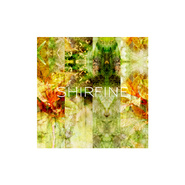
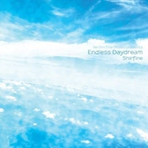
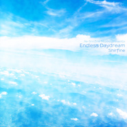
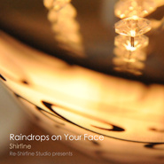

Shirfine
============================

|  |  |
| :--: | :-- |
| [<br>Shirfine](https://i.xiami.com/shirfine) | **地区**: China 中国大陆<br>**风格**: 爵士说唱 Jazz Rap, 器乐独奏 Solo Instrumental, 电子 Electronic, 轻音乐 Easy Listening, 新世纪音乐 New Age<br>**播放数**: 6780280<br>**粉丝数**: 16868<br>**评论数**: 709<br> |

## 档案

<div>
女<br>
Indie Musician/ Pianist/ Composer/ Arranger/ Producer/ Animator/ Visual Artist<br>
无争与世，不染于泥。<br>
- 简介 -<br>
Shirfine，来自福建福州的独立音乐人。华中师范大学IT系数字媒体学士，现于美国攻读电影与动画硕士。因其空灵纯净、旋律优美、舒缓治愈的音乐而广为人知。自3岁半时第一次接触钢琴后，她开始自学，并始终相信着艺术创作不该受到各种条条框框的规则限制，因而形成了自己独有的音乐风格。15岁时Shirfine得到了她的第一架钢琴，并由此开始了作曲之路。<br>
长期广泛欣赏着各类音乐风格，自古典至电子，主流至小众，但她从未如此深感触动与鼓舞并深陷其中直到接触了Jazz Hip Hop。受此类优美音乐的启发，融合自小吸收的一切音乐熏陶，她钻研出了自己的创作手法并创造了不失Shirfine印记独属于她的音乐风格。<br>
20岁时，Shirfine于2011年12月20日正式发布了第一首原创作品《Warm Winter》，并包揽了作曲、编曲与制作。这成为她音乐生涯的起点。隔年，于2012年10月18日Shirfine独立发布了首张钢琴原创专辑《Every Piece of Love and Misery》，每一首曲子都包含了她对正在经历着的人生的深刻体会，这也是她人生中非常特殊的一段时期。专辑发布后，广获各方持续良久的一致好评，仅在虾米网和网易云音乐上就收到了共超过600万的播放量。其中的单曲《Imaginary Kiss》荣登新浪音乐播放热榜第35周top 3和第36周top 6。首专《Every Piece of Love and Misery》与其中的单曲《Breathless》分别被由豆瓣网举办的阿比鹿音乐奖提名为2012年度轻音乐单元的年度专辑与年度单曲。此外，自2012年到2014年间，Shirfine连续被三届阿比鹿音乐奖提名为年度音乐人，并于2013年荣获了该奖。随后，在未正式发行仅放出试听的情况下，《Sweet Lies》一曲在新浪音乐上一举获得22万试听量。2014年，当她以“白日梦”为主题概念的EP《Endless Daydream》正式发布后，其中的单曲《Illusionary Daytime》作为独具Shirfine式古典情怀新解的个人风格代表作之一，大获听众赞赏而成为热门单曲。<br>
她的音乐作品不仅广获国内小众独立音乐听众与推广人的喜爱与认可，也受到来自国外Jazz Hip Hop推广人、制作人以及美国著名音乐杂志The FADER的青睐与欣赏，另外不乏受到曾发行过Nils Frahm、小濑村晶等各国先锋钢琴家作品的世界新古典/实验古典厂牌1631 Recordings的关注。其作品还曾被英国厂牌Cult Classic Records收录，并受其创始人之邀，今后将与厂牌之下各位优秀制作人合作呈现新作。<br>
Shirfine的音乐主要以自己的原创钢琴旋律为基础，融合弦乐、电子与鼓点等元素，曲风优美空灵、清新舒缓。听众们常被其作品吸引入一个宁静、虚幻和脱俗的世界里，她称之为Neverland。经她烹调的音乐呈现出多种可能性，即有偏向清新治愈的曲调亦有诠释古风新貌的作品。她不会将音乐局限在一种单一的风格内，也不愿明确界定自己的音乐流派，希望挖掘出自己钢琴作品的各种可能性并尝试更多的新风格，使之多元化却又于她的编排之下具有一定的统一性。<br>
最初，在大学期间主修IT系数字媒体时，Shirfine制作音乐只是为了给自己编导的艺术短片做配乐，却无心插柳因做音乐而让越来越多的听众认识了她。到目前为止，已发布的两张专辑都由其独立作曲、编曲、制作与发行，包括封面设计与内页摄影也均由其一人创作完成。一路秉承着“Music itself tells everything”的理念，相信艺术本该纯粹，不做任何营销与商业推广，Shirfine的音乐生涯和她的作品一样，始终沁润着“无争与世，不染于泥”的处世态度，逐渐于她的音乐及视觉设计等作品里形成了独特的美学风格。于她而言，任何一种艺术表达形式都是相通的，它们最终都是她内心世界的延伸。<br>
除了作为一名独立音乐人外，目前Shirfine经营着自己的独立工作室，作品主要发布于海外，创作音乐的同时，也进行着视觉艺术设计与独立艺术短片的创作。
</div>

## 专辑

| 名称 | 语种 | 唱片公司 | 发行时间 | 专辑类别 | 专辑风格 |
| :--: | :-- | :-- | :-- | :-- | :-- |
| [<br>Illusionary Daytime](./albums/5022148698.md) | 纯音乐 | I. S. | 2020年12月10日 | EP, 单曲 | 世界音乐 World Music |
| [<br>Endless Daydream无尽白日梦](./albums/692341572.md) | 其他 | Re-Shirfine Studio | 2014年02月14日 | EP, 单曲 | 新世纪音乐 New Age |
| [<br>Raindrops on Your Face](./albums/2090058674.md) | 其他 | Re-Shirfine Studio | 2014年01月18日 | EP, 单曲 |  |
| [<br>Every Piece of Love and Misery](./albums/548965.md) | 其他 | Re-Shirfine Studio | 2012年10月18日 | 录音室专辑 |  |

## 评论

|  |  |  |
| :-- | :-- | :-- |
| <br>[虾米用户](https://emumo.xiami.com/u/300184210)<br>我爱虾米，求虾米不要停运<br>2021-01-17 14:34<br>赞(0) 踩(0) | <div>本来想虾米买的幻昼，无奈虾米要关闭了，只能去网易云买了:-(</div> |
| <br>[虾米用户](https://emumo.xiami.com/u/286598418)<br>我记住了他的样子，我不知...<br>2020-12-12 01:54<br>赞(0) 踩(0) | <div>揣着6块买来的Frozen World想听到更新</div> |
| <br>[虾米用户](https://emumo.xiami.com/u/376174816)<br>音乐是一种排列有序的声音...<br>2020-11-29 22:10<br>赞(1) 踩(0) | <div>你好！我今天是第一次认识你，我英文不好，记不住你的名字，对不住了。原来以前就听过你的作品，非常好听，很喜欢你曲子里表达的意境。加油 </div> |
| <br>[虾米用户](https://emumo.xiami.com/u/48372935)<br>漂流群已满，请移步虾米绿...<br>2020-11-04 23:34<br>赞(0) 踩(0) | <div>不多说了，加油(ง &amp;bull;̀_&amp;bull;́)ง<br>支持你 </div> |
| <br>[虾米用户](https://emumo.xiami.com/u/28552334)<br>Gibran<br>2020-10-27 10:27<br>赞(0) 踩(0) | <div>真的很多优秀的曲子，点赞</div> |
| <br>[虾米用户](https://emumo.xiami.com/u/7684210)<br>命中注定<br>2020-10-26 13:29<br>赞(0) 踩(0) | <div>一万多的关注看到还是蛮高的，就知道一定创作了广为传颂的神曲，果不其然，热门第一首就是去年国庆期间短视频用烂的 </div> |
| <br>[虾米用户](https://emumo.xiami.com/u/431333317)<br><br>2020-08-13 09:27<br>赞(0) 踩(0) | <div>加油</div> |
| <br>[虾米用户](https://emumo.xiami.com/u/364546789)<br>嘛！这个还差点意思<br>2020-07-01 11:05<br>赞(0) 踩(0) | <div>谢谢你</div> |
| <br>[虾米用户](https://emumo.xiami.com/u/198306030)<br> <br>2020-05-28 08:41<br>赞(0) 踩(0) | <div>请继续，不要停止你内心真正的创作！！一曲动心长，两曲费思量。三曲疑才进，四曲意彷徨。</div> |
| <br>[虾米用户](https://emumo.xiami.com/u/440443150)<br>虾米再见，后摇再见（已至...<br>2020-05-23 07:53<br>赞(0) 踩(0) | <div>特别喜欢你，越来越好吧！</div> |
| <br>[虾米用户](https://emumo.xiami.com/u/1544552)<br>暂无签名~<br>2020-05-16 08:37<br>赞(0) 踩(0) | <div>十年前关注的你，你居然火了</div> |
| <br>[虾米用户](https://emumo.xiami.com/u/72981652)<br>所求皆如愿   所行化坦...<br>2020-04-16 09:21<br>赞(1) 踩(0) | <div>我发现了宝藏 </div> |
| <br>[虾米用户](https://emumo.xiami.com/u/339716643)<br>支边去了，我要淡定，一切...<br>2020-02-15 22:13<br>赞(0) 踩(0) | <div>几年了啊～没有新作品了……</div> |
| <br>[虾米用户](https://emumo.xiami.com/u/419398496)<br><br>2020-02-04 12:20<br>赞(0) 踩(0) | <div>萌妹</div> |
| <br>[虾米用户](https://emumo.xiami.com/u/437296350)<br><br>2020-01-20 13:38<br>赞(0) 踩(0) | <div>很美的歌曲，非常喜欢，谢谢</div> |
| <br>[虾米用户](https://emumo.xiami.com/u/326075021)<br><br>2020-01-16 00:17<br>赞(0) 踩(0) | <div>很棒哦！！！</div> |
| <br>[虾米用户](https://emumo.xiami.com/u/326075021)<br><br>2020-01-16 00:16<br>赞(0) 踩(0) | <div>作者加油加油加油！</div> |
| <br>[虾米用户](https://emumo.xiami.com/u/3190831)<br><br>2020-01-13 19:20<br>赞(1) 踩(0) | <div>支持，加油</div> |
| <br>[虾米用户](https://emumo.xiami.com/u/140110990)<br>你看，这条鱼被上帝抛上了...<br>2019-12-21 20:34<br>赞(0) 踩(0) | <div>很抱歉  也很遗憾   还是很喜欢呀</div> |
| <br>[虾米用户](https://emumo.xiami.com/u/379943072)<br>已经忘记为什么不要写错别...<br>2019-12-17 22:21<br>赞(1) 踩(0) | <div>好棒的音乐，足够的纯粹，没有任何拖泥带水，等我赚到第一桶金一卖下这些专辑。借歌为动力，努力学习！加油！</div> |
| <br>[虾米用户](https://emumo.xiami.com/u/3250268)<br>一首好歌都比爱一个人长久...<br>2019-12-04 11:15<br>赞(0) 踩(0) | <div>真的很棒  支持  </div> |
| <br>[虾米用户](https://emumo.xiami.com/u/342363574)<br><br>2019-11-22 02:13<br>赞(1) 踩(0) | <div>这管乐器是什么？可以再低沉一点就更好听了</div> |
| <br>[虾米用户](https://emumo.xiami.com/u/348137417)<br><br>2019-11-19 23:03<br>赞(0) 踩(0) | <div></div> |
| <br>[虾米用户](https://emumo.xiami.com/u/348137417)<br><br>2019-11-19 23:02<br>赞(2) 踩(0) | <div>我们中国的音乐家也可以做出这么棒的new age太好听了！   </div> |
| <br>[虾米用户](https://emumo.xiami.com/u/404026779)<br><br>2019-11-13 20:32<br>赞(0) 踩(0) | <div>，</div> |
| <br>[虾米用户](https://emumo.xiami.com/u/7200539)<br><br>2019-11-12 04:17<br>赞(19) 踩(0) | <div>很厉害的音乐人，国内不缺唱歌的，缺的是真正做音乐的</div> |
| <br>[虾米用户](https://emumo.xiami.com/u/81899102)<br>发乎情；止于礼。深埋于心...<br>2019-10-31 14:03<br>赞(3) 踩(0) | <div>。<br>作者大才，望一路走下去。<br>远在异国他乡，多留点心，没坏处。安全不要嫌多。<br><br>……</div> |
| <br>[虾米用户](https://emumo.xiami.com/u/81899102)<br>发乎情；止于礼。深埋于心...<br>2019-10-24 02:05<br>赞(0) 踩(0) | <div>。</div> |
| <br>[虾米用户](https://emumo.xiami.com/u/430971872)<br>来着湖北孝感的男孩，生于...<br>2019-10-22 18:08<br>赞(0) 踩(0) | <div>加油</div> |
| <br>[虾米用户](https://emumo.xiami.com/u/81899102)<br>发乎情；止于礼。深埋于心...<br>2019-10-20 23:13<br>赞(0) 踩(0) | <div>。</div> |
| <br>[虾米用户](https://emumo.xiami.com/u/50696402)<br>山水有清音。<br>2019-10-18 11:56<br>赞(1) 踩(0) | <div>❤️❤️由衷的支持！</div> |
| <br>[虾米用户](https://emumo.xiami.com/u/421362377)<br><br>2019-10-09 19:52<br>赞(2) 踩(0) | <div>这是你创作的音乐吗？太好听了！</div> |
| <br>[虾米用户](https://emumo.xiami.com/u/27857090)<br>有朝一日<br>2019-09-19 03:53<br>赞(0) 踩(0) | <div>加油</div> |
| <br>[虾米用户](https://emumo.xiami.com/u/283040611)<br>不忘初心，方得始终。<br>2019-09-18 15:05<br>赞(2) 踩(0) | <div>你的音乐有自己的想法，<br>特殊 而又有魅力<br>是我目前唯一接受的悲伤类纯音乐。 </div> |
| ⇒ | <br>[虾米用户](https://emumo.xiami.com/u/283040611)<br>不忘初心，方得始终。<br>2019-09-18 15:07<br>赞(0) 踩(0) | <div>也不全是悲伤吧</div> |
| <br>[虾米用户](https://emumo.xiami.com/u/429835521)<br>不要让愤怒毁灭自己<br>2019-09-17 22:00<br>赞(0) 踩(0) | <div>不谢，应该做的</div> |
| <br>[虾米用户](https://emumo.xiami.com/u/9939410)<br><br>2019-09-15 20:02<br>赞(0) 踩(0) | <div>付费</div> |
| <br>[虾米用户](https://emumo.xiami.com/u/351438760)<br>某个喜欢日语的神经质一枚...<br>2019-09-15 10:13<br>赞(3) 踩(0) | <div>我们不需要关心别人的想法或谈话。如果你知道自己是谁，没有人可以改变你的判断。</div> |
| <br>[虾米用户](https://emumo.xiami.com/u/301053011)<br>我还没想好要写什么...<br>2019-09-11 01:13<br>赞(0) 踩(0) | <div>期待你的下首神曲</div> |
| <br>[虾米用户](https://emumo.xiami.com/u/97286038)<br>加油睡男神<br>2019-08-29 23:12<br>赞(1) 踩(0) | <div>望早日学成归来</div> |
| <br>[虾米用户](https://emumo.xiami.com/u/400071096)<br><br>2019-07-30 00:38<br>赞(1) 踩(0) | <div>小姐姐，您是画插画的，我是插画爱好者，到哪里能找到您的插画作品。我想收藏一些 </div> |
| <br>[虾米用户](https://emumo.xiami.com/u/407421982)<br><br>2019-07-17 23:28<br>赞(3) 踩(0) | <div>听您的歌曲，真的很有一种不同的轻灵和自然</div> |
| <br>[虾米用户](https://emumo.xiami.com/u/380199215)<br>现实世界中流民，来听音乐...<br>2019-07-11 09:30<br>赞(1) 踩(0) | <div>很牛逼啊这人</div> |
| <br>[虾米用户](https://emumo.xiami.com/u/237112673)<br><br>2019-06-09 21:11<br>赞(1) 踩(0) | <div>居然是中国人？！  </div> |
| <br>[虾米用户](https://emumo.xiami.com/u/324879742)<br> <br>2019-03-08 02:02<br>赞(0) 踩(0) | <div>.</div> |
| <br>[虾米用户](https://emumo.xiami.com/u/408222138)<br><br>2019-02-17 15:48<br>赞(0) 踩(0) | <div>我和作者一样都是90后白羊座的 </div> |
| <br>[虾米用户](https://emumo.xiami.com/u/332765835)<br><br>2019-02-11 12:22<br>赞(0) 踩(0) | <div>感谢，很好的音乐</div> |
| <br>[虾米用户](https://emumo.xiami.com/u/48079021)<br>曲肱支依眠，寒风吹枕边。<br>2018-12-29 23:51<br>赞(0) 踩(0) | <div>新专辑啥时候出，盼着了？</div> |
| <br>[虾米用户](https://emumo.xiami.com/u/831786)<br>人已老，歌不老<br>2018-10-16 13:55<br>赞(0) 踩(0) | <div>灵动啊</div> |
| <br>[虾米用户](https://emumo.xiami.com/u/48079021)<br>曲肱支依眠，寒风吹枕边。<br>2018-06-04 20:35<br>赞(0) 踩(0) | <div>期待新作&amp;hellip;</div> |
| <br>[虾米用户](https://emumo.xiami.com/u/20177386)<br>感谢一切美好的遇见❤️<br>2018-04-02 19:25<br>赞(0) 踩(0) | <div></div> |
| <br>[虾米用户](https://emumo.xiami.com/u/195632921)<br><br>2017-12-18 23:53<br>赞(23) 踩(0) | <div>网易云和虾米有冲突么？都是平台，相较之下一个扎根深，一个势头大 如此而已。最近开始用虾米，没有曲库不习惯，但很多人从虾米到别的平台也如此吧。小姐姐的曲子很好听，作为听众我对版权不是很了解，但我只是希望能听到令人心动的音乐，仅此罢了。版权处理好的话，就能听到更多的好听的曲子了不是么，所以希望新曲能快些呢(｡･ω･｡)ﾉ♡此祝</div> |
| ⇒ | <br>[虾米用户](https://emumo.xiami.com/u/52683150)<br><br>2018-07-05 09:32<br>赞(0) 踩(0) | <div>曲库可以跨平台移植的</div> |
| <br>[虾米用户](https://emumo.xiami.com/u/251556439)<br><br>2017-12-09 15:17<br>赞(0) 踩(0) | <div>喜欢</div> |
| <br>[虾米用户](https://emumo.xiami.com/u/333419963)<br><br>2017-11-05 20:40<br>赞(0) 踩(0) | <div>有一个专辑为什么没有</div> |
| <br>[虾米用户](https://emumo.xiami.com/u/3824231)<br><br>2017-10-27 23:30<br>赞(29) 踩(0) | <div>我还以为这种风格的音乐只有日本人写的出来，没想到是中国人！太让人欣慰了，支持你，女神！！</div> |
| ⇒ | <br>[虾米用户](https://emumo.xiami.com/u/22625109)<br><br>2020-09-18 11:44<br>赞(0) 踩(0) | <div>我也以为是哪个外国大神的作品，一看是自己家的简直不要太惊喜，难怪那么配我们的影视剪辑</div> |
| <br>[虾米用户](https://emumo.xiami.com/u/329798121)<br>原谅不美好。<br>2017-10-12 14:21<br>赞(2) 踩(0) | <div>喜欢得很纯粹。</div> |
| <br>[虾米用户](https://emumo.xiami.com/u/19489616)<br>大四。。。<br>2017-10-05 11:44<br>赞(0) 踩(0) | <div>能买一整个专辑伐？</div> |
| <br>[虾米用户](https://emumo.xiami.com/u/15477519)<br>爱  是生命的和弦，而不...<br>2017-09-26 10:37<br>赞(1) 踩(0) | <div>不错呢&amp;hellip;</div> |
| <br>[虾米用户](https://emumo.xiami.com/u/295579007)<br><br>2017-07-27 18:45<br>赞(0) 踩(0) | <div>虾米今天猜对了，这个歌单适合我现在有点糟的心情</div> |
| <br>[虾米用户](https://emumo.xiami.com/u/313469992)<br><br>2017-07-19 22:23<br>赞(3) 踩(0) | <div>国内还是太浮躁，而且多数听众也不喜欢这类音乐</div> |
| <br>[虾米用户](https://emumo.xiami.com/u/700453)<br>虾米再见<br>2017-07-04 19:47<br>赞(3) 踩(0) | <div>支持维权 很想用您的音乐 但是如何购买版权?</div> |
| <br>[虾米用户](https://emumo.xiami.com/u/48079021)<br>曲肱支依眠，寒风吹枕边。<br>2017-07-03 22:02<br>赞(0) 踩(0) | <div>没得新专辑</div> |
| <br>[虾米用户](https://emumo.xiami.com/u/4401950)<br><br>2017-07-01 21:51<br>赞(0) 踩(0) | <div>支持维权</div> |
| <br>[虾米用户](https://emumo.xiami.com/u/12265724)<br>HOUSE×TRANCE<br>2017-07-01 14:30<br>赞(2) 踩(0) | <div>祝美帝念书顺利！话说好多听众似乎比较鄙视某某云啊，莫非听歌的平台比歌曲本身还重要不成？平台什么的如同浮云一样。作为听众，无非关注一首歌①好不好听 ②价格贵不贵 ③是不是正版 而已。显然每位听众对这三个问题的回答都是不一样的，对这三个问题的回答没有客观标准，都是相对于每个人自己的具体情况而言的。就我个人，一首歌首先必须好听，否则就直接切歌了。其次，如果价格不贵，又确实是正版授权，我就买；如果价格很贵，要是能在线听的话，在线听听就好；如果价格离谱，又不让在线听，那我又何必一棵树上吊死呢？</div> |
| <br>[虾米用户](https://emumo.xiami.com/u/10129806)<br>暂无签名~<br>2017-07-01 12:25<br>赞(0) 踩(0) | <div>哈哈！学业加油！期待更好的作品 </div> |
| <br>[虾米用户](https://emumo.xiami.com/u/1923255)<br>  云雷， 屯 ，君子以...<br>2017-07-01 12:13<br>赞(0) 踩(0) | <div>依旧很舒心 很温柔的曲子</div> |
| ⇒ | <br>[虾米用户](https://emumo.xiami.com/u/54686131)<br>要听更多喜欢的歌~~~<br>2017-07-01 13:42<br>赞(0) 踩(0) | <div>哟，你也在听</div> |
| ⇒ | <br>[虾米用户](https://emumo.xiami.com/u/1923255)<br>  云雷， 屯 ，君子以...<br>2017-07-01 16:56<br>赞(0) 踩(0) | <div><q><b>随风说：</b></q></div> |
| <br>[虾米用户](https://emumo.xiami.com/u/264718981)<br><br>2017-06-23 19:47<br>赞(2) 踩(0) | <div>《幻昼》实在太好听了   </div> |
| <br>[虾米用户](https://emumo.xiami.com/u/2491381)<br>只不过是个<br>2017-06-21 16:01<br>赞(0) 踩(0) | <div>居然不更新了吗。frozen world当年手机里有的，换了新机子想再下要收费。那就买呗。居然跟我说去网易&amp;hellip;不太开心。</div> |
| <br>[虾米用户](https://emumo.xiami.com/u/31709801)<br>还活着，真的是太好了.....<br>2017-06-05 18:36<br>赞(0) 踩(0) | <div>看到了简介里的一句话，不争于世？不染于泥？</div> |
| <br>[虾米用户](https://emumo.xiami.com/u/31709801)<br>还活着，真的是太好了.....<br>2017-06-05 18:32<br>赞(2) 踩(0) | <div>对啊，小姐姐，才华确实是不会被软件所限制，但是对真正喜欢音乐来说，网易云绝对不是选择，我从来没有见过那么花哨虚荣的音乐播放器，可能也是我接触的少，虽然先不说虾米多么优秀(这个新版本的确蛋疼)，但是虾米这个平台的确称得上是一方净土，至于网易云，就不清楚了，因为用了几天就被我抛弃了。</div> |
| <br>[虾米用户](https://emumo.xiami.com/u/9108985)<br><br>2017-06-04 22:05<br>赞(8) 踩(0) | <div>要是认真做音乐的话，虾米仍旧是个很好的平台，网易和百度那太多灌水炒作的人在玩票，很容易被拖下水，如果你在国外的话可以试着在youtube或4chan上投稿上传自己的原创音乐，你的曲风比较轻柔，旋律也很和谐，欧美和日本地区有不少音乐发烧友喜欢这类型的音乐，独乐乐不如众乐乐，许多原先不知名的音乐人也是在把作品上传到这两个网站后因而一炮走红，总之祝你好运吧。</div> |
| ⇒ | <br>[虾米用户](https://emumo.xiami.com/u/1814727)<br>Neverland<br>2017-06-05 19:34<br>赞(0) 踩(0) | <div>双方平台的问题确实存在，各有优劣，都不太理想。环境与政策也是一部分原因，无奈没有太多时间精力在国内继续。别担心，今后在美国发展，认真做些东西就好。听众也不用局限于此，全球大部分的音乐平台都已同步上架。</div> |
| ⇒ | <br>[虾米用户](https://emumo.xiami.com/u/81899102)<br>发乎情；止于礼。深埋于心...<br>2019-10-20 23:07<br>赞(0) 踩(0) | <div><q><b>Shirfine说：</b></q></div> |
| ⇒ | <br>[虾米用户](https://emumo.xiami.com/u/19826008)<br>猪一样的存在<br>2019-10-29 18:10<br>赞(0) 踩(0) | <div><q><b>Shirfine说：</b></q></div> |
| <br>[虾米用户](https://emumo.xiami.com/u/55488208)<br>自己的音乐，一个人安静地...<br>2017-06-04 02:03<br>赞(0) 踩(0) | <div>最喜欢chasing the light和warm  winter，希望她能够创造出更好的音乐。</div> |
| <br>[虾米用户](https://emumo.xiami.com/u/9674116)<br>欢迎来到小酒馆。<br>2017-05-20 00:22<br>赞(47) 踩(0) | <div>小姐姐也要知道网易云一开始也是盗虾米的曲库才有今天的。希望回来一起守住这片净土。</div> |
| ⇒ | <br>[虾米用户](https://emumo.xiami.com/u/373652009)<br>骨灰级处女座，古风填词。...<br>2019-11-29 18:52<br>赞(0) 踩(0) | <div>虾米就是当年的songtaste，很怀念我上学的时候能有ta的陪伴。</div> |
| ⇒ | <br>[虾米用户](https://emumo.xiami.com/u/86664394)<br><br>2020-01-27 16:04<br>赞(0) 踩(0) | <div><q><b>爱新小白说：</b></q></div> |
| <br>[虾米用户](https://emumo.xiami.com/u/31709801)<br>还活着，真的是太好了.....<br>2017-05-19 17:09<br>赞(4) 踩(0) | <div>小姐姐，我很喜欢你的音乐，但是为了你一个人抛弃虾米去网易云那是不可能的，就是有像我这么一部分人，谢谢小姐姐的音乐，不更新就不更新，这些也够听。</div> |
| ⇒ | <br>[虾米用户](https://emumo.xiami.com/u/313469992)<br><br>2017-07-19 22:20<br>赞(0) 踩(0) | <div>我就是网易云来的，说实在的还是虾米好</div> |
| ⇒ | <br>[虾米用户](https://emumo.xiami.com/u/31709801)<br>还活着，真的是太好了.....<br>2017-07-20 14:43<br>赞(0) 踩(0) | <div><q><b>花灯夜说：</b></q></div> |
| <br>[虾米用户](https://emumo.xiami.com/u/31709801)<br>还活着，真的是太好了.....<br>2017-05-19 17:05<br>赞(3) 踩(0) | <div>唯一正版？网易云？网易云什么鬼？</div> |
| <br>[虾米用户](https://emumo.xiami.com/u/61885926)<br><br>2017-05-02 21:46<br>赞(0) 踩(0) | <div>简直每一个音符，把我敲碎，再重组。我想等到每次重听不同的心境，便是蜕变</div> |
| <br>[虾米用户](https://emumo.xiami.com/u/260686400)<br><br>2017-04-12 00:14<br>赞(0) 踩(0) | <div>谢谢</div> |
| <br>[虾米用户](https://emumo.xiami.com/u/260686400)<br><br>2017-04-12 00:14<br>赞(0) 踩(0) | <div>嘿嘿</div> |
| <br>[虾米用户](https://emumo.xiami.com/u/36673521)<br>a shi sou r ...<br>2017-04-10 12:09<br>赞(1) 踩(0) | <div>？？花钱下载难道不是应该的</div> |
| <br>[虾米用户](https://emumo.xiami.com/u/92865798)<br><br>2017-04-07 13:15<br>赞(0) 踩(0) | <div>为什么还要钱才能下载，很难受</div> |
| <br>[虾米用户](https://emumo.xiami.com/u/260686400)<br><br>2017-04-06 19:42<br>赞(1) 踩(0) | <div>超喜欢幻昼！！！</div> |
| ⇒ | <br>[虾米用户](https://emumo.xiami.com/u/5854459)<br>潮牌https://dw...<br>2017-04-09 09:03<br>赞(0) 踩(0) | <div>我也最喜欢她的这首曲子。。</div> |
| <br>[虾米用户](https://emumo.xiami.com/u/5854459)<br>潮牌https://dw...<br>2017-04-05 17:25<br>赞(0) 踩(0) | <div>祝贺又即将开始新的人生阶段！~~</div> |
| <br>[虾米用户](https://emumo.xiami.com/u/274131336)<br>Onetravel.<br>2017-03-25 13:28<br>赞(0) 踩(0) | <div>加油！</div> |
| <br>[虾米用户](https://emumo.xiami.com/u/2616226)<br><br>2017-03-24 11:51<br>赞(1) 踩(0) | <div>赞扬听太多了不是好事，别忘了初衷，别陨落</div> |
| <br>[虾米用户](https://emumo.xiami.com/u/36164313)<br>无<br>2016-11-21 13:51<br>赞(0) 踩(0) | <div>超喜欢的那首sweet lies  找不到了</div> |
| <br>[虾米用户](https://emumo.xiami.com/u/236020725)<br>勿扰……<br>2016-11-08 14:08<br>赞(2) 踩(0) | <div>好美的旋律，美的可以用人生若只如初见来形容！！！</div> |
| <br>[虾米用户](https://emumo.xiami.com/u/54369727)<br>这家伙真的很聪明什么也没...<br>2016-09-17 22:29<br>赞(2) 踩(0) | <div>再没有sweet lies我就要死了，付钱也行，给我听  </div> |
| <br>[虾米用户](https://emumo.xiami.com/u/49105636)<br>半透明<br>2016-08-18 10:15<br>赞(0) 踩(0) | <div>支持作者</div> |
| <br>[虾米用户](https://emumo.xiami.com/u/7689467)<br><br>2016-08-15 09:41<br>赞(0) 踩(0) | <div>超喜欢Love Fragments，旋律独特清新脱俗，我仿佛闻到了绿草的清香~</div> |
| <br>[虾米用户](https://emumo.xiami.com/u/1259401)<br><br>2016-08-12 20:43<br>赞(32) 踩(0) | <div>作者你知道你的音乐被央视纪录片抄袭了吗？我在飞机上看的，叫做《喜的传承》？如果没征求你的同意，真的很讨厌好音乐被不授权使用，你有机会可以去证实一下，支持原创，支持你！</div> |
| ⇒ | <br>[虾米用户](https://emumo.xiami.com/u/1814727)<br>Neverland<br>2016-09-04 14:22<br>赞(0) 踩(0) | <div>感谢告知，核实后我会依法维权。针对这几年我的音乐被盗用山寨侵权的各种行为随后我会发表一份正式声明。去年已经联合相关机构清扫了未授权合辑和未授权入库，接下来会加大力度维权，走法律程序，不再保持沉默。</div> |
| ⇒ | <br>[虾米用户](https://emumo.xiami.com/u/313469992)<br><br>2017-07-19 22:16<br>赞(0) 踩(0) | <div><q><b>Shirfine说：</b></q></div> |
| ⇒ | <br>[虾米用户](https://emumo.xiami.com/u/54785916)<br>碧海潮生按玉萧<br>2017-08-04 19:47<br>赞(0) 踩(0) | <div><q><b>Shirfine说：</b></q></div> |
| ⇒ | <br>[虾米用户](https://emumo.xiami.com/u/8283274)<br><br>2017-11-27 21:18<br>赞(0) 踩(0) | <div>羊屎何止一个纪录片抄袭，每个纪录片的背景音乐都在抄袭</div> |
| ⇒ | <br>[虾米用户](https://emumo.xiami.com/u/311509776)<br>我还没想好要写什么...<br>2018-02-22 18:21<br>赞(0) 踩(0) | <div>好像是电视播放可以不用授权，但是要交一定的费用，似乎有一条法律是这样规定的。</div> |
| ⇒ | <br>[虾米用户](https://emumo.xiami.com/u/4744603)<br>生活万岁<br>2020-12-11 12:08<br>赞(0) 踩(0) | <div><q><b>桃花岛主说：</b></q></div> |
| <br>[虾米用户](https://emumo.xiami.com/u/27728459)<br> <br>2016-07-14 23:23<br>赞(2) 踩(0) | <div>有些人一听是国人原创的，又开始狐假虎威似的开始指点江山了，滚犊子好么？</div> |
| <br>[虾米用户](https://emumo.xiami.com/u/51597118)<br>   我也不会再对谁满怀...<br>2016-07-11 18:59<br>赞(1) 踩(0) | <div>这种音乐值得花钱买.</div> |
| <br>[虾米用户](https://emumo.xiami.com/u/51597118)<br>   我也不会再对谁满怀...<br>2016-07-11 18:59<br>赞(2) 踩(0) | <div>无争于世 不染于泥.</div> |
| <br>[虾米用户](https://emumo.xiami.com/u/54369727)<br>这家伙真的很聪明什么也没...<br>2016-07-06 00:07<br>赞(30) 踩(0) | <div>illusionary daytime简直太出色了</div> |
| <br>[虾米用户](https://emumo.xiami.com/u/4369495)<br>此心沉静<br>2016-07-02 17:55<br>赞(1) 踩(0) | <div>其实，你的音乐很没有特色</div> |
| <br>[虾米用户](https://emumo.xiami.com/u/2988078)<br><br>2016-06-19 14:16<br>赞(0) 踩(0) | <div>近来几天去搭广州地铁，在站台好像听到shirfine 的音乐……</div> |
| <br>[虾米用户](https://emumo.xiami.com/u/5642099)<br>我还没想好要写什么...<br>2016-06-11 22:24<br>赞(0) 踩(0) | <div>大赞啊！</div> |
| <br>[虾米用户](https://emumo.xiami.com/u/157597682)<br>弄乐<br>2016-05-31 17:51<br>赞(0) 踩(0) | <div>罕有的女制作人</div> |
| <br>[虾米用户](https://emumo.xiami.com/u/10270975)<br>好好学习天天向上<br>2016-05-29 11:23<br>赞(0) 踩(0) | <div>喜欢</div> |
| <br>[虾米用户](https://emumo.xiami.com/u/31709801)<br>还活着，真的是太好了.....<br>2016-05-25 21:29<br>赞(0) 踩(0) | <div>姐姐，你所有音乐都值得我购买。</div> |
| <br>[虾米用户](https://emumo.xiami.com/u/10924968)<br>有的人20岁就死了70岁...<br>2016-05-09 07:59<br>赞(0) 踩(0) | <div>无争与世, 不染于泥</div> |
| <br>[虾米用户](https://emumo.xiami.com/u/36673521)<br>a shi sou r ...<br>2016-05-04 23:41<br>赞(0) 踩(0) | <div>wow</div> |
| <br>[虾米用户](https://emumo.xiami.com/u/6873604)<br>喜则留<br>2016-05-04 09:53<br>赞(1) 踩(0) | <div>可以更好</div> |
| <br>[虾米用户](https://emumo.xiami.com/u/35785521)<br>回归<br>2016-04-21 11:48<br>赞(0) 踩(0) | <div>中国文化环境不太容易孕育出真正的音乐家，唔，无所谓，</div> |
| <br>[虾米用户](https://emumo.xiami.com/u/35785521)<br>回归<br>2016-04-21 11:45<br>赞(0) 踩(0) | <div>中国人。。。。。鼓励吧，建议曲艺从叙事入门开篇，不然会显得空洞乏味，作品会不成熟</div> |
| <br>[虾米用户](https://emumo.xiami.com/u/10904636)<br>Love is The ...<br>2016-04-21 04:21<br>赞(2) 踩(0) | <div>BATS and Shirfine</div> |
| ⇒ | <br>[虾米用户](https://emumo.xiami.com/u/10607774)<br><br>2016-12-17 13:38<br>赞(0) 踩(0) | <div>再加一个α·pav</div> |
| <br>[虾米用户](https://emumo.xiami.com/u/33121944)<br>@ @<br>2016-04-20 22:44<br>赞(0) 踩(0) | <div>啥。。高大上的计划</div> |
| <br>[虾米用户](https://emumo.xiami.com/u/10036962)<br> <br>2016-03-09 00:25<br>赞(0) 踩(0) | <div>醉了，今晚不打算睡觉了</div> |
| <br>[虾米用户](https://emumo.xiami.com/u/16511667)<br>Official：【集物...<br>2016-02-24 21:03<br>赞(0) 踩(0) | <div>Care.</div> |
| <br>[虾米用户](https://emumo.xiami.com/u/15448741)<br>轻音乐神马的最爱了～<br>2016-02-18 00:58<br>赞(0) 踩(0) | <div>加油</div> |
| <br>[虾米用户](https://emumo.xiami.com/u/49945537)<br>宁静如流水，忌躁，忌乱；<br>2016-02-06 13:30<br>赞(1) 踩(0) | <div>希望所有喜爱音乐的人，都能坚持下去。在这里，愿大家一切都好，虾米也好。</div> |
| <br>[虾米用户](https://emumo.xiami.com/u/49945537)<br>宁静如流水，忌躁，忌乱；<br>2016-02-06 13:27<br>赞(4) 踩(0) | <div>四年了，多少喜爱音乐的艺人，不知是否还在坚持，或者早已抛下，找到新的生活，过的更加美好。对了，音乐挺美。</div> |
| <br>[虾米用户](https://emumo.xiami.com/u/49945537)<br>宁静如流水，忌躁，忌乱；<br>2016-02-06 13:24<br>赞(0) 踩(0) | <div>封面不错，很舒服也有美感</div> |
| <br>[虾米用户](https://emumo.xiami.com/u/49075538)<br>爱笑 简单 清澈 温暖而...<br>2016-02-03 01:58<br>赞(0) 踩(0) | <div></div> |
| <br>[虾米用户](https://emumo.xiami.com/u/33121944)<br>@ @<br>2016-01-29 23:23<br>赞(0) 踩(0) | <div>快两年没新歌啦</div> |
| <br>[虾米用户](https://emumo.xiami.com/u/19959818)<br>我还没想好要写什么...<br>2016-01-15 11:12<br>赞(0) 踩(0) | <div>新专封面很美！期待发布</div> |
| <br>[虾米用户](https://emumo.xiami.com/u/7427638)<br>for those MO...<br>2016-01-13 20:43<br>赞(0) 踩(0) | <div>Starry Starry Night    真心赞 特别喜欢</div> |
| <br>[虾米用户](https://emumo.xiami.com/u/65304340)<br>这是一个要抽足三斗烟才能...<br>2016-01-12 09:42<br>赞(0) 踩(0) | <div>支持</div> |
| <br>[虾米用户](https://emumo.xiami.com/u/69680544)<br><br>2016-01-10 22:27<br>赞(0) 踩(0) | <div>酷！</div> |
| <br>[虾米用户](https://emumo.xiami.com/u/98773376)<br><br>2016-01-09 20:26<br>赞(0) 踩(0) | <div>好好听 有童真在里面 ～</div> |
| <br>[虾米用户](https://emumo.xiami.com/u/39861541)<br>音乐是世界上最美的语言<br>2016-01-06 19:19<br>赞(0) 踩(0) | <div>拜见大神  </div> |
| <br>[虾米用户](https://emumo.xiami.com/u/47384352)<br><br>2015-12-30 02:19<br>赞(0) 踩(0) | <div></div> |
| <br>[虾米用户](https://emumo.xiami.com/u/17723049)<br>都说爬的越高 摔得越残 ...<br>2015-12-27 13:31<br>赞(0) 踩(0) | <div>什么时候出新专辑，等的好辛苦~</div> |
| <br>[虾米用户](https://emumo.xiami.com/u/41163024)<br>I’m done.<br>2015-12-26 06:34<br>赞(0) 踩(0) | <div></div> |
| <br>[虾米用户](https://emumo.xiami.com/u/15280328)<br>开朗之人双足踏四方，沉着...<br>2015-12-15 18:55<br>赞(0) 踩(0) | <div>听了这么久现在才知道不是日本的。</div> |
| <br>[虾米用户](https://emumo.xiami.com/u/35326140)<br>跳动的心跟随跳动的音符<br>2015-12-09 22:15<br>赞(0) 踩(0) | <div>喜欢你得音乐  也想和你一样去作曲子</div> |
| <br>[虾米用户](https://emumo.xiami.com/u/50504653)<br> <br>2015-11-29 22:06<br>赞(0) 踩(0) | <div>等流量来了继续听！</div> |
| <br>[虾米用户](https://emumo.xiami.com/u/52683150)<br><br>2015-11-29 18:35<br>赞(0) 踩(0) | <div>加油！</div> |
| <br>[虾米用户](https://emumo.xiami.com/u/7942429)<br>爱音乐，爱生活<br>2015-11-29 18:34<br>赞(0) 踩(0) | <div>期待，收藏</div> |
| <br>[虾米用户](https://emumo.xiami.com/u/47695981)<br>咏盛世之史诗，歌轩麟之华...<br>2015-11-29 17:37<br>赞(0) 踩(0) | <div>坐等……！</div> |
| <br>[虾米用户](https://emumo.xiami.com/u/18631407)<br>在所有物是人非的景色里最...<br>2015-11-29 17:31<br>赞(0) 踩(0) | <div>坐等~</div> |
| <br>[虾米用户](https://emumo.xiami.com/u/5052969)<br>.<br>2015-11-29 15:39<br>赞(0) 踩(0) | <div>休息好久了喂</div> |
| ⇒ | <br>[虾米用户](https://emumo.xiami.com/u/1814727)<br>Neverland<br>2015-11-29 17:42<br>赞(0) 踩(0) | <div>实际上没怎么休息,一直在忙,一个人的工作量太大了。</div> |
| ⇒ | <br>[虾米用户](https://emumo.xiami.com/u/81899102)<br>发乎情；止于礼。深埋于心...<br>2019-10-20 23:09<br>赞(0) 踩(0) | <div><q><b>Shirfine说：</b></q></div> |
| ⇒ | <br>[虾米用户](https://emumo.xiami.com/u/430971872)<br>来着湖北孝感的男孩，生于...<br>2019-10-22 18:08<br>赞(0) 踩(0) | <div><q><b>天机2013说：</b></q></div> |
| ⇒ | <br>[虾米用户](https://emumo.xiami.com/u/81899102)<br>发乎情；止于礼。深埋于心...<br>2020-03-09 00:31<br>赞(0) 踩(0) | <div><q><b>未知生物说：</b></q></div> |
| <br>[虾米用户](https://emumo.xiami.com/u/30390986)<br><br>2015-11-21 15:34<br>赞(0) 踩(0) | <div>感觉半夜开车时候听应该很棒……  </div> |
| <br>[虾米用户](https://emumo.xiami.com/u/5567549)<br>connect worl...<br>2015-11-21 01:49<br>赞(1) 踩(0) | <div>棒棒哒</div> |
| <br>[虾米用户](https://emumo.xiami.com/u/672327)<br>眩晕在魅惑之即<br>2015-11-16 15:12<br>赞(0) 踩(0) | <div>喵~~_(:зゝ∠)_</div> |
| <br>[虾米用户](https://emumo.xiami.com/u/80972530)<br>我还没想好要写什么...<br>2015-11-07 21:13<br>赞(0) 踩(0) | <div>看到了作者回复，很赞</div> |
| <br>[虾米用户](https://emumo.xiami.com/u/37840483)<br>再說吧<br>2015-11-04 20:20<br>赞(0) 踩(0) | <div>喜欢。。。。。</div> |
| <br>[虾米用户](https://emumo.xiami.com/u/37840483)<br>再說吧<br>2015-11-04 20:20<br>赞(0) 踩(0) | <div>在贴吧看到 希望可以越来越好嘻嘻</div> |
| <br>[虾米用户](https://emumo.xiami.com/u/8745925)<br> <br>2015-10-30 12:54<br>赞(1) 踩(0) | <div>脑子里突然就蹦出你的旋律 一直循环循环 </div> |
| <br>[虾米用户](https://emumo.xiami.com/u/632923)<br> <br>2015-10-30 03:03<br>赞(2) 踩(0) | <div>中国音乐有希望了! 又逮住一个苗子!</div> |
| <br>[虾米用户](https://emumo.xiami.com/u/12221090)<br>逍遥于天地而心意自得<br>2015-10-25 22:12<br>赞(0) 踩(0) | <div>支持</div> |
| <br>[虾米用户](https://emumo.xiami.com/u/14091078)<br>我还没想好要写什么...<br>2015-10-20 21:00<br>赞(1) 踩(0) | <div>BEAUTIFUL</div> |
| <br>[虾米用户](https://emumo.xiami.com/u/73968680)<br>爱<br>2015-10-15 14:05<br>赞(0) 踩(0) | <div>I CAN FEELING YOU.</div> |
| <br>[虾米用户](https://emumo.xiami.com/u/10472311)<br>无<br>2015-10-06 22:48<br>赞(1) 踩(0) | <div>赞</div> |
| <br>[虾米用户](https://emumo.xiami.com/u/9162740)<br>超越死亡的黑暗<br>2015-10-03 20:35<br>赞(0) 踩(0) | <div>中国轻音乐的希望！而且是我唯一能看得到的希望！</div> |
| <br>[虾米用户](https://emumo.xiami.com/u/33121944)<br>@ @<br>2015-09-14 22:59<br>赞(0) 踩(0) | <div>啦啦啦今年的新砖还没出呀~~~~</div> |
| <br>[虾米用户](https://emumo.xiami.com/u/38487102)<br><br>2015-09-01 14:42<br>赞(1) 踩(0) | <div>在听他的曲子之前我一直以为中国做不出震撼心灵的音乐</div> |
| <br>[虾米用户](https://emumo.xiami.com/u/43457871)<br>biu<br>2015-08-30 19:39<br>赞(0) 踩(0) | <div>曲子都太美了(๑´ㅂ`๑)大爱！！</div> |
| <br>[虾米用户](https://emumo.xiami.com/u/6720658)<br>一悟本体，即是功夫。<br>2015-08-29 19:35<br>赞(5) 踩(0) | <div>求虾主粘几张个人照，一定是气质美女，想的人大家顶起来吧！&amp;gt; v &amp;lt;</div> |
| <br>[虾米用户](https://emumo.xiami.com/u/1544628)<br><br>2015-08-25 22:57<br>赞(0) 踩(0) | <div>Illusionary Daytime</div> |
| <br>[虾米用户](https://emumo.xiami.com/u/17723049)<br>都说爬的越高 摔得越残 ...<br>2015-08-20 22:31<br>赞(0) 踩(0) | <div>真心很喜欢你的音乐，加油</div> |
| <br>[虾米用户](https://emumo.xiami.com/u/5854459)<br>潮牌https://dw...<br>2015-08-20 14:58<br>赞(1) 踩(0) | <div>Illusionary Daytime 幻昼 这首最好听 粉丝们都选错啦 QQ音乐里也是这首播放次数最多  最后祝福这位美女音乐家未来更加棒棒的！</div> |
| <br>[虾米用户](https://emumo.xiami.com/u/42083103)<br>Ein<br>2015-08-15 15:25<br>赞(0) 踩(0) | <div>时隔两月，我又来赞  </div> |
| <br>[虾米用户](https://emumo.xiami.com/u/42083103)<br>Ein<br>2015-08-15 15:25<br>赞(0) 踩(0) | <div>时隔两月，我又来赞  </div> |
| <br>[虾米用户](https://emumo.xiami.com/u/8070377)<br>爱雾瑞性维欧腐漏<br>2015-08-15 13:42<br>赞(1) 踩(0) | <div>菇凉发色不错噢<br>以后去厦门一起喝酒可好哇 ← ← 臭表脸 (刚才发错地方了</div> |
| <br>[虾米用户](https://emumo.xiami.com/u/11231952)<br>听音乐 常愉悦<br>2015-08-11 09:35<br>赞(1) 踩(0) | <div>快粗love fragments的完整版 快被自己的好奇心与满足感给急死了</div> |
| <br>[虾米用户](https://emumo.xiami.com/u/39351079)<br>peace.<br>2015-08-10 13:52<br>赞(0) 踩(0) | <div>0.0</div> |
| <br>[虾米用户](https://emumo.xiami.com/u/14354507)<br>美好音乐相伴<br>2015-08-07 10:41<br>赞(2) 踩(0) | <div>还在为生存苦苦挣扎 羡慕真正白富美的美好生活</div> |
| <br>[虾米用户](https://emumo.xiami.com/u/54517647)<br><br>2015-08-05 08:39<br>赞(1) 踩(0) | <div>很好听</div> |
| <br>[虾米用户](https://emumo.xiami.com/u/54517647)<br><br>2015-08-05 08:37<br>赞(0) 踩(0) | <div>好听啊</div> |
| <br>[虾米用户](https://emumo.xiami.com/u/4491455)<br> <br>2015-08-01 16:23<br>赞(0) 踩(0) | <div>国产真不容易…她本人看到这些评论会开心吧</div> |
| <br>[虾米用户](https://emumo.xiami.com/u/46474076)<br>知可子<br>2015-07-29 21:38<br>赞(0) 踩(0) | <div>国产的，加油！   </div> |
| <br>[虾米用户](https://emumo.xiami.com/u/3824231)<br><br>2015-07-28 02:07<br>赞(1) 踩(0) | <div>特别喜欢12年的那张专辑，价格能接受，等这次过年放假回国我就把3张专辑买了，算是尽点微薄之力支持一下认真做音乐的国人，我现在还是穷学生，以后工作了多买几张送人。</div> |
| ⇒ | <br>[虾米用户](https://emumo.xiami.com/u/30545215)<br>.<br>2015-08-12 19:56<br>赞(0) 踩(0) | <div>话说只出了两张实体啊</div> |
| <br>[虾米用户](https://emumo.xiami.com/u/3824231)<br><br>2015-07-28 02:00<br>赞(3) 踩(0) | <div>那个说抄袭的，偶尔一个曲子部分旋律相似有啥大不了的，同一个风格的音乐出多了，相似一下很正常的。又不是像班得瑞那种通篇无耻的抄。真要挑刺，我只能说  you can you up</div> |
| <br>[虾米用户](https://emumo.xiami.com/u/48304635)<br>音乐信仰<br>2015-07-22 20:52<br>赞(0) 踩(0) | <div>(≧∇≦)</div> |
| <br>[虾米用户](https://emumo.xiami.com/u/12161298)<br>天涯海角，有缘再见如果愿...<br>2015-07-22 10:01<br>赞(0) 踩(0) | <div>。。。你怎么听出来一样的。。。。。</div> |
| <br>[虾米用户](https://emumo.xiami.com/u/33082835)<br><br>2015-07-09 01:06<br>赞(0) 踩(0) | <div>我最爱的sweet lies没了？!</div> |
| <br>[虾米用户](https://emumo.xiami.com/u/33121944)<br>@ @<br>2015-07-07 20:07<br>赞(0) 踩(0) | <div>新专呢！！！！</div> |
| <br>[虾米用户](https://emumo.xiami.com/u/50641462)<br><br>2015-07-06 21:42<br>赞(1) 踩(0) | <div>清澈空灵，留内心一片美好世界</div> |
| <br>[虾米用户](https://emumo.xiami.com/u/40456516)<br><br>2015-07-04 10:51<br>赞(2) 踩(0) | <div>shirfIne女神说：“ 无争与世，不染于泥 ”</div> |
| <br>[虾米用户](https://emumo.xiami.com/u/17230616)<br><br>2015-07-02 23:50<br>赞(0) 踩(0) | <div>加油</div> |
| <br>[虾米用户](https://emumo.xiami.com/u/10557479)<br>silhouette<br>2015-07-01 07:43<br>赞(0) 踩(0) | <div>女神我也在厦门啊啊啊</div> |
| <br>[虾米用户](https://emumo.xiami.com/u/225351)<br>人，最重要的是‘心’啊！<br>2015-06-24 22:27<br>赞(0) 踩(0) | <div>－，，－</div> |
| <br>[虾米用户](https://emumo.xiami.com/u/6734966)<br>这家伙很聪明什么也没留下<br>2015-06-24 05:26<br>赞(0) 踩(0) | <div>我喜欢你</div> |
| <br>[虾米用户](https://emumo.xiami.com/u/18251477)<br>我还没想好要写什么...<br>2015-06-21 03:34<br>赞(0) 踩(0) | <div>爱</div> |
| <br>[虾米用户](https://emumo.xiami.com/u/13645139)<br><br>2015-06-19 15:55<br>赞(0) 踩(0) | <div><a href="http://emumo.xiami.com/u/47577064" target="_blank" rel="nofollow" name_card="47577064">@水样火样</a></div> |
| ⇒ | <br>[虾米用户](https://emumo.xiami.com/u/47577064)<br>杂食耳<br>2015-06-22 08:48<br>赞(0) 踩(0) | <div>这个音乐适合写稿子 哈哈</div> |
| ⇒ | <br>[虾米用户](https://emumo.xiami.com/u/13645139)<br><br>2015-06-22 20:04<br>赞(0) 踩(0) | <div><q><b>水样火样说：</b></q></div> |
| ⇒ | <br>[虾米用户](https://emumo.xiami.com/u/47577064)<br>杂食耳<br>2015-06-29 09:51<br>赞(0) 踩(0) | <div><q><b>默记说：</b></q></div> |
| ⇒ | <br>[虾米用户](https://emumo.xiami.com/u/13645139)<br><br>2015-06-29 12:16<br>赞(0) 踩(0) | <div><q><b>水样火样说：</b></q></div> |
| <br>[虾米用户](https://emumo.xiami.com/u/5131446)<br>网易号:煤矿二哥<br>2015-06-16 13:01<br>赞(0) 踩(0) | <div>出新啊。。。。等。。。</div> |
| <br>[虾米用户](https://emumo.xiami.com/u/41459074)<br>新专辑已发布<br>2015-06-16 10:26<br>赞(0) 踩(0) | <div>不错，欣赏了有韵味</div> |
| <br>[虾米用户](https://emumo.xiami.com/u/1612055)<br>繁华落尽，梦入禅声。<br>2015-06-01 23:43<br>赞(0) 踩(0) | <div>节奏感有点独特</div> |
| <br>[虾米用户](https://emumo.xiami.com/u/39788841)<br> .<br>2015-05-30 14:12<br>赞(0) 踩(0) | <div>lium</div> |
| <br>[虾米用户](https://emumo.xiami.com/u/43309500)<br> <br>2015-05-25 11:08<br>赞(1) 踩(0) | <div>5月25日，11:06已下单。支持你的原创，希望把原创音乐这条路越做越好！</div> |
| <br>[虾米用户](https://emumo.xiami.com/u/80857)<br>二康庙 + 三康庙<br>2015-05-23 03:13<br>赞(0) 踩(0) | <div>曲调蛮有味，就是中途几个连续的打击点音太亮，稍有刺耳，不晓得可是我耳塞问题</div> |
| <br>[虾米用户](https://emumo.xiami.com/u/10637332)<br>词叙深情，律动人心。<br>2015-05-18 14:13<br>赞(0) 踩(0) | <div>恍然如梦</div> |
| <br>[虾米用户](https://emumo.xiami.com/u/30004813)<br>只是个扶她少女<br>2015-05-17 12:15<br>赞(0) 踩(0) | <div>好满足，开始还想这是哪位大师的作品，没想到是国人的作品，谢谢你的奉献，祝你的音乐之路一路顺风。</div> |
| <br>[虾米用户](https://emumo.xiami.com/u/43960484)<br>这家伙非常非常非常非常聪...<br>2015-05-09 11:25<br>赞(0) 踩(0) | <div>居然是厦门的！</div> |
| <br>[虾米用户](https://emumo.xiami.com/u/22156413)<br>ßios<br>2015-05-09 00:17<br>赞(0) 踩(0) | <div>竟然是华科的</div> |
| ⇒ | <br>[虾米用户](https://emumo.xiami.com/u/6985994)<br><br>2015-11-29 20:08<br>赞(0) 踩(0) | <div>确定是我渣科的？</div> |
| <br>[虾米用户](https://emumo.xiami.com/u/49863097)<br><br>2015-05-06 17:05<br>赞(0) 踩(0) | <div>我现在一直喜欢你的音乐，用你的音乐跳舞。慕名而来……</div> |
| <br>[虾米用户](https://emumo.xiami.com/u/4765991)<br>突然多了不着调的音乐评论...<br>2015-05-03 19:12<br>赞(0) 踩(0) | <div>新世纪音乐，这么年轻，希望能成为大师</div> |
| <br>[虾米用户](https://emumo.xiami.com/u/49343129)<br><br>2015-04-30 19:56<br>赞(0) 踩(0) | <div>好听啊。。。</div> |
| <br>[虾米用户](https://emumo.xiami.com/u/9281777)<br>与我听相似音乐的是不是会...<br>2015-04-26 02:45<br>赞(0) 踩(0) | <div>好听</div> |
| <br>[虾米用户](https://emumo.xiami.com/u/49343129)<br><br>2015-04-24 20:45<br>赞(0) 踩(0) | <div>大婶。。。</div> |
| <br>[虾米用户](https://emumo.xiami.com/u/7692441)<br>收碟收到荷包清空——<br>2015-04-20 13:03<br>赞(1) 踩(0) | <div>我买CD来了！</div> |
| <br>[虾米用户](https://emumo.xiami.com/u/42731552)<br>暂无签名~<br>2015-04-12 22:02<br>赞(1) 踩(0) | <div>很棒，很喜欢你的音乐，期待更多好作品，加油！</div> |
| <br>[虾米用户](https://emumo.xiami.com/u/8008915)<br>This is Shar...<br>2015-04-09 14:35<br>赞(0) 踩(0) | <div>听了虾米推的Forget That Summer, 很棒, 支持国产好音乐, 支持你!!</div> |
| <br>[虾米用户](https://emumo.xiami.com/u/4148359)<br><br>2015-04-05 11:39<br>赞(1) 踩(0) | <div>妹妹你大胆的往前走啊莫回头</div> |
| <br>[虾米用户](https://emumo.xiami.com/u/15725146)<br>最棒：<br>2015-03-30 11:21<br>赞(0) 踩(0) | <div>超级喜欢</div> |
| <br>[虾米用户](https://emumo.xiami.com/u/13693485)<br>可惜我们是两个世界的人<br>2015-03-19 12:18<br>赞(0) 踩(0) | <div>赞</div> |
| <br>[虾米用户](https://emumo.xiami.com/u/11137109)<br>云淡风轻，旷野繁星…<br>2015-03-18 21:53<br>赞(1) 踩(0) | <div>喜欢warm winter，像一身白裙的女孩在雪花中舞蹈</div> |
| <br>[虾米用户](https://emumo.xiami.com/u/32096251)<br><br>2015-03-17 13:26<br>赞(0) 踩(0) | <div>最近一张专辑制作水准明显高于第一张一大截</div> |
| <br>[虾米用户](https://emumo.xiami.com/u/20485699)<br><br>2015-03-14 10:05<br>赞(1) 踩(0) | <div>支持你</div> |
| <br>[虾米用户](https://emumo.xiami.com/u/44858907)<br> <br>2015-03-13 16:15<br>赞(0) 踩(0) | <div>轻松、带点小雀跃的轻音乐。喜欢~</div> |
| <br>[虾米用户](https://emumo.xiami.com/u/43153354)<br>我很聪明，什么都没留下<br>2015-03-09 21:57<br>赞(0) 踩(0) | <div>厦门的！离我这么近，赞</div> |
| <br>[虾米用户](https://emumo.xiami.com/u/43871965)<br>音乐是想象的翅膀...<br>2015-03-08 16:20<br>赞(0) 踩(0) | <div>牛x，竟然是个妹子</div> |
| <br>[虾米用户](https://emumo.xiami.com/u/47695981)<br>咏盛世之史诗，歌轩麟之华...<br>2015-03-07 17:10<br>赞(0) 踩(0) | <div>听了好久了</div> |
| <br>[虾米用户](https://emumo.xiami.com/u/47695981)<br>咏盛世之史诗，歌轩麟之华...<br>2015-03-07 17:09<br>赞(0) 踩(0) | <div>厉害！</div> |
| <br>[虾米用户](https://emumo.xiami.com/u/20483027)<br><br>2015-03-05 07:06<br>赞(0) 踩(0) | <div>Genius. I like</div> |
| <br>[虾米用户](https://emumo.xiami.com/u/9921905)<br>永无止境的五月病。<br>2015-02-28 15:03<br>赞(1) 踩(0) | <div>入手CD，今后还请多多指教</div> |
| <br>[虾米用户](https://emumo.xiami.com/u/15448741)<br>轻音乐神马的最爱了～<br>2015-02-28 10:34<br>赞(0) 踩(0) | <div>大爱！！</div> |
| <br>[虾米用户](https://emumo.xiami.com/u/15828193)<br><br>2015-02-19 06:27<br>赞(0) 踩(0) | <div>新年快乐~！~\(≧▽≦)/~</div> |
| <br>[虾米用户](https://emumo.xiami.com/u/39872287)<br><br>2015-02-18 15:47<br>赞(0) 踩(0) | <div>好棒 粉了!</div> |
| <br>[虾米用户](https://emumo.xiami.com/u/18401371)<br>出言无忌的杂食动物<br>2015-02-16 00:34<br>赞(0) 踩(0) | <div>姐姐加油~</div> |
| <br>[虾米用户](https://emumo.xiami.com/u/46757123)<br>莫丶小言<br>2015-02-06 21:11<br>赞(0) 踩(0) | <div>我反正是找了好久没找到在哪里关注...</div> |
| ⇒ | <br>[虾米用户](https://emumo.xiami.com/u/42361373)<br>感恩虾米，让我们相遇！请...<br>2015-02-14 11:16<br>赞(0) 踩(0) | <div>鼠标放到上面她的头像， 就能看见关注了亲</div> |
| <br>[虾米用户](https://emumo.xiami.com/u/39788841)<br> .<br>2015-01-29 21:05<br>赞(0) 踩(0) | <div>顶</div> |
| <br>[虾米用户](https://emumo.xiami.com/u/7436688)<br> <br>2015-01-26 10:43<br>赞(0) 踩(0) | <div>好棒，支持   ♪(´ε｀ )</div> |
| <br>[虾米用户](https://emumo.xiami.com/u/46055482)<br>为什么用曾经亲吻的嘴来吵...<br>2015-01-19 00:00<br>赞(0) 踩(0) | <div>谢谢</div> |
| <br>[虾米用户](https://emumo.xiami.com/u/12548718)<br>lalala<br>2015-01-18 17:34<br>赞(1) 踩(0) | <div>能坚持多久呢？</div> |
| ⇒ | <br>[虾米用户](https://emumo.xiami.com/u/42361373)<br>感恩虾米，让我们相遇！请...<br>2015-02-14 11:17<br>赞(0) 踩(0) | <div>人家11年就开始创作了亲，今年开始貌似预计出国发展了。</div> |
| <br>[虾米用户](https://emumo.xiami.com/u/44919015)<br>等风起舞<br>2015-01-16 17:44<br>赞(0) 踩(0) | <div>旋律很喜欢~</div> |
| <br>[虾米用户](https://emumo.xiami.com/u/12781532)<br>失恋会随着时间淡去<br>2015-01-11 15:34<br>赞(0) 踩(0) | <div>大神 你就收了我的膝盖吧</div> |
| <br>[虾米用户](https://emumo.xiami.com/u/8833102)<br>伟❤️375882267<br>2015-01-09 21:37<br>赞(0) 踩(0) | <div>路过</div> |
| <br>[虾米用户](https://emumo.xiami.com/u/44263573)<br><br>2015-01-08 23:17<br>赞(0) 踩(0) | <div>国人最喜欢的纯音乐乐手</div> |
| <br>[虾米用户](https://emumo.xiami.com/u/5540228)<br>小小爱意，不成敬意<br>2015-01-06 18:54<br>赞(0) 踩(0) | <div>瞬间发现原来是同年的妹纸~好棒٩۹(๑•̀ω•́ ๑)۶</div> |
| <br>[虾米用户](https://emumo.xiami.com/u/9796271)<br><br>2015-01-06 18:42<br>赞(0) 踩(0) | <div>QAQ为什么那么多好听的Demo都删除了呢？@Shirfine</div> |
| <br>[虾米用户](https://emumo.xiami.com/u/44511491)<br>爱动漫、纯音、音游、东方...<br>2015-01-03 21:20<br>赞(0) 踩(0) | <div>不錯。。</div> |
| <br>[虾米用户](https://emumo.xiami.com/u/45386286)<br>A~<br>2015-01-02 17:10<br>赞(0) 踩(0) | <div>好</div> |
| <br>[虾米用户](https://emumo.xiami.com/u/9281777)<br>与我听相似音乐的是不是会...<br>2014-12-31 20:09<br>赞(0) 踩(0) | <div>很棒，支持！</div> |
| <br>[虾米用户](https://emumo.xiami.com/u/32219080)<br>暂无签名~<br>2014-12-30 13:21<br>赞(0) 踩(0) | <div>很喜欢 希望出新专辑</div> |
| <br>[虾米用户](https://emumo.xiami.com/u/42361373)<br>感恩虾米，让我们相遇！请...<br>2014-12-24 22:08<br>赞(1) 踩(0) | <div>再来留言！ 做的实在太棒了</div> |
| <br>[虾米用户](https://emumo.xiami.com/u/45051470)<br><br>2014-12-23 10:36<br>赞(0) 踩(0) | <div>每首歌画面感都很强！</div> |
| <br>[虾米用户](https://emumo.xiami.com/u/129179)<br>weibo: DJ-Ja...<br>2014-12-17 17:52<br>赞(1) 踩(0) | <div>the best jazz sensation from Xiamen !!! @Shirfine</div> |
| <br>[虾米用户](https://emumo.xiami.com/u/129179)<br>weibo: DJ-Ja...<br>2014-12-17 17:40<br>赞(1) 踩(0) | <div>the best jazz sensation from xiamen !!!</div> |
| <br>[虾米用户](https://emumo.xiami.com/u/129179)<br>weibo: DJ-Ja...<br>2014-12-17 17:39<br>赞(1) 踩(0) | <div>the best jazz sensation from xiamen !!!</div> |
| <br>[虾米用户](https://emumo.xiami.com/u/6260987)<br>虚幻的幸福感    被淘...<br>2014-12-15 17:26<br>赞(1) 踩(0) | <div>不错赞一个</div> |
| <br>[虾米用户](https://emumo.xiami.com/u/18862562)<br>奇蹟<br>2014-12-13 14:47<br>赞(1) 踩(0) | <div>很喜欢，留名支持！期待新砖～</div> |
| <br>[虾米用户](https://emumo.xiami.com/u/8215361)<br>蔻娜[傲雪凌霜] 又新增...<br>2014-12-13 07:21<br>赞(1) 踩(0) | <div>除新专辑吧</div> |
| <br>[虾米用户](https://emumo.xiami.com/u/44646426)<br><br>2014-12-10 11:50<br>赞(1) 踩(0) | <div>喜欢</div> |
| <br>[虾米用户](https://emumo.xiami.com/u/9392896)<br>願神护佑所有美好的事物<br>2014-12-09 00:30<br>赞(1) 踩(0) | <div>听到这些作品就已经爱上这妹纸了怎么破</div> |
| <br>[虾米用户](https://emumo.xiami.com/u/19959818)<br>我还没想好要写什么...<br>2014-11-30 16:43<br>赞(1) 踩(0) | <div>实体碟发布了！支持</div> |
| <br>[虾米用户](https://emumo.xiami.com/u/1018731)<br>人生何必在意。。。。<br>2014-11-25 15:42<br>赞(2) 踩(0) | <div>专辑没有本人照片，怎么不开心。</div> |
| <br>[虾米用户](https://emumo.xiami.com/u/11643877)<br>姑且听之<br>2014-11-21 11:58<br>赞(0) 踩(0) | <div>两张砖已到手_(:з」∠)_怒赞~</div> |
| <br>[虾米用户](https://emumo.xiami.com/u/10347207)<br>花落知多少<br>2014-11-18 17:02<br>赞(0) 踩(0) | <div>支持！</div> |
| <br>[虾米用户](https://emumo.xiami.com/u/9161767)<br><br>2014-11-17 17:08<br>赞(0) 踩(0) | <div>已买...</div> |
| <br>[虾米用户](https://emumo.xiami.com/u/9796271)<br><br>2014-11-16 19:01<br>赞(0) 踩(0) | <div>买买买</div> |
| <br>[虾米用户](https://emumo.xiami.com/u/4505255)<br>Sean - Music...<br>2014-11-16 03:46<br>赞(1) 踩(0) | <div>来支持一下～</div> |
| <br>[虾米用户](https://emumo.xiami.com/u/990478)<br>「但愿人长久」<br>2014-11-16 00:14<br>赞(0) 踩(0) | <div>^O^   已买！好开心！作为送自己的生日礼物好了～</div> |
| <br>[虾米用户](https://emumo.xiami.com/u/43618254)<br><br>2014-11-12 21:12<br>赞(0) 踩(0) | <div>The Sounds of Soul</div> |
| <br>[虾米用户](https://emumo.xiami.com/u/8943891)<br>你咋那么可爱？<br>2014-11-09 11:14<br>赞(0) 踩(0) | <div>. 。o  O   〇</div> |
| <br>[虾米用户](https://emumo.xiami.com/u/39977168)<br>あなたの人生は正しくて、...<br>2014-11-09 02:40<br>赞(0) 踩(0) | <div>好喜欢你的音乐！</div> |
| <br>[虾米用户](https://emumo.xiami.com/u/8215361)<br>蔻娜[傲雪凌霜] 又新增...<br>2014-11-08 10:58<br>赞(1) 踩(0) | <div>越是低调的音乐人越是能创造出好音乐，比如shirfine,aosaki,α.pav都是我喜欢的</div> |
| <br>[虾米用户](https://emumo.xiami.com/u/11643877)<br>姑且听之<br>2014-11-07 11:20<br>赞(0) 踩(0) | <div>买买买~~_(:з」∠)_</div> |
| <br>[虾米用户](https://emumo.xiami.com/u/12703727)<br>我只想要听听纯音乐~<br>2014-11-07 10:59<br>赞(0) 踩(0) | <div>买买买买买买买买.不买不是人~</div> |
| <br>[虾米用户](https://emumo.xiami.com/u/42361373)<br>感恩虾米，让我们相遇！请...<br>2014-11-04 21:48<br>赞(0) 踩(0) | <div>再来留个言。。这两天没少听</div> |
| <br>[虾米用户](https://emumo.xiami.com/u/14494009)<br><br>2014-11-04 19:14<br>赞(0) 踩(0) | <div>钢琴；hip-hop</div> |
| <br>[虾米用户](https://emumo.xiami.com/u/11223653)<br><br>2014-11-01 04:16<br>赞(0) 踩(0) | <div>喜欢一个人静静的想事情...</div> |
| <br>[虾米用户](https://emumo.xiami.com/u/9811847)<br>糊涂度日<br>2014-10-24 23:57<br>赞(0) 踩(0) | <div>坐等专辑发售</div> |
| <br>[虾米用户](https://emumo.xiami.com/u/13552)<br><br>2014-10-22 10:04<br>赞(0) 踩(0) | <div>Warm Winter</div> |
| <br>[虾米用户](https://emumo.xiami.com/u/15502924)<br><br>2014-10-20 13:54<br>赞(0) 踩(0) | <div>太赞，这种境随音生的感觉</div> |
| <br>[虾米用户](https://emumo.xiami.com/u/9175996)<br>春水初生，春林初盛，春风...<br>2014-10-20 13:05<br>赞(0) 踩(0) | <div>shirfine加油~~~~~~~~~~~~~</div> |
| <br>[虾米用户](https://emumo.xiami.com/u/5381928)<br><br>2014-10-17 01:22<br>赞(0) 踩(0) | <div>轻轻</div> |
| <br>[虾米用户](https://emumo.xiami.com/u/31074894)<br><br>2014-10-13 23:02<br>赞(0) 踩(0) | <div>妹妹俄糸…找不到了！我来听会儿歌</div> |
| <br>[虾米用户](https://emumo.xiami.com/u/12703727)<br>我只想要听听纯音乐~<br>2014-10-12 09:57<br>赞(0) 踩(0) | <div>买买买买买买买买!.能发快递的吧</div> |
| <br>[虾米用户](https://emumo.xiami.com/u/9730064)<br>纯音党<br>2014-10-11 16:59<br>赞(0) 踩(0) | <div>来啦</div> |
| <br>[虾米用户](https://emumo.xiami.com/u/2118781)<br>Japan aiouxi<br>2014-10-11 15:28<br>赞(0) 踩(0) | <div>大赞</div> |
| <br>[虾米用户](https://emumo.xiami.com/u/8128176)<br>好好活着<br>2014-10-11 14:19<br>赞(0) 踩(0) | <div>赞</div> |
| <br>[虾米用户](https://emumo.xiami.com/u/16745497)<br>我还没想好要写什么...<br>2014-10-11 13:01<br>赞(0) 踩(0) | <div>、丶、丶、丶、丶、丶、丶</div> |
| <br>[虾米用户](https://emumo.xiami.com/u/11643877)<br>姑且听之<br>2014-10-11 12:26<br>赞(0) 踩(0) | <div>坐等实体CD_(:з」∠)_</div> |
| <br>[虾米用户](https://emumo.xiami.com/u/9289931)<br><br>2014-10-10 21:14<br>赞(0) 踩(0) | <div>国产的，还不错</div> |
| <br>[虾米用户](https://emumo.xiami.com/u/42306044)<br><br>2014-10-10 12:41<br>赞(0) 踩(0) | <div>和缓 清心</div> |
| <br>[虾米用户](https://emumo.xiami.com/u/4484335)<br>何必当初<br>2014-10-02 04:10<br>赞(1) 踩(0) | <div>女神</div> |
| <br>[虾米用户](https://emumo.xiami.com/u/7776495)<br><br>2014-09-17 20:59<br>赞(0) 踩(0) | <div>楼主我爱你，我要给你生孩子！</div> |
| <br>[虾米用户](https://emumo.xiami.com/u/13878249)<br>暂无签名~<br>2014-09-12 22:18<br>赞(0) 踩(0) | <div>好厉害的音乐人，卖肾前来支持</div> |
| <br>[虾米用户](https://emumo.xiami.com/u/5982056)<br>音乐可以治愈我<br>2014-09-11 10:20<br>赞(1) 踩(0) | <div>听着endless daydream的时候竟然感动得想哭，感谢你带给我这么棒的歌。</div> |
| <br>[虾米用户](https://emumo.xiami.com/u/33121944)<br>@ @<br>2014-09-10 23:26<br>赞(0) 踩(0) | <div>好好听呀，这段时间把2张专辑循环了一遍又一遍</div> |
| <br>[虾米用户](https://emumo.xiami.com/u/33121944)<br>@ @<br>2014-09-05 12:10<br>赞(0) 踩(0) | <div>就因为是国人所以更喜欢啊。。aosaki valentin之类的虽然风格差不多 但因为是别国的所以怎么听都没啥感情</div> |
| ⇒ | <br>[虾米用户](https://emumo.xiami.com/u/33121944)<br>@ @<br>2014-09-05 12:11<br>赞(0) 踩(0) | <div>搞错了。。aosaki好像也是本国的</div> |
| ⇒ | <br>[虾米用户](https://emumo.xiami.com/u/8215361)<br>蔻娜[傲雪凌霜] 又新增...<br>2014-11-08 10:56<br>赞(0) 踩(0) | <div>aosaki是国人。。</div> |
| ⇒ | <br>[虾米用户](https://emumo.xiami.com/u/856551)<br>虾米活下去 用户指责什么...<br>2014-11-15 15:45<br>赞(0) 踩(0) | <div>对aosaki没有感情，报告大王，抓到一个直男！</div> |
| <br>[虾米用户](https://emumo.xiami.com/u/2035921)<br><br>2014-08-29 17:33<br>赞(1) 踩(0) | <div>好喜欢那首warm winter</div> |
| <br>[虾米用户](https://emumo.xiami.com/u/31544269)<br>我喜欢只要努力就有结果的...<br>2014-08-24 22:51<br>赞(1) 踩(0) | <div>音乐很赞，之前基本不知道国内有这样的jazz-hiphop的创作者。其实我觉得就算是日系的也没什么不好，只要是振奋心灵的一样是好音乐，给你赞赞赞〜加油，会一直支持</div> |
| <br>[虾米用户](https://emumo.xiami.com/u/6780598)<br><br>2014-08-08 20:05<br>赞(3) 踩(0) | <div>一开始真的以为又是一位日本音乐人，万万没想到竟是本国的，歌曲真心好听。</div> |
| ⇒ | <br>[虾米用户](https://emumo.xiami.com/u/8894810)<br>唯音乐与爱不可辜负<br>2014-08-23 18:06<br>赞(0) 踩(0) | <div>其实是在夸，不过也戳中痛处。</div> |
| ⇒ | <br>[虾米用户](https://emumo.xiami.com/u/494705)<br>虾米是一种情怀<br>2014-08-24 14:56<br>赞(0) 踩(0) | <div>真以为又是日本的，因为太日系了这种歌</div> |
| <br>[虾米用户](https://emumo.xiami.com/u/17002696)<br>Jazz hiphop<br>2014-08-02 21:17<br>赞(0) 踩(0) | <div>最喜欢 Warm Winter  了~</div> |
| <br>[虾米用户](https://emumo.xiami.com/u/6770643)<br>谨言慎行，戒急用忍<br>2014-08-01 00:53<br>赞(2) 踩(0) | <div>竟然是91年的。。。90后，好年轻</div> |
| <br>[虾米用户](https://emumo.xiami.com/u/4780604)<br> <br>2014-07-29 21:30<br>赞(0) 踩(0) | <div>真的很好听 支持你呀！</div> |
| <br>[虾米用户](https://emumo.xiami.com/u/10284907)<br>SSSSSSS<br>2014-07-28 20:55<br>赞(0) 踩(0) | <div>可以曲名用中文吗</div> |
| <br>[虾米用户](https://emumo.xiami.com/u/12876004)<br>`<br>2014-07-28 10:09<br>赞(0) 踩(0) | <div>~~来晚了、、</div> |
| <br>[虾米用户](https://emumo.xiami.com/u/10284907)<br>SSSSSSS<br>2014-07-23 20:48<br>赞(0) 踩(0) | <div>好棒 我也在厦门</div> |
| <br>[虾米用户](https://emumo.xiami.com/u/37594142)<br>谁能不爱音乐呢<br>2014-07-22 23:06<br>赞(0) 踩(0) | <div>支持！请继续加油！</div> |
| <br>[虾米用户](https://emumo.xiami.com/u/9850446)<br>心有猛虎，细嗅蔷薇。<br>2014-07-17 14:04<br>赞(0) 踩(0) | <div>很棒的~</div> |
| <br>[虾米用户](https://emumo.xiami.com/u/833141)<br>颜丑文良。<br>2014-07-15 23:35<br>赞(0) 踩(0) | <div>好听，加力了，谢谢你</div> |
| <br>[虾米用户](https://emumo.xiami.com/u/37000983)<br> <br>2014-07-15 16:46<br>赞(0) 踩(0) | <div>Shirfine</div> |
| <br>[虾米用户](https://emumo.xiami.com/u/13249697)<br>FreeFly<br>2014-07-15 04:00<br>赞(0) 踩(0) | <div>曲子不错哦，加油啊</div> |
| <br>[虾米用户](https://emumo.xiami.com/u/11184068)<br><br>2014-07-12 23:01<br>赞(0) 踩(0) | <div>大半夜操论文的时候，只要看看这个作曲的出生年月，我瞬间就燃起斗志来了</div> |
| <br>[虾米用户](https://emumo.xiami.com/u/10750694)<br> <br>2014-07-12 22:41<br>赞(0) 踩(0) | <div>喜欢哦，继续加油，我会继续支持你的！！！！！！</div> |
| <br>[虾米用户](https://emumo.xiami.com/u/18207387)<br><br>2014-07-07 20:55<br>赞(0) 踩(0) | <div>一直都很喜欢您的音乐～请继续加油！</div> |
| <br>[虾米用户](https://emumo.xiami.com/u/2034960)<br><br>2014-07-07 02:19<br>赞(0) 踩(0) | <div>听了大概2年了。才发现是国人。真是惭愧。非常好听。谢谢你。</div> |
| <br>[虾米用户](https://emumo.xiami.com/u/9850446)<br>心有猛虎，细嗅蔷薇。<br>2014-07-06 15:21<br>赞(0) 踩(0) | <div>先收着</div> |
| <br>[虾米用户](https://emumo.xiami.com/u/1006550)<br>束缚胜无界<br>2014-06-27 12:33<br>赞(0) 踩(0) | <div>好赞-0-</div> |
| <br>[虾米用户](https://emumo.xiami.com/u/6037129)<br>心如猛虎，细嗅蔷薇<br>2014-06-22 17:51<br>赞(0) 踩(0) | <div>哇，厉害哦 ~  干吧得~ ^-^</div> |
| <br>[虾米用户](https://emumo.xiami.com/u/7093443)<br>wb已炸。B站音频：ya...<br>2014-06-20 14:27<br>赞(0) 踩(0) | <div>厦门的妹子啊OvO......听着曲子都想家了，适合在阳台上听风看海啊。</div> |
| <br>[虾米用户](https://emumo.xiami.com/u/5131446)<br>网易号:煤矿二哥<br>2014-06-19 23:02<br>赞(0) 踩(0) | <div>想认识你</div> |
| <br>[虾米用户](https://emumo.xiami.com/u/6469612)<br>蹲着啃萝卜<br>2014-06-11 20:56<br>赞(0) 踩(0) | <div>很喜欢！</div> |
| <br>[虾米用户](https://emumo.xiami.com/u/154245)<br><br>2014-06-11 14:54<br>赞(0) 踩(0) | <div>很舒服的音乐，舒心真的</div> |
| <br>[虾米用户](https://emumo.xiami.com/u/18355644)<br><br>2014-06-08 23:25<br>赞(0) 踩(0) | <div>NIUB</div> |
| <br>[虾米用户](https://emumo.xiami.com/u/8319465)<br><br>2014-05-30 06:03<br>赞(0) 踩(0) | <div>音乐很赞！很有些DJOkawari的感觉，但又与众不同。期待你更多的作品！&amp;gt;w&amp;lt;</div> |
| <br>[虾米用户](https://emumo.xiami.com/u/1073961)<br><br>2014-05-18 21:41<br>赞(1) 踩(0) | <div>看了下前面的评论，我只想说音乐无国界。</div> |
| <br>[虾米用户](https://emumo.xiami.com/u/9125142)<br> <br>2014-05-12 23:30<br>赞(1) 踩(0) | <div>&amp;gt;v&amp;lt;我也想做个小曲，好想认识大神，可否留个微信微博？</div> |
| <br>[虾米用户](https://emumo.xiami.com/u/4812451)<br>どうでもいいけどね。<br>2014-05-07 18:28<br>赞(0) 踩(0) | <div>感觉Shirfine很喜欢植物啊，好想认识这个人。</div> |
| <br>[虾米用户](https://emumo.xiami.com/u/6521562)<br>个人旅行公众号：小欣纪行<br>2014-05-06 17:32<br>赞(0) 踩(0) | <div>这么年轻，好有才华</div> |
| <br>[虾米用户](https://emumo.xiami.com/u/6721358)<br>青春不是年华,而是心境。<br>2014-04-29 23:53<br>赞(0) 踩(0) | <div>好久没听到这么轻快悦耳的音乐了~</div> |
| <br>[虾米用户](https://emumo.xiami.com/u/1317745)<br>limitless<br>2014-04-23 02:12<br>赞(0) 踩(0) | <div>好喜欢啊&amp;gt;&amp;lt;</div> |
| <br>[虾米用户](https://emumo.xiami.com/u/10079475)<br>有过太多纯粹的快乐 才会...<br>2014-04-20 21:56<br>赞(0) 踩(0) | <div>支持！！！</div> |
| <br>[虾米用户](https://emumo.xiami.com/u/7290390)<br>*´∀`*<br>2014-04-20 20:40<br>赞(0) 踩(0) | <div>喜欢你很久了//////<br>诶嘿(*´∀`*)</div> |
| <br>[虾米用户](https://emumo.xiami.com/u/13204909)<br>江湖旅客  |   包罗...<br>2014-04-20 14:36<br>赞(0) 踩(0) | <div>不错的jazz hip hop，进来细看发现还是我们的音乐人~支持~希望妹纸继续加油：）</div> |
| ⇒ | <br>[虾米用户](https://emumo.xiami.com/u/25006757)<br>寻找，寻找。<br>2014-04-28 15:22<br>赞(0) 踩(0) | <div>我们的音乐人？</div> |
| ⇒ | <br>[虾米用户](https://emumo.xiami.com/u/13204909)<br>江湖旅客  |   包罗...<br>2014-04-28 15:32<br>赞(0) 踩(0) | <div><q><b>Yi说：</b></q></div> |
| ⇒ | <br>[虾米用户](https://emumo.xiami.com/u/25006757)<br>寻找，寻找。<br>2014-04-28 15:36<br>赞(0) 踩(0) | <div><q><b>Milky说：</b></q></div> |
| <br>[虾米用户](https://emumo.xiami.com/u/1271736)<br>Kanade<br>2014-04-19 18:54<br>赞(1) 踩(0) | <div>唔，快搞定你的Love Fragments吧！</div> |
| <br>[虾米用户](https://emumo.xiami.com/u/7871053)<br>星火相传，奋飞不辍。<br>2014-04-12 08:28<br>赞(0) 踩(0) | <div>不管是探索中国风，还是模仿日系都很好，优秀的音乐不分国籍。</div> |
| <br>[虾米用户](https://emumo.xiami.com/u/1317745)<br>limitless<br>2014-04-10 23:01<br>赞(0) 踩(0) | <div>哇塞是女生诶！！！！！！</div> |
| <br>[虾米用户](https://emumo.xiami.com/u/137516)<br>toudesign.cn<br>2014-04-09 22:45<br>赞(0) 踩(0) | <div>英文不错[偷笑]</div> |
| <br>[虾米用户](https://emumo.xiami.com/u/6009548)<br>足控覺醒！<br>2014-04-07 04:27<br>赞(0) 踩(0) | <div>无争与世,不染于泥。<br>这样就好,继续做让自己开心的音乐人.</div> |
| <br>[虾米用户](https://emumo.xiami.com/u/6118443)<br>暂无签名~<br>2014-04-05 20:23<br>赞(1) 踩(0) | <div>看留言.争议还真多...先收藏了.日后再听.那肯定能听出争议所在</div> |
| ⇒ | <br>[虾米用户](https://emumo.xiami.com/u/1313958)<br><br>2014-04-11 13:36<br>赞(0) 踩(0) | <div>听自己的 哪有那么多争议啊 大概就是对自己是对的这种偏执的不放弃吧</div> |
| ⇒ | <br>[虾米用户](https://emumo.xiami.com/u/6118443)<br>暂无签名~<br>2014-04-11 19:59<br>赞(0) 踩(0) | <div><q><b>麦田说：</b></q></div> |
| ⇒ | <br>[虾米用户](https://emumo.xiami.com/u/7871053)<br>星火相传，奋飞不辍。<br>2014-04-12 08:26<br>赞(0) 踩(0) | <div>没必要理那种激进愤青，听自己喜欢的就好。</div> |
| ⇒ | <br>[虾米用户](https://emumo.xiami.com/u/6118443)<br>暂无签名~<br>2014-04-12 22:53<br>赞(0) 踩(0) | <div><q><b>龙啾说：</b></q></div> |
| <br>[虾米用户](https://emumo.xiami.com/u/8671974)<br><br>2014-04-02 21:06<br>赞(0) 踩(0) | <div>曲子很美。</div> |
| <br>[虾米用户](https://emumo.xiami.com/u/8694799)<br>暂无签名~<br>2014-04-02 19:50<br>赞(0) 踩(0) | <div>曲子非常舒服啊，现在是4月，听着就像春风拂面一样柔和</div> |
| <br>[虾米用户](https://emumo.xiami.com/u/10006846)<br>Et In Arcadi...<br>2014-04-01 14:40<br>赞(0) 踩(0) | <div>支持！！！</div> |
| <br>[虾米用户](https://emumo.xiami.com/u/4278681)<br><br>2014-03-29 23:07<br>赞(0) 踩(0) | <div>Shirfine</div> |
| <br>[虾米用户](https://emumo.xiami.com/u/10016638)<br>支持好音乐.支持原创.<br>2014-03-29 13:20<br>赞(1) 踩(0) | <div>迟来的关注，国人独立电子乐一直很支持，虾米无意的点击却给了我不一样的听觉。支持原创</div> |
| <br>[虾米用户](https://emumo.xiami.com/u/3430819)<br> <br>2014-03-28 18:11<br>赞(3) 踩(0) | <div>很棒啊,还是90后,希望能看到更多的创意.不过嘛,每个人的世界观都不一样,所以楼主坚持自我就好了嘛。音乐也一定会越来越有味道的</div> |
| <br>[虾米用户](https://emumo.xiami.com/u/34543951)<br><br>2014-03-28 16:16<br>赞(0) 踩(0) | <div>xihuan</div> |
| <br>[虾米用户](https://emumo.xiami.com/u/34438950)<br><br>2014-03-27 20:43<br>赞(0) 踩(0) | <div>支持楼主！！</div> |
| <br>[虾米用户](https://emumo.xiami.com/u/1874585)<br>下次再一起去图书馆<br>2014-03-26 05:33<br>赞(4) 踩(0) | <div>无争与世,不染于泥。 我所能提供的帮助 就是在远处默默关注你 继续加油！</div> |
| <br>[虾米用户](https://emumo.xiami.com/u/3517155)<br>吖，这个人好懒…<br>2014-03-18 20:33<br>赞(2) 踩(0) | <div>“喜欢”这东西还需要理由吗？</div> |
| <br>[虾米用户](https://emumo.xiami.com/u/3266669)<br> <br>2014-03-17 19:28<br>赞(0) 踩(0) | <div>无争于世，不染与泥</div> |
| <br>[虾米用户](https://emumo.xiami.com/u/10898462)<br><br>2014-03-17 11:34<br>赞(1) 踩(0) | <div>Shirfine 原创音乐人 女 91 厦门 风格:新音乐 新世纪</div> |
| <br>[虾米用户](https://emumo.xiami.com/u/34151312)<br><br>2014-03-16 15:23<br>赞(1) 踩(0) | <div>喜欢这种类型的音乐，为此我专门到这里支持Shirfine</div> |
| <br>[虾米用户](https://emumo.xiami.com/u/9921905)<br>永无止境的五月病。<br>2014-03-15 13:37<br>赞(0) 踩(0) | <div>抛弃酷狗转虾米追Shirfine大，今后也请多多指教咯</div> |
| <br>[虾米用户](https://emumo.xiami.com/u/1380963)<br>暂无签名~<br>2014-03-11 22:57<br>赞(1) 踩(0) | <div>喜欢她的曲子，她的纯，静。</div> |
| <br>[虾米用户](https://emumo.xiami.com/u/6791386)<br>我似流云天自游~<br>2014-03-11 00:33<br>赞(0) 踩(0) | <div>哈 换头像了啊。。挺赞~</div> |
| <br>[虾米用户](https://emumo.xiami.com/u/1555162)<br><br>2014-03-06 11:38<br>赞(1) 踩(0) | <div>不错，支持国产，虽然国内的Jazz-HipHop还有很长的路要走。</div> |
| <br>[虾米用户](https://emumo.xiami.com/u/15306839)<br>#<br>2014-02-27 22:00<br>赞(0) 踩(0) | <div>不错不错哦！</div> |
| <br>[虾米用户](https://emumo.xiami.com/u/33188404)<br>爱过多难得，回忆是暖的！<br>2014-02-24 14:57<br>赞(0) 踩(0) | <div>好想知道“gentle spring”钢琴部分的乐谱哈！</div> |
| <br>[虾米用户](https://emumo.xiami.com/u/176371)<br>我还没想好要写什么...<br>2014-02-21 09:44<br>赞(1) 踩(0) | <div>来坐坐</div> |
| <br>[虾米用户](https://emumo.xiami.com/u/12668973)<br>深河之际，深心之渊<br>2014-02-19 19:20<br>赞(0) 踩(0) | <div>好赞~~~ 喜欢</div> |
| <br>[虾米用户](https://emumo.xiami.com/u/9099824)<br><br>2014-02-19 17:20<br>赞(0) 踩(0) | <div>全部的曲子都收到音樂庫~~</div> |
| <br>[虾米用户](https://emumo.xiami.com/u/20040685)<br>梦幻音乐国度，冥想世间万...<br>2014-02-18 12:43<br>赞(0) 踩(0) | <div>钢琴</div> |
| <br>[虾米用户](https://emumo.xiami.com/u/9826297)<br>T.O.<br>2014-02-16 14:25<br>赞(0) 踩(0) | <div>很棒的</div> |
| <br>[虾米用户](https://emumo.xiami.com/u/9730064)<br>纯音党<br>2014-02-15 23:39<br>赞(0) 踩(0) | <div>我回来咯！</div> |
| <br>[虾米用户](https://emumo.xiami.com/u/458014)<br>再见虾米 谢谢您...<br>2014-02-14 20:07<br>赞(0) 踩(0) | <div>汪...汪汪汪！</div> |
| <br>[虾米用户](https://emumo.xiami.com/u/6345340)<br>向死而生<br>2014-02-13 17:20<br>赞(1) 踩(0) | <div>果然还是更期待实体啊~~</div> |
| <br>[虾米用户](https://emumo.xiami.com/u/2362700)<br>夢裡的糖絲做衣裳。<br>2014-02-13 16:42<br>赞(0) 踩(0) | <div>期待新碟</div> |
| <br>[虾米用户](https://emumo.xiami.com/u/1355012)<br>暂无签名~<br>2014-02-11 23:15<br>赞(0) 踩(0) | <div>还不错，支持下~~</div> |
| <br>[虾米用户](https://emumo.xiami.com/u/250080)<br>他说，我什么都没有了、<br>2014-02-09 14:17<br>赞(0) 踩(0) | <div>一尘不染、</div> |
| <br>[虾米用户](https://emumo.xiami.com/u/1128133)<br><br>2014-01-31 19:58<br>赞(0) 踩(0) | <div>我在福州读大学，要没去过厦门，厦门哪里清净又漂亮，，，</div> |
| <br>[虾米用户](https://emumo.xiami.com/u/17927516)<br>窝是 ayi /lyr<br>2014-01-29 15:00<br>赞(0) 踩(0) | <div>好听，支持！</div> |
| <br>[虾米用户](https://emumo.xiami.com/u/11556247)<br><br>2014-01-29 14:24<br>赞(0) 踩(0) | <div>很喜欢Tears of Cherry Blossoms，很棒</div> |
| <br>[虾米用户](https://emumo.xiami.com/u/8816069)<br>我无从发问，只觉待我不公...<br>2014-01-28 20:11<br>赞(0) 踩(0) | <div>每次关注喜欢的jazzy艺人的动态。都能在关注栏看到你。呵呵</div> |
| <br>[虾米用户](https://emumo.xiami.com/u/2086757)<br>一个有情有爱并努力的人<br>2014-01-26 04:38<br>赞(0) 踩(0) | <div>无争与世,不染于泥。</div> |
| <br>[虾米用户](https://emumo.xiami.com/u/2086757)<br>一个有情有爱并努力的人<br>2014-01-26 04:38<br>赞(0) 踩(0) | <div>无争与世,不染于泥。</div> |
| <br>[虾米用户](https://emumo.xiami.com/u/13174158)<br>jazzy hippop<br>2014-01-23 19:55<br>赞(0) 踩(0) | <div>国产的支持下~~~~</div> |
| <br>[虾米用户](https://emumo.xiami.com/u/13192284)<br>签名能吃？<br>2014-01-23 15:47<br>赞(0) 踩(0) | <div>太舒服了听着;;;e;;;</div> |
| <br>[虾米用户](https://emumo.xiami.com/u/7290390)<br>*´∀`*<br>2014-01-19 23:46<br>赞(0) 踩(0) | <div>一直都很喜欢你的作品啊~\(≧▽≦)/~听着就会让人心情舒畅，了不起的音乐！~<br>不过也要注意身体哦妹子( ´･∀･｀)</div> |
| <br>[虾米用户](https://emumo.xiami.com/u/31285630)<br><br>2014-01-17 17:45<br>赞(1) 踩(0) | <div>纯音乐</div> |
| <br>[虾米用户](https://emumo.xiami.com/u/31285630)<br><br>2014-01-17 17:44<br>赞(0) 踩(0) | <div>赞</div> |
| <br>[虾米用户](https://emumo.xiami.com/u/7649080)<br><br>2014-01-13 20:12<br>赞(4) 踩(0) | <div>嗯  这个还是很有才能和实力的  不像有些国内的 明明就没多大本事 却还有一大堆跟风狗在那瞎起哄</div> |
| <br>[虾米用户](https://emumo.xiami.com/u/28631849)<br><br>2014-01-12 11:30<br>赞(1) 踩(0) | <div><a href="http://www.songtaste.com/song/3276624/" target="_blank" rel="nofollow noreferrer noopener">http://www.songtaste.com/song/3276624/</a>推荐</div> |
| <br>[虾米用户](https://emumo.xiami.com/u/4195148)<br>热爱生活的普通人<br>2014-01-11 11:21<br>赞(0) 踩(0) | <div>果然人比人 比死人啊</div> |
| <br>[虾米用户](https://emumo.xiami.com/u/28631849)<br><br>2014-01-10 18:37<br>赞(1) 踩(0) | <div>把妹子的歌曲全听完了  感觉后期和前期的简直是天壤之别啊   这只能说明1个问题  妹子不仅悟性超群还非常努力进取        赞一个o(∩_∩)o</div> |
| <br>[虾米用户](https://emumo.xiami.com/u/28631849)<br><br>2014-01-10 17:42<br>赞(2) 踩(0) | <div>Imaginary Kiss感觉这首很流畅   有行云流水的感觉   意境也很美哦    希望以后作的曲都能像这首曲子那么好  加油哈   o(∩_∩)o</div> |
| <br>[虾米用户](https://emumo.xiami.com/u/5813788)<br><br>2014-01-05 17:07<br>赞(1) 踩(0) | <div>很治愈的曲子，身为80后的老年人，颤颤巍巍地给这个90后妹子点个赞~</div> |
| <br>[虾米用户](https://emumo.xiami.com/u/1702090)<br>忧伤的旋律<br>2014-01-01 18:45<br>赞(1) 踩(0) | <div>温柔流畅的旋律中带着莫名的忧伤与感动,异常优美动听,如诗如画:雪地中清丽娴静的少女优雅地坐在钢琴前,纤细白皙的手指弹奏着陶醉的音符.尤其喜欢Imaginary Kiss,旋律中略带忧郁的温柔深入心底,既是共鸣又是抚慰,毫无抵抗力的哭了.Shirfine,非常感谢作出这么优秀的作品</div> |
| <br>[虾米用户](https://emumo.xiami.com/u/647008)<br>性格伴乐同奏  心境随曲...<br>2013-12-28 20:27<br>赞(1) 踩(0) | <div>这位必须要推荐！</div> |
| <br>[虾米用户](https://emumo.xiami.com/u/4179539)<br>聆听此时的自己<br>2013-12-25 09:15<br>赞(1) 踩(0) | <div>某猩推荐的牛×  90后妹纸~</div> |
| <br>[虾米用户](https://emumo.xiami.com/u/597569)<br>何必故作姿态<br>2013-12-21 22:28<br>赞(1) 踩(0) | <div>Smile of his??是叫这个吧...12年底貌似就听到这个Demo了..后来手贱给删了..能传给我不...除了当手机铃声啥都不干...</div> |
| <br>[虾米用户](https://emumo.xiami.com/u/18133242)<br>=V=<br>2013-12-21 14:55<br>赞(1) 踩(0) | <div>才听以为是国外的，居然是国人啊~不错</div> |
| <br>[虾米用户](https://emumo.xiami.com/u/9175996)<br>春水初生，春林初盛，春风...<br>2013-12-18 12:14<br>赞(1) 踩(0) | <div>shirfine也喜欢A Theme For The Moon啊~~~我最喜欢Voice In The Eyes了</div> |
| <br>[虾米用户](https://emumo.xiami.com/u/9437755)<br><br>2013-12-17 09:51<br>赞(1) 踩(0) | <div>歌曲听起来 很舒服 放松</div> |
| <br>[虾米用户](https://emumo.xiami.com/u/2752891)<br><br>2013-12-17 04:31<br>赞(0) 踩(0) | <div>Tears of Cherry Blossoms点赞~</div> |
| <br>[虾米用户](https://emumo.xiami.com/u/9261161)<br>音乐里流动<br>2013-12-11 17:48<br>赞(1) 踩(0) | <div>期待Shirfine能继续出更多好音乐啊！当时没发现是华师的，后来竟然向你同学推荐你的曲子。。。<br>作为coser很赞，作为编曲者更赞，这么灵动的音乐，加油！</div> |
| <br>[虾米用户](https://emumo.xiami.com/u/1515210)<br><br>2013-12-11 01:18<br>赞(3) 踩(0) | <div>第一次让我冒出去充钱下歌的想法呢=.=真的好棒！不只是音乐本身很赞，看到你和我同龄也给了我巨大的鼓舞！“无争与世,不染于泥。”加油！</div> |
| ⇒ | <br>[虾米用户](https://emumo.xiami.com/u/645302)<br>在彩色密封的半透明盒子里<br>2013-12-29 15:05<br>赞(0) 踩(0) | <div>我觉得很赞</div> |
| <br>[虾米用户](https://emumo.xiami.com/u/3834529)<br><br>2013-12-08 04:05<br>赞(1) 踩(0) | <div>“无争与世,不染于泥”<br>没有一颗透明的心就做不出这样纯净温暖的音乐</div> |
| <br>[虾米用户](https://emumo.xiami.com/u/18566621)<br>我是无肉不欢的素食主义者<br>2013-12-07 19:13<br>赞(0) 踩(0) | <div>哟，新头像好给力</div> |
| <br>[虾米用户](https://emumo.xiami.com/u/290824)<br>你跳着蛋，我牵着妈<br>2013-12-06 14:26<br>赞(0) 踩(0) | <div>竟然是厦门的音乐人？</div> |
| <br>[虾米用户](https://emumo.xiami.com/u/13086315)<br>love coding<br>2013-12-01 08:25<br>赞(1) 踩(0) | <div>Shirfine 要加油呢，变得越来越好~</div> |
| <br>[虾米用户](https://emumo.xiami.com/u/27787177)<br>涉江采芙蓉<br>2013-11-30 22:32<br>赞(1) 踩(0) | <div>good</div> |
| <br>[虾米用户](https://emumo.xiami.com/u/11222780)<br>▏ 夜黑流光 ▏ 夜依舊...<br>2013-11-30 19:50<br>赞(4) 踩(0) | <div>同是90后的我也要共勉！同是90后，我却因自己的失意而彷徨。看到Shirfine那么努力，即使社会那么黑暗，生活那么残酷，也坚持着自己，真的很不甘心，同是90后，真的很不甘心，谢谢Shirfine，我会努力，向即将迎来的90后的年代致敬！</div> |
| ⇒ | <br>[虾米用户](https://emumo.xiami.com/u/1814727)<br>Neverland<br>2013-11-30 20:06<br>赞(0) 踩(0) | <div>加油的,这世界不全是黑暗的。</div> |
| ⇒ | <br>[虾米用户](https://emumo.xiami.com/u/11222780)<br>▏ 夜黑流光 ▏ 夜依舊...<br>2013-11-30 22:54<br>赞(0) 踩(0) | <div><q><b>Shirfine说：</b></q></div> |
| <br>[虾米用户](https://emumo.xiami.com/u/3500108)<br>..<br>2013-11-28 20:25<br>赞(0) 踩(0) | <div>爱你</div> |
| <br>[虾米用户](https://emumo.xiami.com/u/23094080)<br><br>2013-11-28 13:18<br>赞(0) 踩(0) | <div>134</div> |
| <br>[虾米用户](https://emumo.xiami.com/u/23094080)<br><br>2013-11-28 13:17<br>赞(0) 踩(0) | <div>123</div> |
| <br>[虾米用户](https://emumo.xiami.com/u/2632312)<br><br>2013-11-24 10:16<br>赞(1) 踩(0) | <div>无论春雨还还是冬雨，四季更迭，岁月匆匆。</div> |
| <br>[虾米用户](https://emumo.xiami.com/u/10895210)<br><br>2013-11-23 14:06<br>赞(1) 踩(0) | <div>厦门的 Jazz_hiphop音乐人  很棒的说！</div> |
| <br>[虾米用户](https://emumo.xiami.com/u/10895210)<br><br>2013-11-23 14:04<br>赞(0) 踩(0) | <div>竟然在厦门吗？</div> |
| <br>[虾米用户](https://emumo.xiami.com/u/12531569)<br> <br>2013-11-22 16:29<br>赞(1) 踩(0) | <div>无争与世,不染于泥 支持</div> |
| <br>[虾米用户](https://emumo.xiami.com/u/27787177)<br>涉江采芙蓉<br>2013-11-19 18:17<br>赞(1) 踩(0) | <div>轻快 灵动 舒畅 支持！~</div> |
| <br>[虾米用户](https://emumo.xiami.com/u/10006846)<br>Et In Arcadi...<br>2013-11-19 13:19<br>赞(1) 踩(0) | <div>90后啊  支持</div> |
| <br>[虾米用户](https://emumo.xiami.com/u/8524048)<br><br>2013-11-19 11:29<br>赞(1) 踩(0) | <div>很好听，很放松</div> |
| <br>[虾米用户](https://emumo.xiami.com/u/4946897)<br>暂无签名~<br>2013-11-18 21:13<br>赞(1) 踩(0) | <div>顶一个！</div> |
| <br>[虾米用户](https://emumo.xiami.com/u/3265273)<br>选我所爱，爱我所选<br>2013-11-12 17:37<br>赞(0) 踩(0) | <div>风格写的不对吧……</div> |
| <br>[虾米用户](https://emumo.xiami.com/u/4310821)<br><br>2013-11-09 20:47<br>赞(1) 踩(0) | <div>90后的人里面，能静下心来做事的人很少，能静下心来做音乐的就更少了，支持你~</div> |
| <br>[虾米用户](https://emumo.xiami.com/u/7397321)<br>随遇而安<br>2013-11-04 20:48<br>赞(1) 踩(0) | <div>都是很纯美的音乐。。。希望小才女能一直努力下去！！</div> |
| <br>[虾米用户](https://emumo.xiami.com/u/10537062)<br>一买补签必断签<br>2013-11-03 21:34<br>赞(1) 踩(0) | <div>作者竟然是91年的，中国的jazz-hiphop有希望了</div> |
| <br>[虾米用户](https://emumo.xiami.com/u/7867758)<br><br>2013-11-03 14:57<br>赞(1) 踩(0) | <div>喜欢</div> |
| <br>[虾米用户](https://emumo.xiami.com/u/5789723)<br>把世界装进硬盘<br>2013-11-02 16:44<br>赞(1) 踩(0) | <div>这个国人必须顶，Demo Super Nice!!!</div> |
| <br>[虾米用户](https://emumo.xiami.com/u/9826297)<br>T.O.<br>2013-10-31 22:20<br>赞(1) 踩(0) | <div>非常赞的音乐</div> |
| <br>[虾米用户](https://emumo.xiami.com/u/11846479)<br>ai<br>2013-10-29 15:11<br>赞(0) 踩(0) | <div>女汉纸 么</div> |
| <br>[虾米用户](https://emumo.xiami.com/u/25073402)<br><br>2013-10-25 07:44<br>赞(1) 踩(0) | <div>喜欢</div> |
| <br>[虾米用户](https://emumo.xiami.com/u/9730064)<br>纯音党<br>2013-10-24 18:46<br>赞(0) 踩(0) | <div>又来看你啦</div> |
| <br>[虾米用户](https://emumo.xiami.com/u/225574)<br>岁老惜不在 遗落待残年<br>2013-10-23 23:27<br>赞(1) 踩(0) | <div>终于见到大陆的jazz-hiphop了 好感动！一定要顶！</div> |
| <br>[虾米用户](https://emumo.xiami.com/u/22485851)<br>my oh my<br>2013-10-19 22:05<br>赞(1) 踩(0) | <div>good</div> |
| <br>[虾米用户](https://emumo.xiami.com/u/757621)<br><br>2013-10-18 13:14<br>赞(1) 踩(0) | <div>NB</div> |
| <br>[虾米用户](https://emumo.xiami.com/u/3465331)<br>破阵子<br>2013-10-13 21:51<br>赞(1) 踩(0) | <div>只觉挺好的 其他不懂~很喜欢就对了~</div> |
| <br>[虾米用户](https://emumo.xiami.com/u/8407215)<br>功放过剩喇叭太劲<br>2013-10-12 21:54<br>赞(2) 踩(0) | <div>其实一切都很好，只是鼓乐配得相当的糟糕！改善一下就真的是easy listening了。</div> |
| <br>[虾米用户](https://emumo.xiami.com/u/10150007)<br><br>2013-10-11 14:25<br>赞(1) 踩(0) | <div>好听,在这样阳光的午后,听着无比的惬意.</div> |
| <br>[虾米用户](https://emumo.xiami.com/u/1544552)<br>暂无签名~<br>2013-10-09 19:43<br>赞(1) 踩(0) | <div>chinese girl，post 90s indie musician</div> |
| <br>[虾米用户](https://emumo.xiami.com/u/23725396)<br>花语魔豆<br>2013-10-07 11:27<br>赞(1) 踩(0) | <div>安静的音乐</div> |
| <br>[虾米用户](https://emumo.xiami.com/u/1372817)<br>有音乐就没有世界、<br>2013-10-06 20:55<br>赞(1) 踩(0) | <div>很干净！很好！有史以来国内听到的唯一一张！赞</div> |
| <br>[虾米用户](https://emumo.xiami.com/u/8128176)<br>好好活着<br>2013-10-06 18:53<br>赞(1) 踩(0) | <div>nice  才女</div> |
| <br>[虾米用户](https://emumo.xiami.com/u/10220352)<br>暂无签名~<br>2013-10-04 23:55<br>赞(1) 踩(0) | <div>国人能有这样的Jazz Hiphop艺人应当骄傲，“樱花泪”很好听！附shirfine轻微博该曲介绍    <a href="http://shirfine.lofter.com/post/d6b80_310468" target="_blank" rel="nofollow noreferrer noopener">http://shirfine.lofter.com/post/d6b80_310468</a></div> |
| <br>[虾米用户](https://emumo.xiami.com/u/4914529)<br>我还没想好要写什么...<br>2013-10-04 20:51<br>赞(1) 踩(0) | <div>好听</div> |
| <br>[虾米用户](https://emumo.xiami.com/u/16814275)<br>H回H<br>2013-10-04 17:45<br>赞(1) 踩(0) | <div>顶一个</div> |
| <br>[虾米用户](https://emumo.xiami.com/u/6349320)<br>农夫，山泉，有点田。<br>2013-09-30 00:36<br>赞(1) 踩(0) | <div>出自国人之手 当然要顶个！！！</div> |
| <br>[虾米用户](https://emumo.xiami.com/u/3879284)<br><br>2013-09-23 17:24<br>赞(1) 踩(0) | <div>哈哈。不错啊，很有灵性的音乐。</div> |
| <br>[虾米用户](https://emumo.xiami.com/u/6154720)<br>迷电 ！迷电！<br>2013-09-10 21:57<br>赞(1) 踩(0) | <div>就是喜欢喜欢好喜欢，</div> |
| <br>[虾米用户](https://emumo.xiami.com/u/1238703)<br><br>2013-09-09 12:44<br>赞(1) 踩(0) | <div>easy listening</div> |
| <br>[虾米用户](https://emumo.xiami.com/u/3967926)<br>因果造化 众生皆苦<br>2013-09-09 11:27<br>赞(1) 踩(0) | <div>喜欢。学习。</div> |
| <br>[虾米用户](https://emumo.xiami.com/u/10495358)<br>秋凉天气<br>2013-09-08 20:35<br>赞(1) 踩(0) | <div>以为是日本的呢，呵呵</div> |
| <br>[虾米用户](https://emumo.xiami.com/u/10495358)<br>秋凉天气<br>2013-09-08 20:34<br>赞(0) 踩(0) | <div>不错</div> |
| <br>[虾米用户](https://emumo.xiami.com/u/9730064)<br>纯音党<br>2013-09-08 12:55<br>赞(1) 踩(0) | <div>哈！又来看你了</div> |
| <br>[虾米用户](https://emumo.xiami.com/u/579703)<br><br>2013-09-07 10:14<br>赞(1) 踩(0) | <div>赞赞~</div> |
| <br>[虾米用户](https://emumo.xiami.com/u/2362700)<br>夢裡的糖絲做衣裳。<br>2013-09-06 17:07<br>赞(0) 踩(0) | <div>啊啊啊啊啊……</div> |
| <br>[虾米用户](https://emumo.xiami.com/u/11655039)<br><br>2013-09-03 21:46<br>赞(1) 踩(0) | <div>大陆音乐人.......</div> |
| <br>[虾米用户](https://emumo.xiami.com/u/12248036)<br><br>2013-09-03 13:23<br>赞(2) 踩(0) | <div>特别收藏！</div> |
| <br>[虾米用户](https://emumo.xiami.com/u/6154720)<br>迷电 ！迷电！<br>2013-09-02 18:33<br>赞(1) 踩(0) | <div>中国音乐也能很棒！加油！</div> |
| <br>[虾米用户](https://emumo.xiami.com/u/20485699)<br><br>2013-09-02 12:33<br>赞(2) 踩(0) | <div>“当你发现自己做的事情很有乐趣时，就会很开心，不会觉得累了。”的却是这样的</div> |
| <br>[虾米用户](https://emumo.xiami.com/u/913020)<br>悼词咏诵者<br>2013-09-01 16:21<br>赞(1) 踩(0) | <div>斯巴拉西~</div> |
| <br>[虾米用户](https://emumo.xiami.com/u/9167810)<br>皿<br>2013-09-01 00:26<br>赞(1) 踩(0) | <div>今天无意点到一张专辑, 瞬间惊艳到了&amp;gt;w&amp;lt;<br>没想到进到作者主页才被吓到.. 91的诶~~~~~~<br>很喜欢!! ❀罒▽罒❀</div> |
| <br>[虾米用户](https://emumo.xiami.com/u/8880996)<br><br>2013-09-01 00:18<br>赞(1) 踩(0) | <div>收了，中国人的，这不科学。</div> |
| <br>[虾米用户](https://emumo.xiami.com/u/19296206)<br><br>2013-08-31 22:44<br>赞(1) 踩(0) | <div>居然是91年的！这是要成为中国的July的节奏啊！</div> |
| <br>[虾米用户](https://emumo.xiami.com/u/19296206)<br><br>2013-08-31 22:39<br>赞(0) 踩(0) | <div>不错啊，第一首曲子很劲爆。</div> |
| <br>[虾米用户](https://emumo.xiami.com/u/20485699)<br><br>2013-08-30 16:06<br>赞(1) 踩(0) | <div>爱爆了~每一首都值得单曲循环！</div> |
| <br>[虾米用户](https://emumo.xiami.com/u/883368)<br>海底的水族箱<br>2013-08-29 21:21<br>赞(1) 踩(0) | <div>顶，学习了</div> |
| <br>[虾米用户](https://emumo.xiami.com/u/13173126)<br><br>2013-08-29 16:59<br>赞(1) 踩(0) | <div>好，喜欢</div> |
| <br>[虾米用户](https://emumo.xiami.com/u/142169)<br>Ins：govi624<br>2013-08-27 19:33<br>赞(2) 踩(0) | <div>加油！一切都是成长！</div> |
| ⇒ | <br>[虾米用户](https://emumo.xiami.com/u/1814727)<br>Neverland<br>2013-08-28 08:10<br>赞(0) 踩(0) | <div>谢老舅! : )</div> |
| <br>[虾米用户](https://emumo.xiami.com/u/1814727)<br>Neverland<br>2013-08-26 07:51<br>赞(269) 踩(0) | <div>U dnt need to care bout what others think or talk bout u. No one&amp;#039;s judgement can change who u r if u know who u can be.</div> |
| ⇒ | <br>[虾米用户](https://emumo.xiami.com/u/6538898)<br> <br>2014-01-09 10:56<br>赞(0) 踩(0) | <div>才女 能遇见你肯定追你</div> |
| ⇒ | <br>[虾米用户](https://emumo.xiami.com/u/12418006)<br>耳朵快听聋了<br>2014-05-08 09:28<br>赞(0) 踩(0) | <div>我喜欢你</div> |
| ⇒ | <br>[虾米用户](https://emumo.xiami.com/u/9734318)<br><br>2015-06-19 21:30<br>赞(0) 踩(0) | <div>原来那首忘川真是可惜啊qwq</div> |
| ⇒ | <br>[虾米用户](https://emumo.xiami.com/u/33082835)<br><br>2015-07-09 01:13<br>赞(0) 踩(0) | <div>女神能不能再把sweet lies放出来呢，买了新手机找不到地方下载了</div> |
| ⇒ | <br>[虾米用户](https://emumo.xiami.com/u/1550112)<br>隐藏在旋律中的心绪<br>2015-07-25 00:37<br>赞(0) 踩(0) | <div>为你这样的态度 点赞。</div> |
| ⇒ | <br>[虾米用户](https://emumo.xiami.com/u/1259401)<br><br>2015-09-10 23:54<br>赞(0) 踩(0) | <div>亲爱滴S，赶快出新单哦</div> |
| ⇒ | <br>[虾米用户](https://emumo.xiami.com/u/8215361)<br>蔻娜[傲雪凌霜] 又新增...<br>2015-12-19 10:12<br>赞(0) 踩(0) | <div>亲爱的，可以出新专辑了吗 </div> |
| ⇒ | <br>[虾米用户](https://emumo.xiami.com/u/8265013)<br>我还没想好要写什么...<br>2016-02-14 17:58<br>赞(0) 踩(0) | <div>加油，我会一直等你的新作品，never give up </div> |
| ⇒ | <br>[虾米用户](https://emumo.xiami.com/u/210378796)<br><br>2017-08-12 20:16<br>赞(0) 踩(0) | <div>加油↖(^&amp;omega;^)↗</div> |
| ⇒ | <br>[虾米用户](https://emumo.xiami.com/u/74000308)<br>rat rat come...<br>2017-09-12 09:57<br>赞(0) 踩(0) | <div>blessed！</div> |
| ⇒ | <br>[虾米用户](https://emumo.xiami.com/u/260066046)<br>永远都喜欢那个齐刘海的女...<br>2019-12-23 21:36<br>赞(0) 踩(0) | <div>说中文吧！我们大部分人都不怎么熟英语 </div> |
| ⇒ | <br>[虾米用户](https://emumo.xiami.com/u/346545746)<br>虾米不要关闭啊！<br>2019-12-31 00:05<br>赞(0) 踩(0) | <div>Your music is so beautiful as weIl as I wanna look for someone like that.</div> |
| ⇒ | <br>[虾米用户](https://emumo.xiami.com/u/28306374)<br><br>2020-03-22 08:49<br>赞(0) 踩(0) | <div><q><b>明妃不是明菲说：</b></q></div> |
| ⇒ | <br>[虾米用户](https://emumo.xiami.com/u/440713557)<br>夢魘<br>2020-03-24 11:24<br>赞(0) 踩(0) | <div>&amp;ldquo;你不需要关心别人怎么想或谈论你。如果你知道你可以成为谁，没有人可以改变你。&amp;rdquo;说的很好，加油，未来可期 </div> |
| ⇒ | <br>[虾米用户](https://emumo.xiami.com/u/442428019)<br>是身留？是心留？心若留时...<br>2021-01-02 21:18<br>赞(0) 踩(0) | <div>U dnt need to care bout what others think or talk bout u. No one's judgement can change who u r if u know who u can be. 我翻译一下，你不必在意别人如何看待你或想你。如果你知道你能变成什么样，没有人的判决可以改变你。（不一定翻译标准 ）</div> |
| <br>[虾米用户](https://emumo.xiami.com/u/1101027)<br>跟這世界總有情人般的爭吵<br>2013-08-25 19:47<br>赞(2) 踩(0) | <div>希望大家不要过于吹毛求疵，每个音乐人都需要一点点成长。</div> |
| <br>[虾米用户](https://emumo.xiami.com/u/6138496)<br>lotus eater<br>2013-08-24 01:43<br>赞(1) 踩(0) | <div>听了几个月了才发现没有留言加赞- -。。。</div> |
| <br>[虾米用户](https://emumo.xiami.com/u/6639569)<br>Anson<br>2013-08-23 20:31<br>赞(0) 踩(0) | <div>好像还缺了点什么 真的</div> |
| <br>[虾米用户](https://emumo.xiami.com/u/1450705)<br><br>2013-08-22 20:36<br>赞(0) 踩(0) | <div>不能打动me</div> |
| <br>[虾米用户](https://emumo.xiami.com/u/679445)<br><br>2013-08-19 17:13<br>赞(0) 踩(0) | <div>鬼子风</div> |
| <br>[虾米用户](https://emumo.xiami.com/u/8378827)<br><br>2013-08-18 20:15<br>赞(1) 踩(0) | <div>好听 开心</div> |
| <br>[虾米用户](https://emumo.xiami.com/u/10522709)<br>褵褷鹤<br>2013-08-17 21:24<br>赞(1) 踩(0) | <div>好好听～～很适合某个时候的心境～～～赞+支持～期待更多的美好旋律～&amp;gt;.&amp;lt;```</div> |
| <br>[虾米用户](https://emumo.xiami.com/u/662414)<br><br>2013-08-15 23:01<br>赞(0) 踩(0) | <div>小清新纯音乐</div> |
| <br>[虾米用户](https://emumo.xiami.com/u/5429478)<br>唯有音乐和亲情不可遗落！<br>2013-08-15 15:31<br>赞(1) 踩(0) | <div>怎么可以这么棒！</div> |
| <br>[虾米用户](https://emumo.xiami.com/u/9046733)<br> <br>2013-08-15 14:26<br>赞(1) 踩(0) | <div>调爆</div> |
| <br>[虾米用户](https://emumo.xiami.com/u/3233813)<br><br>2013-08-14 15:42<br>赞(1) 踩(0) | <div>这个真是推荐！很是推荐！大陆的好音乐！这是希望呀！</div> |
| <br>[虾米用户](https://emumo.xiami.com/u/2286771)<br><br>2013-08-12 19:36<br>赞(1) 踩(0) | <div>清新电子乐</div> |
| <br>[虾米用户](https://emumo.xiami.com/u/2286771)<br><br>2013-08-12 19:36<br>赞(0) 踩(0) | <div>清新电子乐</div> |
| <br>[虾米用户](https://emumo.xiami.com/u/12531569)<br> <br>2013-08-12 10:07<br>赞(1) 踩(0) | <div>( ^_^ )不错</div> |
| <br>[虾米用户](https://emumo.xiami.com/u/11218517)<br>暂无签名~<br>2013-08-07 22:54<br>赞(1) 踩(0) | <div>清新</div> |
| <br>[虾米用户](https://emumo.xiami.com/u/1309236)<br><br>2013-08-04 20:39<br>赞(0) 踩(0) | <div>成了音乐人后，精选和收藏的歌曲专辑全看不到了。</div> |
| <br>[虾米用户](https://emumo.xiami.com/u/15804851)<br>ygl5979<br>2013-07-30 15:44<br>赞(1) 踩(0) | <div>good</div> |
| <br>[虾米用户](https://emumo.xiami.com/u/18092675)<br>逝以自由之身<br>2013-07-27 21:32<br>赞(0) 踩(0) | <div>！</div> |
| <br>[虾米用户](https://emumo.xiami.com/u/9899841)<br><br>2013-07-27 12:00<br>赞(1) 踩(0) | <div>nice！</div> |
| <br>[虾米用户](https://emumo.xiami.com/u/13086315)<br>love coding<br>2013-07-27 07:46<br>赞(1) 踩(0) | <div>Shirfine加油呢，期待你更好的音乐。谢谢</div> |
| <br>[虾米用户](https://emumo.xiami.com/u/9944996)<br><br>2013-07-24 16:03<br>赞(2) 踩(0) | <div>轻盈，透心凉</div> |
| <br>[虾米用户](https://emumo.xiami.com/u/3927013)<br>嘟嘟嘟嘟嘟嘟嘟<br>2013-07-22 09:41<br>赞(1) 踩(0) | <div>牛b</div> |
| <br>[虾米用户](https://emumo.xiami.com/u/7510020)<br>超越自卑和自尊。<br>2013-07-17 17:00<br>赞(1) 踩(0) | <div>我们支持你=v=</div> |
| <br>[虾米用户](https://emumo.xiami.com/u/2888991)<br><br>2013-07-16 22:49<br>赞(1) 踩(0) | <div>歌如人。</div> |
| <br>[虾米用户](https://emumo.xiami.com/u/11798635)<br>鱼肉<br>2013-07-15 18:51<br>赞(0) 踩(0) | <div>瞄 ``````</div> |
| <br>[虾米用户](https://emumo.xiami.com/u/1259401)<br><br>2013-07-11 22:47<br>赞(1) 踩(0) | <div>支持呀~！</div> |
| <br>[虾米用户](https://emumo.xiami.com/u/6532179)<br>在海外吃土中...<br>2013-07-09 22:13<br>赞(1) 踩(0) | <div>国内的Jazz-hiphop，赞！</div> |
| <br>[虾米用户](https://emumo.xiami.com/u/7180163)<br><br>2013-07-01 17:20<br>赞(1) 踩(0) | <div>中国 jazz-hiphop 重要一员</div> |
| <br>[虾米用户](https://emumo.xiami.com/u/7387192)<br>青春年少，我有梦想。<br>2013-06-30 19:35<br>赞(1) 踩(0) | <div>国内能有这么棒的Jazz-Hiphop 真心欣慰<br>请继续做音乐吧<br>俺支持你！</div> |
| <br>[虾米用户](https://emumo.xiami.com/u/990478)<br>「但愿人长久」<br>2013-06-28 07:38<br>赞(0) 踩(0) | <div>❤❤</div> |
| <br>[虾米用户](https://emumo.xiami.com/u/1368035)<br>只有音乐才是我的解药<br>2013-06-27 20:58<br>赞(1) 踩(0) | <div>！！！！！！你会越来越棒的，好姑娘~</div> |
| <br>[虾米用户](https://emumo.xiami.com/u/12068445)<br>·<br>2013-06-27 00:02<br>赞(1) 踩(0) | <div>加油 ！</div> |
| <br>[虾米用户](https://emumo.xiami.com/u/3725665)<br>Moonquake清欢<br>2013-06-26 20:00<br>赞(0) 踩(0) | <div>R</div> |
| <br>[虾米用户](https://emumo.xiami.com/u/1886346)<br>#  蒸気住民<br>2013-06-26 15:50<br>赞(0) 踩(0) | <div>额呵呵 、贺喜 Shirfine 入驻 ~<br><br>期待有新作品哦。</div> |
| <br>[虾米用户](https://emumo.xiami.com/u/12141210)<br><br>2013-06-26 14:56<br>赞(1) 踩(0) | <div>国人 加嘞了油吧 ~围观</div> |
| <br>[虾米用户](https://emumo.xiami.com/u/7680420)<br>纯音控<br>2013-06-26 12:29<br>赞(1) 踩(0) | <div>终于入驻，好开心O(∩_∩)O~</div> |
| <br>[虾米用户](https://emumo.xiami.com/u/6301880)<br>让心情叔给你扎一针！嚎！<br>2013-06-26 12:26<br>赞(1) 踩(0) | <div>提点意见，希望下一张专辑里融入一点中国风元素，比如古风、R B 等等。音乐会有更多人关注。</div> |
| <br>[虾米用户](https://emumo.xiami.com/u/9814508)<br>好音乐都要~<br>2013-06-26 11:50<br>赞(1) 踩(0) | <div>诶！？(ﾟДﾟ≡ﾟдﾟ)!?竟然入驻了！！！</div> |
| <br>[虾米用户](https://emumo.xiami.com/u/5941720)<br>There for me...<br>2013-06-26 11:18<br>赞(1) 踩(0) | <div>么么哒</div> |
| <br>[虾米用户](https://emumo.xiami.com/u/1291859)<br> <br>2013-06-26 10:48<br>赞(0) 踩(0) | <div>来顶了，求回复~</div> |
| ⇒ | <br>[虾米用户](https://emumo.xiami.com/u/1814727)<br>Neverland<br>2013-06-26 14:35<br>赞(0) 踩(0) | <div>回复~</div> |
| ⇒ | <br>[虾米用户](https://emumo.xiami.com/u/1291859)<br> <br>2013-06-27 09:57<br>赞(0) 踩(0) | <div><q><b>Shirfine说：</b></q></div> |
| <br>[虾米用户](https://emumo.xiami.com/u/2551200)<br>我还没想好要写什么...<br>2013-06-26 10:20<br>赞(0) 踩(0) | <div>虎纠银</div> |
| <br>[虾米用户](https://emumo.xiami.com/u/10544845)<br><br>2013-06-05 16:23<br>赞(1) 踩(0) | <div>春姑娘  好喜欢你的风格</div> |
| <br>[虾米用户](https://emumo.xiami.com/u/6627082)<br>朝闻乐,夕死可矣<br>2013-05-29 14:32<br>赞(1) 踩(0) | <div>大神学业顺利！做独立影人也很厉害呢！顺心时候再来作曲吧！</div> |
| <br>[虾米用户](https://emumo.xiami.com/u/6627082)<br>朝闻乐,夕死可矣<br>2013-05-04 03:00<br>赞(0) 踩(0) | <div>大神早休息！<br><br><a href="http://blog.xiami.com/?p=456" target="_blank">此消息来自于手机虾米</a></div> |
| <br>[虾米用户](https://emumo.xiami.com/u/10325604)<br><br>2013-04-29 23:21<br>赞(0) 踩(0) | <div>..</div> |
| <br>[虾米用户](https://emumo.xiami.com/u/1211071)<br>音乐是我们共同的朋友。<br>2013-04-27 12:34<br>赞(0) 踩(0) | <div>啊！ 大神竟然踩了我的空间！受宠若惊</div> |
| ⇒ | <br>[虾米用户](https://emumo.xiami.com/u/1211071)<br>音乐是我们共同的朋友。<br>2013-04-29 09:21<br>赞(0) 踩(0) | <div><q><b>说：</b></q></div> |
| ⇒ | <br>[虾米用户](https://emumo.xiami.com/u/1313958)<br><br>2013-05-29 14:49<br>赞(0) 踩(0) | <div>崇拜永远是最远的距离哦</div> |
| <br>[虾米用户](https://emumo.xiami.com/u/8974851)<br>一无所有也不贫穷<br>2013-04-17 13:26<br>赞(0) 踩(0) | <div>虾米上的好少，姑娘，我要Beautyful Place</div> |
| <br>[虾米用户](https://emumo.xiami.com/u/7297679)<br>欢迎各位客官光临本小店 ...<br>2013-04-15 19:47<br>赞(1) 踩(0) | <div>来顶了</div> |
| <br>[虾米用户](https://emumo.xiami.com/u/2764643)<br><br>2013-04-10 23:45<br>赞(1) 踩(0) | <div>新世纪是属于中国人的世纪……</div> |
| <br>[虾米用户](https://emumo.xiami.com/u/1700002)<br>V5_ORZZZZZ<br>2013-04-08 17:12<br>赞(1) 踩(0) | <div>Shirfine</div> |
| <br>[虾米用户](https://emumo.xiami.com/u/7719095)<br> <br>2013-04-05 21:49<br>赞(1) 踩(0) | <div>名字是啥意思噻……英语盲了……顺便粉一个……再顺便求姐姐要个摸摸大噻</div> |
| ⇒ | <br>[虾米用户](https://emumo.xiami.com/u/1814727)<br>Neverland<br>2013-04-05 23:12<br>赞(0) 踩(0) | <div>Shirley + fine或者谐音She\'s  fine 摸摸大!</div> |
| ⇒ | <br>[虾米用户](https://emumo.xiami.com/u/7719095)<br> <br>2013-04-07 18:47<br>赞(0) 踩(0) | <div><q><b>Shirfine说：</b></q></div> |
| <br>[虾米用户](https://emumo.xiami.com/u/7680420)<br>纯音控<br>2013-04-02 18:43<br>赞(0) 踩(0) | <div>生日快乐~ 期待新专辑~</div> |
| ⇒ | <br>[虾米用户](https://emumo.xiami.com/u/1814727)<br>Neverland<br>2013-04-02 19:05<br>赞(0) 踩(0) | <div>谢谢 : D</div> |
| <br>[虾米用户](https://emumo.xiami.com/u/1841396)<br>BeatListener<br>2013-04-02 10:35<br>赞(0) 踩(0) | <div>生日快乐</div> |
| ⇒ | <br>[虾米用户](https://emumo.xiami.com/u/1814727)<br>Neverland<br>2013-04-02 19:04<br>赞(0) 踩(0) | <div>Thx~ :-)</div> |
| <br>[虾米用户](https://emumo.xiami.com/u/4147939)<br><br>2013-04-02 00:10<br>赞(0) 踩(0) | <div>生日快乐哒~</div> |
| ⇒ | <br>[虾米用户](https://emumo.xiami.com/u/1814727)<br>Neverland<br>2013-04-02 10:12<br>赞(0) 踩(0) | <div>谢谢树木嗒!</div> |
| <br>[虾米用户](https://emumo.xiami.com/u/1841396)<br>BeatListener<br>2013-03-31 20:45<br>赞(1) 踩(0) | <div>Shirley + Fine = Shrifine</div> |
| <br>[虾米用户](https://emumo.xiami.com/u/9518384)<br><br>2013-03-29 16:42<br>赞(0) 踩(0) | <div>0.0</div> |
| <br>[虾米用户](https://emumo.xiami.com/u/13582738)<br>我与春风皆过客，你携秋水...<br>2013-03-18 22:03<br>赞(1) 踩(0) | <div>喜欢开头</div> |
| <br>[虾米用户](https://emumo.xiami.com/u/9132385)<br>无解<br>2013-03-18 22:00<br>赞(1) 踩(0) | <div>GMO的才女。</div> |
| <br>[虾米用户](https://emumo.xiami.com/u/13582738)<br>我与春风皆过客，你携秋水...<br>2013-03-18 21:53<br>赞(1) 踩(0) | <div>喜欢 开头</div> |
| <br>[虾米用户](https://emumo.xiami.com/u/4412959)<br>fresh steame...<br>2013-03-16 03:05<br>赞(1) 踩(0) | <div>Dream or Dream成仙了！</div> |
| <br>[虾米用户](https://emumo.xiami.com/u/13464480)<br><br>2013-03-10 21:24<br>赞(1) 踩(0) | <div>第一次听到就被她的音乐吸引住了</div> |
| <br>[虾米用户](https://emumo.xiami.com/u/10667904)<br><br>2013-03-08 22:21<br>赞(1) 踩(0) | <div>因为他们的脱俗，也因为这音乐带我远离了尘嚣和机械</div> |
| <br>[虾米用户](https://emumo.xiami.com/u/9261161)<br>音乐里流动<br>2013-03-06 13:45<br>赞(0) 踩(0) | <div>更新很慢啊，Sweet Lies都出来了！</div> |
| <br>[虾米用户](https://emumo.xiami.com/u/10495358)<br>秋凉天气<br>2013-02-22 16:32<br>赞(1) 踩(0) | <div>有气质</div> |
| <br>[虾米用户](https://emumo.xiami.com/u/2626314)<br><br>2013-02-16 14:44<br>赞(1) 踩(0) | <div>才女不错啊，继续加油，欣赏你。</div> |
| <br>[虾米用户](https://emumo.xiami.com/u/6285614)<br><br>2013-02-11 11:53<br>赞(1) 踩(0) | <div>节奏还有乐器的使用都非常喜欢！</div> |
| <br>[虾米用户](https://emumo.xiami.com/u/4351107)<br>美的全称是“不完美”<br>2013-02-06 16:49<br>赞(1) 踩(0) | <div>Found in SoundCloud</div> |
| <br>[虾米用户](https://emumo.xiami.com/u/5813788)<br><br>2013-02-04 10:40<br>赞(1) 踩(0) | <div>清新自然</div> |
| <br>[虾米用户](https://emumo.xiami.com/u/12141210)<br><br>2013-02-02 14:44<br>赞(1) 踩(0) | <div>国 需多层里分千原化~</div> |
| <br>[虾米用户](https://emumo.xiami.com/u/12141210)<br><br>2013-02-02 14:43<br>赞(0) 踩(0) | <div>难产的国货~擦点泪奔~</div> |
| <br>[虾米用户](https://emumo.xiami.com/u/2494430)<br>Summer<br>2013-02-02 12:17<br>赞(1) 踩(0) | <div>喜欢forget that summer，美女透露一下什么时候出新专否~</div> |
| ⇒ | <br>[虾米用户](https://emumo.xiami.com/u/1814727)<br>Neverland<br>2013-02-02 14:14<br>赞(0) 踩(0) | <div>最近在计划一张EP,什么时候破壳就要看情况了 : )</div> |
| ⇒ | <br>[虾米用户](https://emumo.xiami.com/u/2494430)<br>Summer<br>2013-02-02 16:09<br>赞(0) 踩(0) | <div><q><b>Shirfine说：</b></q></div> |
| <br>[虾米用户](https://emumo.xiami.com/u/5385793)<br>Bug是个好东西<br>2013-01-30 10:04<br>赞(1) 踩(0) | <div>喜欢喜欢。国内需要更多元化的音乐，真正做音乐的音乐人。而不是快餐音乐</div> |
| <br>[虾米用户](https://emumo.xiami.com/u/5385793)<br>Bug是个好东西<br>2013-01-30 09:51<br>赞(0) 踩(0) | <div>国产难得</div> |
| <br>[虾米用户](https://emumo.xiami.com/u/11879423)<br>In the hear<br>2013-01-25 00:29<br>赞(1) 踩(0) | <div>比我大几个月的姐姐</div> |
| <br>[虾米用户](https://emumo.xiami.com/u/2125880)<br><br>2013-01-24 23:01<br>赞(0) 踩(0) | <div>91年。。。4月。。卧槽！！！！！！！！</div> |
| <br>[虾米用户](https://emumo.xiami.com/u/1012869)<br><br>2013-01-24 21:49<br>赞(1) 踩(0) | <div>国产的呢？好棒，重复听了好几遍</div> |
| <br>[虾米用户](https://emumo.xiami.com/u/6576168)<br><br>2013-01-22 08:45<br>赞(1) 踩(0) | <div>国产jazzhiphop。。。。</div> |
| <br>[虾米用户](https://emumo.xiami.com/u/12445554)<br>在音乐中寻求心灵的慰藉<br>2013-01-15 15:09<br>赞(1) 踩(0) | <div>让心灵平静下来</div> |
| <br>[虾米用户](https://emumo.xiami.com/u/3964540)<br>wx：Raeinx<br>2013-01-14 21:54<br>赞(1) 踩(0) | <div>我所知道的国内的很棒的原创：<br>@Vanhci @fog @丁可 @α·Pav @石进,还有楼主.支持你们。<br>Vanhci  α·Pav 楼主风格都偏日系</div> |
| <br>[虾米用户](https://emumo.xiami.com/u/1886346)<br>#  蒸気住民<br>2013-01-11 17:25<br>赞(1) 踩(0) | <div>难得大陆的~~<br><br>真不容易~ 赞！</div> |
| <br>[虾米用户](https://emumo.xiami.com/u/142169)<br>Ins：govi624<br>2013-01-11 10:37<br>赞(1) 踩(0) | <div>酷！</div> |
| <br>[虾米用户](https://emumo.xiami.com/u/4032293)<br>记得我们变态的时候还很年...<br>2013-01-06 19:35<br>赞(1) 踩(0) | <div>居然是国产的，style好棒</div> |
| <br>[虾米用户](https://emumo.xiami.com/u/12281898)<br>villian<br>2013-01-06 12:17<br>赞(1) 踩(0) | <div>love</div> |
| <br>[虾米用户](https://emumo.xiami.com/u/990478)<br>「但愿人长久」<br>2013-01-02 03:01<br>赞(1) 踩(0) | <div>仿佛在田野入睡  在海面跳舞  在空中翱翔  so beautiful</div> |
| <br>[虾米用户](https://emumo.xiami.com/u/3971084)<br>Life sucks，m...<br>2013-01-01 11:40<br>赞(1) 踩(0) | <div>happy new year<br>：）</div> |
| <br>[虾米用户](https://emumo.xiami.com/u/8578778)<br>我要增肥！！！<br>2012-12-31 15:02<br>赞(1) 踩(0) | <div>非常喜欢的音乐</div> |
| <br>[虾米用户](https://emumo.xiami.com/u/10677009)<br><br>2012-12-29 13:20<br>赞(1) 踩(0) | <div>非常喜欢的 音乐</div> |
| <br>[虾米用户](https://emumo.xiami.com/u/8365825)<br> <br>2012-12-27 12:10<br>赞(1) 踩(0) | <div>旋律很喜欢</div> |
| <br>[虾米用户](https://emumo.xiami.com/u/6627082)<br>朝闻乐,夕死可矣<br>2012-12-24 20:45<br>赞(1) 踩(0) | <div>不是还有几张专辑么求也一起放上来吧..</div> |
| <br>[虾米用户](https://emumo.xiami.com/u/2649466)<br>偏执，就此一生 。<br>2012-12-21 14:53<br>赞(1) 踩(0) | <div>这头像太美艳了！</div> |
| <br>[虾米用户](https://emumo.xiami.com/u/9923851)<br><br>2012-12-14 11:43<br>赞(1) 踩(0) | <div>很不错的轻音乐！听了非常舒服~~</div> |
| <br>[虾米用户](https://emumo.xiami.com/u/2324008)<br>喜爱音乐！我就是我！<br>2012-12-05 00:30<br>赞(1) 踩(0) | <div>真的是国内的吗？非常好听！严重支持国产啊！</div> |
| <br>[虾米用户](https://emumo.xiami.com/u/6005918)<br>网易云账号同名：pans...<br>2012-11-26 00:27<br>赞(0) 踩(0) | <div>油菜花的姑凉~</div> |
| <br>[虾米用户](https://emumo.xiami.com/u/8272077)<br>我在梦里行走！双脚也不会...<br>2012-11-25 14:38<br>赞(0) 踩(0) | <div>88</div> |
| <br>[虾米用户](https://emumo.xiami.com/u/8272077)<br>我在梦里行走！双脚也不会...<br>2012-11-25 14:32<br>赞(0) 踩(0) | <div>25852</div> |
| <br>[虾米用户](https://emumo.xiami.com/u/8272077)<br>我在梦里行走！双脚也不会...<br>2012-11-25 14:32<br>赞(0) 踩(0) | <div>8585</div> |
| <br>[虾米用户](https://emumo.xiami.com/u/11161211)<br>遗忘在时光的角落<br>2012-11-07 13:49<br>赞(1) 踩(0) | <div>来自大陆的才女，很赞的纯音乐</div> |
| <br>[虾米用户](https://emumo.xiami.com/u/3254621)<br>我还没想好要写什么...<br>2012-11-04 18:18<br>赞(0) 踩(0) | <div>超赞   爱这砖</div> |
| <br>[虾米用户](https://emumo.xiami.com/u/10622061)<br>时间带走感情几多？<br>2012-11-03 18:04<br>赞(0) 踩(0) | <div>加油。</div> |
| <br>[虾米用户](https://emumo.xiami.com/u/1019759)<br><br>2012-10-30 16:37<br>赞(0) 踩(0) | <div>感觉 很棒！</div> |
| <br>[虾米用户](https://emumo.xiami.com/u/11214579)<br><br>2012-10-28 23:09<br>赞(0) 踩(0) | <div>sooooooooooooooooooooooo good。</div> |
| <br>[虾米用户](https://emumo.xiami.com/u/2050260)<br>自己觉得好听就是好歌！<br>2012-10-26 12:31<br>赞(0) 踩(0) | <div>福建的才女</div> |
| <br>[虾米用户](https://emumo.xiami.com/u/597569)<br>何必故作姿态<br>2012-10-25 22:17<br>赞(0) 踩(0) | <div>总算有人添加了</div> |
| ⇒ | <br>[虾米用户](https://emumo.xiami.com/u/6892945)<br>Voltka<br>2012-10-25 22:37<br>赞(0) 踩(0) | <div>你来晚了。 ^~^</div> |
| ⇒ | <br>[虾米用户](https://emumo.xiami.com/u/597569)<br>何必故作姿态<br>2012-10-25 22:43<br>赞(0) 踩(0) | <div><q><b>Justine说：</b></q></div> |
| <br>[虾米用户](https://emumo.xiami.com/u/8089221)<br>ずっと 忘れずに 進むの<br>2012-10-24 18:22<br>赞(0) 踩(0) | <div>喜歡你的唱片。最愛jazz－Hiphop ：)</div> |
| <br>[虾米用户](https://emumo.xiami.com/u/7867955)<br><br>2012-10-24 01:18<br>赞(1) 踩(0) | <div>支持国内</div> |
| <br>[虾米用户](https://emumo.xiami.com/u/5556735)<br>=。=<br>2012-10-22 23:23<br>赞(1) 踩(0) | <div>好棒！！支持国产！！旋律好棒，节奏大爱！！</div> |
| <br>[虾米用户](https://emumo.xiami.com/u/5556735)<br>=。=<br>2012-10-22 23:22<br>赞(1) 踩(0) | <div>好喜欢^~^</div> |
| <br>[虾米用户](https://emumo.xiami.com/u/1674939)<br>开始素食<br>2012-10-21 15:15<br>赞(0) 踩(0) | <div>CG- -#</div> |
| <br>[虾米用户](https://emumo.xiami.com/u/1492805)<br><br>2012-10-21 09:19<br>赞(1) 踩(0) | <div>已经听了。很好期待第二盘</div> |
| <br>[虾米用户](https://emumo.xiami.com/u/480139)<br>天尽头 何处有香丘<br>2012-10-21 00:39<br>赞(0) 踩(0) | <div>_Σ:3 」∠)_</div> |
| <br>[虾米用户](https://emumo.xiami.com/u/7397321)<br>随遇而安<br>2012-10-21 00:08<br>赞(1) 踩(0) | <div>看看优美系的朋友</div> |
| ⇒ | <br>[虾米用户](https://emumo.xiami.com/u/1814727)<br>Neverland<br>2012-10-21 09:04<br>赞(0) 踩(0) | <div>: )</div> |
| ⇒ | <br>[虾米用户](https://emumo.xiami.com/u/7397321)<br>随遇而安<br>2013-03-31 12:22<br>赞(0) 踩(0) | <div><q><b>Shirfine说：</b></q></div> |
| <br>[虾米用户](https://emumo.xiami.com/u/1598762)<br><br>2012-10-21 00:01<br>赞(1) 踩(0) | <div>from china ，关键是还曲子真的很赞！</div> |
| <br>[虾米用户](https://emumo.xiami.com/u/7397321)<br>随遇而安<br>2012-10-20 23:54<br>赞(1) 踩(0) | <div>静静的流，好舒服</div> |
| <br>[虾米用户](https://emumo.xiami.com/u/1601163)<br>再会<br>2012-10-20 23:53<br>赞(0) 踩(0) | <div>_Σ:3 」∠)_</div> |
| <br>[虾米用户](https://emumo.xiami.com/u/10399110)<br>我还没想好要写什么...<br>2012-10-20 23:17<br>赞(0) 踩(0) | <div>&amp;lt;(￣︶￣)&amp;gt;</div> |
| <br>[虾米用户](https://emumo.xiami.com/u/440513)<br><br>2012-10-20 09:54<br>赞(0) 踩(0) | <div>✮◕ω◕)ﾉ</div> |
| <br>[虾米用户](https://emumo.xiami.com/u/7397321)<br>随遇而安<br>2012-10-20 00:27<br>赞(0) 踩(0) | <div>留名</div> |
| <br>[虾米用户](https://emumo.xiami.com/u/3396633)<br><br>2012-10-19 12:51<br>赞(0) 踩(0) | <div>爪印</div> |
| <br>[虾米用户](https://emumo.xiami.com/u/3235848)<br><br>2012-10-18 20:24<br>赞(0) 踩(0) | <div>( ⊙o⊙ )  姑娘有主页了</div> |
| <br>[虾米用户](https://emumo.xiami.com/u/2551200)<br>我还没想好要写什么...<br>2012-10-18 19:01<br>赞(0) 踩(0) | <div>资料审核终于过了</div> |
| <br>[虾米用户](https://emumo.xiami.com/u/231797)<br>活着真好 好好活着<br>2012-10-18 18:03<br>赞(0) 踩(0) | <div>留名~</div> |
| <br>[虾米用户](https://emumo.xiami.com/u/1313958)<br><br>2012-10-18 16:43<br>赞(0) 踩(0) | <div>&amp;gt;&amp;lt;</div> |
| <br>[虾米用户](https://emumo.xiami.com/u/1814727)<br>Neverland<br>2012-10-18 16:01<br>赞(252) 踩(0) | <div>.</div> |
| ⇒ | <br>[虾米用户](https://emumo.xiami.com/u/3259024)<br>次元穿梭宅<br>2013-02-27 14:03<br>赞(0) 踩(0) | <div>有才！很不错的感觉，我也作曲，不过技术就比阁下渣多了。。。欢迎交流，风格有些杂，先听听看吧，<a href="http://20583666.5sing.com/index.aspx~" target="_blank" rel="nofollow noreferrer noopener">http://20583666.5sing.com/index.aspx~</a></div> |
| ⇒ | <br>[虾米用户](https://emumo.xiami.com/u/225351)<br>人，最重要的是‘心’啊！<br>2013-06-26 12:39<br>赞(0) 踩(0) | <div>哈哈，是本尊吗？</div> |
| ⇒ | <br>[虾米用户](https://emumo.xiami.com/u/25456224)<br><br>2013-10-30 23:51<br>赞(0) 踩(0) | <div>你是什么时候开始学的，有老师吗？</div> |
| ⇒ | <br>[虾米用户](https://emumo.xiami.com/u/7867758)<br><br>2013-11-03 14:56<br>赞(0) 踩(0) | <div>卖萌什么的很有爱~</div> |
| ⇒ | <br>[虾米用户](https://emumo.xiami.com/u/662414)<br><br>2014-01-07 15:43<br>赞(0) 踩(0) | <div>[ [ 竟然是作者妹子.. = =关注 点赞..</div> |
| ⇒ | <br>[虾米用户](https://emumo.xiami.com/u/1271736)<br>Kanade<br>2014-04-19 18:53<br>赞(0) 踩(0) | <div>卖萌反而更多人赞..咳咳</div> |
| ⇒ | <br>[虾米用户](https://emumo.xiami.com/u/10298602)<br>朋友们再见了谢谢陪伴了这...<br>2015-06-13 00:00<br>赞(0) 踩(0) | <div>表情很可爱哟~【话说我喜欢你的Is It Love~</div> |
| ⇒ | <br>[虾米用户](https://emumo.xiami.com/u/42083103)<br>Ein<br>2015-06-15 07:46<br>赞(0) 踩(0) | <div>好赞！  </div> |
| ⇒ | <br>[虾米用户](https://emumo.xiami.com/u/9162740)<br>超越死亡的黑暗<br>2015-10-03 20:36<br>赞(0) 踩(0) | <div>太棒了！It's amazing！</div> |
| ⇒ | <br>[虾米用户](https://emumo.xiami.com/u/302685774)<br>萬物可有  萬物可無<br>2020-09-28 11:20<br>赞(0) 踩(0) | <div>美女我衷心的愿你不忘中国人中国文化中国有太多软文化消失了，与世界文化相融合而不是先融中国，你再努力去创作西方口味的曲怎么也没基因上西方文化的西方人创做得好，人有基因文化也有基因别整得自己四不像。浪费了你那么好的天赋。创作者应该和而不同，同而不顺，卓而不群</div> |
| <br>[虾米用户](https://emumo.xiami.com/u/6892945)<br>Voltka<br>2012-10-18 13:22<br>赞(1) 踩(0) | <div>我是第一个！</div> |
| <br>[虾米用户](https://emumo.xiami.com/u/1601163)<br>再会<br>2012-09-06 18:38<br>赞(1) 踩(0) | <div>奔跑吧樰菲恩</div> |
| <br>[虾米用户](https://emumo.xiami.com/u/597569)<br>何必故作姿态<br>2012-06-07 20:52<br>赞(1) 踩(0) | <div>发现 无论我收藏那首JazzHiphop曲子 不管收藏的人多少 都有你！</div> |
| <br>[虾米用户](https://emumo.xiami.com/u/4833741)<br>一方清屿。<br>2012-06-02 16:19<br>赞(1) 踩(0) | <div>Shirfine  系  才女  ~~ O(∩_∩)O  ~~ Orz</div> |
| <br>[虾米用户](https://emumo.xiami.com/u/4485514)<br>共勉<br>2012-05-23 23:41<br>赞(1) 踩(0) | <div>真有才 ！</div> |
| ⇒ | <br>[虾米用户](https://emumo.xiami.com/u/1814727)<br>Neverland<br>2012-05-24 15:15<br>赞(0) 踩(0) | <div>: )</div> |
| ⇒ | <br>[虾米用户](https://emumo.xiami.com/u/4485514)<br>共勉<br>2012-05-24 16:33<br>赞(0) 踩(0) | <div><q><b>Shirfine说：</b></q></div> |
| <br>[虾米用户](https://emumo.xiami.com/u/654083)<br><br>2012-05-18 13:58<br>赞(0) 踩(0) | <div>：）哟哟~<br><br><br>到此一游</div> |
| <br>[虾米用户](https://emumo.xiami.com/u/1601163)<br>再会<br>2012-05-15 22:52<br>赞(1) 踩(0) | <div>白羊Shirfine</div> |
| <br>[虾米用户](https://emumo.xiami.com/u/597569)<br>何必故作姿态<br>2012-05-15 21:56<br>赞(0) 踩(0) | <div>豆瓣 微博 xiami.... what\'s the next? I\'ll Follow You~</div> |
| <br>[虾米用户](https://emumo.xiami.com/u/1596325)<br><br>2012-04-20 17:35<br>赞(1) 踩(0) | <div>春暖花开，头像好应景哇~~</div> |
| <br>[虾米用户](https://emumo.xiami.com/u/2069500)<br><br>2012-04-12 00:56<br>赞(1) 踩(0) | <div>好舒服的林荫道 夏天到啦去乘凉吧！XD</div> |
| <br>[虾米用户](https://emumo.xiami.com/u/1151921)<br>要啥自行车<br>2012-04-09 21:20<br>赞(0) 踩(0) | <div>piano + violin + harp + beats + love = 汪涵！！！！</div> |
| <br>[虾米用户](https://emumo.xiami.com/u/4147939)<br><br>2012-04-02 13:54<br>赞(0) 踩(0) | <div>生日快乐</div> |
| <br>[虾米用户](https://emumo.xiami.com/u/1151921)<br>要啥自行车<br>2012-04-02 12:27<br>赞(0) 踩(0) | <div>HBD</div> |
| ⇒ | <br>[虾米用户](https://emumo.xiami.com/u/1814727)<br>Neverland<br>2012-04-02 13:52<br>赞(0) 踩(0) | <div>THX~</div> |
| <br>[虾米用户](https://emumo.xiami.com/u/4147939)<br><br>2012-01-22 14:48<br>赞(0) 踩(0) | <div>来看看shirfine, 新年好呀~</div> |
| <br>[虾米用户](https://emumo.xiami.com/u/1368035)<br>只有音乐才是我的解药<br>2011-12-30 20:25<br>赞(1) 踩(0) | <div>来听听你们的歌~</div> |
| <br>[虾米用户](https://emumo.xiami.com/u/1052461)<br>@blinK4sy-<br>2011-12-25 01:04<br>赞(1) 踩(0) | <div>Merry X\'mas..</div> |
| <br>[虾米用户](https://emumo.xiami.com/u/1052461)<br>@blinK4sy-<br>2011-11-07 13:29<br>赞(0) 踩(0) | <div>我R,这头像</div> |
| <br>[虾米用户](https://emumo.xiami.com/u/1151921)<br>要啥自行车<br>2011-09-22 13:08<br>赞(0) 踩(0) | <div>= =我是想来吐槽头像的…</div> |
| ⇒ | <br>[虾米用户](https://emumo.xiami.com/u/1814727)<br>Neverland<br>2011-09-22 14:35<br>赞(0) 踩(0) | <div>= = 干嘛学我说话...</div> |
| ⇒ | <br>[虾米用户](https://emumo.xiami.com/u/1313958)<br><br>2012-01-04 19:12<br>赞(0) 踩(0) | <div><q><b>Shirfine说：</b></q></div> |
| ⇒ | <br>[虾米用户](https://emumo.xiami.com/u/1814727)<br>Neverland<br>2012-01-04 19:26<br>赞(0) 踩(0) | <div><q><b>麦田说：</b></q></div> |
| ⇒ | <br>[虾米用户](https://emumo.xiami.com/u/1814727)<br>Neverland<br>2012-01-04 19:31<br>赞(0) 踩(0) | <div><q><b>麦田说：</b></q></div> |
| ⇒ | <br>[虾米用户](https://emumo.xiami.com/u/1313958)<br><br>2012-01-04 19:41<br>赞(0) 踩(0) | <div><q><b>Shirfine说：</b></q></div> |
| ⇒ | <br>[虾米用户](https://emumo.xiami.com/u/1313958)<br><br>2012-01-04 19:48<br>赞(0) 踩(0) | <div><q><b>Shirfine说：</b></q></div> |
| ⇒ | <br>[虾米用户](https://emumo.xiami.com/u/1814727)<br>Neverland<br>2012-01-04 20:49<br>赞(0) 踩(0) | <div><q><b>麦田说：</b></q></div> |
| ⇒ | <br>[虾米用户](https://emumo.xiami.com/u/1814727)<br>Neverland<br>2012-01-04 21:02<br>赞(0) 踩(0) | <div><q><b>说：</b></q></div> |
| <br>[虾米用户](https://emumo.xiami.com/u/1052461)<br>@blinK4sy-<br>2011-09-21 01:03<br>赞(1) 踩(0) | <div>背景音……</div> |
| ⇒ | <br>[虾米用户](https://emumo.xiami.com/u/1052461)<br>@blinK4sy-<br>2011-09-21 01:06<br>赞(0) 踩(0) | <div><q><b>说：</b></q></div> |
| <br>[虾米用户](https://emumo.xiami.com/u/2792443)<br><br>2011-09-16 14:13<br>赞(0) 踩(0) | <div>这位亲,你播放器里那是谁的音乐?~</div> |
| ⇒ | <br>[虾米用户](https://emumo.xiami.com/u/1814727)<br>Neverland<br>2011-09-16 15:27<br>赞(0) 踩(0) | <div>Muxu - Hishiko<br><a href="http://www.xiami.com/song/2820369" target="_blank" rel="nofollow noreferrer noopener">http://www.xiami.com/song/2820369</a></div> |
| ⇒ | <br>[虾米用户](https://emumo.xiami.com/u/2792443)<br><br>2011-09-16 16:09<br>赞(0) 踩(0) | <div><q><b>Shirfine说：</b></q></div> |
| <br>[虾米用户](https://emumo.xiami.com/u/1654145)<br>成为一颗耀眼的星，即使是...<br>2011-09-14 12:13<br>赞(0) 踩(0) | <div>你是 学 美术的？  同是 搞艺术的  仔仔</div> |
| <br>[虾米用户](https://emumo.xiami.com/u/1151921)<br>要啥自行车<br>2011-09-05 18:30<br>赞(0) 踩(0) | <div>求封面套图打包</div> |
| ⇒ | <br>[虾米用户](https://emumo.xiami.com/u/1814727)<br>Neverland<br>2011-09-05 18:55<br>赞(0) 踩(0) | <div>好嘞~我把画师原版的图也发你好了,,怎么发...</div> |
| ⇒ | <br>[虾米用户](https://emumo.xiami.com/u/1151921)<br>要啥自行车<br>2011-09-05 19:13<br>赞(0) 踩(0) | <div><q><b>Shirfine说：</b></q></div> |
| ⇒ | <br>[虾米用户](https://emumo.xiami.com/u/1814727)<br>Neverland<br>2011-09-05 21:39<br>赞(0) 踩(0) | <div><q><b>Vanhci说：</b></q></div> |
| ⇒ | <br>[虾米用户](https://emumo.xiami.com/u/1052461)<br>@blinK4sy-<br>2011-09-07 00:02<br>赞(0) 踩(0) | <div><q><b>Shirfine说：</b></q></div> |
| ⇒ | <br>[虾米用户](https://emumo.xiami.com/u/1052461)<br>@blinK4sy-<br>2011-09-07 00:18<br>赞(0) 踩(0) | <div><q><b>说：</b></q></div> |
| ⇒ | <br>[虾米用户](https://emumo.xiami.com/u/1052461)<br>@blinK4sy-<br>2011-09-07 00:28<br>赞(0) 踩(0) | <div><q><b>说：</b></q></div> |
| ⇒ | <br>[虾米用户](https://emumo.xiami.com/u/1052461)<br>@blinK4sy-<br>2011-09-07 00:30<br>赞(0) 踩(0) | <div><q><b>说：</b></q></div> |
| <br>[虾米用户](https://emumo.xiami.com/u/1052461)<br>@blinK4sy-<br>2011-08-26 12:01<br>赞(1) 踩(0) | <div>精选..<br>人才..<br>赞一个.</div> |
| ⇒ | <br>[虾米用户](https://emumo.xiami.com/u/1052461)<br>@blinK4sy-<br>2011-08-26 13:32<br>赞(0) 踩(0) | <div><q><b>说：</b></q></div> |
| <br>[虾米用户](https://emumo.xiami.com/u/4226374)<br><br>2011-08-20 10:43<br>赞(1) 踩(0) | <div>很喜歡你的風格^^</div> |
| ⇒ | <br>[虾米用户](https://emumo.xiami.com/u/1814727)<br>Neverland<br>2011-08-20 10:49<br>赞(0) 踩(0) | <div>谢谢~= v =</div> |
| <br>[虾米用户](https://emumo.xiami.com/u/654083)<br><br>2011-06-29 00:48<br>赞(1) 踩(0) | <div>好认真啊……精选集的封面好好看的说</div> |
| ⇒ | <br>[虾米用户](https://emumo.xiami.com/u/1814727)<br>Neverland<br>2011-06-29 00:49<br>赞(0) 踩(0) | <div>&amp;gt; &amp;lt;,,谢谢,,有爱嘛~</div> |
| ⇒ | <br>[虾米用户](https://emumo.xiami.com/u/654083)<br><br>2011-06-29 00:51<br>赞(0) 踩(0) | <div><q><b>Shirfine说：</b></q></div> |
| ⇒ | <br>[虾米用户](https://emumo.xiami.com/u/654083)<br><br>2011-06-29 00:51<br>赞(0) 踩(0) | <div><q><b>Shirfine说：</b></q></div> |
| ⇒ | <br>[虾米用户](https://emumo.xiami.com/u/1814727)<br>Neverland<br>2011-06-29 00:54<br>赞(0) 踩(0) | <div><q><b>囈語的小樣说：</b></q></div> |
| ⇒ | <br>[虾米用户](https://emumo.xiami.com/u/654083)<br><br>2011-06-29 00:55<br>赞(0) 踩(0) | <div><q><b>Shirfine说：</b></q></div> |
| ⇒ | <br>[虾米用户](https://emumo.xiami.com/u/1814727)<br>Neverland<br>2011-06-29 00:56<br>赞(0) 踩(0) | <div><q><b>囈語的小樣说：</b></q></div> |
| ⇒ | <br>[虾米用户](https://emumo.xiami.com/u/1814727)<br>Neverland<br>2011-06-29 00:59<br>赞(0) 踩(0) | <div><q><b>囈語的小樣说：</b></q></div> |
| <br>[虾米用户](https://emumo.xiami.com/u/1151921)<br>要啥自行车<br>2011-06-26 01:56<br>赞(1) 踩(0) | <div>精选集封面图片做的很好</div> |
| ⇒ | <br>[虾米用户](https://emumo.xiami.com/u/1814727)<br>Neverland<br>2011-06-26 12:37<br>赞(0) 踩(0) | <div>谢谢,,= v =</div> |
| ⇒ | <br>[虾米用户](https://emumo.xiami.com/u/1151921)<br>要啥自行车<br>2011-06-26 20:46<br>赞(0) 踩(0) | <div><q><b>Shirfine说：</b></q></div> |
| ⇒ | <br>[虾米用户](https://emumo.xiami.com/u/1814727)<br>Neverland<br>2011-06-26 20:47<br>赞(0) 踩(0) | <div><q><b>Vanhci说：</b></q></div> |
| ⇒ | <br>[虾米用户](https://emumo.xiami.com/u/1151921)<br>要啥自行车<br>2011-06-26 20:50<br>赞(0) 踩(0) | <div><q><b>Shirfine说：</b></q></div> |
| ⇒ | <br>[虾米用户](https://emumo.xiami.com/u/1814727)<br>Neverland<br>2011-06-26 20:54<br>赞(0) 踩(0) | <div><q><b>Vanhci说：</b></q></div> |
| ⇒ | <br>[虾米用户](https://emumo.xiami.com/u/1151921)<br>要啥自行车<br>2011-06-26 20:56<br>赞(0) 踩(0) | <div><q><b>Shirfine说：</b></q></div> |
| ⇒ | <br>[虾米用户](https://emumo.xiami.com/u/1814727)<br>Neverland<br>2011-06-26 22:50<br>赞(0) 踩(0) | <div><q><b>Vanhci说：</b></q></div> |
