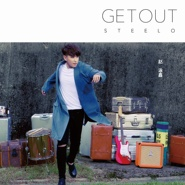

Get Out
============================

|  |  |
| :--: | :-- |
| [ Get Out](https://emumo.xiami.com/album/2100354385) | **艺人**: [赵泳鑫](../index.md) **语种**: 国语 **唱片公司**: 太合麦田 **发行时间**: 2016年07月12日 **专辑类别**: 录音室专辑 **专辑风格**:  **播放数**: 55003 **收藏数**: 75 **评论数**: 13  |

## 简介

解绑自我，独立宣言  
MIC男团 赵泳鑫 单飞不解散  
优质偶像/中西合璧/创作才华/完整态度  
2016年第一次以完整独立的姿态面对世界。  
赵泳鑫《GET OUT》创作专辑  
  
音乐分水岭 探寻多重可能性  
赵泳鑫，一个新鲜的声音。音乐才华与偶像气质共存的多面体，写词，编曲，视觉，舞蹈编配一手包办。创作人的身份让他得以用最个体化思考的方式呈现自我，一篇情话或是一种心声，都是一部分的赵泳鑫。  
  
并非从天而降的音乐天才，从小离开父母独立生活的经历，让这个敏感的处女座男生拥有与众不同的观察力，这观察不仅关于周围的人事，也包括他自己。从快速的城市生活中，提炼他的困惑，野心，爱情这些与现代人息息相关的碎片。作为承载着赵泳鑫当下思考的作品，《GET OUT》记录了当下，以四两拨千斤的巧妙手法，由点及面的展开了这幅难以归类的音乐地图。  
  
一般情况下，有野心的人出招难以控制力道，一旦用力过猛难免落入尴尬。赵泳鑫的野心，从词曲，编配，录音到后期制作的亲力亲为得以渗透，无论是飘逸灵动一气呵成的《桃之夭夭》，还是情感发泄的《Get Out》，亦或是走心内敛的《说过的不算》，以及用自我治愈的方式重新定义的《纨绔》，给予听众的都是收放自如，力道得当的愉悦听感。愤怒不需要掀翻世界才是愤怒，悲伤也不用痛哭流涕才够资格称为悲伤，拿捏得当，点到为止，是新的语言体系。  
  
以丰富多变的音乐曲风描绘着自己脑海中的随心所欲，心中满满的少年心气得以展现，无论是伤感的，快乐的，愤怒的，释怀的，每一种情绪都折射出某一面的赵泳鑫，而这一次的从心创作，无疑为脱掉“偶像的新衣”的大胆尝试。装满诚恳的自我解析和倾诉，在放纵的宣泄后，也有冷静的自我审视，这是音乐人对自己的苛刻要求，也是对听者最负责任的表达。  
  
《GET OUT》是一把打开赵泳鑫的钥匙，藉由这些充满画面感的段落可以看见一个诚实的赵泳鑫，无法表达的天才都是废材，而赵泳鑫的特别之处在于，他清楚的认识此刻的自己与当下的世界，流畅表达意图，绝不拧巴(不再纠结)自己，这是《GET OUT》的中心所在。  
  
<strong>赵泳鑫第一次以完整独立作品辑的姿态面对世界。</strong>  
GET OUT TO FIND OUT，赵泳鑫第一次以完整独立作品辑的姿态面对世界。把属于自己的音乐、才华和态度统统交出来(get out)。他的外在(outside)，优质偶像，他的音乐(inside)，中西合璧，能打入国际市场(走出去get out)。  
  
像个孩子第一次走出家(MIC)门(get out)，外面的世界躁动不安又绚烂迷人，赵泳鑫获得了自由创作的空间和灵感，却也承受了从未有过的压力——所有困惑都再有人(MIC)分担，都需要独自面对。他最终找到一个解决方案，就是解放自己(get himself out)，放手大胆尝试。有才华够努力的人，运气总不会太差。真正的自由，是把自我放出来(get out)。GET OUT走出去，是探索的开端，是一切可能性，是无法逃避的命运。

## 曲目

## 评论

|  |  |  |  |
| :-- | :-- | :-- | :-- |
|  [虾米用户](https://emumo.xiami.com/u/284314203)  2018-07-17 22:27 赞(0) 踩(0) | 
什麼時候爭取到版權啊 
 |
|  [虾米用户](https://emumo.xiami.com/u/311827204) 听治愈系的音乐 2018-01-11 09:38 赞(1) 踩(0) | 
大家去评论他的歌呗   
 |
|  [虾米用户](https://emumo.xiami.com/u/311827204) 听治愈系的音乐 2018-01-11 09:37 赞(0) 踩(0) | 
嗯，很有才华
 |
|  [虾米用户](https://emumo.xiami.com/u/311827204) 听治愈系的音乐 2018-01-11 09:36 赞(1) 踩(0) | 
好听，喜欢肥皂    
 |
|  [虾米用户](https://emumo.xiami.com/u/176373872) 声控，王者荣耀，猫神粉 2016-07-26 21:50 赞(0) 踩(0) | 
超级喜欢桃之夭夭
 |
|  [虾米用户](https://emumo.xiami.com/u/52388455)  2016-07-21 11:23 赞(0) 踩(0) | 
赵泳鑫  赵泳鑫 赵泳鑫 赵泳鑫 赵泳鑫 赵泳鑫 赵泳鑫
 |
|  [虾米用户](https://emumo.xiami.com/u/7322777) ∮ 2016-07-18 14:19 赞(0) 踩(0) | 
赵泳鑫
 |
|  [虾米用户](https://emumo.xiami.com/u/202151552)  2016-07-17 23:57 赞(0) 踩(0) | 
为什么不能听！！！
 |
|  [虾米用户](https://emumo.xiami.com/u/44019661)   2016-07-16 17:54 赞(0) 踩(0) | 
这张专辑真的很棒
 |
|  [虾米用户](https://emumo.xiami.com/u/50700666) 我还没想好要写什么... 2016-07-08 13:09 赞(1) 踩(0) | 
太帅了
 |
|  [虾米用户](https://emumo.xiami.com/u/50700666) 我还没想好要写什么... 2016-07-08 13:08 赞(1) 踩(0) | 
少爷无敌了！！！！
 |
|  [虾米用户](https://emumo.xiami.com/u/18139018) 再见啦 网易云见 KOW... 2016-06-24 23:49 赞(1) 踩(0) | 
MV太帅了 !!这首歌太好听了!!
 |
|  [虾米用户](https://emumo.xiami.com/u/18139018) 再见啦 网易云见 KOW... 2016-06-24 23:49 赞(1) 踩(0) | 
怎么没发
 |
