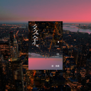

赵泳鑫
============================

|  |  |
| :--: | :-- |
| [ 赵泳鑫](https://i.xiami.com/zhaoyongxin) | **地区**: China 中国大陆 **风格**: 国语流行 Mandarin Pop, 电音流行 Electropop, 华语唱作人 Chinese Singer-Songwriter **播放数**: 228171 **粉丝数**: 763 **评论数**: 54  |

## 档案

赵泳鑫，英文名Steelo，彝族，歌手、词曲创作人、演员，内地唱跳组合MIC男团副队长，1988年8月25日出生于云南昆明，2006年被太合麦田公司选中，作为训练生进行为期四年的培训。2010年10月20日，以MIC男团成员身份正式出道，在团队中负责创作，擅长各种器乐管弦乐。2010年获得《咪咕明星学院》总冠军。 
2006年初，太合麦田启动“麻团”计划，赵泳鑫投递简历，被公司从3万人中选中，于2007年4月1日开始接受半军事化全封闭培训。公司聘用美国舞蹈老师JESSE LEE SANTOS（麦当娜编舞老师，威尔史密斯舞蹈总监）、国内舞台剧老师、北京现代舞团的首席舞者对他们在声乐、形体、舞蹈、表演等方面进行培训，在人民武装警察反恐中队锻炼斗志及团队精神。经过4年培训，赵泳鑫成为MIC男团副队长。 
2014年7月7日，小鑫发行原创个人单曲《super daddy》，包办词曲，并担当了制作人的角色。 
生日：1988年8月25日 
星座：处女座 
生肖：龙 
民族：彝族 
身高：181cm 
体重：70kg 
特长：作词、作曲、钢琴、吉他、葫芦丝、萨克斯、主持 
家乡：云南昆明 
特殊称谓：“小鑫”(所有的朋友都这么叫我) ，少爷，三金，小包子，爷.... 
兴趣爱好：篮球，足球，兵乓球，保龄球，滑雪，滑冰等等；我还喜欢看电影，家里的影碟已经接近千张；喜欢逛街购物，看到喜欢的东西就会挪不动脚步，幻想着它们都是自己的了。喜欢观看和了解各种民间艺术和民族文化。 
喜欢的颜色：黑色，白色 
喜欢的食物：火锅，辣椒酱等辣的食物 
喜欢的歌手：很多 
最遗憾的事：没有让姥爷在世时，在电视上看到我，当他离开人世时，也没有见到他最后一眼，想到这些我就特别难过

## 专辑

| 名称 | 语种 | 唱片公司 | 发行时间 | 专辑类别 | 专辑风格 |
| :--: | :-- | :-- | :-- | :-- | :-- |
| [ 完美](./albums/5021668567.md) | 国语 | 太合麦田 | 2020年10月12日 | EP, 单曲 |  |
| [ 多余](./albums/5021018645.md) | 国语 | 华宇世博 | 2019年12月13日 | EP, 单曲 | 流行 Pop |
| [ 这样的女友（网剧《出线了，初恋》插曲）](./albums/5020991264.md) | 国语 |  | 2019年05月14日 | EP, 单曲 | 流行 Pop |
| [ 躺着](./albums/2108135324.md) | 国语 | 华宇世博 | 2018年08月31日 | EP, 单曲 | 流行 Pop |
| [ Mr.Sorry](./albums/5020905768.md) | 国语 | 华宇世博 | 2018年08月24日 | EP, 单曲 | 流行 Pop |
| [ 杜英才](./albums/5020957206.md) | 国语 | 华宇世博 | 2018年08月17日 | EP, 单曲 | 流行 Pop |
| [ 自首](./albums/5020964165.md) | 国语 | 华宇世博 | 2018年08月13日 | EP, 单曲 | 流行 Pop |
| [ 稀客](./albums/5020950909.md) | 国语 | 华宇世博 | 2018年07月28日 | EP, 单曲 | 流行 Pop |
| [ 寒风（《柜中美人》片尾曲）](./albums/2108134261.md) | 其他 | AvidPlay | 2018年02月09日 | EP, 单曲 | 电子 Electronic |
| [ Get Out](./albums/2100354385.md) | 国语 | 太合麦田 | 2016年07月12日 | 录音室专辑 |  |
| [ 自作自受](./albums/2100209472.md) | 国语 | 太合麦田 | 2015年09月28日 | EP, 单曲 |  |
| [ 超想见你](./albums/5020900381.md) | 国语 |  | 2015年08月03日 | 录音室专辑 | 流行 Pop |

## 评论

|  |  |  |
| :-- | :-- | :-- |
|  [虾米用户](https://emumo.xiami.com/u/2796166) 最爱莫文蔚..... 2020-10-16 00:54 赞(1) 踩(0) | 
加油吧~不错的~你可以的~
 |
|  [虾米用户](https://emumo.xiami.com/u/358995000) 散场本是常态 尽兴而归就... 2020-06-16 11:02 赞(2) 踩(0) | 
居然有赵泳鑫
 |
|  [虾米用户](https://emumo.xiami.com/u/45177771)  2020-04-08 01:48 赞(2) 踩(0) | 
加油！你的能力迟早会发光发亮！我也一样！
 |
|  [虾米用户](https://emumo.xiami.com/u/441354160)  2020-03-12 10:47 赞(0) 踩(0) | 
来了
 |
|  [虾米用户](https://emumo.xiami.com/u/261291833) 无情言语 2018-02-11 15:06 赞(0) 踩(0) | 
实力歌手，不错！
 |
|  [虾米用户](https://emumo.xiami.com/u/345834943)  2018-02-09 21:19 赞(3) 踩(0) | 
实力加偶像，MIC最棒。 五年大麦报到
 |
|  [虾米用户](https://emumo.xiami.com/u/311827204) 听治愈系的音乐 2018-01-11 09:41 赞(3) 踩(0) | 
实力派！！很有创作能力啊 
 |
|  [虾米用户](https://emumo.xiami.com/u/293321746) 心属王源昂 2017-09-19 22:39 赞(3) 踩(0) | 
赵泳鑫 实力歌手
 |
|  [虾米用户](https://emumo.xiami.com/u/212748672)  2017-03-08 11:53 赞(3) 踩(0) | 
小鑫鑫，求抱抱
 |
|  [虾米用户](https://emumo.xiami.com/u/234286184) 在一起 2017-02-05 10:05 赞(1) 踩(0) | 
好帅
 |
|  [虾米用户](https://emumo.xiami.com/u/260167529) 爱音乐的疯子 2017-01-24 21:49 赞(2) 踩(0) | 
爱说唱的帅哥
 |
|  [虾米用户](https://emumo.xiami.com/u/262893221) 音乐 2017-01-18 18:10 赞(0) 踩(0) | 
 
 |
|  [虾米用户](https://emumo.xiami.com/u/240500606) 高娃 2016-12-26 18:42 赞(0) 踩(0) | 
我最爱的小鑫哥
 |
|  [虾米用户](https://emumo.xiami.com/u/250435281) 越努力越幸运 2016-12-20 22:34 赞(1) 踩(0) | 
世界上最好的赵泳鑫   
 |
|  [虾米用户](https://emumo.xiami.com/u/8001482)  2016-08-25 19:29 赞(0) 踩(0) | 
都不让在线听了。
 |
|  [虾米用户](https://emumo.xiami.com/u/207151196)  2016-07-31 07:55 赞(0) 踩(0) | 
喜欢
 |
|  [虾米用户](https://emumo.xiami.com/u/52138728)  2016-07-11 10:52 赞(0) 踩(0) | 
我喜欢你
 |
|  [虾米用户](https://emumo.xiami.com/u/195153032)  2016-06-28 21:37 赞(4) 踩(0) | 
他是赵泳鑫，MIC男团副队，原创歌手，实力音乐人
 |
|  [虾米用户](https://emumo.xiami.com/u/195153032)  2016-06-28 21:18 赞(2) 踩(0) | 
其实你不用太出名，我喜欢你就够
 |
|  [虾米用户](https://emumo.xiami.com/u/52551409)  2016-06-15 15:54 赞(0) 踩(0) | 
  
 |
|  [虾米用户](https://emumo.xiami.com/u/190226485)  2016-06-15 14:25 赞(1) 踩(0) | 
因为他是赵泳鑫
 |
|  [虾米用户](https://emumo.xiami.com/u/112377796)  2016-02-15 13:32 赞(0) 踩(0) | 
       
 |
|  [虾米用户](https://emumo.xiami.com/u/78555502)  2015-12-26 20:25 赞(0) 踩(0) | 
超喜欢他的
 |
|  [虾米用户](https://emumo.xiami.com/u/91963404)  2015-12-16 02:22 赞(1) 踩(0) | 
  
 |
|  [虾米用户](https://emumo.xiami.com/u/49174817)  2015-12-11 00:40 赞(2) 踩(0) | 
没想到，一喜欢，就喜欢了这么多年。
 |
|  [虾米用户](https://emumo.xiami.com/u/59008108) fly away. 2015-10-17 17:00 赞(2) 踩(0) | 
我只想说健次还好么 
 |
|  [虾米用户](https://emumo.xiami.com/u/55180357)  2015-10-01 07:30 赞(0) 踩(0) | 
我会一直陪着你，赵泳鑫 
 |
|  [虾米用户](https://emumo.xiami.com/u/61936142) TFBOYS    MI... 2015-09-08 23:13 赞(0) 踩(0) | 
啊啊啊今天下了虾米音乐，就发现了不得了的东西，这张图怎么这么帅啊
 |
|  [虾米用户](https://emumo.xiami.com/u/49174817)  2015-08-07 11:23 赞(1) 踩(0) | 
赵泳鑫。
 |
|  [虾米用户](https://emumo.xiami.com/u/54371280)  2015-08-03 14:11 赞(2) 踩(0) | 
实力派 作词作曲钢琴 bass的super daddy
 |
|  [虾米用户](https://emumo.xiami.com/u/52062295) 毕竟是你不是我  。 2015-07-31 06:51 赞(0) 踩(0) | 
三金，来报道了
 |
|  [虾米用户](https://emumo.xiami.com/u/50439626) 喜欢你 往后的日子也都喜... 2015-06-18 21:47 赞(0) 踩(0) | 
男神啊
 |
|  [虾米用户](https://emumo.xiami.com/u/13079927) 保持热爱 奔赴山海 2015-04-15 19:50 赞(1) 踩(0) | 
三金以后可以不用那么拼了，可以靠bass颐养天年。
 |
|  [虾米用户](https://emumo.xiami.com/u/48944459) 辫子永远7点钟方向，颜值... 2015-04-06 13:25 赞(1) 踩(0) | 
鑫爷～来这里报个到～ 
 |
|  [虾米用户](https://emumo.xiami.com/u/16080815) 我还没想好要写什么... 2015-01-22 11:57 赞(1) 踩(0) | 
哥哥你是我们的骄傲TT..
 |
|  [虾米用户](https://emumo.xiami.com/u/43713963)  2015-01-01 17:51 赞(2) 踩(0) | 
我的命，我男神是欧美范，不走韩流！长得妖娆是我们的资本！大麦走起！！
 |
|  [虾米用户](https://emumo.xiami.com/u/11935616)  2014-12-31 12:04 赞(0) 踩(0) | 
林宥嘉如果是娘娘，那你就是他妹妹。
 |
|  [虾米用户](https://emumo.xiami.com/u/44026620)   2014-11-29 22:49 赞(0) 踩(0) | 
加油！喜欢你们好久~了呢
 |
|  [虾米用户](https://emumo.xiami.com/u/44026620)   2014-11-29 22:47 赞(0) 踩(0) | 
他们组合棒棒哒
 |
|  [虾米用户](https://emumo.xiami.com/u/44026620)   2014-11-29 22:46 赞(1) 踩(0) | 
他们组合棒棒哒
 |
|  [虾米用户](https://emumo.xiami.com/u/2893125)  2014-09-05 09:22 赞(0) 踩(0) | 
第一嗓被惊艳到了。。。
 |
|  [虾米用户](https://emumo.xiami.com/u/753582)  2014-08-31 05:16 赞(2) 踩(0) | 
N年看电视认识MIC男团 ，但是对这种又唱又跳的韩国模子男团并不感冒，主要是年龄不再了。不是鄙视的意思。我小学的时候也很崇拜当时很火的韩国HOT组合。  现在听音乐的风格和方向都变了，无意听到《不想见你》赵泳鑫  这首歌，还是觉得很棒。。。。  我很少听流行歌却喜欢这首。。。。。加油，小伙子！
 |
| ⇒ |  [虾米用户](https://emumo.xiami.com/u/311827204) 听治愈系的音乐 2018-01-11 09:43 赞(0) 踩(0) | 
中国男团，走的是欧美范的  
 |
|  [虾米用户](https://emumo.xiami.com/u/10307324) 绝望，希望-同样给予动力 2014-08-27 18:20 赞(1) 踩(0) | 
超级棒的、小鑫Steelo我们大麦永远支持你！
 |
|  [虾米用户](https://emumo.xiami.com/u/23263260)  2014-08-08 11:05 赞(0) 踩(0) | 
看他的现场和MV，为什么表情和动作这么像权志龙？
 |
| ⇒ |  [虾米用户](https://emumo.xiami.com/u/10307324) 绝望，希望-同样给予动力 2014-08-27 18:19 赞(0) 踩(0) | 
呵呵、
 |
|  [虾米用户](https://emumo.xiami.com/u/36082973) 大家好我是凉君老婆 谢谢... 2014-08-01 23:00 赞(0) 踩(0) | 
小鑫唱功很棒的 好好唱歌啊小鑫不要变成韩星那种东西啊QAQ
 |
|  [虾米用户](https://emumo.xiami.com/u/36082973) 大家好我是凉君老婆 谢谢... 2014-08-01 22:55 赞(0) 踩(0) | 
男神！！
 |
|  [虾米用户](https://emumo.xiami.com/u/38924820)  2014-07-24 23:57 赞(0) 踩(0) | 
挺不错啊
 |
|  [虾米用户](https://emumo.xiami.com/u/1271807)  2014-07-22 21:09 赞(0) 踩(0) | 
忽然觉得挺有趣的么
 |
|  [虾米用户](https://emumo.xiami.com/u/60496)  2014-07-20 08:43 赞(0) 踩(0) | 
觉得再也不用担心被别人说“为什么听棒子歌”了
 |
|  [虾米用户](https://emumo.xiami.com/u/28156375) 你没说 2014-07-10 07:49 赞(1) 踩(0) | 
就觉得长得太妖娆了这男的～
 |
|  [虾米用户](https://emumo.xiami.com/u/5737411) rice maple 2014-07-08 16:59 赞(0) 踩(0) | 
小鑫呀~
 |
|  [虾米用户](https://emumo.xiami.com/u/6630660) 猜赢涂口红… 2014-07-08 10:37 赞(1) 踩(0) | 
沙花！
 |
